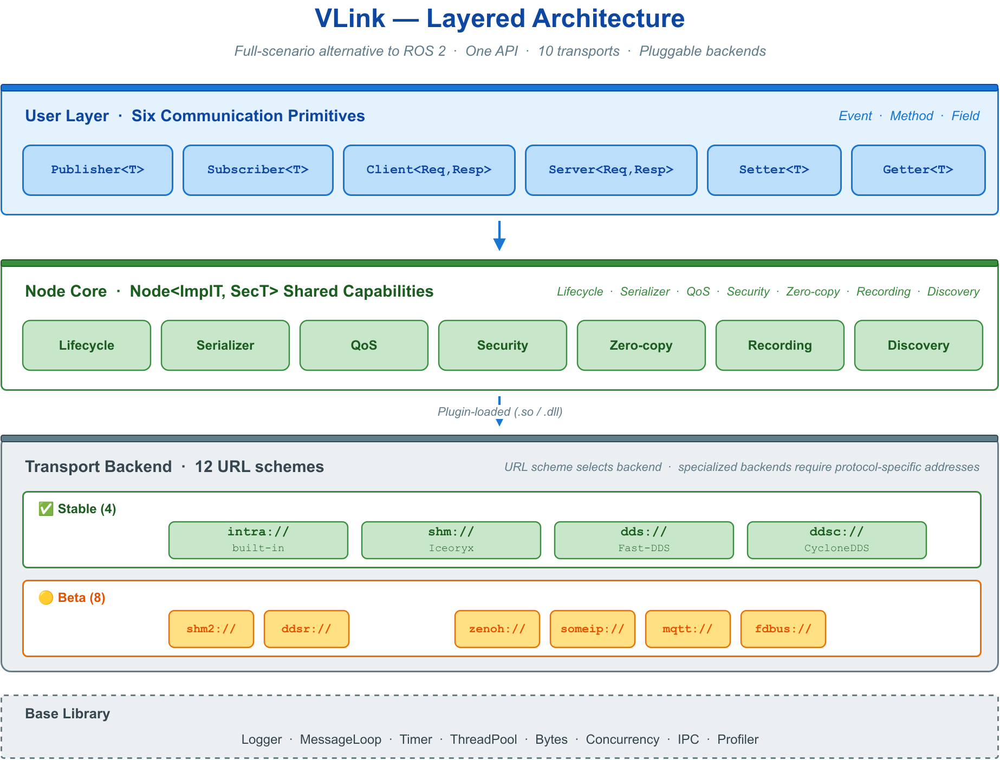
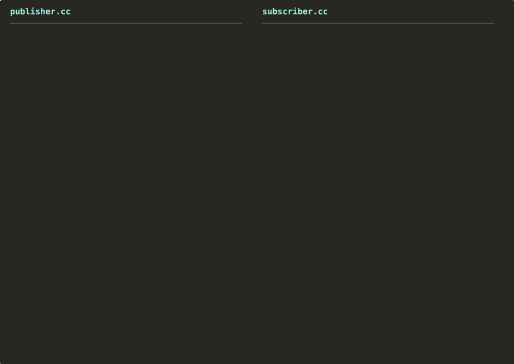

# VLink


   

[](https://github.com/thun-res/vlink/actions/workflows/ci-lint.yml) [](https://github.com/thun-res/vlink/actions/workflows/ci-test.yml) [](https://thun-res.github.io/vlink/coverage/) [](https://thun-res.github.io/vlink/bench/)

English | [中文](README.md) · [Website](https://vlink.work) · [Documentation](doc/00-overview.md)

VLink is a high-performance C++17 communication middleware for autonomous driving and embodied intelligence, positioned as a full-scenario alternative to ROS 2. A single type-safe API covers intra-process, shared-memory, automotive-Ethernet, and cross-machine communication, reducing a backend change to editing a URL prefix while application code stays untouched.

The current release supports 12 transport backends, 14 serialization formats, 3 communication models with 6 core primitives, plus security, recording/playback, service discovery, 10 CLI tools, and Foxglove / Rerun visualization bridges.



---

## 🧩 Core Abstraction: the URL as a Communication Contract

VLink's entire design centers on one abstraction: a communication is defined by a model, a URL, and a core method; the backend is an implementation detail of the URL prefix and is invisible to application logic.

```
<scheme>://<topic_name>[?params]
```

The `scheme` selects the backend; switching backends requires only changing the prefix, leaving application code unchanged:

```cpp
vlink::Publisher<Imu> pub("intra://sensor/imu");  // intra-process
vlink::Publisher<Imu> pub("shm://sensor/imu");    // same-host zero-copy
vlink::Publisher<Imu> pub("dds://sensor/imu");    // cross-machine
```

This yields three engineering benefits: application logic is decoupled from transport; end-to-end tests run in a single process over `intra://`; deployment topology is determined by configuration rather than source.

---

## 📡 Communication Models

VLink provides three communication models with six core primitives, chosen by communication semantics independent of the backend.


**Event — publish / subscribe**

```cpp
vlink::Publisher<Imu> publisher("dds://sensor/imu");
publisher.publish(msg);

vlink::Subscriber<Imu> subscriber("dds://sensor/imu");
subscriber.listen([](const Imu& msg) { process(msg); });
```

**Method — request / response**

```cpp
vlink::Server<Req, Resp> server("dds://calc/add");
server.listen([](const Req& req, Resp& resp) { resp.set_sum(req.left() + req.right()); });

vlink::Client<Req, Resp> client("dds://calc/add");
if (auto resp = client.invoke(req, std::chrono::seconds(3))) { use(*resp); }
```

**Field — state synchronization**

```cpp
vlink::Setter<Status> setter("shm://vehicle/status");
setter.set(status);

vlink::Getter<Status> getter("shm://vehicle/status");
getter.listen([](const Status& s) { use(s); });
```

| Model | Semantics | Primitives | Typical use |
| --- | --- | --- | --- |
| Event | publish/subscribe | `Publisher<T>` / `Subscriber<T>` | sensor streams, perception broadcast |
| Method | request/response | `Client<Req,Resp>` / `Server<Req,Resp>` | map queries, parameter access, services |
| Field | state sync | `Setter<T>` / `Getter<T>` | vehicle state, configuration, calibration |

---

## 🚌 Transport Backends

| Scheme | Underlying | Scope | Zero-copy | Status |
| --- | --- | --- | :---: | :---: |
| `intra://` | built-in queue | intra-process | yes | stable |
| `shm://` | Iceoryx | same-host | yes | stable |
| `dds://` | Fast-DDS | cross-machine | no | stable |
| `ddsc://` | CycloneDDS | cross-machine | no | stable |
| `shm2://` | Iceoryx2 | same-host | yes | beta |
| `ddsr://` | RTI Connext | cross-machine | no | beta |
| `ddst://` | domestic DDS | cross-machine | no | beta |
| `zenoh://` | Zenoh | cross-machine / edge | conditional | beta |
| `someip://` | vsomeip | automotive Ethernet | no | beta |
| `mqtt://` | Paho MQTT | cloud | no | beta |
| `fdbus://` | FDBus | same-host | no | beta |
| `qnx://` | QNX IPC | same-host (QNX) | no | beta |

URL syntax, query parameters, and per-backend notes are in [Transport Backends and URL](doc/04-transport.md).

---

## 🚀 Getting Started



Building with [VKit](https://github.com/thun-res/vkit) is recommended. VKit integrates multi-repository source fetching, cross-platform toolchain distribution, layered component orchestration, and packaging into a single pipeline that builds VLink with identical commands on Linux / QNX / Android / macOS / Windows, depending only on Bash and CMake.

```bash
git clone https://github.com/thun-res/vkit.git && cd vkit
make import_full      # fetch middleware sources: vmsgs and vlink
make                  # build, deploy, and produce a runtime package
```

VLink can also be integrated into an existing CMake project:

```cmake
find_package(vlink REQUIRED COMPONENTS shm dds)
target_link_libraries(my_app PRIVATE vlink::vlink vlink::shm vlink::dds)
```

Full build, cross-compilation, and integration details are in [Build and Integration](doc/01-started.md).

---

## 🧰 Ecosystem

VLink comprises three coordinated repositories:

| Repository | Role | URL |
| --- | --- | --- |
| VLink | the communication middleware (this repository) | <https://github.com/thun-res/vlink> |
| VKit | cross-platform build and release toolkit | <https://github.com/thun-res/vkit> |
| VMsgs | standard message definitions for perception / planning / localization / map, etc. (Protobuf / FlatBuffers) | <https://github.com/thun-res/vmsgs> |

---

## 📚 Documentation

> 📄 **[VLink Whitepaper](doc/00-whitepaper.md)** — a full academic treatment of industry background, technical argumentation, comparison, and performance analysis.

The following is a 16-part learning path, best read in order.

**Introduction**

| Document | Content |
| --- | --- |
| [0. Overview and Design Philosophy](doc/00-overview.md) | positioning, core abstraction (URL as contract), architecture, capabilities |
| [1. Getting Started](doc/01-started.md) | VKit build, first program, examples guide |

**Core**

| Document | Content |
| --- | --- |
| [2. Communication Models](doc/02-communication.md) | node base and the Event / Method / Field models |
| [3. Serialization](doc/03-serialization.md) | type-driven automatic serialization |

**Transport and Capabilities**

| Document | Content |
| --- | --- |
| [4. Transport and URL](doc/04-transport.md) | 12 backends and URL specification |
| [5. QoS](doc/05-qos.md) | quality-of-service policies and profiles |
| [6. Zero-Copy](doc/06-zerocopy.md) | loan interface and perception data containers |
| [7. Security](doc/07-security.md) | message-level encryption and key management |
| [8. Base Library](doc/08-base-library.md) | Logger / MessageLoop / Timer / ThreadPool, etc. |
| [9. Recording and Playback](doc/09-recording.md) | Bag / MCAP formats and API |

**Tools and Operations**

| Document | Content |
| --- | --- |
| [10. CLI Tools](doc/10-cli-tools.md) | 10 command-line tools |
| [11. Visualization (Viewer / WebViz)](doc/11-visualization.md) | desktop Viewer and Foxglove / Rerun bridges |
| [12. Discovery and Proxy Monitoring](doc/12-observability.md) | topology discovery and cross-segment observation |

**Integration and Reference**

| Document | Content |
| --- | --- |
| [13. Integration and Extension](doc/13-integration.md) | C API, plugin system, environment variables |
| [14. Cheatsheet and Troubleshooting](doc/14-reference.md) | single-page API/URL/QoS/CLI reference and symptom index |
| [15. Testing and Contributing](doc/15-contributing.md) | test framework and contribution workflow |

---

## 📊 Project Reports

VLink automatically runs benchmarks and coverage analysis on every release and publishes the full reports.

| Report | Online report | Wiki summary |
| --- | --- | --- |
| 🚀 Benchmarks (vlink-bench) | [View online](https://thun-res.github.io/vlink/bench/) | [Benchmarks](https://github.com/thun-res/vlink/wiki/Benchmarks) |
| 🧪 Code coverage | [View online](https://thun-res.github.io/vlink/coverage/) | [Coverage](https://github.com/thun-res/vlink/wiki/Coverage) |

---

## 💻 Platform Support

| Platform | Architecture | Compiler | Status |
| --- | --- | --- | :---: |
| Linux | x86_64 / aarch64 | GCC 9+ / Clang 10+ | stable |
| QNX 7.x / 8.x | aarch64 / x86_64 | QCC (QNX SDP) | stable |
| Android | aarch64 / x86_64 | NDK Clang r25+ | stable |
| Windows 10+ | x86_64 | MSVC 2019+ / MinGW | stable |
| macOS 10.15+ | x86_64 / arm64 | AppleClang 12+ | beta |

---

## 📁 Project Layout

```
vlink/
├── include/vlink/   public headers (6 primitives + base library + extensions + zero-copy)
├── src/             core library implementation
├── modules/         12 transport backend implementations
├── cli/             10 command-line tools
├── proxy/           ProxyServer / ProxyAPI
├── viewer/          Qt desktop visualization tools
├── webviz/          Foxglove / Rerun bridges
├── c_api/           C API (for Python / Rust FFI)
├── python_api/      nanobind Python bindings
├── examples/        usage examples (14 categories, 29 projects)
├── test/            test suite
├── doc/             documentation
└── CMakeLists.txt   top-level CMake entry
```

---

## 🤝 Contributing

VLink is maintained by Thun Lu. PRs, issues, and documentation improvements are welcome. Please read the [Contributing guide](doc/15-contributing.md) before submitting.

## 📜 License

[Apache License 2.0](LICENSE) — free for commercial use.

Copyright (C) 2026 Thun Lu. All rights reserved.
