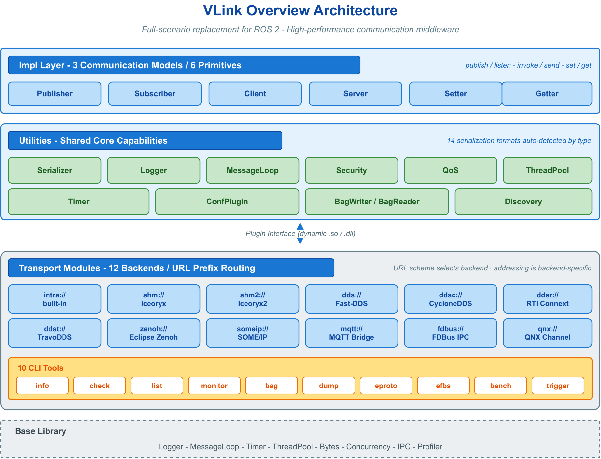
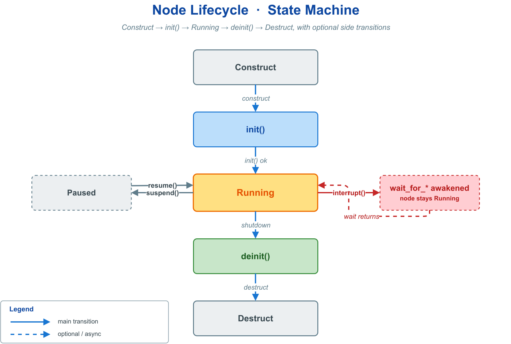
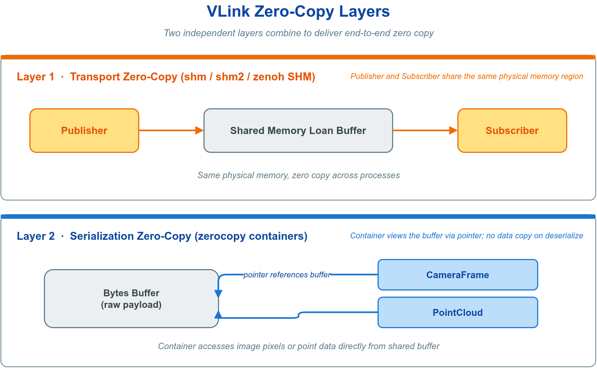

# 📘 0. 概述与设计哲学

VLink 是面向自动驾驶与具身智能的高性能通信中间件，定位为 ROS 2 的全场景替代方案。其核心设计目标是：用一套类型安全的统一 API 覆盖进程内、共享内存、车载以太网与跨机网络；后端由 URL 选择，迁移时按目标后端调整地址和必要参数，而通信原语与主要业务逻辑保持不变。

- 官方网站：<https://vlink.work>
- 代码仓库：<https://github.com/thun-res/vlink>



本章建立理解 VLink 所需的完整概念模型，并给出各能力的入口；具体接口与用法见各专章。

---

## 🎯 0.1 问题域与设计立场

智能系统的通信存在结构性矛盾：单机内部追求零拷贝与纳秒级延迟，车载域控依赖 SOME/IP 等服务化协议，跨机协同依赖 DDS，而云边链路又需要 MQTT/Zenoh。传统做法是为每种后端引入一套独立 API，导致业务代码与传输实现强耦合——更换后端意味着重写通信层，单元测试难以脱离真实中间件，部署拓扑被固化在源码中。

VLink 的设计立场是以**统一抽象消解后端碎片化**。它不自研传输协议，而是在成熟后端（Iceoryx、Fast-DDS、CycloneDDS、vsomeip、Zenoh 等）之上建立一致的编程模型，使应用只面对三类语义清晰的通信原语，后端选择被收敛为一个可配置参数。

| 维度     | 传统多栈方案           | VLink                     |
| -------- | ---------------------- | ------------------------- |
| 后端更换 | 重写通信层             | 修改 URL / 后端参数       |
| 序列化   | 手工选择并调用编解码器 | 按消息类型编译期自动推导  |
| 测试     | 依赖真实中间件         | 进程内后端即可端到端验证  |
| 部署拓扑 | 编码在源码             | 由 URL / 配置注入         |

---

## 🔗 0.2 核心抽象：URL 即通信契约

VLink 的全部设计围绕一个中心抽象展开：**一次通信由"通信模型 + URL + 核心方法"三要素确定，后端是 URL 前缀的实现细节，对业务逻辑不可见。**

```text
<scheme>://<topic_name>[?参数]
```

`scheme` 决定传输后端，后续地址和可选参数按后端解释。对于地址模型兼容的 topic 后端（如 intra、SHM、DDS、Zenoh），同一段业务代码通常只需改变 `scheme`；SOME/IP、MQTT、FDBUS 等后端还须提供各自合法的完整地址和查询参数：

```cpp
vlink::Publisher<Frame> pub("intra://sensor/camera");  // 进程内
vlink::Publisher<Frame> pub("shm://sensor/camera");    // 同机共享内存（支持 loan）
vlink::Publisher<Frame> pub("dds://sensor/camera");    // 跨机网络
```


这一契约带来三项工程收益：

- **解耦**：应用逻辑与传输实现分离，通信代码可独立演进。
- **可测试**：用 `intra://` 在单进程内完成端到端验证，无需部署中间件。
- **部署弹性**：开发、集成、量产可使用不同后端，由配置而非源码决定。

后续的序列化、QoS、安全、零拷贝等能力，均服从这一契约——它们要么由消息类型在编译期自动确定，要么以 URL 参数或节点变体的形式接入，始终不破坏"业务代码不感知后端"的不变量。

---

## 📡 0.3 通信模型与核心原语

VLink 提供三种通信模型，对应六个核心原语。模型的选择由通信语义决定，与后端无关。


| 模型       | 语义                       | 原语                                   | 方向       | 典型场景                 |
| ---------- | -------------------------- | -------------------------------------- | ---------- | ------------------------ |
| 事件 Event | 发布/订阅，最新及历史数据流 | `Publisher<T>` / `Subscriber<T>`       | 单向，多对多 | 传感器数据、感知结果广播 |
| 方法 Method | 请求/响应，远程过程调用     | `Client<Req,Resp>` / `Server<Req,Resp>` | 双向，N 对 1 | 地图查询、参数读写、服务调用 |
| 字段 Field | 状态同步，最新值语义       | `Setter<T>` / `Getter<T>`              | 双向，多对多 | 车辆状态、配置参数、标定值 |

模型间的关键区别在于状态语义与响应方式：

- **事件模型**不保留状态，订阅者仅接收订阅之后产生的数据，因而适用于数据持续流动、一对多广播、消费者不要求历史一致的场景（历史可见性由 QoS 的 Durability 控制）。
- **字段模型**表达最新值语义，`Getter` 缓存最近一次收到的值；后加入者能否立即补到当前值取决于后端与 durability/QoS，使用前应以 `wait_for_value()` 确认，适用于只关心当前状态的场景。
- **方法模型**提供请求/响应闭环，适用于需要返回值的请求；当 `Resp` 为空类型时退化为单向的 fire-and-forget 调用。

上述语义差异即为模型选型判据。三种模型的完整接口与节点生命周期见 [通信模型](02-communication.md)。

---

## 🚀 0.4 快速开始

以事件模型为例，发布端与订阅端各数行即可建立通信。`create_unique` 为推荐的工厂入口，构造时即完成初始化。

```cpp
#include "vlink/vlink.h"

// 订阅端：listen 仅可注册一次；回调入参仅在回调内有效，需外带时先复制
auto sub = vlink::Subscriber<std::string>::create_unique("intra://chat/room");
sub->listen([](const std::string& msg) { VLOG_I("recv: ", msg); });

// 发布端
auto pub = vlink::Publisher<std::string>::create_unique("intra://chat/room");
pub->wait_for_subscribers(std::chrono::milliseconds(500));  // 等待订阅者就绪
pub->publish("hello vlink");
```

依 [0.2 URL 即通信契约](#-02-核心抽象url-即通信契约)，把上述 URL 改为相同 topic 的 `shm://chat/room` 或 `dds://chat/room`，即可在不改业务处理逻辑的情况下迁移到跨进程或跨机器后端。完整可运行示例见 [快速开始](01-started.md) 与 `examples/quickstart/hello_pubsub/`。

---

## 🧱 0.5 分层架构

VLink 采用严格分层，每层只依赖其下一层，后端差异被隔离在传输层之内。

| 层         | 职责                                                            |
| ---------- | --------------------------------------------------------------- |
| 应用层     | 业务逻辑，仅使用六个通信原语                                     |
| 原语层     | Publisher/Subscriber/Client/Server/Setter/Getter，提供统一 API 与生命周期 |
| 序列化层   | 按消息类型编译期推导编解码策略                                   |
| 传输抽象层 | URL 解析、后端选择、QoS 映射、零拷贝借贷                         |
| 后端实现层 | Iceoryx、Fast-DDS、CycloneDDS、vsomeip、Zenoh 等                |

六个原语共享统一的节点基类，具有一致的构造、初始化、绑定事件循环与析构语义：



节点默认在构造时初始化（`InitType::kWithInit`）；需要在初始化前调整配置时使用延迟初始化（`InitType::kWithoutInit`）。节点基类与生命周期见 [通信模型](02-communication.md)。

中间件在系统软件栈中处于基础层与业务层之间，其抽象质量直接决定上层开发效率与系统性能上限。

---

## 🧬 0.6 消息类型与序列化

VLink 将消息类型作为原语的模板参数，序列化策略由该类型在编译期推导，调用方无需手工选择或注册编解码器；不受支持的类型在编译期报错而非运行期失败。

支持的类型族覆盖常见工程需求：

| 类型族                 | 适用场景                                                    |
| ---------------------- | --------------------------------------------------------- |
| POD 结构体             | 数值型小消息（IMU、控制指令），无编码转换、直接内存复制      |
| `vlink::Bytes`         | 原始字节、自定义二进制协议、图像帧                          |
| Protobuf               | 跨语言、字段可扩展的通用消息                                |
| FlatBuffers            | 大型结构化消息，支持零拷贝读取                              |
| CDR                    | 与原生 DDS 类型互操作                                       |
| `std::string` / 自定义 | 文本消息；通过重载 `operator>>`/`operator<<` 接入私有协议   |

序列化机制、自定义编解码与选型见 [消息序列化](03-serialization.md)。

---

## ⚙️ 0.7 关键能力

下列能力均以不破坏 URL 契约（见 [0.2](#-02-核心抽象url-即通信契约)）的方式接入：或由消息类型自动确定，或以 URL 参数、节点变体的形式声明。

**传输后端**　12 种后端覆盖进程内到跨机网络的全部范围，由 URL 前缀选择。

| 前缀                              | 底层               | 通信范围          | 零拷贝 | 状态 |
| --------------------------------- | ------------------ | ----------------- | :----: | :--: |
| `intra://`                        | 内置队列           | 进程内            | 是     | 稳定 |
| `shm://`                          | Iceoryx            | 同机跨进程        | 是     | 稳定 |
| `dds://`                          | Fast-DDS           | 跨机网络          | 否     | 稳定 |
| `ddsc://`                         | CycloneDDS         | 跨机网络          | 否     | 稳定 |
| `shm2://`                         | Iceoryx2           | 同机跨进程        | 是     | Beta |
| `ddsr://` / `ddst://`             | RTI / 国产 DDS     | 跨机网络          | 否     | Beta |
| `zenoh://`                        | Zenoh              | 跨机 / 云边       | 条件   | Beta |
| `someip://`                       | vsomeip            | 车载以太网        | 否     | Beta |
| `fdbus://` / `mqtt://` / `qnx://` | FDBus / MQTT / QNX | 同机 / 云端 / QNX | 否     | Beta |

详见 [传输后端与 URL](04-transport.md)。

**QoS 服务质量**　控制可靠性、历史深度、持久化等投递行为。最常用方式是在 URL 中引用预定义 profile：`dds://sensor?qos=sensor`。详见 [QoS 配置](05-qos.md)。

**零拷贝传输**　`shm://` 等借贷型后端通过 `loan()`/`return_loan()` 在共享内存中直接构造消息，避免序列化拷贝；并提供 CameraFrame、PointCloud、OccupancyGrid、Tensor 等面向感知的零拷贝容器。详见 [零拷贝](06-zerocopy.md)。



**安全加密**　以 `SecurityPublisher<T>` 等节点变体接入，构造时传入密钥或配置，加密发生在序列化之后、传输之前，对上层透明。支持对称密钥、RSA 非对称与自定义回调。详见 [安全加密](07-security.md)。

**录制与回放**　受支持的节点和序列化路径可用 `set_record_path()` 自动录制消息；`.vdb` 格式紧凑，`.vcap`（MCAP）可由 Foxglove 直接打开。详见 [录制与回放](09-recording.md)。

**拓扑上报**　DiscoveryReporter 基于 UDP 组播上报活跃节点、话题与传输类型，供 CLI/Viewer 观察；各传输后端仍使用自己的数据面发现或连接机制。详见 [可观测性](12-observability.md)。

**基础库**　Logger、MessageLoop、Timer、ThreadPool、Bytes 等高性能组件可独立使用。详见 [基础库](08-base-library.md)。

---

## 🧩 0.8 核心 API

六原语均推荐经 `create_unique(url)` / `create_shared(url)` 工厂构造，亦可直接构造。下表仅列高频接口。

**事件模型**

| 原语            | 方法                            | 语义                                                       |
| --------------- | ------------------------------- | ---------------------------------------------------------- |
| `Publisher<T>`  | `publish(msg, force=false)`     | 序列化并发出一条消息；`force=false` 时无订阅者则跳过        |
|                 | `wait_for_subscribers(timeout)` | 阻塞等待至少一个订阅者                                      |
|                 | `has_subscribers()`             | 非阻塞查询订阅者是否在线                                    |
| `Subscriber<T>` | `listen(cb)`                    | 注册 `void(const T&)` 回调，每条消息触发一次，仅可调用一次  |

**方法模型**

| 原语               | 方法                                              | 语义                       |
| ------------------ | ------------------------------------------------- | -------------------------- |
| `Client<Req,Resp>` | `invoke(req, resp, timeout)`                      | 同步调用，出参返回响应     |
|                    | `invoke(req, timeout) -> optional<Resp>`          | 同步调用，超时返回 `nullopt` |
|                    | `async_invoke(req) -> future<Resp>`               | 异步调用，经 future 获取结果 |
|                    | `send(req)`                                       | 单向调用，仅当 `Resp` 为空类型 |
|                    | `wait_for_connected(timeout)` / `is_connected()`  | 等待 / 查询服务端就绪      |
| `Server<Req,Resp>` | `listen(void(const Req&, Resp&))`                 | 同步处理，填充 `resp`      |
|                    | `listen_for_reply(cb)` + `reply(req_id, resp)`    | 延迟异步回复               |

**字段模型**

| 原语        | 方法                          | 语义                                        |
| ----------- | ----------------------------- | ------------------------------------------- |
| `Setter<T>` | `set(value)`                  | 写入最新值并广播；迟到补送随后端与 QoS       |
| `Getter<T>` | `get() -> optional<T>`        | 读取最新缓存值，首次写入前返回 `nullopt`     |
|             | `wait_for_value(timeout)`     | 阻塞至收到值                                 |
|             | `listen(cb)`                  | 每次更新触发 `void(const T&)`                |
|             | `set_change_reporting(true)`  | 仅在值变化时触发回调                         |

完整 API 速查见 [速查与故障排查](14-reference.md)。

---

## 🧭 0.9 选型决策

**通信模型**按语义选择，判据见 [0.3 模型间的关键区别](#-03-通信模型与核心原语)。

**传输后端**按部署拓扑与负载选择：


| 部署条件                       | 推荐后端                         | 依据             |
| ------------------------------ | -------------------------------- | ---------------- |
| 同进程模块间高频传递           | `intra://`                       | 开销接近函数调用 |
| 同机跨进程、大负载（图像/点云） | `shm://`                         | 共享内存 + transport loan |
| 跨机网络通用场景               | `dds://`（完整）/ `ddsc://`（轻量） | 标准 DDS 互通    |
| 车载 ECU 服务化                | `someip://`                      | 车载以太网服务协议 |
| 云边协同 / 云端桥接            | `zenoh://` / `mqtt://`           | 广域网友好       |

得益于统一 API，上述选择可在开发、集成、量产阶段切换；通常只需调整节点 URL 与后端部署配置，无需重写主要业务逻辑。

---

## 🛠️ 0.10 工具链与可视化

VLink 自带命令行工具与可视化套件，覆盖发现、监控、录制、调试与性能分析，无需第三方桥接。

| 工具            | 用途                          |
| --------------- | ----------------------------- |
| `vlink-info`    | 查看版本、构建时间戳与编译选项   |
| `vlink-check`   | 环境与依赖自检                 |
| `vlink-list`    | 列出活跃节点与话题             |
| `vlink-monitor` | 终端内实时监控话题频率与延迟   |
| `vlink-bag`     | 录制、回放与运维消息数据包      |
| `vlink-trigger` | 内存触发录制（EDR），事件触发时落盘前后窗口 |
| `vlink-dump`    | 以多种格式打印消息             |
| `vlink-eproto` / `vlink-efbs` | 终端内解析显示 Protobuf / FlatBuffers 消息 |
| `vlink-bench`   | 延迟与吞吐基准测试             |

上表共十个命令行工具，详见 [CLI 工具](10-cli-tools.md)。

桌面可视化套件包含 `vlink-viewer`（实时监控）、`vlink-player`（回放）、`vlink-analyzer`（数据分析），支持相机图像与三维点云。桌面 Viewer 与 Web 可视化（`vlink-foxglove`/`vlink-rerun`，将实时数据桥接至 Foxglove Studio 与 Rerun）均见 [可视化](11-visualization.md)。

---

## 🌐 0.11 跨平台与性能

VLink 在 Linux、QNX、Android、macOS、Windows 上提供一致的通信抽象，覆盖 x86_64 与 aarch64 等架构。

| 平台         | 架构             | 编译器             | 状态 |
| ------------ | ---------------- | ------------------ | :--: |
| Linux        | x86_64 / aarch64 | GCC 9+ / Clang 10+ | 稳定 |
| QNX 7.x/8.x  | aarch64 / x86_64 | QCC                | 稳定 |
| Android      | aarch64 / x86_64 | NDK Clang r25+     | 稳定 |
| Windows 10+  | x86_64           | MSVC 2019+ / MinGW | 稳定 |
| macOS 10.15+ | x86_64 / arm64   | AppleClang 12+     | Beta |

延迟特征由后端与消息路径共同决定：`intra://...#direct` 配合 `shared_ptr<IntraDataType>` 可接近同步函数分发；`shm://` 中业务直接写 transport loan 时，大负载发布后仅传递共享内存引用。普通类型仍可能序列化或复制，量化结果须在目标平台实测，复现方法见 [测试与贡献](15-contributing.md)。

---

## ⚖️ 0.12 与 ROS 2 / DDS 的比较

下表中"支持"指原生提供，"部分"指需扩展或实验特性，"不支持"指框架本身不提供。

| 维度         | VLink                         | ROS 2               | Fast-DDS | SOME/IP | Zenoh |
| ------------ | ----------------------------- | ------------------- | -------- | ------- | ----- |
| 多后端切换   | 支持（改 URL / 后端参数）     | 部分（以 DDS 为主） | 不支持   | 不支持  | 部分  |
| API 复杂度   | 低（六原语）                  | 中（需继承 Node）   | 高       | 高      | 低    |
| 零拷贝       | 条件支持（SHM loan / Intra 共享指针直达路径） | 部分（进程内） | 部分 | 不支持 | 部分 |
| 多序列化格式 | 支持                          | 部分（以 CDR 为主） | 部分     | 不支持  | 不支持 |
| 工具链       | 支持（CLI + Viewer + WebViz） | 支持（生态丰富）    | 部分     | 部分    | 部分  |
| 嵌入式可裁剪 | 支持                          | 部分（依赖较多）    | 部分     | 部分    | 支持  |
| 多语言       | 支持（C API + Python）        | 支持                | 部分     | 不支持  | 支持  |

VLink 与 ROS 2 的定位差异在于：ROS 2 是完整的机器人操作系统生态，VLink 专注通信层，以更低的抽象开销与更灵活的后端选择全面覆盖各类通信场景，可作为 ROS 2 通信栈的全场景替代，并能与 ROS 2 共存桥接。

---

## 🧰 0.13 工程生态与构建

VLink 由三个协同的仓库构成：

| 仓库  | 职责                                         | 地址                                |
| ----- | -------------------------------------------- | ----------------------------------- |
| VLink | 通信中间件本体                               | <https://github.com/thun-res/vlink> |
| VKit  | 跨平台构建与发布套件                         | <https://github.com/thun-res/vkit>  |
| VMsgs | 标准消息定义库（感知/规划/定位/地图等领域）   | <https://github.com/thun-res/vmsgs> |

**推荐使用 VKit 构建 VLink。** VKit 将多仓库源码拉取、跨平台工具链分发、分层组件编排、增量缓存与 SDK/Runtime 打包整合为统一流水线，在 Linux、QNX、Android、macOS、Windows 上以相同命令完成构建与交付，且仅依赖 Bash 与 CMake。从零编译 VLink：

```bash
git clone https://github.com/thun-res/vkit.git && cd vkit
make import_full      # 拉取 middleware 源码：vmsgs 与 vlink
make                  # 编译、部署并生成 runtime 包
```

VKit 同时提供 AOSP 风格的单组件迭代（`mm`/`mmm`）。构建细节、standalone CMake 集成与 `find_package` 用法见 [快速开始](01-started.md)。

vmsgs 以 Protobuf 与 FlatBuffers schema 提供上述领域的标准消息定义，可直接作为 VLink 各通信原语的消息类型复用，避免跨工程重复定义。

---

## 📚 0.14 文档导航

文档按从概念到工程落地的顺序组织。建议初次阅读按编号顺序通读 00–05，再按需深入后续专题。

| 编号 | 文档                                    | 内容                                                  |
| :--: | --------------------------------------- | ----------------------------------------------------- |
| 00   | [概述与设计哲学](00-overview.md)        | 设计立场、URL 契约、通信模型总览、能力索引（本篇）     |
| 01   | [快速开始](01-started.md)               | 构建与集成、find_package、最小可运行示例               |
| 02   | [通信模型](02-communication.md)         | 节点生命周期与事件 / 方法 / 字段三模型完整接口         |
| 03   | [消息序列化](03-serialization.md)       | 类型自动推导、支持的类型族、自定义编解码               |
| 04   | [传输后端与 URL](04-transport.md)       | 12 种后端与 URL 解析、后端选择                         |
| 05   | [QoS 配置](05-qos.md)                   | QoS profile 与可靠性 / 历史 / 持久化                   |
| 06   | [零拷贝](06-zerocopy.md)                | 借贷型零拷贝、感知容器                                 |
| 07   | [安全加密](07-security.md)              | 加密管线、密钥与传输安全                               |
| 08   | [基础库](08-base-library.md)            | Logger、MessageLoop、Timer、ThreadPool、Bytes         |
| 09   | [录制与回放](09-recording.md)           | `.vdb` / `.vcap` 录制、节点级录制、回放与转换          |
| 10   | [CLI 工具](10-cli-tools.md)             | 命令行工具集                                          |
| 11   | [可视化](11-visualization.md)           | 桌面 Viewer、Player、Analyzer 与 Web 可视化           |
| 12   | [可观测性](12-observability.md)         | 服务发现与代理监控                                    |
| 13   | [集成与扩展](13-integration.md)         | C API、扩展机制、环境变量                              |
| 14   | [速查与故障排查](14-reference.md)        | API 索引、速查表、故障排查                            |
| 15   | [测试与贡献](15-contributing.md)        | 测试与基准、PR 规范                                    |

---

## 📎 相关文档

- [快速开始](01-started.md) — 构建、集成与最小可运行示例
- [通信模型](02-communication.md) — 三模型完整接口与节点生命周期
- [消息序列化](03-serialization.md) — 类型自动推导与自定义编解码
- [传输后端与 URL](04-transport.md) — 后端与 URL 解析
- [QoS 配置](05-qos.md) — 可靠性、历史深度与持久化
- [零拷贝](06-zerocopy.md) — 借贷型零拷贝与感知容器
- [安全加密](07-security.md) — 加密管线与密钥管理
- [速查与故障排查](14-reference.md) — API 索引与故障排查
