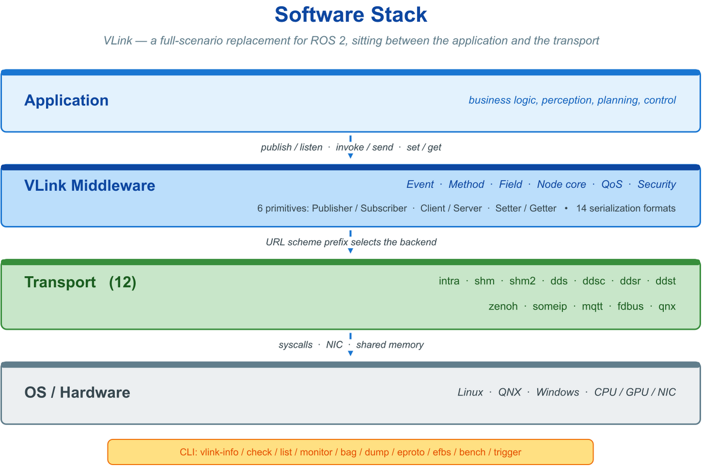
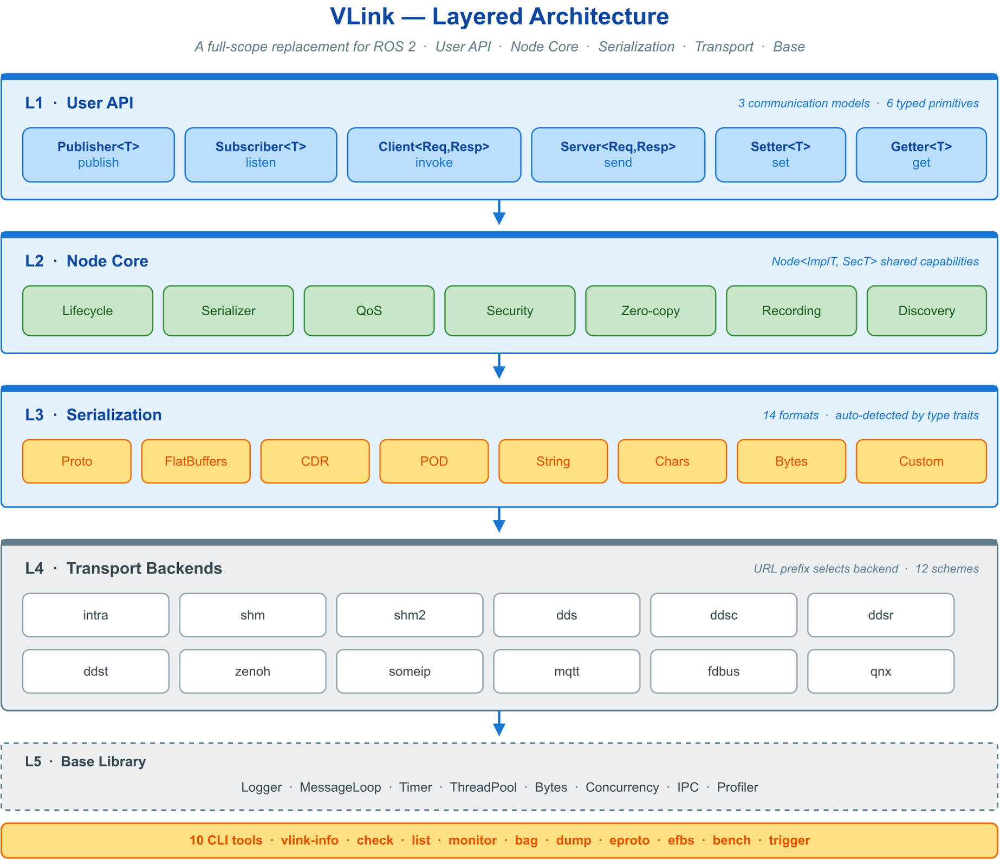
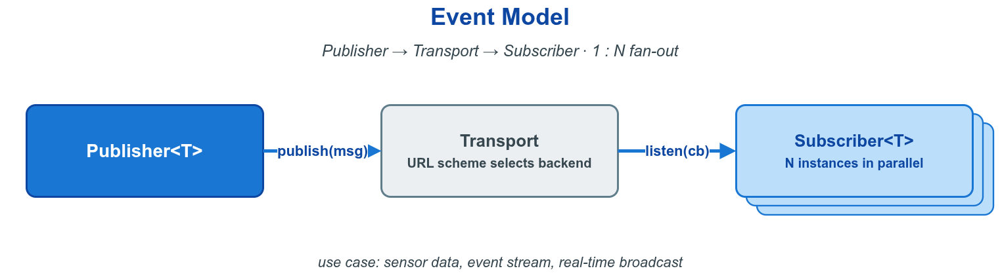
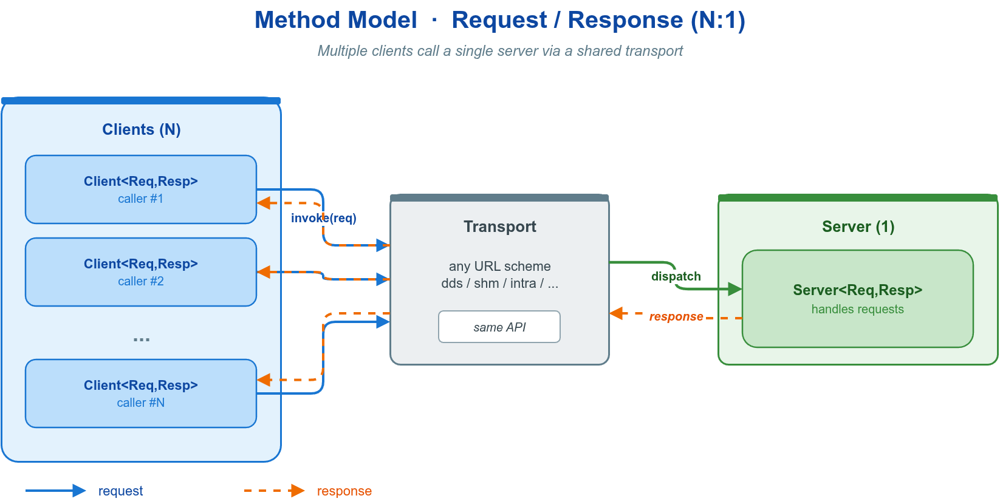
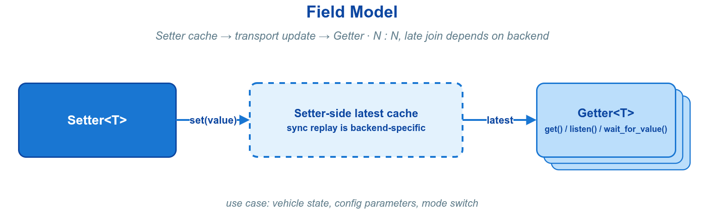
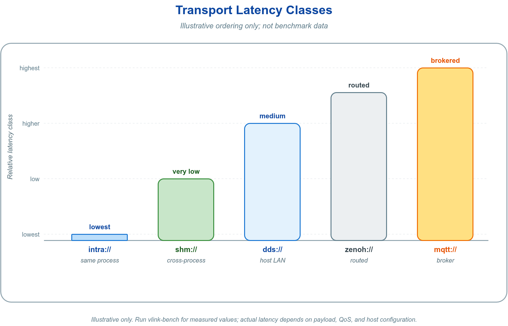
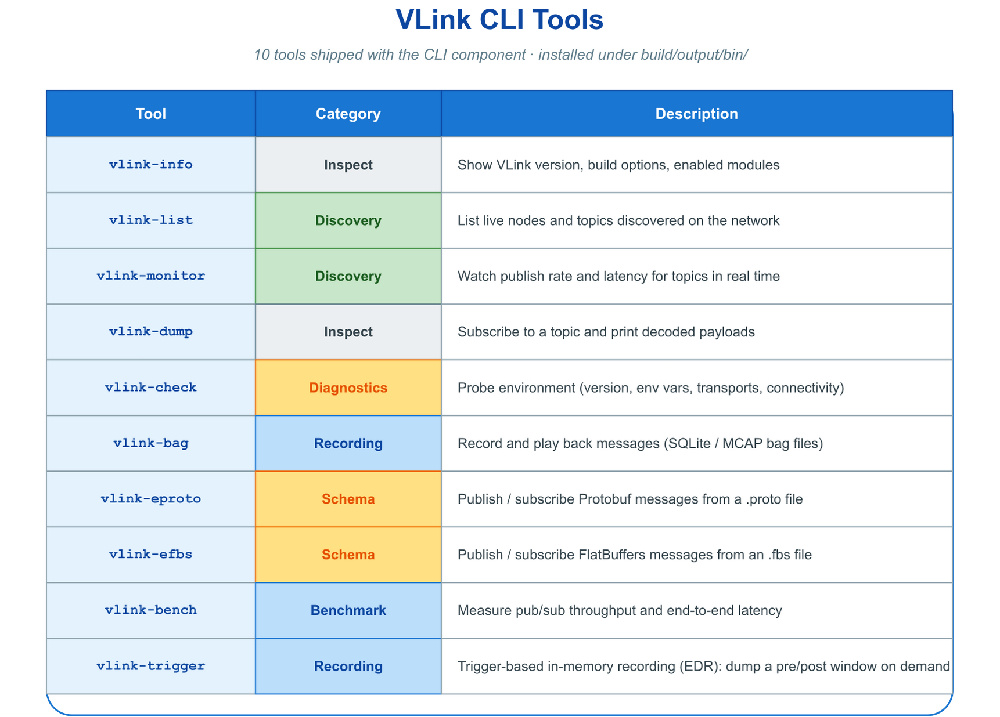
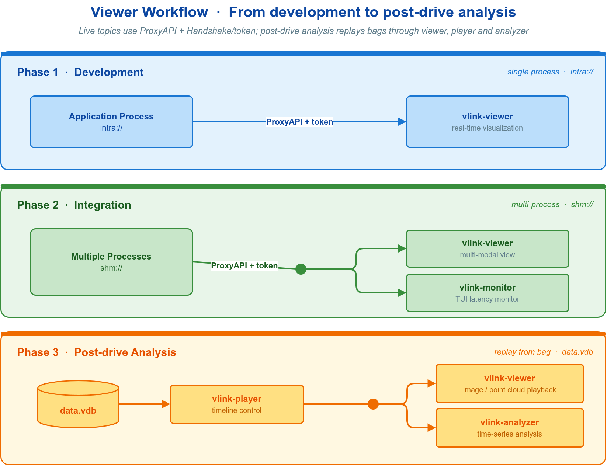
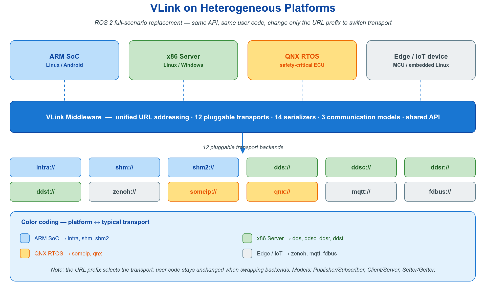

# 📃 0. VLink 技术白皮书

**一个面向自动驾驶与具身智能的轻量级高性能通信中间件**

**[官方网站: https://vlink.work](https://vlink.work)**

**[GitHub: https://github.com/thun-res/vlink](https://github.com/thun-res/vlink)**

## 1 摘要

随着自动驾驶与具身智能产业的快速发展，车载与机器人系统对进程间通信（IPC）中间件的性能、可靠性与可移植性提出了前所未有的高要求。现有主流方案——包括 ROS2、eProsima Fast-DDS、SOME/IP 等——在传输后端绑定、API 复杂度、序列化开销、调试工具链完整性等方面均存在明显短板。国内自动驾驶与智能机器人产业的崛起，也对中间件的国产化、自主可控提出了迫切诉求。

本文以开源项目 VLink 为研究对象，深入分析其产生背景、核心设计理念、体系结构与关键技术。VLink 以"一套极简的 API，多种传输，业务代码低成本切换"为核心目标，提供事件（Event）、方法（Method）、字段（Field）三种通信模型共六种通信原语（Publisher、Subscriber、Server、Client、Getter、Setter），支持 intra、shm、shm2、dds、ddsc、ddsr、ddst、zenoh、someip、mqtt、fdbus、qnx 共 12 种传输后端，并内置零拷贝、安全加密、多格式序列化、消息录制、实时发现监控、CLI 工具链等完整的工程能力。本文从行业背景、痛点剖析、架构设计、技术优势、横向对比、性能分析、开发效率与调试工具等维度展开系统论述，力图为自动驾驶与具身智能领域的中间件选型与设计提供参考。

**关键词：** 中间件；进程间通信；自动驾驶；具身智能；DDS；ROS2；零拷贝；国产化；VLink

---

## 目录

- [1 摘要](#1-摘要)
- [2 引言](#2-引言)
- [3 行业背景与技术现状](#3-行业背景与技术现状)
  - [3.1 自动驾驶产业的快速演进](#31-自动驾驶产业的快速演进)
  - [3.2 具身智能与机器人产业的兴起](#32-具身智能与机器人产业的兴起)
  - [3.3 通信中间件在智能系统中的核心地位](#33-通信中间件在智能系统中的核心地位)
  - [3.4 主流中间件方案综述](#34-主流中间件方案综述)
    - [3.4.1 ROS2（Robot Operating System 2）](#341-ros2robot-operating-system-2)
    - [3.4.2 DDS（Data Distribution Service）](#342-ddsdata-distribution-service)
    - [3.4.3 SOME/IP（Scalable service-Oriented MiddlewarE over IP）](#343-someipscalable-service-oriented-middleware-over-ip)
    - [3.4.4 Zenoh](#344-zenoh)
- [4 现有方案的痛点分析](#4-现有方案的痛点分析)
  - [4.1 传输后端锁定问题](#41-传输后端锁定问题)
  - [4.2 API 复杂度与学习成本](#42-api-复杂度与学习成本)
  - [4.3 序列化体系的局限性](#43-序列化体系的局限性)
  - [4.4 调试与可观测性的缺失](#44-调试与可观测性的缺失)
  - [4.5 实时性与确定性保障不足](#45-实时性与确定性保障不足)
  - [4.6 国产化与自主可控的缺位](#46-国产化与自主可控的缺位)
- [5 国产化背景与机遇](#5-国产化背景与机遇)
  - [5.1 国内自动驾驶产业的发展态势](#51-国内自动驾驶产业的发展态势)
  - [5.2 中间件国产化的战略意义](#52-中间件国产化的战略意义)
  - [5.3 现有国产探索的不足](#53-现有国产探索的不足)
- [6 VLink 项目的定位与设计目标](#6-vlink-项目的定位与设计目标)
  - [6.1 核心定位](#61-核心定位)
  - [6.2 设计原则](#62-设计原则)
  - [6.3 目标用户与应用场景](#63-目标用户与应用场景)
- [7 VLink 的体系结构](#7-vlink-的体系结构)
  - [7.1 整体架构概览](#71-整体架构概览)
  - [7.2 三种通信模型](#72-三种通信模型)
    - [7.2.1 事件模型（Event Model）](#721-事件模型event-model)
    - [7.2.2 方法模型（Method Model）](#722-方法模型method-model)
    - [7.2.3 字段模型（Field Model）](#723-字段模型field-model)
  - [7.3 传输后端抽象层](#73-传输后端抽象层)
  - [7.4 序列化体系](#74-序列化体系)
  - [7.5 节点生命周期管理](#75-节点生命周期管理)
  - [7.6 基础组件层](#76-基础组件层)
- [8 VLink 解决的核心问题](#8-vlink-解决的核心问题)
  - [8.1 传输后端的业务代码无改动切换](#81-传输后端的业务代码无改动切换)
  - [8.2 类型安全的通信接口](#82-类型安全的通信接口)
  - [8.3 零拷贝的工程化封装](#83-零拷贝的工程化封装)
  - [8.4 多序列化协议的统一抽象](#84-多序列化协议的统一抽象)
  - [8.5 安全加密的透明集成](#85-安全加密的透明集成)
- [9 VLink 的技术优势](#9-vlink-的技术优势)
  - [9.1 极简的用户接口](#91-极简的用户接口)
  - [9.2 高性能与低延迟](#92-高性能与低延迟)
  - [9.3 丰富的 QoS 控制](#93-丰富的-qos-控制)
  - [9.4 完整的生态工具链](#94-完整的生态工具链)
  - [9.5 语言互操作性](#95-语言互操作性)
- [10 横向对比分析](#10-横向对比分析)
  - [10.1 VLink 与 ROS2 的对比](#101-vlink-与-ros2-的对比)
  - [10.2 VLink 与独立 DDS 的对比](#102-vlink-与独立-dds-的对比)
  - [10.3 VLink 与 SOME/IP 的对比](#103-vlink-与-someip-的对比)
  - [10.4 VLink 与 Zenoh 的对比](#104-vlink-与-zenoh-的对比)
  - [10.5 综合对比矩阵](#105-综合对比矩阵)
- [11 性能分析](#11-性能分析)
  - [11.1 零拷贝传输性能](#111-零拷贝传输性能)
  - [11.2 序列化开销分析](#112-序列化开销分析)
  - [11.3 延迟与吞吐特性](#113-延迟与吞吐特性)
  - [11.4 跨传输后端性能对比](#114-跨传输后端性能对比)
- [12 开发效率分析](#12-开发效率分析)
  - [12.1 极简 API 降低接入成本](#121-极简-api-降低接入成本)
  - [12.2 编译期类型检查](#122-编译期类型检查)
  - [12.3 灵活的初始化策略](#123-灵活的初始化策略)
  - [12.4 多语言支持降低集成门槛](#124-多语言支持降低集成门槛)
    - [12.4.1 Python 原生绑定](#1241-python-原生绑定)
    - [12.4.2 C API（跨语言 FFI）](#1242-c-api跨语言-ffi)
    - [12.4.3 多语言功能对比](#1243-多语言功能对比)
  - [12.5 CMake 集成指南](#125-cmake-集成指南)
- [13 调试工具链](#13-调试工具链)
  - [13.1 CLI 命令行工具链](#131-cli-命令行工具链)
  - [13.2 性能剖析器（CpuProfiler）](#132-性能剖析器cpuprofiler)
  - [13.3 日志系统](#133-日志系统)
  - [13.4 延迟与丢包统计](#134-延迟与丢包统计)
  - [13.5 VLink Viewer 可视化工具链](#135-vlink-viewer-可视化工具链)
  - [13.6 VLink WebViz Web 可视化](#136-vlink-webviz-web-可视化)
- [14 性能基准测试与竞品横向对比](#14-性能基准测试与竞品横向对比)
  - [14.1 测试方法论与环境配置](#141-测试方法论与环境配置)
  - [14.2 进程内传输性能（intra）](#142-进程内传输性能intra)
  - [14.3 零拷贝共享内存传输（shm / shm2）](#143-零拷贝共享内存传输shm-shm2)
  - [14.4 DDS 网络传输延迟对比](#144-dds-网络传输延迟对比)
  - [14.5 综合性能对比矩阵](#145-综合性能对比矩阵)
- [15 带来的变化与影响](#15-带来的变化与影响)
  - [15.1 对开发范式的改变](#151-对开发范式的改变)
  - [15.2 对系统架构的影响](#152-对系统架构的影响)
  - [15.3 对工程实践的提升](#153-对工程实践的提升)
- [16 未来展望](#16-未来展望)
  - [16.1 传输后端的持续扩展](#161-传输后端的持续扩展)
  - [16.2 云边协同通信](#162-云边协同通信)
  - [16.3 AI 原生通信原语](#163-ai-原生通信原语)
  - [16.4 生态系统建设](#164-生态系统建设)
- [17 结论](#17-结论)
- [18 参考文献](#18-参考文献)

## 2 引言

过去十年，人工智能技术的突破性进展催生了自动驾驶与具身智能两大产业方向的爆发式增长。自动驾驶车辆需要在毫秒级时间窗口内完成传感器数据的采集、融合、决策与执行，对计算平台的实时通信能力提出了极高要求；具身智能机器人则需要在复杂物理环境中协调数十乃至数百个异构模块，对进程间通信的灵活性、可靠性与可扩展性同样要求极高。

在这两大产业中，中间件处于软件栈的核心枢纽位置。一个设计优良的中间件，能够将复杂的分布式通信问题屏蔽于业务逻辑之外，让开发者专注于算法与应用；反之，一个设计粗糙或与业务场景不匹配的中间件，则会成为制约系统性能、扩展性与可维护性的瓶颈。

然而，当前主流中间件——无论是以 ROS2 为代表的机器人领域通用框架，还是以 Fast-DDS、CycloneDDS 为代表的工业级 DDS 实现，亦或是以 vsomeip 为代表的车载以太网协议栈——都不同程度地存在 API 复杂、传输绑定、调试工具链缺失、国产化程度低等问题。

VLink 正是在这一背景下诞生的。它是一个以 Apache 2.0 协议开源的轻量级 C++17 通信中间件，面向自动驾驶与具身智能场景，以"一套 API，多种传输，业务代码低成本切换"为核心设计哲学。它从实践问题出发，将工程师真实遭遇的痛点转化为设计约束，构建出一套兼顾性能、灵活性、易用性与工程完整性的通信基础设施。

本文旨在对 VLink 的产生背景、核心设计、技术特性与工程价值进行全面的学术论述。文章不仅关注技术层面的创新，更着眼于 VLink 对整个领域工程实践的推动意义，以及在国产化背景下的战略价值。

---

## 3 行业背景与技术现状

### 3.1 自动驾驶产业的快速演进

自动驾驶技术的商业化进程在过去数年间显著加速。以特斯拉 FSD（Full Self-Driving）、百度 Apollo、华为 ADS 为代表的量产自动驾驶系统，已经从实验室走向了公共道路。L2+ 级别的辅助驾驶功能在量产车型中的普及率持续提升，L3 级别的量产方案也逐步进入法规认证阶段（具体渗透率数据因统计口径与机构不同而差异较大，相关数字请参考各行业机构公开发布的最新报告）。

从技术架构上看，现代自动驾驶系统通常包含以下核心子系统：感知（相机、LiDAR、毫米波雷达、超声波），定位（高精度地图 + IMU + GNSS），预测（行人、车辆行为预测），规划（路径与速度规划），控制（横向、纵向执行），以及监控与诊断（OBD、SOC、安全监控）。这些子系统往往分布于多个异构计算节点上，彼此之间通过进程间通信进行数据交换。

以典型的 L3 自动驾驶系统为例，其 IPC 消息流量在常见配置下可能包含多路高分辨率相机（原始帧率约 30 fps，单路原始数据量可达数十至上百 MB/s 数量级）、数台 LiDAR（每秒产生 MB 级点云数据）、若干毫米波雷达与超声波传感器（数据量相对较小），以及模块间传递的感知结果（检测框、语义分割，频率 20–100 Hz）、规划结果（频率约 10–20 Hz）与控制指令（频率 100 Hz 至 1 kHz 量级）。具体数值因车型配置与传感器型号而异，此处仅用于说明数量级。

在如此高密度的数据流量下，中间件的零拷贝能力、延迟确定性以及资源占用就成为系统设计的关键约束。

### 3.2 具身智能与机器人产业的兴起

以大型语言模型（LLM）与视觉-语言-动作模型（VLA）为核心的具身智能，是 2024-2026 年人工智能领域最具爆发力的方向之一。以特斯拉 Optimus、Figure AI、智元机器人、宇树科技为代表的人形机器人公司，正以惊人速度推进硬件迭代与软件栈的构建。

具身智能系统对通信中间件的需求与自动驾驶有所不同，但同样苛刻：
- **低延迟控制回路**：机器人的关节控制频率通常为 500-1000 Hz，要求端到端延迟低于 1 ms
- **多模态感知数据传输**：相机、深度传感器、力/力矩传感器、IMU 等数据需实时传递
- **跨异构节点通信**：不同算力平台（ARM、x86、DSP、FPGA）之间的数据交换
- **灵活的拓扑结构**：从单机多进程到多机集群，拓扑结构随任务动态变化
- **高可靠性**：机器人与物理世界直接交互，通信故障可能造成安全事故

传统工业机器人通信方案（EtherCAT、CANopen 等）专注于确定性实时性，但缺乏高级语义和数据丰富性；ROS2 虽然提供了较好的通用性，但其实时性和工程化程度仍受到诟病。

### 3.3 通信中间件在智能系统中的核心地位

通信中间件在智能系统软件栈中处于基础层与业务层之间的关键位置，如下图所示：



中间件的设计质量直接决定了：
1. **系统性能上限**：低效的中间件会成为整个系统的性能瓶颈
2. **开发效率**：良好的 API 设计可以显著压缩通信相关样板代码的规模，使业务代码的比重更高
3. **可移植性**：解耦传输后端可实现跨平台、跨传输协议的代码复用
4. **可观测性**：完善的调试工具链是故障快速定位的基础

### 3.4 主流中间件方案综述

#### 3.4.1 ROS2（Robot Operating System 2）

ROS2 是当前机器人领域使用最广泛的中间件框架，由 Open Robotics 基于 DDS（Data Distribution Service）标准构建。其核心特性包括：
- 基于 DDS 的发布-订阅通信
- Python 与 C++ 双语言接口
- 丰富的社区生态（packages、tools）
- Launch 系统与 Node 抽象

然而 ROS2 在工业应用中暴露出若干严重问题：
- 庞大的依赖树和复杂的构建系统（colcon/ament_cmake）
- DDS 中间层引入的额外延迟与内存开销
- 实时性支持依赖于特定 DDS 实现的配置，默认配置不满足硬实时需求
- 消息类型与 IDL 紧耦合，序列化方式单一（CDR）
- 调试工具（ros2 topic echo、rqt）功能有限，不支持历史消息回放与高级分析

#### 3.4.2 DDS（Data Distribution Service）

DDS 是 OMG（Object Management Group）制定的工业级分布式数据通信标准，其主要实现包括 eProsima Fast-DDS、Eclipse CycloneDDS、RTI Connext DDS、ADLINK OpenSplice 等。DDS 提供了完善的 QoS 策略体系和可靠的跨网络通信能力，广泛应用于国防、航空、工业自动化领域。

但直接使用 DDS 的痛点同样突出：
- API 极为复杂，IDL 定义、TypeSupport 注册、Domain/Publisher/DataWriter 多层对象树的创建，学习曲线陡峭
- 严格依赖 CDR 序列化，与 Protobuf、FlatBuffers 等现代格式的集成需要大量胶水代码
- 不同 DDS 实现（Fast-DDS、CycloneDDS、RTI）之间 API 不兼容，切换成本极高
- 缺乏进程内（intra-process）通信优化，即使同进程内的两个节点也需通过网络栈

#### 3.4.3 SOME/IP（Scalable service-Oriented MiddlewarE over IP）

SOME/IP 是 AUTOSAR 标准定义的车载以太网通信协议，由 vsomeip（开源实现）提供工业实现。它面向车载 ECU 之间的服务化通信，提供服务发现、方法调用、事件通知等功能。

SOME/IP 的局限性在于：
- 协议设计面向车载 ECU，不适合高吞吐的传感器数据传输
- 缺乏对大数据量（图像、点云）的零拷贝支持
- 配置复杂，与 AUTOSAR 架构深度绑定
- 不具备进程内通信优化

#### 3.4.4 Zenoh

Zenoh 是 Eclipse 基金会推出的新一代 IoT/边缘计算通信协议，以低延迟、云边协同为设计目标。其 Rust 实现具有出色的安全性和性能，并提供了 C/Python/Java 绑定。

Zenoh 的主要局限：
- 生态相对年轻，工业生产案例有限
- 缺乏与自动驾驶工具链的深度集成
- 序列化格式支持有限
- 共享内存零拷贝仍处于实验阶段

---

## 4 现有方案的痛点分析

### 4.1 传输后端锁定问题

这是当前中间件领域最普遍的问题之一。以 ROS2 为例，其通信层硬性依赖 DDS，虽然通过 rmw（ROS Middleware Interface）层支持多种 DDS 实现，但切换实现仍需修改编译配置、更新环境变量，且不同实现间存在行为差异。更重要的是，切换到非 DDS 传输（如共享内存、进程内通信）需要完全不同的 API（如 `intra_process_comms`），无法无缝切换。

实际工程中，这种锁定带来了显著后果：开发阶段基于 DDS 实现，部署时发现共享内存性能更优，迁移却需大量改造；跨团队协作时不同团队采用不同传输后端，集成时产生兼容性问题；随着系统从单机扩展到多机，传输切换需要侵入式代码修改。

### 4.2 API 复杂度与学习成本

以 Fast-DDS 为例，创建一个简单的发布者需要经历"创建 DomainParticipant → 注册类型 → 创建 Publisher → 创建 Topic → 创建 DataWriter → 发布数据"的完整流程：

```cpp
eprosima::fastdds::dds::DomainParticipantQos pqos;
auto* participant = DomainParticipantFactory::get_instance()->create_participant(0, pqos);

TypeSupport type(new HelloWorldPubSubType());
type.register_type(participant);

eprosima::fastdds::dds::PublisherQos pubqos;
auto* publisher = participant->create_publisher(pubqos);

eprosima::fastdds::dds::TopicQos tqos;
auto* topic = participant->create_topic("HelloWorldTopic", "HelloWorld", tqos);

eprosima::fastdds::dds::DataWriterQos wqos;
auto* writer = publisher->create_datawriter(topic, wqos);

HelloWorld hello;
hello.message("Hello World");
writer->write(&hello);
```

这还仅是最简单的场景，尚未包含错误处理、生命周期管理与 QoS 配置；复杂场景下样板代码（boilerplate）量可达数百行。

### 4.3 序列化体系的局限性

现有方案在序列化支持上存在明显割裂：
- DDS 原生使用 CDR（Common Data Representation），与 Protobuf、FlatBuffers 集成困难
- ROS2 使用自定义 `.msg` 格式，与主流序列化库的互操作性差
- SOME/IP 使用 SOME/IP 序列化格式，不适合跨生态数据交换

在实际项目中，一个团队往往同时使用 Protobuf（模型推理数据交换）、FlatBuffers（性能敏感的传感器数据）与 CDR（DDS 内部），格式间转换引入了大量转换代码与额外的内存拷贝。

### 4.4 调试与可观测性的缺失

调试分布式通信系统历来是工程师最头疼的问题之一。现有工具的局限：
- ROS2 的 `ros2 bag` 录制工具功能基础，回放与分析能力有限
- Fast-DDS Monitor 只能查看基本状态，无法实时显示消息内容
- 多数方案缺乏端到端延迟测量能力，进程崩溃后难以定位失效的通信环节
- 缺乏 Web 端远程可视化能力，车端或嵌入式端的实时数据无法通过浏览器直接查看，需要额外开发桥接工具或依赖第三方集成

### 4.5 实时性与确定性保障不足

自动驾驶与机器人控制对通信延迟的确定性要求极高。"平均延迟 0.1 ms"远不如"P99 延迟 0.5 ms"有意义。现有方案的问题：
- 动态内存分配导致延迟抖动（jitter）
- GC（垃圾回收）语言（Python、Java）接口引入不确定性
- 队列满时的处理策略（阻塞 vs 丢弃）不透明
- 缺乏优先级感知的任务调度

### 4.6 国产化与自主可控的缺位

当前主流中间件均来自海外：
- ROS2：美国 Open Robotics 主导，核心开发者多来自美国与欧洲
- Fast-DDS：eProsima 公司
- CycloneDDS：Eclipse 基金会，主要贡献者来自欧美
- RTI Connext：美国 Real-Time Innovations

在当前国际形势下，核心软件基础设施依赖海外供应商存在供应链安全风险，一旦遭遇出口管制或技术封锁，可能对国内自动驾驶产业造成严重冲击。

---

## 5 国产化背景与机遇

### 5.1 国内自动驾驶产业的发展态势

中国已成为全球最大的自动驾驶市场之一。2025 年中国智能网联汽车的渗透率持续攀升，头部车企（比亚迪、华为赛力斯、理想、小鹏、蔚来等）均已建立自研智驾系统研发团队，部分企业的智驾软件栈从感知到规划已实现全面自研。

在具身智能领域，智元机器人、宇树科技、开普勒机器人、傅利叶智能等国内企业正高速迭代人形与四足机器人产品，技术积累正在赶超国际先进水平。

这一产业格局对国产通信中间件提出了历史性需求：既需要满足严苛的性能要求，又需要具备完整的自主知识产权，还需要有持续演进的开源社区支撑。

### 5.2 中间件国产化的战略意义

通信中间件作为自动驾驶与机器人软件栈的关键基础设施，其国产化具有以下战略意义：

**供应链安全**：核心基础软件自主可控，可从根本上规避技术封锁风险，确保产业链连续性。

**标准话语权**：在国产中间件发展壮大的过程中，中国企业有机会参与乃至主导相关行业标准的制定，争取国际标准化组织中的话语权。

**技术创新路径**：自研中间件可以根据中国智驾与机器人产业的具体需求进行定制化优化，而非受制于海外主导的技术路线。

**生态建设**：围绕国产中间件形成工具链、培训体系、社区生态，有助于整体提升国内产业的软件工程能力。

### 5.3 现有国产探索的不足

目前国内已有少量针对自动驾驶和机器人场景的通信中间件探索，但普遍存在以下不足：
- **封闭性**：多数产自大型车企或科技公司内部，不对外开源，生态封闭
- **功能单一**：只支持单一传输协议，缺乏多后端切换能力
- **工具链缺失**：缺乏完整的调试、录制、监控工具支持
- **文档与生态薄弱**：缺乏系统性的技术文档与开源社区

VLink 的出现，是对上述不足的直接回应。作为一个 Apache 2.0 开源项目，它具备开放性、完整性与工程化程度，有望成为国产通信中间件领域的重要参考实现。

---

## 6 VLink 项目的定位与设计目标

### 6.1 核心定位

VLink 将自身定位为"自动驾驶与具身智能场景下，ROS2 的全场景替代方案"。这一定位包含三层含义：

**第一层：面向垂直场景**。VLink 不试图成为通用的分布式计算框架，而是专注于自动驾驶与机器人领域的具体需求，在性能、实时性、传感器数据处理等方面做深度优化。

**第二层：全场景替代 ROS2 通信栈**。VLink 并非否定 ROS2 的价值，而是在自动驾驶与具身智能的全部通信场景中提供对 ROS2 通信栈的完整替代——无论是高性能零拷贝、强实时控制回路，还是常规跨机通信与服务化调用，均以同一组通信原语覆盖；在需要与 ROS2 生态（完整包体系、仿真集成、参数与生命周期管理）共存时，则通过桥接能力集成。

**第三层：轻量化**。VLink 核心库不依赖统一的中心守护进程，具体部署复杂度由所选传输后端决定：`shm://` 依赖 Iceoryx RouDi，`mqtt://` 依赖 MQTT broker，`fdbus://` 的服务发现模式可能依赖 nameserver，`zenoh://` 在 client/router 部署模式下可能依赖 `zenohd`。这种按需依赖的方式便于在不同平台上裁剪。

### 6.2 设计原则

VLink 的设计遵循以下核心原则：

**原则一：一套 API，多种传输**。用户使用统一的 `Publisher<T>`、`Subscriber<T>`、`Client<Req, Resp>`、`Server<Req, Resp>`、`Getter<T>`、`Setter<T>` 接口，通过改变 URL 前缀（`intra://`、`shm://`、`dds://` 等）即可切换传输后端，业务代码零修改。

**原则二：类型安全优先**。借助 C++17 模板元编程，所有通信原语在编译期确定消息类型、序列化方式，错误在编译期暴露，而非运行时崩溃。

**原则三：低开销抽象**。设计上避免虚函数分派和动态分配的关键路径开销。对于编译期可确定的特性（如是否有响应、序列化类型），使用 `if constexpr` 和 `static_assert` 而非运行时分支。

**原则四：工具链完整性**。从开发到调试再到生产部署，提供完整的工具链支持，而非仅提供通信原语本身。

**原则五：安全性内建**。加密通信不是事后添加的补丁，而是通过模板参数 `SecurityType` 在编译期确定，与正常通信共用同一套 API。

### 6.3 目标用户与应用场景

**目标用户：**
- 自动驾驶软件工程师：需要高性能、低延迟的传感器数据分发与模块间通信
- 机器人软件工程师：需要灵活的通信拓扑与确定性的控制回路通信
- 嵌入式系统工程师：需要支持多种操作系统（Linux、QNX）与多种传输协议的统一抽象
- 系统架构师：需要在系统演进过程中灵活切换传输方案而不改动业务代码

**典型应用场景：**
- 自动驾驶车辆感知融合系统：相机、LiDAR 原始数据的零拷贝进程间传输
- 自动驾驶决策规划系统：规划结果的发布、感知结果的订阅
- 车载服务化通信：基于 SOME/IP 的 ECU 间方法调用
- 机器人控制回路：高频率（1 kHz+）关节状态与控制指令传输
- 云边协同推理：云端模型推理结果通过 zenoh 下发到边缘节点

---

## 7 VLink 的体系结构

### 7.1 整体架构概览

VLink 采用分层架构设计，自上而下分为用户 API 层、通信原语层、序列化层、节点实现层、传输后端层和基础组件层。




### 7.2 三种通信模型

VLink 提供三种通信模型，覆盖智能系统中绝大多数的通信场景：

#### 7.2.1 事件模型（Event Model）

> 详细 API 请参阅 [Event 模型（Publisher / Subscriber）](02-communication.md)。

事件模型是经典的发布-订阅（Publish-Subscribe）模式，适用于数据流驱动的场景。



**关键特性：**
- `Publisher<T>` 支持 `wait_for_subscribers()` 等待订阅者就绪
- `Subscriber<T>` 的 `listen()` 回调在传输层线程（或附加的 MessageLoop 线程）中执行
- 对于 `intra://` 传输，当消息类型为共享指针包装类型时，`listen()` 以共享指针形式直接传递，实现进程内零拷贝
- 支持 `loan()` / `return_loan()` 接口，在 `shm://` 等借贷型传输上实现真正的零拷贝发布

**典型应用：** 感知结果发布、规划结果分发、传感器数据广播

#### 7.2.2 方法模型（Method Model）

> 详细 API 请参阅 [Method 模型（Client / Server）](02-communication.md)。

方法模型是请求-响应（Request-Response）模式，对应远程过程调用（RPC），适用于需要返回值的服务调用场景。



**五种调用方式：**

| 方式              | 签名                                        | 是否阻塞 | 说明                    |
| ----------------- | ------------------------------------------- | -------- | ----------------------- |
| invoke（引用）    | `invoke(req, resp&, timeout)`               | 是       | 最简单，适合同步场景    |
| invoke（optional）| `invoke(req, timeout) -> optional<Resp>`    | 是       | 超时返回 nullopt         |
| invoke（回调）    | `invoke(req, RespCallback)`                 | 否       | 异步，回调通知          |
| async_invoke      | `async_invoke(req) -> future<Resp>`         | 否       | std::future 等待结果   |
| send              | `send(req)`                                 | 否       | 仅当 RespT=EmptyType    |

**典型应用：** 地图查询、参数获取、障碍物信息请求、远程配置变更

#### 7.2.3 字段模型（Field Model）

> 详细 API 请参阅 [Field 模型（Setter / Getter）](02-communication.md)。

字段模型是状态同步（State Sync）模式，保持"最新值"语义，适用于配置参数、系统状态等场景。



字段模型与事件模型的关键区别在于：
- `Setter` 会缓存最近一次写入的值，当新的 `Getter` 连接时，自动重放该值（晚连接同步）
- `Getter` 可以通过 `get()` 随时轮询当前值（返回 `std::optional<T>`）
- `Getter` 支持 `set_change_reporting(true)` 过滤重复值，减少 CPU 占用

**典型应用：** 车辆状态（速度、档位）、系统配置参数、传感器标定参数

### 7.3 传输后端抽象层

VLink 通过 URL 前缀选择传输后端，同一套业务代码可以在不同传输协议之间切换：

**稳定后端（推荐用于生产环境）：**

| Transport      | 底层技术          | 通信范围       | 零拷贝 | 实时性 | 典型场景                      |
| ----------- | ----------------- | -------------- | ------ | ------ | ----------------------------- |
| `intra://`  | 内置消息队列      | 进程内         | 是     | 极高   | 同进程模块间高频数据传递      |
| `shm://`    | Iceoryx RouDi     | 同机跨进程     | 是     | 极高   | 相机/LiDAR 数据零拷贝传输     |
| `dds://`    | Fast-DDS RTPS     | 跨机器/局域网  | 否     | 高     | 多 ECU 协同、跨域通信         |
| `ddsc://`   | CycloneDDS        | 跨机器/局域网  | 否     | 高     | 轻量级跨机通信               |

**Beta 后端（实验性，API 可能变化）：**

| Transport      | 底层技术          | 通信范围       | 零拷贝 | 实时性 | 典型场景                      |
| ----------- | ----------------- | -------------- | ------ | ------ | ----------------------------- |
| `shm2://`   | Iceoryx2          | 同机跨进程     | 是     | 极高   | 次代共享内存方案              |
| `ddsr://`   | RTI Connext DDS   | 跨机器         | 否     | 高     | 高可靠性工业级场景            |
| `ddst://`   | TravoDDS（国产 DDS） | 跨机器       | 否     | 中     | 国产自主可控 DDS 替代方案     |
| `zenoh://`  | Zenoh 协议        | 跨机/云边      | 条件   | 高     | IoT 边缘节点通信              |
| `someip://` | vsomeip SOME/IP   | 车载以太网     | 否     | 高     | 车载 ECU 服务化通信           |
| `fdbus://`  | FDBus IPC         | 同机           | 否     | 高     | Android/Linux 混合系统        |
| `mqtt://`   | MQTT (Paho C)     | 跨网络/云端    | 否     | 中     | IoT 传感器桥接、云端消息      |
| `qnx://`    | QNX IPC           | 同机（QNX）    | 否     | 极高   | QNX 实时系统内部通信          |

每种传输后端通过独立的 `*Conf` 结构体进行配置，支持通过 URL 参数传递后端特定选项（如 DDS 的 `?domain=1&depth=10`）。URL 解析由 `Url` 类统一处理，`Node` 基类在初始化时自动根据 transport 类型选择对应的传输工厂。

> 注：`zenoh://` 的零拷贝能力依赖 Zenoh SHM 构建与运行时配置，例如启用 `?shm=1`；未启用共享内存路径时仍按普通网络传输处理。

### 7.4 序列化体系

序列化是通信中间件性能的关键瓶颈之一。VLink 通过编译期静态分派实现了对 14 种序列化类型的统一支持，而无需运行时类型判断的开销：

| 类型常量             | 对应 C++ 类型                                   | 适用场景                            |
| -------------------- | ----------------------------------------------- | ----------------------------------- |
| `kBytesType`         | `Bytes`（轻量字节缓冲，含小对象内联存储）        | 原始字节传递，自定义序列化          |
| `kDynamicType`       | 动态类型容器                                    | 运行时确定类型的场景                |
| `kCdrType`           | FastDDS CDR 消息                                | DDS 原生 CDR 序列化                 |
| `kProtoType`         | `google::protobuf::MessageLite`                 | Protobuf 编码                       |
| `kProtoPtrType`      | `MyProto*`（原始指针，Arena 管理）              | Protobuf Arena 减少拷贝             |
| `kFlatTableType`     | `MyTableT`（NativeTable 派生）                  | FlatBuffers Object API              |
| `kFlatPtrType`       | `const MyTable*`（指向 Table 子类的指针）       | FlatBuffers 零拷贝只读访问          |
| `kFlatBuilderType`   | 含 `fbb_` 成员 + `Finish()` 的结构体           | FlatBuffers Builder 模式（结构体走常规 `publish()`；裸 `flatbuffers::FlatBufferBuilder*` 需用 `Publisher::publish_fbb()` 重载） |
| `kCustomType`        | 实现 `operator>>(Bytes&) const` / `operator<<(const Bytes&)` 的类型 | 自定义序列化协议   |
| `kStringType`        | `std::string`                                   | 字符串消息                          |
| `kCharsType`         | `char[]` / `const char*`                        | C 字符串                            |
| `kStreamType`        | 支持 `std::stringstream` 输入/输出运算符的类型  | 兜底序列化路径（无更优编解码时回退）|
| `kStandardType`      | POD 类型（`int`、`float`、结构体等）            | 简单数据类型，直接内存拷贝          |
| `kStandardPtrType`   | `T*`（指向 POD 类型的原始指针）                 | 零拷贝 POD 指针传递                 |

类型检测通过编译期模板推导完成。编译期确定序列化类型（无运行时开销），发布时自动选择正确的序列化路径，`publish()` 会自动序列化为正确格式：

```cpp
static constexpr vlink::Serializer::Type kValueType = vlink::Serializer::get_type_of<MyMsg>();
static_assert(vlink::Serializer::is_supported(kValueType), "Unsupported type");

vlink::Publisher<MyMsg> pub("dds://my/topic");
pub.publish(my_msg);
```

对于需要自定义序列化的类型，只需实现 `operator>>`（序列化到 `Bytes`）和 `operator<<`（从 `Bytes` 反序列化）运算符。VLink 自动识别 `kCustomType`，无需额外注册。

```cpp
struct MyCustomType {
    int id;
    std::string name;
    std::vector<float> data;

    void operator>>(vlink::Bytes& out) const {
    }

    void operator<<(const vlink::Bytes& in) {
    }
};

vlink::Publisher<MyCustomType> pub("shm://my/topic");
```

### 7.5 节点生命周期管理

> 详细的生命周期状态机与 Node 基类 API 请参阅 [节点基类与生命周期](02-communication.md)。

所有通信原语继承自 `Node<ImplT, SecT>` 基类，共享统一的生命周期管理：


`Node` 基类提供以下通用能力：
- **懒初始化**：通过 `InitType::kWithoutInit` 参数，可以推迟 `init()` 调用，用于在构造器中注册回调后再初始化
- **QoS 配置**：通过传输配置对象（如 `DdsConf`）或 URL 参数（如 `?qos=name&depth=10`）配置 QoS 策略
- **安全密钥**：通过 `SecurityXxx` 派生类构造函数（第二参数）一次性传入 `Security::Config` 配置加密/解密参数；省略时使用内置默认安全槽位
- **消息录制**：`set_record_path()` 启用自动消息录制，所有通过该节点的消息均被记录到 bag 文件
- **服务发现**：`set_discovery_enabled()` 控制该节点是否参与发现广播
- **属性 KV 存储**：`set_property()` / `get_property()` 用于存储节点元数据
- **性能监控**：`get_cpu_usage()` 查询节点的 CPU 占用（通过 CpuProfiler 实现）
- **安全退出**：`set_safety_quit(true)` 通过互斥锁保护回调与销毁之间的竞态条件

### 7.6 基础组件层

VLink 内置了一套面向嵌入式与高性能场景精心设计的基础组件库（`include/vlink/base/`），既为上层通信框架提供核心支撑，也可在用户代码中独立使用。这些组件的设计目标是：在保证 C++17 可移植性的前提下，尽可能减少动态内存分配、系统调用开销与锁竞争，满足自动驾驶与机器人系统对低延迟和确定性的要求。

---

**MessageLoop（消息循环）**

`MessageLoop` 是 VLink 整个任务调度体系的核心抽象。它是一个单线程的串行事件处理器，在不阻塞调用者的前提下，将任务排队到事件循环中异步执行，确保事件处理的顺序性和线程安全性。

队列类型：
- `kNormalType`：基于互斥锁的标准队列，适用于大多数场景
- `kLockfreeType`：基于 MPMC（多生产者多消费者）无锁环形缓冲区，适用于极高频率的任务投递场景（如 1kHz 控制回路），消除互斥锁竞争带来的尾延迟
- `kPriorityType`：优先级队列，高优先级任务优先执行，适用于实时控制回路

入队策略（控制队列已满时的背压行为）：重试若干次后丢弃可丢任务、立即丢弃最旧任务、或无限阻塞重试，分别对应吞吐优先、低延迟与不丢失三种取舍；空闲调度恒由条件变量驱动。任务投递提供 `post_task`（异步不等待）、`invoke_task`（返回 `future`）、`exec_task`（带调度配置）三类接口。

`MessageLoop` 运行在独立线程中时，可通过 `vlink::Utils` 提供的线程工具函数设置 CPU 亲和性，在实时嵌入式系统中将其固定在特定 CPU 核心上，进一步降低线程调度带来的延迟不确定性。

---

**ThreadPool（线程池）**

`ThreadPool` 提供固定大小的多线程并发执行器，所有工作线程共享一个任务队列，可在互斥锁队列与无锁 MPMC 队列之间选择，并复用与 `MessageLoop` 相同的背压策略族。与 `MessageLoop` 不同，`ThreadPool` 不内嵌事件循环与定时器，主要提供 `post_task` / `invoke_task` 提交接口，另有 `post_task_handle` 可追踪变体，适用于 CPU 密集型的并行处理任务，如批量图像预处理、多帧点云合并、并行路径规划评估等场景。

---

**Timer / WheelTimer / ElapsedTimer（定时器家族）**

VLink 提供三种不同用途的定时器：

- **Timer**：毫秒级周期定时触发器，由 `loop_count` 参数决定触发模式（`loop_count=1` 为单次，`Timer::kInfinite` 为无限周期触发），内部通过 `MessageLoop` 驱动，保证回调在指定线程上执行
- **WheelTimer**：哈希时间轮（Hashed Timing Wheel）算法实现，提供 O(1) 插入与移除、O(k) 单槽过期处理；当系统中同时存在大量定时器（数千个）时，相比基于最小堆的定时器调度优势明显，适用于超时管理（如大量连接的心跳超时检测）
- **ElapsedTimer**：轻量级流逝时间计时器，通过 `start()` / `stop()` / `restart()` / `get()`（返回配置精度（默认毫秒）的流逝时间，未启动返回 `-1`）接口测量代码段执行时间，用于性能分析与超时判断

`WheelTimer` 以「槽位数 + 单槽精度」构造，`add()` 返回可用于后续移除的句柄，特别适合海量短超时（如大量连接心跳）的场景。

---

**GraphTask（有向无环图任务调度器）**

`GraphTask` 是面向感知融合、多模态预处理等复杂数据处理 pipeline 的专用调度器。它接受一组任务节点和节点间的依赖关系声明，自动构建 DAG（有向无环图），并在运行时最大化并行度——所有没有未完成前驱节点的任务可以同时在底层执行器（`ThreadPool`、`MessageLoop` 或 `MultiLoop`）中并行执行。

通过静态工厂 `GraphTask::create()` 创建任务节点，使用 `precede()` / `succeed()` 声明依赖关系（Taskflow 约定，`precede` 即"先于"），再提交到执行器运行：例如 `lidar_proc` 与 `camera_proc` 并行执行，`fusion` 等待两者完成，`planning` 又等待 `fusion`。这一模型将并行化决策从业务代码中剥离，开发者只需声明数据依赖关系，框架自动管理并发。

---

**Logger（日志系统）**

VLink 的 `Logger` 是全局单例日志系统，支持四种日志书写风格以适应不同团队的代码习惯：

| 宏 | 风格 |
| --- | --- |
| `VLOG_I` | 流式（variadic stream，推荐） |
| `MLOG_I` | 格式化（fmt/std::format 风格） |
| `CLOG_I` | C 风格（printf 风格） |
| `SLOG_I` | RAII 流式 |

日志级别：`kTrace / kDebug / kInfo / kWarn / kError / kFatal / kOff`（共 7 级，其中 `kOff` 表示关闭对应 sink）。编译期可通过宏 `VLINK_LOG_LEVEL=N` 剥离低于 `N` 的级别（零开销）；运行时可通过 `Logger::set_console_level()` / `set_file_level()` 分别调整控制台与文件 sink 的级别

后端适配器（通过编译选项 `SELECT_LOG_BACKEND` 切换）：
- `spdlog`（桌面/Linux 默认，高性能异步日志；Android/QNX 默认 native）
- `quill`（超低延迟日志，适合实时线程）
- `dlt`（AUTOSAR DLT 日志格式，适配车载诊断系统）
- `native`（平台原生日志：Android logcat / QNX slog2 / Linux kmsg，自动适配）

所有后端实现完全透明切换，业务代码中的日志调用不需要任何修改。

---

**Bytes（字节缓冲区）**

`Bytes` 是 VLink 内部统一的字节数据容器，采用 SBO（Small Buffer Optimization）设计：小载荷内联存放于栈缓冲，超过阈值时才溢出到内存池或系统堆，从而在热路径上消除大量动态分配。`Bytes` 以一组静态工厂表达不同的所有权语义，详见 [基础库 -- Bytes](08-base-library.md)，其中核心两者为：
- `shallow_copy()`：零拷贝内存借用，返回对相同内存区域的非拥有别名（无引用计数，调用方需确保生命周期）
- `deep_copy()`：完整数据复制，创建独立的拥有型副本

此外还提供与 `ProxyData`、`RawData` 等零拷贝容器的互操作接口。

在框架内部，所有跨模块的序列化数据传递均通过 `Bytes` 进行，其轻量级别名机制确保了高效的数据传递。

---

**其他实用组件**

| 组件                    | 说明                                                                   |
| ----------------------- | ---------------------------------------------------------------------- |
| `Semaphore`             | 基于条件变量的计数信号量，提供 `acquire()`/`release()`/`reset()` 接口（`acquire` 支持超时） |
| `SpinLock`              | 自旋锁，适用于极短临界区（预期等待时间 < 1μs）                         |
| `MpmcQueue<T>`          | MPMC 无锁多生产者多消费者队列，内部用于 `kLockfreeType` MessageLoop    |
| `ObjectPool<T>`         | 对象池，减少频繁构造/析构开销，用于内部消息缓冲区管理                  |
| `MemoryPool`            | 分级（金字塔）free-list 内存池，Bytes 默认分配器；通过 `VLINK_MEMORY_LEVEL`（0..9）选档，L0 = bypass |
| `MemoryResource`        | `std::pmr::memory_resource` 适配器，桥接 `MemoryPool`；提供 `make_shared` / `make_unique` 工厂供热路径替换 `std::` 版本 |
| `Plugin`                | 动态库（.so）插件加载器，用于传输后端的动态加载                        |
| `NameDetector`          | 头文件级的编译期类型名/枚举名内省工具（基于 `__PRETTY_FUNCTION__` 解析），用于日志与诊断中输出可读的类型与枚举标签 |
| `CachedTimestamp`       | 日志热路径专用的格式化时间戳字符串生成器：缓存「秒」级前缀，同一秒内只就地改写毫秒后三位，避免重复 `strftime` 格式化开销 |
| `DeadlineTimer`         | 截止时间定时器，用于操作超时管理                                        |
| `FastStream`            | 高性能字符串流，替代 `std::ostringstream` 用于格式化日志消息            |
| `Utils`                 | 通用工具函数集（字符串处理、环境变量读写、文件路径操作等）              |

---

## 8 VLink 解决的核心问题

### 8.1 传输后端的业务代码无改动切换

这是 VLink 最核心的设计目标，也是对行业痛点最直接的回应。

**问题**：开发阶段使用进程内通信（性能好，方便调试），测试阶段使用共享内存（接近生产环境），生产阶段根据部署拓扑使用 DDS 或 SOME/IP。每次切换都需要修改大量代码。

**VLink 的解决方案**：URL 前缀即传输协议，业务代码零修改。

| URL 前缀 | 阶段 / 场景 | 说明 |
| --- | --- | --- |
| `intra://` | 开发阶段 | 进程内通信，低延迟 |
| `shm://` | 测试阶段 | 共享内存，零拷贝 |
| `dds://` | 生产阶段（局域网） | DDS RTPS |
| `someip://` | 车载部署（Beta） | SOME/IP |
| `zenoh://` | 云边协同（Beta） | Zenoh |

```cpp
auto pub_intra = vlink::Publisher<MySensor>::create_unique("intra://sensor/camera");
auto pub_shm = vlink::Publisher<MySensor>::create_unique("shm://sensor/camera");
auto pub_dds = vlink::Publisher<MySensor>::create_unique("dds://sensor/camera");
auto pub_zenoh = vlink::Publisher<MySensor>::create_unique("zenoh://sensor/camera");

// SOME/IP 使用数值型 service/instance 以及 event/group 等协议标识
auto pub_someip = vlink::Publisher<MySensor>::create_unique(
    "someip://0x1234/0x5678?groups=0x1&event=0x10");
```

这些代码的业务逻辑保持一致，主要变化是 URL scheme 及后端特定参数。其中 `intra://`、`shm://`、`dds://` 为稳定后端，`someip://` 和 `zenoh://` 目前为 Beta 状态。在大型系统中，传输协议的选择可以通过配置文件动态注入，实现业务代码层面的零修改切换。

### 8.2 类型安全的通信接口

VLink 将消息类型作为模板参数，在编译期建立类型与序列化方式的绑定，错误提前暴露：

不支持序列化的类型——编译期报错而非运行时崩溃：

```cpp
vlink::Publisher<MyUnsupportedType> pub("dds://my/topic");
```

> 编译器输出：`static_assert failed: "<MsgT> is not a supported Serializer type."`

`Client` 没有响应类型时调用 `invoke`——编译期报错：

```cpp
vlink::Client<Req> client("dds://my/service");
client.invoke(req, resp);
```

> 编译器输出：`static_assert failed: "Invoke requires a response type."`

这种"编译期验证"的设计哲学，将大量运行时错误前移到编译期，显著提升了大型项目的开发质量。

### 8.3 零拷贝的工程化封装

VLink 将 Iceoryx 的 loan/unloan 机制封装为通用接口，使零拷贝使用变得简单：

零拷贝发布。借贷缓冲区在发布后自动归还：

```cpp
vlink::Publisher<vlink::Bytes> pub("shm://sensor/lidar");

if (pub.is_support_loan()) {
    vlink::Bytes buf = pub.loan(sizeof(LargePointCloud));
    auto* pc = new (buf.data()) LargePointCloud{};
    pc->seq = seq_num++;
    pc->fill_points(raw_lidar_data);
    pub.publish(buf);
}
```

零拷贝订阅（设置 `manual_unloan` 手动控制生命周期）。`return_loan` 接受 `const Bytes&`，因此手动 unloan 路径需要订阅 `Bytes` 视图（`Subscriber<Bytes>`）而非已反序列化的 `T`。异步处理完成后手动调用 `sub.return_loan(raw)` 归还借出的共享内存帧：

```cpp
vlink::Subscriber<vlink::Bytes> sub("shm://sensor/lidar");
sub.set_manual_unloan(true);
sub.listen([&sub](const vlink::Bytes& raw) {
    process_async(raw);
});
```

对于 `intra://` 传输，当消息类型为共享指针包装类型时，VLink 内部通过共享指针直接转发数据，利用引用计数实现进程内零拷贝——订阅端获得的是共享所有权视图，既无数据拷贝，也无需手动管理生命周期：

```cpp
vlink::Subscriber<CameraFrameIntra> sub("intra://sensor/camera");
sub.listen([](const CameraFrameIntra& frame) {
    neural_net.infer(frame);
});
```

### 8.4 多序列化协议的统一抽象

VLink 通过 `Serializer` 命名空间在编译期完成序列化方式的静态分派，框架内部自动调用正确的序列化路径：

编译期静态分派——用户无需手动调用序列化函数，框架内部使用模板化的 `Serializer::serialize` / `deserialize` 完成自动序列化（此处自动按 Protobuf 序列化）。节点运行时可通过 `set_ser_type()` 覆盖序列化类型元数据（影响发现、代理与录制中的类型信息）：

```cpp
vlink::Publisher<MyProtoMsg> pub("dds://my/topic");
pub.publish(my_msg);

pub.set_ser_type("my.proto.MessageType", vlink::SchemaType::kProtobuf);
```

这一能力在消息录制（BagWriter）中得到了直接应用——无论节点使用何种序列化格式，都可以将原始字节流统一存储，并在回放时按原格式解码。

### 8.5 安全加密的透明集成

VLink 将安全加密作为模板参数，与正常通信完全同构：

普通发布者与加密发布者（可显式传入 `Security::Config`；省略时使用内置默认安全槽位）。`cfg.key` 为对称 AES-128-GCM 密钥，SHA-256 截断后作为 AES key。也可使用自定义加密/解密回调：

```cpp
vlink::Publisher<MyMsg> pub("dds://my/topic");

vlink::Security::Config cfg;
cfg.key = "vlink-secret";
vlink::SecurityPublisher<MyMsg> sec_pub("dds://my/topic", cfg);

vlink::Security::Config cb_cfg;
cb_cfg.encrypt_callback = [](const vlink::Bytes& plain, vlink::Bytes& cipher) -> bool { return true; };
cb_cfg.decrypt_callback = [](const vlink::Bytes& cipher, vlink::Bytes& plain) -> bool { return true; };
vlink::SecurityPublisher<MyMsg> cb_pub("dds://my/topic", cb_cfg);
```

安全加密的透明集成意味着：在不同安全等级的部署场景下（如开发环境不加密、生产环境加密），只需切换类型别名，而无需修改任何业务逻辑。

---

## 9 VLink 的技术优势

### 9.1 极简的用户接口

VLink 的用户接口设计追求"最短的正确路径"。以下展示了使用 VLink 完成一个完整的发布-订阅场景所需的代码量：

**发布者（5 行有效代码）：**
```cpp
#include <vlink/vlink.h>

int main() {
    vlink::Publisher<int> pub("shm://test/counter");
    for (int i = 0; ; i++) {
        pub.publish(i);
        std::this_thread::sleep_for(std::chrono::milliseconds(10));
    }
}
```

**订阅者（4 行有效代码）：**
```cpp
#include <vlink/vlink.h>

int main() {
    vlink::Subscriber<int> sub("shm://test/counter");
    sub.listen([](const int& v) { VLOG_I("received: ", v); });
    std::this_thread::sleep_for(std::chrono::hours(1));
}
```

与等效的 Fast-DDS 原生实现相比，VLink 的代码量显著减少（典型的发布-订阅样例从数十行缩减到个位数行），且无需任何配置文件或代码生成步骤（对于 POD 类型和 Protobuf 类型）。具体节省的行数因业务复杂度和 QoS 配置要求而异。

### 9.2 高性能与低延迟

VLink 在关键路径上进行了多项性能优化：

**编译期分派**：通过 `if constexpr` 和模板特化，序列化类型的判断在编译期完成，运行时无分支。

**无锁数据结构**：在性能敏感的场景下，`MessageLoop` 的 `kLockfreeType` 队列基于 MPMC（多生产者多消费者）无锁算法实现，避免了互斥锁竞争。

**对象池**：频繁分配的内部对象（如消息缓冲区）通过对象池（`object_pool.h`）管理，减少了动态内存分配的开销。

**零拷贝优先**：在 `shm://` 和特定 `intra://` 使用方式下，数据路径可以避免大块消息复制；端到端延迟需要以目标硬件和调度配置实测。

**CPU 亲和性**：MessageLoop 的工作线程支持 CPU 亲和性配置，保证关键线程的 CPU 局部性。

### 9.3 丰富的 QoS 控制

VLink 提供了与 DDS 标准兼容的完整 QoS 策略体系，并对非 DDS 传输的可用子集进行了合理映射：

方式一：通过 URL 参数配置 QoS，或通过 `set_property()` 逐项配置；方式二：通过 `Conf` 对象直接配置：

```cpp
vlink::Publisher<MySensor> pub("dds://sensor/data?qos=sensor&depth=10",
                                vlink::InitType::kWithoutInit);

pub.set_property("reliability", "reliable");
pub.set_property("history_depth", "10");
pub.set_property("durability", "transient_local");
pub.init();

vlink::DdsConf conf("sensor/data", /*domain=*/0, /*depth=*/10, /*qos=*/"sensor");
vlink::Publisher<MySensor> pub2(conf);
```

DDS 传输会将 QoS 属性完整映射到底层 DDS 实体；SHM 传输则使用 URL 中的 depth 参数配置环形缓冲区深度；intra 传输使用属性中的 priority 参数配置任务派发优先级。

### 9.4 完整的生态工具链

VLink 不仅是一个通信库，更提供了面向工程实践的完整工具链（详见 13 节），包括消息录制（BagWriter）、实时发现监控（DiscoveryViewer）、CLI 工具、性能剖析器（CpuProfiler）、完整的日志系统，以及面向 Web 端的 WebViz 可视化桥接工具集（Foxglove Studio 和 Rerun Viewer 双后端支持）。

### 9.5 语言互操作性

VLink 提供了多层语言互操作能力：

**C API（c_api.h）**：面向六大通信原语（Publisher / Subscriber / Client / Server / Setter / Getter）数据面的纯 C 接口，使用不透明句柄（opaque handle）设计，可被 Python、Go、Java 等任何支持 C FFI 的语言调用（具体调用形式见 12.4 节）。Security 已通过 `vlink_create_secure_*` 系列接口覆盖；QoS、Bag 等高级特性则不在 C API 范围内，需通过 C++ API 使用。

**Proxy API（proxy_api.h）**：面向代理进程的监控接口，用于在不修改业务进程代码的情况下对通信流量进行旁路监控。

**零拷贝数据容器（zerocopy/）**：提供 `CameraFrame`、`PointCloud`、`RawData`、`AudioFrame`、`OccupancyGrid`、`ObjectArray`、`Tensor` 共 7 类领域特定的零拷贝容器，支持从 C 语言直接访问数据指针。

---

## 10 横向对比分析

### 10.1 VLink 与 ROS2 的对比

ROS2 是目前机器人与自动驾驶领域使用最广的中间件框架，VLink 在以下维度与之进行对比：

**通信延迟**

ROS2 的 intra-process 优化可以降低同进程内的拷贝与调度开销；跨进程或跨机器通信仍需要经过 rmw/DDS 等抽象层。VLink 的 `intra://` 面向同进程线程间通信，`shm://` 面向同机跨进程零拷贝，两者把不同部署拓扑显式映射到不同 URL。具体延迟与抖动差异需要在相同硬件、QoS 和调度参数下用 `vlink-bench` 或对照 harness 实测。

**API 复杂度**

ROS2 要求使用 `rclcpp::Node` 基类，节点必须在 ROS 执行器（Executor）中运行，引入了 spin 机制、节点生命周期管理、executor 类型选择等概念。VLink 的 API 不依赖任何框架层，可以在任意线程模型中使用，与 `std::thread`、`boost::asio`、自定义事件循环等无缝配合。

**序列化支持**

ROS2 使用 `.msg` 格式定义消息类型，序列化为 CDR，与 Protobuf/FlatBuffers 的集成需要手动封装。VLink 原生支持 14 种序列化格式，无需格式转换。

**传输灵活性**

ROS2 通过 rmw 层支持多种 DDS 实现，但切换需要重新编译并更新环境变量，且传输协议种类有限（主要为 DDS）。VLink 通过 URL 前缀支持 12 种传输后端，切换无需重新编译。

**依赖规模**

ROS2 的完整安装包含数十个 packages，依赖 Python、CMake、ament_cmake 等工具链，部署形态相对完整。VLink 按传输后端拆分组件目标，未启用的后端不会进入最终链接，便于面向嵌入式平台按需裁剪；具体产物体积需以目标编译选项和依赖组合实测为准。

**可视化与 Web 远程调试**

ROS2 生态中有 foxglove_bridge 等项目可将 ROS2 数据桥接到 Foxglove Studio，其他可视化平台通常需要额外桥接或转换链路。VLink 内置 WebViz 工具集（vlink-foxglove + vlink-rerun），同时覆盖 Foxglove Studio 和 Rerun Viewer，并提供 vlink-bag2mcap / vlink-bag2rrd 离线转换工具，实现实时与离线两条可视化路径。

### 10.2 VLink 与独立 DDS 的对比

**API 易用性**

独立 DDS（Fast-DDS、CycloneDDS 等）的原生 API 极为复杂，创建一个发布者需要管理 DomainParticipant、Publisher、Topic、DataWriter 等多个对象，任何一步出错都可能导致资源泄漏或行为异常。VLink 将这一切封装为一行代码，且通过 RAII 自动管理生命周期。

**传输迁移成本**

独立 DDS 方案一旦选定，更换 DDS 实现（如从 Fast-DDS 迁移到 CycloneDDS）需要重新学习新 API 并修改大量代码。VLink 用户只需修改 URL 前缀（`dds://` 改为 `ddsc://`），业务逻辑代码零修改。

**同机性能**

独立 DDS 在同机进程间通信时通常经过网络栈，或依赖特定 SHM 扩展与配置。VLink 可以在同机场景选择 `shm://` 传输以获得共享内存零拷贝路径，同时对外保持与 `dds://` 近似的用户 API。

### 10.3 VLink 与 SOME/IP 的对比

SOME/IP 是车载以太网的核心通信协议，VLink 在 someip:// 传输后端下兼容 SOME/IP 协议，可与现有车载 ECU 进行互通。

对比维度：
- **吞吐量**：SOME/IP 设计之初面向控制信号（小数据量高频次），对于大数据量（相机原始帧）性能不佳；VLink 可以在需要大数据量时自动选择 shm:// 或 dds://。
- **服务发现**：SOME/IP 有完整的 SD（Service Discovery）机制；VLink 通过 `detect_connected()`/`wait_for_connected()` 提供类似能力，并在 DDS 后端上利用 DDS 的服务发现。
- **编程模型**：SOME/IP 原生使用 Method/Event/Field 三种通信模式，与 VLink 的三种通信模型天然对应，迁移学习成本低。

### 10.4 VLink 与 Zenoh 的对比

Zenoh 是新兴的云边一体通信协议，VLink 在 zenoh:// 后端下兼容 Zenoh 协议。

对比维度：
- **协议灵活性**：Zenoh 支持 NAT 穿透、P2P、路由等多种拓扑；VLink 通过 zenoh:// 提供此类能力，`ddst://` 则以国产 DDS 运行时作为 Fast-DDS/CycloneDDS 的替代选项。
- **API 一致性**：Zenoh 有独立的 API 设计哲学（key expression、subscriber、publisher），与 ROS2/DDS 生态差异较大；VLink 在 zenoh:// 后端上仍使用同一套 `Publisher<T>`/`Subscriber<T>` API。
- **序列化支持**：Zenoh 本身不约定序列化格式（传递 raw bytes）；VLink 在 zenoh 后端上自动应用配置的序列化策略。

### 10.5 综合对比矩阵

下表中，"支持"表示原生提供该能力，"部分"表示通过扩展、插件或实验特性提供，"不支持"表示框架本身不提供：

| 评估维度           | VLink                  | ROS2                     | Fast-DDS          | SOME/IP             | Zenoh                |
| ------------------ | ---------------------- | ------------------------ | ----------------- | ------------------- | -------------------- |
| 多传输后端支持     | 支持（12 种 scheme）   | 部分（以 DDS 为主）      | 不支持（仅 DDS）  | 不支持（仅 SOME/IP）| 部分                 |
| 极简 API           | 支持                   | 部分（需继承 Node）      | 不支持（API 复杂）| 不支持（协议复杂）  | 支持                 |
| 零拷贝支持         | 支持（shm / intra）    | 部分（intra-process）    | 部分              | 不支持              | 部分（实验性）       |
| 多序列化格式支持   | 支持（14 种）          | 部分（CDR 为主）         | 部分（CDR）       | 不支持              | 不支持（raw bytes）  |
| 实时性保障         | 支持                   | 部分                     | 支持              | 支持                | 支持                 |
| 调试工具链         | 支持                   | 支持（生态丰富）         | 部分              | 部分                | 部分                 |
| Web 可视化集成     | 支持（Foxglove+Rerun） | 部分（foxglove_bridge）  | 不支持            | 不支持              | 不支持               |
| 安全加密           | 支持（模板参数透明）   | 支持（DDS-Security）     | 支持              | 部分                | 支持                 |
| 开源协议与维护主体 | Apache 2.0 / 国内项目 | Apache 2.0 / 国际社区   | Apache 2.0 / eProsima | 取决于具体实现 | Eclipse 项目 |
| 跨传输后端零代码切换 | 支持                 | 不支持                   | 不支持            | 不支持              | 不支持               |
| 学习曲线           | 低（API 极简）         | 中等                     | 高（API 复杂）    | 高（协议复杂）      | 中等                 |
| 生产案例成熟度     | 公开案例较少           | 成熟（ROS 生态）         | 成熟（工业验证）  | 成熟（车规验证）    | 成长中               |
| 嵌入式 / 可裁剪    | 支持                   | 部分（依赖较多）         | 部分              | 部分                | 支持（zenoh-pico）   |
| 多语言支持         | 支持（C API + Python） | 支持（rclpy / rclcpp）   | 部分              | 不支持              | 支持（Rust/C/Py）    |

---

## 11 性能分析

### 11.1 零拷贝传输性能

VLink 在 `shm://` 传输上依托 Iceoryx 实现共享内存零拷贝。Iceoryx 是 Eclipse 基金会的开源项目，其共享内存管理机制将消息传递中的大块数据复制减少为共享内存切片的借用与归还：

**理论分析：**
- 传统 IPC（socket/pipe）：发送方内存 -> 内核缓冲区 -> 接收方内存（2 次拷贝）
- Iceoryx 零拷贝：发送方在共享内存中直接写入，接收方直接读取（0 次拷贝）

对于 1920x1080 NV12 格式的相机帧（约 3 MB）：
- 传统 IPC：约 6 MB 内存带宽消耗（读+写各一次）
- VLink shm://：约 0 MB 额外带宽消耗（指针传递）

实际延迟取决于 CPU、内核调度、RouDi 配置、消息大小和负载水平，应在目标环境中用 `vlink-bench` 或独立对照程序测量。

### 11.2 序列化开销分析

不同序列化格式的性能特性对比（以 1 KB 消息为基准）：

| 序列化格式   | 编码开销 | 解码开销 | 内存开销 | 适用场景                    |
| ------------ | -------- | -------- | -------- | --------------------------- |
| kStandardType（POD） | 极低（memcpy） | 极低 | 极低 | 简单数据类型，如控制指令    |
| kBytesType   | 零（直传）| 零 | 低 | 原始二进制数据              |
| kFlatTableType | 中（Pack） | 中（UnPack） | 中 | FlatBuffers Object API（需打包/解包） |
| kFlatPtrType | 低 | 极低（零解码） | 低 | 随机访问场景（Zero-copy view） |
| kProtoType   | 中       | 中       | 中       | 通用结构化数据              |
| kCdrType     | 低       | 低       | 中       | DDS 原生场景               |
| kCustomType  | 取决于实现 | 取决于实现 | 取决于实现 | 特殊需求                 |

VLink 通过编译期类型检测选择合适的序列化路径。对于 POD 类型（如 `int`、`float`、简单结构体），序列化通常退化为 `memcpy`，开销较低。

### 11.3 延迟与吞吐特性

VLink 的延迟特性取决于所选传输后端：

| 后端 | 主要影响因素 | 典型适用场景 |
| ---- | ------------ | ------------ |
| `intra://` | 线程调度、队列实现、消息对象生命周期 | 同进程控制回路与单元测试 |
| `shm://` | RouDi 配置、共享内存池大小、消息大小、消费者处理速度 | 同机跨进程大数据传输 |
| `dds://` / `ddsc://` | QoS、网络拓扑、MTU、序列化、系统负载 | 跨机器分布式通信 |
| `someip://` | vsomeip 配置、服务发现、以太网带宽、ECU 调度 | 车载服务化通信 |
| `zenoh://` | peer/client/router 模式、路由器部署、网络质量、是否启用 SHM | 云边协同与边缘节点通信 |

**吞吐量特性：**

对于大数据量传输（如 4K 相机帧，约 12 MB/帧，30 fps = 360 MB/s）：
- `intra://` 和 `shm://`：受益于零拷贝，吞吐量接近内存带宽上限
- `dds://`：受目标网络有效吞吐、QoS、序列化和 CPU 开销共同限制
- `someip://`：受限于车载以太网带宽（通常 100 Mbps - 1 Gbps）

### 11.4 跨传输后端性能对比

以下场景展示了 VLink 跨传输后端切换对延迟的影响，以一个感知-规划通信链路为例：



在实际的自动驾驶系统中，将感知与规划从同机部署切换到异机部署，只需修改 URL 前缀，VLink 自动适配传输语义，业务代码保持不变。

---

## 12 开发效率分析

### 12.1 极简 API 降低接入成本

以一个新工程师接入现有系统为例，基于 VLink 的接入路径如下：

**第一步：添加依赖（CMakeLists.txt）**
```cmake
find_package(vlink REQUIRED COMPONENTS dds)
target_link_libraries(my_app vlink::vlink vlink::dds)
```

**第二步：引入头文件**

```cpp
#include <vlink/vlink.h>
```

**第三步：创建通信节点（5-10 行代码）**——订阅感知结果、发布规划结果：

```cpp
vlink::Subscriber<PerceptionResult> sub("dds://perception/objects");
sub.listen([](const PerceptionResult& result) {
    process_objects(result.objects);
});

vlink::Publisher<PlanningResult> pub("dds://planning/trajectory");
pub.publish(trajectory);
```

整个接入过程无需理解传输层细节、无需配置文件、无需代码生成步骤（对于 POD 类型和 Protobuf）。

与等效的 ROS2 实现相比，VLink 的接入代码量明显更少：ROS2 通常需要 Node 类定义、`create_publisher` / `create_subscription` 注册、Executor `spin` 驱动等一组样板结构，而 VLink 仅靠 `Publisher<T>` / `Subscriber<T>` 两行声明即可完成基础链路。具体节省程度因业务功能复杂度而异，需以实际项目衡量。

### 12.2 编译期类型检查

VLink 的模板设计提供了强力的编译期保护：

| Case | 场景 | 编译期行为 |
| --- | --- | --- |
| 1 | 类型不匹配：`Publisher<int>` 发布 `std::string` | 编译错误 |
| 2 | 错误的通信模型：`Publisher` 调用 `invoke` | 编译错误 |
| 3 | `RespT` 不匹配：`Client<Req, int>` 的响应类型为 `int`，传入 `std::string` | 编译错误 |
| 4 | 不支持的序列化类型 | `static_assert` 失败 |

```cpp
vlink::Publisher<int> pub("dds://my/topic");
pub.publish(std::string("hello"));

vlink::Publisher<int> pub("dds://my/topic");
pub.invoke(42, resp);

vlink::Client<Req, int> client("dds://my/service");
std::string resp;
client.invoke(req, resp);

struct ComplexType { void* ptr; };
vlink::Publisher<ComplexType> pub("dds://my/topic");
```

这种"编译期即错误"的设计显著减少了调试时间，提高了代码质量。

### 12.3 灵活的初始化策略

VLink 提供了两种初始化策略，适应不同的代码组织需求：

**立即初始化（kWithInit，默认）：** 构造时立即建立连接，构造完成后已可接收消息。

```cpp
vlink::Subscriber<int> sub("dds://my/topic");
```

**延迟初始化（kWithoutInit）：** 构造时不建立连接，先完成全部参数配置，再显式调用 `init()`，最后注册回调（Subscriber 要求 `init` 之后才能 `listen`）。对于带安全的 `SecuritySubscriber`，安全配置 `Security::Config` 作为构造参数传入。

```cpp
vlink::Security::Config sec_cfg;
sec_cfg.key = "my-secret";
vlink::SecuritySubscriber<int> sub("dds://my/topic", sec_cfg, vlink::InitType::kWithoutInit);
sub.set_discovery_enabled(true);
sub.init();
sub.listen(my_callback);
```

这种设计使得在初始化之前可以配置所有参数（安全密钥、发现开关、序列化类型等），避免了参数设置与初始化之间的竞态条件。

### 12.4 多语言支持降低集成门槛

VLink 提供两种多语言集成方式：**原生 Python 绑定** 和 **C API（FFI）**，确保全部 6 个通信原语对非 C++ 语言同样可用。

#### 12.4.1 Python 原生绑定

VLink 提供基于 nanobind 的原生 Python 模块（底层 `_vlink_nanobind`，顶层入口 `vlink`），直接暴露与 C++ 一致的 API 设计，无需手动处理 ctypes 或内存管理。该 Python 绑定为可选构建项（`ENABLE_PYTHON_API`，默认关闭），需要在构建时显式开启：

```python
import vlink

# 与 C++ 完全一致的 API — Publisher / Subscriber
pub = vlink.Publisher("dds://sensor/imu", "demo.proto.Imu", vlink.SchemaType.Protobuf)
pub.publish(data)

sub = vlink.Subscriber("dds://sensor/imu", "demo.proto.Imu", vlink.SchemaType.Protobuf)
sub.listen(lambda msg: print(msg))

# RPC 调用
client = vlink.Client("dds://calc/add")
server = vlink.Server("dds://calc/add")

# 字段同步
setter = vlink.Setter("shm://vehicle/status")
getter = vlink.Getter("shm://vehicle/status")

# 基础设施组件同样可用
loop = vlink.MessageLoop()
timer = vlink.Timer()
bag = vlink.BagWriter.create("out.vdb")
```

Python API 覆盖范围：全部 6 个通信原语、MessageLoop、Timer、ThreadPool、Logger、Process、BagWriter/BagReader、DiscoveryViewer、QoS、Security、UrlRemap 等。

#### 12.4.2 C API（跨语言 FFI）

对于不支持 C++ 直接绑定的语言（Go、Rust、Java、Lua 等），VLink 提供稳定 ABI 的 C 封装层：

```c
/* C API — 稳定 ABI，可被任何支持 C FFI 的语言调用 */
vlink_publisher_handle_t pub;
vlink_schema_info_t schema = {
    .ser = "demo.proto.Imu",
    .schema = VLINK_SCHEMA_PROTOBUF,
};
vlink_create_publisher("dds://sensor/imu", &schema, &pub);
vlink_publish(pub, data, size);
vlink_destroy_publisher(&pub);
```

```python
# Python 也可通过 ctypes 调用 C API
import ctypes

class VlinkSchemaInfo(ctypes.Structure):
    _fields_ = [("ser", ctypes.c_char_p), ("schema", ctypes.c_int)]

class VlinkPublisherHandle(ctypes.Structure):
    _fields_ = [("native_handle", ctypes.c_void_p), ("reserved", ctypes.c_void_p * 8)]

lib = ctypes.CDLL("libvlink-c_api.so")
VLINK_SCHEMA_PROTOBUF = 3                      # 见 vlink/external/c_api.h vlink_schema_t（0=UNKNOWN, 1=RAW, 2=ZEROCOPY, 3=PROTOBUF, 4=FLATBUFFERS）
schema = VlinkSchemaInfo(b"demo.proto.Imu", VLINK_SCHEMA_PROTOBUF)
pub = VlinkPublisherHandle()
lib.vlink_create_publisher(b"dds://my/topic", ctypes.byref(schema), ctypes.byref(pub))
data = (ctypes.c_uint8 * 4)(1, 2, 3, 4)
lib.vlink_publish(pub, data, 4)
```

#### 12.4.3 多语言功能对比

| 功能                       | C++  | Python API | C API |
| -------------------------- | :--: | :--------: | :---: |
| Publisher / Subscriber     | ✅    | ✅          | ✅     |
| Client / Server（RPC）     | ✅    | ✅          | ✅     |
| Setter / Getter            | ✅    | ✅          | ✅     |
| 全部 12 种传输后端          | ✅    | ✅          | ✅     |
| MessageLoop / Timer        | ✅    | ✅          | —     |
| BagWriter / BagReader      | ✅    | ✅          | —     |
| DiscoveryViewer            | ✅    | ✅          | —     |
| Security（AES 加密）       | ✅    | ✅          | ✅（`vlink_create_secure_*`） |
| Go / Rust / Java FFI 兼容  | —    | —          | ✅     |

> 详见 [C API 文档](13-integration.md)。

这使得 Python 机器学习工程师可以直接与 C++ 自动驾驶系统进行数据交换，而无需编写任何 C++ 代码；Go / Rust 开发者则可通过 C API 的 FFI 接口无缝接入 VLink 通信体系。

---

### 12.5 CMake 集成指南

> 完整的构建选项、代码生成函数、Conan 集成与交叉编译指南请参阅 [构建指南](01-started.md)。

VLink 提供完善的 CMake 包配置支持。`find_package(vlink)` 后，传输后端目标与代码生成函数即刻可用，接入成本极低。最简集成只需两行：

```cmake
find_package(vlink REQUIRED COMPONENTS all)
target_link_libraries(my_target PRIVATE vlink::all)
```

也可按需选择传输后端，仅链接实际用到的组件：

```cmake
find_package(vlink REQUIRED COMPONENTS shm dds)
target_link_libraries(my_target PRIVATE vlink::vlink vlink::shm vlink::dds)
```

每个传输后端对应一个独立组件目标（`vlink::shm`、`vlink::dds` 等），`vlink::all` 聚合全部可用后端。若某后端的依赖库（如 Iceoryx、Fast-DDS）未安装，该组件会被静默跳过，不影响其他后端，从而支持平台差异化裁剪。

对于需要代码生成的序列化格式，`find_package(vlink)` 会一并提供 `vlink_generate_cpp()` 函数，统一封装 Protobuf（`protoc`）、FastDDS IDL（`fastddsgen`）与 FlatBuffers（`flatc`）三种格式的代码生成，并可直接产出可链接的 CMake 目标，无需手工调用各自的生成器。

---

## 13 调试工具链

工具链的完整性是衡量通信中间件工程成熟度的关键指标之一。一个缺乏可观测性支撑的框架，即便传输性能较好，也难以在大规模自动驾驶系统的集成、联调与回归阶段被高效使用。VLink 内建了可观测性基础设施，从 CLI 命令行工具链、图形化 Viewer 套件到 Web 端 WebViz 桥接工具集（Foxglove / Rerun），形成"文字终端 + 桌面 GUI + Web 可视化"的多入口覆盖。本节聚焦工具链的设计思想、能力边界与工程价值，逐项命令的完整参数与交互细节详见专文 [10-cli-tools.md](10-cli-tools.md) 与 [11-visualization.md](11-visualization.md)。

### 13.1 CLI 命令行工具链

VLink 遵循 Unix 哲学，将每个调试功能封装为独立的可执行程序，彼此职责清晰、部署灵活，与 ROS2 单一 `ros2` 命令的子命令树形成鲜明对比。独立可执行程序的设计带来三方面工程收益：单个工具可独立裁剪与升级、便于按部署环境差异化分发、避免单一巨型命令带来的依赖耦合。

VLink CLI 工具链由 10 个独立可执行程序构成，覆盖从系统诊断、运行时发现、实时监控，到数据管理与序列化调试、性能基准测试的全链路需求：



> **图 13-1**：VLink CLI 工具链全景

所有工具均采用 `argparse` 库统一解析命令行参数，支持 `-h/--help` 自动生成帮助文档，并通过编译宏自动植入版本号。需要节点发现的工具（`vlink-list`、`vlink-monitor`、`vlink-dump` 等）内部依赖基于 UDP 组播的运行时发现机制进行拓扑感知，跨机器场景下需确保相关组播路由已正确配置。下文按职责对十个工具的定位与代表性能力做提纲式说明。

| 工具          | 定位                                                         |
| ------------- | ------------------------------------------------------------ |
| `vlink-info`  | 版本信息与编译期功能开关查询                                 |
| `vlink-check` | 系统环境自动诊断（IP/组播/磁盘/CPU/进程健康）与连通性自检     |
| `vlink-list`  | 运行时通信拓扑发现，列出在线进程的全部通信节点               |
| `vlink-monitor` | 全屏 TUI 实时监控面板，绘制频率/速率/延迟/丢包曲线         |
| `vlink-bag`   | Bag 文件全生命周期管理（录制/回放/克隆/校验/修复/标注）       |
| `vlink-trigger` | 内存触发录制（EDR），内存环形缓冲滚动、事件触发落盘触发点前后窗口 |
| `vlink-dump`  | 实时流或 Bag 数据提取导出（多格式）与离线切片/扫描           |
| `vlink-eproto`| Protobuf 动态发布/订阅调试（免预编译）                       |
| `vlink-efbs`  | FlatBuffers 动态发布/订阅调试（免预编译）                    |
| `vlink-bench` | 发布/订阅链路矩阵化性能基准测试与报告生成                     |

**环境诊断与连通性自检（vlink-check）。** `vlink-check` 提供 `diag`、`env`、`test` 三个子命令，分别覆盖环境健康诊断、关键环境变量查询与通信模型连通性自检。`diag` 逐项检查本机网络配置、组播路由、磁盘空间、系统资源以及 VLink 关联进程的在线状态，每项输出 `[PASS]`/`[WARN]`/`[FAIL]`，并以 FAIL 项总数作为退出码，便于 CI 自动化集成；`test` 覆盖 `intra://` 并按编译开关与外部依赖状态尝试各已启用传输的 Event / Method / Field 连通性，缺少守护进程或 Broker 时对应项以 WARN/FAIL 形式暴露。

```bash
vlink-check diag            # 诊断当前环境，退出码等于 FAIL 项数
vlink-check test            # 运行内置三模型连通性自检
```

VLink 通过一组 `VLINK_*` 环境变量在不修改代码的前提下调整运行时行为，`vlink-check env` 可打印其中常用项的当前值与说明。其中尤为值得强调的是**透明录制**能力：设置 `VLINK_BAG_PATH` 后，支持 BagWriter 记录路径的节点会按框架内建逻辑写入指定 Bag 目录；具体覆盖范围与节点角色、传输后端和工具进程的环境变量处理有关。该机制适合用于事故现场或回归测试中的快速数据采集，但应在部署前明确过滤规则与磁盘配额。

**运行时拓扑发现（vlink-list）。** `vlink-list` 通过 UDP 组播发现机制实时收集系统内所有在线 VLink 进程的通信拓扑，并以结构化方式展示每个进程下的全部通信节点（Server、Client、Publisher、Subscriber、Setter、Getter）及其 URL 与序列化类型。该工具在系统集成调试阶段价值突出：当某节点收不到消息时，可用其快速确认对应 Publisher 是否已上线、URL 是否拼写一致，从而将排查范围从网络层迅速收敛到应用层。

```bash
vlink-list                  # 发现并列出所有 VLink 节点
vlink-list -c               # 仅返回进程数量（供脚本轮询等待就绪）
```

**实时监控面板（vlink-monitor）。** `vlink-monitor` 是交互式终端面板，以全屏 TUI 形式呈现系统运行时状态，内置基于 Braille 字符的 Sparkline 折线图，对每个订阅节点实时绘制**消息频率**、**数据速率**、**端到端延迟**与**丢包率**的历史曲线。它支持按 URL 关键字过滤（含黑名单取反模式与运行时悬浮过滤框）、按进程分组的侧边栏、详细/观测全部/CPU 性能分析等模式开关，以及 `--plain` 纯文本输出以适配日志管道集成。这一工具用于在终端中快速观察全局通信状态。

```bash
vlink-monitor                       # 全屏监控所有节点
vlink-monitor -i sensor -lo         # 过滤含 sensor 的 URL，开启详细与观测全部模式
vlink-monitor --plain > monitor.log # 纯文本输出，适合脚本/日志集成
```

**数据管理（vlink-bag）。** `vlink-bag` 是 VLink 数据管理工具链的核心，提供 `info`、`record`、`play`、`clone`、`check`、`reindex`、`fix`、`tag` 共 8 个子命令，覆盖 Bag 文件从录制、回放、克隆转换、完整性校验、索引重建、损坏修复到元数据标注的完整生命周期。其中 `record` 支持按 URL/关键字过滤、压缩、按大小或时间分包、内存队列上限控制等生产级录制维度；`play` 支持相对/本地/UTC 多种时间基准的区间过滤、速率控制与循环回放。

```bash
vlink-bag record /tmp/output.vdb -p          # 录制全部话题并压缩存储
vlink-bag play /tmp/data.vdb -r 2.0 -i lidar # 2 倍速回放，仅回放含 lidar 的话题
vlink-bag clone /tmp/source.vdb /tmp/out.vcap # 跨格式克隆（vdb → vcap）
```

VLink Bag 文件按后缀显式选择后端：`.vdb`/`.vdbx` 使用 SQLite，`.vcap`/`.vcapx` 使用 MCAP，后缀中的 `x` 表示启用分包模式。两种后端各有工程取舍，构成 VLink 数据持久化的双格式策略：

1. **SQLite 后端的标准化与事务完整性**：任何支持 SQLite 的工具（DB Browser、Python `sqlite3` 等）均可直接打开，无需专用读取库；其 WAL（Write-Ahead Logging）模式确保录制异常中断时已写入数据不损坏，`fix` 子命令正是利用这一特性恢复不完整文件；基于时间索引的 B-Tree 结构支持毫秒级时间跳转（seek），无需顺序扫描整个文件。
2. **MCAP 后端的生态兼容性**：提供与 Foxglove 等生态工具的互操作能力，`clone` 子命令支持两种格式间自由转换。

此外，`tag` 子命令为 Bag 文件提供 key-value 元数据标注能力，可用于构建基于场景描述（如"雨天 + 高速公路"）的数据集检索系统，服务于边缘场景的算法回归验证。两种后端在压缩实现上有所差异：SQLite 路径采用 LZAV，MCAP 路径采用 Zstandard。

**数据导出（vlink-dump）。** `vlink-dump` 可从实时流或 Bag 文件提取并导出数据，覆盖从终端文本调试到数据集制作的多种输出格式，并提供离线 Bag 切片与扫描模式：

| 类型/模式 | 适用场景               |
| --------- | ---------------------- |
| `console`（别名 `text`） | 实时终端调试，支持字段提取与数学表达式 |
| `csv` / `json` | 结构化字段量化分析与外部工具集成     |
| `bin` / `raw`  | 原始序列化字节存档与提取             |
| `jpg`（别名 `jpeg`） / `h264` / `h265` | 相机图像与视频数据集制作            |
| `pcd`     | 零拷贝 PointCloud 导出为 PCD 二进制（点云数据集制作） |
| `slice`   | 按窗口/分段/事件从 Bag 生成数据集切片 |
| `scan`    | 按事件或质量检查扫描 Bag 并生成报告   |

```bash
vlink-dump <url> -t console -n 5                     # 终端查看最多 5 条消息
vlink-dump <url> -t csv -c "angular_velocity.x" -f data.vdb  # 提取字段为 CSV
vlink-dump <url> -t pcd -f data.vdb                  # 导出点云为 PCD 文件
```

**免预编译序列化调试（vlink-eproto / vlink-efbs）。** 这两个工具分别支持 Protobuf（`.proto`）与 FlatBuffers（`.fbs`）schema 的动态加载与解析，**无需预先编译消息类型**即可进行发布与订阅，均提供 `pub`/`sub`/`import` 三个子命令。`vlink-efbs` 在结构上与 `vlink-eproto` 一致，区别仅在于使用 `flatc` 动态解析 `.fbs` 文件并以 schema 目录持久化路径替代 proto 目录。这一能力在跨团队协作、无法统一编译消息定义的场景下尤为重要——任意一方都能仅凭 schema 文件即时观察或注入数据流。

```bash
vlink-eproto sub shm://sensor/imu -d /path/to/protos -s sensor_msgs.Imu  # 动态订阅并解码
```

**性能基准测试（vlink-bench）。** `vlink-bench` 是 VLink 内置的矩阵化基准测试工具，围绕 URL、执行模式、拓扑、QoS、payload 类型、报文大小、发布速率与序列化路径展开受控测试，输出 JSON 原始样本、CSV 聚合数据、终端交互表格与带评分/折线图的 HTML 报告。测试套件覆盖 `throughput`、`latency`、`topology`、`serialization`、`backpressure` 五类（扇出测试通过拓扑套件的 `1:n` / `n:1` 模式与 `fanout` 参数表达），执行模式支持 `local-direct`、`local-loop`、`process`，拓扑覆盖 `1:1`、`1:n`、`n:1`、`n:n`。内置可重复、可量化的基准能力，使框架性能在版本迭代中具备可回归、可比较的工程基线。

```bash
vlink-bench run                                          # 默认 showcase 预设
vlink-bench run --preset full --report html,csv,json -o /tmp/bench-full
```

完整的命令行参数、交互按键、报告结构与默认测试策略详见 [10-cli-tools.md](10-cli-tools.md)。

### 13.2 性能剖析器（CpuProfiler）

可观测性不仅体现在外部工具，也内建于运行时本身。VLink 在每个节点内部集成了轻量级 CPU 性能剖析器（CpuProfiler），除非定义 `VLINK_DISABLE_PROFILER`，否则随节点自动启用，通过 `get_cpu_usage()` 即可查询当前节点的 CPU 使用率：

```cpp
vlink::Publisher<MySensor> pub("shm://sensor/camera");

double cpu_usage = pub.get_cpu_usage();
VLOG_I("Publisher CPU usage: ", cpu_usage, "%");
```

剖析数据同时通过运行时发现机制广播到整个系统，使系统级 CPU 监控（例如在 `vlink-monitor` 中聚合呈现）成为可能。这种"自带计量"的设计避免了引入外部 profiler 带来的侵入性与采样偏差。

### 13.3 日志系统

VLink 的日志系统在设计上充分权衡了性能与工程实践需求，体现于三个核心特性：

**零开销的编译期过滤。** 通过编译宏设定全局日志级别后，低于该级别的日志在编译期被完全消除。例如设定级别为 `kWarn` 时，`VLOG_D` 在 Release 构建中产生零指令，而 `VLOG_W` 保留：

```cpp
VLOG_D("frame count=", frame_count);    // Release 下被编译器完全消除
VLOG_W("buffer overflow detected");     // 保留
```

**多后端适配。** 日志后端通过编译选项可配置为 spdlog（桌面/Linux 默认，高性能异步；Android/QNX 默认 native）、quill（低延迟异步）、dlt（AUTOSAR DLT 协议）或 native（平台原生日志：Android logcat / QNX slog2 / Linux kmsg，自动适配），同一份业务代码即可适应从开发桌面到车规嵌入式的不同部署环境。

**回溯日志（backtrace）。** 通过 `Logger::enable_backtrace(n)` 维护最近 n 条日志的环形缓冲区，发生错误时调用 `Logger::dump_backtrace()` 即可输出错误前的上下文，帮助定位仅在低日志级别下才暴露的问题。

此外，日志宏提供四种书写风格以适配不同团队偏好——流式（`VLOG_I`）、格式化（`MLOG_I`，fmt/std::format）、C 风格（`CLOG_I`，printf）与 RAII 流式（`SLOG_I`），四者底层共享同一套过滤与后端机制：

```cpp
VLOG_I("frame_id=", frame_id, " latency=", latency_ms, "ms");
MLOG_I("frame_id={} latency={}ms", frame_id, latency_ms);
CLOG_I("frame_id=%d latency=%.2fms", frame_id, latency_ms);
```

### 13.4 延迟与丢包统计

VLink 为 `Subscriber`、`Getter` 等接收端节点内建了端到端延迟与丢包统计能力。开启后，`get_latency()` 返回最近一次测量的延迟（纳秒），`get_lost()` 返回累计丢包统计：

```cpp
vlink::Getter<SensorData> getter("shm://sensor/imu");
getter.set_latency_and_lost_enabled(true);

int64_t latency_ns = getter.get_latency();
auto lost_info = getter.get_lost();
VLOG_I("Latency: ", latency_ns, " ns | Lost: ",
       lost_info.lost, "/", lost_info.total);
```

这一特性可用于系统集成阶段：无需借助外部工具，即可直接从应用代码中获取端到端延迟与丢包数据，在线验证系统的实时性是否满足设计要求。

---

### 13.5 VLink Viewer 可视化工具链

VLink Viewer 是 VLink 的桌面图形化可视化套件，基于 Qt5/Qt6 构建，由三个独立程序组成：`vlink-viewer` 面向实时多模态观察，`vlink-player` 面向 Bag 回放，`vlink-analyzer` 面向时序分析。三者可以独立运行，也可以通过 `IpcChannel` 共享回放时间轴，形成"回放 + 可视化 + 曲线分析"的联动工作流。



> **图 13-2**：VLink Viewer 典型工作流程

| 程序 | 主要定位 | 代表能力 |
| ---- | -------- | -------- |
| `vlink-viewer` | 实时主监控窗口 | 节点树、相机预览、点云渲染、Protobuf 动态解码、通信矩阵、图形化录制 |
| `vlink-player` | Bag 回放播放器 | 时间轴寻址、循环回放、空白跳过、URL 重映射、联动启动 Viewer/Analyzer |
| `vlink-analyzer` | 时序数据分析器 | JSON 配置曲线、频率/数值/自定义表达式分析、CSV/PNG 导出 |

Viewer 套件通过 ProxyAPI 订阅运行时数据，也可从 Bag 文件读取离线数据。其白皮书层面的价值在于把实时拓扑、图像、点云、字段曲线和回放时间轴统一到图形化工作流中；具体菜单、快捷键、配置字段和示例流程详见 [11-visualization.md](11-visualization.md)。

### 13.6 VLink WebViz Web 可视化

除桌面 Qt Viewer 外，VLink 还提供 WebViz 桥接工具集：`vlink-foxglove` 将 VLink 数据转换为 Foxglove WebSocket 通道，`vlink-rerun` 将 VLink 数据转换为 Rerun gRPC / RRD 数据流。两个工具都是独立 C++ 进程，负责通过 ProxyAPI 订阅 VLink 数据，再按目标平台的 schema 完成转换和推送。


> **图 13-3**：VLink WebViz 整体架构


> **图 13-4**：WebViz 数据流

| 工具 | 输出目标 | 典型用法 |
| ---- | -------- | -------- |
| `vlink-foxglove` | Foxglove Studio / WebSocket | 实时 Web 调试与远程观察 |
| `vlink-rerun` | Rerun Viewer / gRPC / `.rrd` | 本地或远程三维时序可视化 |
| `vlink-bag2mcap` | MCAP 文件 | Bag 数据导出到 Foxglove 生态 |
| `vlink-bag2rrd` | Rerun `.rrd` 文件 | Bag 数据导出到 Rerun 生态 |

```bash
vlink-foxglove -p 8765 --proto_dir /path/to/protos
vlink-rerun -m serve -p 9876
vlink-rerun -m save --save_path out.rrd
```

WebViz 的扩展点主要是 JSON 消息映射：用户可以把 VLink 原生消息字段映射到 Foxglove Schema 或 Rerun Archetype。完整参数、映射语法和离线转换流程详见 [11-visualization.md](11-visualization.md)。

---
## 14 性能基准测试与竞品横向对比

### 14.1 测试方法论与环境配置

性能基准测试是中间件选型决策的核心依据，也是评估工程可行性的客观基础。本章给出 VLink 主要传输后端的延迟、吞吐量与横向对比测试口径，不嵌入未经固定版本和固定环境验证的静态数值。实际选型时应使用 `vlink-bench` 在目标硬件、目标构建选项和目标网络拓扑下生成报告，并在报告中记录版本、依赖、内核参数与运行命令。

**测试场景的现实意义**

在自动驾驶系统中，不同类型的消息对通信性能有截然不同的要求：

| 消息类型             | 典型大小 | 典型频率  | 关键指标            | 对应传输后端建议       |
| -------------------- | -------- | --------- | ------------------- | ---------------------- |
| 控制指令（转向/油门）| 64 B     | 100-1000 Hz | P99 延迟 < 1 ms   | intra / shm            |
| IMU 数据             | 256 B    | 200-1000 Hz | P99 延迟 < 2 ms   | intra / shm            |
| 结构化感知结果        | 1-64 KB  | 20-100 Hz  | P99 延迟 < 10 ms  | shm / dds              |
| 压缩相机图像          | 100-500 KB | 10-30 Hz | 吞吐量稳定性        | shm / shm2             |
| LiDAR 原始点云        | 1-10 MB  | 10-20 Hz   | 零拷贝 / CPU 占用  | shm / shm2（零拷贝必选）|
| 跨机器分布式数据      | 任意     | 任意       | 网络延迟 + 抖动     | dds / ddsc / zenoh     |

因此，VLink 的测试不能仅关注某一特定场景，而需要覆盖从"低延迟小包"到"高吞吐大包"的全谱段，并区分进程内、同机跨进程与跨机器三种部署拓扑。

**测试环境（参考配置）：**

| 项目               | 规格                                              |
| ------------------ | ------------------------------------------------- |
| 操作系统           | Ubuntu 22.04 LTS（内核 6.2，实时补丁 PREEMPT_RT） |
| CPU                | Intel Core i9-13900K（8P+16E，5.8GHz boost）      |
| 内存               | 64 GB DDR5-6000                                   |
| 网络               | 千兆以太网（跨机测试）                            |
| 编译器             | GCC 12.2，`-O2 -DNDEBUG`，关闭 ASLR              |
| VLink 版本         | 2.0.0                                             |
| ROS2 版本          | Humble（Fast-DDS 2.10）                           |
| CycloneDDS         | 0.10.x                                            |
| Zenoh-C            | 0.11.x                                            |
| Iceoryx (shm)      | 2.0.x                                             |

**测试方法论：**

- **延迟测试（Latency Benchmark）**：Publisher 端在消息 Header 中嵌入 64 位纳秒精度时间戳（`clock_gettime(CLOCK_REALTIME)`），Subscriber 端接收时与本地时钟作差计算端到端延迟。测试持续至少 30 秒（大消息降为 10 秒），采集不少于 10,000 个样本，取 P50 / P95 / P99 / P99.9 百分位延迟值，并绘制延迟分布直方图。
- **吞吐量测试（Throughput Benchmark）**：固定消息大小，逐步递增 Publisher 发送频率，记录 Subscriber 端实际接收频率与队列积压深度，找到系统在丢包率低于 0.1% 条件下的最大持续吞吐量。
- **零拷贝效果测试**：对比 SHM 传输在启用/禁用零拷贝情况下的 CPU 使用率（通过 `/proc/pid/stat` 采集）与系统内存带宽消耗（通过 `perf stat -e LLC-load-misses` 估算），量化零拷贝的实际收益。
- **消息大小矩阵**：覆盖 64 B（控制指令）、1 KB（IMU/CAN）、64 KB（结构化感知结果）、1 MB（压缩图像）、10 MB（LiDAR 点云）五个典型消息大小档位，每档均进行延迟与吞吐量测试。
- **热身处理**：每轮测试前预热 5 秒（warm-up phase），排除 CPU cache miss、JIT 编译、动态链接器等造成的初始化噪声。
- **对照原则**：所有参与对比的方案均在完全相同的硬件环境和操作系统调度参数下运行，尽量消除系统变量的影响。

---

### 14.2 进程内传输性能（intra）

**原理分析**

进程内传输（`intra://`）是 VLink 链路最短的传输模式。其实现原理是：在同一进程的线程间，直接传递消息对象的共享指针（`std::shared_ptr`）或引用，绕过跨进程通信、网络协议栈和共享内存映射等路径。同步开销来自内部消息队列中的锁或原子操作，尾延迟主要受线程调度器唤醒延迟影响。

在 Linux 默认调度器（CFS）或 PREEMPT_RT 实时内核下，进程内线程唤醒延迟仍会受 CPU 负载、优先级、亲和性和锁竞争影响。因此，`intra://` 适合需要低延迟的控制回路（如 1000 Hz 闭环控制），但尾延迟必须以目标平台实测为准。

**延迟实测入口：** 白皮书不嵌入固定数值；不同 CPU、内核调度器和构建选项会显著影响尾延迟。当前源码提供 `vlink-bench`，可用同一套矩阵在目标机器上生成 HTML/JSON/terminal 报告：

```bash
vlink-bench run \
  --suite latency \
  --url intra://bench/intra \
  --mode local-loop \
  --latency-size 64 1024 65536 1048576 10485760 \
  --report html,json,terminal
```

---

### 14.3 零拷贝共享内存传输（shm / shm2）

**Iceoryx 零拷贝的技术原理**

VLink 的 `shm://` 传输后端基于 Eclipse Iceoryx 实现进程间零拷贝数据传递。其核心机制与传统 POSIX 共享内存的区别在于：

- **传统 shm 方案**：Producer `write()` 数据到共享区域（一次拷贝），Consumer `read()` 从共享区域读取数据到私有内存（又一次拷贝），共发生 2 次内存拷贝。
- **Iceoryx 零拷贝方案**：Publisher 通过 RouDi 守护进程预分配的内存池（`loan()`）获取一块共享内存切片，**直接在该切片中构造消息**（零拷贝），发布后只传递指针偏移量给 Subscriber；Subscriber 通过指针偏移量直接访问原始数据（零拷贝），完成读取后归还内存切片。整个传递过程不发生任何数据拷贝。

这一差异在大消息（如 10 MB LiDAR 点云、5 MB 图像）下产生决定性的性能优势。以 100 Hz 频率传递 10 MB 消息为例：
- 传统方案：每秒至少 2 × 10 MB × 100 = 2 GB 的内存带宽开销（不含序列化）
- 零拷贝方案：内存带宽消耗近乎为零（仅有指针传递的 cache line 失效）

**与非零拷贝方案的 CPU/吞吐对比入口：** 对 VLink 后端使用 `vlink-bench throughput` 生成目标机器上的实测报告；与 ROS2 或原生 POSIX shm 对比时，应使用同一 payload、频率、CPU 亲和性和系统调优参数单独跑对照 harness，避免把跨工具默认配置差异写成性能结论。

```bash
vlink-bench run \
  --suite throughput \
  --url shm://bench/large dds://bench/large \
  --mode process \
  --pattern fixed \
  --rate 100 \
  --size 10485760 \
  --payload bytes \
  --report html,json,terminal
```

`shm2://` 后端基于 Iceoryx2，在 Iceoryx 的基础上进一步改善了 MPMC（多生产者多消费者）场景下的锁竞争，对高并发多 Publisher 场景具有更优的尾延迟表现（Beta 状态，正在持续优化中）。

---

### 14.4 DDS 网络传输延迟对比

**DDS 延迟的影响因素分析**

在跨进程与跨机器场景下，VLink 支持多种 DDS 后端（Fast-DDS / CycloneDDS / RTI DDS）以及 Zenoh，各后端在延迟、吞吐与资源消耗上各有差异。理解这些差异需要从 DDS 协议栈的延迟构成入手：

```
端到端延迟 = 序列化时间 + 系统调用时间（send/recv）
           + 网络传输时间 + 内核缓冲区等待时间
           + 反序列化时间 + 应用层回调时间
```

其中，序列化与反序列化、系统调用、网络传输、内核缓冲区排队和应用层回调都可能成为瓶颈；具体主导因素取决于消息大小、QoS、MTU、CPU 负载和网络拓扑。

**VLink 抽象层的额外开销评估**

VLink 在 DDS 后端之上增加了一层抽象，其热路径（消息收发）的额外开销主要来自：
- URL 解析与路由：节点初始化阶段执行一次，运行时无开销
- 回调分发：一次轻量间接调用或函数对象调用
- 类型擦除（type erasure）：编译期模板展开，运行时无额外代价

因此，VLink + DDS 后端的额外开销预期主要来自轻量分发路径；是否接近原生 DDS API，需要用相同消息类型、QoS、线程模型和网络条件的 native DDS 对照测试验证。

**同机跨进程延迟对比入口：** 当前 `vlink-bench` 可直接覆盖 VLink 的同机 process 模式。跨机器数据需要在固定网络拓扑、MTU、QoS、CPU 亲和性和内核参数下单独采集；白皮书不把未固化的网络环境数值写入表格。

```bash
vlink-bench run \
  --suite latency \
  --url dds://bench/dds ddsc://bench/ddsc zenoh://bench/zenoh \
  --mode process \
  --latency-size 1024 65536 \
  --rate 1000 \
  --report html,json,terminal
```

---

### 14.5 综合性能对比矩阵

**选型建议**

根据自动驾驶与机器人系统的典型部署场景，VLink 各传输后端的推荐适用范围如下：

| 部署场景                         | 推荐后端               | 理由                                              | 状态     |
| -------------------------------- | ---------------------- | ------------------------------------------------- | -------- |
| 同一进程内的模块互联              | `intra://`             | 链路最短，开发测试阶段首选                       | **稳定** |
| 同机多进程，大消息（图像/点云）   | `shm://`               | 零拷贝，消除内存带宽瓶颈                          | **稳定** |
| 同机多进程，高实时性控制          | `shm://`               | 共享内存池与借贷式发布降低拷贝和分配开销          | **稳定** |
| 同网段多机器分布式通信            | `dds://` / `ddsc://`   | 标准 RTPS 协议，互联互通性强                      | **稳定** |
| 同机多进程，无 RouDi 依赖         | `shm2://`              | Iceoryx2 无需中心守护进程，部署更简单              | Beta     |
| 跨 NAT / 云边协同                 | `zenoh://`             | Zenoh 原生支持 NAT 穿透，适合云端模型下发/边端数据上报 | Beta     |
| 国产自主可控 DDS 替代             | `ddst://`              | TravoDDS（国产开源 DDS），与 Fast-DDS API 兼容     | Beta     |
| 车载以太网，AUTOSAR 兼容          | `someip://`            | 符合 AUTOSAR AP 规范，与车载 ECU 互联              | Beta     |
| QNX RTOS 环境                     | `qnx://`               | 基于 QNX 原生 IPC，面向实时系统内部通信           | Beta     |

综合延迟、吞吐、资源消耗、API 复杂度、工具链完整性等维度，对 VLink 与主流竞品的综合能力矩阵如下：

下表以"支持 / 部分 / 不支持"描述各方案在关键维度上的能力覆盖情况，不做主观打分：

| 维度                            | VLink              | ROS2                  | Fast-DDS | Cyclone DDS | Zenoh             |
| ------------------------------- | ------------------ | --------------------- | -------- | ----------- | ----------------- |
| 进程内低延迟传输                | 支持               | 部分（intra-process） | 不支持   | 不支持      | 不支持            |
| 共享内存零拷贝                  | 支持（Iceoryx）    | 部分（rmw_iceoryx）   | 部分     | 部分        | 部分（实验）      |
| DDS / RTPS 网络传输             | 支持（底层复用）   | 支持                  | 支持     | 支持        | 支持（独立协议）  |
| 简洁 API                        | 支持               | 部分（Node 体系）     | 不支持   | 不支持      | 支持              |
| 传输后端可切换                  | 支持（URL 前缀）   | 部分（rmw 切换）      | 不支持   | 不支持      | 不支持            |
| 多种序列化格式                  | 支持               | 部分（CDR 为主）      | 部分     | 部分        | 不支持            |
| CLI 调试工具链                  | 支持               | 支持（ros2 系列）     | 部分     | 部分        | 部分              |
| 桌面可视化工具                  | 支持（Qt 套件）    | 支持（RViz / rqt）    | 不支持   | 不支持      | 不支持            |
| Web 可视化（Foxglove / Rerun）  | 支持（双后端）     | 部分（foxglove_bridge）| 不支持  | 不支持      | 不支持            |
| 消息录制与回放                  | 支持（SQLite+MCAP）| 支持（rosbag2）       | 不支持   | 不支持      | 部分              |
| 开源协议与维护主体              | Apache 2.0 / 国内项目 | Apache 2.0 / 国际社区 | Apache 2.0 / eProsima | Eclipse 项目 | Eclipse 项目 |
| 嵌入式 / RTOS 适配              | 支持（可裁剪）     | 部分                  | 部分     | 部分        | 支持（zenoh-pico）|

上表说明，VLink 的差异化主要体现在统一 API、多传输 URL 切换、工具链集成和国内项目维护主体等维度。纯 DDS 网络传输性能应以所选 DDS 实现和实测配置为准；`intra://` 与 `shm://` 则为同进程和同机跨进程场景提供了更直接的低延迟路径。

特别值得注意的是"可视化工具链"维度：VLink 提供 Qt Viewer 三件套（vlink-viewer / vlink-player / vlink-analyzer），也通过 WebViz 工具集（vlink-foxglove + vlink-rerun）接入 Foxglove Studio 与 Rerun Viewer。配合 vlink-bag2mcap 和 vlink-bag2rrd 离线转换工具，VLink 在实时观察、离线回放和外部可视化生态互操作之间形成了较完整的闭环。

**关于 ROS2 的特别说明**

ROS2 自 Humble 版本起引入了 rmw_iceoryx 零拷贝支持，但其在应用层的暴露方式（`get_loaned_message()`）比 VLink 的原生 API 更显式，用户需要管理借贷生命周期。VLink 的 `shm://` 在 API 层封装借贷细节，使用户代码与 `dds://` 版本保持相近结构。

**关于 Zenoh 的特别说明**

Zenoh-C 在嵌入式和资源受限环境下的部署开销通常低于 DDS，其协议栈更轻、二进制体积更紧凑。VLink 的 `zenoh://` 后端默认利用 zenoh-c 库提供类 DDS 的功能，也可在 `ENABLE_ZENOH_PICO=ON` 时切换到 zenoh-pico 轻量实现，用于嵌入式 / RTOS 方向验证。需要注意的是，zenoh-pico 路径会裁剪部分能力，例如 TLS 与 Zenoh SHM API 不可用。

---

## 15 带来的变化与影响

### 15.1 对开发范式的改变

**从"面向传输编程"到"面向数据编程"**

在 VLink 之前，开发者需要在脑中同时维护两套概念：业务数据模型和传输协议细节。DDS 工程师需要理解 DomainParticipant、QoS 策略、topic 匹配规则；SOME/IP 工程师需要管理 Service ID、Method ID、Instance ID。这些协议细节与业务逻辑深度耦合，导致代码难以维护和测试。

VLink 将传输细节下推到 URL 层和配置层，让开发者可以专注于数据本身：`Publisher<SensorFrame>` 的语义就是"发布一帧传感器数据"，而不需要关心这帧数据如何被序列化、通过什么协议传输、到什么地址。这一范式转变显著降低了认知负担，提高了代码可读性。

**从"实现依赖"到"接口契约"**

传统方案中，不同模块的通信实现通常与具体的传输协议绑定，导致模块间存在隐式的实现依赖。VLink 通过统一的类型化接口建立了清晰的通信契约——`Publisher<PerceptionResult>` 就是感知模块对外的数据接口，无论底层用什么传输，接口定义不变。这使得模块的单元测试、集成测试和模拟测试更加简单：只需替换 URL（如改为 `intra://`），即可在单进程测试环境中运行完整的模块。

**从"手工调试"到"工具驱动调试"**

在传统中间件开发流程中，调试通信问题通常需要开发者手动编写诊断代码（插入 `printf`、自行统计频率、用示波器抓包），或依赖相对原始的网络抓包工具（Wireshark）逐帧分析协议包。这种方式不仅效率低下，而且调试代码往往污染正式代码库，增加维护负担。

VLink 将 `vlink-monitor`（实时频率/延迟/丢包 TUI）、`vlink-check`（系统环境自动诊断）、`vlink-viewer`（多模态可视化）等工具内建为框架标配。调试通信问题时，工程师首先打开 `vlink-monitor` 查看全局延迟与丢包情况，缩小问题范围；再用 `vlink-list` 确认节点拓扑是否正常；最后用 `vlink-bag record` 录制现场数据、离线用 `vlink-analyzer` 精细分析。这一标准化的调试流程显著提升了团队协作效率，不同经验层次的工程师均可按照一套统一的诊断路径独立定位问题。

### 15.2 对系统架构的影响

**渐进式部署成为可能**

VLink 的多传输后端架构使得系统可以在不同阶段使用不同的部署拓扑，而代码保持不变：

| 开发阶段          | 推荐传输        | 优势                                           |
| ----------------- | --------------- | ---------------------------------------------- |
| 本机开发与单元测试 | `intra://`      | 零外部依赖，断点调试，最快编译-运行循环         |
| 同机集成测试      | `shm://`        | 接近共享内存部署形态，验证 RouDi 与内存池配置    |
| 多机联调验证      | `dds://` / `ddsc://` | 真实网络拓扑，验证 QoS 策略                 |
| 车辆级系统集成    | `someip://` / `qnx://` | 车载以太网 / 实时 OS，接近量产环境       |
| 生产部署          | 根据硬件约束选择 | 零代码改动，仅修改 URL 配置                    |

这种"渐进式部署"能力大幅降低了集成风险，使每个阶段的问题能够在最小环境中被复现和修复。一个典型的工程实践是：在模块开发完成后，先在 `intra://` 下通过全部单元测试，再逐步切换到 `shm://` 和 `dds://` 进行集成验证，如果 `shm://` 或 `dds://` 下出现问题而 `intra://` 下正常，则可以快速将问题定位为传输层问题而非业务逻辑问题，大幅缩短排查时间。

**异构平台的统一接口**

现代自动驾驶系统通常由多种计算平台组成：高算力 x86 服务器（用于感知与决策）、ARM SoC（用于控制与实时任务）、QNX RTOS 微控制器（用于安全功能）。传统做法下，不同平台使用不同的 IPC 机制（共享内存、POSIX 消息队列、Socket、QNX pulses），导致跨平台通信需要逐一开发适配层，代码量庞大且维护困难。

VLink 以同一套 API 覆盖所有平台，仅通过 URL 的 transport 字段区分传输后端：


这使得跨平台模块的大部分业务逻辑可以共享，并把平台差异集中到传输后端和配置层处理，是 VLink 对系统架构层面的核心价值之一。

**系统可观测性的内建化**

VLink 将 DiscoveryViewer、BagWriter、CpuProfiler 等工具内建于框架，使系统的可观测性成为默认能力而非事后添加的特性。这一设计哲学（Observability by Default）与现代 DevOps 理念高度契合：可观测性不应是"需要时才插入探针"的事后工作，而应是系统从第一天就内建的基础能力。在自动驾驶系统进入安全验证阶段时，完整的消息录制、延迟统计与拓扑感知能力是功能安全审查的重要支撑材料。

### 15.3 对工程实践的提升

**代码复用率的提升**

由于 VLink 的 API 独立于传输协议，为某一传输协议编写的业务模块通常可以在其他传输协议下复用。在多产品线场景中（如同一感知算法同时部署在搭载 Iceoryx 的高算力平台和搭载 DDS 的分布式平台），团队可以把通信差异收敛到 URL 与配置层，减少为不同产品线维护重复通信代码的成本。

**测试覆盖率的改善**

VLink 的进程内（`intra://`）传输使得通信密集的系统更易于测试。在单元测试中，可以通过 `intra://` 快速搭建完整的通信拓扑，验证模块间的交互，而无需运行外部守护进程（RouDi、DDS Daemon 等）。这一能力对于提升自动驾驶系统的代码覆盖率具有实际意义——在 CI 流水线中，每次代码提交都可以以 `intra://` 模式跑通完整的系统级集成测试，而无需搭建复杂的多机测试环境。

**团队分工的清晰化**

VLink 将通信协议的选择从模块开发者的关注范围中解耦出来，使不同角色能够专注于各自的核心工作：
- **算法工程师**：主要关心 `Publisher<T>` 发布什么类型的数据、`Subscriber<T>` 订阅什么数据，不必深入理解 DDS、SOME/IP 的协议细节
- **系统集成工程师**：通过 URL 配置文件决定每条数据链路使用什么传输后端，无需修改任何业务代码
- **基础设施工程师**：维护传输模块（shm、dds 等）的编译与部署，为上层提供稳定的 VLink 库

这一分工模式在大型团队（数十至数百人的自动驾驶研发部门）中价值尤为显著。

**从文档依赖到工具自文档化**

传统中间件的调试往往高度依赖文档和经验：新人工程师需要花费大量时间阅读 DDS QoS 参数手册、理解共享内存内存池配置等内容。VLink 的 `vlink-check env` 命令会打印内置清单中的一组常用 `VLINK_*` 环境变量（完整清单以 [集成与部署](13-integration.md) 为准），`vlink-info -l` 展示所有编译期功能开关，`vlink-list` 实时显示当前拓扑状态——这些工具本质上将中间件的内部状态"自文档化"，使系统调试的知识获取成本从"查阅手册"降低到"运行命令"。

---

## 16 未来展望

### 16.1 传输后端的持续扩展

VLink 的插件化传输后端架构为新传输协议的接入预留了清晰的扩展路径。当前已提供 `mqtt://` 后端用于 IoT 场景和云端消息桥接，`ENABLE_ZENOH_PICO` 也提供了 RTOS / MCU 方向的轻量 Zenoh 后端开关。后续工作重点包括工具链适配、平台矩阵补齐、资源占用实测数据发布，以及对 AUTOSAR 自适应平台 `ara::com` 接口的适配评估。

### 16.2 云边协同通信

随着车路云一体化和机器人云端大脑架构的普及，VLink 的 `zenoh://` 后端将继续面向云边场景演进，重点验证复杂网络拓扑、TLS 加密、断线恢复与缓存转发等能力在目标部署中的可用性，使同一套 API 覆盖更多从车内本地通信到云边协同的场景。

### 16.3 AI 原生通信原语

大模型与具身智能的融合催生了新的通信需求：流式推理结果的逐 token 发布、多模态传感器数据的批处理订阅、基于语义的动态话题路由。VLink 计划在现有三种通信模型（Event / Method / Field）之上，引入面向 LLM 推理流水线优化的 `StreamPublisher<T>` 原语，支持背压控制与流式反序列化，为车载大模型的实时推理通信提供原生支持。

### 16.4 生态系统建设

VLink 的长期价值需要依托健康的开源生态来实现。生态建设的重点方向包括：完善英文文档与 API 参考手册，吸引国际贡献者；构建公开的持续集成基准测试平台，定期发布各传输后端的性能报告；推进与主流机器人仿真器（Gazebo、Isaac Sim）的适配插件；与国内芯片和操作系统厂商合作完成 VLink 在 AliOS、鸿蒙 OS 等国产平台上的认证验证。

---

## 17 结论

本文以 VLink 开源中间件项目为研究对象，从技术与产业两个维度进行了系统性论述。在产业背景层面，分析了自动驾驶与具身智能领域对通信中间件的核心诉求，以及现有主流方案（ROS2、Fast-DDS、CycloneDDS、vsomeip 等）在 API 复杂度、传输切换成本、调试工具链和国内工程支撑等方面的不足；在技术层面，对 VLink 的设计目标、体系结构、传输抽象机制、序列化体系、工程工具链与可视化平台进行了归纳；在生态层面，讨论了其开源建设路径。

**VLink 的核心技术贡献可以归纳为六个方面：**

**第一，建立了传输后端无关的统一通信抽象**。通过 URL 前缀机制（`<transport>://topic`）和 `Node<ImplT, SecT>` 模板基类，VLink 实现了"一套 API，多种传输"。切换传输后端通常只需修改 URL 前缀或后端参数，无需修改主要业务逻辑。

**第二，在类型安全与运行时开销之间取得工程折中**。借助 C++17 的 `if constexpr`、模板特化和 `static_assert`，VLink 在编译期完成大量类型检查，保证序列化类型匹配的静态安全性，并通过模板展开减少不必要的运行时分支。抽象层额外开销需要在目标后端与目标消息类型上通过 benchmark 验证。

**第三，将零拷贝、安全加密、多序列化等高级特性封装到统一 API 中**。零拷贝 SHM 传输通过框架 API 封装借贷细节，安全加密可通过模板参数 `SecurityType::kWithSecurity` 开启，多格式序列化（Protobuf/FlatBuffers/CDR/POD/自定义）通过统一的序列化 traits 自动推导。这些特性在现有方案中往往需要额外配置，VLink 将其收敛为编译期选项或 URL 参数，降低了工程实现难度。

**第四，构建了完整的工程工具链**。10 个 CLI 工具（vlink-info、vlink-check、vlink-list、vlink-monitor、vlink-bag、vlink-trigger、vlink-dump、vlink-eproto、vlink-efbs、vlink-bench）覆盖了从环境诊断、拓扑发现、实时监控、数据管理到性能基准测试的全链路调试需求；BagWriter、DiscoveryViewer、CpuProfiler、Logger 等基础组件内建于框架，使系统可观测性成为默认能力。这使 VLink 从单纯的通信库升级为具备完整运维支撑的通信基础设施平台。

**第五，提供了自动驾驶领域专项设计的多层次可视化工具链**。桌面端，vlink-viewer 的多通道相机显示、FFmpeg 视频解码、OpenSceneGraph 三维点云渲染、相机-点云 2D/3D 联动投影，vlink-player 的三窗口时间轴联动与 URL 重映射，vlink-analyzer 的 JSON 驱动时序分析——这三个工具组成的可视化套件在功能深度与自动驾驶场景适配性上，提供了较为完整的国产中间件可视化能力。此外，WebViz 工具集（`vlink-foxglove` 和 `vlink-rerun` 两个独立 C++ 桥接可执行文件）通过标准 WebSocket / gRPC 协议将 VLink 实时数据桥接到 Foxglove Studio 与 Rerun Viewer 前端，结合 `vlink-bag2mcap` 与 `vlink-bag2rrd` 离线转换工具，构成了"桌面 Qt GUI + Foxglove 浏览器前端 + Rerun 客户端 + 离线文件"的组合式可视化覆盖。

**第六，以 Apache 2.0 开源协议发布，提供国内项目维护的通信中间件选择**。VLink 以源代码开放、协议宽松的方式提供可商业使用的开源实现，可作为国内自动驾驶与机器人项目降低单一外部中间件依赖的一种选项。

**局限性与后续工作：**

VLink 仍有以下工作需要持续补齐：
- **生产验证案例**：公开的量产落地案例较少，社区信任度的建立需要时间积累
- **社区生态**：相较于 ROS2 的全球开发者社区，VLink 的贡献者规模仍然较小，学习资源和第三方库的丰富程度有限
- **性能基准测试**：需要持续发布基于 `vlink-bench` 的公开 Benchmark 报告，并明确机器配置、构建选项、QoS 与网络条件
- **嵌入式支持**：已提供 `ENABLE_ZENOH_PICO` 可选集成，但 MCU / RTOS 级部署矩阵与公开实测数据仍需补充

总体来看，VLink 已经形成较完整的通信抽象、传输后端、工具链和可视化能力。后续价值取决于公开 benchmark、生产案例、平台矩阵和社区生态的持续补齐；随着这些基础资料完善，VLink 可以成为自动驾驶与具身智能项目中的一个可选通信基础设施。

---

<a id="references"></a>

## 18 参考文献

[1] Macenski, S., et al. "Robot Operating System 2: Design, Architecture, and Uses In The Wild." *Science Robotics*, 2022.

[2] eProsima. "Fast DDS Documentation." eProsima, 2024. https://fast-dds.docs.eprosima.com/

[3] Eclipse Foundation. "Eclipse Iceoryx." 2024. https://iceoryx.io/

[4] Object Management Group. "Data Distribution Service (DDS) Specification v1.4." OMG Standard, 2015.

[5] AUTOSAR Consortium. "AUTOSAR Adaptive Platform - SOME/IP Protocol Specification." Release 22-11, 2022.

[6] Eclipse Foundation. "Zenoh: Zero Overhead Publish/Subscribe, Store/Query and Compute." 2024. https://zenoh.io/

[7] Becker, M., et al. "A Survey on Communication Middleware for Automated Driving." *IEEE Transactions on Intelligent Vehicles*, 2023.

[8] Open Robotics. "ROS 2 Design Documentation." 2024. https://design.ros2.org/

[9] Tovar, B., et al. "SOME/IP: A Service-Oriented Middleware for Automotive Applications." *SAE International Journal of Connected and Automated Vehicles*, 2019.

[10] Dürr, F., Rothermel, K. "Efficient Data Distribution in Vehicle Networks: A Comparative Study." *IEEE Vehicular Technology Conference*, 2021.

[11] Bernal Bernabé, J., et al. "DDS Security Specification v1.1." OMG Standard, 2022.

[12] Google. "Protocol Buffers Documentation." 2024. https://protobuf.dev/

[13] Wouter van Oortmerssen. "FlatBuffers Documentation." 2024. https://flatbuffers.dev/

[14] Halcrow, J., et al. "MCAP: A Multimodal Log File Container Format." Foxglove Technologies, 2023.

[15] AdaCore. "PolyORB: A Schizophrenic Middleware." 开源项目文档与社区资料，作为面向分布式系统的中间件参考实现。

[16] 中国汽车工程学会. "《智能网联汽车技术路线图 2.0》." 2020.

[17] 国内相关产业政策与具身智能产业规划正陆续出台，具体指导意见以政府主管部门正式发布的文件为准。

[18] 赛迪研究院等国内机构发布的自动驾驶与智能网联汽车产业年度研究报告，可作为市场数据的公开参考（具体年度与报告名称请以官方最新发布为准）。

---

*本文基于对 VLink 开源项目（Apache License 2.0）源代码及相关文档的深度阅读与分析，结合对自动驾驶与具身智能领域通信中间件技术发展趋势的研究综合撰写。文中所有代码示例均基于 VLink 的实际 API 接口，具体 API 细节以项目最新版本为准。*

---

**致谢**

感谢 VLink 项目作者 Thun Lu 在 Apache 2.0 协议下开放了这一优秀的工程实践成果，为国内自动驾驶与具身智能中间件技术的发展提供了重要的参考实现。感谢 Eclipse Iceoryx、eProsima Fast-DDS、Eclipse CycloneDDS、Eclipse Zenoh 等开源项目社区的卓越贡献，VLink 的多传输后端能力建立在这些优秀开源项目之上。
