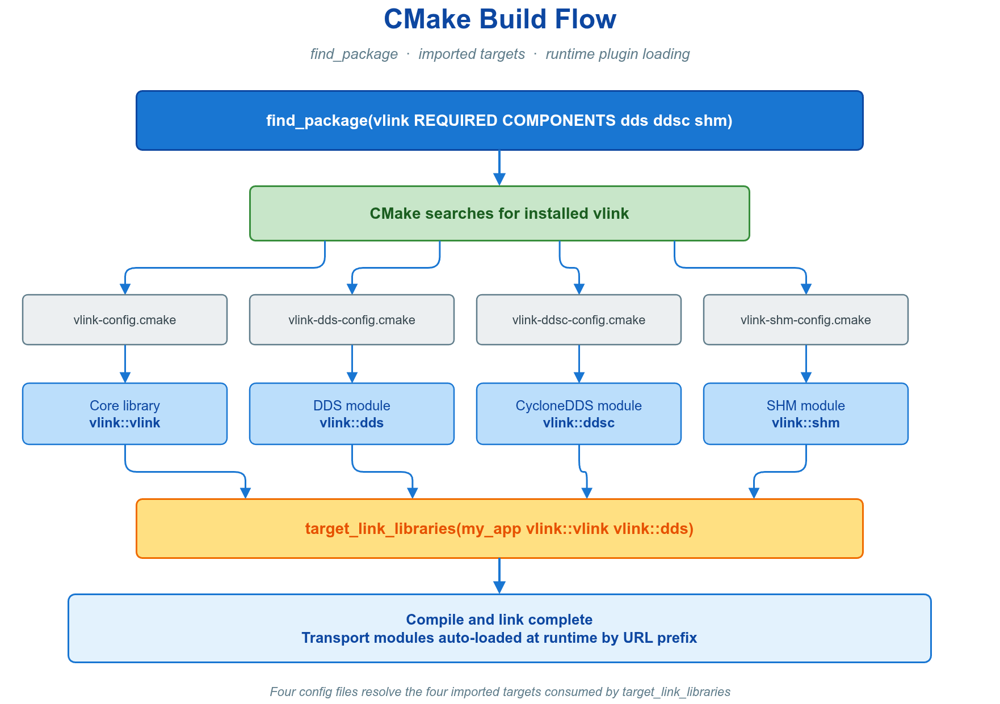
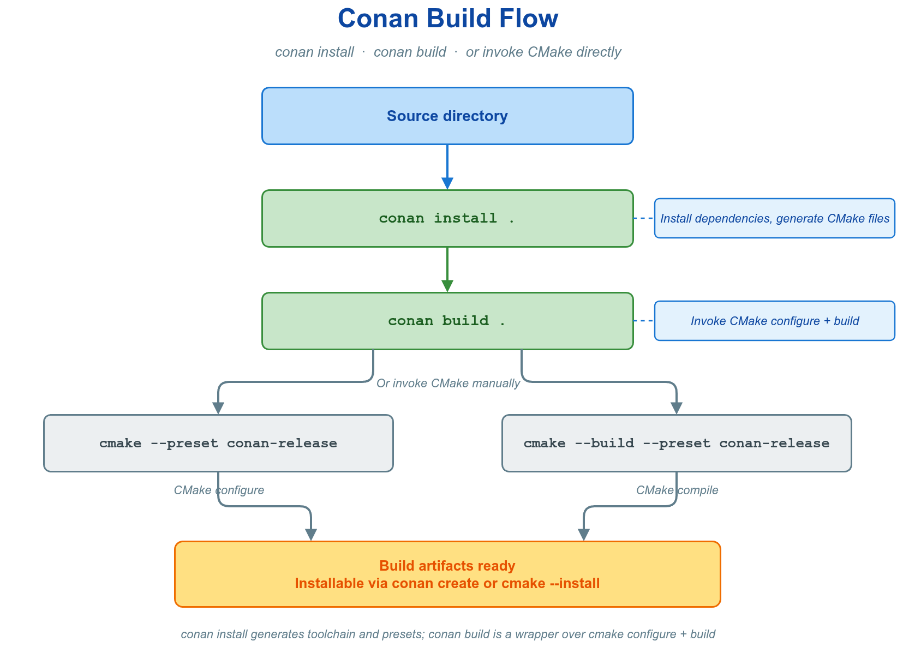
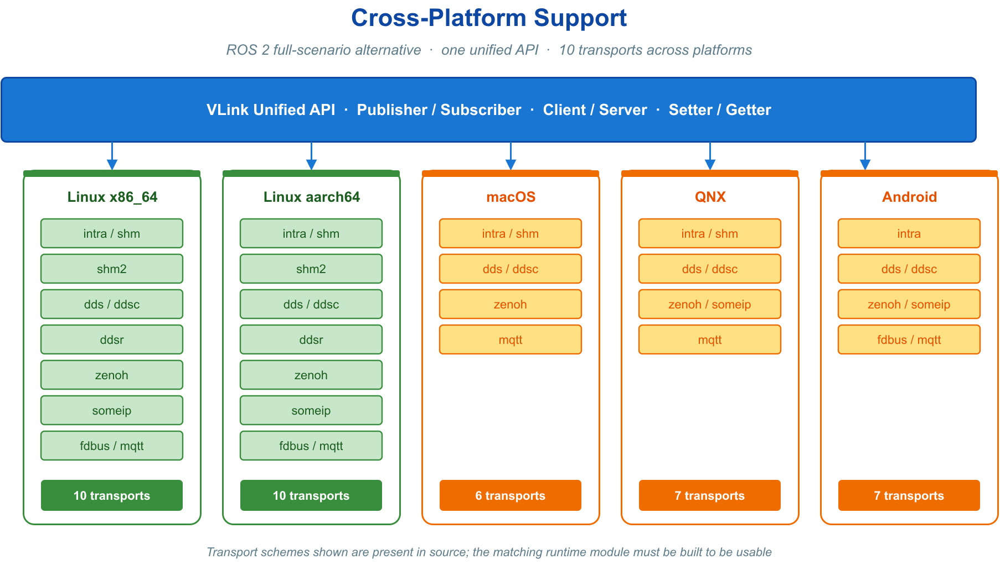
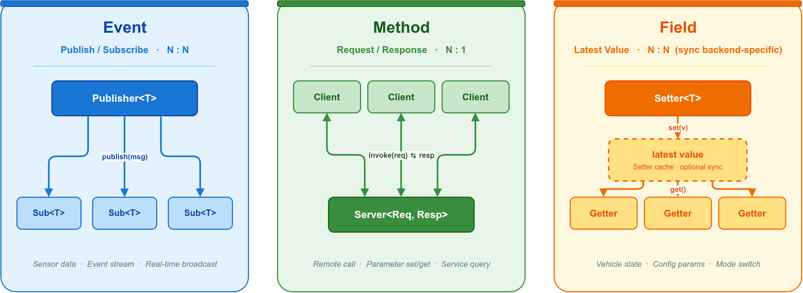
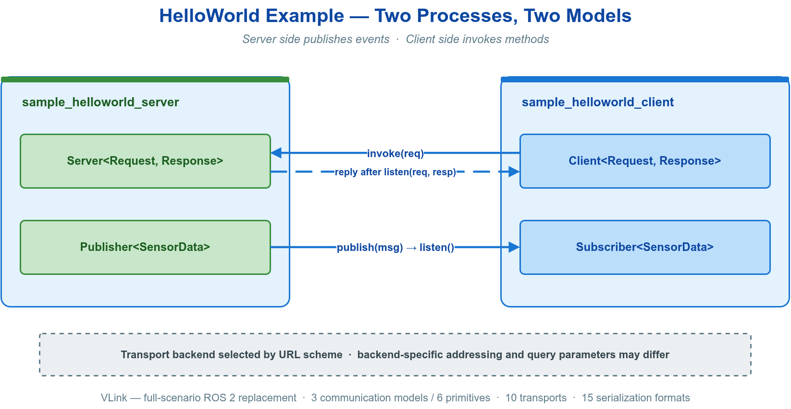
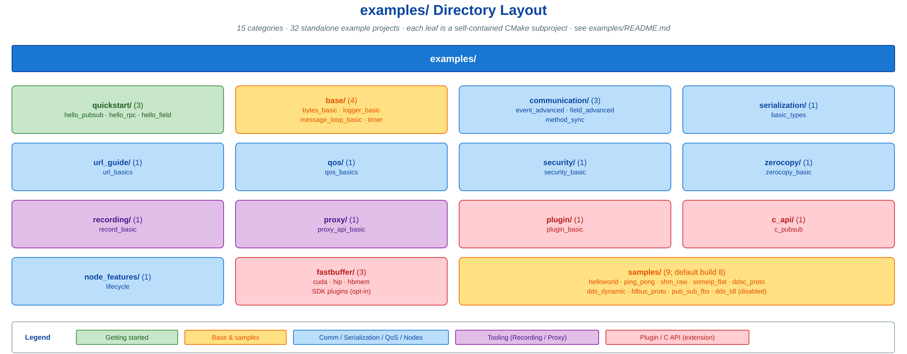

# 🏁 1. 快速上手

本章把"获得一个可工作的 VLink"所需的步骤连成一条路径：先**构建并集成**库，再写出**第一个程序**，最后从**官方示例**扩展到真实场景，对应"环境就绪 → 端到端跑通 → 按需深入"三个阶段。构建产出可链接的 `vlink::<module>` 目标与运行时库；第一个程序验证目标可用并建立对三种通信模型的最小认知；示例库把该认知扩展到序列化、QoS、安全、零拷贝与具体传输后端。

构建以 CMake 3.15+ 为基础，传输后端与可选功能按依赖可用性自动启用、缺失时自动关闭；通信端点由 URL 前缀确定，业务代码与传输后端解耦。各能力的完整接口在后续专章展开。



VLink 生态由三个协同仓库构成，集成路径取决于使用其中哪些：

| 仓库 | 职责 | 地址 |
| --- | --- | --- |
| VLink | 通信中间件本体 | <https://github.com/thun-res/vlink> |
| VKit | 跨平台构建与发布套件 | <https://github.com/thun-res/vkit> |
| VMsgs | 标准消息定义库（感知 / 规划 / 定位 / 地图等领域） | <https://github.com/thun-res/vmsgs> |

VMsgs 以 Protobuf 与 FlatBuffers schema 提供上述领域的标准消息定义，可直接复用为 VLink 各通信原语的消息类型，避免跨工程重复定义。

---

## 🚀 1.1 用 VKit 构建（推荐）

直接用 CMake 构建本仓库可以得到 VLink 库本身，但跨平台工具链准备、依赖仓库拉取顺序、运行时打包仍需手工编排。VKit 解决的正是这一编排问题：它是 CMake 之上的 workspace orchestrator，把"多仓库源码拉取 → 跨平台工具链分发 → 分层组件编排 → 增量缓存 → SDK/Runtime 打包"收敛为一条命令，使 VLink 及其依赖在 Linux、QNX、Android、macOS、Windows 上以相同命令、相同目录结构、相同产物形态完成构建与交付。

VKit 的边界明确：

- 仅依赖 Bash 与 CMake，不依赖 Python；`cmake`/`protoc`/`flatc`/`fastddsgen` 等工具随仓库分发于 `tools/<host>/bin`。
- 各组件保留原生 `CMakeLists.txt`，不需要编写 conanfile / portfile / ament 包装。
- 编排构建工作区，不取代 CMake，也不与 Conan / vcpkg 争夺依赖管理职责。

### 🏗️ 1.1.1 从零构建整套生态

```bash
git clone https://github.com/thun-res/vkit.git && cd vkit
make import_full      # 拉取 middleware 源码：vmsgs 与 vlink
make                  # 编译 → 部署 → 生成 runtime 包（= make install + make deploy）
source vkit-setup.sh && vlink-info -v   # 主机平台下打印版本号即构建成功
```

分层构建顺序为 `thirdparty → vendor → middleware(vmsgs, vlink) → app`；vmsgs 作为公共消息库先于 vlink 构建。产物 `packup/vkit-<platform>-runtime.tgz` 用于部署到目标设备。

### 🔁 1.1.2 单组件迭代

已存在本地 vlink 工作树时，无需重复拉取本体，仅同步消息库即可进行 AOSP 风格的单组件迭代：

```bash
make import_dev               # 仅拉取 vmsgs；vlink 使用本地 middleware/vlink/
cd middleware/vlink
mmm                           # 以组件 cfg 中预设的 flag 编译当前组件
mm '-DENABLE_VIEWER=ON'       # 直接透传 CMake flag（不读 cfg）
mm clean                      # 清理本组件 build/
```

`mm` 构建单组件并将参数直传 CMake，`mmm` 自动并入该组件 cfg 中的 flag，`mmc`/`mmmc` 在构建后追加 clang-tidy。CMake 缓存具有粘性：变更 configure 期 flag 前先 `mm clean`。

### 🌐 1.1.3 跨平台

每个目标平台只需一步环境准备，随后命令与产物形态一致：

```bash
# Linux x86_64：无需额外步骤
export CROSS_COMPILE_PREFIX=/opt/.../aarch64-none-linux-gnu-   # Linux aarch64 交叉
source ~/.qnx/qnxsdp-env.sh                                    # QNX
export ANDROID_NDK=/opt/android-ndk-r27                        # Android
```

`VKIT_PLATFORM=auto`（默认）自动识别主机平台；多平台经 `DEVICE_PLATFORM` 子目录隔离，同一工作区可并行编译。常用入口：`make`（install+deploy）、`make install`、`make deploy`、`make deploy_sdk`、`make clean|rclean|dclean|aclean`、`make import_full|import_dev|pull`。

> 仅需将 VLink 接入既有 CMake 工程而不构建整套生态时，转 [§1.2 standalone CMake 构建](#-12-standalone-cmake-构建) 与 [§1.5 集成](#-15-在既有工程中集成-vlink)。

---

## 🔧 1.2 standalone CMake 构建

不经 VKit 时，本仓库可独立用 CMake 构建、安装并被下游 `find_package`。以下流程在单仓库范围内完成编译与安装。

**编译并安装（Ubuntu 为例）**

```bash
sudo apt install cmake g++ libssl-dev libsqlite3-dev libzstd-dev

git clone https://github.com/thun-res/vlink.git
cd vlink

cmake -B build -DCMAKE_BUILD_TYPE=Release
cmake --build build -j$(nproc)
sudo cmake --install build          # 默认前缀 /usr/local
```

下游工程中 `find_package` 并链接的最简形式：

```cmake
find_package(vlink REQUIRED COMPONENTS all)   # 核心库 + 所有已安装传输模块

add_executable(my_app main.cc)
target_link_libraries(my_app PRIVATE vlink::all)
```

完整的端到端最小程序见 [§1.11 第一个程序](#-111-第一个程序三种通信模型)；三种通信模型的接口分别见 [通信模型](02-communication.md)。

### 🧬 1.2.1 常用构建变体

```bash
# 全功能 + 测试
cmake -B build -DCMAKE_BUILD_TYPE=Release -DENABLE_TEST=ON
cmake --build build -j$(nproc)
ctest --test-dir build --output-on-failure

# 嵌入式精简：关闭安全/压缩/SQLite/Proxy/测试，仅留核心库与传输模块
cmake -B build-min -DCMAKE_BUILD_TYPE=MinSizeRel \
    -DENABLE_SECURITY=OFF -DENABLE_SQLITE=OFF -DENABLE_ZSTD=OFF \
    -DENABLE_PROXY=OFF -DENABLE_TEST=OFF -DSELECT_LOG_BACKEND=native

# Ninja 加速
cmake -B build -G Ninja -DCMAKE_BUILD_TYPE=Release && ninja -C build
```

### 📂 1.2.2 编译输出目录

产物统一位于 `<build_dir>/output/`：

```
output/
├── vlink-setup.sh      # 运行时环境配置脚本（source 后即可运行程序）
├── bin/                # CLI 工具与示例（vlink-info / vlink-bag / vlink-monitor ...）
├── lib/                # libvlink.so（核心）+ libvlink-dds.so / -shm.so / ... 各模块
└── etc/vlink/
    └── vlink-options.txt   # 本次编译选项摘要（含已构建的 Modules 列表）
```

---

## 📦 1.3 环境依赖

### ✅ 1.3.1 必选依赖

| 依赖 | 最低版本 | 用途 | 安装命令（Ubuntu） |
| --- | --- | --- | --- |
| CMake | 3.15+ | 构建系统 | `sudo apt install cmake` |
| C++ 编译器 | GCC 9 / Clang 10 / MSVC 2019 | C++17 支持 | `sudo apt install g++` |
| pthreads | 系统自带 | 线程支持 | 系统已内置 |

> GCC 7/8 缺少完整 `std::filesystem`，需链接 `-lstdc++fs`（CMakeLists 已自动处理）；GCC 9+ 无需特殊处理。

### 🧩 1.3.2 可选依赖（按功能开关）

仅在使用对应功能时安装；缺失时该功能自动关闭，不影响核心库编译。

| 依赖库 | 启用的功能 | 对应 CMake 选项 | 安装命令（Ubuntu 22.04） |
| --- | --- | --- | --- |
| OpenSSL | 消息加密（AES） | `ENABLE_SECURITY=ON` | `sudo apt install libssl-dev` |
| SQLite3 | 录制/回放 | `ENABLE_SQLITE=ON` | `sudo apt install libsqlite3-dev` |
| zstd | 数据压缩 | `ENABLE_ZSTD=ON` | `sudo apt install libzstd-dev` |
| Protobuf | CLI 工具（eproto/parse）/ Viewer / WebViz | `ENABLE_CLI_EPROTO` / `ENABLE_CLI_PARSE` / `ENABLE_VIEWER` / `ENABLE_WEBVIZ` | `sudo apt install libprotobuf-dev protobuf-compiler` |
| FlatBuffers | CLI 工具（efbs/parse）/ Viewer / WebViz | `ENABLE_CLI_EFBS` / `ENABLE_CLI_PARSE` / `ENABLE_VIEWER` / `ENABLE_WEBVIZ` | `sudo apt install libflatbuffers-dev flatbuffers-compiler` |
| Fast-DDS | DDS 传输（`dds://`） | 模块依赖 | 见 [Fast-DDS 官方文档](https://fast-dds.docs.eprosima.com/) |
| CycloneDDS | DDS 传输（`ddsc://`） | 模块依赖 | 见 [CycloneDDS 官方文档](https://github.com/eclipse-cyclonedds/cyclonedds) |
| Iceoryx | 共享内存（`shm://`） | 模块依赖 | 见 [Iceoryx 官方文档](https://iceoryx.io/) |
| zenoh-c | Zenoh（`zenoh://`） | 模块依赖 | 见 [Zenoh 官方文档](https://zenoh.io/) |
| Paho MQTT C | MQTT（`mqtt://`） | 模块依赖 | 见 [Eclipse Paho](https://github.com/eclipse/paho.mqtt.c) |
| quill / DLT | 可选日志后端 | `SELECT_LOG_BACKEND=` | quill 已内嵌；DLT 用 `sudo apt install libdlt-dev` |

> 其余传输后端（someip / fdbus / shm2 / ddsr 等）依赖见 [传输后端与 URL](04-transport.md)。无系统库时可让 CMake 自动下载，见 [§1.4.5 CPM 选项](#-145-用-cpm-自动下载依赖)。

### 🖥️ 1.3.3 各平台编译器要求

所有平台均以 C++17 为基线；差异主要在编译器、SDK 与系统版本：

| 平台 | 推荐编译器 | 备注 |
| --- | --- | --- |
| Linux | GCC 9+ / Clang 10+ | GCC 7/8 需 `-lstdc++fs` |
| macOS | Apple Clang 12+ | 需要 macOS 10.15+ |
| Windows | MSVC 2019+ / Clang-cl | 需要 Windows SDK 10 |
| QNX 7/8 | QCC（GCC 8.3 / 12.2） | 需要 QNX SDP 7.1 / 8.0 |
| Android | NDK r25+ | API Level 21+，推荐 30+ |

---

## 🎛️ 1.4 CMake 构建选项

绝大多数构建是下列 `-D` 开关的不同子集。查看当前全部选项及取值：`cmake -B build -S . -LH`。命令行速查另见 [参考](14-reference.md)。

### ⚙️ 1.4.1 基础与功能选项

| 选项名 | 默认值 | 说明 |
| --- | --- | --- |
| `BUILD_SHARED_LIBS` | `ON` | `OFF` 时构建静态库 |
| `CMAKE_BUILD_TYPE` | `Release` | `Release` / `Debug` / `RelWithDebInfo` / `MinSizeRel` |
| `ENABLE_CXX_STD_20` | 自动 | 编译器支持时启用 C++20 |
| `ENABLE_CCACHE_BUILD` | `OFF` | 启用 ccache 编译缓存（需系统安装 ccache） |
| `ENABLE_SECURITY` | `ON` | 消息加密（AES，需 OpenSSL）；缺失时自动关闭 |
| `ENABLE_SQLITE` | `ON` | SQLite 录制/存储；缺失时自动关闭 |
| `ENABLE_ZSTD` | `ON` | Zstandard 压缩；缺失时自动关闭 |
| `ENABLE_C_API` | `ON` | 编译纯 C API 封装层 |
| `ENABLE_PYTHON_API` | `OFF` | 编译 Python 绑定（需 Python + nanobind） |
| `ENABLE_PROXY` | `ON` | 编译代理层（需至少一种 DDS 后端） |
| `ENABLE_VIEWER` | `OFF` | 编译桌面 Viewer（需 Qt + `ENABLE_PROXY`） |
| `ENABLE_WEBVIZ` | `OFF` | 编译 WebViz 桥接（Foxglove / Rerun，需 `ENABLE_PROXY`） |
| `ENABLE_DOC` | `OFF` | 构建 Doxygen 文档（需 doxygen + graphviz） |
| `ENABLE_COMPLETIONS` | `ON` | 在非 Windows 平台安装 Shell 补全脚本 |

Viewer / WebViz 子开关：`ENABLE_VIEWER_FFMPEG`、`ENABLE_VIEWER_OSG`、`ENABLE_WEBVIZ_FOXGLOVE`、`ENABLE_WEBVIZ_RERUN`，按需启用对应渲染/导出能力。

### 🚌 1.4.2 传输模块开关

模块默认按依赖可用性自动构建，用 `SKIP_*` 显式跳过：

| 选项名 | 默认 | 作用 | 选项名 | 默认 | 作用 |
| --- | --- | --- | --- | --- | --- |
| `SKIP_INTRA` | `OFF` | 跳过 `intra://` | `SKIP_ZENOH` | `OFF` | 跳过 `zenoh://` |
| `SKIP_SHM` | `OFF` | 跳过 `shm://`（Iceoryx） | `SKIP_MQTT` | `OFF` | 跳过 `mqtt://` |
| `SKIP_SHM2` | `OFF` | 跳过 `shm2://`（Iceoryx2） | `SKIP_SOMEIP` | `OFF` | 跳过 `someip://` |
| `SKIP_DDS` | `OFF` | 跳过 `dds://`（Fast-DDS） | `SKIP_FDBUS` | `OFF` | 跳过 `fdbus://` |
| `SKIP_DDSC` | `OFF` | 跳过 `ddsc://`（CycloneDDS） | `SKIP_DDSR` | `ON` | 跳过 `ddsr://`（需 RTI SDK） |

### 🧪 1.4.3 CLI / 测试 / 日志后端

- **CLI 工具**：`ENABLE_CLI_INFO` / `BAG` / `TRIGGER` / `LIST` / `MONITOR` / `CHECK` / `BENCH` / `EPROTO` / `EFBS` / `PARSE`，默认全 `ON`。其中 `EPROTO` 依赖 Protobuf、`EFBS` 依赖 FlatBuffers、`PARSE` 两者皆需，对应依赖缺失时自动关闭。`ENABLE_EXPRTK`（默认 `ON`）提供 `PARSE` / Viewer / WebViz 的表达式引擎。
- **测试**：`ENABLE_TEST`（doctest）、`ENABLE_TEST_SANITIZE`（ASan）、`ENABLE_TEST_COVERAGE`（gcov/lcov）、`ENABLE_TEST_WARN`。
- **日志后端**：`SELECT_LOG_BACKEND=spdlog|quill|dlt|native`，Android/QNX 平台默认 `native`，其余平台默认 `spdlog`；`quill` 提供更低延迟，`dlt` 面向车载 GENIVI，`native` 用于 Android/QNX 平台原生日志。

### 📋 1.4.4 选项组合参考

| 目标 | 关键开关 |
| --- | --- |
| Debug + 测试 | `-DCMAKE_BUILD_TYPE=Debug -DENABLE_TEST=ON` |
| 带符号生产构建 | `-DCMAKE_BUILD_TYPE=RelWithDebInfo` |
| 内存检测（ASan） | `-DENABLE_TEST=ON -DENABLE_TEST_SANITIZE=ON` |
| 仅静态库 | `-DBUILD_SHARED_LIBS=OFF` |
| C++20 | `-DENABLE_CXX_STD_20=ON` |
| 低延迟日志 | `-DSELECT_LOG_BACKEND=quill` |

ASan 构建下运行测试需指向 `output/lib`：

```bash
cmake -B build-dbg -DCMAKE_BUILD_TYPE=Debug -DENABLE_TEST=ON -DENABLE_TEST_SANITIZE=ON
cmake --build build-dbg -j$(nproc)
LD_LIBRARY_PATH=$PWD/build-dbg/output/lib ctest --test-dir build-dbg --output-on-failure
```

### ☁️ 1.4.5 用 CPM 自动下载依赖

无法用系统包安装依赖时，`-DENABLE_CPM=ON` 令 CMake 自动下载并构建传输后端（Fast-DDS / CycloneDDS / Iceoryx 等）；叠加 `-DENABLE_CPM_ALL=ON` 将 Protobuf / FlatBuffers / OpenSSL / SQLite3 / zstd 一并交给 CPM：

```bash
cmake -B build-cpm -DCMAKE_BUILD_TYPE=Release -DENABLE_CPM_ALL=ON
cmake --build build-cpm -j$(nproc)
```

首次构建会下载大量源码。缓存路径默认 `~/.vlink-cpm-cache`，可经环境变量 `CPM_SOURCE_CACHE` 覆盖；无法直连 GitHub 时用 `-DCPM_GITHUB_URL=<镜像地址>` 指定镜像。

---

## 🔗 1.5 在既有工程中集成 VLink

VLink 经标准 `find_package` 集成。安装后配置包位于 `<prefix>/lib/cmake/vlink/vlink-config.cmake`，`find_package` 成功后代码生成函数 `vlink_generate_cpp()` 一并可用。集成的核心规则是：**使用哪种 URL，就链接对应的 `vlink::<module>`**——URL 前缀即后端选择，业务代码与传输后端解耦，详见 [§1.5.2 模块目标与 URL 前缀对应关系](#-152-模块目标与-url-前缀对应关系)。

### 📑 1.5.1 find_package 三种写法

```cmake
# A. 仅核心库（公共头文件 + 基础库；任何 URL 后端都需另链对应模块，含 intra://）
find_package(vlink REQUIRED)
target_link_libraries(my_app PRIVATE vlink::vlink)

# B. 加载所有已安装传输模块（推荐）
find_package(vlink REQUIRED COMPONENTS all)
target_link_libraries(my_app PRIVATE vlink::all)

# C. 按需挑选传输模块
find_package(vlink REQUIRED COMPONENTS dds shm intra)
target_link_libraries(my_app PRIVATE vlink::vlink vlink::dds vlink::shm vlink::intra)
```

`vlink::all` 等于核心库加上系统上所有已安装的传输模块，免去逐个列举。

### 🧱 1.5.2 模块目标与 URL 前缀对应关系

| URL 前缀 | 链接目标 | 说明 |
| --- | --- | --- |
| `intra://` | `vlink::intra` | 进程内，无需序列化 |
| `shm://` | `vlink::shm` | Iceoryx 共享内存；支持 transport loan |
| `shm2://` | `vlink::shm2` | Iceoryx2 共享内存（Beta） |
| `dds://` | `vlink::dds` | Fast-DDS，跨机首选 |
| `ddsc://` | `vlink::ddsc` | CycloneDDS，跨机 |
| `zenoh://` | `vlink::zenoh` | 云边协同（Beta） |
| `someip://` | `vlink::someip` | 车载以太网 SOA（Beta） |
| `mqtt://` | `vlink::mqtt` | IoT / 云端桥接（Beta） |
| —（C 调用） | `vlink::c_api` | 纯 C API / 跨语言 FFI |

> 其余后端（`ddsr` / `fdbus`）目标名同理，均为 `vlink::<scheme>`。完整后端对比见 [传输后端与 URL](04-transport.md)。

### 📝 1.5.3 CMakeLists.txt 模板

```cmake
cmake_minimum_required(VERSION 3.15)
project(my_vlink_app LANGUAGES CXX)

set(CMAKE_CXX_STANDARD 17)
set(CMAKE_CXX_STANDARD_REQUIRED ON)

find_package(vlink REQUIRED COMPONENTS all)

# 可选：用到 Protobuf 消息时查找序列化库
find_package(Protobuf CONFIG QUIET)

# 可选：从 .proto 生成 C++ 代码（见 §1.6）
if(Protobuf_FOUND)
  file(GLOB PROTO_FILES CONFIGURE_DEPENDS ${CMAKE_CURRENT_SOURCE_DIR}/proto/*.proto)
  vlink_generate_cpp(TARGET my_proto_gen PROTO ${PROTO_FILES}
                     OUT_DIR "${CMAKE_BINARY_DIR}/generated")
endif()

add_executable(my_vlink_app src/main.cc)
target_link_libraries(my_vlink_app PRIVATE vlink::all)

if(TARGET my_proto_gen)
  target_link_libraries(my_vlink_app PRIVATE my_proto_gen)
endif()
```

### 🛣️ 1.5.4 非标准安装路径与运行时库路径

VLink 装于非标准前缀时，用以下任一方式令 CMake 定位配置包：

```bash
cmake -B build -DCMAKE_PREFIX_PATH=/opt/vlink                   # 方式一
cmake -B build -Dvlink_DIR=/opt/vlink/lib/cmake/vlink           # 方式二
export CMAKE_PREFIX_PATH=/opt/vlink:$CMAKE_PREFIX_PATH          # 方式三
```

运行时若报 `error while loading shared libraries: libvlink.so.*`，需令动态库可被定位：

```bash
source <build_dir>/output/vlink-setup.sh                        # 环境脚本
# 或：export LD_LIBRARY_PATH=/usr/local/lib:$LD_LIBRARY_PATH
# 或：echo "/usr/local/lib" | sudo tee /etc/ld.so.conf.d/vlink.conf && sudo ldconfig
```

> VLink 不提供 `.pc` 文件，统一走 CMake config 包；非 CMake 工程经 `vlink::c_api` 的 C 接口接入，见 [集成](13-integration.md)。

---

## 🧾 1.6 IDL 代码生成 vlink_generate_cpp()

`vlink_generate_cpp()` 统一封装 `protoc`、`flatc`、`fastddsgen`，将 IDL 编为可链接的 C++ 目标。最常用形式仅需一行：

```cmake
vlink_generate_cpp(TARGET sensor_gen PROTO ${CMAKE_CURRENT_SOURCE_DIR}/proto/sensor.proto)
target_link_libraries(my_app PRIVATE vlink::all sensor_gen)
```

参数：

| 参数 | 说明 |
| --- | --- |
| `TARGET <name>` | 可选；指定后将生成文件打包为可链接的 CMake 目标 |
| `PROTO` / `FBS` / `DDS` | 必选三选一：分别调用 protoc / flatc / fastddsgen |
| `<input_file> ...` | 必选：一个或多个 `.proto` / `.fbs` / `.idl` 输入文件 |
| `IN_DIR <dir>` | 可选：输入公共根目录，输出保持相同目录层级 |
| `OUT_DIR <dir>` | 可选：输出目录，默认 `CMAKE_CURRENT_BINARY_DIR` |
| `FLAGS <flags>` | 可选：透传给底层工具的额外参数 |

> 不指定 `TARGET` 时，生成的头/源文件路径置于 `VLINK_GEN_HDRS` / `VLINK_GEN_SRCS` 变量供手动添加。需手动指定工具路径时，protoc / flatc 设环境变量或缓存变量 `VLINK_PROTOC_PROGRAM` / `VLINK_FLATC_PROGRAM`，fastddsgen 设环境变量 `VLINK_DDSGEN_PROGRAM` 或缓存变量 `FASTDDS_GEN_EXECUTABLE`。

### 🟦 1.6.1 Protobuf

```protobuf
// proto/sensor.proto
syntax = "proto3";
package sensor;
message SensorData {
  int64  timestamp = 1;
  double value     = 2;
  string unit      = 3;
}
```

```cmake
find_package(Protobuf REQUIRED)
vlink_generate_cpp(TARGET sensor_gen PROTO ${CMAKE_CURRENT_SOURCE_DIR}/proto/sensor.proto)
target_link_libraries(my_app PRIVATE vlink::all sensor_gen)
```

```cpp
#include <vlink/vlink.h>
#include "sensor.pb.h"

vlink::Publisher<sensor::SensorData> pub("dds://sensor/data");
sensor::SensorData msg;
msg.set_timestamp(12345);
msg.set_value(3.14);
msg.set_unit("m/s");
pub.publish(msg);                       // 框架按消息类型自动选择编解码

vlink::Subscriber<sensor::SensorData> sub("dds://sensor/data");
sub.listen([](const sensor::SensorData& msg) {
  VLOG_I("value=", msg.value(), " unit=", msg.unit());
});
```

### 🟩 1.6.2 FlatBuffers

FlatBuffers 生成 header-only 代码，支持零拷贝读取。

```fbs
// fbs/lidar.fbs
namespace lidar;
table PointCloud { timestamp:int64; points:[float]; width:uint32; height:uint32; }
root_type PointCloud;
```

```cmake
find_package(flatbuffers REQUIRED)
vlink_generate_cpp(TARGET lidar_gen FBS ${CMAKE_CURRENT_SOURCE_DIR}/fbs/lidar.fbs)
target_link_libraries(lidar_node PRIVATE vlink::all lidar_gen)
```

生成的 `lidar.fbs.hpp` 含 `PointCloudT`（普通对象）与 `PointCloud`（零拷贝视图），对应两种发布方式：

```cpp
#include "lidar.fbs.hpp"

// 直接发布对象
vlink::Publisher<lidar::PointCloudT> pub("shm://lidar/cloud");
lidar::PointCloudT cloud;
cloud.points = {1.0f, 2.0f, 3.0f};
pub.publish(cloud);

// 已用 FlatBufferBuilder 序列化时，发布其指针
flatbuffers::FlatBufferBuilder fbb;
// ... 填充 fbb ...
pub.publish_fbb(&fbb);                  // bool publish_fbb(const void* fbb, bool force = false)
```

### 🟨 1.6.3 FastDDS IDL

FastDDS IDL 经 CDR 序列化，与原生 DDS 生态互通。

```idl
// idl/vehicle.idl
struct VehicleStatus { long speed; double heading; string status_msg; };
```

```cmake
vlink_generate_cpp(TARGET vehicle_gen DDS ${CMAKE_CURRENT_SOURCE_DIR}/idl/vehicle.idl)
target_link_libraries(vehicle_node PRIVATE vlink::all vehicle_gen)
```

> Fast-DDS 3.x 起（CMake 目标 `fastdds`）生成 `.hpp` 系列文件，2.x 及以下（目标 `fastrtps`）生成 `.h` 系列；函数已自动适配。需向底层 `fastddsgen` 透传额外参数时用 `FLAGS "..."`。序列化机制与选型见 [消息序列化](03-serialization.md)。

---

## 🅒 1.7 Conan 构建

[Conan](https://conan.io/) 2.x 可自动下载、构建、缓存第三方库，实现可复现构建。VLink 自带 `conanfile.py`，适用于以 Conan 管理依赖的工程，定位与 VKit 互补：VKit 编排多仓库 workspace，Conan 管理单仓库依赖图。



```bash
pip install conan
conan profile detect --force            # 首次：生成默认 profile

conan install . --output-folder=conan --build=missing -s build_type=Release
conan build . --output-folder=conan
cmake --install conan --prefix /usr/local   # 可选安装
```

Conan 选项是 CMake 选项的小写下划线形式，经 `-o "vlink/*:..."` 传入：

```bash
conan install . --build=missing -s build_type=Release \
    -o "vlink/*:shared=True" \
    -o "vlink/*:enable_security=False" \
    -o "vlink/*:enable_test=True" \
    -o "vlink/*:select_log_backend=quill" \
    -o "vlink/*:enable_cpm_all=True"      # 全新系统：依赖全部交给 CPM
```

下游应用消费 VLink 时，最简形式用 `conanfile.txt`：

```ini
[requires]
vlink/2.1.0
[generators]
CMakeDeps
CMakeToolchain
[options]
vlink/*:shared=True
```

```bash
conan install . --build=missing -s build_type=Release
cmake --preset conan-release && cmake --build build
```

> `conanfile.py` 消费、`editable` 本地调试、`export` / `create` / `upload` / `lock` 等为 Conan 通用用法，见 [Conan 官方文档](https://docs.conan.io/)。

---

## 🧭 1.8 交叉编译与平台支持

VLink 支持 Linux（x86_64 / aarch64）、Android、QNX 7.1 / 8.0、macOS（Apple Silicon / x86_64）、Yocto / Buildroot 嵌入式 Linux，Windows 为 Beta。



### 🗺️ 1.8.1 传输后端 × 平台支持矩阵

| 后端 | Linux | Android | QNX | macOS | 备注 |
| --- | :---: | :---: | :---: | :---: | --- |
| `intra://` | 是 | 是 | 是 | 是 | 纯进程内，无外部依赖 |
| `shm://` | 是 | 否 | 否 | 否 | 依赖 Iceoryx RouDi（POSIX SHM） |
| `dds://` | 是 | 是 | 是 | 是 | 跨机首选 |
| `ddsc://` | 是 | 是 | 是 | 是 | CycloneDDS，跨机 |
| `zenoh://` | 是 | 是 | 是 | 是 | 云边场景 |
| `someip://` | 是 | 是 | 是 | 否 | 车载以太网 |
| `mqtt://` | 是 | 是 | 是 | 是 | IoT / 云端桥接 |

> 完整矩阵（含 shm2 / ddsr / fdbus）见 [传输后端与 URL](04-transport.md)。

### 🪜 1.8.2 通用三步法

`tools/` 下提供各平台预置工具链文件（`tools/<linux|android|qnx|darwin>/*.toolchain.*.cmake`）。VKit 用户由 VKit 自动选择工具链（见 [§1.1.3](#-113-跨平台)）；standalone 构建按以下三步：

1. 准备工具链 / SDK：装好交叉编译器或 source 平台 SDK 环境脚本。
2. 设必要环境变量（见 [§1.8.3](#-183-各平台差异)）。
3. 指定工具链文件配置构建：

```bash
cmake -B build_cross \
    -DCMAKE_TOOLCHAIN_FILE=/work/vlink/tools/linux/linux.toolchain.aarch64.cmake \
    -DCMAKE_BUILD_TYPE=Release
cmake --build build_cross -j$(nproc)
```

### 🔀 1.8.3 各平台差异

| 平台 | 工具链文件 | 必设环境变量 | 关键注意 |
| --- | --- | --- | --- |
| ARM Linux | `linux/linux.toolchain.aarch64.cmake` | `CROSS_COMPILE_PREFIX`（如 `aarch64-linux-gnu-`），sysroot 设 `LINUX_INSTALL_PREFIX` | 先装 `gcc-aarch64-linux-gnu g++-aarch64-linux-gnu` |
| Android | `android/android.toolchain.aarch64.cmake` | `ANDROID_NDK`（NDK 根目录） | 必须 `c++_shared`；`shm://` 不可用，改用 `dds://`/`intra://`；日志走 native；API 21+ |
| QNX | `qnx/qnx.toolchain.aarch64.cmake` | `QNX_HOST` / `QNX_TARGET`（source `qnxsdp-env.sh` 后自动设） | `shm://` 需构建 Iceoryx 模块并运行 RouDi |
| macOS | 本机直接编；交叉用 `darwin/darwin.toolchain.aarch64.cmake` | 交叉时 `VLINK_HOST_PLATFORM=darwin-x86_64` | Universal 包用 `-DCMAKE_OSX_ARCHITECTURES="arm64;x86_64"`；`shm://` 需构建 Iceoryx 模块并运行 RouDi |
| Yocto | `linux/linux.toolchain.aarch64.cmake` | source SDK 后自动有 `SYSROOT` / `OE_CMAKE_TOOLCHAIN_FILE` | 工具链文件自动 include OE 配置 |
| Buildroot | `linux/linux.toolchain.aarch64.cmake` | `CROSS_COMPILE_PREFIX` + `LINUX_INSTALL_PREFIX` 指向 Buildroot host/staging | 建议 `MinSizeRel` + 关闭 Proxy/SQLite |

> Conan 交叉编译用对应 `--profile:host`（os/arch/编译器在 profile 中写明）。交叉相关环境变量全集见 [集成](13-integration.md)。

---

## 🗂️ 1.9 安装路径结构

执行 `cmake --install` 后的目录结构（仅列对集成有用的部分）：

```
<prefix>/
├── include/vlink/          # 公共头文件
│   ├── vlink.h             # 主 include（含全部六个核心原语）
│   ├── publisher.h  subscriber.h  client.h  server.h  getter.h  setter.h
│   ├── node.h  serializer.h  version.h
│   ├── base/               # 基础工具（Logger / MessageLoop / Timer / Bytes ...）
│   ├── extension/          # 扩展功能（QoS / 安全 / Bag ...）
│   ├── modules/            # 各传输模块配置头
│   ├── external/           # C API、代理 API 头
│   └── zerocopy/           # 零拷贝数据类型头
├── lib/
│   ├── libvlink.so                 # 核心库
│   ├── libvlink-dds.so / -shm.so / -intra.so / ...   # 各传输模块（按构建配置）
│   ├── python/                     # Python 绑定（启用 ENABLE_PYTHON_API 时）
│   └── cmake/vlink/                # find_package 入口（vlink-config.cmake 等）
├── bin/                    # CLI 工具（vlink-info / vlink-bag / vlink-monitor ...）
└── etc/vlink/
    ├── vlink-options.txt           # 编译选项摘要
    ├── vlink-setup.sh              # 运行时环境配置脚本
    └── licenses/                   # 本体与第三方许可证
```

---

## 📤 1.10 打包与发布

VLink 在 `packup/` 下提供发行包脚本，面向打包者；终端用户用 [§1.2](#-12-standalone-cmake-构建) 的 `cmake --install` 或 VKit runtime 包即可。

| 脚本 | 产物 | 适用 |
| --- | --- | --- |
| `packup/build-deb.sh` | `.deb` | Debian / Ubuntu |
| `packup/build-rpm.sh` | `.rpm` | RHEL / Fedora / openEuler / Anolis |
| `packup/build-arch.sh` | `.pkg.tar.zst` | Arch / Manjaro |
| `packup/build-conan.sh` / `.bat` | 便携 tgz/zip + 安装器 | 含 Viewer/Qt 的桌面发行（全 Conan 依赖） |

在项目根目录执行对应脚本（如 `./packup/build-deb.sh .`），产物落于 `build-<type>/packup/`。运行时依赖（OpenSSL / SQLite / zstd）写入包元数据，由系统包管理器自动拉取。

> 需支持更老的发行版时，在更老的系统上构建。CPack 配置集中于 `cmake/package.cmake`。

---

## 🧩 1.11 第一个程序：三种通信模型

库就绪后，验证集成的最小方式是跑通一次端到端通信。VLink 提供三种通信模型，对应六个核心原语；模型选择由通信语义决定，与后端无关。`quickstart/` 下三个示例均使用 `intra://`（进程内，无外部依赖），分别覆盖三种模型。



| 模型 | 语义 | 核心 API | quickstart 示例 |
| --- | --- | --- | --- |
| 事件 Event | 发布 / 订阅，一对多广播 | `publish` / `listen` | `hello_pubsub` |
| 方法 Method | 请求 / 响应，远程过程调用 | `invoke` / `listen` | `hello_rpc` |
| 字段 Field | 状态同步，最新值语义 | `set` / `get` | `hello_field` |

三种模型的最小可运行骨架如下。回调入参仅在回调内有效，需在回调外保留时先复制；`listen` 每个节点仅可注册一次。

```cpp
#include <vlink/vlink.h>

// Event：一对多广播
vlink::Publisher<MyMsg> pub("intra://demo/topic");
vlink::Subscriber<MyMsg> sub("intra://demo/topic");
sub.listen([](const MyMsg& msg) { use(msg); });
pub.wait_for_subscribers(std::chrono::seconds(1));
pub.publish(MyMsg{});

// Method：请求/响应
vlink::Server<Req, Resp> srv("intra://demo/calc");
srv.listen([](const Req& req, Resp& resp) { resp = compute(req); });
vlink::Client<Req, Resp> cli("intra://demo/calc");
Resp resp;
if (cli.invoke(Req{1, 2}, resp)) { use(resp); }

// Field：最新值同步
vlink::Setter<int32_t> setter("intra://demo/gear");
setter.set(3);
vlink::Getter<int32_t> getter("intra://demo/gear");
if (auto v = getter.get()) { use(*v); }
```

将 URL 前缀由 `intra://` 替换为 `shm://`、`dds://`、`zenoh://` 等，业务代码无需其它改动即可切换后端。三种模型的完整接口与边界条件见 [通信模型](02-communication.md)；端到端样例 `helloworld` 覆盖面最广，推荐作为入门阅读的起点：



---

## 🧭 1.12 官方示例导航

`examples/` 目录收录独立可编译的工程，每个聚焦一个主题。示例并非单元测试，其作用有三：为新接入者提供可读的学习路径；以真实工程场景示范生命周期、错误处理、QoS 与安全配置；在已搭建的 VLink 环境上提供端到端可运行的验证样本，便于排查传输与中间件配置问题。完整目录与分类说明见 [examples/README.md](../examples/README.md)。

### 🔨 1.12.1 构建示例

示例默认不参与编译，由两个 CMake 选项控制构建范围。

| 选项 | 作用 |
| --- | --- |
| `-DENABLE_EXAMPLES=ON` | 开启示例编译；仅编译 `samples/` 端到端样例 |
| `-DENABLE_EXAMPLES_ALL=ON` | 自动开启示例编译，并在 `samples/` 之外追加 `quickstart/`、`base/` 等全部分类示例（单独置 `ON` 即可，无需同时设 `ENABLE_EXAMPLES`） |

```bash
cmake -B build -DCMAKE_BUILD_TYPE=Release -DENABLE_EXAMPLES=ON -DENABLE_EXAMPLES_ALL=ON
cmake --build build -j$(nproc)
ls build/output/bin/
```

亦可在已安装 VLink 的环境中单独构建 `examples/` 目录或某个子工程，方式见 [examples/README.md](../examples/README.md)。

### 🗃️ 1.12.2 分类与依赖关系

目录按主题分类，依赖关系自上而下递进。`quickstart/` 与 `base/` 不依赖任何外部进程；`communication/` 之后的分类逐步引入序列化、QoS、安全与传输后端。

| 分类 | 主题 | 运行前置 |
| --- | --- | --- |
| `quickstart/` | 三种通信模型的最小示例 | 无（`intra://`） |
| `base/` | Bytes / Logger / Timer / MessageLoop 等基础库 | 无 |
| `communication/` | Event / Method / Field 完整用法 | quickstart |
| `serialization/` | Bytes / POD / `std::string` 等类型的自动序列化 | quickstart |
| `url_guide/` | URL 结构与重映射 | communication |
| `qos/` | QoS 基础与预设 profile | url_guide |
| `security/` | 应用层加密 | communication |
| `zerocopy/` | 借贷型零拷贝与 `RawData` | base/bytes |
| `recording/` | Bag 录制与回放 | communication |
| `plugin/` | 插件加载与可运行插件 | base |
| `proxy/` | ProxyAPI 客户端监控 | communication |
| `c_api/` | 纯 C 绑定 | quickstart |
| `node_features/` | 节点 init / deinit / interrupt 生命周期 | communication |
| `samples/` | 围绕具体传输协议的端到端样例 | 视示例而定 |



### 📡 1.12.3 通信模型示例

`communication/` 覆盖三种模型的完整用法。模型选型遵循语义判据：数据持续流动且消费者不要求历史一致，选 Event；需要返回值的请求 / 响应，选 Method；只关心当前状态，选 Field。后加入 Getter 是否能立即获得最新值仍取决于后端与 durability/QoS。

| 示例 | 模型 | 演示的 API |
| --- | --- | --- |
| `event_advanced` | Event | `publish` / `listen` / `wait_for_subscribers` / `has_subscribers` |
| `method_sync` | Method | `invoke(req, resp)` / `invoke(req) -> optional` / `invoke(req, timeout)` |
| `field_advanced` | Field | `set` / `get` / `wait_for_value` / `set_change_reporting` |

模型的状态语义、边界条件与完整接口见 [通信模型](02-communication.md)。

### 🔌 1.12.4 序列化、传输与 QoS 示例

序列化策略由消息类型在编译期推导，调用方无需手工选择或注册编解码器。后端选择收敛为 URL 前缀（见 [§1.5.2](#-152-模块目标与-url-前缀对应关系)）。QoS 控制可靠性、历史深度与持久化等投递行为，最常用方式是在 URL 中引用预定义 profile，例如 `dds://sensor?qos=sensor`。

| 分类 | 示例 | 主题 | 详解 |
| --- | --- | --- | --- |
| serialization | `basic_types` | POD 结构体与基本类型，无编码转换、直接内存复制 | [消息序列化](03-serialization.md) |
| url_guide | `url_basics` | URL 结构、参数与话题重映射 | [传输后端与 URL](04-transport.md) |
| qos | `qos_basics` | QoS 基础参数与预设 profile（事件 / 方法 / 字段 / 传感器） | [QoS 配置](05-qos.md) |

自定义类型（重载 `operator<<` / `operator>>`）与 DynamicData 运行时类型擦除的接入方式见 [消息序列化](03-serialization.md)。

### 🔒 1.12.5 安全与零拷贝示例

安全以节点变体接入：`SecurityPublisher<T>` / `SecuritySubscriber<T>` 等在构造时传入密钥或配置，加密发生在序列化之后、传输之前，对上层透明。借贷型后端（如 `shm://`）通过 `loan()` / `return_loan()` 在共享内存中直接构造消息，避免序列化拷贝。

| 分类 | 示例 | 主题 |
| --- | --- | --- |
| security | `security_basic` | 对称密钥加密的发布 / 订阅 |
| zerocopy | `zerocopy_basic` | `loan()` / `return_loan()` 原始借贷 |

密钥配置见 [安全加密](07-security.md)；CameraFrame、PointCloud 等感知容器的字段布局见 [零拷贝](06-zerocopy.md)。

### 🗄️ 1.12.6 录制、插件、代理与 C 绑定示例

| 分类 | 示例 | 主题 | 详解 |
| --- | --- | --- | --- |
| recording | `record_basic` | Bag 写读（`.vdb`）与节点级自动录制 | [录制与回放](09-recording.md) |
| plugin | `plugin_basic` | 插件加载与可运行插件 | [集成](13-integration.md) |
| proxy | `proxy_api_basic` | ProxyAPI 客户端监控 | [可观测性](12-observability.md) |
| c_api | `c_pubsub` | 纯 C 绑定的发布 / 订阅 | [集成](13-integration.md) |
| node_features | `lifecycle` | 节点生命周期与事件循环绑定 | [通信模型](02-communication.md) |

`base/` 分类独立演示 Bytes、Logger、Timer、MessageLoop 等基础组件（对应 `bytes_basic` / `logger_basic` / `timer` / `message_loop_basic`）；ThreadPool 等其余基础库 API 见 [基础库](08-base-library.md)。

### 🎯 1.12.7 端到端综合样例

`samples/` 收录围绕具体传输协议的完整场景，开启 `-DENABLE_EXAMPLES=ON` 即编译。

| 示例 | 传输 | 序列化 | 模型 | 说明 |
| --- | --- | --- | --- | --- |
| `helloworld` | 多后端可切换 | Protobuf | Method + Event | 覆盖面最广的入门样例 |
| `ping_pong` | 多后端可切换 | Bytes（POD） | Event（双向） | 端到端延迟测量 |
| `shm_raw` | `shm://` | Bytes | Method + Event + Field | 共享内存后端上的加密全模型演示（安全路径会复制密文） |
| `someip_flat` | `someip://` | FlatBuffers | Method + Event + Field | SOME/IP 车载以太网场景（Beta） |

### 🚦 1.12.8 后端运行前置

多数后端（`intra://`、`dds://`、`ddsc://`、`zenoh://`）无需守护进程即可运行。以下后端在运行示例前需先准备对应服务。

| 后端 | 运行前置 |
| --- | --- |
| `shm://` | 启动 SHM 守护进程（`iox-roudi`，或用 VLink 内置代理 `vlink-proxy -c <iox 配置>` 内嵌拉起） |
| `someip://` | 启动 vsomeip routing manager（Beta） |
| `fdbus://` | 启动 FDBus name server（Beta） |
| `mqtt://` | 运行 MQTT Broker（Beta） |

各后端的依赖、参数与配置见 [传输后端与 URL](04-transport.md)。

---

## 🩺 1.13 构建与运行问题排查

以下为与构建、集成、运行直接相关的高频问题；完整故障排查见 [参考](14-reference.md)。

**1. 找不到 OpenSSL / SQLite / zstd，对应功能被自动关闭。**
安装对应 `-dev` 包（如 `sudo apt install libssl-dev`）后重新配置；或显式 `-DENABLE_SECURITY=OFF` 接受关闭。

**2. 找不到 Protobuf / FlatBuffers，相关 CLI 工具（eproto/efbs/parse）或 Viewer / WebViz 被关闭。**
安装 `libprotobuf-dev protobuf-compiler libflatbuffers-dev`；非标准路径用 `-DProtobuf_ROOT=...`（macOS Homebrew 用 `-DProtobuf_DIR=$(brew --prefix protobuf)/lib/cmake/protobuf`）。

**3. `ENABLE_PROXY` 被关闭。**
代理层需至少一种 DDS 后端；安装 Fast-DDS 或 CycloneDDS，或显式 `-DENABLE_PROXY=OFF`。

**4. 警告 `VLINK_LIBRARIES is empty`。**
无任何传输模块被构建（依赖缺失）。检查 `<build>/output/etc/vlink/vlink-options.txt` 的 `Modules` 字段；至少安装一个传输后端，或用 `-DENABLE_CPM=ON` 自动下载。

**5. 运行时 `error while loading shared libraries: libvlink.so.*`。**
按 [§1.5.4](#-154-非标准安装路径与运行时库路径) 配置动态库路径（`source vlink-setup.sh` / `LD_LIBRARY_PATH` / `ldconfig`）。

**6. Conan 找不到 preset `conan-release`。**
先执行 `conan install . --build=missing -s build_type=Release` 生成 `CMakePresets.json`，再 `cmake --preset conan-release`。

> 交叉编译找不到目标库、QNX `QNX_HOST not set`、Android STL 链接错误等平台专项问题，见 [参考](14-reference.md) 与 [§1.8.3](#-183-各平台差异)。

---

## 📚 相关文档

- [概述](00-overview.md) — VLink 总览与设计理念
- [通信模型](02-communication.md) — 节点生命周期与事件 / 方法 / 字段模型用法
- [消息序列化](03-serialization.md) — 序列化机制与代码生成
- [传输后端与 URL](04-transport.md) — 各传输后端对比与平台矩阵
- [QoS 配置](05-qos.md) — 可靠性、历史深度与预设 profile
- [零拷贝](06-zerocopy.md) — 借贷型零拷贝与感知容器
- [安全加密](07-security.md) — 应用层加密与密钥配置
- [基础库](08-base-library.md) — Logger / MessageLoop / Timer / Bytes / ThreadPool
- [集成](13-integration.md) — C API、扩展与环境变量
- [参考](14-reference.md) — CMake 选项与命令速查、完整故障排查手册
- [examples/README.md](../examples/README.md) — 完整示例索引
