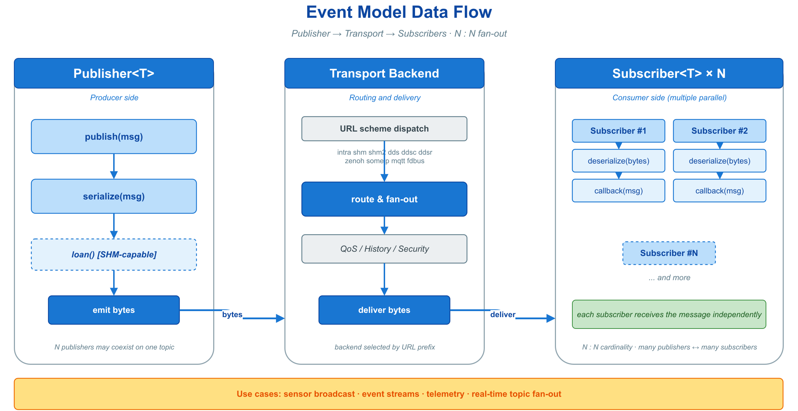
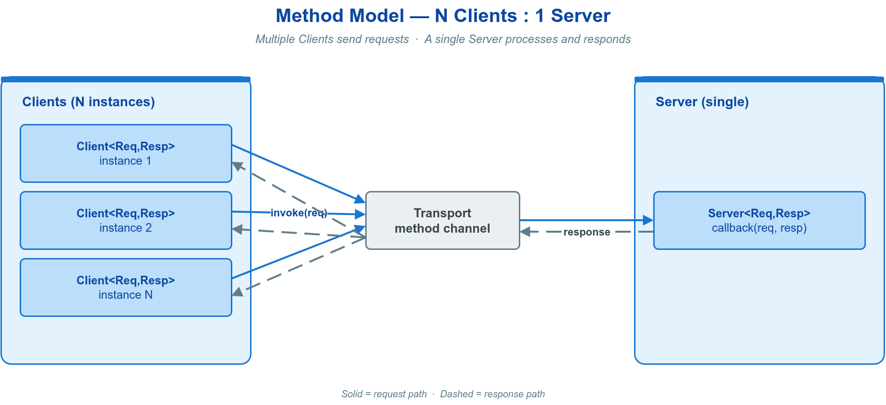
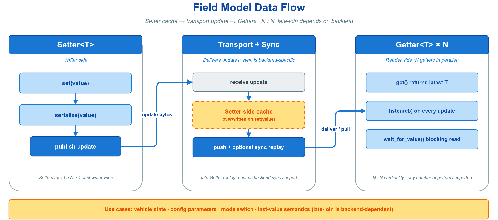
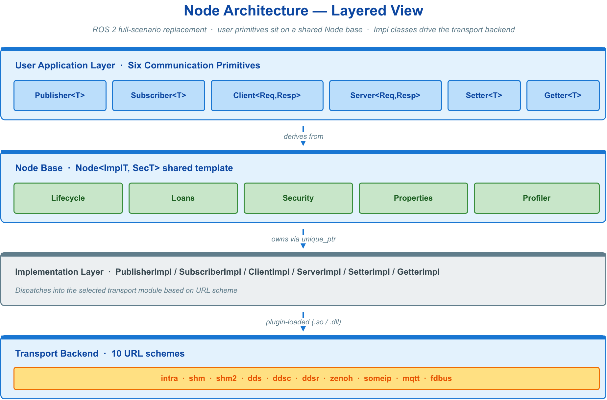
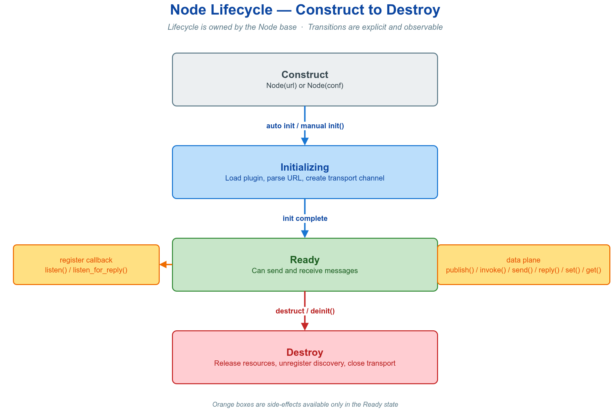

# 💬 2. 通信模型

VLink 的全部通信能力由三种模型、六个原语承载：事件模型（`Publisher<T>` / `Subscriber<T>`）、方法模型（`Client<Req,Resp>` / `Server<Req,Resp>`）、字段模型（`Setter<T>` / `Getter<T>`）。三者是同一抽象在三个语义维度上的投影——数据流广播、请求/响应闭环、状态值同步——并共享同一个 `Node` 基类，因而具有一致的构造、初始化、事件循环绑定与析构行为。本章先建立跨原语共用的节点模型，再依次给出三种模型的机制、核心 API、最小示例与选型判据。


---

## 🧩 2.1 模型总览与选型

六个原语共享两条不变量，理解一次即贯通全部：

- **消息类型即契约**——收发两端的模板参数类型决定编解码策略，由编译期推导，不进入业务代码。完整类型族见 [消息序列化](03-serialization.md)。
- **URL 即后端**——URL 的 scheme 决定传输后端；地址模型兼容的 topic 后端通常只需更换前缀，专用协议还须调整完整地址和查询参数。通信原语与主要业务逻辑不变，完整后端列表见 [传输后端与 URL](04-transport.md)。

由此，六个原语共享生命周期与配置接口；默认回调线程和 attach 支持仍随后端而异。三种模型的主要差异位于语义层，选型首先由通信语义决定：

| 模型 | 语义 | 原语 | 方向 / 拓扑 | 状态保留 | 适用判据 |
| --- | --- | --- | --- | --- | --- |
| 事件 Event | 发布 / 订阅数据流 | `Publisher<T>` / `Subscriber<T>` | 单向，多对多 | 无（历史由 QoS Durability 控制） | 持续产生、一对多广播、无需逐条确认：传感器采样、感知结果、状态广播 |
| 方法 Method | 请求 / 响应 RPC | `Client<Req,Resp>` / `Server<Req,Resp>` | 双向，N 对 1 | 每请求配对一响应；`Resp` 为空时退化为单向 fire-and-forget | 需返回值或执行确认：地图查询、参数读写、服务调用 |
| 字段 Field | 最新值状态同步 | `Setter<T>` / `Getter<T>` | 双向，多对多 | 单一最新值，覆盖式；迟到获取能力随后端/QoS | 只关心当前状态；必要时配置 durability 并等待值：车辆状态、配置参数、标定值 |

三种模型的数据流如下，分别对应单向扇出、双向闭环与覆盖式状态同步：







---

## 🔧 2.2 节点基础与生命周期

六个原语全部继承自同一个 `Node` 基类。该基类承载跨原语通用的能力——构造、生命周期演进、配置时机、事件循环绑定、零拷贝借贷与运行期控制，是先于任何具体模型必须掌握的内容。



### 2.2.1 🗺️ 概念与模型

`Node` 统一暴露下列跨原语服务：初始化与反初始化（注册、注销节点的传输端点）；属性配置与查询（URL、传输类型、后端调优键值对）；在后端支持时绑定 `MessageLoop`；零拷贝借贷；阻塞等待的中断、消息传递的暂停与恢复。具体能力仍可能受后端约束。

理解节点的关键是一条不变量：**节点先经历"构造 → 初始化"建立通道，使用期间收发消息，最后经历"反初始化 → 析构"释放资源；初始化前后允许施加的配置集合不同。**

### 2.2.2 🏗️ 构造方式

节点提供三种构造路径，覆盖从最简到需精细配置的场景。


**URL 字符串构造**　最常用入口。scheme 决定传输后端，地址和查询参数由该后端解释；迁移后端时修改 URL，不需要更换通信原语。

```cpp
vlink::Publisher<MyMsg> pub("dds://vehicle/speed");
```

**Conf 配置对象构造**　需指定 domain、history depth、QoS profile 等后端参数时，先构造对应的 `Conf` 再传入。

```cpp
vlink::DdsConf conf("vehicle/speed", /*domain=*/0, /*depth=*/0, /*qos=*/"sensor");
vlink::Publisher<MyMsg> pub(conf);
```

`DdsConf` 另提供 `DdsConf(topic, domain, const PropertiesMap& qos_ext)` 重载，用于在运行期组装 per-entity QoS 属性映射，而非引用已注册的命名 profile；该重载与命名 `qos` 字段互斥（二者同时非空时 `is_valid()` 返回 `false`）。

**延迟初始化构造**　传入 `InitType::kWithoutInit`，节点构造后不立即初始化，留出施加"仅在 `init()` 之前生效"配置的窗口，配置完成后手动调用 `init()`（见 2.2.4）。

```cpp
vlink::Publisher<MyMsg> pub("dds://topic", vlink::InitType::kWithoutInit);
pub.set_property("dds.ip", "192.168.1.100");
pub.init();
```

构造默认参数为 `InitType::kWithInit`，即构造时即完成初始化。绝大多数场景使用默认值，无需关心初始化时机。

### 2.2.3 🔄 生命周期



节点生命周期由三个方法刻画。

| 方法 | 语义 | 幂等性 |
| --- | --- | --- |
| `bool init()` | 建立底层传输通道并开始收发；成功返回 `true` | 已初始化时返回 `false` |
| `bool deinit()` | 中断所有阻塞等待并注销该节点的传输端点 | 可安全重复调用；后端可缓存共享 native endpoint |
| `bool has_inited()` | 查询当前是否已初始化 | — |

两条默认行为消除了绝大部分手动管理：**构造默认执行 `init()`**（`InitType::kWithInit`），通常无需显式调用；**析构自动执行 `deinit()`**，节点离开作用域即注销自身、停止回调并唤醒等待者，仅在需要提前注销时才显式调用 `deinit()`。为复用 native 连接，后端 factory 可以继续缓存已无该节点注册的共享 endpoint。重复调用会由状态检查挡住，但调用方不得让 `init()` 与 `deinit()` 彼此并发。借助 RAII，典型用法无需任何显式生命周期调用：

```cpp
{
    vlink::Subscriber<MyMsg> sub("dds://vehicle/speed");
    sub.listen([](const MyMsg& msg) { /* ... */ });
    // ... 使用 ...
}   // 离开作用域：自动 deinit 并清理
```

### 2.2.4 ⏱️ 配置时机

部分配置方法必须在 `init()` 之前调用方能生效——这是延迟初始化存在的根本原因：先构造，再施加这类配置，最后 `init()`。

```cpp
vlink::Publisher<MyMsg> pub("dds://topic", vlink::InitType::kWithoutInit);
pub.set_property("dds.ip", "192.168.1.100");
pub.set_ser_type("my.proto.MyMsg", vlink::SchemaType::kProtobuf);
pub.set_discovery_enabled(false);
pub.init();
```

下表给出各配置方法相对 `init()` 的生效边界，"自动重启"指调用后扩展会重新初始化以应用变更。

| 方法 | init 之前 | init 之后 |
| --- | --- | --- |
| `set_property()` | 推荐 | 一般不再生效 |
| `set_ssl_options()` | 必须 | 不生效 |
| `set_ser_type()` | 推荐 | 通常自动重启扩展；DDS raw/CDR 模式或 CDR 类型名变更须先 `deinit()` |
| `set_discovery_enabled()` | 推荐 | 自动重启扩展后生效 |
| `bind_proto_arena()` | 必须在对应节点首次创建接收对象前；`Getter` 建议以 `kWithoutInit` 构造，绑定后再 `init()` | 可在首次 `listen()` / `invoke()` / 接收更新前绑定 |
| `set_record_path()` | 允许 | 允许 |
| 安全配置（构造参数或 `enable_security()`） | 必须在 `init()` 前 | 拒绝修改 |

工厂方法同样接受 `InitType`，延迟初始化模式一致：

```cpp
auto pub = vlink::Publisher<MyMsg>::create_unique("dds://topic", vlink::InitType::kWithoutInit);
pub->set_property("dds.ip", "192.168.1.100");
pub->init();
```

### 2.2.5 ⚙️ 属性配置与查询

属性以字符串键值对形式传入，透传给后端做调优；查询接口返回节点的不变元数据。`set_property` / `get_property` 线程安全。

| 方法 | 语义 |
| --- | --- |
| `const std::string& get_url() const` | 返回构造时的 URL；以 Conf 构造时为空 |
| `TransportType get_transport_type() const` | 返回所用后端，如 `kDds` / `kShm` |
| `void set_property(const std::string& key, const std::string& value)` | 设置后端调优属性 |
| `std::string get_property(const std::string& key) const` | 读取属性当前值 |
| `const std::string& get_ser_type() const` | 返回当前运行期序列化类型标识 |
| `SchemaType get_schema_type() const` | 返回当前 schema 家族（`SchemaType`） |
| `bool get_discovery_enabled() const` | 查询发现是否启用 |

**序列化类型 `set_ser_type()`**　序列化策略通常由消息类型 `MsgT` 在编译期自动推导，绝大多数情况无需手动设置。仅在使用动态类型或需自定义类型名时调用以覆盖默认；建议在 `init()` 前配置。初始化后修改通常会重启扩展元数据路径，但 DDS 的 raw/CDR 模式和 CDR 类型名同时决定原生 Topic/DataWriter/DataReader 类型，节点仍处于初始化状态时禁止修改；须先 `deinit()`，修改后再 `init()`。

```cpp
void set_ser_type(const std::string& ser_type, SchemaType schema_type = SchemaType::kUnknown);
```

**Protobuf Arena `bind_proto_arena()`**　当框架需要创建的消息类型是裸 Protobuf 指针（如 `MyProto*`）时，必须绑定一个生存期长于节点的 Arena。适用位置包括 `Subscriber` 的 `MsgT`、`Server` 的 `ReqT` / `RespT`、`Client` 的 `RespT` 和 `Getter` 的 `ValueT`；发布方传入的 `Publisher::MsgT`、`Client::ReqT` 与 `Setter::ValueT` 指针仍由调用方管理。`Subscriber` / `Server` 应在 `listen()` 前绑定，`Client` 应在首次 `invoke()` / `async_invoke()` 前绑定；`Getter` 为避免初始化后立即收到更新，应以 `InitType::kWithoutInit` 构造，绑定后再调用 `init()`。接收路径会为每次投递在 Arena 中创建独立消息，避免嵌套或并发回调覆盖同一对象；这些对象占用的存储会保留到调用方 reset 或销毁 Arena。

```cpp
google::protobuf::Arena arena;
vlink::Subscriber<MyProto*> sub("dds://topic");
sub.bind_proto_arena(&arena);
sub.listen([](MyProto* msg) { /* ... */ });
```

**发现开关 `set_discovery_enabled(bool)`**　关闭后节点不再向运行时上报自身，降低 CPU 与网络开销。详见 [可观测性](12-observability.md)。

### 2.2.6 🧵 绑定 MessageLoop

默认情况下，节点回调由后端自身的 delivery context 执行。后端实现支持时，`attach()` 可将节点绑定到一个 `MessageLoop`，此后回调改投递到该 loop 所在线程；`detach()` 解除绑定。当前 `intra://`、`fdbus://`、`someip://` 的六种原语均不支持 attach/detach，会告警并返回 `false`；其中 intra 默认由自身 queue pipeline 派发，`#direct` 则在发布 / 调用线程内同步回调。


| 方法 | 语义 |
| --- | --- |
| `bool attach(MessageLoop* loop)` | 后端支持时绑定到 loop；不支持或已绑定其他 loop 时返回 `false` |
| `bool detach()` | 后端支持时解除绑定；不支持或未绑定时返回 `false` |
| `MessageLoop* get_message_loop() const` | 返回当前绑定的 loop，未绑定时返回 `nullptr` |

```cpp
vlink::MessageLoop loop;

vlink::Subscriber<MyMsg> sub("dds://vehicle/speed");
sub.attach(&loop);
sub.listen([](const MyMsg& msg) {
    // 此回调在 loop 线程串行执行
});

loop.run();
```

`attach` 仅改变入站回调的执行线程，不影响 `publish` / `invoke` 等主动调用的执行位置。

| 回调路径 | 默认线程 | attach 后 |
| --- | --- | --- |
| `Subscriber` / `Getter` / `Server::listen()` | 后端 delivery context | MessageLoop 线程 |
| `register_status_handler` | 后端 delivery context | MessageLoop 线程 |
| `Publisher::publish()` / `Client::invoke()` | 调用者线程 | 调用者线程 |

边界条件：仅在后端支持 attach 时，`attach()` 须在 `listen()` 之前调用——`listen()` 一旦激活回调分发，节点需先绑定 loop 才能确定回调投递到哪个线程。从与 loop 不同的线程调用 `detach()` 时，会等待 loop 处理完当前任务后再解绑，确保解绑过程不与回调执行竞争。调用方必须检查 attach 的布尔返回值；`MessageLoop` 完整接口见 [基础库](08-base-library.md)。

### 2.2.7 🎛️ 控制方法

下列方法用于运行期控制阻塞等待与消息传递。

| 方法 | 语义 |
| --- | --- |
| `void interrupt()` | 唤醒该节点上所有阻塞等待，使其立即返回 `false` |
| `bool suspend()` | 临时暂停消息传递；行为依后端而定 |
| `bool resume()` | 恢复消息传递 |
| `bool is_suspend() const` | 查询是否处于暂停态 |
| `double get_cpu_usage() const` | 收发操作的 CPU 占用百分比 `[0.0, 100.0]` |

**`interrupt()`**　打断阻塞等待，使各原语的 `wait_for_*`（如 `Publisher::wait_for_subscribers()`、`Client::wait_for_connected()`、`Getter::wait_for_value()`）立即返回 `false`。`deinit()` 在释放前会自动调用它，因此析构不会因等待而死锁。

```cpp
vlink::Publisher<MyMsg> pub("dds://topic");

std::thread t([&pub]() {
    std::this_thread::sleep_for(std::chrono::seconds(1));
    pub.interrupt();
});

bool ok = pub.wait_for_subscribers(vlink::Timeout::kInfinite);
t.join();
```

**`suspend()` / `resume()`**　暂停语义依传输后端而定；后端不支持时打印警告并返回 `false`。

**`get_cpu_usage()`**　返回节点在收发操作中消耗的 CPU 占比，需以环境变量 `VLINK_PROFILER_ENABLE` 启用 profiler；未启用时返回 `-1.0`。详见 [集成](13-integration.md)。

### 2.2.8 ⚡ 零拷贝借贷

在共享内存类后端（`shm://`、`shm2://`，以及条件支持的 `zenoh://`）上，可从传输内存池借出缓冲区，直接在其中构造消息并发送，省去一次序列化拷贝。先以 `is_support_loan()` 判定后端是否支持，再 `loan()`。

```cpp
vlink::Publisher<vlink::Bytes> pub("shm://topic");

if (pub.is_support_loan()) {
    vlink::Bytes buf = pub.loan(sizeof(MyStruct));

    if (!buf.empty()) {
        new (buf.data()) MyStruct{42, 3.14};
        if (!pub.publish(buf)) {
            pub.return_loan(buf);  // 未被后端接受时仍由调用方归还
        }
    }
}
```

边界条件：借贷路径要求使用 `Publisher<vlink::Bytes>`，`loan()` 返回的 `Bytes` 作为消息直接发送；`is_support_loan()` 为 `false` 时 `loan()` 返回空 `Bytes`。只有成功被后端接受的发布才消费 loan，发布返回 `false` 时仍须显式归还。订阅端接收缓冲在回调返回后自动归还；若需异步留用，须在回调内复制。完整用法见 [零拷贝](06-zerocopy.md)。

### 2.2.9 🏭 工厂方法

每个原语均提供静态工厂方法，在堆上构造并返回智能指针，与栈上直接构造语义一致。

```cpp
static UniquePtr create_unique(const std::string& url_str, InitType type = InitType::kWithInit);
static SharedPtr create_shared(const std::string& url_str, InitType type = InitType::kWithInit);
```

| 方式 | 内存 | 返回 | 适用场景 |
| --- | --- | --- | --- |
| 栈上直接构造 | 栈 | 对象 | 局部使用、生命周期明确 |
| `create_unique` | 堆 | `unique_ptr` | 动态生命周期、独占所有权 |
| `create_shared` | 堆 | `shared_ptr` | 需共享所有权 |

```cpp
auto pub = vlink::Publisher<MyMsg>::create_unique("dds://topic");
auto sub = vlink::Subscriber<MyMsg>::create_shared("dds://topic");
```

### 2.2.10 🧭 节点级进阶能力

下列能力面向特定场景，本节仅给定位，详见对应专章。

- **消息级加密**　使用 `SecurityPublisher` / `SecuritySubscriber` 等节点变体；可在构造时传入配置，或对延迟初始化节点在 `init()` 前调用 `enable_security()`，初始化后不可替换。详见 [安全加密](07-security.md)。
- **传输层 TLS**　`set_ssl_options(const SslOptions&)`，须在 `init()` 之前调用；后端编译能力满足时适用于 `mqtt://` / `dds://` / `ddsc://` / `ddsr://` / `zenoh://`。详见 [安全加密](07-security.md)。
- **状态查询**　`get_status()` / `register_status_handler()` 查询连接状态变化，仅 DDS 系列后端有效。详见 [可观测性](12-observability.md)。
- **消息录制**　`set_record_path(path)` 为单个节点开启录包。详见 [录制与回放](09-recording.md)。
- **安全退出**　`set_safety_quit(true)` 以互斥保护回调与析构，避免回调执行期间节点被销毁的竞态；引入锁开销，热路径慎用。

---

## 📡 2.3 事件模型（Publisher / Subscriber）

事件模型是 VLink 的发布/订阅原语，用于一对多、单向、无应答的数据流：`Publisher<T>` 向命名主题写入消息，订阅同一主题的全部 `Subscriber<T>` 各自异步收到一份副本。它适用于持续产生且无需逐条确认的数据——传感器采样、感知结果、状态广播、日志上报。

### 2.3.1 🗺️ 概念与数据流

发布与订阅经主题 URL 解耦：双方不直接引用，仅通过相同的 `<scheme>://<topic>` 建立关联。发布方写入消息后，传输层将其投递给当时已连接的匹配订阅方；底层存储是复制还是共享，取决于消息类型与后端。

该模型的四项不变量决定其使用边界：

| 性质 | 含义 |
| --- | --- |
| 多对多扇出 | 同一主题可有多个 Publisher 与多个 Subscriber；每个匹配 Subscriber 获得一次投递 |
| 投递时序 | 回调触发方式与阻塞性随后端/模式；如 intra `#direct` 会在 `publish()` 内同步执行回调 |
| 无状态 | 不保留历史；订阅方仅接收订阅建立之后产生的消息（历史可见性由 QoS 的 Durability 控制） |
| 类型安全 | 消息类型由模板参数 `T` 固定，编解码策略按类型在编译期确定，无需手写序列化 |

URL 可携带查询参数，事件模型最常用 `?qos=`（选择 QoS profile）与 `?depth=`（历史深度）：

```cpp
vlink::Publisher<MyMsg> pub("dds://vehicle/speed?qos=sensor&depth=20");
```

### 2.3.2 🚀 快速开始

订阅端先注册回调，发布端构造后直接发出。

```cpp
#include "vlink/vlink.h"

// 订阅端
vlink::Subscriber<std::string> sub("intra://chat/room");
sub.listen([](const std::string& msg) { VLOG_I("recv: ", msg); });

// 发布端
vlink::Publisher<std::string> pub("intra://chat/room");
pub.wait_for_subscribers(std::chrono::milliseconds(500));
pub.publish("hello vlink");
```

对这类 topic 地址，将 `intra://` 换为 `shm://` 或 `dds://` 时通信 API 与业务处理可保持不变；跨进程或跨机运行还须链接并部署对应后端，配置其运行时、发现与 QoS。完整可运行示例见 [快速开始](01-started.md)（`hello_pubsub`）。

### 2.3.3 📤 Publisher

构造时传入 URL，默认立即初始化并可发布。直接构造用于栈对象；需以 `unique_ptr` / `shared_ptr` 持有时用工厂方法。

```cpp
vlink::Publisher<MyMsg> pub("dds://sensor/temperature");
auto up = vlink::Publisher<MyMsg>::create_unique("dds://sensor/temperature");
auto sp = vlink::Publisher<MyMsg>::create_shared("dds://sensor/temperature");
```

| 方法 | 语义 |
| --- | --- |
| `bool publish(const MsgT& msg, bool force = false)` | 序列化并发出一条消息；返回 `true` 表示传输层已接受 |
| `bool publish_fbb(const void* fbb, bool force = false)` | 发布已 `Finish()` 的 FlatBufferBuilder（FlatBuffers 专用） |
| `bool wait_for_subscribers(timeout = 5s)` | 阻塞等待至少一个订阅者出现；超时或被 `interrupt()` 打断返回 `false` |
| `bool has_subscribers() const` | 非阻塞查询当前是否有订阅者在线 |
| `void detect_subscribers(callback)` | 注册订阅者上 / 下线回调 `void(bool present)`；注册时已有订阅者会立即触发一次 |

`force` 默认 `false`：无订阅者时跳过发送，省去序列化开销；置 `true` 则即使无人订阅也强制发出（录包、字段语义等场景需要）。发布前可探测订阅者是否就绪，避免向空主题发送：

```cpp
if (pub.wait_for_subscribers(std::chrono::seconds(5))) {
    pub.publish(msg);
}
```

边界条件：热路径上不应每条消息都调用 `has_subscribers()`；用 `detect_subscribers` 维护一个标志位再判断，避免重复查询开销。

### 2.3.4 📥 Subscriber

订阅的核心动作是注册一个回调，签名为 `void(const MsgT&)`，每收到一条消息触发一次。

```cpp
vlink::Subscriber<MyMsg> sub("dds://sensor/temperature");
sub.listen([](const MyMsg& msg) { handle(msg); });
```

| 方法 | 语义 |
| --- | --- |
| `bool listen(callback)` | 注册 `void(const MsgT&)` 回调，每条消息触发一次 |
| `void set_latency_and_lost_enabled(bool)` | 开启 / 关闭端到端延迟与丢样统计（默认关闭） |
| `bool is_latency_and_lost_enabled() const` | 查询延迟与丢样统计是否已开启 |
| `int64_t get_latency() const` | 最近一条消息的端到端延迟（纳秒）；未开启时返回 0 |
| `SampleLostInfo get_lost() const` | 累计丢样信息：`.total` 期望样本数、`.lost` 丢失数 |

两项约束必须遵守：

- 回调参数引用仅在回调体内有效：值类型使用每次投递独立的局部临时对象，指针视图类型和 `Bytes` 可能引用外部 arena 或会在回调返回后自动归还的 transport buffer。带出回调前须复制到明确拥有的存储；复制 `Bytes` 会生成独立存储，`shared_ptr<IntraDataType>` 则可通过复制 shared_ptr 延长对象生命周期。
- `listen()` 仅可调用一次，重复调用为致命错误。

回调默认由后端 delivery context 执行。后端支持时可先 `attach(MessageLoop*)` 并入自有线程串行处理，限制见 2.2.6。性能分析时可开启统计：

```cpp
sub.set_latency_and_lost_enabled(true);
sub.listen([&sub](const MyMsg& msg) {
    int64_t latency_ns = sub.get_latency();
});
```

### 2.3.5 📦 消息类型

消息类型直接作为模板参数，编解码策略按类型在编译期确定，无需手写序列化代码；不受支持的类型在编译期报错而非运行期失败。常用类型如下，完整类型族（FlatBuffers、CDR、自定义编解码等）与扩展方式见 [消息序列化](03-serialization.md)。


| 类型 | 适用场景 |
| --- | --- |
| `vlink::Bytes` | 原始字节、自定义二进制协议、图像帧 |
| Protobuf 消息 | 跨语言、字段可扩展的通用消息 |
| POD 结构体（trivial + standard layout） | IMU、控制指令等数值型小消息，无编码转换、直接内存复制 |
| `std::string` | 文本消息 |

### 2.3.6 🎚️ QoS 概览

QoS 控制可靠性、历史深度、持久化等投递行为。最常用方式是在 URL 中引用预定义 profile：


```cpp
vlink::Publisher<MyMsg> pub("dds://lidar/points?qos=sensor");
```

常用预定义 profile（按用途命名）：

| Profile | 适用场景 |
| --- | --- |
| `kEvent` | 离散控制事件，可靠传输 |
| `kSensor` | 高频传感器数据，BestEffort、低延迟 |
| `kField` | 最新值状态同步 |
| `kCommand` | 控制指令 |

自定义 QoS 经 `DdsConf::register_qos("name", qos)` 注册后在 URL 中引用；若需在运行期直接组装 per-entity QoS 而不注册命名 profile，可改用 `DdsConf(topic, domain, qos_ext)` 重载传入属性映射（见 2.2.2）。QoS 主要对 DDS 系列与 `zenoh://` 生效，其他后端忽略不支持的字段。字段含义、完整 profile 列表与兼容规则见 [QoS 配置](05-qos.md)。

### 2.3.7 🧪 POD 与 Bytes 收发

事件模型对所有受支持的消息类型采用相同的收发接口，仅模板参数不同。下例以 POD 结构体与 `vlink::Bytes` 为例，展示无需手写序列化的最小路径；Protobuf 双进程收发见 2.3.2 与 [快速开始](01-started.md)（`hello_pubsub`、`event_advanced`）。

```cpp
struct ImuData {
    int64_t timestamp_us;
    float accel_x;
    float accel_y;
    float accel_z;
};

vlink::Publisher<ImuData> pub("shm://imu/data");
ImuData imu{};
imu.accel_x = 0.1F;
pub.publish(imu);

vlink::Subscriber<ImuData> sub("shm://imu/data");
sub.listen([](const ImuData& d) {
    std::printf("ax=%.3f\n", d.accel_x);
});
```

```cpp
vlink::Publisher<vlink::Bytes> pub("ddsc://raw/stream");
pub.publish(vlink::Bytes::create(1024));
```

### 2.3.8 🔒 加密收发

事件模型提供加密别名 `SecurityPublisher<T>` / `SecuritySubscriber<T>`（等价于 `Publisher<T, SecurityType::kWithSecurity>`），构造时多传一个 `Security::Config`。加密发生在序列化之后、传输之前，对消息类型与业务逻辑透明。

```cpp
vlink::Security::Config cfg;
cfg.key = "my-secret";

vlink::SecurityPublisher<MyMsg> pub("dds://secure/data", cfg);
vlink::SecuritySubscriber<MyMsg> sub("dds://secure/data", cfg);
sub.listen([](const MyMsg& msg) { handle(msg); });
```

边界条件：消息级加密不支持两类组合——当前实现显式排除整个 `intra://` 路径（其中 `shared_ptr<IntraDataType>` 专用路径还会触发编译期 `static_assert`），也排除 `dds://` 配合 CDR 类型（加密后的字节不再是合法的原生 CDR 负载）。在这些组合上 `enable_security()` 会打印警告并返回 `false`；`Security*` 构造随后因没有可用安全上下文而拒绝初始化，不会静默降级成明文。完整用法见 [安全加密](07-security.md)。

---

## 🔁 2.4 方法模型（Client / Server）

方法模型实现请求/响应语义的远程过程调用（RPC）：`Client` 发起请求，`Server` 处理并返回响应。它适用于"查询一个结果"或"触发一个操作并确认其完成"的交互——调用方需要明确的返回值或执行确认，而非单向广播。拓扑为 N 对 1：多个 `Client` 可连接同一个 `Server`，每个请求配对一个响应。

### 2.4.1 🗺️ 概念与机制

方法模型在三种通信模型中提供唯一的双向闭环：请求与响应通过同一逻辑通道往返，框架以请求标识符将响应配对回发起方。

- **类型契约**　请求类型 `ReqT` 与响应类型 `RespT` 在编译期固定，编解码策略由两者各自的类型推导。当 `RespT` 省略（默认空类型）时，模型退化为单向 fire-and-forget：此时仅 `send()` 可用，`invoke` 系列不可用，反之亦然——误用在编译期即被拒绝。
- **调用模式**　`Client` 提供同步出参、optional 返回、回调与 future 四种带响应的调用形态，以及单向的 `send()`，四者在阻塞性、超时处理与并发组织上各有取舍（见 2.4.4）。
- **连接感知**　请求发出前服务端未必就绪，`Client` 可阻塞等待、轮询或订阅服务端的上线/下线状态（见 2.4.6）。
- **超时边界**　所有阻塞调用均接受 `std::chrono::milliseconds` 超时，默认 5 秒，负值表示无限等待（见 2.4.7）。

### 2.4.2 🚀 快速开始

以 Protobuf 消息上的加法服务为例，服务端注册同步处理器，调用端阻塞等待连接后发起一次同步调用。

服务端：

```cpp
#include "vlink/vlink.h"
#include "helloworld.pb.h"

int main() {
  vlink::MessageLoop loop;

  vlink::Server<Helloworld::Request, Helloworld::Response> server("dds://helloworld/add");
  server.listen([](const Helloworld::Request& req, Helloworld::Response& resp) {
    resp.set_sum(req.left() + req.right());
  });

  loop.run();  // 回调默认在传输线程执行；此处 loop 仅用于阻塞主线程不退出
  return 0;
}
```

调用端：

```cpp
#include "vlink/vlink.h"
#include "helloworld.pb.h"

int main() {
  vlink::Client<Helloworld::Request, Helloworld::Response> client("dds://helloworld/add");

  if (!client.wait_for_connected(std::chrono::seconds(5))) {
    return -1;
  }

  Helloworld::Request req;
  req.set_left(10);
  req.set_right(32);

  Helloworld::Response resp;

  if (client.invoke(req, resp, std::chrono::seconds(3))) {
    VLOG_I("10 + 32 = ", resp.sum());
  }

  return 0;
}
```

迁移到地址模型兼容的 `shm://`、`intra://`、`zenoh://` 等后端时可保留同一方法地址；迁移到 SOME/IP 时须使用数值 service/instance，并为方法提供 `method` 参数。Client/Server 调用逻辑不变，完整可运行示例见 [快速开始](01-started.md)（`hello_rpc`、`helloworld`）。

### 2.4.3 🧮 核心 API

`Client<ReqT, RespT>` 调用端：

| 方法 | 语义 |
| --- | --- |
| `invoke(req, resp&, timeout) -> bool` | 同步调用，响应写入出参 `resp`，成功返回 `true` |
| `invoke(req, timeout) -> optional<RespT>` | 同步调用，成功返回响应，超时或失败返回 `nullopt` |
| `invoke(req, callback) -> bool` | 异步调用，响应到达时触发 `void(const RespT&)` |
| `async_invoke(req) -> future<RespT>` | 异步调用，经 future 获取结果 |
| `send(req) -> bool` | 单向调用，仅当 `RespT` 为空类型时可用 |
| `wait_for_connected(timeout) -> bool` | 阻塞等待服务端上线 |
| `is_connected() -> bool` | 非阻塞查询服务端是否在线 |
| `detect_connected(callback)` | 订阅服务端上线/下线事件 `void(bool)` |

`Server<ReqT, RespT>` 处理端：

| 方法 | 语义 |
| --- | --- |
| `listen(void(const ReqT&, RespT&))` | 同步处理，回调内填充 `resp`，返回后框架自动回复 |
| `listen(void(const ReqT&))` | fire-and-forget 处理，仅 `RespT` 为空类型时可用 |
| `listen_for_reply(void(uint64_t, const ReqT&))` | 延迟异步处理，保存 `req_id` 稍后回复 |
| `reply(req_id, resp) -> bool` | 配合 `listen_for_reply`，向指定请求发送响应 |

两端均推荐经 `create_unique(url)` / `create_shared(url)` 工厂构造，亦可直接构造。`listen()` 与 `listen_for_reply()` 每个 `Server` 至多调用一次。

### 2.4.4 🎯 调用模式

四种带响应的调用与一种单向调用覆盖从简单同步到高并发的全部场景。按阻塞性与并发需求选择：

| 模式 | 签名 | 阻塞 | 超时 | 判据 |
| --- | --- | --- | --- | --- |
| 同步出参 | `invoke(req, resp&, timeout) -> bool` | 是 | 是 | 单次同步调用，复用已声明的响应对象 |
| 同步 optional | `invoke(req, timeout) -> optional` | 是 | 是 | 链式调用，避免声明临时响应变量 |
| 异步回调 | `invoke(req, callback) -> bool` | 否 | — | 事件驱动，调用线程不阻塞 |
| 异步 future | `async_invoke(req) -> future` | 否 | 经 `future.wait_for` | 并发批量调用，统一等待多个结果 |
| 仅发送 | `send(req) -> bool` | 否 | — | 无需响应的单向通知 |

同步出参：

```cpp
Resp resp;

if (client.invoke(req, resp, std::chrono::seconds(3))) {
  use(resp);
}
```

同步 optional：

```cpp
if (auto r = client.invoke(req, std::chrono::seconds(3))) {
  use(*r);
}
```

异步回调（响应在绑定的 MessageLoop 线程或传输线程触发）：

```cpp
client.invoke(req, [](const Resp& resp) {
  use(resp);
});
```

异步 future（适合先并发发出多个请求再统一收集）：

```cpp
auto fut = client.async_invoke(req);

do_other_work();

if (fut.wait_for(std::chrono::seconds(3)) == std::future_status::ready) {
  Resp resp = fut.get();
  use(resp);
}
```

仅发送（声明 `Client<Notify>`，无 `RespT`）：

```cpp
vlink::Client<Notify> client("dds://event/notify");
client.wait_for_connected(std::chrono::seconds(5));

Notify evt;
evt.set_type(1);
client.send(evt);
```

### 2.4.5 🛎️ 服务端处理方式

`Server` 提供三种处理形态，区别在于响应的产生时机与线程：

| 方式 | 接口 | 机制 |
| --- | --- | --- |
| 同步响应 | `listen(void(const Req&, Resp&))` | 回调内填充 `resp`，返回后框架立即回复 |
| fire-and-forget | `listen(void(const Req&))` | 仅 `RespT` 为空，收到即处理，不回复 |
| 延迟异步响应 | `listen_for_reply(...)` + `reply(req_id, resp)` | 保存 `req_id`，处理完成后从任意线程回复 |

**同步响应**　最常用形态，结果在回调内直接算出。框架按回调返回时 `resp` 的当前内容回复，不会判断字段是否"已填充"，因此失败语义须显式编码进 `RespT`（如错误码字段）。

```cpp
vlink::Server<Req, Resp> server("dds://my_service");

server.listen([](const Req& req, Resp& resp) {
  resp.set_result(compute(req));
});
```

**延迟异步响应**　适合耗时处理或异步 I/O：在回调内保存 `req_id` 并将请求入队，由工作线程处理完成后回复。`reply()` 可从任意线程调用，须与发起请求时框架分配的 `req_id` 匹配。

```cpp
vlink::Server<Req, Resp> server("dds://task/process");

server.listen_for_reply([&](uint64_t req_id, const Req& req) {
  enqueue(req_id, req);
});
```

工作线程处理完成后回复：

```cpp
Resp resp;
resp.set_result(/* ... */);
server.reply(req_id, resp);
```

### 2.4.6 🔌 连接感知与超时

服务端未必先于调用方就绪，发起调用前通常需确认其上线。三种方式对应不同的控制流：

| 方式 | 接口 | 判据 |
| --- | --- | --- |
| 阻塞等待 | `wait_for_connected(timeout)` | 启动时一次性等待 |
| 轮询 | `is_connected()` | 自定义循环或退出条件 |
| 事件回调 | `detect_connected(cb)` | 服务发现，上线/下线均通知 |

```cpp
vlink::Client<Req, Resp> client("dds://my_service");

if (!client.wait_for_connected(std::chrono::seconds(10))) {
  VLOG_W("server not available within 10s");
  return -1;
}

client.detect_connected([](bool connected) {
  // connected 为 true 表示上线，false 表示下线
});
```

超时参数类型为 `std::chrono::milliseconds`，默认 5 秒，负值表示无限等待。阻塞等待可被另一线程调用 `interrupt()` 立即打断，用法见 2.2.7。


### 2.4.7 ⚠️ 错误处理

同步 `invoke()` 返回 `false`、optional 形态返回 `nullopt` 的常见原因：

| 原因 | 说明 |
| --- | --- |
| 请求序列化失败 | 请求消息内容无效 |
| 传输层发送失败 | 底层后端写入失败 |
| 响应超时 | 服务端未在超时内返回 |
| 响应反序列化失败 | 返回字节流无法解析为 `RespT` |
| 服务端断开 | 请求发出后服务端下线 |

`async_invoke()` 不返回失败标志，而是将异常存入 future，由 `get()` 抛出 `vlink::Exception::RuntimeError`：

```cpp
auto fut = client.async_invoke(req);

try {
  Resp resp = fut.get();
  process(resp);
} catch (const vlink::Exception::RuntimeError& e) {
  VLOG_E("async_invoke failed: ", e.what());
}
```

### 2.4.8 🧵 并发与线程模型

同一个 `Client` 对象可从多个线程并发调用，无需额外加锁。高并发批量请求推荐 `async_invoke`：先全部发出，再统一收集 future，避免逐次阻塞。`Server` 回调默认由后端 delivery context 执行；若回调访问共享状态，需自行同步，或在后端支持时通过 `attach(&loop)` 将这些回调串行化到同一 MessageLoop 线程（绑定语义与限制见 2.2.6）。

```cpp
vlink::Server<Req, Resp> server("dds://my_service");

std::mutex mtx;
int32_t counter = 0;

server.listen([&](const Req& req, Resp& resp) {
  std::lock_guard lock(mtx);
  resp.set_count(++counter);
});
```

### 2.4.9 🧭 方法模型进阶能力

- **加密 RPC**：`vlink::SecurityClient<Req, Resp>` / `vlink::SecurityServer<Req, Resp>` 构造时传入 `Security::Config`，调用方式与普通 Client/Server 一致。详见 [安全加密](07-security.md)。
- **车载服务化**：使用合法的 SOME/IP service/instance/method URL 接入车载以太网，Client/Server 业务处理逻辑可保持不变；FlatBuffers 示例见 `someip_flat`。详见 [传输后端与 URL](04-transport.md)。
- **QoS 服务质量**：经 URL 参数 `?qos=<profile>` 调节可靠性与历史深度。方法模型推荐使用 `kMethod` profile（Reliable + KeepAll），经 `?qos=method` 启用。详见 [QoS 配置](05-qos.md)。
- **延迟异步服务完整示例**：将耗时处理交给工作线程，`listen_for_reply` 入队、`reply()` 回复（机制见 2.4.5），完整可运行版本见 [快速开始](01-started.md)（`method_sync`）。

---

## 🗄️ 2.5 字段模型（Setter / Getter）

字段模型用于在节点之间同步"当前状态值"。它只维护单一最新值而不保留历史队列：写端 `Setter<T>` 每次写入覆盖并广播当前值，读端 `Getter<T>` 读到的始终是最近一次写入的内容。其语义对应配置参数、传感器读数、运行状态等"只关心当前值、不关心历史序列"的需求。

### 2.5.1 🗺️ 状态语义与模型

字段模型在话题上维护一个逻辑变量。`Setter` 持有该变量的写入权：每次 `set()` 覆盖当前值并向所有已连接的 `Getter` 推送更新。`Getter` 在本地缓存最近一次接收到的值，对外提供轮询、阻塞等待与回调三种读取路径。

它与事件模型的根本差异在于只暴露当前值而非历史序列。支持缓存/持久化或 Setter 匹配后重发的后端可为迟到读端补送当前值；其他后端需等待下一次写入（对照见 2.3.1、2.5.6 与 [模型总览](#-21-模型总览与选型)）。典型场景包括配置参数下发（最大车速、重试次数）、高频标量读数（车速、温度）、布尔/枚举状态（就绪标志、运行模式）、HMI 刷新（仪表盘只需最新帧）。

### 2.5.2 🚀 快速开始

最小可运行示例：一端写入、一端读取。`Setter` / `Getter` 默认在构造时完成初始化（`InitType::kWithInit`）。

```cpp
#include "vlink/vlink.h"

int main() {
  vlink::Setter<float> setter("shm://vehicle/speed");
  setter.set(60.5f);

  vlink::Getter<float> getter("shm://vehicle/speed");

  if (auto v = getter.get()) {
    VLOG_I("speed: ", *v);
  }

  return 0;
}
```

值类型 `T` 的编解码策略与事件模型一致，由该类型在编译期推导（见 2.3.5）。完整可运行示例见 [快速开始](01-started.md)（`hello_field`、`field_advanced`）。

### 2.5.3 ✍️ Setter 核心 API

写端构造时绑定 URL，随后反复调用 `set()` 刷新当前值。

| 方法 | 语义 |
| --- | --- |
| `Setter<T>(url)` | 构造；URL 前缀决定后端 |
| `create_unique(url)` / `create_shared(url)` | 工厂，返回 `unique_ptr` / `shared_ptr` |
| `void set(const T& value)` | 写入最新值并广播给所有已连接的 Getter |

```cpp
vlink::Setter<int> max_speed("shm://config/max_speed");
max_speed.set(120);
max_speed.set(100);  // 当前值被覆盖为 100，后续读取得到 100
```

亦可用传输配置对象（继承自 `Conf`，如 `ShmConf`）构造，用于需要细调后端参数的场景：

```cpp
vlink::ShmConf::init_runtime("my_app");

vlink::ShmConf conf("vehicle/gear", "", 0, 0, 1);
vlink::Setter<int> setter(conf);
setter.set(2);
```

### 2.5.4 📖 Getter 核心 API 与读取范式

读端提供三种读取路径，按是否阻塞与触发方式区分。三者可在同一 Getter 上组合使用。

| 方法 | 语义 |
| --- | --- |
| `Getter<T>(url)` / `create_unique` / `create_shared` | 构造 / 工厂 |
| `std::optional<T> get()` | 读取缓存当前值；首次写入前返回 `nullopt` |
| `bool wait_for_value(timeout)` | 阻塞至收到值、超时或被 `interrupt()` 打断；返回 `true` 表示有值可读 |
| `bool listen(cb)` | 注册 `void(const T&)` 回调，每次更新触发；仅可调用一次 |
| `void set_change_reporting(bool)` | 启用后，序列化字节与上次完全相同的新值在缓存与回调前即被丢弃（不更新缓存、不触发回调） |
| `bool get_change_reporting() const` | 查询变化过滤是否已开启 |

| 路径 | 方法 | 阻塞 | 适用场景 |
| --- | --- | --- | --- |
| 轮询 | `std::optional<T> get()` | 否 | 主循环按节拍主动取当前值 |
| 阻塞等待 | `bool wait_for_value(timeout)` | 是 | 启动阶段等待首个值到达 |
| 回调 | `bool listen(cb)` | 否（后台触发） | 值更新时被动响应 |

**轮询**　`get()` 返回缓存当前值的副本，可在任意线程安全调用。

```cpp
vlink::Getter<int> getter("shm://config/max_speed");

if (auto v = getter.get()) {
  use_max_speed(*v);
}
```

**阻塞等待**　启动阶段常需先获得首个值再继续，这是字段模型区别于 Subscriber 的能力。`wait_for_value` 默认超时为框架默认间隔，传入 0 退化为无限等待。

```cpp
vlink::Getter<std::string> getter("dds://system/config_version");

if (getter.wait_for_value(std::chrono::seconds(5))) {
  VLOG_I("config version: ", getter.get().value_or("unknown"));
} else {
  VLOG_W("wait for config timed out");
}
```

**回调与变化过滤**　仅在值更新时执行逻辑时，回调比轮询更省。配合 `set_change_reporting(true)`，序列化字节与上次相同的样本在入口即被丢弃（既不更新缓存也不触发回调），进一步降低 CPU 占用。

```cpp
vlink::Getter<int> getter("dds://config/max_retry");
getter.set_change_reporting(true);

getter.listen([](const int& v) {
  VLOG_I("max_retry updated: ", v);
});
```

边界条件：`listen` 回调由后端 delivery context 执行，回调内不应进行耗时阻塞操作；后端支持时可用 `attach(MessageLoop*)` 切换至固定线程，限制见 2.2.6。

### 2.5.5 ❓ std::optional 返回值的语义

`get()` 返回 `std::optional<T>` 而非裸 `T`，以表达 Getter 在 Setter 首次写入之前的"无值状态"。

```cpp
vlink::Getter<int> getter("shm://my_field");

if (auto v = getter.get()) {
  use(*v);
}

int val = getter.get().value_or(0);  // 无值时取默认值
```

`get()` 返回缓存值的副本，对大型类型有拷贝开销，性能取舍见 2.5.8。

### 2.5.6 🌿 多 Getter 扇出

字段模型支持 N:N 拓扑：同一 URL 可挂接多个 Setter 与多个 Getter，最常见的是单 Setter 对多 Getter。每个 Getter 独立维护缓存与回调，并发读取互不干扰。

```cpp
vlink::Setter<double> setter("dds://sensor/temperature");
setter.set(25.6);

auto start_getter = [](int id) {
  vlink::Getter<double> getter("dds://sensor/temperature");

  if (getter.wait_for_value(std::chrono::milliseconds(1000))) {
    VLOG_I("getter ", id, " temperature: ", getter.get().value_or(-1.0));
  }
};

std::vector<std::thread> threads;

for (int i = 1; i <= 3; ++i) {
  threads.emplace_back(start_getter, i);
}

for (auto& t : threads) {
  t.join();
}
```

边界条件：迟到的 Getter 能否立即获得当前值取决于后端——部分后端在 Getter 连接后补发缓存值，部分不会。稳妥做法是用 `wait_for_value()` 等待下一次写入，或为该话题选用支持持久化的 QoS profile（见 [QoS 配置](05-qos.md)）。

### 2.5.7 🔒 安全模式

需要端到端加密时，使用 `SecuritySetter<T>` / `SecurityGetter<T>`，构造时传入密钥配置。它们等价于将模板第二参数设为 `SecurityType::kWithSecurity`，加解密对上层透明。

```cpp
vlink::Security::Config cfg;
cfg.key = "my-secret";

vlink::SecuritySetter<MyMsg> setter("dds://secure/field", cfg);
vlink::SecurityGetter<MyMsg> getter("dds://secure/field", cfg);
```

密钥管理、对称/非对称算法与回调式加解密见 [安全加密](07-security.md)。

### 2.5.8 ⚡ 后端选择与性能

后端由 URL 前缀决定，延迟特征随之确定。选型判据按部署拓扑与更新频率确定。


| 拓扑 | 后端 | 延迟量级 | 适用更新频率 |
| --- | --- | --- | --- |
| 同进程模块间 | `intra://` | 微秒级 | 高频（> 1 kHz） |
| 同机跨进程 | `shm://` | 微秒级 | 高频，大负载 |
| 跨主机网络 | `dds://` / `ddsc://` | 百微秒至毫秒级 | 中低频 |

性能要点：

- `get()` 返回缓存值副本。POD 类型近似一次内存拷贝；对持有堆资源的大型类型，高频轮询的拷贝代价不可忽略，宜改用 `listen()`。
- `listen()` 配合 `set_change_reporting(true)` 仅在值变化时触发回调，比定时轮询更高效。
- 需要延迟与丢样监控时，调用 `set_latency_and_lost_enabled(true)`，再以 `get_latency()` / `get_lost()` 读取统计（语义与 Subscriber 一致，见 2.3.4）。

后端完整对照与 URL 参数见 [传输后端与 URL](04-transport.md)。

---

## 📚 相关文档

- [概述](00-overview.md) —— 框架定位、三模型总览与选型决策
- [快速开始](01-started.md) —— 构建、集成与完整可运行示例
- [消息序列化](03-serialization.md) —— 编解码策略与自定义类型
- [传输后端与 URL](04-transport.md) —— 后端选择与 URL 参数
- [QoS 配置](05-qos.md) —— 可靠性、历史深度与 profile
- [零拷贝](06-zerocopy.md) —— `loan()` 借贷与零拷贝容器
- [安全加密](07-security.md) —— 消息加密、密钥与 TLS
- [基础库](08-base-library.md) —— MessageLoop / Timer / Logger / Bytes
- [录制与回放](09-recording.md) —— 节点级录包
- [可观测性](12-observability.md) —— 状态查询与服务发现
- [集成](13-integration.md) —— C API、扩展与环境变量
