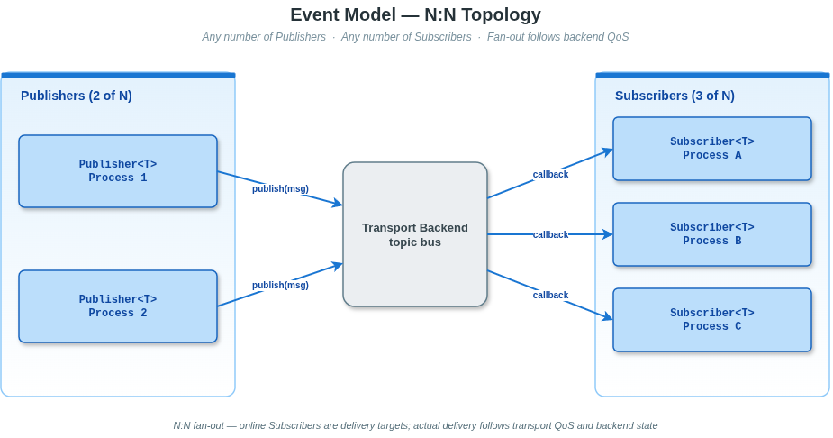

# 3. Event 模型（Publisher / Subscriber）

事件模型是 VLink 三种通信模型之一，适用于**多对多**的异步消息发布与订阅场景。
多个发布者（Publisher）可以向同一个命名主题发布消息，所有订阅了该主题的订阅者
（Subscriber）都会异步收到消息副本。本章介绍 Event 模型的专属 API；Node 基类的通用 API（init / deinit / attach / set_property 等）请参阅 [节点基类与生命周期](02-node-lifecycle.md)。

---

## 目录

1. [3.1 概念与架构](#31-概念与架构)
2. [3.2 主题命名规则与 URL 中的 transport](#32-主题命名规则与-url-中的-transport)
3. [3.3 消息类型支持](#33-消息类型支持)
4. [3.4 Publisher API](#34-publisher-api)
5. [3.5 Subscriber API](#35-subscriber-api)
6. [3.6 QoS 配置](#36-qos-配置)
7. [3.7 完整使用示例](#37-完整使用示例)
8. [3.8 多订阅者场景](#38-多订阅者场景)
9. [3.9 内存管理注意事项](#39-内存管理注意事项)
10. [3.10 性能调优建议](#310-性能调优建议)
11. [3.11 相关文档](#311-相关文档)

---

## 3.1 概念与架构

### 3.1.1 事件模型数据流


### 3.1.2 多订阅者扇出模式



### 3.1.3 关键特性

- **多对多**：多个 Publisher 可向同一主题发布，任意数量的 Subscriber 均可接收。
- **无历史保留（默认）**：消息发出后 Publisher 不缓存；是否可被后续订阅者看见取决于 QoS Durability。
- **编译期类型安全**：`MsgT` 通过模板参数固定，`Serializer::get_type_of<MsgT>()` 编译期推导编解码器。
- **传输切换**：更换 URL 前缀即可切换后端，业务代码无需改动。
- **异步回调**：Subscriber 的 `listen()` 注册后由传输层驱动回调，不阻塞发布方。

### 3.1.4 与方法模型、字段模型的区别

| 维度         | 事件模型（Event）         | 方法模型（Method）         | 字段模型（Field）          |
| ------------ | ------------------------- | -------------------------- | -------------------------- |
| 通信方向     | 单向（Publisher -> Subscriber） | 双向（Client <-> Server）*  | 双向（Setter <-> Getter）  |
| 响应         | 无                        | 有（请求/响应）            | 有（最新值同步）           |
| 消费者数量   | 多对多                    | N:1（多 Client 对一 Server）| 多对多                     |
| 历史值保留   | 取决于 Durability QoS     | 不适用                     | Setter 内缓存最新值；迟到 Getter 是否自动同步取决于后端 |
| 典型用途     | 传感器数据流、状态广播    | RPC 调用、服务请求         | 参数同步、配置下发         |

> *注：方法模型的 fire-and-forget 模式（`RespT` 为 `EmptyType` 时）为单向通信（Client -> Server），无响应。

---

## 3.2 主题命名规则与 URL 中的 transport

### 3.2.1 URL 格式

```
<transport>://<topic_path>[?<query_params>]
```

### 3.2.2 支持的 Transport

**稳定后端（推荐用于生产环境）：**

| Transport       | 传输后端         | 通信范围       | 零拷贝 | 状态   |
| ------------ | ---------------- | -------------- | ------ | ------ |
| `intra://`   | 内置消息队列     | 进程内         | 是 ^1^ | **稳定** |
| `shm://`     | Iceoryx RouDi    | 同机跨进程     | 是 ^2^ | **稳定** |
| `dds://`     | Fast-DDS RTPS    | 跨机器         | 否     | **稳定** |
| `ddsc://`    | CycloneDDS       | 跨机器         | 否     | **稳定** |

> ^1^ `intra://` 的零拷贝通过 `shared_ptr<IntraDataType 子类>` 实现（由 `VLINK_INTRA_DATA_DECLARE` 宏生成，引用计数共享指针传递），无序列化开销。
> ^2^ `shm://` / `shm2://` 的零拷贝通过 `loan()` / `return_loan()` 接口实现（共享内存借贷缓冲区），详见 [节点基类与生命周期 -- 零拷贝借贷](02-node-lifecycle.md#27-零拷贝借贷)。
> ^3^ `zenoh://` 只有在编译期启用 Zenoh shared-memory/unstable API 且运行时启用 SHM 时才提供 loan。

**Beta 后端（实验性，API 可能变化）：**

| Transport       | 传输后端         | 通信范围       | 零拷贝 | 状态   |
| ------------ | ---------------- | -------------- | ------ | ------ |
| `shm2://`    | Iceoryx2         | 同机跨进程     | 是     | Beta   |
| `ddsr://`    | RTI DDS          | 跨机器         | 否     | Beta   |
| `ddst://`    | TravoDDS（国产 DDS） | 跨机器       | 否     | Beta   |
| `zenoh://`   | Zenoh            | 跨机/云边      | 条件支持 ^3^ | Beta   |
| `someip://`  | vsomeip          | 车载以太网     | 否     | Beta   |
| `mqtt://`    | MQTT             | 跨机/物联网    | 否     | Beta   |
| `fdbus://`   | FDBus IPC        | 同机           | 否     | Beta   |
| `qnx://`     | QNX IPC          | 同机（QNX）    | 否     | Beta   |

### 3.2.3 主题路径规则

- 路径分隔符使用 `/`，例如 `dds://vehicle/chassis/speed`
- 同一传输后端下，Publisher 和 Subscriber 的 topic_path 必须完全一致才能匹配
- 跨传输后端不互通（`dds://my_topic` 与 `ddsc://my_topic` 是不同的通道）

### 3.2.4 查询参数（以 DDS 为例）

```
dds://vehicle/speed?domain=1&depth=10&qos=sensor
```

| 参数     | 说明                                             |
| -------- | ------------------------------------------------ |
| `domain` | DDS Domain ID，默认先读取 `VLINK_DDS_DOMAIN`，未设置时为 `0`，并可通过 `?domain=` 显式覆盖 |
| `depth`  | DDS 历史深度，覆盖 QoS 的 history.depth 设置    |
| `qos`    | 命名 QoS profile，需提前调用 `DdsConf::register_qos()` 注册 |

---

## 3.3 消息类型支持

VLink 通过 `Serializer::get_type_of<T>()` 在编译期自动推导序列化方式。共 15 种枚举值（含 `kUnknownType`，14 种被 `Serializer::is_supported()` 接受）—— 详见 [序列化](06-serialization.md)。事件模型常用的类型：

| 类别             | 类型示例                                             | 序列化器 (值)          |
| ---------------- | ---------------------------------------------------- | ---------------------- |
| 原始字节         | `vlink::Bytes`                                       | `kBytesType` (1)       |
| 动态类型         | 含 `is_vlink_dynamic_data()` 成员的类                | `kDynamicType` (2)     |
| 自定义           | 实现 `operator>>(Bytes&)` / `operator<<(const Bytes&)` | `kCustomType` (3)    |
| CDR（DDS 专用）  | `MyCdrType`（含 `serialize`/`deserialize(Cdr&)`）    | `kCdrType` (4)         |
| Protobuf 消息    | 继承 `MessageLite`（有 `SerializeToArray`）          | `kProtoType` (5)       |
| Protobuf 指针    | `MyProto*`（Arena 管理）                             | `kProtoPtrType` (6)    |
| FlatBuffers 表   | `MyTableT`（NativeTable）                            | `kFlatTableType` (7)   |
| FlatBuffers 指针 | `const MyTable*`（Subscriber 侧零拷贝读）            | `kFlatPtrType` (8)     |
| FlatBuffers 构建 | 含 `fbb_` + `Finish()` 的结构                        | `kFlatBuilderType` (9) |
| 字符串           | `std::string`                                        | `kStringType` (10)     |
| C 字符串         | `const char*` / 字符串字面量                         | `kCharsType` (11)      |
| 流序列化         | 支持 `stringstream << / >>` 且非更高优先类型         | `kStreamType` (12)     |
| 标准布局（POD）  | `is_trivial && is_standard_layout` 的 struct         | `kStandardType` (13)   |
| POD 指针         | 指向 trivial + standard_layout 类型的指针            | `kStandardPtrType` (14)|

> 注：CDR 仅在 DDS 系列后端有效，且**不支持**消息层加密。`intra://` 下若 `MsgT` 的 `element_type` 继承 `IntraDataType`（由 `VLINK_INTRA_DATA_DECLARE` 生成），走 `shared_ptr` 零拷贝路径，不做序列化。

---

## 3.4 Publisher API

### 3.4.1 类模板声明

```cpp
template <typename MsgT, SecurityType SecT = SecurityType::kWithoutSecurity>
class Publisher : public Node<PublisherImpl, SecT>;
```

`Publisher<MsgT, SecT>` 继承自 `Node<PublisherImpl, SecT>`，同时拥有 Node 基类
的所有通用 API 和 Publisher 专有的发布相关 API。

### 3.4.2 工厂方法

| 方法 | 说明 |
| ---- | ---- |
| `create_unique` | 创建 `unique_ptr` 包装的 Publisher（自动调用 `init()`） |
| `create_shared` | 创建 `shared_ptr` 包装的 Publisher（自动调用 `init()`） |

```cpp
[[nodiscard]] static UniquePtr create_unique(const std::string& url_str,
                                             InitType type = InitType::kWithInit);

[[nodiscard]] static SharedPtr create_shared(const std::string& url_str,
                                             InitType type = InitType::kWithInit);
```

### 3.4.3 构造函数

| 重载 | 说明 |
| ---- | ---- |
| `Publisher(url_str, type)` | 从 URL 字符串构造（最常用） |
| `Publisher(conf, type)` | 从传输配置对象构造（细粒度控制） |

```cpp
explicit Publisher(const std::string& url_str,
                   InitType type = InitType::kWithInit);

template <typename ConfT, typename = std::enable_if_t<std::is_base_of_v<Conf, ConfT>>>
explicit Publisher(const ConfT& conf,
                   InitType type = InitType::kWithInit);
```

`InitType::kWithInit`（默认）表示构造时立即调用 `init()`；
`InitType::kWithoutInit` 表示延迟初始化，可在 `init()` 前调用配置方法。

### 3.4.4 发布方法

| 方法 | 说明 |
| ---- | ---- |
| `publish(msg, force)` | 发布消息（核心方法）。`force = false`（默认）时无订阅者不发送（节省序列化开销）；`force = true` 时即使无订阅者也强制发送（录包、字段模式等场景）。返回 `true` 表示传输层接受了消息 |
| `publish_fbb(fbb, force)` | 发布已构建的 FlatBufferBuilder（FlatBuffers 专用）。`fbb` 必须已调用 `Finish()` |

```cpp
bool publish(const MsgT& msg, bool force = false);

bool publish_fbb(const void* fbb, bool force = false);
```

### 3.4.5 订阅者感知

| 方法 | 说明 |
| ---- | ---- |
| `detect_subscribers(callback)` | 注册订阅者在线/离线通知回调。若注册时已有订阅者在线，立即同步触发 `callback(true)`。回调参数：`true` = 有订阅者在线；`false` = 最后一个订阅者离线 |
| `wait_for_subscribers(timeout)` | 阻塞等待至少一个订阅者出现。默认超时 `Timeout::kDefaultInterval = 5'000ms`（5 秒）；`timeout = 0` 视为无限等待（会打印警告）。返回 `true` 表示订阅者已出现；`false` 表示超时或被 `interrupt()` 中断 |
| `has_subscribers()` | 非阻塞查询是否有订阅者在线 |

```cpp
void detect_subscribers(ConnectCallback&& callback);

bool wait_for_subscribers(std::chrono::milliseconds timeout = Timeout::kDefaultInterval);

[[nodiscard]] bool has_subscribers() const;
```

### 3.4.6 角色切换

将此 Publisher 的角色切换为 `kSetter`（字段写入者语义），适用于某些传输后端不区分 Setter/Publisher 的场景。

```cpp
void mark_as_setter();
```

### 3.4.7 继承自 Node 的公共 API

Node 基类继承的公共 API（init / deinit / attach / interrupt 等）请参阅 [节点基类与生命周期](02-node-lifecycle.md)。

---

## 3.5 Subscriber API

### 3.5.1 类模板声明

```cpp
template <typename MsgT, SecurityType SecT = SecurityType::kWithoutSecurity>
class Subscriber : public Node<SubscriberImpl, SecT>;
```

### 3.5.2 工厂方法

```cpp
[[nodiscard]] static UniquePtr create_unique(const std::string& url_str,
                                             InitType type = InitType::kWithInit);
[[nodiscard]] static SharedPtr create_shared(const std::string& url_str,
                                             InitType type = InitType::kWithInit);
```

### 3.5.3 构造函数

```cpp
explicit Subscriber(const std::string& url_str,
                    InitType type = InitType::kWithInit);

template <typename ConfT, typename = std::enable_if_t<std::is_base_of_v<Conf, ConfT>>>
explicit Subscriber(const ConfT& conf,
                    InitType type = InitType::kWithInit);
```

### 3.5.4 订阅方法

注册消息接收回调（核心方法）。每次收到消息时调用 `callback`，已反序列化为 `MsgT`。只能调用一次，重复调用是 fatal error。回调在传输线程上执行，除非已 `attach()` 到 MessageLoop。返回 `true` 表示注册成功。

其中 `MsgCallback` 定义为 `vlink::Function<void(const MsgT&)>`。

```cpp
bool listen(MsgCallback&& callback);
```

### 3.5.5 零拷贝相关

启用手动归还 loan 模式（`shm://` 零拷贝接收时使用）。启用后，用户需要在消费完 buffer 后手动调用 `return_loan()`。默认为自动模式（回调返回后自动归还）。

```cpp
void set_manual_unloan(bool manual_unloan) override;
```

### 3.5.6 延迟与丢样统计

| 方法 | 说明 |
| ---- | ---- |
| `set_latency_and_lost_enabled(enable)` | 启用端到端延迟和丢样统计。启用后，每条消息都会记录发布时间戳和接收时间戳，计算延迟。统计功能有额外开销，仅在需要性能分析时启用 |
| `is_latency_and_lost_enabled()` | 返回当前是否已启用延迟和丢样统计 |
| `get_latency()` | 获取最近一次消息的端到端延迟（纳秒）。仅在 `set_latency_and_lost_enabled(true)` 后有效；未启用时返回 0 |
| `get_lost()` | 获取累计丢样信息。`SampleLostInfo::total` = 预期收到的总样本数；`SampleLostInfo::lost` = 丢失的样本数 |

```cpp
void set_latency_and_lost_enabled(bool enable);

[[nodiscard]] bool    is_latency_and_lost_enabled() const;

[[nodiscard]] int64_t get_latency() const;

[[nodiscard]] SampleLostInfo get_lost() const;
```

### 3.5.7 角色切换

将此 Subscriber 的角色切换为 `kGetter`（字段读取者语义），适用于某些传输后端不区分 Getter/Subscriber 的场景。

```cpp
void mark_as_getter();
```

### 3.5.8 继承自 Node 的公共 API

Node 基类继承的公共 API（init / deinit / attach / interrupt 等）请参阅 [节点基类与生命周期](02-node-lifecycle.md)。

---

## 3.6 QoS 配置

QoS（Quality of Service，服务质量）控制消息的可靠性、历史深度、持久化策略等。

### 3.6.1 设置方式

QoS 通过 URL 查询参数或传输配置对象（Conf）设置，Node 上不存在 `set_qos()` 方法。

**方式一：通过 URL 查询参数**

```cpp
vlink::Publisher<MyMsg> pub("dds://my_topic?qos=sensor&depth=20");
```

**方式二：通过 Qos 对象注册命名 Profile 后在 Conf 中引用**

```cpp
#include <vlink/modules/dds_conf.h>
#include <vlink/extension/qos.h>

vlink::Qos my_qos;
my_qos.reliability.kind  = vlink::Qos::Reliability::kReliable;
my_qos.history.kind      = vlink::Qos::History::kKeepLast;
my_qos.history.depth     = 10;
my_qos.durability.kind   = vlink::Qos::Durability::kVolatile;
my_qos.publish_mode.kind = vlink::Qos::PublishMode::kASync;

vlink::DdsConf::register_qos("my_profile", my_qos);

vlink::DdsConf conf("my_topic");
conf.qos = "my_profile";

vlink::Publisher<MyMsg> pub(conf);
```

**方式三：使用预定义 QoS Profile**

```cpp
#include <vlink/modules/dds_conf.h>
#include <vlink/extension/qos.h>
#include <vlink/extension/qos_profile.h>

vlink::DdsConf::register_qos("sensor", vlink::QosProfile::kSensor);

vlink::DdsConf conf("sensor/data");
conf.qos = "sensor";

vlink::Publisher<MyMsg> pub(conf);
```

### 3.6.2 常用预定义 Profile

以下摘自 `include/vlink/extension/qos_profile.h`，共 16 个 `QosProfile::k*`；下表只列常用 7 个：

| Profile                  | Reliability | History        | Durability     | PubMode | 适用场景           |
| ------------------------ | ----------- | -------------- | -------------- | ------- | ------------------ |
| `QosProfile::kEvent`     | Reliable    | KeepLast(5)    | Volatile       | Sync    | 离散控制事件       |
| `QosProfile::kSensor`    | BestEffort  | KeepLast(10)   | Volatile       | ASync   | 高频传感器数据     |
| `QosProfile::kField`     | Reliable    | KeepLast(1)    | TransientLocal | Sync    | 最新值状态同步     |
| `QosProfile::kParameter` | Reliable    | KeepLast(500)  | TransientLocal | Sync    | 配置参数           |
| `QosProfile::kLight`     | Reliable    | KeepLast(1)    | Volatile       | ASync   | 轻量快速消息       |
| `QosProfile::kBest`      | Reliable    | KeepLast(200)  | Volatile       | Sync    | 高吞吐可靠传输     |
| `QosProfile::kLarge`     | Reliable    | KeepLast(500)  | Volatile       | Sync    | 大负载传输         |

> QoS 对 DDS 系列（`dds://`、`ddsc://`、`ddsr://`、`ddst://`）和 `zenoh://` 有较完整支持；其他后端忽略不支持的字段。

完整 16 个 Profile、Qos 字段含义、兼容规则见 [08-qos.md](08-qos.md)。

---

## 3.7 完整使用示例

### 3.7.1 示例一：基础 Protobuf 发布/订阅

**订阅者进程**

```cpp
#include <vlink/vlink.h>
#include "sensor.pb.h"
#include <chrono>
#include <thread>

void subscriber_main() {
    vlink::Subscriber<sensor::SensorData> sub("dds://sensor/temperature");

    sub.listen([](const sensor::SensorData& msg) {
        std::cout << "[Sub] ts=" << msg.timestamp()
                  << " value=" << msg.value()
                  << " unit=" << msg.unit() << std::endl;
    });

    std::this_thread::sleep_for(std::chrono::seconds(60));
}
```

**发布者进程**

```cpp
void publisher_main() {
    vlink::Publisher<sensor::SensorData> pub("dds://sensor/temperature");

    if (!pub.wait_for_subscribers(std::chrono::seconds(5))) {
        std::cerr << "No subscribers found within timeout." << std::endl;
        return;
    }

    for (int i = 0; i < 100; ++i) {
        sensor::SensorData msg;
        msg.set_timestamp(i);
        msg.set_value(25.0 + i * 0.1);
        msg.set_unit("celsius");

        if (!pub.publish(msg)) {
            std::cerr << "publish failed at " << i << std::endl;
        }

        std::this_thread::sleep_for(std::chrono::milliseconds(100));
    }
}
```

### 3.7.2 示例二：使用 MessageLoop 绑定（单线程模型）

```cpp
#include <vlink/vlink.h>
#include <vlink/base/message_loop.h>
#include <vlink/base/timer.h>
#include <vlink/base/utils.h>
#include <iostream>
#include "sensor.pb.h"

int main() {
    vlink::MessageLoop loop;
    vlink::Utils::register_terminate_signal([&loop](int) { loop.quit(); });

    vlink::Subscriber<sensor::SensorData> sub("dds://sensor/temperature");
    sub.attach(&loop);
    sub.listen([](const sensor::SensorData& msg) {
        std::cout << "[Sub] value=" << msg.value() << std::endl;
    });

    vlink::Publisher<sensor::SensorData> pub("dds://sensor/temperature");

    int counter = 0;
    vlink::Timer timer;
    timer.attach(&loop);
    timer.set_interval(200);
    timer.set_loop_count(vlink::Timer::kInfinite);
    timer.start([&pub, &counter]() {
        sensor::SensorData msg;
        msg.set_timestamp(++counter);
        msg.set_value(20.0 + counter % 10);
        msg.set_unit("celsius");
        pub.publish(msg);
    });

    loop.run();
    return 0;
}
```

### 3.7.3 示例三：POD 结构体发布（零序列化开销）

```cpp
#include <vlink/vlink.h>

struct ImuData {
    int64_t timestamp_us;
    float   accel_x, accel_y, accel_z;
    float   gyro_x, gyro_y, gyro_z;
};

vlink::Publisher<ImuData> pub("shm://imu/data");
ImuData imu{};
imu.timestamp_us = 12345678;
imu.accel_x = 0.1f;
pub.publish(imu);

vlink::Subscriber<ImuData> sub("shm://imu/data");
sub.listen([](const ImuData& data) {
    printf("IMU: ax=%.3f ay=%.3f az=%.3f\n",
           data.accel_x, data.accel_y, data.accel_z);
});
```

### 3.7.4 示例四：零拷贝 shm:// loan 发布

```cpp
#include <vlink/vlink.h>

struct BigStruct {
    uint8_t payload[65536];
    int64_t timestamp;
};

vlink::Publisher<vlink::Bytes> pub("shm://big/data");

if (pub.is_support_loan()) {
    vlink::Bytes buf = pub.loan(sizeof(BigStruct));

    if (!buf.empty()) {
        auto* p = new (buf.data()) BigStruct{};
        p->timestamp = 999;
        pub.publish(buf);
    }
}

vlink::Publisher<BigStruct> pub2("shm://big/data");
BigStruct msg{};
msg.timestamp = 999;
pub2.publish(msg);
```

### 3.7.5 示例五：Bytes 类型（原始字节发布）

```cpp
#include <vlink/vlink.h>

vlink::Publisher<vlink::Bytes> pub("ddsc://raw/stream");
vlink::Subscriber<vlink::Bytes> sub("ddsc://raw/stream");

vlink::Bytes data = vlink::Bytes::create(1024);
pub.publish(data);

sub.listen([](const vlink::Bytes& bytes) {
    printf("Received %zu bytes\n", bytes.size());
});
```

### 3.7.6 安全别名

VLink 为事件模型提供安全加密的便捷别名：

| 别名 | 等价形式 |
| ---- | -------- |
| `SecurityPublisher<MsgT>` | `Publisher<MsgT, SecurityType::kWithSecurity>` |
| `SecuritySubscriber<MsgT>` | `Subscriber<MsgT, SecurityType::kWithSecurity>` |

```cpp
template <typename MsgT>
class SecurityPublisher : public Publisher<MsgT, SecurityType::kWithSecurity>;

template <typename MsgT>
class SecuritySubscriber : public Subscriber<MsgT, SecurityType::kWithSecurity>;
```

### 3.7.7 示例六：安全加密发布订阅

```cpp
vlink::Security::Config cfg;
cfg.key = "my-secret";

vlink::SecurityPublisher<MyMsg> pub("dds://secure/data", cfg);

vlink::SecuritySubscriber<MyMsg> sub("dds://secure/data", cfg);
sub.listen([](const MyMsg& msg) {});
```

完整安全加密配置请参阅 [安全加密](09-security.md)。

---

## 3.8 多订阅者场景

多个 Subscriber 可以订阅同一主题，每个都会独立收到消息副本：

```cpp
#include <vlink/vlink.h>
#include "sensor.pb.h"

vlink::Subscriber<sensor::SensorData> sub_logger("dds://sensor/speed");
vlink::Subscriber<sensor::SensorData> sub_controller("dds://sensor/speed");
vlink::Subscriber<sensor::SensorData> sub_recorder("dds://sensor/speed");

sub_logger.listen([](const sensor::SensorData& msg) {
    printf("[Logger] speed=%.2f\n", msg.value());
});

sub_controller.listen([](const sensor::SensorData& msg) {
    if (msg.value() > 120.0) {
        printf("[Controller] Speed limit exceeded!\n");
    }
});

sub_recorder.listen([](const sensor::SensorData& msg) {
    printf("[Recorder] recording...\n");
});

vlink::Publisher<sensor::SensorData> pub("dds://sensor/speed");
sensor::SensorData msg;
msg.set_value(100.5);
pub.publish(msg);
```

### 3.8.1 多订阅者的 QoS 匹配注意事项

在 DDS 系列传输中，Publisher 和 Subscriber 的 QoS 策略必须兼容，否则连接不会
建立。常见的兼容规则：

| QoS 策略     | 兼容规则                                                          |
| ------------ | ----------------------------------------------------------------- |
| Reliability  | Publisher kReliable 兼容 Subscriber kBestEffort 或 kReliable      |
| Durability   | Publisher 的 kind >= Subscriber 的 kind（Persistent > Transient > TransientLocal > Volatile） |
| History      | 独立配置，无跨端约束                                              |

---

## 3.9 内存管理注意事项

### 3.9.1 消息对象的生命周期

`publish(msg)` 在内部完成序列化后立即返回，调用后 `msg` 可以安全销毁或复用：

```cpp
sensor::SensorData msg;
msg.set_value(1.0);
pub.publish(msg);
msg.set_value(2.0);
```

### 3.9.2 Loan Buffer 的生命周期

通过 `loan()` 获取的 buffer 由传输后端（共享内存）管理：

```cpp
vlink::Bytes buf = pub.loan(sizeof(MyStruct));

pub.publish(buf);

if (should_skip) {
    pub.return_loan(buf);
}
```

### 3.9.3 订阅者回调中的数据引用

回调参数 `const MsgT& msg` 的生命周期仅限于回调函数体内：

```cpp
sub.listen([](const sensor::SensorData& msg) {
    double v = msg.value();

    auto copy = msg;
});
```

### 3.9.4 手动 unloan 模式（shm:// 零拷贝接收）

手动归还模式下，必须拿到原始 loan 后归还。对于 `Bytes` 类型消息更直接：

```cpp
vlink::Subscriber<vlink::Bytes> sub("shm://my_topic");
sub.set_manual_unloan(true);

sub.listen([&sub](const vlink::Bytes& data) {
    process(data.data(), data.size());
    sub.return_loan(data);
});
```

> 其他消息类型（如 POD、Proto）使用手动模式时，需自行从回调参数还原 `Bytes` 句柄；多数情况下使用默认自动归还即可。

### 3.9.5 安全退出（safety_quit）

当节点在多线程环境中可能在回调执行期间被销毁时，开启安全退出：

```cpp
vlink::Publisher<MyMsg> pub("dds://my_topic");
pub.set_safety_quit(true);
```

---

## 3.10 性能调优建议

### 3.10.1 选择合适的传输后端

| 场景                     | 推荐传输              | 理由                               | 状态     |
| ------------------------ | --------------------- | ---------------------------------- | -------- |
| 同进程内高频通信         | `intra://`            | 无序列化，无 IPC 开销              | **稳定** |
| 同机跨进程大负载（图像/点云） | `shm://`         | 零拷贝，极低延迟                   | **稳定** |
| 同机跨进程小负载         | `shm://`              | 低延迟 IPC                         | **稳定** |
| 跨机器标准通信           | `dds://` / `ddsc://`  | 标准 DDS，功能完整                 | **稳定** |
| 跨机器高吞吐             | `zenoh://`            | 现代协议，内置压缩                 | Beta     |
| 车载以太网 SOA           | `someip://`           | 符合 AUTOSAR 规范                  | Beta     |

### 3.10.2 QoS 策略优化

```cpp
vlink::DdsConf::register_qos("sensor", vlink::QosProfile::kSensor);
vlink::Publisher<SensorData> pub("dds://lidar/points?qos=sensor");

vlink::DdsConf::register_qos("event", vlink::QosProfile::kEvent);
vlink::Publisher<ControlCmd> pub2("dds://control/cmd?qos=event");
```

### 3.10.3 序列化格式选择

| 格式         | 序列化速度 | 消息大小 | 适用场景                    |
| ------------ | ---------- | -------- | --------------------------- |
| POD struct   | 极快       | 固定     | 简单数值数据、IMU、控制指令  |
| FlatBuffers  | 快         | 较小     | 复合类型、需要零拷贝读取     |
| Protobuf     | 中         | 小       | 通用消息、跨语言、字段可扩展  |
| Bytes        | 极快       | 任意     | 自定义二进制协议、图像帧     |
| CDR          | 快         | 中       | 与 DDS 原生类型互通         |

### 3.10.4 MessageLoop 线程模型

```cpp
vlink::MessageLoop loop;
sub1.attach(&loop);
sub2.attach(&loop);
pub_timer.attach(&loop);
loop.run();

vlink::Subscriber<MyMsg> sub("dds://my_topic");
sub.listen([](const MyMsg& msg) {
    std::lock_guard lock(global_mutex);
});
```

### 3.10.5 减少不必要的订阅者检测

```cpp
for (int i = 0; i < 1000; ++i) {
    if (pub.has_subscribers()) {
        pub.publish(msg);
    }
}

bool has_sub = false;
pub.detect_subscribers([&has_sub](bool connected) {
    has_sub = connected;
});

for (int i = 0; i < 1000; ++i) {
    if (has_sub) {
        pub.publish(msg);
    }
}
```

### 3.10.6 延迟调试

```cpp
vlink::Subscriber<SensorData> sub("dds://sensor/data");
sub.set_latency_and_lost_enabled(true);

sub.listen([&sub](const SensorData& msg) {
    int64_t lat_ns = sub.get_latency();
    vlink::SampleLostInfo lost = sub.get_lost();
    printf("latency=%" PRId64 "ns lost=%" PRIu64 "/%" PRIu64 "\n", lat_ns, lost.lost, lost.total);
});
```

---

## 3.11 相关文档

- [节点基类与生命周期](02-node-lifecycle.md) -- Node 通用 API（init / deinit / attach / security 等）
- [Method 模型（Client / Server）](04-method-model.md) -- RPC 请求响应通信
- [Field 模型（Setter / Getter）](05-field-model.md) -- 字段状态同步通信
