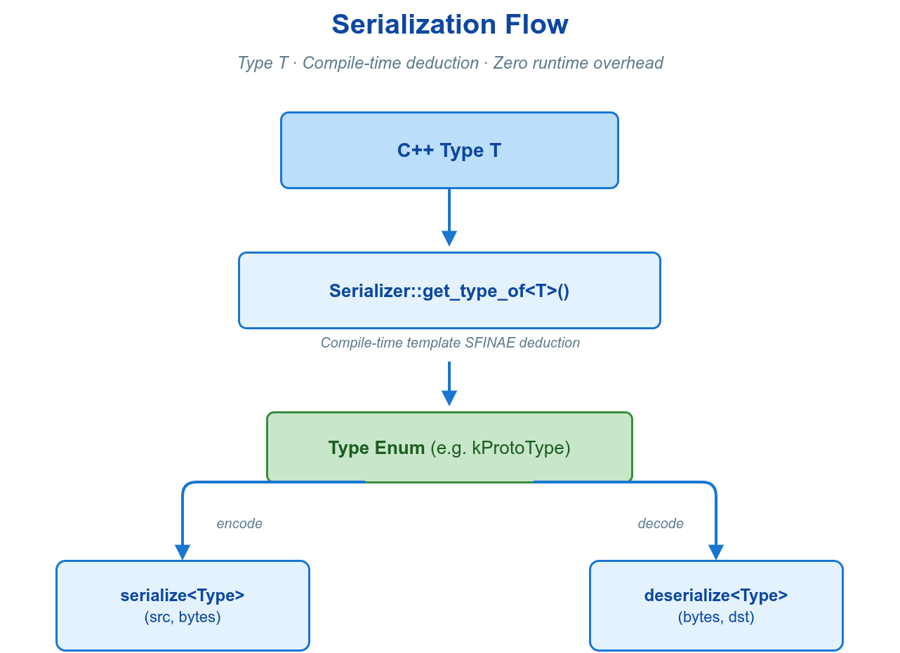

# 🗜️ 3. 消息序列化

序列化负责消息对象与传输字节之间的双向转换：将一个消息对象编码为可在网络或共享内存中传递的字节流，并在对端还原为同类型对象。在 VLink 中，这一过程由消息类型在编译期决定并由框架自动执行——应用层将合适的消息类型作为模板参数传给 `Publisher<T>`、`Subscriber<T>` 等原语，编解码即随通信调用透明完成，无需手写序列化代码，也无需注册编解码器。



本章先建立"按类型推导编码"的机制模型，再给出各类型族的选型判据与最小用法，最后说明边界条件与典型错误。

---

## 🧩 3.1 概念与机制

序列化在 VLink 中是一个**编译期决议、运行期执行**的过程，遵循三条不变量：

- **编码由类型决定**　每个原语以消息类型 `T` 为模板参数。框架据此在编译期选定唯一的编解码策略，调用方不参与选择，也不在 URL 或运行期配置中指定序列化方式。
- **编解码内联于通信调用**　`publish()`、`listen()`、`invoke()`、`set()`、`get()` 在内部完成编码与解码，应用代码不直接调用任何序列化接口。
- **不支持的类型在编译期失败**　若 `T` 既非内置可识别类型、又未提供自定义编解码，构造原语时即编译报错（提示形如 `<MsgT> is not a supported Serializer type.`），不会推迟到运行期。

由此得到一项重要的工程性质：**切换序列化方式等价于更换消息类型，通信代码不变。** 同一段发布/订阅逻辑，将 `T` 从 POD 结构体换为 Protobuf 消息，即把内存直拷切换为跨语言二进制编码，URL 与调用点均无需改动。

值类型可由 `std::shared_ptr<T>` 包裹传入，框架自动解包后按 `T` 推导编码（仅值族探测器解包，指针/builder/字符指针族不解包）。

类型识别在编译期完成：框架按固定优先级依次探测各类型族的特征，**命中第一个即停止**（precedence chain, first-match-wins）。优先级自高至低为 `Bytes → DynamicData → CDR → Protobuf → Protobuf 指针 → FlatBuffers 对象 → FlatBuffers 表指针 → FlatBuffers builder → 自定义 → string → const char* → POD → POD 指针 → 流式兜底`，全部未命中则为不支持类型。因此一个类型若同时满足多条特征，将归入更靠前的那一族。


---

## 📋 3.2 类型族、编码与选型

下表列出框架可自动识别的常用消息类型族、对应编码、关键约束及其适用场景（另有一种"流式兜底"编码作为末位回退，见 [3.7](#-37-边界条件与常见错误)）。选定一种类型传给原语，编码方式即随之确定。

| 消息类型 | 自动编码 | 关键约束 | 适用场景 |
| --- | --- | --- | --- |
| POD 结构体（`SensorData`） | 内存直拷 | 两端结构体定义须完全一致；不跨字节序 | 同机高频、结构固定、追求极致开销 |
| POD 指针（`LargeFrame*`） | 指针内容视图 | 避免 serializer 中间 owning 分配；SHM 发布仍复制一次进 transport loan | 大消息同机单拷贝传递 |
| FlatBuffers 对象（`MyMsgT`） | FlatBuffers | NativeTable Object API，读写均便利 | 高性能结构化消息、需向前兼容 |
| FlatBuffers 表指针（`const MyMsg*`） | FlatBuffers（零拷贝只读） | 指针指向接收缓冲区，仅在回调内有效 | 高性能只读路径 |
| FlatBuffers builder（含 `fbb_` + `Finish()`） | FlatBuffers | 直接发布手工构建的 builder，序列化时完成构建并按最终大小申请目标缓冲 | 自管缓冲区的高性能写入路径 |
| Protobuf 消息（`MyMsg`） | Protobuf 二进制 | 需由 `.proto` 生成代码 | 跨语言、字段随版本演进 |
| Protobuf 指针（`MyMsg*`） | Protobuf 二进制 | 配合 Arena 分配，降低高频发布的内存管理开销 | 高频发布大量消息 |
| `vlink::Bytes` | 原始字节直传 | 框架不解释其结构 | 透明代理、私有二进制协议、原始帧 |
| `std::string` / `const char*` | 文本直传 | UTF-8 文本；接收的字符指针仅到同线程下一次字符解码前有效 | 日志、命令字符串 |
| 自定义类型（重载 `operator>>`/`<<`） | 用户编解码 | 字段顺序须严格对应，见 [3.5](#-35-自定义序列化器) | 自有紧凑布局、带外信息 |
| DDS IDL 类型（`MyMsg`） | CDR | 需注册 TypeSupport，见 [3.6](#-36-dds-cdr-与-dynamicdata) | 与外部 DDS 系统互操作 |
| `vlink::DynamicData` | 类型名标签 + 已序列化负载 | 运行期按类型名标签选择编解码，无需编译期固定消息类型，见 [3.6](#-36-dds-cdr-与-dynamicdata) | 监控、协议桥接 |

判据的取舍要点：POD 提供最低开销，但不携带版本信息且不跨字节序；FlatBuffers 与 Protobuf 以编码开销换取结构演进能力；`Bytes` 不解释内容，适合协议透传。后端选择与 URL 写法见 [传输后端](04-transport.md)；面向感知的零拷贝容器见 [零拷贝](06-zerocopy.md)。

字符指针由调用方保证可访问到 NUL；字符数组必须在数组边界内包含 NUL。两者都只序列化首个 NUL 之前的字节。

传输后端集成可调用公开的 `Serializer::serialize_to_transport<TypeT>()`：`use_loan=true` 且存在非零 size hint 时，回调至多按序列化大小请求一次目标 `Bytes`，返回值既可以是真实 loan，也可以是 owning storage；返回值必须与 hint 大小完全相同，codec 不得替换 transport loan。size hint 为 0 时不请求 loan，直接回退到 owning 序列化。普通应用仍应使用 Publisher、Client、Server 或 Setter，由框架自动选择该路径。builder 类型在进入该路径后会完成构建，即使目标分配失败也应使用新 builder 重试。

---

## 🔧 3.3 Protobuf

定义 `.proto` 并生成 C++ 代码后，将消息类型直接传给原语即可（CMake 集成见 [快速开始](01-started.md)）。

```cpp
#include "vlink/vlink.h"
#include "my_message.pb.h"

vlink::Publisher<example::VehicleState> pub("dds://vehicle/state");

example::VehicleState state;
state.set_speed(80.0f);
state.set_gear(3);
pub.publish(state);

vlink::Subscriber<example::VehicleState> sub("dds://vehicle/state");
sub.listen([](const example::VehicleState& s) {
  VLOG_I("speed=", s.speed(), " gear=", s.gear());
});
```

高频发布大量消息时，可用 `MyMsg*` 配合 Arena 分配，避免反复构造与析构带来的内存管理开销：

```cpp
google::protobuf::Arena arena;
vlink::Publisher<example::VehicleState*> pub("dds://vehicle/state");

auto* state = google::protobuf::Arena::Create<example::VehicleState>(&arena);
state->set_speed(80.0f);
pub.publish(state);
```

---

## 📦 3.4 FlatBuffers 与 POD

### 🧱 3.4.1 FlatBuffers

FlatBuffers 提供两种访问路径：以 Object API（`MyMsgT`）读写，或以表指针（`const MyMsg*`）零拷贝只读。CMake 集成同见 [快速开始](01-started.md)。

```cpp
#include "vlink/vlink.h"
#include "my_message_generated.h"

vlink::Publisher<example::VehicleStateT> pub("shm://vehicle/state");

example::VehicleStateT state;
state.speed = 80.0f;
state.gear = 3;
pub.publish(state);

vlink::Subscriber<example::VehicleStateT> sub("shm://vehicle/state");
sub.listen([](const example::VehicleStateT& s) {
  VLOG_I("speed=", s.speed);
});
```

订阅端以 `const MyMsg*` 直接读取接收缓冲区，跳过反序列化，是 FlatBuffers 路径中开销最低的读法：

```cpp
vlink::Subscriber<const example::VehicleState*> sub("shm://vehicle/state");
sub.listen([](const example::VehicleState* s) {
  if (s != nullptr) {
    VLOG_I("speed=", s->speed());
  }
});
```

边界条件：表指针指向接收缓冲区，仅在回调内有效；需在回调外保留时，应先 `s->UnPack()` 拷成 Object（`MyMsgT`）再保存。

### ⚙️ 3.4.2 POD 结构体与原始字节

满足 trivial 且 standard-layout 的 C 风格结构体按 `sizeof` 内存直拷，是除零拷贝外开销最低的编码方式。

```cpp
struct SensorData {
  float temperature;
  float humidity;
  uint64_t timestamp_us;
};

vlink::Publisher<SensorData> pub("shm://sensor/imu");
pub.publish(SensorData{25.6f, 60.2f, now_us()});

vlink::Subscriber<SensorData> sub("shm://sensor/imu");
sub.listen([](const SensorData& d) {
  process(d.temperature, d.humidity);
});
```

边界条件：POD 不携带任何版本或结构元信息，发布端与订阅端的字段顺序与大小必须完全一致，且不做字节序转换，因此不适用于跨架构（大小端不同）通信。`MyStruct*` 可避免 serializer 的中间 owning 分配，但普通 SHM 发布仍会把数据复制进 transport loan；发布端真正就地写池内存须使用 `Publisher<Bytes>::loan()`。

`vlink::Bytes` 原样传输字节内容，框架不解释其结构，适合透明代理与私有协议：

```cpp
vlink::Publisher<vlink::Bytes> pub("shm://raw/channel");

auto buf = vlink::Bytes::create(256);
std::memcpy(buf.data(), payload, 256);
pub.publish(buf);

vlink::Subscriber<vlink::Bytes> sub("shm://raw/channel");
sub.listen([](const vlink::Bytes& msg) {
  process_raw(msg.data(), msg.size());
});
```

`Bytes` 的完整工厂、压缩、Base64、CRC 等工具方法见 [基础库](08-base-library.md)。

---

## 🧬 3.5 自定义序列化器

为任意类型重载下列两个运算符，框架即自动用其编解码，无需注册：

```cpp
void operator>>(vlink::Bytes& out) const;  // 将自身写入 out（编码）
void operator<<(const vlink::Bytes& in);   // 从 in 还原自身（解码）
```

运算符也可返回 `bool` 表示成败（返回 `false` 即上报编解码失败）。

当消息既非内置可识别类型，又需要自有的紧凑布局或带外信息时，自定义序列化器是接入私有协议的标准途径：

```cpp
#include "vlink/vlink.h"
#include <cstring>
#include <limits>

struct MyCustomProtocol {
  uint16_t cmd{0};
  std::vector<uint8_t> payload;

  bool operator>>(vlink::Bytes& out) const {
    if (payload.size() > std::numeric_limits<uint32_t>::max()) {
      return false;
    }
    uint32_t n = static_cast<uint32_t>(payload.size());
    out = vlink::Bytes::create(sizeof(cmd) + sizeof(n) + payload.size());

    if (out.empty()) {
      return false;
    }

    uint8_t* p = out.data();
    std::memcpy(p, &cmd, sizeof(cmd)); p += sizeof(cmd);
    std::memcpy(p, &n, sizeof(n)); p += sizeof(n);
    if (!payload.empty()) {
      std::memcpy(p, payload.data(), payload.size());
    }
    return true;
  }

  bool operator<<(const vlink::Bytes& in) {
    constexpr size_t kHeaderSize = sizeof(cmd) + sizeof(uint32_t);
    if (in.size() < kHeaderSize || in.data() == nullptr) {
      return false;
    }

    const uint8_t* p = in.data();
    std::memcpy(&cmd, p, sizeof(cmd)); p += sizeof(cmd);

    uint32_t n = 0;
    std::memcpy(&n, p, sizeof(n)); p += sizeof(n);
    if (static_cast<size_t>(n) != in.size() - kHeaderSize) {
      return false;
    }
    payload.assign(p, p + n);
    return true;
  }
};

vlink::Publisher<MyCustomProtocol> pub("dds://custom/channel");

MyCustomProtocol msg;
msg.cmd = 0x01;
msg.payload = {0xAA, 0xBB, 0xCC};
pub.publish(msg);
```

实现约束：

- `operator>>` 内先计算所需字节数，再以 `vlink::Bytes::create(size)` 分配。
- `operator<<` 不得假设 `in.size()` 固定，读取前需做长度合法性检查。
- 写入与读取的字段顺序必须严格对应；跨架构通信时显式处理字节序。

---

## 🔗 3.6 DDS CDR 与 DynamicData

CDR 是 DDS 标准二进制格式，用于与外部 DDS 系统互操作，消息类型通常由 IDL 自动生成。使用前需注册对应的 TypeSupport：

```cpp
#include "MyMessage.h"
#include "MyMessagePubSubTypes.h"

vlink::DdsConf::register_topic<MyMessagePubSubType>("my_topic");

vlink::Publisher<MyMessage> pub("dds://my_topic");
MyMessage msg;
msg.value(42);
pub.publish(msg);
```

`vlink::DynamicData` 在运行期承载类型名与已序列化负载，无需在编译期固定消息结构，适用于调试工具、监控与协议桥接。写入用 `load(type, value)`，读取用 `as<T>()` 或 `convert(out)`：

```cpp
#include "vlink/extension/dynamic_data.h"

vlink::Publisher<vlink::DynamicData> pub("dds://dynamic/topic");

vlink::DynamicData msg;
msg.load("float", 80.0f);
pub.publish(msg);

vlink::Subscriber<vlink::DynamicData> sub("dds://dynamic/topic");
sub.listen([](const vlink::DynamicData& d) {
  VLOG_I("type=", d.get_type(), " value=", d.as<float>());
});
```

边界条件：类型名连同结尾 `\0` 须短于 20 字节（`load()` 在编译期 `static_assert` 校验）；负载类型须为 `Serializer` 支持的类型族，但**不得**为 CDR 类型或嵌套的 `DynamicData`（二者被 `static_assert` 拒绝）。完整字段操作见 `include/vlink/extension/dynamic_data.h`。

---

## ⚠️ 3.7 边界条件与常见错误

含 `std::vector` 等非平凡成员、又未重载序列化运算符的结构体不会被自动识别，构造原语时编译失败：

```cpp
struct BadMsg {
  int x;
  std::vector<int> data;
};

vlink::Publisher<BadMsg> pub("shm://bad");  // 编译失败：<MsgT> is not a supported Serializer type.
```

修复方式：改用 Protobuf 或 FlatBuffers，或为该类型实现 [3.5](#-35-自定义序列化器) 的自定义序列化器。

其余高频边界条件汇总如下：

| 约束 | 表现与处置 |
| --- | --- |
| POD 跨架构字节序 | 内存直拷不做字节序转换；大小端不同的机器间通信应改用 Protobuf / FlatBuffers / CDR，或在自定义序列化器内显式处理字节序 |
| FlatBuffers 零拷贝指针生命期 | `const MyMsg*` 指向接收缓冲区，回调返回后即失效；需在回调外保留时先 `s->UnPack()` 拷成 Object |
| 自定义序列化器字段对齐 | 写入与读取的字段顺序必须严格对应，`operator<<` 读取前须校验 `in.size()` 合法性 |
| 流式回退编码 | 若类型对 `std::stringstream` 同时重载了 `<<`/`>>`（且非上述任一类型族），框架会以文本流作为兜底编码，而非编译失败；需要紧凑二进制时应改用 [3.5](#-35-自定义序列化器) 的 `operator>>`/`<<(Bytes&)` |

---

## 📚 相关文档

- [通信模型](02-communication.md) —— `publish()` / `listen()` 等通信用法
- [零拷贝](06-zerocopy.md) —— `CameraFrame` / `PointCloud` 等零拷贝容器
- [安全加密](07-security.md) —— 消息级加密与密钥配置
- [传输后端](04-transport.md) —— 后端选择与 URL 格式
- [基础库](08-base-library.md) —— `Bytes` 的完整 API 与工具方法
- [快速开始](01-started.md) —— Protobuf / FlatBuffers 的 CMake 集成
