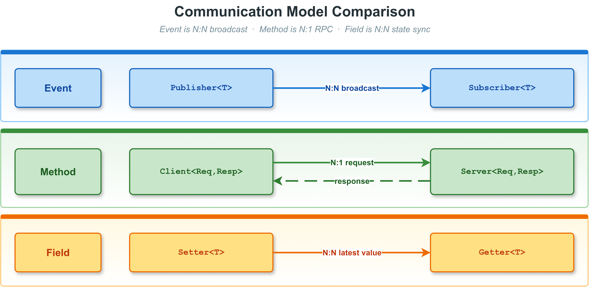

# 4. Method 模型（Client / Server）

方法模型是 VLink 三种通信模型之一，对应 RPC（远程过程调用）语义：Client 发送请求，
Server 处理后返回响应。方法模型支持**多个 Client 对一个 Server**（N:1）的请求-响应通信，同时也支持无需响应的 fire-and-forget 单向模式。
每次请求/响应是一对一配对关系，并支持超时控制。Node 基类的通用 API（init / deinit / attach / set_property 等）请参阅 [节点基类与生命周期](02-node-lifecycle.md)。

---

## 目录

1. [4.1 概念与架构](#41-概念与架构)
2. [4.2 Client API](#42-client-api)
3. [4.3 Server API](#43-server-api)
4. [4.4 五种调用模式详解](#44-五种调用模式详解)
5. [4.5 超时处理](#45-超时处理)
6. [4.6 错误处理](#46-错误处理)
7. [4.7 wait_for_connected 用法](#47-wait_for_connected-用法)
8. [4.8 完整使用示例](#48-完整使用示例)
9. [4.9 并发调用场景](#49-并发调用场景)
10. [4.10 模型选择](#410-模型选择)
11. [4.11 相关文档](#411-相关文档)

---

## 4.1 概念与架构

### 4.1.1 方法模型数据流


### 4.1.2 关键特性

- **N:1**：多个 Client 可连接同一个 Server，每个请求对应一个响应
- **类型安全**：请求类型 `ReqT` 和响应类型 `RespT` 在编译时固定
- **多种调用模式**：同步阻塞、optional 返回、异步回调、future 异步
- **fire-and-forget**：`RespT` 省略时（默认为 `EmptyType`）只发不收
- **超时控制**：所有阻塞调用均支持超时，默认使用 `Timeout::kDefaultInterval`
- **连接感知**：Client 可感知 Server 的上线/下线状态

### 4.1.3 与其他模型的关系



---

## 4.2 Client API

### 4.2.1 类模板声明

```cpp
template <typename ReqT,
          typename RespT = Traits::EmptyType,
          SecurityType SecT = SecurityType::kWithoutSecurity>
class Client : public Node<ClientImpl, SecT>;
```

当 `RespT` 为默认的 `Traits::EmptyType` 时，Client 仅发送请求，不等待响应，
即 fire-and-forget 模式，此时只有 `send()` 方法可用。

### 4.2.2 编译期常量与类型别名

```cpp
using UniquePtr       = std::unique_ptr<Client<ReqT, RespT, SecT>>;
using SharedPtr       = std::shared_ptr<Client<ReqT, RespT, SecT>>;
using ConnectCallback = NodeImpl::ConnectCallback;
using RespCallback    = vlink::Function<void(const RespT&)>;

static constexpr ImplType           kImplType = kClient;
static constexpr bool               kHasResp  = !std::is_same_v<RespT, Traits::EmptyType>;
static constexpr Serializer::Type   kReqType  = Serializer::get_type_of<ReqT>();
static constexpr Serializer::Type   kRespType = Serializer::get_type_of<RespT>();
```

### 4.2.3 工厂方法

```cpp
[[nodiscard]] static UniquePtr create_unique(const std::string& url_str,
                                             InitType type = InitType::kWithInit);
[[nodiscard]] static SharedPtr create_shared(const std::string& url_str,
                                             InitType type = InitType::kWithInit);
```

### 4.2.4 构造函数

| 重载 | 说明 |
| ---- | ---- |
| `Client(url_str, type)` | 从 URL 字符串构造 |
| `Client(conf, type)` | 从传输配置对象构造（细粒度控制） |

```cpp
explicit Client(const std::string& url_str,
                InitType type = InitType::kWithInit);

template <typename ConfT, typename = std::enable_if_t<std::is_base_of_v<Conf, ConfT>>>
explicit Client(const ConfT& conf,
                InitType type = InitType::kWithInit);
```

### 4.2.5 连接感知

| 方法 | 说明 |
| ---- | ---- |
| `detect_connected(callback)` | 注册 Server 连接/断开通知回调。若 Server 已连接，立即同步触发 `callback(true)`。`callback(true)` 表示 Server 可用；`callback(false)` 表示 Server 断开 |
| `wait_for_connected(timeout)` | 阻塞等待 Server 上线。`timeout = 0` 视为无限等待（会打印警告）。返回 `true` 表示 Server 已上线；`false` 表示超时或被 `interrupt()` 中断 |
| `is_connected()` | 非阻塞查询 Server 是否在线 |

```cpp
void detect_connected(ConnectCallback&& callback);

bool wait_for_connected(std::chrono::milliseconds timeout = Timeout::kDefaultInterval);

[[nodiscard]] bool is_connected() const;
```

### 4.2.6 调用方法

| 方式 | 方法签名 | 说明 |
| ---- | -------- | ---- |
| 方式一：同步调用（输出参数） | `invoke(req, resp&, timeout) -> bool` | 仅当 `kHasResp = true` 时有效（`static_assert` 保护）。阻塞直到响应到来或超时。返回 `true` 表示成功收到响应；`false` 表示超时或错误 |
| 方式二：同步调用（optional 返回） | `invoke(req, timeout) -> optional<RespT>` | 仅当 `kHasResp = true` 时有效。返回 `nullopt` 表示超时或错误；返回 `optional<RespT>` 表示成功 |
| 方式三：异步调用（回调） | `invoke(req, RespCallback) -> bool` | 仅当 `kHasResp = true` 时有效。立即返回，响应到来时在传输线程（或 `attach` 的 MessageLoop）上调用 callback。返回 `true` 表示请求被传输层接受；`false` 表示发送失败 |
| 方式四：异步调用（future） | `async_invoke(req) -> future<RespT>` | 仅当 `kHasResp = true` 时有效（`static_assert` 保护）。立即返回 future，调用 `future.get()` 阻塞等待响应。失败（序列化错误、传输错误）时 future 中设置 `RuntimeError` 异常 |
| 方式五：fire-and-forget | `send(req) -> bool` | 仅当 `RespT == EmptyType` 时有效（`static_assert` 保护）。发送请求后立即返回，不等待任何响应。返回 `true` 表示传输层接受；`false` 表示发送失败 |

其中 `RespCallback` 定义为 `vlink::Function<void(const RespT&)>`。

```cpp
[[nodiscard]] bool invoke(const ReqT& req, RespT& resp,
                          std::chrono::milliseconds timeout = Timeout::kDefaultInterval);

[[nodiscard]] std::optional<RespT> invoke(const ReqT& req,
                                          std::chrono::milliseconds timeout = Timeout::kDefaultInterval);

bool invoke(const ReqT& req, RespCallback&& callback);

[[nodiscard]] std::future<RespT> async_invoke(const ReqT& req);

bool send(const ReqT& req);
```

### 4.2.7 继承自 Node 的公共 API

Node 基类继承的公共 API（init / deinit / attach / interrupt 等）请参阅 [节点基类与生命周期](02-node-lifecycle.md)。

---

## 4.3 Server API

### 4.3.1 类模板声明

```cpp
template <typename ReqT,
          typename RespT = Traits::EmptyType,
          SecurityType SecT = SecurityType::kWithoutSecurity>
class Server : public Node<ServerImpl, SecT>;
```

### 4.3.2 回调类型定义

| 类型别名 | 签名 | 说明 |
| -------- | ---- | ---- |
| `ReqCallback` | `vlink::Function<void(const ReqT&)>` | fire-and-forget 回调（`RespT` 必须为 `EmptyType`） |
| `ReqRespCallback` | `vlink::Function<void(const ReqT&, RespT&)>` | 同步响应回调：在回调内填充 `resp`，框架自动发送 |
| `ReqAsyncRespCallback` | `vlink::Function<void(uint64_t, const ReqT&)>` | 异步响应回调：保存 `req_id`，稍后调用 `reply(req_id, resp)` 发送响应 |

```cpp
using ReqCallback         = vlink::Function<void(const ReqT&)>;

using ReqRespCallback     = vlink::Function<void(const ReqT&, RespT&)>;

using ReqAsyncRespCallback = vlink::Function<void(uint64_t, const ReqT&)>;
```

### 4.3.3 工厂方法与构造函数

```cpp
[[nodiscard]] static UniquePtr create_unique(const std::string& url_str,
                                             InitType type = InitType::kWithInit);
[[nodiscard]] static SharedPtr create_shared(const std::string& url_str,
                                             InitType type = InitType::kWithInit);

explicit Server(const std::string& url_str,
                InitType type = InitType::kWithInit);

template <typename ConfT, typename = std::enable_if_t<std::is_base_of_v<Conf, ConfT>>>
explicit Server(const ConfT& conf,
                InitType type = InitType::kWithInit);
```

### 4.3.4 监听方法

| 方式 | 方法 | 说明 |
| ---- | ---- | ---- |
| fire-and-forget | `listen(ReqCallback)` | 仅当 `RespT == EmptyType` 时有效。每次收到请求时调用 callback，不发送响应 |
| 同步响应 | `listen(ReqRespCallback)` | 仅当 `kHasResp = true` 时有效。回调必须在返回前填充 `resp`，框架在回调返回后立即序列化并发送 |
| 异步响应 | `listen_for_reply(ReqAsyncRespCallback)` | 仅当 `kHasResp = true` 时有效。回调中保存 `req_id`，稍后从任意线程调用 `reply(req_id, resp)`。适合耗时处理或需要异步 I/O 的场景 |

```cpp
bool listen(ReqCallback&& callback);

bool listen(ReqRespCallback&& callback);

bool listen_for_reply(ReqAsyncRespCallback&& callback);
```

> 注意：`listen()` 和 `listen_for_reply()` 只能调用一次，重复调用是 fatal error。

### 4.3.5 异步响应发送

向指定 `req_id` 的请求发送响应。必须在 `listen_for_reply()` 后调用（在 `listen()` 后调用会触发 fatal log）。`req_id` 必须与 `ReqAsyncRespCallback` 中传入的值匹配。返回 `true` 表示传输层接受；`false` 表示发送失败。

```cpp
bool reply(uint64_t req_id, const RespT& resp);
```

### 4.3.6 安全别名

| 别名 | 等价形式 |
| ---- | -------- |
| `SecurityServer<ReqT, RespT>` | `Server<ReqT, RespT, SecurityType::kWithSecurity>` |
| `SecurityClient<ReqT, RespT>` | `Client<ReqT, RespT, SecurityType::kWithSecurity>` |

```cpp
template <typename ReqT, typename RespT = Traits::EmptyType>
class SecurityServer : public Server<ReqT, RespT, SecurityType::kWithSecurity>;

template <typename ReqT, typename RespT = Traits::EmptyType>
class SecurityClient : public Client<ReqT, RespT, SecurityType::kWithSecurity>;
```

---

## 4.4 五种调用模式详解

### 4.4.1 模式对比总览

| 模式                | 方法签名                                    | 是否阻塞 | 超时支持 | 适用场景                        |
| ------------------- | ------------------------------------------- | -------- | -------- | ------------------------------- |
| 同步（输出参数）    | `invoke(req, resp&, timeout) -> bool`       | 是       | 是       | 简单同步调用，结果明确          |
| 同步（optional）    | `invoke(req, timeout) -> optional<Resp>`    | 是       | 是       | 链式调用，无需声明临时变量      |
| 异步（回调）        | `invoke(req, RespCallback)`                 | 否       | 否       | 事件驱动架构，不阻塞主线程      |
| 异步（future）      | `async_invoke(req) -> future<Resp>`         | 否       | 可用 future.wait_for | 并发调用，统一等待多个结果 |
| 仅发送              | `send(req) -> bool`                         | 否       | 否       | fire-and-forget，无需响应       |

### 4.4.2 模式一：同步调用（输出参数）

```cpp
vlink::Client<Req, Resp> client("dds://my_service");
client.wait_for_connected();

Req req;
req.set_param(42);

Resp resp;
bool ok = client.invoke(req, resp, std::chrono::seconds(3));

if (ok) {
    std::cout << "result: " << resp.result() << std::endl;
} else {
    std::cerr << "invoke timeout or failed" << std::endl;
}
```

### 4.4.3 模式二：同步调用（optional 返回）

```cpp
if (auto r = client.invoke(req, std::chrono::seconds(3))) {
    std::cout << "result: " << r->result() << std::endl;
} else {
    std::cerr << "invoke timeout or failed" << std::endl;
}
```

### 4.4.4 模式三：异步调用（回调）

```cpp
bool ok = client.invoke(req, [](const Resp& resp) {
    std::cout << "async result: " << resp.result() << std::endl;
});

if (!ok) {
    std::cerr << "failed to send request" << std::endl;
}
```

### 4.4.5 模式四：异步调用（future）

```cpp
auto future = client.async_invoke(req);

do_other_work();

if (future.wait_for(std::chrono::seconds(3)) == std::future_status::ready) {
    try {
        Resp resp = future.get();
        std::cout << "result: " << resp.result() << std::endl;
    } catch (const std::exception& e) {
        std::cerr << "error: " << e.what() << std::endl;
    }
} else {
    std::cerr << "future timeout" << std::endl;
}
```

### 4.4.6 模式五：仅发送（fire-and-forget）

当 `RespT` 为 `Traits::EmptyType`（默认值）时，Client 仅发送请求，不等待任何响应。
此模式通过 `send()` 方法调用。

```cpp
vlink::Client<Req> client("dds://my_notification");
client.wait_for_connected();

Req req;
req.set_event_type(1);

bool ok = client.send(req);

if (!ok) {
    std::cerr << "failed to send request" << std::endl;
}
```

> **注意**：当 Client 声明了 `RespT`（非 EmptyType）时，`send()` 方法不可用，
> 编译器会报错。反之，fire-and-forget 模式下 `invoke()` 和 `async_invoke()` 不可用。

---

## 4.5 超时处理

### 4.5.1 超时默认值

VLink 在 `include/vlink/impl/types.h` 中定义两个 `std::chrono::milliseconds` 常量（`struct Timeout`）：

- `Timeout::kDefaultInterval = 5'000ms`（5 秒）—— 所有阻塞方法的默认值。
- `Timeout::kInfinite = -1ms` —— 负值表示无限等待。

源码中 `timeout == 0` 会打印警告并按无限等待处理，应避免传 `0`。

### 4.5.2 超时单位

所有超时参数均为 `std::chrono::milliseconds`：

```cpp
client.wait_for_connected(std::chrono::seconds(5));
client.invoke(req, resp, std::chrono::milliseconds(500));
client.invoke(req, resp, std::chrono::milliseconds(3000));
client.invoke(req, resp, std::chrono::milliseconds(1000));
```

### 4.5.3 超时处理最佳实践

```cpp
if (!client.wait_for_connected(std::chrono::seconds(10))) {
    VLOG_W("Server not available within 10s, aborting.");
    return -1;
}

Resp resp;

if (!client.invoke(req, resp, std::chrono::seconds(3))) {
    VLOG_W("Invoke timed out after 3s.");
    return -1;
}
```

### 4.5.4 中断阻塞等待

可从其他线程调用 `interrupt()` 立即中断所有阻塞等待：

```cpp
vlink::Client<Req, Resp> client("dds://my_service");

std::thread t([&client]() {
    std::this_thread::sleep_for(std::chrono::seconds(2));
    client.interrupt();
});

bool ok = client.wait_for_connected(std::chrono::seconds(30));
```

---

## 4.6 错误处理

### 4.6.1 invoke() 返回 false 的原因

| 原因                   | 说明                                           |
| ---------------------- | ---------------------------------------------- |
| 请求序列化失败         | 消息数据无效或序列化器返回错误                 |
| 传输层发送失败         | 底层 IPC/DDS/SHM 写入失败                      |
| 响应超时               | Server 未在超时时间内返回响应                  |
| 响应反序列化失败       | Server 返回的字节流无法解析为 RespT            |
| 节点未初始化           | 在 init() 前调用（fatal log 会打印）           |
| Server 已断开          | Server 在请求发出后下线                        |

### 4.6.2 async_invoke() 的异常处理

`async_invoke()` 失败时不返回 false，而是在 future 中设置异常：

```cpp
auto future = client.async_invoke(req);
try {
    Resp resp = future.get();
    process(resp);
} catch (const vlink::Exception::RuntimeError& e) {
    std::cerr << "async_invoke failed: " << e.what() << std::endl;
} catch (const std::exception& e) {
    std::cerr << "unexpected error: " << e.what() << std::endl;
}
```

### 4.6.3 服务端错误处理

Server 回调不会自动识别“未填充 `resp`”这一状态；回调返回后实现会按当前 `resp` 内容序列化并回复。因此失败语义需要显式编码到 `Resp` 中（例如错误码、状态字段或空 payload 约定）：

```cpp
vlink::Server<Req, Resp> server("dds://my_service");
server.listen([](const Req& req, Resp& resp) {
    if (!req.is_valid()) {
        resp.set_error_code(-1);
        resp.set_error_msg("invalid request");
        return;
    }

    resp.set_result(compute(req));
    resp.set_error_code(0);
});
```

---

## 4.7 wait_for_connected 用法

在发起调用前通常需要等待 Server 上线，有三种方式：

### 4.7.1 方式一：阻塞等待（最简单）

```cpp
vlink::Client<Req, Resp> client("dds://my_service");

if (!client.wait_for_connected(std::chrono::seconds(10))) {
    std::cerr << "Server did not start within 10s." << std::endl;
    return -1;
}

client.invoke(req, resp);
```

### 4.7.2 方式二：非阻塞检查

```cpp
vlink::Client<Req, Resp> client("dds://my_service");

while (!client.is_connected()) {
    std::this_thread::sleep_for(std::chrono::milliseconds(100));

    if (should_exit) {
        return -1;
    }
}

client.invoke(req, resp);
```

### 4.7.3 方式三：事件回调（推荐用于服务发现）

```cpp
vlink::Client<Req, Resp> client("dds://my_service");

client.detect_connected([&client](bool connected) {
    if (connected) {
        std::cout << "Server is online, can invoke now." << std::endl;
        Req req;
        Resp resp;
        client.invoke(req, resp);
    } else {
        std::cout << "Server went offline." << std::endl;
    }
});
```

### 4.7.4 配合 MessageLoop 的正确用法

```cpp
vlink::MessageLoop loop;
vlink::Client<Req, Resp> client("dds://my_service");

client.attach(&loop);

client.detect_connected([&client](bool connected) {
    if (connected) {
        do_something_with_client(client);
    }
});

loop.run();
```

---

## 4.8 完整使用示例

### 4.8.1 示例一：helloworld（Protobuf 同步 RPC）

这是一个典型的加法服务，来自 VLink 自带的 helloworld 示例。

**Server 端**

```cpp
#include <vlink/vlink.h>
#include <vlink/base/message_loop.h>
#include <vlink/base/utils.h>
#include "helloworld.pb.h"

int main() {
    vlink::MessageLoop loop;
    vlink::Utils::register_terminate_signal([&loop](int) { loop.quit(); });

    vlink::Server<Helloworld::Request, Helloworld::Response> server("dds://helloworld/add");
    server.listen([](const Helloworld::Request& req, Helloworld::Response& resp) {
        int sum = req.left() + req.right();
        resp.set_sum(sum);
        printf("[Server] %d + %d = %d\n", req.left(), req.right(), sum);
    });

    loop.run();
    return 0;
}
```

**Client 端**

```cpp
#include <vlink/vlink.h>
#include "helloworld.pb.h"
#include <chrono>

int main() {
    vlink::Client<Helloworld::Request, Helloworld::Response> client("dds://helloworld/add");

    if (!client.wait_for_connected(std::chrono::seconds(5))) {
        printf("[Client] Server not ready.\n");
        return -1;
    }

    Helloworld::Request req;
    req.set_left(10);
    req.set_right(32);

    Helloworld::Response resp;

    if (!client.invoke(req, resp, std::chrono::seconds(3))) {
        printf("[Client] Invoke failed (timeout).\n");
        return -1;
    }

    printf("[Client] 10 + 32 = %d\n", resp.sum());
    return 0;
}
```

### 4.8.2 示例二：异步服务器（listen_for_reply）

适合处理耗时任务（如文件读写、数据库查询）时将响应推迟到任务完成后发送：

```cpp
#include <vlink/vlink.h>
#include <cinttypes>
#include <thread>
#include <queue>
#include <mutex>
#include "task.pb.h"

struct PendingTask {
    uint64_t req_id;
    Task::Request request;
};
static std::queue<PendingTask> task_queue;
static std::mutex queue_mutex;
static vlink::Server<Task::Request, Task::Response>* g_server = nullptr;

static void worker_thread() {
    while (true) {
        PendingTask task;
        {
            std::lock_guard lock(queue_mutex);

            if (task_queue.empty()) {
                std::this_thread::sleep_for(std::chrono::milliseconds(10));
                continue;
            }

            task = task_queue.front();
            task_queue.pop();
        }

        std::this_thread::sleep_for(std::chrono::milliseconds(100));

        Task::Response resp;
        resp.set_result("processed: " + task.request.data());
        resp.set_ok(true);

        g_server->reply(task.req_id, resp);
        printf("[Worker] replied to req_id=%" PRIu64 "\n", task.req_id);
    }
}

int main() {
    vlink::Server<Task::Request, Task::Response> server("dds://task/process");
    g_server = &server;

    server.listen_for_reply([](uint64_t req_id, const Task::Request& req) {
        std::lock_guard lock(queue_mutex);
        task_queue.push({req_id, req});
        printf("[Server] queued req_id=%" PRIu64 "\n", req_id);
    });

    std::thread worker(worker_thread);

    std::this_thread::sleep_for(std::chrono::seconds(60));
    return 0;
}
```

### 4.8.3 示例三：fire-and-forget（无响应 RPC）

适合单向通知类场景，Client 不需要等待任何确认。

**Server 端**

```cpp
#include <vlink/vlink.h>
#include "notify.pb.h"

vlink::Server<Notify::Event> server("dds://event/notify");
server.listen([](const Notify::Event& evt) {
    printf("[Server] received event: type=%d msg=%s\n",
           evt.type(), evt.message().c_str());
});
```

**Client 端**

```cpp
vlink::Client<Notify::Event> client("dds://event/notify");
client.wait_for_connected(std::chrono::seconds(5));

Notify::Event evt;
evt.set_type(1);
evt.set_message("system started");
bool ok = client.send(evt);
printf("[Client] send %s\n", ok ? "ok" : "failed");
```

### 4.8.4 示例四：并发 future 调用

```cpp
#include <vlink/vlink.h>
#include <vector>
#include <future>
#include <chrono>
#include "math.pb.h"

int main() {
    vlink::Client<Math::Request, Math::Response> client("dds://math/compute");
    client.wait_for_connected(std::chrono::seconds(5));

    std::vector<std::future<Math::Response>> futures;
    for (int i = 0; i < 10; ++i) {
        Math::Request req;
        req.set_value(i);
        futures.push_back(client.async_invoke(req));
    }

    for (int i = 0; i < 10; ++i) {
        try {
            if (futures[i].wait_for(std::chrono::seconds(3)) == std::future_status::ready) {
                Math::Response resp = futures[i].get();
                printf("[Client] result[%d] = %d\n", i, resp.result());
            } else {
                printf("[Client] request[%d] timed out\n", i);
            }
        } catch (const std::exception& e) {
            printf("[Client] request[%d] failed: %s\n", i, e.what());
        }
    }

    return 0;
}
```

### 4.8.5 示例五：安全 RPC

```cpp
vlink::Security::Config cfg;
cfg.key = "shared-secret";

vlink::SecurityServer<Auth::Request, Auth::Response> server("dds://auth/verify", cfg);
server.listen([](const Auth::Request& req, Auth::Response& resp) {
    resp.set_token("valid-token-" + req.username());
});

vlink::SecurityClient<Auth::Request, Auth::Response> client("dds://auth/verify", cfg);
```

完整安全加密配置请参阅 [安全加密](09-security.md)。

### 4.8.6 示例六：SOME/IP 服务（车载场景）（Beta）

> **注意**：`someip://` 为 Beta 后端，API 可能变化。生产环境推荐使用 `dds://` 或 `ddsc://`。

```cpp
#include <vlink/vlink.h>
#include <vlink/modules/someip_conf.h>
#include <chrono>

vlink::Server<Speed::Request, Speed::Response> server("someip://4660/1?method=1");
server.listen([](const Speed::Request& req, Speed::Response& resp) {
    resp.set_speed_kmh(120.5);
});

vlink::Client<Speed::Request, Speed::Response> client("someip://4660/1?method=1");
client.wait_for_connected(std::chrono::seconds(5));

Speed::Request req;

if (auto r = client.invoke(req, std::chrono::seconds(1))) {
    printf("speed: %.1f km/h\n", r->speed_kmh());
}
```

---

## 4.9 并发调用场景

### 4.9.1 Client 的线程安全性

同一个 `Client` 对象可以从多个线程并发调用，VLink 内部使用互斥锁保护 future 映射：

```cpp
vlink::Client<Req, Resp> client("dds://my_service");
client.wait_for_connected(std::chrono::seconds(5));

auto thread_func = [&client](int id) {
    Req req;
    req.set_id(id);

    Resp resp;

    if (client.invoke(req, resp, std::chrono::seconds(3))) {
        printf("[Thread %d] result=%d\n", id, resp.result());
    }
};

std::thread t1(thread_func, 1);
std::thread t2(thread_func, 2);
std::thread t3(thread_func, 3);
t1.join();
t2.join();
t3.join();
```

### 4.9.2 高并发推荐使用 async_invoke

```cpp
std::vector<std::future<Resp>> futures;
for (auto& req : batch_requests) {
    futures.push_back(client.async_invoke(req));
}

for (auto& f : futures) {
    Resp resp = f.get();
    process(resp);
}
```

### 4.9.3 Server 的回调线程模型

Server 的回调默认在传输线程上执行。若有共享状态，需要加锁：

```cpp
vlink::Server<Req, Resp> server("dds://my_service");

std::mutex state_mutex;
int shared_counter = 0;

server.listen([&](const Req& req, Resp& resp) {
    std::lock_guard lock(state_mutex);
    shared_counter++;
    resp.set_count(shared_counter);
});
```

或者绑定 MessageLoop，将所有回调串行化到同一线程，从而避免加锁：

```cpp
vlink::MessageLoop loop;

vlink::Server<Req, Resp> server("dds://my_service");
server.attach(&loop);

int shared_counter = 0;
server.listen([&](const Req& req, Resp& resp) {
    shared_counter++;
    resp.set_count(shared_counter);
});

loop.run();
```

---

## 4.10 模型选择

- 通知多个接收方、不需要确认 -> Event 模型
- 查询结果 / 触发操作并确认 -> Method 模型
- 最新值同步（类似属性/寄存器语义）-> Field 模型

三种模型的完整对比表请见 [Event 模型](03-event-model.md) 第 1 节。

---

## 4.11 相关文档

- [节点基类与生命周期](02-node-lifecycle.md) -- Node 通用 API（init / deinit / attach / security 等）
- [Event 模型（Publisher / Subscriber）](03-event-model.md) -- 事件发布订阅通信
- [Field 模型（Setter / Getter）](05-field-model.md) -- 字段状态同步通信
