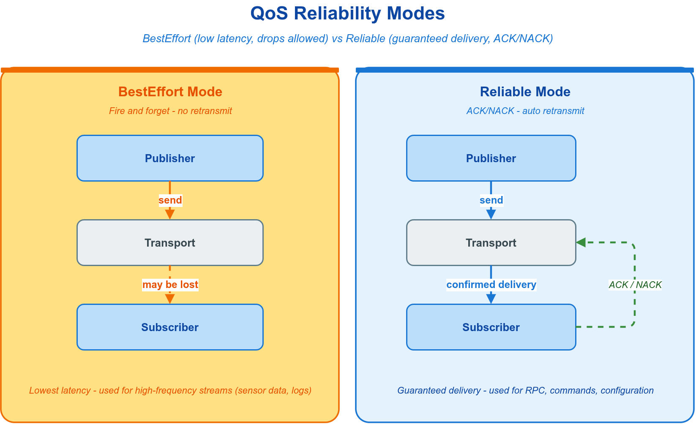

# 🚥 5. QoS 配置

QoS（Quality of Service，服务质量）作为 URL 的 `?qos=` 查询参数接入，在选定后端之上调节消息的投递行为——可靠性、历史保留、持久化、发布模式与时效等维度，而不触及业务代码对消息类型的处理。它与决定链路的 `scheme` 前缀同属 URL 抽象层：**URL 的 `scheme` 选链路、`?qos=` 调行为，二者共同定义一条通信端点的完整投递契约。** 链路选型、URL 结构与各后端接入见 [传输后端与 URL](04-transport.md)。

本章确立 QoS 的作用域与生效模型，再依次给出预定义 profile 选型矩阵、子策略语义、自定义方式、设置入口、各通信模型示例与 DDS 兼容性约束。



---

## 🎚️ 5.1 QoS 作用域与生效模型

QoS 是一组约束消息投递行为的策略集合，控制可靠性、历史保留、持久化、发布模式与时效等维度。承接 URL 的 `?qos=` 参数：`scheme` 决定后端，`?qos=<name>` 在该后端上选定一组投递策略。多数场景下，调用方只需选定一个与流量特征匹配的预定义 profile 并在 URL 引用，无需逐字段配置。

QoS 在 VLink 中以 `vlink::Qos` 聚合结构承载，由传输后端解释，其生效遵循三条规则：

- **后端选择性消费**：通过 `register_qos` / `?qos=<name>` 引用命名 `Qos` profile 的机制由 DDS 家族（`dds://`、`ddsc://`、`ddsr://`）与 `zenoh://` 提供。`intra://`、`shm://`、`someip://` 等后端不解释该结构，传入的 QoS 被静默忽略。注意 `mqtt://` 的 `?qos=` 含义不同：它取 MQTT 原生的数值等级 `0`/`1`/`2`，而非此处的命名 profile。各后端支持范围见 [传输后端与 URL](04-transport.md)。
- **按名引用**：`vlink::QosProfile` 内置 16 个 profile，其名字可在上述后端的 URL 中直接使用（如 `?qos=sensor`）；自定义 QoS 需先经 `register_qos("name", qos)` 注册，再以该名引用。
- **显式有效位**：`Qos::valid` 必须为 `true`，传输层才会应用该策略。所有预定义 profile 已置位；手工构造的 `Qos` 须自行置 `true`。

`zenoh://` 的命名 profile 接口与 DDS 一致，但原生能力映射不是 DDS QoS 的等价实现：可靠性用于选择 block/drop 拥塞控制（带 unstable API 的 zenoh-c 还设置 publisher reliability），`additions.priority` 与 `is_express` 直接映射到 Zenoh 发布、请求和响应选项；在 zenoh-c 中，正的 `history.depth`（或显式 `?depth=`）还用于链路 data/real-time TX 队列并限制到 1–16，pico 没有对应的队列配置。Durability、KeepAll、Deadline、Lifespan、Liveliness、Ownership、DestinationOrder、LatencyBudget、ResourceLimits 与 PublishMode 当前不映射到 Zenoh 原生 QoS。Field 的迟到 Getter 获得最新值依赖 VLink Setter 缓存及匹配后重发，不等同于 Zenoh durability/storage。

---

## 🚦 5.2 QoS 快速开始

引用一个内置 profile 只需在 URL 上追加 `?qos=<name>`，无需任何注册步骤：

```cpp
#include <vlink/vlink.h>

auto pub = vlink::Publisher<MyMsg>::create_unique("dds://lidar/points?qos=sensor");
```

`?depth=` 可单独覆盖历史深度，与 `?qos=` 叠加使用：`dds://topic?qos=sensor&depth=50`。从内置 profile 派生定制策略的方式见 [§5.5](#-55-自定义-qos)。

---

## 📋 5.3 预定义 Profile 选型

`vlink::QosProfile` 提供 16 个按流量类型调优的 profile。下表按「我在传输什么」给出选型判据与关键特征；三种通信模型在未显式指定 `?qos=` 时各采用其默认 profile（Event→`kEvent`、Method→`kMethod`、Field→`kField`），无需手动配置。

| 流量类型 | Profile | 可靠性 | 历史 | 持久化 | 发布模式 |
| --- | --- | --- | --- | --- | --- |
| 离散控制事件（Event 默认） | `kEvent` | Reliable | KeepLast(5) | Volatile | Sync |
| 请求/响应（Method 默认） | `kMethod` | Reliable | KeepAll | Volatile | Sync |
| 最新值状态同步（Field 默认） | `kField` | Reliable | KeepLast(1) | TransientLocal | Sync |
| 高频传感器流（雷达/相机/IMU） | `kSensor` | BestEffort | KeepLast(10) | Volatile | ASync |
| 执行器/控制指令 | `kCommand` | Reliable | KeepLast(1) | Volatile | Sync |
| 安全报警/故障事件 | `kAlarm` | Reliable | KeepAll | TransientLocal | Sync |
| 大负载传输（点云/地图） | `kLarge` | Reliable | KeepLast(500) | Volatile | Sync |
| 配置参数 | `kParameter` | Reliable | KeepLast(500) | TransientLocal | Sync |
| 服务注册与发现 | `kService` | Reliable | KeepLast(10) | TransientLocal | Sync |
| 静态数据（标定/地图） | `kStatic` | Reliable | KeepAll | TransientLocal | Sync |
| 时间同步广播 | `kClock` | BestEffort | KeepLast(1) | Volatile | Sync |
| 日志/事件流 | `kLog` | Reliable | KeepLast(100) | Volatile | ASync |
| 轻量高频小消息 | `kLight` | Reliable | KeepLast(1) | Volatile | ASync |
| 高吞吐尽力传输 | `kPoor` / `kBetter` | BestEffort | KeepLast(5/50) | Volatile | ASync/Sync |
| 高吞吐可靠传输 | `kBest` | Reliable | KeepLast(200) | Volatile | Sync |

各 profile 的逐项策略（含 Liveliness 租约、Deadline、Lifespan 与优先级，部分以 `is_express` 直发）以源码 `include/vlink/extension/qos_profile.h` 中各 profile 的完整 Doxygen 注释为权威；QoS 速查另见 [参考](14-reference.md#-146-qos-配置)。

所有内置 profile 均默认构造 Deadline 与 Lifespan，因此 `deadline.period` 和 `lifespan.duration` 都为 `-1`，分别表示不施加发布周期约束和样本永久有效。业务需要监测周期数据断流时，应复制 profile 后显式配置 Deadline；需要有限 Lifespan 时，还须确保通信主机之间具有满足业务误差要求的时钟同步。

---

## 🧮 5.4 子策略语义

当预定义 profile 不足以覆盖需求时，可在 `vlink::Qos` 上单独调整子策略。下表给出高频子策略的取值与适用判据；只需记取值名，无需关注底层编码。

| 子策略 | 字段 | 取值 | 适用判据 |
| --- | --- | --- | --- |
| 可靠性 | `reliability.kind` | `kReliable` / `kBestEffort` | 不可丢消息用 `kReliable`；高频可容忍丢帧用 `kBestEffort` |
| 历史 | `history.kind` + `history.depth` | `kKeepLast(depth)` / `kKeepAll` | 仅留最近 N 条用 `kKeepLast`；每条都须处理（如 RPC）用 `kKeepAll` |
| 持久化 | `durability.kind` | `kVolatile` / `kTransientLocal` / `kTransient` / `kPersistent` | 迟到订阅者需补历史用 `kTransientLocal`，否则 `kVolatile`；`kTransient`（依赖外部 durability 服务，DDS only）与 `kPersistent`（落稳定存储）按需启用 |
| 发布模式 | `publish_mode.kind` | `kSync` / `kASync` | 控制/RPC 用 `kSync`；高频大流量用 `kASync` 换取吞吐 |
| Deadline | `deadline.period` | 毫秒，`-1` 不约束 | 内置 profile 均使用 `-1`；自定义周期流可设为预期周期的 2~3 倍 |
| Lifespan | `lifespan.duration` | 毫秒，`-1` 永久 | 内置 profile 均使用 `-1`；仅在跨机时钟可靠同步时为自定义 profile 设置有限值 |
| 优先级 | `additions.priority` | `kPriorityRealTime` … `kPriorityBackground` | 当前映射为 Zenoh 传输优先级；与 MessageLoop 任务优先级无关 |

其余子策略（Liveliness、DestinationOrder、Ownership、LatencyBudget、ResourceLimits）属低频进阶项，默认值适用于绝大多数场景，完整字段说明见 [参考](14-reference.md)。

---

## 🛠️ 5.5 自定义 Qos

构造自定义 QoS 时，将 `valid` 置为 `true`，设置关心的字段，再注册。`valid` 未置位的 `Qos` 不会被传输层应用。

```cpp
#include <vlink/extension/qos.h>
#include <vlink/modules/dds_conf.h>

vlink::Qos qos;
qos.valid             = true;
qos.reliability.kind  = vlink::Qos::Reliability::kBestEffort;
qos.history.kind      = vlink::Qos::History::kKeepLast;
qos.history.depth     = 20;
qos.publish_mode.kind = vlink::Qos::PublishMode::kASync;

vlink::DdsConf::register_qos("my_sensor", qos);

auto pub = vlink::Publisher<MyMsg>::create_unique("dds://lidar/points?qos=my_sensor");
```

以预定义 profile 为基底再微调，可避免从零设置每个字段——profile 已含 `valid=true` 与合理默认：

```cpp
vlink::Qos qos = vlink::QosProfile::kField;
qos.history.depth = 5;
vlink::DdsConf::register_qos("my_field", qos);

auto setter = vlink::Setter<int>::create_unique("dds://system/mode?qos=my_field");
```

`register_qos` 的名字处于全局命名空间；与已注册名字或 DDS 保留 token 冲突会触发致命日志。`vlink::Qos` 完整字段清单见 [参考](14-reference.md)。

无需写代码亦可扩充可用 profile：将环境变量 `VLINK_QOS_CONFIG` 指向一个 JSON 文件（顶层须为对象数组），进程首次访问 profile 表时会把其中每个对象（须含字符串 `name`，可选 `reliability`/`history`/`durability`/… 子策略，未列字段沿用默认值）注册进全局 profile 表，随后即可像内置 profile 一样以 `?qos=<name>` 引用；与内置同名者将被覆盖。任一对象格式错误（非数组、缺 `name`、名字超 19 字符等）会记错误日志并中止后续加载。该机制对所有支持命名 profile 的后端生效，环境变量说明见 [集成](13-integration.md)。

---

## 🎛️ 5.6 设置入口

`?qos=<name>` 是最常用的入口；也可直接构造后端 `Conf`。命名 profile 须先注册到对应后端，两种写法最终都写入 `Conf::qos`：

| 入口 | 写法 | 适用 |
| --- | --- | --- |
| URL 查询参数 | `"dds://topic?qos=sensor"` | 最常用；可叠加 `&depth=` 覆盖深度 |
| Conf 构造填名字 | `vlink::DdsConf("topic", 0, 20, "sensor")` | 需在构造时一并指定 domain/depth |

`set_property()` 不是 DDS endpoint QoS 的通用逐字段入口。DDS 的 `dds.*` 属性用于 participant/transport 配置；Zenoh 另行支持 `qos`、`depth` 属性。DDS endpoint QoS 应通过 URL、`DdsConf` 或 `qos_ext` 配置，例如：

```cpp
vlink::DdsConf conf("vehicle/speed", /*domain=*/0, /*depth=*/20, /*qos=*/"sensor");
vlink::Publisher<MyMsg> pub(conf);
```

`register_qos` 之外的进阶配置仅限 DDS 家族：在运行期组装每个 endpoint 各自 QoS 的 per-entity 属性映射 `qos_ext`（与命名 profile 的 `qos` 字段互斥，二者同时非空会令 `is_valid()` 为 `false`），以及加载 Fast-DDS XML profile 的 `load_global_qos_file`。这些由对应的 `*Conf` 提供，详见 [传输后端与 URL](04-transport.md) 所述 DDS 系列的扩展 QoS 形式。

---

## 🧪 5.7 各模型 QoS 示例

三种通信模型的 QoS 用法一致：引用对应模型的默认 profile，并以同一 profile 配置两端。

**Event 模型** — `?qos=event`：

```cpp
#include <vlink/publisher.h>
#include <vlink/subscriber.h>

auto sub = vlink::Subscriber<MyMsg>::create_unique("dds://vehicle/speed?qos=event");
sub->listen([](const MyMsg& msg) { /* 处理消息 */ });

auto pub = vlink::Publisher<MyMsg>::create_unique("dds://vehicle/speed?qos=event");
pub->wait_for_subscribers();
pub->publish(MyMsg{});
```

**Method 模型** — `?qos=method`，`kMethod` 以 KeepAll 确保请求不丢：

```cpp
#include <vlink/client.h>
#include <vlink/server.h>

auto server = vlink::Server<Request, Response>::create_unique("dds://my_service?qos=method");
server->listen([](const Request& req, Response& resp) { resp.result = process(req); });

auto client = vlink::Client<Request, Response>::create_unique("dds://my_service?qos=method");
client->wait_for_connected();
auto resp = client->invoke(Request{});
```

**Field 模型** — `?qos=field`，`kField` 以 TransientLocal 使迟到的 Getter 仍可获得 Setter 已发布的最新值：

```cpp
#include <vlink/setter.h>
#include <vlink/getter.h>

auto setter = vlink::Setter<int>::create_unique("dds://system/mode?qos=field");
setter->set(42);

auto getter = vlink::Getter<int>::create_unique("dds://system/mode?qos=field");

if (auto val = getter->get()) {
    VLOG_I("mode: ", *val);
}
```

---

## ✅ 5.8 DDS 兼容性约束

在 DDS 后端下，Publisher 与 Subscriber 的 QoS 必须满足兼容性条件，否则双方不匹配、不通信。两条核心规则：

- **可靠性**：订阅端要求 `kReliable` 时，发布端必须同为 `kReliable`；发布端 `kReliable` 可被 `kBestEffort` 订阅端接收，反之不成立。
- **持久化**：发布端 `kTransientLocal` 可被 `kVolatile` 订阅端接收；`kVolatile` 发、`kTransientLocal` 订的组合不兼容。

以同一 profile 配置两端是规避不匹配的最稳妥做法。此外，不同 Domain ID 的节点相互隔离，可用 `?domain=N` 或 `DdsConf::domain` 分组。

---

## 📚 相关文档

| 主题 | 文档 |
| --- | --- |
| 传输后端选型、URL 契约与各后端接入 | [传输后端与 URL](04-transport.md) |
| 通信模型与各原语接口 | [通信模型](02-communication.md) |
| 消息序列化与后端配合 | [消息序列化](03-serialization.md) |
| 零拷贝容器与后端兼容性 | [零拷贝](06-zerocopy.md) |
| 共享内存守护进程、监控代理与服务发现 | [可观测性](12-observability.md) |
| 环境变量、C API 与扩展 | [集成](13-integration.md) |
| `vlink::Qos` 完整结构、16 个 profile 预设清单与 API 参考 | [参考](14-reference.md) |
