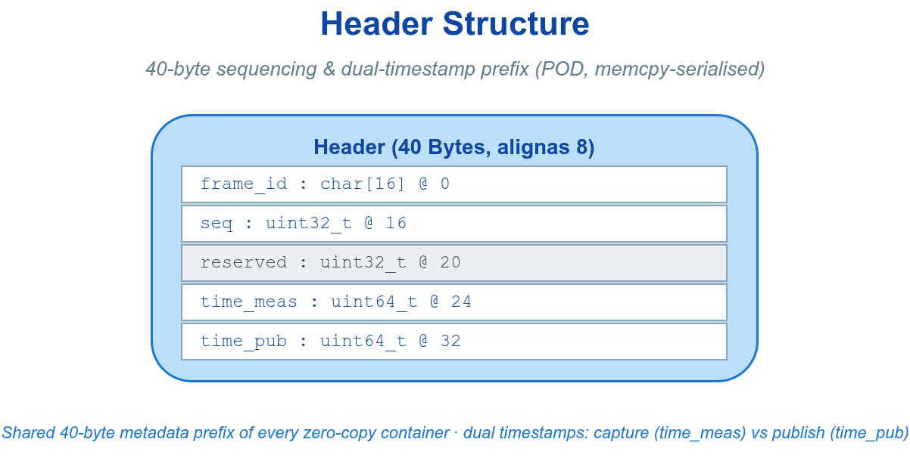
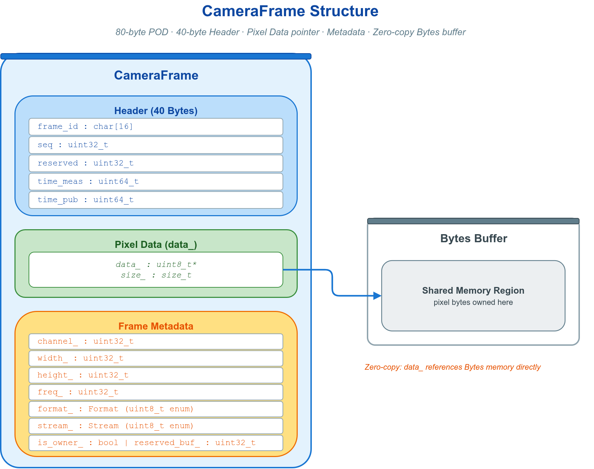
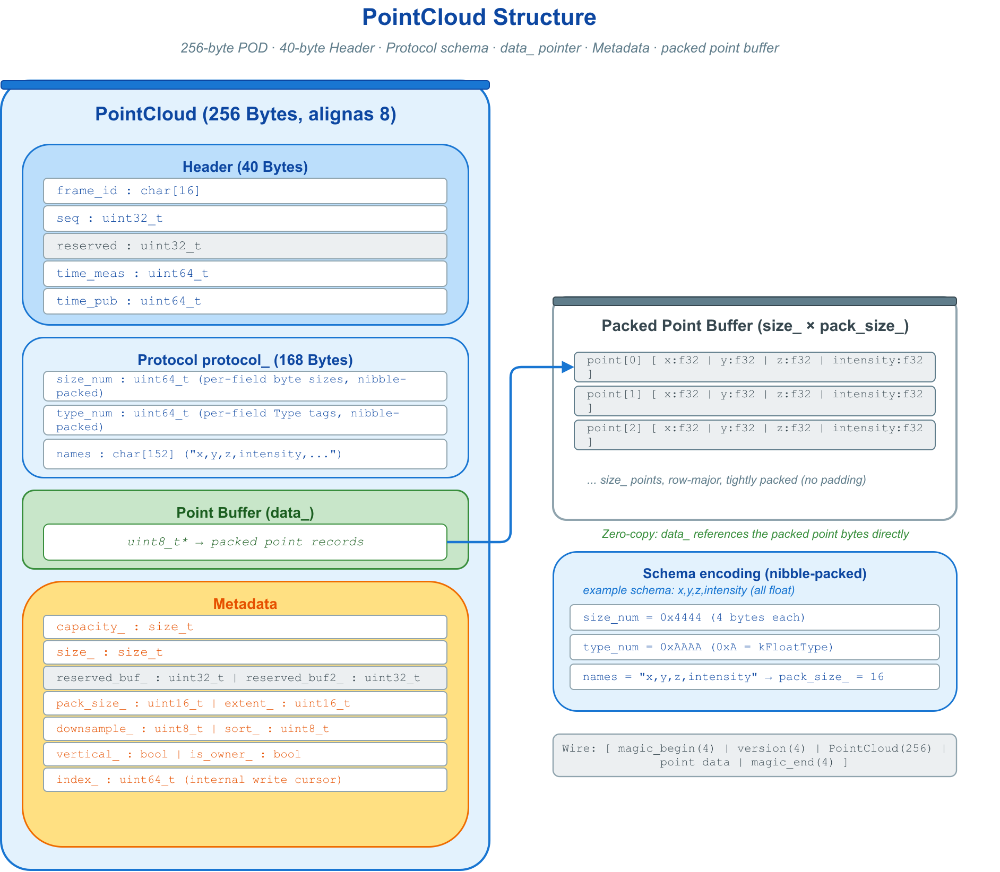
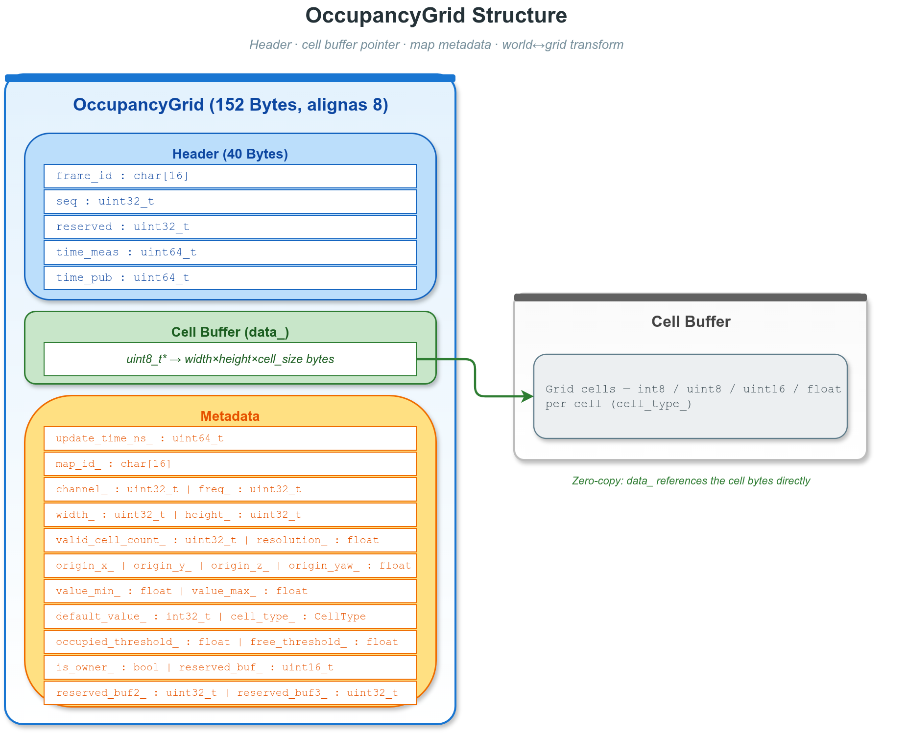
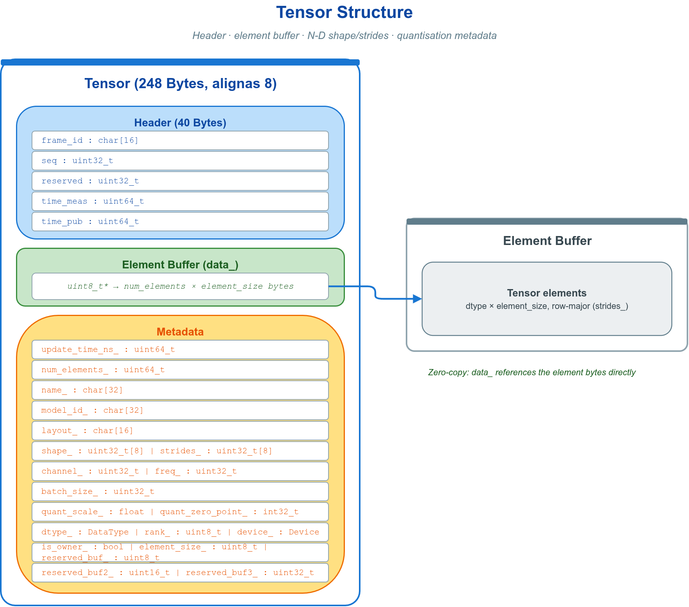
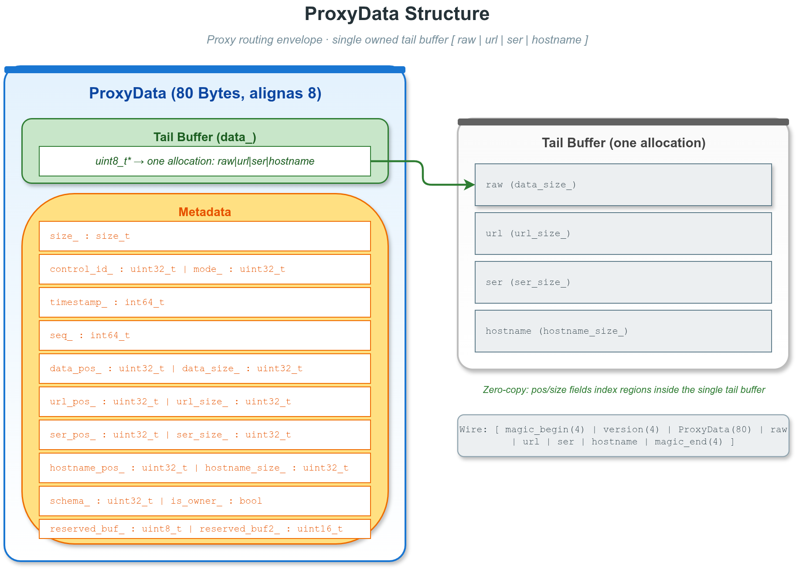

# 💨 6. 零拷贝

零拷贝是 VLink 在数据路径上施加的一类非侵入能力：削减大负载在收发链路上的内存复制，使相机帧、点云、栅格地图、张量、目标列表、音频等传感器数据的搬运延迟与带宽消耗降至最低。它遵循统一的 URL 契约（[传输后端与 URL](04-transport.md)、[QoS 配置](05-qos.md)）——业务代码仍只面对六个通信原语，能力以“领域容器作为消息类型 `T`”或“借贷接口 `loan()`”的形式接入，调用方式不因启用而改变。安全节点可以使用共享内存后端，但会关闭 transport loan，并先生成密文缓冲区；因此[安全加密](07-security.md)与零拷贝接口可组合，却不会保留端到端零拷贝路径。


---

## ⚡ 6.1 零拷贝的两层机制

大负载传感器数据（相机帧、点云、栅格地图、张量、目标列表、音频）在通信链路中反复复制，会成为延迟与带宽的主要来源。VLink 通过两条互相独立、可叠加的机制消除这类复制，二者作用于数据路径的不同阶段：

- **传输层零拷贝（loan）**：`shm://` / `shm2://`（以及显式开启共享内存的 `zenoh://`）允许发布端从共享内存池借出缓冲区并就地写入，订阅端经指针收到同一块内存，避免一次发送侧用户态 payload 复制。作用于跨进程搬运阶段。
- **容器层零拷贝**：`vlink::zerocopy` 命名空间下的领域容器在反序列化时使内部指针直接指向接收缓冲区，负载数据不被复制。作用于解码阶段，与后端无关。

两层的组合效果取决于后端：

| 后端 | 容器层借用 | 传输层 loan | 数据路径 |
| --- | :---: | :---: | --- |
| `shm://` / `shm2://` | 是 | 是 | transport 可借贷，接收容器不复制 payload |
| `zenoh://?shm=1` | 是 | 是 | transport 可借贷，接收容器不复制 payload |
| `dds://` / `intra://` 等 | 是 | 否 | 仅容器层借用 |

这里的两层组合表示 transport 提供 loan 且接收容器不做 payload 解码复制，不保证调用方本地 payload 到接收端全程零复制：普通 `Publisher<zerocopy容器>` 的 `operator>>` 仍可能把本地 payload 复制进 transport loan。发布端要直接就地写共享池，应使用 [6.10](#-610-传输层-loan) 的显式 `Publisher<Bytes>::loan()` 路径；完整后端参数见 [传输后端与 URL](04-transport.md)。

### 6.1.1 容器选型概览

每个领域容器都作为 `Publisher<T>` / `Subscriber<T>` 的消息类型 `T` 使用，按数据语义选择。选定容器后，收发即为常规的发布/订阅用法（见 [通信模型](02-communication.md)）。

| 容器 | 适用数据 | 典型后端 | 结构图 |
| --- | --- | --- | --- |
| `CameraFrame` | 图像帧 / 编码图像 / 编码视频 | `shm://`、`dds://` | camera-frame-structure |
| `PointCloud` | 激光雷达 / 深度点云 | `shm://`、`dds://` | point-cloud-structure |
| `OccupancyGrid` | 2D 占据 / 代价 / SDF 地图 | `shm://`、`dds://` | occupancy-grid-structure |
| `Tensor` | 神经网络张量输入/输出 | `shm://`、`dds://` | tensor-structure |
| `ObjectArray` | 3D 检测 / 跟踪目标列表 | 任意 | — |
| `AudioFrame` | PCM / 编码音频帧 | 任意 | — |
| `RawData` | 自定义二进制负载 | 任意 | — |
| `ProxyData` | 代理层消息信封及原始载荷 | 任意 | — |

```cpp
vlink::Publisher<vlink::zerocopy::CameraFrame> pub("shm://camera/front");
vlink::Subscriber<vlink::zerocopy::PointCloud>  sub("dds://lidar/points");
```

> 序列化机制见 [消息序列化](03-serialization.md)；`shm` / `shm2` / `zenoh` 传输配置见 [传输后端与 URL](04-transport.md)；`Bytes` 用法见 [基础库](08-base-library.md)。完整示例见 `examples/zerocopy/zerocopy_basic`。

---

## 🧩 6.2 通用容器接口

七个容器共享同一套元数据、方法与所有权模型。本节集中阐述共性，后续各容器节只列各自特有的字段与枚举。



### 6.2.1 公共元数据 header

七个容器（含 `RawData`）均内嵌一个 `Header header` 成员（40 字节、序列化时随负载一并写入），承载序列号、坐标系标识与时间戳。常用四字段：

| 字段 | 类型 | 含义 |
| --- | --- | --- |
| `header.frame_id` | `char[16]` | 坐标系 / 传感器标识（可不带终止符，读取用 `header.frame_id_view()`） |
| `header.seq` | `uint32_t` | 单调递增序列号，在 `UINT32_MAX` 处回绕，用于检测丢帧 |
| `header.time_meas` | `uint64_t` | 采集时间戳（自 UNIX 纪元起的纳秒） |
| `header.time_pub` | `uint64_t` | 发布时间戳（自 UNIX 纪元起的纳秒） |

`time_pub - time_meas` 为采集到发布的处理延迟；订阅端用「接收时刻 − `time_pub`」估算传输延迟。两个时间戳均为「自 UNIX 纪元起的纳秒」，应用层用标准库取得：

```cpp
// 返回自 UNIX 纪元起的纳秒时间戳，供 header 填写
static uint64_t now_ns() {
  return static_cast<uint64_t>(std::chrono::duration_cast<std::chrono::nanoseconds>(
      std::chrono::system_clock::now().time_since_epoch()).count());
}
```

后续各容器示例中省略其余 header 赋值，发布前按下例填写：

```cpp
frame.header.seq       = seq++;
frame.header.time_meas = capture_ts_ns;
frame.header.time_pub  = now_ns();
```

### 6.2.2 公共方法

| 方法 | 语义 |
| --- | --- |
| `create(size)` | 分配并拥有 `size` 字节缓冲区，随后写入 `data()` |
| `data()` / `size()` | 只读负载指针 / 负载字节数 |
| `shallow_copy(ptr, size)` | 借用外部指针，不复制数据（仅五个字节容器） |
| `shallow_copy(other)` | 借用同类对象的缓冲区，并复制其 `header` |
| `deep_copy(ptr, size)`（仅五个字节容器）/ `deep_copy(other)` | 深拷贝，得到独立的拥有缓冲区 |
| `move_copy(other)` | 转移所有权，`other` 随后失效 |
| `is_valid()` | 负载非空且有效 |
| `is_owner()` | 是否拥有当前缓冲区，决定析构是否释放 |
| `check_valid(bytes)` | 静态方法，校验一段 `Bytes` 是否为本容器的合法负载 |
| `clear()` | 释放拥有的缓冲区并归零字段 |

`PointCloud` 与 `ObjectArray` 为变长记录容器，接口有所不同：`PointCloud` 以 Schema 创建（`create_v3f<...>(count, names)` 等）、`size()` 返回点数、负载指针为 `get_internal_data()`；`ObjectArray` 以 `create(count)` 预分配、`count()` 返回记录数、`objects(i)` 取记录。这两个容器只提供同类对象的 `shallow_copy(other)` / `deep_copy(other)`，没有裸指针 `(ptr, size)` 重载。其余五个容器（`CameraFrame`、`OccupancyGrid`、`Tensor`、`AudioFrame`、`RawData`）适用上表的 `create(size)` / `data()` / `size()` 字节语义，并同时提供 `(ptr, size)` 与 `(other)` 两种借用/拷贝重载。

发布与订阅容器时序列化由框架自动完成，应用层无需手工编解码。仅在手工落盘或自定义网络收发时才需关注序列化细节。

### 6.2.3 所有权与借用

内存所有权由创建方式决定，经 `is_owner()` 区分：

| 创建方式 | `is_owner()` | 析构行为 |
| --- | :---: | --- |
| `create(size)` / `deep_copy(...)` | `true` | 释放缓冲区 |
| `shallow_copy(...)` | `false` | 不释放 |
| `move_copy(other)` | 继承 `other` | 取决于源 |

借用（`shallow_copy`）时容器仅持有指针，**源缓冲区的生存期必须覆盖容器的生存期**，否则 `data()` 悬空。边界条件见 [6.11](#-611-生命周期约束)。

---

## 📷 6.3 CameraFrame：图像与编码视频帧



头文件 `include/vlink/zerocopy/camera_frame.h`。携带分辨率、像素格式、通道、采集频率等元数据与像素缓冲区，同时支持原始像素（YUV/RGB/Mono/Bayer/OpenCV 数值格式）与编码帧（JPEG/PNG/WebP/MJPEG/H.26x/AV1）。

常用元数据 setter：`set_width(w)`、`set_height(h)`、`set_format(fmt)`、`set_channel(ch)`、`set_freq(hz)`、`set_stream(s)`（仅编码视频）。对应 getter 为去掉 `set_` 前缀的同名方法。

- 像素格式 `Format`：原始格式 `kFormatYuv420`、`kFormatNv12`、`kFormatNv21`、`kFormatYuyv`、`kFormatBgr888Packed`、`kFormatRgb888Packed`、`kFormatRgb888Planar`、`kFormatMono8`、`kFormatMono16`、`kFormatRgba8888Packed`、`kFormatBgra8888Packed`，通用 OpenCV/ROS 数值格式 `kFormatUint8C1` 到 `kFormatFloat64C4`，Bayer 格式 `kFormatBayerRggb8` 到 `kFormatBayerGrbg16`；编码格式 `kFormatJpeg`、`kFormatPng`、`kFormatMjpeg`、`kFormatH264`、`kFormatH265`、`kFormatH266`、`kFormatAv1`、`kFormatWebp`。
- 编码名转换：`CameraFrame::format_from_encoding("32FC1")` 可从 ROS/OpenCV/codec 名称得到 `Format`；`encoding_from_format(fmt)` 返回规范编码名。
- 视频流帧类型 `Stream`（编码视频）：`kStreamI`（关键帧）、`kStreamP`（前向预测帧）、`kStreamB`（双向预测帧）。

```cpp
static constexpr uint32_t kW = 1920;
static constexpr uint32_t kH = 1080;

vlink::Publisher<vlink::zerocopy::CameraFrame> pub("shm://camera/front");
pub.wait_for_subscribers();

vlink::zerocopy::CameraFrame frame;
frame.header.time_pub = now_ns();
frame.set_width(kW);
frame.set_height(kH);
frame.set_format(vlink::zerocopy::CameraFrame::kFormatNv12);
frame.create(kW * kH * 3 / 2);
camera_driver_fill(const_cast<uint8_t*>(frame.data()), frame.size());
pub.publish(frame);
```

```cpp
vlink::Subscriber<vlink::zerocopy::CameraFrame> sub("shm://camera/front");
sub.listen([](const vlink::zerocopy::CameraFrame& frame) {
  if (!frame.is_valid()) {
    return;
  }

  const uint8_t* plane = frame.data();
  process(plane, frame.width(), frame.height());
});
```

编码视频流：发布端经 `shallow_copy(data, size)` 避免先把编码器输出复制进容器，并以 `set_format(kFormatH264)`、`set_format(kFormatH265)`、`set_format(kFormatH266)` 或 `set_format(kFormatAv1)` 与 `set_stream(...)` 标注；普通发布仍会由容器序列化器把 payload 复制进 transport buffer，订阅端再按 `format()` / `stream()` 路由至解码器。

---

## ☁️ 6.4 PointCloud：带 Schema 的点云



头文件 `include/vlink/zerocopy/point_cloud.h`。点云容器自带字段 Schema（字段名与类型），收发两端无需额外协议约定即可解读每个点的各字段。最常用的是 `v3f` 系列（XYZ 以 `float` 存储）：

| 方法 | 语义 |
| --- | --- |
| `create_v3f<ExtraT...>(count, names)` | 创建 XYZ + 附加字段的点云，预留 `count` 个点 |
| `push_value_v3f(x, y, z, extras...)` | 追加一个点 |
| `get_value_v3f(index)` | 读第 `index` 个点的 XYZ，返回 `Vector3f` |
| `get_key_list()` | 按打包顺序返回字段名、逻辑类型和存储字节数；量化点云的前三个坐标仍报告为浮点逻辑类型 |
| `get_key_map()` + `get_value<T>(index, key_map, "field")` | 按字段名读任意字段 |

`size()` 返回当前点数，`pack_size()` 返回单点字节数。需要双精度坐标时改用 `create_v3d` / `push_value_v3d` / `get_value_v3d`。

```cpp
vlink::zerocopy::PointCloud pc;
pc.header.time_pub = now_ns();
pc.create_v3f<float>(100000, {"intensity"});

for (size_t i = 0; i < 100000; ++i) {
  pc.push_value_v3f(x[i], y[i], z[i], intensity[i]);
}

pub.publish(pc);
```

```cpp
sub.listen([](const vlink::zerocopy::PointCloud& pc) {
  if (!pc.is_valid()) {
    return;
  }

  auto key_map = pc.get_key_map();

  for (size_t i = 0; i < pc.size(); ++i) {
    vlink::zerocopy::PointCloud::Vector3f p = pc.get_value_v3f(i);
    float intensity = pc.get_value<float>(i, key_map, "intensity");
    consume(p.x, p.y, p.z, intensity);
  }
});
```

海量点云可按需启用四种带宽优化：

| 优化 | 接口 | 效果 |
| --- | --- | --- |
| 精度量化 | `create_v3f(count, names, extent)` | 传入坐标绝对值上界 `extent`，XYZ 按 `int16_t` 量化存储（约省一半带宽），`get_value_v3f` 读取时自动反量化；坐标落在 `(-extent, +extent)` 之外的点在 `push_value_v3f` 时被直接丢弃（非饱和） |
| 垂直排布 | `set_vertical(true)` | 序列化负载按字段成列（SoA），更利于下游熵编码；内存布局不变 |
| 空间排序 | `create_v3f(count, names, extent, true, true)` | 仅在 vertical 序列化中按 XYZ 空间键重排完整点记录，支持量化 `int16` 及未量化 `float` / `double` 坐标；`vertical=false` 时排序强制关闭；发送端内存点序不变，接收端看到排序后的点序；缺省关闭 |
| 体素降采样 | `downsample(level)`（`level` 取 `1..255`） | 在已量化（`extent>0`）且拥有缓冲区（owned）的点云上将空间相近点折叠为每体素一个，原地缩减点数；借用/反序列化得到的点云无法降采样 |

空间排序发生在每次 vertical 序列化时，时间复杂度为 `O(N log N)`，临时索引在 64 位平台通常约占每点 16 字节。默认关闭时仍走原有无排序分支，不增加逐点判断。推荐顺序为：量化 → `downsample()` → vertical + 空间排序 → 下游熵编码。

线格式大小与字段偏移保持不变。offset 245 原为应用可写的保留字节；旧数据仅在该字节恰为 `1`、`vertical=true` 且前三个 XYZ 字段为大小匹配的同类型 `int16_t` / `float` / `double` 时会被新版本解释为启用排序，其他情况按关闭处理。旧版本接收新数据时则把该状态视为保留字节，点字段仍可正常解码。

---

## 🗺️ 6.5 OccupancyGrid：2D 占据与代价地图



头文件 `include/vlink/zerocopy/occupancy_grid.h`。按行主序存储 `width × height` 个同质单元格，内嵌世界坐标变换、阈值、地图 ID 等元数据，语义对齐 ROS `nav_msgs/OccupancyGrid` 并支持更高位宽的单元格类型。

常用 setter：`set_width(w)`、`set_height(h)`、`set_resolution(米/格)`、`set_origin_x/y/z/yaw(...)`、`set_cell_type(t)`、`set_default_value(v)`、`set_occupied_threshold(t)` / `set_free_threshold(t)`、`set_map_id("name")`。

- 单元格类型 `CellType`：`kCellInt8`（ROS 风格 `-1 / 0..100`）、`kCellUint8`（0..254 代价图，255 表示 unknown）、`kCellUint16`（高分辨率代价图）、`kCellFloat32`（概率 / 对数几率 / SDF）。`cell_size()` 返回单元格字节数。
- `(origin_x, origin_y)` 为第 0 行 0 列单元格的左下角，地图绕原点旋转 `origin_yaw` 弧度（遵循 REP-103）。

```cpp
vlink::zerocopy::OccupancyGrid og;
og.header.time_pub = now_ns();
og.set_map_id("global");
og.set_width(400);
og.set_height(400);
og.set_resolution(0.05F);
og.set_origin_x(-10.0F);
og.set_origin_y(-10.0F);
og.set_cell_type(vlink::zerocopy::OccupancyGrid::kCellInt8);
og.set_default_value(-1);

const size_t cells = static_cast<size_t>(og.width()) * og.height() * og.cell_size();
og.create(cells);
std::memset(const_cast<uint8_t*>(og.data()), 0, cells);

pub.publish(og);
```

---

## 🧮 6.6 Tensor：N 维神经网络张量



头文件 `include/vlink/zerocopy/tensor.h`。最多 8 维，同时存形状 `shape` 与步长 `strides`，可无损往返非连续视图（如 NCHW 切片）。适用于神经网络输入/输出、特征图、语言模型隐藏态等。

常用 setter：`set_shape(shape, rank)`（同步推导 `strides` 与 `num_elements`）、`set_dtype(t)`、`set_layout("NCHW")`、`set_device(d)`、`set_name(sv)`、`set_model_id(sv)`。量化张量另填 `set_quant_scale` / `set_quant_zero_point`。

- 元素类型 `DataType`：`kInt8`、`kUint8`、`kInt32`、`kInt64`、`kFloat16`、`kBfloat16`、`kFloat32`、`kFloat64` 等。`element_size()` 返回单元素字节数。
- 设备提示 `Device`：`kDeviceCpu`、`kDeviceGpu`、`kDeviceNpu`、`kDeviceDsp`。

```cpp
vlink::zerocopy::Tensor t;
t.header.time_pub = now_ns();
t.set_name("image");
t.set_layout("NCHW");
t.set_dtype(vlink::zerocopy::Tensor::kFloat32);
t.set_device(vlink::zerocopy::Tensor::kDeviceGpu);

uint32_t shape[] = {1, 3, 224, 224};
t.set_shape(shape, 4);

t.create(t.num_elements() * t.element_size());
fill_input(const_cast<uint8_t*>(t.data()), t.size());

pub.publish(t);
```

---

## 🚗 6.7 ObjectArray：3D 检测与跟踪目标列表

头文件 `include/vlink/zerocopy/object_array.h`。变长数组容器，每个 `Object` 记录一个障碍物的姿态、尺寸、运动学、分类与跟踪 ID。`Object` 字段全部公开，可直接读写。

- 容器方法：`create(count)` 预分配 `count` 个槽位、`push_value(obj)` 追加、`objects(i)` 取第 `i` 项只读指针、`count()` 当前数量；元数据 `set_source_id("name")`、`set_channel(c)`。
- `Object` 常用字段：`label[32]`（类别名）、`position[3]`、`size[3]`、`yaw`、`velocity[3]`、`acceleration[3]`、`score`（置信度）、`class_id`、`track_id`、`motion_state`、`source_type`。
- 运动状态 `MotionState`：`kMotionStationary`、`kMotionMoving`、`kMotionStopped`、`kMotionParked`。
- 来源传感器 `SourceType`：`kSourceLidar`、`kSourceCamera`、`kSourceRadar`、`kSourceFusion`、`kSourceUltrasonic`。

```cpp
vlink::zerocopy::ObjectArray arr;
arr.header.time_pub = now_ns();
arr.set_source_id("fusion_v2");
arr.create(256);

vlink::zerocopy::ObjectArray::Object obj;
std::strncpy(obj.label, "car", sizeof(obj.label) - 1);
obj.position[0]  = 12.0F;
obj.size[0]      = 4.5F;
obj.yaw          = 0.1F;
obj.score        = 0.92F;
obj.track_id     = 42;
obj.motion_state = vlink::zerocopy::ObjectArray::kMotionMoving;
obj.source_type  = vlink::zerocopy::ObjectArray::kSourceFusion;
arr.push_value(obj);

pub.publish(arr);
```

订阅端遍历：`for (uint32_t i = 0; i < arr.count(); ++i) { const auto* o = arr.objects(i); ... }`。

---

## 🔊 6.8 AudioFrame：音频帧（PCM / 编码）

头文件 `include/vlink/zerocopy/audio_frame.h`。传输一段原始 PCM 或编码音频，适用于麦克风采集、TTS 输出、车机语音、车载娱乐音频流等。

常用 setter：`set_sample_rate(hz)`、`set_num_channels(c)`、`set_num_samples(n)`、`set_format(f)`、`set_layout(l)`、`set_codec("PCM")`、`set_language("zh")`（供语音识别使用）。

- 采样/编码格式 `Format`：`kFormatPcmS16`、`kFormatPcmS24`、`kFormatPcmS32`、`kFormatPcmF32`、`kFormatPcmU8`、`kFormatOpus`、`kFormatAac`、`kFormatMp3`、`kFormatFlac`。
- 通道布局 `Layout`：`kLayoutInterleaved`（`L,R,L,R...`）、`kLayoutPlanar`（各通道独立平面）。

```cpp
vlink::zerocopy::AudioFrame frame;
frame.header.time_pub = now_ns();
frame.set_sample_rate(48000);
frame.set_num_channels(2);
frame.set_num_samples(960);
frame.set_format(vlink::zerocopy::AudioFrame::kFormatPcmS16);
frame.set_layout(vlink::zerocopy::AudioFrame::kLayoutInterleaved);
frame.set_codec("PCM");

const size_t payload = frame.num_samples() * frame.num_channels() * sizeof(int16_t);
frame.create(payload);
capture_pcm(const_cast<uint8_t*>(frame.data()), payload);

pub.publish(frame);
```

---

## 📦 6.9 RawData：自定义二进制负载

头文件 `include/vlink/zerocopy/raw_data.h`。最简容器，仅封装一个 `Header` 与一段无类型字节缓冲区，适合承载自定义协议结构体。经 `create(size)` 分配后写入 `data()`，订阅端按约定结构体解读；`shallow_copy(ptr, size)` 可避免先复制进本地容器，但普通发布仍会把 payload 复制进 transport buffer。

```cpp
struct MyProtocol {
  uint32_t cmd;
  uint32_t flags;
  float    payload[256];
};

vlink::zerocopy::RawData rd;
rd.header.time_pub = now_ns();
rd.create(sizeof(MyProtocol));
auto* proto = reinterpret_cast<MyProtocol*>(const_cast<uint8_t*>(rd.data()));
proto->cmd = 0x1001;
pub.publish(rd);
```

```cpp
sub.listen([](const vlink::zerocopy::RawData& rd) {
  if (!rd.is_valid() || rd.size() < sizeof(MyProtocol)) {
    return;
  }

  const auto* proto = reinterpret_cast<const MyProtocol*>(rd.data());
  handle(proto->cmd);
});
```

代理层另有内部容器 `ProxyData`（`include/vlink/zerocopy/proxy_data.h`），供 VLink 代理路由使用，普通应用一般不直接操作。



### 6.9.1 统一只读解析 `MessageParser`

需要在运行期按序列化类型读取消息的工具和扩展，应包含 `<vlink/zerocopy/message_parser.h>` 并使用 `vlink::zerocopy::MessageParser`。解析器统一识别 `RawData`、`CameraFrame`、`PointCloud`、`ProxyData`、`OccupancyGrid`、`Tensor`、`ObjectArray` 与 `AudioFrame` 八种类型；CLI、viewer、analyzer、Web 桥接和 Python 绑定的通用字段读取使用这一入口，避免各层重复维护类型识别、边界检查与字段类型转换。为避免热路径回退，viewer 和 Web 可视化中 CameraFrame / PointCloud 的专用实时渲染可以直接调用对应容器 codec，绕过通用字段解析器。各容器 codec 仍是底层序列化实现。

```cpp
vlink::zerocopy::MessageParser parser;

if (!parser.parse(serialized_type, bytes)) {
  return;
}

vlink::zerocopy::MessageParser::Value value;

if (parser.value("header.time_meas", value)) {
  consume(value);
}

if (parser.value("data", 3, "track_id", value)) {
  consume(value);
}
```

根字段使用点路径，例如 `header.frame_id`、`width`、`dtype`。变长集合通过 `value(collection, index, field, out)` 读取：`PointCloud.data[N].field` 与 `ObjectArray.data[N].field` 读取记录字段，`OccupancyGrid.data[N].value` 和 `Tensor.data[N].value` 读取标量，`Tensor.shape[N].value` / `strides[N].value` 读取维度信息。`collection_size()` 提供统一的边界；`fields()` 与 `element_fields()` 可用于动态 UI 或 schema 构建。

`Field` 描述符除字段名与 `Value` 类型外，还带有呈现语义：`enum_kind` 标明字段编码的内置枚举（供解析出符号名）、`is_time` 标明纳秒时间戳、`is_bool` 标明布尔、`is_reserved` 标明可隐藏的保留槽。基于这些元数据，同一头文件提供一个纯反射驱动的可读渲染器 `format_message(parser, options)`：它遍历 `fields()` / `element_fields()` 生成规范文本，包括 `header {}`、PointCloud 的 `protocol {}` 与逐点展开、Tensor shape、枚举符号名、日期、十六进制和布尔；其他二进制集合保持摘要形式。`vlink-parse`、`vlink-efbs`、`vlink-eproto` 共用这一渲染器，输出保持一致。

`Value` 保留 `int64_t` / `uint64_t` 的整数精度。只有调用 `numeric(..., double&, &precision_loss)` 为 ExprTk 等浮点计算显式转换时，超过 IEEE-754 精确整数范围的值才会通过 `precision_loss` 报告精度损失。解析得到的容器可能借用输入 `Bytes` 的存储，因而输入缓冲区必须至少与解析器同寿命，并且在解析器有效期间不得修改其内容、大小、容量或底层存储。Python 的 `parse()` / `parse_type()` 会自动保活输入对象；如果检测到输入指针或大小发生变化，后续读取会令该解析结果表现为无效。原地内容修改无法由解析器可靠检测，仍属于调用方禁止操作。

---

## 🚀 6.10 传输层 loan


loan 作用于跨进程搬运阶段：发布端从共享内存池借出缓冲区写数据，订阅端收到指向同一块内存的指针。`is_support_loan()` 仅在 `shm://`、`shm2://` 以及显式开启共享内存的 `zenoh://?shm=1` 上返回 `true`；其余后端返回 `false`，此时 `loan()` 返回空 `Bytes`，照常用 `publish()` 发布即可，仅不享受传输层零拷贝。

| 方法 | 语义 |
| --- | --- |
| `is_support_loan()` | 查询当前后端是否支持 loan |
| `loan(size)` | 从共享内存池借出 `size` 字节缓冲区，失败返回空 `Bytes` |
| `return_loan(bytes)` | 归还借出但未发布的缓冲区 |

```cpp
vlink::Publisher<vlink::Bytes> pub("shm://camera/raw");
pub.wait_for_subscribers();

if (pub.is_support_loan()) {
  vlink::Bytes buf = pub.loan(1920 * 1080 * 3 / 2);

  if (!buf.empty()) {
    camera_driver_fill(buf.data(), buf.size());
    if (!pub.publish(buf)) {
      pub.return_loan(buf);
    }
  }
}
```

边界条件：借出后若未 `publish()`，必须显式 `pub.return_loan(buf)`，否则共享内存池会耗尽；`publish()` 返回 `false` 时同样应调用 `return_loan()`——对已被后端消费的缓冲区该调用是无害空操作。

订阅端在回调返回后自动归还 loan；若需在回调外继续使用数据，应在回调内完成拷贝（如容器的 `deep_copy`）。

> 安全端点（`SecT == kWithSecurity` / `SecurityPublisher`）发布时会跳过传输层 loan——密文长度在加密前未知，框架退回常规序列化路径。`is_support_loan()` 反映的是传输能力、不感知安全配置，因此安全端点不应使用显式 `loan()` 路径（借出的缓冲不会被发布消费）。容器层借用不受影响，加密管线见 [安全加密](07-security.md)。

loan 的完整传输配置见 [传输后端与 URL](04-transport.md)。

---

## ⏳ 6.11 生命周期约束

借用机制（`shallow_copy`、容器反序列化、loan）只持有指针，不复制数据。两条约束可避免悬空：

**约束一：源缓冲区的生存期必须覆盖借用它的容器。** 容器反序列化后 `data()` 指向接收 `Bytes` 的内部存储，`Bytes` 必须在容器之后析构。

```cpp
vlink::Bytes bytes = recv();
vlink::zerocopy::RawData rd;
rd << bytes;
process(rd);
```

上例中 `bytes` 在 `rd` 之前声明、在同一作用域内更晚析构，`rd.data()` 在 `process` 期间始终有效。若 `bytes` 先于 `rd` 离开作用域，`rd.data()` 即悬空。

**约束二：`move_copy` 后源对象失效。** 转移所有权后源对象 `is_valid()` 为 `false`，不可再用。`shallow_copy(other)` 复制 `header` 但数据仍为借用，源对象同样须更长寿；需要独立缓冲区时改用 `deep_copy()`。

---

## ⚖️ 6.12 容器与裸 Bytes 的对照

| 维度 | 裸 `Bytes` | zerocopy 容器 |
| --- | --- | --- |
| 元数据 | 无 | 宽高 / 格式 / 形状 / 时间戳 / 类别等 |
| payload 解码拷贝 | 无，回调直接接收 `Bytes` 视图（回调返回后接收缓冲自动归还） | 无（容器内部借用接收缓冲区） |
| 格式校验 | 无 | 有（`check_valid`） |
| 跨语言互操作 | 需自行约定协议 | 内置 Schema（`PointCloud` / `Tensor`） |
| 适用场景 | 通用小消息 | 传感器 / 模型 / 地图 / 检测 / 音频大负载 |

判据：小消息或已有自定义序列化时用 `Bytes`；传感器领域大负载可用对应领域容器取得结构化元数据与接收侧 payload 借用。普通容器发布仍可能复制进 transport buffer；发布端要直接写共享池须使用 `Publisher<Bytes>::loan()`。

---

## 🔗 相关文档

- [通信模型](02-communication.md) —— Publisher / Subscriber 收发用法与节点生命周期
- [消息序列化](03-serialization.md) —— 序列化类型与零拷贝读写的关系
- [传输后端与 URL](04-transport.md) —— shm / shm2 / zenoh 传输与 loan 配置
- [QoS 配置](05-qos.md) —— 可靠性、历史深度与 profile
- [安全加密](07-security.md) —— 序列化之后的认证加密管线；启用后 transport loan 被关闭
- [基础库](08-base-library.md) —— `Bytes` 类 API 与基础组件
