# 🪨 8. 基础库

VLink 的 `base` 基础库是一套轻量、高性能、无第三方强制依赖的底层工具集，为通信核心与上层应用共同提供日志、调度、并发、计时、IPC 与唯一标识等能力。除 Coroutine 依赖 C++20 协程外，其余组件以 C++17 为基线，可脱离通信层独立使用，只需链接 `vlink::vlink`。

本章按任务定位组件，给出能力边界、高频接口与最小可运行示例；接口完整签名与语义约束以对应头文件为准。

---

## 🧭 8.1 组件索引

按任务选取组件，再进入对应小节；低频与内部工具见 [附录 A](#-附录-a-低频内部工具)。

| 任务 | 组件 | 头文件 | 小节 |
| --- | --- | --- | --- |
| 日志输出与自研文件后端 | `Logger` / `LoggerBackend` | `base/logger.h` / `base/logger_backend.h` | [8.2](#-82-logger-日志系统) |
| 承载/传递原始字节 | `Bytes` | `base/bytes.h` | [8.3](#-83-bytes-字节载体) |
| 对象与 PMR 容器复用内存池 | `MemoryPool` / `MemoryResource` | `base/memory_pool.h` | [8.4](#-84-内存池与-pmr-接入) |
| 类型擦除的可调用包装 | `Function` / `MoveFunction` | `base/functional.h` | [8.5](#-85-function-与-movefunction) |
| 单线程串行调度回调（免锁） | `MessageLoop` | `base/message_loop.h` | [8.6](#-86-messageloop-消息循环) |
| 周期/单次/高精度计时 | `Timer` 等四种 | `base/timer.h` | [8.7](#-87-定时器) |
| 并行计算 | `ThreadPool` / `MultiLoop` | `base/thread_pool.h` / `base/multi_loop.h` | [8.8](#-88-threadpool-与-multiloop-并行) |
| 可取消/等待/查状态的任务 | `TaskHandle` / `Cancellation` | `base/task_handle.h` / `base/cancellation.h` | [8.9](#-89-可追踪任务与协作取消) |
| 子进程启动与管理 | `Process` | `base/process.h` | [8.10](#-810-process-子进程管理) |
| 对象复用、无锁队列、互斥、限流 | `ObjectPool` / `MpmcQueue` / `SpinLock` / `Semaphore` / `ConditionVariable` | `base/object_pool.h` 等 | [8.11](#-811-并发工具) |
| 跨进程同步/共享内存 | `SysSemaphore` / `SysSharemem` | `base/sys_semaphore.h` / `base/sys_sharemem.h` | [8.12](#-812-跨进程-ipc) |
| 延迟/超时任务、DAG 编排 | `Schedule` / `GraphTask` | `base/schedule.h` / `base/graph_task.h` | [8.13](#-813-任务调度) |
| CPU 利用率测量 | `CpuProfiler` | `base/cpu_profiler.h` | [8.14](#-814-cpu-利用率测量) |
| 唯一标识/随机 token | `Uuid` | `base/uuid.h` | [8.15](#-815-uuid-唯一标识) |
| 协程化异步流程（C++20） | `Coroutine`（`vlink::Co`） | `base/coroutine.h` | [8.16](#-816-coroutine-协程) |

---

## 📝 8.2 Logger 日志系统

`vlink::Logger` 是全局单例日志器：在首次日志调用前用 `Logger::init()` 配置一次，
即可在任意位置经宏写日志；Logger 构造完成后的重复 `init()` 不会重建或重配置后端。
输出同时面向控制台与文件两个 Sink，二者最低输出级别独立设置。第二个参数是生成
日志文件的基础目录，不是具体文件名；传空时从 `VLINK_LOG_DIR` 或临时目录自动选择。

### 8.2.1 快速开始

```cpp
#include <vlink/base/logger.h>

vlink::Logger::init("my_app", "/var/log/my_app");
vlink::Logger::set_console_level(vlink::Logger::kInfo);
vlink::Logger::set_file_level(vlink::Logger::kDebug);

VLOG_I("node started, id=", 42);
MLOG_W("temperature is {} C, threshold exceeded", 78.5);
CLOG_E("errno=%d msg=%s", errno, strerror(errno));
SLOG_D << "values: " << 42 << " temp=" << 78.5;
```

### 8.2.2 级别与写法

每条日志携带一个级别。`set_console_level` / `set_file_level` 分别控制对应 Sink 的最低输出级别，低于阈值的日志被丢弃。

| 级别 | 用途 |
| --- | --- |
| `kTrace` | 详细内部跟踪 |
| `kDebug` | 开发调试信息 |
| `kInfo` | 低频正常状态或生命周期 |
| `kWarn` | 异常但可恢复 |
| `kError` | 当前操作失败但进程可继续 |
| `kFatal` | 无法安全继续；记录后抛出 `Exception::RuntimeError` |
| `kOff` | 关闭对应 Sink |

四种写法对应同一套级别短宏（`_T`/`_D`/`_I`/`_W`/`_E`/`_F`）。

| 写法 | 宏前缀 | 示例 | 特点 |
| --- | --- | --- | --- |
| 流式拼接 | `VLOG_*` | `VLOG_I("x=", x)` | 拼接式，零堆分配 |
| 占位格式化 | `MLOG_*` | `MLOG_I("x={:04}", x)` | `{}` 占位符与 std::format 风格修饰 |
| C 风格 | `CLOG_*` | `CLOG_I("x=%d", x)` | `printf` 风格 |
| RAII 流 | `SLOG_*` | `SLOG_I << "x=" << x` | 析构时提交 |

四种普通宏都会先检查编译期与运行期级别，再求值消息参数；当控制台和文件
Sink 都过滤该级别时，函数调用、自增等参数副作用不会发生。若昂贵计算在
宏调用之前完成，仍应使用 `VLINK_LOG_IF_T/D/I/W/E/F` 包住整段准备逻辑。

新代码默认优先 `VLOG_*`。宽度/精度/进制等格式控制用 `MLOG_*` 的
std::format 风格修饰（`[[fill]align][sign][#][0][width][.precision][type]`，
如 `{:08.2f}`、`{:#x}`；宽度/精度也可写作 `{}`/`{n}` 从实参动态取值，
如 `{:>{}}`）或 `CLOG_*`，后者格式符必须与实参类型一致。
Info 不用于逐帧热路径；Fatal 只用于状态已无法安全继续的错误，不用于
普通参数校验或可恢复失败。

`kFatal` 级别在写日志后抛出异常，`e.what()` 携带日志消息，可经 try/catch 捕获。编译期级别过滤、自定义日志后端、崩溃回溯环形缓冲等进阶能力见头文件。完整示例见 [`examples/base/logger_basic/`](../examples/base/logger_basic/)。

`ENABLE_LOG_BACKEND=ON` 使用自研 `LoggerBackend`，由 `MessageLoop` 串行处理异步文件
写入，并用 `Timer` 执行周期 flush。关闭时在 Android、QNX 或 Linux 上使用平台日志；
桌面与 Linux 默认开启，Android/QNX 默认关闭。自研后端支持队列背压、错误级
即时刷新、固定文件/时间戳文件轮转、UTC 格式和 backtrace；切换后端不改变 Logger API
与日志宏。

每个轮转文件集只允许一个 backend 实例独占；多进程应使用不同目录或包含 PID 的
基础目录。flush 仅把 C 运行库缓冲提交给操作系统，不等同于断电持久化所需的 `fsync`。

### 8.2.3 直接使用 LoggerBackend

需要脱离全局 Logger 管理文件后端时，可包含 `vlink/base/logger_backend.h` 并直接构造
`LoggerBackend`。构造函数会立即创建文件并启动继承的 `MessageLoop` worker；
析构前必须先停止所有生产者，正常析构会排空仍在等待的记录并 flush。不要手动停止后
再次启动 backend；直接停止 worker 可能丢弃尚未进入处理批次的记录。配置、文件或
worker 初始化失败不会抛出后端异常，而是调用 `ErrorHandler` 并使 backend 进入永久
错误状态。

`LoggerBackend::Config` 在构造时固定：`log_path` 是生成日志文件的基础目录，
`max_file_size` 是单文件轮转阈值，`max_files` 在时间戳策略下表示文件保留目标、在
固定文件名策略下表示备份数（另有一个活动文件）；旧时间戳文件删除失败时继续写活动
文件，并在后续轮转重试裁剪。`queue_size` 是 dispatcher 队列槽数，
`flush_interval_ms=0` 表示逐条 flush。`fixed_filename` 选择
`<app_name>.log` 与数字备份，否则生成时间戳文件；`append` 选择继续活动/最新文件；
`block_when_full` 控制普通记录是否等待，Error/Fatal 始终阻塞并受保护。

`log()` 返回 `true` 仅表示记录已被接受处理，不承诺之后一定写入文件。`kOff`、后端
停止或进入永久错误、分配/入队失败，以及非阻塞满队列中没有可淘汰普通记录时返回
`false`。首次永久错误会调用 `ErrorHandler`；此后不再接受记录。

### 8.2.4 调用点限频

高频路径可使用 `VLOG_{T,D,I,W,E}_EVERY_MS(interval_ms, ...)`，在同一源码调用点按周期限制重复日志：

```cpp
VLOG_W_EVERY_MS(1000, "queue remains full, size=", queue.size());
```

首次满足日志级别的调用立即输出；此后同一调用点在间隔内最多输出一次。调用点状态由并发线程共享，竞争时仅一个线程获得输出资格；函数模板中的调用点由各模板特化分别持有状态。被抑制时日志参数不会求值。`interval_ms <= 0` 表示不限制，且不更新时间戳。

该能力仅提供给 C++ 拼接式 `VLOG` 的 Trace 至 Error 级别，不提供 Fatal、`MLOG`、`CLOG` 或 `SLOG` 变体。Python 日志函数接收已经构造完成的字符串，无法保留宏的调用点及参数惰性求值语义，因此不提供对应接口。完整宏名和底层契约见 [`base/logger.h`](../include/vlink/base/logger.h)。

---

## 📦 8.3 Bytes 字节载体

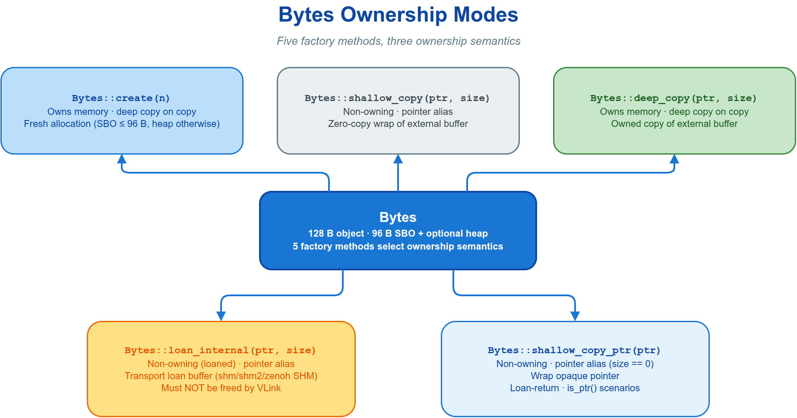

`vlink::Bytes` 是 VLink 的核心数据载体：小数据直接内联在对象内部，避免堆分配；超出内联容量时才从内存池取块。它既可新建并拥有数据，也可零拷贝包装外部缓冲区。Bytes 在序列化系统中的角色见 [消息序列化](03-serialization.md)。

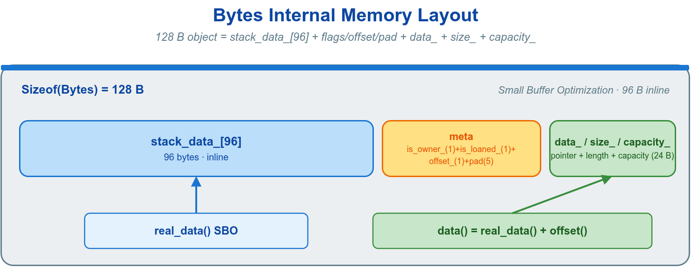

### 8.3.1 所有权模型

构造方式决定所有权与复制语义。`Bytes` 的拷贝构造和拷贝赋值都会产生拥有数据的深拷贝；性能敏感路径传递已有对象时优先移动，明确需要零拷贝别名时使用 `shallow_copy`，仅在需要独立持有数据的副本时才用 `deep_copy`。

| 构造方式 | 是否拥有数据 | 复制语义 | 用途 |
| --- | --- | --- | --- |
| `Bytes::create(n)` | 是 | 拥有副本 | 新建并填充缓冲区 |
| `Bytes::shallow_copy(p, n)` | 否 | 指针别名 | 零拷贝包装外部缓冲区 |
| `Bytes::deep_copy(p, n)` | 是 | 拥有副本 | 持有外部数据的独立副本 |

### 8.3.2 高频接口

| 方法 | 语义 |
| --- | --- |
| `Bytes::create(size, offset=0)` | 分配缓冲区，可预留前缀字节 |
| `Bytes::shallow_copy(data, size)` | 零拷贝包装外部缓冲区 |
| `Bytes::deep_copy(data, size)` | 拷贝外部数据并拥有 |
| 拷贝构造 / 拷贝赋值 | 深拷贝并拥有；传递时不可视为廉价共享 |
| `Bytes::from_string(str)` | 从字符串构造 |
| `data()` / `size()` / `empty()` | 访问指针、长度、是否为空 |
| `to_string()` / `to_string_view()` | 转字符串 / 视图 |
| `resize(n)` / `shrink_to(n)` / `clear()` | 调整大小 / 清空 |

```cpp
#include <vlink/base/bytes.h>

auto buf = vlink::Bytes::create(64);
std::memcpy(buf.data(), payload, 64);

auto view  = vlink::Bytes::shallow_copy(ext_ptr, ext_size);
auto owned = vlink::Bytes::deep_copy(ext_ptr, ext_size);
auto str_buf = vlink::Bytes::from_string("hello world");

for (uint8_t byte : buf) {
    process(byte);
}

std::string s = buf.to_string();
```

完整示例见 [`examples/base/bytes_basic/`](../examples/base/bytes_basic/)。

### 8.3.3 内置工具

Bytes 静态方法提供常用数据处理，避免引入额外依赖：

- **压缩**：`Bytes::compress_data(data, size, high_ratio=false)` / `uncompress_data(...)` / `is_compress_data(...)`。
- **Base64**：`Bytes::encode_to_base64(buf)` / `decode_from_base64(str)`。
- **CRC 校验**：`Bytes::get_crc_32(buf)`（与 ZIP/gzip/PNG 一致）、`get_crc_64(buf)`。
- **内存池**：`Bytes::init_memory_pool()` 在应用启动时调用一次，见 8.4。

```cpp
auto compressed = vlink::Bytes::compress_data(raw.data(), raw.size());

if (vlink::Bytes::is_compress_data(compressed.data(), compressed.size())) {
    auto original = vlink::Bytes::uncompress_data(compressed.data(), compressed.size());
}

std::string b64 = vlink::Bytes::encode_to_base64(buf);
uint32_t crc32  = vlink::Bytes::get_crc_32(buf);
```

---

## 🗄️ 8.4 内存池与 PMR 接入

`vlink::MemoryPool` 是 Bytes 的默认堆分配器，按尺寸分级复用空闲块以减少 `new`/`delete` 开销。常规用法是在应用启动时初始化一次，其余分配由 Bytes 自动经过该池。

```cpp
#include <vlink/base/memory_pool.h>

vlink::Bytes::init_memory_pool();       // 启动时调用一次
vlink::Bytes::release_memory_pool();    // 运行期可选回收完全空闲的块
```

- 池的容量分级由环境变量 `VLINK_MEMORY_LEVEL`（`0..9`，默认 `3`）选择；`VLINK_MEMORY_PREALLOC=1` 在启动时预分配。检测到重复并发争用后 free list 会自动分片，偶发单次锁冲突仍保留 primary 快路径。空分片每次跨分片转移的节点数由 `MemoryPool::Config::batch_size` 控制（默认 `16`）；全局默认配置可用 `VLINK_MEMORY_BATCH_SIZE` 覆盖。三者含义见 [环境变量](13-integration.md)。
- 经 `vlink::MemoryResource` 让 `std::pmr` 容器复用同一池：

```cpp
#include <memory_resource>
#include <vlink/base/memory_resource.h>

std::pmr::vector<int> v(&vlink::MemoryResource::global_instance());
v.reserve(1024);

auto sp = vlink::MemoryResource::make_shared<State>(/*x=*/42);
```

`MemoryResource::make_shared` 将对象与控制块在池内一次性分配，`make_unique` 仅在池内分配对象本体；两者均回退到全局池。需要隔离的私有池时，向构造函数传入 `MemoryPool::Config` 或 level（`MemoryResource(int level, bool prealloc=false)`）创建独立实例。显式 `Config` 的 `batch_size` 以字段值为准，不受环境变量覆盖。

---

## 🎯 8.5 Function 与 MoveFunction

`base/functional.h` 提供两个类型擦除的可调用包装器，作为热路径（消息回调、定时器、线程池任务）上 `std::function` 的替代：默认将一定容量内的闭包内联存储以避免堆分配，更大的闭包走内存池。承载更重闭包时使用大档别名 `LargeFunction` / `LargeMoveFunction`。

| 类型 | 拷贝语义 | 适用场景 |
| --- | --- | --- |
| `vlink::Function` | 可拷贝 | 需要被拷贝或共享的回调（默认选择） |
| `vlink::MoveFunction` | move-only | 闭包捕获 `unique_ptr` / `packaged_task` 等不可拷贝对象 |

```cpp
#include <vlink/base/functional.h>

vlink::Function<int(int, int)> add = [](int a, int b) { return a + b; };
int x = add(1, 2);

auto work = std::make_unique<HeavyWork>();
vlink::MoveFunction<void()> task = [w = std::move(work)]() { w->run(); };

vlink::LargeFunction<void()> jumbo = [arr = std::array<int, 50>{}]() { use(arr); };
```

边界条件：

- 空对象被调用时抛 `std::bad_function_call`，与 `std::function` 一致。
- 与 `std::function` 可双向隐式互转；`vlink::Function` 可移动转换为 `vlink::MoveFunction`。
- `MoveFunction::operator()` 为非 const；需要 const 调用语义时使用 `Function`。

---

## 🔁 8.6 MessageLoop 消息循环

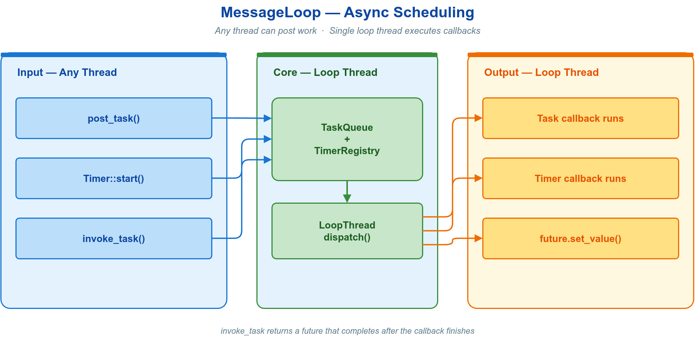

`vlink::MessageLoop` 是 VLink 的核心任务调度器，也是 Timer、Schedule 的执行基础。其语义是单线程串行事件循环：投递到同一 loop 的所有任务在同一线程顺序执行，因此回调内访问该 loop 的私有状态无需加锁。`post_task()` 自身线程安全，可从任意线程调用。

### 8.6.1 核心接口

| 方法 | 语义 |
| --- | --- |
| `async_run()` | 在后台线程启动循环；`run()` 在当前线程阻塞运行 |
| `post_task(cb)` | 投递任务到 loop 线程（fire-and-forget） |
| `invoke_task(fn, args...) -> future` | 投递并经 future 取返回值 |
| `quit(force=false)` / `wait_for_quit()` | 请求退出 / 等待退出完成 |
| `is_in_same_thread()` | 判断当前是否在 loop 线程，防止 `invoke_task` 死锁 |

```cpp
#include <vlink/base/message_loop.h>

vlink::MessageLoop loop;
loop.async_run();

loop.post_task([] { do_work(); });

std::string data = "sensor_data";
loop.post_task([data]() { process(data); });

loop.quit();
loop.wait_for_quit();
```

完整示例见 [`examples/base/message_loop_basic/`](../examples/base/message_loop_basic/)。

`MessageLoop` 和 `ThreadPool` 的 `invoke_task` 将实参复制或移动到任务存储，执行时移动这些实参；用 `std::ref` 显式借用。返回的 `std::future` 类型按实际调用推导。约束：不可在 loop 自身线程上对其返回的 future 调用 `.get()`——任务等待被执行，线程却等待任务完成，构成死锁。用 `is_in_same_thread()` 防护：

```cpp
if (!loop.is_in_same_thread()) {
    auto fut = loop.invoke_task([] { return get_state(); });
    auto state = fut.get();
} else {
    auto state = get_state();
}
```

### 8.6.2 与 Timer 集成

`Timer` 绑定到 `MessageLoop` 后，定时回调与普通任务共用同一线程，回调间无需同步：

```cpp
#include <vlink/base/timer.h>

vlink::MessageLoop loop;
loop.async_run();

vlink::Timer heartbeat(&loop, 1000, vlink::Timer::kInfinite, [&] {
    VLOG_I("heartbeat tick");
});
heartbeat.start();

vlink::Timer::call_once(&loop, 500, [] { VLOG_I("delayed init"); });
```

### 8.6.3 串行化通信回调

通信回调的执行线程随后端与模式而异；例如下列 `dds://` 回调通常来自后端 delivery thread，而 intra `#direct` 会在调用线程同步执行。需要固定业务线程时，可把普通临时消息复制后投递到自有 `MessageLoop` 串行处理：

```cpp
vlink::MessageLoop my_loop;
my_loop.async_run();

vlink::Subscriber<MyMsg> sub("dds://my/topic");
sub.listen([&](const MyMsg& msg) {
    auto copy = msg;
    my_loop.post_task([copy = std::move(copy)]() { process_message(copy); });
});
```

回调用法详见 [通信模型](02-communication.md)。

### 8.6.4 队列类型与入队策略

构造时可选队列类型；入队策略仅在有界队列已满时影响行为。

| 队列类型 | 特点 |
| --- | --- |
| `kNormalType` | 默认，FIFO 无优先级 |
| `kLockfreeType` | 无锁，适合多生产者多消费者、低竞争 |
| `kPriorityType` | 支持任务优先级（数值大者先执行） |

| 入队策略（队列满时） | 行为 |
| --- | --- |
| `kOptimizationStrategy` | 默认，重试至多 10 次（每次间隔 1ms）后丢弃一个可丢弃任务再入队 |
| `kPopStrategy` | 立即丢弃一个可丢弃任务并入队新任务 |
| `kBlockStrategy` | 普通/优先级队列等待容量、策略切换或退出通知；无锁队列持续重试 |

优先级循环用 `post_task_with_priority(cb, priority)`，priority 为必填参数（无默认值），取值自 `kLowestPriority` 至 `kHighestPriority`，常规任务约定使用优先级常量 `kNormalPriority`；其他队列类型忽略优先级。QoS 扩展中的 `Qos::Additions::Priority` 是独立于 MessageLoop 优先级的另一套配置，见 [QoS 配置](05-qos.md)。

单次提交显式指定 `TaskOverflowPolicy::kBlock` 时不响应 dispatcher 策略切换，仅在容量
释放、任务取消或 loop 退出时结束等待。

### 8.6.5 链式调度 exec_task

`exec_task()` 在 `post_task()` 基础上支持延迟、超时与链式延续回调，参数为 `Schedule::Config`（见 8.13）：

```cpp
loop.exec_task(vlink::Schedule::Config{/*delay_ms=*/100, 0, /*sched_to=*/0, /*exec_to=*/500},
               []() -> bool { return try_connect(); })
    .on_then([]() -> bool { subscribe_all(); return true; })
    .on_else([] { VLOG_W("connect failed, will retry"); })
    .on_execution_timeout([] { VLOG_W("connect timed out"); });
```

任务延迟到句柄提交时投递（临时句柄在表达式结束析构即提交），保证延续回调先于任务执行注册；存入具名变量的句柄须调用 `dispatch()` 立即投递。

### 8.6.6 线程安全约束

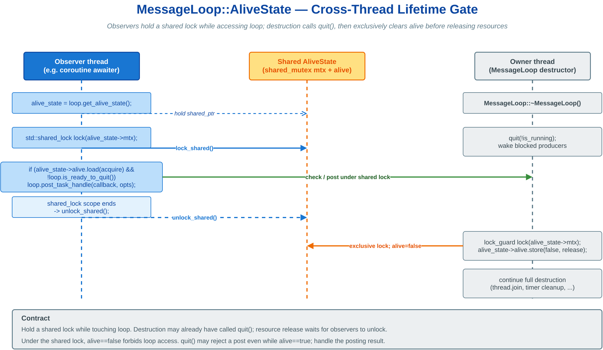

| 操作 | 线程安全 | 约束 |
| --- | --- | --- |
| `post_task` / `quit` | 是 | 可从任意线程并发调用 |
| `invoke_task` | 是 | 不可在同一 loop 线程上对返回 future 调 `.get()` |
| `run` / `async_run` | 启动互斥 | `run()` 在调用线程执行，`async_run()` 新建后台线程；已运行时再次启动返回 `false` |
| 多 loop 线程访问同一状态 | 否 | 需额外同步（mutex / 原子量） |

常见陷阱：

- **死锁**：参见 [8.6.1](#861-核心接口) 的 `is_in_same_thread()` 防护。
- **递归投递**：可在任务内 `post_task` 新任务，但不可在任务内 `wait_for_idle()` 等待自身。
- **长任务阻塞**：单线程下耗时任务会阻塞全部任务（含定时器）；耗时操作应下发到 `ThreadPool`，结果再 `post_task` 回来（见 [8.8](#-88-threadpool-与-multiloop-并行)）。

### 8.6.7 可追踪任务

`post_task()` 为 fire-and-forget。需要取消、等待或查询状态时使用 `post_task_handle()`，返回 `TaskHandle`，见 [8.9](#-89-可追踪任务与协作取消)。

---

## ⏱️ 8.7 定时器

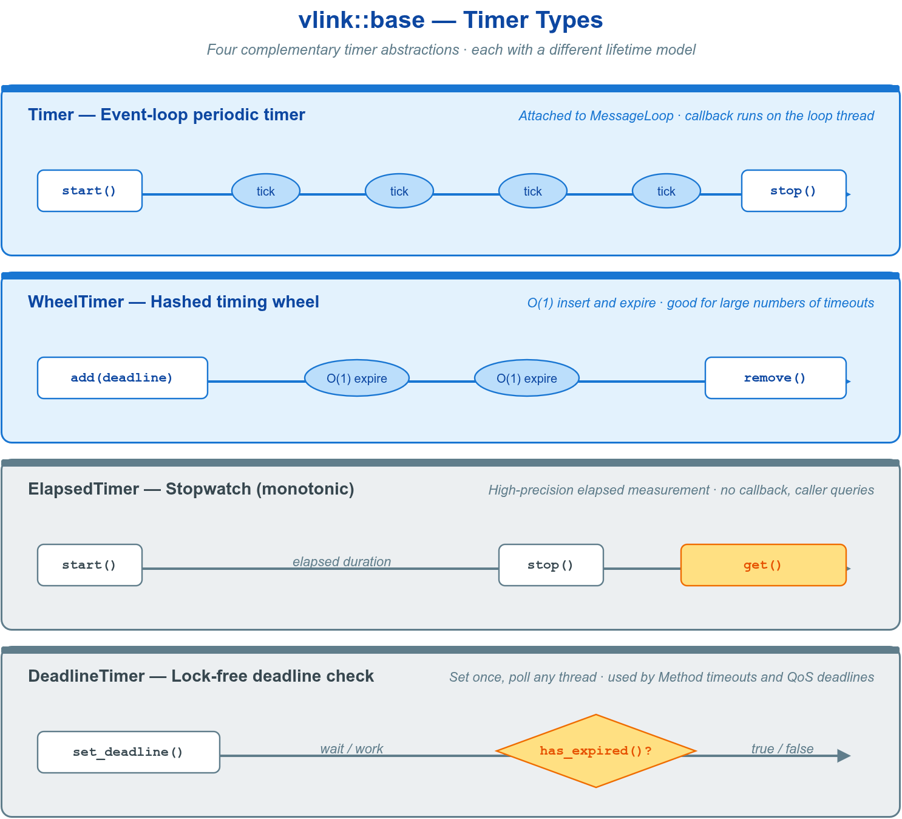

VLink 提供四种定时器，`Timer` 用于事件循环驱动的通用定时，其余三种针对特定场景。

### 8.7.1 Timer：事件循环定时器

`vlink::Timer` 绑定到 `MessageLoop`，回调在循环线程上串行触发，无需同步。

```cpp
#include <vlink/base/timer.h>
#include <vlink/base/message_loop.h>

vlink::MessageLoop loop;

vlink::Timer timer(&loop, 500, vlink::Timer::kInfinite, [] { VLOG_I("tick"); });
timer.start();

vlink::Timer count_down(&loop, 1000, /*loop_count=*/3, [] { VLOG_I("count down"); });
count_down.start();

vlink::Timer::call_once(&loop, 200, [] { VLOG_I("delayed once"); });

loop.run();
```

| 方法 | 语义 |
| --- | --- |
| `start()` / `stop()` / `restart()` | 启动 / 停止 / 重置后重启；活跃时 `start(cb)` 仅按 `set_callback(cb)` 的语义替换回调 |
| `set_interval(ms)` / `set_loop_count(n)` | 修改间隔 / 触发次数，对活跃定时器立即生效 |
| `set_callback(cb)` | 替换回调 |
| `set_strict(true)` | 严格模式：错过的 tick 立即补发 |
| `is_active()` / `get_invoke_count()` | 是否运行 / 已触发次数 |
| `Timer::call_once(loop, ms, cb)` | 静态方法，单次触发 |

`kInfinite`(-1) 表示无限重复。`interval_ms` 为 0 时被钳至最小保护间隔，避免空转。完整示例见 [`examples/base/timer/`](../examples/base/timer/)。

### 8.7.2 其余定时器

- **`WheelTimer`**（`base/wheel_timer.h`）：哈希时间轮，插入/删除均摊 O(1)，适合数十万级并发超时（连接保活、会话超时）。回调在内部工作线程触发，通常投递回 `MessageLoop` 处理。

```cpp
vlink::WheelTimer wheel(256, 10);
wheel.start();
auto key = wheel.add(1000, [](vlink::WheelTimer::Key k) { VLOG_I("timeout"); });
wheel.remove(key);
```

- **`ElapsedTimer`**（`base/elapsed_timer.h`）：高精度计时，实例支持单调时钟与 CPU 活跃时间，毫秒/微秒/纳秒精度（系统墙钟仅由静态 `get_sys_timestamp()` 提供）。

```cpp
vlink::ElapsedTimer t(vlink::ElapsedTimer::kMicro);
t.start();
do_work();
int64_t us = t.get();
```

- **`DeadlineTimer`**（`base/deadline_timer.h`）：保存绝对到期时间戳，`has_expired()` / `remaining_time()` 无锁，可多线程并发读。

```cpp
vlink::DeadlineTimer dt(200);
while (!dt.has_expired()) { process_events(); }
```

---

## ⚙️ 8.8 ThreadPool 与 MultiLoop 并行

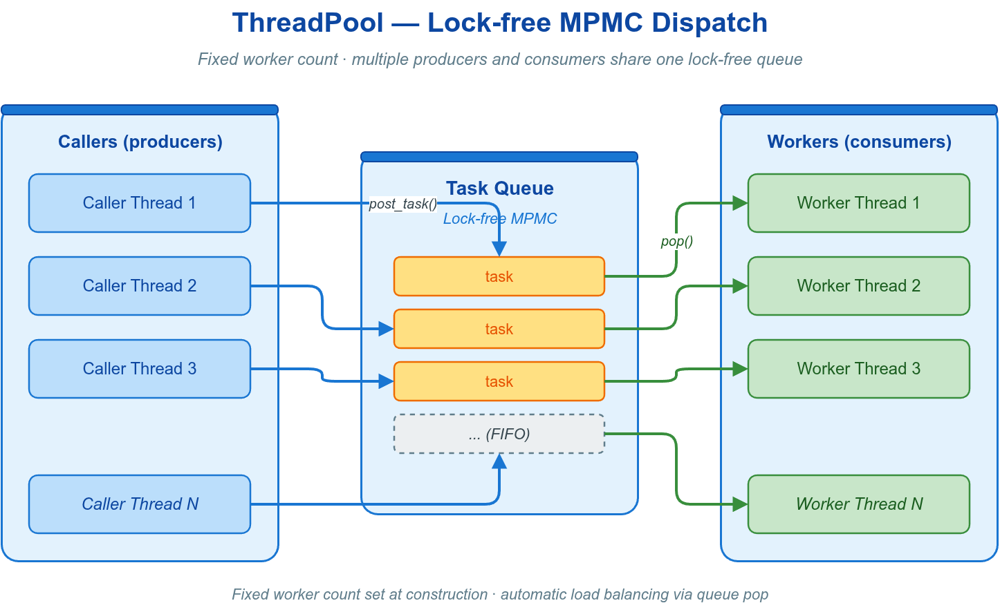

并行执行任务时使用 `ThreadPool`（纯计算并行）或 `MultiLoop`（兼需定时器与并行）。

### 8.8.1 ThreadPool

`vlink::ThreadPool` 维护固定数量工作线程并行执行任务，不含定时器，适合 CPU 密集型工作。

| 方法 | 语义 |
| --- | --- |
| `ThreadPool(n)` | 构造，指定线程数 |
| `post_task(cb)` | 投递任务 |
| `invoke_task(fn, args...) -> future` | 投递并取结果 |
| `shutdown()` | 关闭 |
| `is_in_work_thread()` | 判断是否在工作线程，防死锁 |

```cpp
#include <vlink/base/thread_pool.h>

vlink::ThreadPool pool(8);

pool.post_task([] { heavy_work(); });

auto fut = pool.invoke_task([]() -> int { return compute_answer(); });
int result = fut.get();

pool.shutdown();
```

与 `MessageLoop` 同理：不可在线程池工作线程内对 `invoke_task` 的 future 调 `.get()`，否则死锁；用 `is_in_work_thread()` 防护或改用 `post_task()`。`post_task_handle()` 返回 `TaskHandle`，语义与 MessageLoop 一致（见 8.9）。

典型模式是 CPU 密集任务下发到 `ThreadPool`，结果投递回 `MessageLoop` 串行更新：

```cpp
vlink::MessageLoop ui_loop;
vlink::ThreadPool  compute_pool(4);
ui_loop.async_run();

compute_pool.post_task([&] {
    auto result = heavy_compute();
    ui_loop.post_task([result]() { update_ui(result); });
});
```

### 8.8.2 MultiLoop

`vlink::MultiLoop` 继承 `MessageLoop`，保持相同的 `post_task` / `invoke_task` / `exec_task` 接口，但任务被转发到内部线程池并行执行，适合既需定时器又需多线程吞吐的场景（如传感器流水线）。

```cpp
#include <vlink/base/multi_loop.h>

vlink::MultiLoop loop(4);
loop.async_run();

for (int i = 0; i < 100; ++i) {
    loop.post_task([i]() { handle(i); });
}

loop.wait_for_idle(5000);
loop.quit();
loop.wait_for_quit(2000);
```

- N 个工作线程共享同一任务队列，任务执行顺序无保证。
- 共享状态需调用方自行保护（`SpinLock` / `mutex`）。
- 同 `ThreadPool`，不在任务回调内对 `invoke_task` 的 future 同步等待，否则可能因线程池耗尽死锁。

### 8.8.3 三者对比

| 特性 | MessageLoop | ThreadPool | MultiLoop |
| --- | --- | --- | --- |
| 执行模型 | 单线程串行 | 固定线程池并行 | 事件循环 + 线程池并行 |
| 任务顺序 | `kNormalType` 为 FIFO；`kPriorityType` 按优先级、同优先级按序 | 无保证 | 无保证 |
| 定时器 | 支持 | 不支持 | 支持（继承） |
| 适用场景 | 有序任务派发 | 纯计算并行 | 兼需定时器与并行 |

---

## 🧵 8.9 可追踪任务与协作取消

`post_task()` 为 fire-and-forget。需要取消、等待或查询状态时使用可追踪变体 `post_task_handle()`，返回 `TaskHandle`；配合 `CancellationSource` 可成组取消。

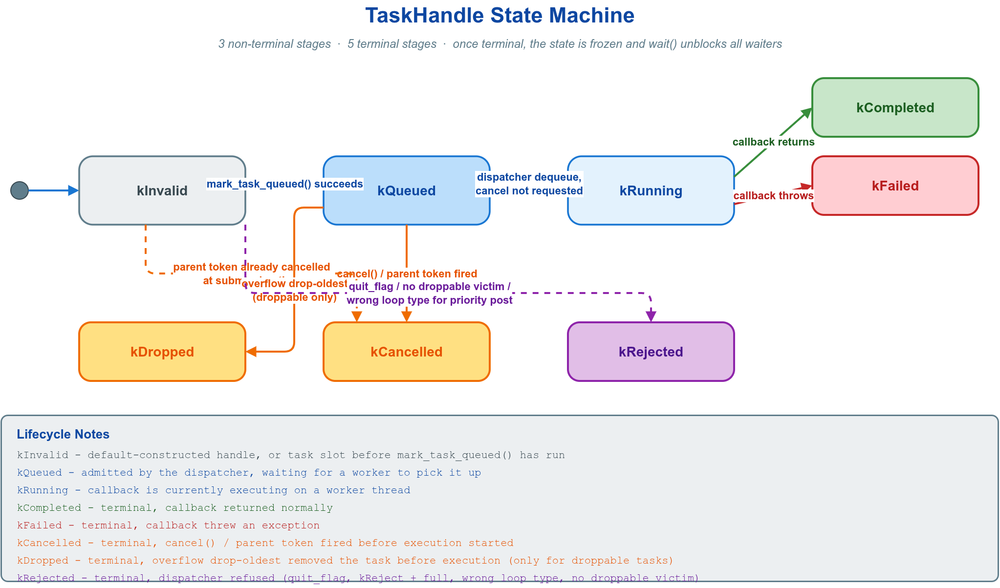

### 8.9.1 TaskHandle

```cpp
#include <vlink/base/cancellation.h>
#include <vlink/base/message_loop.h>
#include <vlink/base/task_handle.h>

vlink::MessageLoop loop;
loop.async_run();

auto h = loop.post_task_handle([] { heavy(); });
h.wait();
assert(h.state() == vlink::TaskExecutionState::kCompleted);

vlink::CancellationSource parent;
vlink::PostTaskOptions opts;
opts.cancellation_token = parent.token();
auto h2 = loop.post_task_handle([token = opts.cancellation_token] {
    while (!token.is_cancellation_requested()) { do_unit(); }
}, opts);

h2.cancel();
if (!h2.wait(/*timeout_ms=*/500)) {
    VLOG_W("task did not finish in 500ms");
}
```

`TaskExecutionState` 转移：`kQueued` → `kRunning` → 终态之一（`kCompleted` 正常返回 / `kCancelled` 被取消 / `kDropped` 溢出丢弃 / `kRejected` 拒收 / `kFailed` 抛异常）。

`PostTaskOptions` 字段：

| 字段 | 取值 |
| --- | --- |
| `overflow_policy` | `kUseDispatcherStrategy`（默认） / `kReject` / `kBlock` |
| `drop_policy` | `kDroppable`（默认） / `kProtected`（永不被溢出丢弃） |
| `cancellation_token` | 父级取消 token |

边界条件：句柄析构不会取消任务，dispatcher 持续执行至终态。`kLockfreeType` 队列不追踪 `kProtected`，要保护任务不被溢出丢弃须使用 `kNormalType` / `kPriorityType`。

### 8.9.2 协作取消

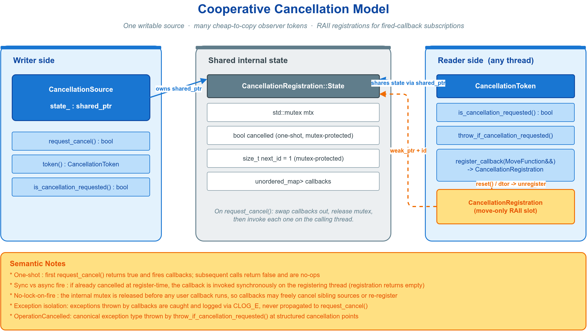

协作取消基于写端/观察者模型：写端持 `CancellationSource` 调用 `request_cancel()`；工作任务持由同一 source 派生的 `CancellationToken`（轻量、可拷贝、可跨线程），经轮询或回调响应取消。

| 类型 | 角色 |
| --- | --- |
| `CancellationSource` | 写端，发出取消请求（副本共享同一状态） |
| `CancellationToken` | 只读观察者，可轮询、可注册回调 |
| `CancellationRegistration` | RAII 槽，持有一个已注册回调 |
| `Exception::OperationCancelled` | 协作取消的规范化异常类型 |

```cpp
#include <vlink/base/cancellation.h>

vlink::CancellationSource source;
auto token = source.token();

auto reg = token.register_callback([] { VLOG_I("cancellation observed"); });

std::thread worker([token]() {
    while (!token.is_cancellation_requested()) {
        token.throw_if_cancellation_requested();
        do_unit_of_work();
    }
});

source.request_cancel();
worker.join();
```

成组取消（一个 source 派生多个 token）：

```cpp
vlink::CancellationSource group;
for (int i = 0; i < 8; ++i) {
    vlink::PostTaskOptions opts;
    opts.cancellation_token = group.token();
    pool.post_task_handle([t = opts.cancellation_token, i] {
        while (!t.is_cancellation_requested()) { work(i); }
    }, opts);
}

if (some_global_failure) {
    group.request_cancel();
}
```

语义约束：

- `request_cancel()` 一次性触发：首次返回 `true` 并触发全部回调，后续返回 `false`。
- 注册回调时 token 已取消，则回调在 `register_callback` 内同步执行。
- 回调抛出的异常被捕获并记日志，不向外传播。
- `Exception::OperationCancelled`（`what()` 固定为 `"vlink operation cancelled"`）专表协作取消已被观察，通用错误应使用 `Exception::RuntimeError`。

---

## 🚀 8.10 Process 子进程管理

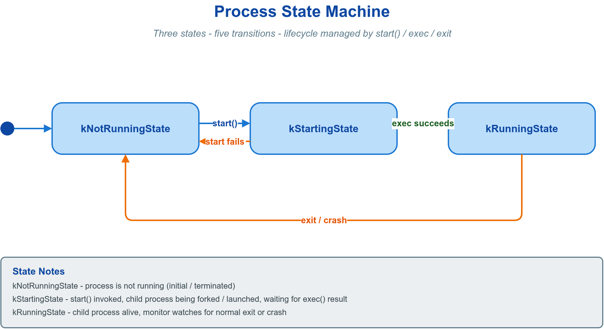

`vlink::Process` 是跨平台子进程管理类，接口风格参照 Qt `QProcess`，用于启动、监控、通信与终止外部程序，支持 stdout/stderr 管道捕获、stdin 写入与异步回调，覆盖 Linux、macOS、Windows、QNX。

### 8.10.1 核心接口

| 方法 | 语义 |
| --- | --- |
| `start(program, args)` | 异步启动子进程 |
| `start_command(cmdline)` | 用完整命令行字符串启动 |
| `wait_for_started/finished/ready_read(ms)` | 阻塞等待（默认 3000ms，`kInfinite` 为无限） |
| `read_all_output(str)` / `read_all_error(str)` | 读取全部 stdout / stderr |
| `read_line_stdout(line)` / `can_read_line_stdout()` | 按行读取 stdout |
| `write(str)` / `close_write_channel()` | 写入 stdin / 关闭写通道 |
| `terminate()` / `kill()` / `close(force)` | 优雅终止 / 强制结束 / 关闭 |
| `get_state()` / `is_running()` / `get_exit_code()` | 状态查询 |
| `register_finished_callback(cb)` 等 | 注册异步回调（建议在 `start()` 前完成以避免竞态） |
| `Process::execute(prog, args, ms)` | 静态：同步执行并返回退出码 |
| `Process::start_detached(prog, args)` | 静态：启动完全分离的子进程 |

I/O 通道模式（`set_process_mode`）共五种：默认 `kSeparateMode`（stdout/stderr 各自缓冲）、`kMergedMode`（stderr 并入 stdout 管道）、`kForwardedMode`（stdout/stderr 均继承父进程，不捕获）、`kForwardedOutputMode`（stdout 继承父进程、stderr 捕获）、`kForwardedErrorMode`（stdout 捕获、stderr 继承父进程）。回调在内部监控线程触发，访问共享数据须注意线程安全。`Process` 不可拷贝、不可移动。

### 8.10.2 捕获子进程输出

```cpp
#include <vlink/base/process.h>

vlink::Process proc;
proc.set_process_mode(vlink::Process::kSeparateMode);

proc.start("/bin/echo", {"hello", "vlink"});
proc.wait_for_finished(3000);

std::string output;
proc.read_all_output(output);
```

### 8.10.3 异步监听并写入 stdin

```cpp
vlink::Process proc;
proc.set_process_mode(vlink::Process::kSeparateMode);

proc.register_ready_read_stdout_callback([&proc] {
    std::string line;
    while (proc.can_read_line_stdout()) {
        proc.read_line_stdout(line);
        VLOG_I("stdout: ", line);
    }
});
proc.register_finished_callback([](int code, vlink::Process::ExitStatus status) {
    MLOG_I("process finished, exit code: {}", code);
});

proc.start("/bin/cat");
proc.wait_for_started(3000);
proc.write("hello from parent\n");
proc.close_write_channel();
proc.wait_for_finished(3000);
```

---

## 🔧 8.11 并发工具

需要在多线程间互斥、传输数据、复用对象或计数通知时，从下表选取。

| 组件 | 场景 |
| --- | --- |
| `ObjectPool` | 复用对象、减少热路径堆分配 |
| `MpmcQueue` | 固定容量、无锁、高吞吐的线程间数据传输 |
| `SpinLock` | 极短临界区（纳秒级）互斥 |
| `Semaphore` | 进程内计数信号量、限流 |
| `ConditionVariable` | 条件等待（单调时钟，规避时钟跳变） |

### 8.11.1 ObjectPool 对象池

`ObjectPool<T>` 线程安全地回收并重用对象，减少堆分配。必须经 `std::make_shared` 创建，因内部归还逻辑依赖指向池本身的 `weak_ptr`。

| 获取方式 | 返回 | 自动归还 | 场景 |
| --- | --- | --- | --- |
| `get()` | `unique_ptr<T, PoolDeleter>` | 是 | 单一所有权（默认） |
| `get_shared()` | `shared_ptr<T>` | 是 | 共享所有权 |
| `borrow()` | `T*`（裸指针） | 否 | 手动控制归还时机 |

```cpp
#include <vlink/base/object_pool.h>

auto pool = std::make_shared<vlink::ObjectPool<Buffer>>(
    [] { return std::make_unique<Buffer>(4096); },
    /*initial=*/4, /*max=*/16,
    [](Buffer& b) { b.clear(); },
    vlink::ObjectPool<Buffer>::kPolicyRelease);

{
    auto buf = pool->get();
    buf->data[0] = 0x42;
}

Buffer* raw = pool->borrow();
raw->data[0] = 0xFF;
pool->give_back(raw);
```

边界条件：池耗尽（全部对象借出且达到 `max_size`）时 `get()` 抛 `std::runtime_error`，应设置合理上限并准备降级路径，经 `pool->stats()` 监控。`Policy` 控制获取/归还时是否调用重置回调（`kPolicyNone` / `kPolicyRelease`（默认） / `kPolicyAcquire` / `kPolicyBoth`）。

### 8.11.2 MpmcQueue 无锁队列

`MpmcQueue<T>` 是固定容量、无锁、缓存行对齐的多生产者多消费者环形队列。

```cpp
#include <vlink/base/mpmc_queue.h>

vlink::MpmcQueue<int> q(1024);

q.push(42);
int val;
q.pop(val);

bool ok = q.try_push(42);
ok = q.try_pop(val);

size_t cap = q.capacity();
size_t sz  = q.size();
bool   e   = q.empty();
q.notify_to_quit();
```

容量须不小于 1（否则构造抛 `std::invalid_argument`），经验值取预期突发峰值的 2 至 4 倍。默认的 `push` / `pop` 以自旋方式阻塞；需要条件变量唤醒式的阻塞收发时，按 `kConditionBehavior` 行为调用（`push<vlink::MpmcQueue<int>::kConditionBehavior>(...)` 配合 `wait_not_empty()` / `wait_not_full()`），否则 cv 通知是纯开销。

### 8.11.3 SpinLock 自旋锁

`SpinLock` 适用于极短临界区（数条指令，如更新关联变量或计数器），此时 `std::mutex` 的上下文切换开销大于等待本身。临界区含 I/O 或耗时不确定时不应使用。

```cpp
#include <vlink/base/spin_lock.h>

vlink::SpinLock lock;

{
    vlink::SpinLockGuard guard(lock);
    ++counter;
}

{
    std::lock_guard guard(lock);
}
```

| 指标 | SpinLock | std::mutex |
| --- | --- | --- |
| 等待方式 | 用户态自旋 | 内核态阻塞 |
| 适合时长 | 极短（纳秒至微秒） | 任意 |
| 上下文切换 | 无 | 有 |
| 递归 | 死锁 | 可用 recursive_mutex |

### 8.11.4 Semaphore 信号量

进程内计数信号量，采用 P/V（acquire/release）语义，内部使用单调时钟以规避系统时钟跳变。

| 方法 | 语义 |
| --- | --- |
| `Semaphore(n)` | 构造，初始计数 n |
| `acquire(n, ms)` | 获取 n 个许可，最多等待 ms 毫秒（`kInfinite` 无限） |
| `release(n)` | 释放 n 个许可 |
| `reset(true)` | 恢复初始计数并中断所有等待者（`acquire` 返回 false） |

```cpp
#include <vlink/base/semaphore.h>

vlink::Semaphore sem(0);

bool ok = sem.acquire(1, 100);
sem.release(1);

sem.reset(true);
```

`release()` 内部获取 mutex，非 async-signal-safe，不可在信号处理函数中调用。跨进程同步使用 `SysSemaphore`（见 8.12）。

### 8.11.5 ConditionVariable 单调时钟条件变量

`vlink::ConditionVariable` 是 `std::condition_variable` 的就地替换，内部锁定 `CLOCK_MONOTONIC`，避免系统时钟被调整时 `wait_for`/`wait_until` 提前唤醒或永久等待。接口与标准库一致（`wait` / `wait_for` / `wait_until` / `notify_one` / `notify_all`），非 POSIX 平台直接别名到标准库版本。

```cpp
#include <mutex>
#include <vlink/base/condition_variable.h>

std::mutex mtx;
vlink::ConditionVariable cv;
bool ready = false;

{
    std::unique_lock lock(mtx);
    cv.wait_for(lock, std::chrono::milliseconds(200), [&] { return ready; });
}

{
    std::lock_guard lock(mtx);
    ready = true;
}
cv.notify_one();
```

配合 `SpinLock` 等非 `std::mutex` 锁时使用 `ConditionVariableAny`。

### 8.11.6 选型决策

```
需要任务调度？
  +-- 串行执行 ---------> MessageLoop
  +-- 并行 + 定时器 ----> MultiLoop
  +-- 纯并行计算 -------> ThreadPool

需要线程间数据传输？
  +-- 固定容量 + 高吞吐 ----> MpmcQueue
  +-- 对象重用 -------------> ObjectPool

需要互斥保护？
  +-- 极短临界区 -----------> SpinLock
  +-- 一般临界区 -----------> std::mutex
  +-- 条件等待 -------------> vlink::ConditionVariable

需要信号通知 / 限流？
  +-------------------------> Semaphore
```

自定义并发数据结构时，将不同线程频繁写入的原子变量按缓存行对齐分布，规避伪共享。

---

## 🔗 8.12 跨进程 IPC

`base` 层提供两个直接封装操作系统 IPC 的类，用于跨进程同步与数据共享，不依赖任何第三方库。

| 类 | 头文件 | 功能 |
| --- | --- | --- |
| `SysSemaphore` | `base/sys_semaphore.h` | 命名计数信号量 |
| `SysSharemem` | `base/sys_sharemem.h` | 命名共享内存区域 |

### 8.12.1 SysSemaphore

命名的跨进程计数信号量，多个进程以相同名称访问同一内核对象。

```cpp
class SysSemaphore final {
 public:
  static constexpr int kInfinite{-1};
  explicit SysSemaphore(size_t count = 0);
  bool attach(const std::string& name);
  bool detach(bool force = true);
  bool acquire(size_t n = 1, int timeout_ms = kInfinite);
  void release(size_t n = 1);
  bool   is_attached() const;
  size_t get_count()   const;
};
```

POSIX 上名称须以 `/` 开头（如 `/vlink_ready`）。`timeout_ms=0` 为非阻塞尝试。析构默认 `detach(false)`，仅关闭句柄而不删除内核对象。

### 8.12.2 SysSharemem

命名共享内存：`create()` 分配并映射新区域，`attach()` 仅映射已存在的区域，实现零拷贝数据共享。

```cpp
class SysSharemem final {
 public:
  enum Mode : uint8_t { kReadOnly = 0, kReadWrite = 1 };
  bool create(const std::string& name, size_t size, Mode mode = kReadWrite);
  bool attach(const std::string& name, Mode mode = kReadWrite);
  bool detach(bool force = true);
  void*       data();
  const void* data() const;
  size_t      size() const;
};
```

`kReadOnly` 映射上写入未定义（`data()` 在只读模式返回 `nullptr`）。共享内存本身不带同步语义，须配合 `SysSemaphore` 使用。受支持的 POSIX/Windows 后端会对 `create()` 新建区域零初始化。

### 8.12.3 配对示例

```cpp
#include <vlink/base/sys_semaphore.h>
#include <vlink/base/sys_sharemem.h>

struct SharedMessage { uint32_t seq; uint32_t length; char payload[256]; };

vlink::SysSharemem shm;
shm.create("/vlink_demo_shm", sizeof(SharedMessage));

vlink::SysSemaphore sem(0);
sem.attach("/vlink_demo_sem");

auto* msg = static_cast<SharedMessage*>(shm.data());
msg->seq = 1;
sem.release();

vlink::SysSharemem shm2;
shm2.attach("/vlink_demo_shm", vlink::SysSharemem::kReadOnly);
vlink::SysSemaphore sem2;
sem2.attach("/vlink_demo_sem");

if (sem2.acquire(1, 5000)) {
    const vlink::SysSharemem& ro = shm2;  // 只读模式须经 const data() 取指针
    const auto* m = static_cast<const SharedMessage*>(ro.data());
    MLOG_I("received seq={}", m->seq);
}
```

这是最底层的 OS IPC 原语。需要完整的发布/订阅与零拷贝传输时，直接使用 VLink 的 `shm://` 传输后端（见 [传输后端与 URL](04-transport.md)），其内部即建立在此类原语之上。POSIX 命名对象在进程崩溃后不会自动删除，启动时应检查并清理残留。

---

## 🗂️ 8.13 任务调度

### 8.13.1 Schedule 调度包装

`vlink::Schedule` 不单独构造，而经 `MessageLoop::exec_task()` 使用：将回调包入 `Config`，支持延迟、优先级、调度超时与执行超时，并返回 RAII 句柄链式注册延续回调。任务在句柄提交时才投递（临时句柄在表达式结束析构即提交，或显式调用 `dispatch()`），从而保证所有延续回调先于任务执行注册完成；存入具名变量的句柄须调用 `dispatch()` 立即投递。

| `Config` 字段 | 含义 |
| --- | --- |
| `delay_ms` | 任务发布前的延迟 |
| `priority` | 调度优先级（`kPriorityType` 循环） |
| `schedule_timeout_ms` | 未在此时间内启动则触发超时 |
| `execution_timeout_ms` | 执行超过此时间则触发超时 |

```cpp
#include <vlink/base/schedule.h>

loop.exec_task(vlink::Schedule::Config{/*delay_ms=*/100, 0, 0, /*exec_to=*/500},
               [] { expensive_op(); })
    .on_execution_timeout([] { VLOG_W("task took too long"); })
    .on_catch([](std::exception& e) { VLOG_E("exception: ", e.what()); });

loop.exec_task(vlink::Schedule::Config{},
               []() -> bool { return try_connect(); })
    .on_then([]() -> bool { start_session(); return true; })
    .on_else([] { retry_later(); });
```

### 8.13.2 GraphTask 有向无环图调度

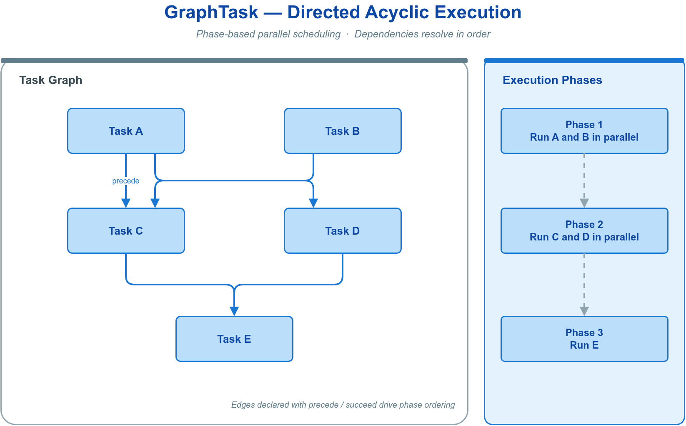

`vlink::GraphTask` 实现 DAG 任务调度：每个节点经 `precede()` / `succeed()` 声明依赖，再 `execute()` 提交到任意兼容引擎（`MessageLoop` / `MultiLoop` / `ThreadPool`）。

| 工厂方法 | 回调签名 | 用途 |
| --- | --- | --- |
| `create(name, cb)` | `void()` | 普通工作任务 |
| `create_condition(name, cb, n)` | `int()` | 条件分支（返回值选择分支） |

依赖声明：`A -- > B` 等价 `A->precede(B)`（A 先执行、B 后执行）；`A -- < B` 等价 `A->succeed(B)`。添加边前进行环路预检，成环则拒绝并记日志。

```cpp
#include <vlink/base/graph_task.h>
#include <vlink/base/message_loop.h>

vlink::MessageLoop engine;
engine.async_run();

auto load  = vlink::GraphTask::create("load",  [] { load_data();  });
auto proc  = vlink::GraphTask::create("proc",  [] { process();    });
auto save  = vlink::GraphTask::create("save",  [] { save_data();  });
auto clean = vlink::GraphTask::create("clean", [] { cleanup();    });

load -- > proc -- > save;
proc -- > clean;

load->execute(&engine);

std::string dot = load->export_to_dot();
```

执行必须从根节点（无前驱）发起。执行策略：`kPolicyOnce`（默认，每次 execute 最多执行一次）、`kPolicyMultiple`、`kPolicyWaitAll`（等待所有前驱完成）。依赖满足时才投递就绪节点；支持优先级的引擎按节点优先级调度就绪任务，工作线程不会占位等待前驱。`kPolicyMultiple` 后继在前驱完成的线程内直接执行并继续向下游传播，不经引擎投递。条件返回值没有匹配分支时，包括负数，传播跳过状态。

---

## 📊 8.14 CPU 利用率测量

`vlink::CpuProfiler` 测量一段代码的 CPU 活跃时间占总墙钟时间的百分比，用于量化节点与操作的 CPU 利用率。

```cpp
#include <vlink/base/cpu_profiler.h>
#include <vlink/base/cpu_profiler_guard.h>

vlink::CpuProfiler profiler;

profiler.begin();
heavy_computation();
profiler.end();

double pct = profiler.get();
double reset_pct = profiler.restart();

void process_frame() {
    vlink::CpuProfilerGuard guard(&profiler);
    work();
}
```

`get()` 返回百分比（`0.0` 表示尚无数据；多核下若 begin/end 区间累计活跃时间超过墙钟时间，可能超过 `100`），`restart()` 取值后清零。`CpuProfilerGuard` 在构造时 `begin`、析构时 `end`，异常安全。

与通信节点集成：所有节点内部持有可选的 `CpuProfiler`，开启全局开关后自动采集，经 `Node::get_cpu_usage()` 取值，`-1.0` 表示未启用。

```cpp
vlink::Subscriber<SensorMsg> sub("dds://sensors/lidar");
double cpu = sub.get_cpu_usage();
```

全局开关由环境变量 `VLINK_PROFILER_ENABLE=1` 控制（首次读取后缓存，见 [环境变量](13-integration.md)）。节点集成细节见 [通信模型](02-communication.md)。热路径可先判 `CpuProfiler::is_global_enabled()` 再决定是否构造 Guard。

---

## 🆔 8.15 Uuid 唯一标识

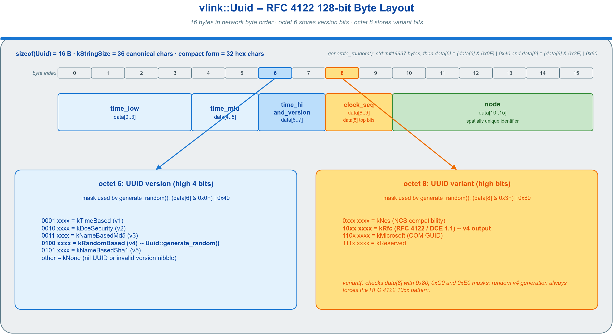

`vlink::Uuid` 是 RFC 4122 128 位唯一标识符值类型：可平凡复制、负载内联，提供 v4 随机生成及项目级随机字节/十六进制工具。

| 方法 | 语义 |
| --- | --- |
| `Uuid::generate_random()` | 生成 v4 随机 UUID |
| `id.to_string()` / `to_compact_string()` | 转规范 / 紧凑字符串 |
| `Uuid::from_string(s)` | 解析（接受规范/紧凑/带花括号形式），返回 `optional` |
| `Uuid::is_valid(s)` | 校验字符串 |
| `Uuid::random_bytes(n)` | 生成 n 字节随机数据 |
| `Uuid::random_hex(n)` | 生成随机十六进制串 |

```cpp
#include <vlink/base/uuid.h>

vlink::Uuid id = vlink::Uuid::generate_random();
std::string s = id.to_string();

auto parsed = vlink::Uuid::from_string("47ac10b8-58cc-4a3c-8c5b-0e778899aabb");
if (parsed) { use(*parsed); }

std::string token = vlink::Uuid::random_hex();
```

边界条件：`from_string` / `is_valid` 的 `const char*` 重载为 null-safe（传 `nullptr` 返回失败）。可注入 `std::mt19937` 引擎获得确定性结果，也可作为 `std::unordered_set` 的键。底层 `std::mt19937` 不是密码学安全随机源，`random_hex` / `random_bytes` 适用于短期会话标识、关联 ID 与 proxy auth-token，不适用于长期密钥——后者应使用 OpenSSL `RAND_bytes` 等 CSPRNG。完整签名见头文件 `base/uuid.h`。

---

## 🧬 8.16 Coroutine 协程

`vlink::Coroutine`（别名 `vlink::Co`）基于 C++20 stackless 协程。成功路径上的 `schedule` / `yield` / `delay_ms` / `await_future` / `await_graph` 会把恢复投递回目标 `MessageLoop`；若 loop 已关闭或恢复投递重试耗尽，失败恢复会在进程级 `FutureWaitLoop` helper thread 上执行，并由 `await_resume()` 抛出异常。因此正常业务段可依赖目标 loop 的串行性，但异常处理、析构清理若访问跨线程共享状态仍须同步。头文件 `<vlink/base/coroutine.h>`；构建需 `ENABLE_CXX_STD_20=ON` 且工具链同时声明 `__cpp_impl_coroutine` 与 `__cpp_lib_coroutine`（GCC 10+ / Clang 14+ / MSVC 19.x+），满足后框架自动启用协程支持。

### 8.16.1 任务定义与启动

```cpp
vlink::Co::Task<int> compute(vlink::MessageLoop& loop) {
    co_await vlink::Co::yield(loop);
    co_await vlink::Co::delay_ms(loop, 100);
    co_return 42;
}

vlink::MessageLoop loop;
loop.async_run();

auto t = compute(loop);
vlink::Co::co_spawn(loop, std::move(t), [](int v) { VLOG_I("done v=", v); });
```

- `co_await awaiter` 为唯一挂起点；`co_return value` 设置返回值并结束。
- `Task<T>`（亦写作 `Task<>` 表示 `Task<void>`）是协程返回句柄，可 `co_await`、可移动、不可拷贝。
- 协程参数会被拷贝进协程帧，捕获状态务必经函数参数传入；切勿把带捕获的协程 lambda 作为临时表达式直接传给 `co_spawn`（如 `co_spawn(loop, []()->Task<>{...}())`），lambda 在整表达式结束即析构，捕获引用会悬空。

### 8.16.2 Awaiter 与编排

| Awaiter | 语义 |
| --- | --- |
| `vlink::Co::schedule(loop)` | 切到指定 loop 线程继续执行 |
| `vlink::Co::yield(loop)` | 协作让出（等价同 loop 的 schedule） |
| `vlink::Co::delay_ms(loop, ms)` | 非阻塞睡眠 ms 毫秒 |
| `vlink::Co::await_future(loop, fut)` | 等待 `std::future<T>`，不在 loop 线程阻塞 `.get()` |
| `vlink::Co::await_graph(loop, graph)` | 等待 `GraphTask` DAG 全部完成 |

```cpp
vlink::Co::Task<void> orchestrate(vlink::MessageLoop& loop) {
    co_await vlink::Co::when_all(loop, make_tasks());
    size_t winner = co_await vlink::Co::when_any(loop, make_tasks());
    co_await vlink::Co::sequence(loop, make_tasks());
}
```

`await_future` 接收 `std::launch::deferred` 产生的 future 时，由共享工作线程池启动延迟计算，目标 loop 与 future 轮询线程继续处理其他任务。计算完成后按通常路径恢复协程；工作队列拒绝接收时抛出 `std::runtime_error`。

`Co::exec` 按值持有配置和回调，可保存返回的 Task 后再启动。已接受的任务在执行前被丢弃时，其 promise 随任务释放，等待不会因协程自身保留生产者而悬挂。

协程内异常沿 `co_await` 链向外传播，`co_spawn` 在顶层捕获并记日志。future 已就绪但目标 `MessageLoop` 已关闭时，恢复进入取消分支；外部提供的未就绪 future 仍须由其生产者完成。

---

## 📎 附录 A 低频/内部工具

下列组件多为内部或低频使用，需要时查阅头文件，本章不展开。

| 组件 | 头文件 | 功能 |
| --- | --- | --- |
| `Format` | `base/format.h` | 轻量 `{}` 占位符格式化器（`MLOG_*` 内部使用） |
| `FastStream` | `base/fast_stream.h` | 高性能输出流；`push()` 提供 Logger 使用的无 locale 快速拼接 |
| `TerminalStream` | `base/terminal_stream.h` | CLI 使用的线程安全、TTY 感知带缓冲 stdout 单例 |
| `Utils` | `base/utils.h` | 进程/线程/网络/信号等跨平台工具函数 |
| `Helpers` | `base/helpers.h` | 字符串/数字/哈希/转义等无状态工具 |
| `Quantize` | `base/quantize.h` | 线性量化/反量化（紧凑容器复用） |
| `Uint128` | `base/uint128.h` | 可移植 128 位无符号整数 |
| `CachedTimestamp` | `base/cached_timestamp.h` | 低开销线程安全格式化时间戳（Logger 内部使用） |
| `Plugin` | `base/plugin.h` | 类型安全的动态插件加载器 |
| `Exception` | `base/exception.h` | VLink 异常类型 |
| `LoggerPluginInterface` | `base/logger_plugin_interface.h` | 自定义日志后端纯虚接口 |

`Utils` 中较常用的函数：

```cpp
#include <vlink/base/utils.h>

std::string name = vlink::Utils::get_app_name();
int32_t pid      = vlink::Utils::get_pid();
vlink::Utils::set_thread_name("worker");
std::string val  = vlink::Utils::get_env("MY_VAR", "default");

vlink::Utils::register_terminate_signal([](int sig) { app.shutdown(); });
auto ipv4_list = vlink::Utils::get_all_ipv4_address(/*filter_available=*/true);
```

---

## 🔖 相关文档

- [03-serialization](03-serialization.md) —— Bytes 在序列化系统中的角色
- [02-communication](02-communication.md) —— 通信回调中如何使用 MessageLoop、节点与 CpuProfiler 的集成
- [04-transport](04-transport.md) —— `shm://` 等传输后端（建立在 IPC 原语之上）
- [05-qos](05-qos.md) —— QoS 优先级与 MessageLoop 优先级的关系
- [13-integration](13-integration.md) —— `VLINK_MEMORY_*` / `VLINK_PROFILER_ENABLE` 等环境变量
- [01-started](01-started.md) —— 配套示例（含 `examples/base/`）
