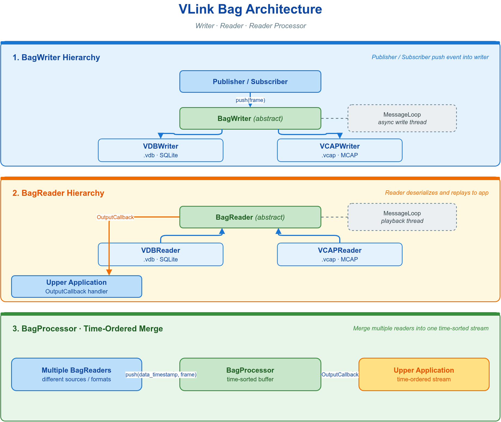
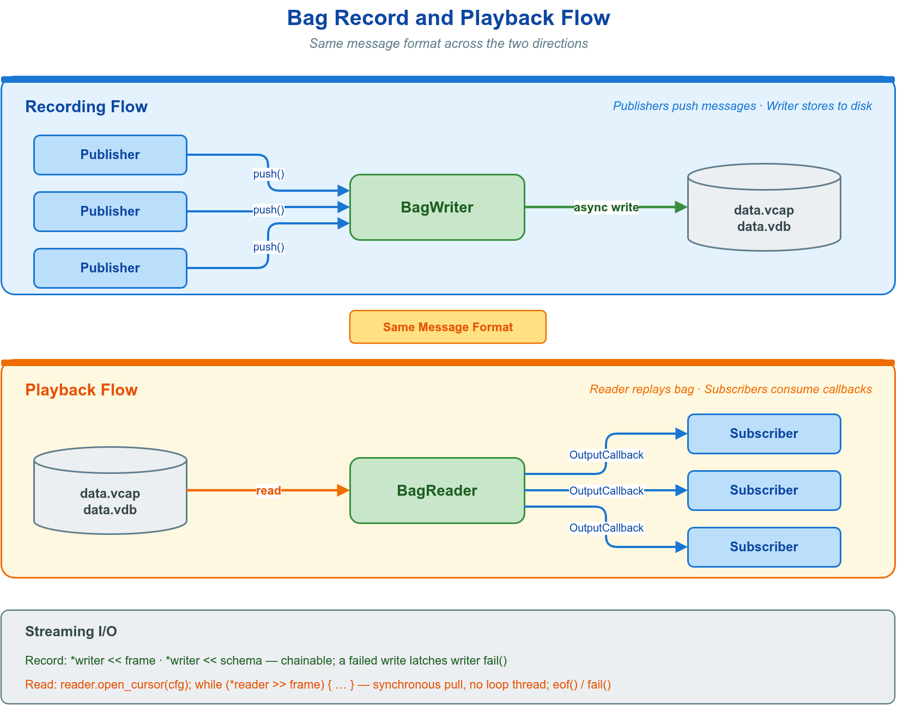

# 📹 9. 录制与回放

录制与回放将 VLink 的通信消息持久化到磁盘文件，并在离线时按原始时序或指定速率重放，面向调试复现、数据集采集、仿真回灌与离线分析等场景。它提供两套对称接口：写入端 `BagWriter` 与读取端 `BagReader`，二者均在独立后台线程运行，业务线程的写入与读取调用不被磁盘 I/O 阻塞。



本章先建立录制管线的数据模型与生命周期，再给出写入、回放、合并的接口与边界条件。命令行等价工具 `vlink-bag` 见 [10-cli-tools.md](10-cli-tools.md)，图形化回放器 `vlink-player` 见 [11-visualization.md](11-visualization.md)。

---

## 📐 9.1 概念与数据模型

录制管线的基本单元是 `Frame`：一条消息在写入与回放中流经的统一结构。写入端将序列化后的 payload 连同元数据填入 `Frame` 推入 `BagWriter`；回放端从文件按时间戳逐帧重建 `Frame` 并交给输出回调。

| `Frame` 字段 | 类型 | 写入端语义 | 回放端语义 |
| --- | --- | --- | --- |
| `timestamp` | `int64_t` | 微秒时间戳；`< 0` 由 writer 按内部时钟自动分配，`>= 0`（含 `0`）原样记录 | 由 reader 填为相对录制起点的微秒偏移 |
| `url` | `std::string` | 消息所属 topic URL，不得为空 | 经插件 URL 重映射后的回放 URL |
| `data` | `vlink::Bytes` | 序列化后的 payload | 浅视图，仅在回调内有效，需外带先复制 |
| `ser_type` | `std::string` | 序列化类型名（如 `"demo.proto.PointCloud"`），原样存盘 | 由 reader 从元数据回填 |
| `schema_type` | `vlink::SchemaType` | schema 家族：`kProtobuf` / `kFlatbuffers` / `kZeroCopy` / `kRaw` | 由 reader 从元数据回填 |
| `action_type` | `vlink::ActionType` | 消息动作，通常 `kPublish` | 原样回传 |

`ser_type` 标识 payload 的精确序列化类型，应用层据此选择解码器；`schema_type` 是供工具快速分派的粗粒度家族标签。两者关系与完整取值见 [03-serialization.md](03-serialization.md)。

写入与回放的生命周期均为"创建 → 启动后台线程 → 驱动数据 → 等待退出"：



| 阶段 | 录制 | 回放 |
| --- | --- | --- |
| 创建 | `BagWriter::create(path, cfg)` | `BagReader::create(path)` |
| 注册 | — | `register_output_callback(cb)` |
| 启动 | `async_run()` | `async_run()` |
| 驱动 | `push(frame)` | `play(cfg)` |
| 退出 | `quit()` + `wait_for_quit()` | `auto_quit` 自停 或 `stop()` / `quit()`，再 `wait_for_quit()` |

> **约束**：`async_run()` 必须在任何 `push()` 或 `play()` 之前调用——后台循环线程未启动时数据无处分派。

---

## 💾 9.2 存储格式选择

`create()` 按文件扩展名分派具体后端，更换格式仅需改扩展名；扩展名不在下表之内时 `create()` 返回空指针。两种格式共用同一套 `Config`、`push()`、`play()` 与 `register_output_callback()`，业务代码不区分后端。

| 扩展名 | 后端 | `kCompressAuto` 选用的编解码器 | 适用判据 |
| --- | --- | --- | --- |
| `.vdb` / `.vdbx` | SQLite 容器 | LZAV | 默认。读写快、占盘小，适合长时录制与回灌 |
| `.vcap` / `.vcapx` | MCAP 容器 | Zstandard | 需被 Foxglove Studio 直接打开可视化时（见 [§9.11](#-911-mcap-与-foxglove)） |

> 压缩默认关闭（`compress` 字段默认 `kCompressNone`）；上表第三列是把 `compress` 置为 `kCompressAuto` 后各后端实际选用的编解码器（见 [§9.4](#-94-录制配置)）。VDB 后端需编译时启用 `ENABLE_SQLITE`，MCAP 的 Zstandard 压缩需启用 `ENABLE_ZSTD`（二者默认均为 `ON`）。

---

## ✍️ 9.3 录制

最小录制流程为：创建 writer、启动后台线程、填充 `Frame` 推入。

```cpp
#include <vlink/extension/bag_writer.h>

auto writer = vlink::BagWriter::create("/data/recording.vdb");
writer->async_run();

vlink::Frame frame;
frame.timestamp   = -1;
frame.url         = "dds://sensors/lidar";
frame.ser_type    = "demo.proto.PointCloud";
frame.schema_type = vlink::SchemaType::kProtobuf;
frame.action_type = vlink::ActionType::kPublish;
frame.data        = payload;
writer->push(frame);
```

`push()` 将写任务入队，实际落盘发生在后台循环线程。其语义如下：

| 方法 | 语义 |
| --- | --- |
| `push(frame)` | 异步入队；返回分配的微秒时间戳，负值表示失败（如 `url` 为空） |
| `push(frame, /*immediate=*/true)` | 绕过队列，在调用线程同步写入并阻塞至落盘 |
| `*writer << frame` | 等价于 `push(frame, false)`，可链式；写失败时置位 `fail()` |

`push()` 线程安全，可直接在通信回调内调用。`immediate=true` 会阻塞到落盘，可能违反实时截止期，仅用于收尾或测试代码。

### 9.3.1 Schema 嵌入

录制 Protobuf / FlatBuffers 等带 schema 的消息时，可将 schema 描述符一并写入文件，供离线自省与可视化解析消息结构：

```cpp
vlink::SchemaData schema;
schema.name        = "sensors.LidarPoint";
schema.encoding    = "protobuf";
schema.schema_type = vlink::SchemaType::kProtobuf;
schema.data        = proto_file_descriptor_bytes;
writer->push_schema(schema);
```

亦可用 `register_schema_callback()` 注册解析器，在某 `ser_type` 首次出现时再懒加载其 schema。

---

## ⚙️ 9.4 录制配置

`Config` 控制压缩、文件分割与录制标签，未设字段保持默认。下表为高频字段，完整字段见 `bag_writer.h`。

```cpp
vlink::BagWriter::Config config;
config.compress      = vlink::BagWriter::kCompressAuto;
config.split_by_size = 1024LL * 1024 * 1024;
config.split_by_time = 60LL * 1000;
config.tag_name      = "test_run_001";

auto writer = vlink::BagWriter::create("/data/recording.vdb", config);
```

| 字段 | 默认 | 语义 |
| --- | --- | --- |
| `compress` | `kCompressNone` | `kCompressAuto` 由后端选压缩（VDB 用 LZAV、MCAP 用 Zstd）；`kCompressNone` 关闭 |
| `split_by_size` | 1 GiB | 按文件大小分割阈值（字节），`0` 关闭 |
| `split_by_time` | `0` | 按时间分割间隔（毫秒），`0` 关闭 |
| `tag_name` | 空 | 录制标签，写入文件头供检索 |

分割产生新文件时可注册回调获知文件名。第二参数 `before` 决定回调在新文件打开前还是后触发：

```cpp
writer->register_split_callback(
    [](int split_index, const std::string& split_filename) {
        VLOG_I("split #", split_index, " -> ", split_filename);
    },
    /*before=*/false);
```

---

## ▶️ 9.5 回放

最小回放流程为：创建 reader、注册输出回调、启动后台线程、调用 `play(cfg)`。

```cpp
#include <vlink/extension/bag_reader.h>

auto reader = vlink::BagReader::create("/data/recording.vdb");

reader->register_output_callback(
    [](const vlink::Frame& frame) {
        VLOG_I("ts=", frame.timestamp, " url=", frame.url,
               " size=", frame.data.size());
    });

reader->async_run();

vlink::BagReader::Config cfg;
cfg.rate      = 1.0;
cfg.times     = 1;
cfg.auto_quit = true;   // 播完后停止后台循环线程，使 wait_for_quit() 返回
reader->play(cfg);

reader->wait_for_quit();
```

> **约束**：`wait_for_quit()` 仅在循环线程退出后返回。一次性回放须置 `cfg.auto_quit = true`，否则播完后线程继续运行、`wait_for_quit()` 永不返回；常驻回放器则不设此标志，改由 `stop()` / `quit()` 收尾。

输出回调在 reader 的后台线程触发；reader 自动从文件元数据回填 `frame.ser_type` / `schema_type`，应用层据此选择反序列化方式（`frame.data` 的浅视图语义见 [§9.1](#-91-概念与数据模型) `Frame` 表）。

除输出回调外，可注册状态、就绪与完成回调：

| 回调 | 触发时机 | 入参 |
| --- | --- | --- |
| `register_output_callback(cb)` | 每回放一帧 | `const Frame&` |
| `register_status_callback(cb)` | 状态变迁 | `Status`（`kStopped` / `kPaused` / `kPlaying`） |
| `register_ready_callback(cb)` | 文件打开并索引完成 | 无 |
| `register_finish_callback(cb)` | 回放会话结束 | `bool is_interrupted` |

---

## 🎚️ 9.6 回放参数与控制

`play()` 接收 `Config`，常用字段如下：

| 字段 | 默认 | 语义 |
| --- | --- | --- |
| `rate` | `1.0` | 速率倍数，`2.0` 加速、`0.5` 慢放 |
| `times` | `1` | 循环次数；`<= 0`（含 `vlink::BagReader::kInfinite`，其值为 `-1`）表示无限循环 |
| `begin_time` / `end_time` | `0` / `0` | 回放时间窗（毫秒，相对录制起点），`0` 表示从头 / 到尾 |
| `filter_urls` | 空 | URL 白名单，空集合表示回放全部 |
| `auto_quit` | `false` | 播完后停止后台循环线程 |

```cpp
vlink::BagReader::Config cfg;
cfg.rate        = 2.0;
cfg.times       = vlink::BagReader::kInfinite;
cfg.begin_time  = 10 * 1000LL;
cfg.end_time    = 30 * 1000LL;
cfg.filter_urls = {"dds://sensors/lidar"};
cfg.auto_quit   = true;
reader->play(cfg);
```

回放控制方法作用于运行中的 reader：

| 方法 | 语义 |
| --- | --- |
| `pause()` / `resume()` | 暂停 / 继续 |
| `pause_to_next()` | 单步：发一帧后再次暂停 |
| `jump(begin_time, rate, times, force_to_play)` | 跳转到指定时间戳（毫秒）并应用新参数 |
| `stop()` | 中止会话并回退到起点 |
| `get_status()` / `get_timestamp()` | 查询当前状态 / 当前时间戳 |

文件损坏时可异步修复，三者均返回 `std::future<bool>`：`check()` 校验完整性、`reindex()` 重建索引、`fix(/*rebuild=*/false)` 修复（`true` 为从头重建）。

---

## ⏩ 9.7 游标顺序读取

除 `play()` 的定时回放外，`BagReader` 另提供一条**同步顺序读取**通道：游标。它按录制顺序逐帧把数据交还调用线程，**无后台线程、无帧间延时**，也不依赖 `async_run()` / `play()`，适合离线批处理、转码、抽帧统计等不需要按真实时序节流的场景。

```cpp
auto reader = vlink::BagReader::create("/data/recording.vdb");

vlink::BagReader::Config cfg;
cfg.begin_time  = 10 * 1000LL;
cfg.end_time    = 30 * 1000LL;
cfg.filter_urls = {"dds://sensors/lidar"};
reader->open_cursor(cfg);            // 也可用无参 open_cursor() 全量读取

vlink::Frame frame;
while (*reader >> frame) {           // 等价于 while (reader->read_next(frame))
    VLOG_I("ts=", frame.timestamp, " url=", frame.url,
           " size=", frame.data.size());
}
```

| 方法 | 语义 |
| --- | --- |
| `open_cursor(config)` | 按 `config` 打开（或重置）游标；成功返回 `true`，打开失败置位 `fail()` 并返回 `false` |
| `open_cursor()` | 等价于以默认 `Config` 打开，全量、不过滤、按录制顺序遍历 |
| `read_next(out)` | 读下一帧填入 `out`；到末尾置位 `eof()`、出错置位 `fail()`，二者均返回 `false` |
| `*reader >> frame` | `read_next()` 的流式别名，返回 `*this`，可 `while (reader >> frame)` |
| `eof()` / `fail()` | 是否已到文件末尾 / 上次游标操作是否失败 |
| `operator bool()` | 游标是否仍可读（未到末尾且未失败），供流式循环判停 |

`read_next()` / `operator>>` 在首次调用时会自动以默认 `Config` 懒打开游标，因此仅在需要过滤或设置时间窗时才必须显式 `open_cursor()`；再次调用 `open_cursor()` 会重绕游标、重新套用 `config` 并清除 `eof()` / `fail()` 状态。

> **行为约束**：游标仅 `Config::filter_urls` 与 `begin_time` / `end_time` 时间窗生效，`rate` / `times` / `auto_*` / `skip_blank` 等定时回放参数一律被忽略；已绑定的 `BagPluginInterface` 的 URL 重映射与排除仍然生效，但其 `on_read()` 拦截（仅回放路径触发）不会运行。游标为单线程，不要与同一 reader 上正在进行的 `play()` 会话并发驱动。`frame.data` 是浅视图，仅在下一次 `read_next()` / `operator>>` 前有效，需外带先复制。

---

## 🔎 9.8 读取元数据

打开文件后无需启动回放即可读取元数据，用于核对录制时长、消息量与各 URL 的频率：

```cpp
const auto& info = reader->get_info();
VLOG_I("file: ", info.file_name);
VLOG_I("duration: ", info.total_duration / 1000, " s");
VLOG_I("messages: ", info.message_count);

for (const auto& meta : info.url_metas) {
    VLOG_I("  ", meta.url, " count=", meta.count,
           " freq=", meta.freq, " Hz ser=", meta.ser_type);
}
```

`Info::url_metas` 每条对应一个录制 URL，含 `count`（消息数）、`freq`（平均频率，Hz）、`ser_type` 与 `schema_type` 等字段，适合在回放前驱动解码器分派。各 `ser_type` 取值与对应 `schema_type` 的完整对照见 [03-serialization.md](03-serialization.md)。

---

## 🔗 9.9 与通信 API 集成

最省事的录制方式是节点自带的 **drop-in** 接口 `Node::set_record_path(path)`：在任意 `Publisher` / `Subscriber` / `Client` / `Server` / `Setter` / `Getter` 上设置后，流经该节点的消息自动写入指定 bag，无需手动序列化或操作 `BagWriter`。

```cpp
vlink::Subscriber<LidarPoint> sub("dds://sensors/lidar");
sub.set_record_path("/data/lidar.vdb");   // 后缀须为 .vdb/.vdbx/.vcap/.vcapx
```

> **约束**：`intra://` 节点与使用原生 CDR 序列化的 `dds://` 节点**不支持**该接口——在这类节点上调用 `set_record_path()` 会触发致命日志（`VLOG_F`，抛出 `RuntimeError`），其余传输正常录制。对支持的传输，路径会交给 `BagWriter::filter_get()`，文件后缀不在 `.vdb`/`.vdbx`/`.vcap`/`.vcapx` 之内时 `filter_get()` 返回空指针，录制静默关闭。需要录制 `intra://` / CDR 节点、或在录制前序列化转码、过滤、重排时，改用下面的手动 `BagWriter` 接管。

需要完全掌控帧内容时，把 `BagWriter` 注入订阅回调，回放时将 reader 输出转回 `Publisher`，是与业务通信结合的标准用法。

录制端：`Subscriber` 回调内序列化后推入 writer。

```cpp
#include <vlink/vlink.h>
#include <vlink/extension/bag_writer.h>

auto writer = vlink::BagWriter::create("/data/lidar.vdb");
writer->async_run();

vlink::Subscriber<LidarPoint> sub("dds://sensors/lidar");
sub.listen([&](const LidarPoint& msg) {
    vlink::Bytes bytes;
    vlink::Serializer::serialize(msg, bytes);

    vlink::Frame frame;
    frame.timestamp   = -1;
    frame.url         = "dds://sensors/lidar";
    frame.ser_type    = "demo.proto.PointCloud";
    frame.schema_type = vlink::SchemaType::kProtobuf;
    frame.action_type = vlink::ActionType::kPublish;
    frame.data        = bytes;
    writer->push(frame);
});
```

回放端：reader 输出回调内反序列化后经 `Publisher` 重新发出。

```cpp
auto reader = vlink::BagReader::create("/data/lidar.vdb");
vlink::Publisher<LidarPoint> pub("dds://sensors/lidar");

reader->register_output_callback([&](const vlink::Frame& frame) {
    if (frame.url == "dds://sensors/lidar") {
        LidarPoint msg;

        if (vlink::Serializer::deserialize(frame.data, msg)) {
            pub.publish(msg);
        }
    }
});

reader->async_run();

vlink::BagReader::Config cfg;
cfg.rate = 1.0;
reader->play(cfg);
```

---

## 🌐 9.10 进程级自动录制

设置环境变量 `VLINK_BAG_PATH` 可让进程在不改代码的前提下自动开启全局录制：

```bash
export VLINK_BAG_PATH=/data/auto_record.vdb   # 后缀须为 .vdb/.vdbx/.vcap/.vcapx
./my_vlink_app
```

代码中经 `vlink::BagWriter::global_get()` 取得进程级共享 writer（未设环境变量时返回空指针）；按路径取或建共享 writer 用 `vlink::BagWriter::filter_get("/data/x.vdb")`。环境变量完整说明见 [13-integration.md](13-integration.md)。

---

## 📊 9.11 MCAP 与 Foxglove

将录制内容导入 Foxglove Studio 可视化时，把扩展名改为 `.vcap`，其余代码不变（格式特性见 [§9.2](#-92-存储格式选择)）：

```cpp
auto writer = vlink::BagWriter::create("/data/recording.vcap");
```

MCAP 格式的文件头内嵌 schema 与 channel 元数据并支持随机访问。配合 [§9.3.1](#931-schema-嵌入) 写入 schema 后，可在 Foxglove 中直接解析消息结构。

---

## 🧩 9.12 多文件合并回放

录制按大小或时间分割会产生多个文件；多源或乱序数据需按真实数据时间重新排序时，用 `vlink::BagProcessor` 做时间滑窗重排。它维护一个缓冲窗口，将多个 reader 汇入的帧按 `push(data_timestamp, frame)` 传入的 data-plane time 升序输出，给"迟到但更早"的帧一个排到已缓存帧之前的机会。仅当窗口内最旧帧与最新帧的 data-plane time 跨度达到 `Config::min_cache_time`（默认 `500` ms）才释放最旧帧，生产者静默时再由墙钟回退强制排空。`BagProcessor::Config` 另有两个可调字段：`max_cache_size`（默认 256 MiB，缓冲帧总载荷字节上限）与 `max_jump_time`（默认 1 h，data-plane time 单次跳变的绝对上限）。输出时 `Frame::timestamp` 会映射到排序后的 data-plane-time 轴，并保持严格单调递增；如果某帧无法提取 data-plane time，可传入负值，processor 会按上一帧的 data 时间叠加 `Frame::timestamp` 差值补齐（无前序锚点时保持 `-1` 并排在最前）。`BagProcessor` 的输出回调在其独立 worker 线程触发，结束前须调用 `flush()` 同步排空尾部缓存帧。

```cpp
#include <vlink/extension/bag_reader.h>
#include <vlink/extension/bag_processor.h>
#include <vlink/vlink.h>

int64_t extract_data_timestamp(const vlink::Bytes& data);  // parse from your payload header

int main() {
    vlink::Logger::init("merge-playback");

    vlink::Publisher<vlink::Bytes> pub("dds://replay/merged");
    vlink::BagProcessor processor;

    processor.register_output_callback(
        [&](const vlink::Frame& f) { pub.publish(f.data); });

    std::vector<std::shared_ptr<vlink::BagReader>> readers;

    for (const auto& file : {"/data/drive_0.vdb", "/data/drive_1.vdb", "/data/drive_2.vdb"}) {
        auto reader = vlink::BagReader::create(file);
        reader->register_output_callback(
            [&](const vlink::Frame& frame) {
                const int64_t data_timestamp = extract_data_timestamp(frame.data);
                processor.push(data_timestamp, frame);
            });
        reader->async_run();
        readers.push_back(reader);
    }

    vlink::BagReader::Config cfg;
    cfg.rate      = 1.0;
    cfg.auto_quit = true;   // 每个 reader 播完后自停，使下面的 wait_for_quit() 能返回

    for (auto& reader : readers) {
        reader->play(cfg);
    }

    for (auto& reader : readers) {
        reader->wait_for_quit();
    }

    processor.flush();

    return 0;
}
```

`BagProcessor` 同时是 `BagPluginInterface` 派生插件的基本构件，用于录制前 / 回放前的重排与转码：写侧由 `BagWriter::bind_plugin_interface()` 在落盘前调用插件的 `on_write()`，读侧由 `BagReader::bind_plugin_interface()` 在回放前调用 `on_read()`，二者均经插件内部的 `do_callback()` 重新发出。`BagPluginInterface` 的加载与生命周期见 [13-integration.md](13-integration.md)。

---

## 📦 9.13 完整示例

### 9.13.1 录制

每 1 GiB 分割并开启压缩，捕获终止信号后退出录制循环。

```cpp
#include <vlink/extension/bag_writer.h>
#include <vlink/base/logger.h>
#include <vlink/base/utils.h>

int main() {
    vlink::Logger::init("bag-demo");

    vlink::BagWriter::Config config;
    config.compress           = vlink::BagWriter::kCompressAuto;
    config.split_by_size      = 1024LL * 1024 * 1024;
    config.split_name_by_time = true;
    config.tag_name           = "field_test_2026";

    auto writer = vlink::BagWriter::create("/data/field_test.vdb", config);
    writer->async_run();

    vlink::Utils::register_terminate_signal([&](int) { writer->quit(); });

    int seq = 0;
    while (writer->is_running()) {
        vlink::Bytes data = vlink::Bytes::create(256);
        std::memset(data.data(), seq & 0xFF, 256);

        vlink::Frame frame;
        frame.timestamp   = -1;
        frame.url         = "intra://sensor/imu";
        frame.ser_type    = "raw";
        frame.schema_type = vlink::SchemaType::kRaw;
        frame.action_type = vlink::ActionType::kPublish;
        frame.data        = data;
        writer->push(frame);
        seq++;

        std::this_thread::sleep_for(std::chrono::milliseconds(10));
    }

    writer->wait_for_quit();
    VLOG_I("recording saved");
    return 0;
}
```

### 9.13.2 回放

```cpp
#include <vlink/extension/bag_reader.h>
#include <vlink/base/logger.h>

int main(int argc, char* argv[]) {
    vlink::Logger::init("bag-play");

    if (argc < 2) {
        VLOG_F("usage: ", argv[0], " <bag_file>");
    }

    auto reader = vlink::BagReader::create(argv[1]);

    const auto& info = reader->get_info();
    VLOG_I("file: ", info.file_name, " messages: ", info.message_count);

    reader->register_output_callback(
        [](const vlink::Frame& frame) {
            VLOG_D("ts=", frame.timestamp, " url=", frame.url,
                   " size=", frame.data.size());
        });

    reader->async_run();

    vlink::BagReader::Config cfg;
    cfg.rate      = 1.0;
    cfg.times     = 1;
    cfg.auto_quit = true;
    reader->play(cfg);

    reader->wait_for_quit();
    return 0;
}
```

> 可运行示例参见 `examples/recording/`：`record_basic` 演示节点级 `set_record_path()`（见 [§9.9](#-99-与通信-api-集成)）的 drop-in 录制。

---

## 📚 相关文档

- 命令行录制 / 回放工具 `vlink-bag`（record/play/info/clone/check/reindex/fix/tag）：[10-cli-tools.md](10-cli-tools.md)
- 图形化回放器 `vlink-player`：[11-visualization.md](11-visualization.md)
- 序列化类型与 schema：[03-serialization.md](03-serialization.md)
- 录制相关环境变量、`BagPluginInterface` 插件的加载与改写钩子：[13-integration.md](13-integration.md)（`BagProcessor` 时间滑窗重排见本章 [§9.12](#-912-多文件合并回放)）
