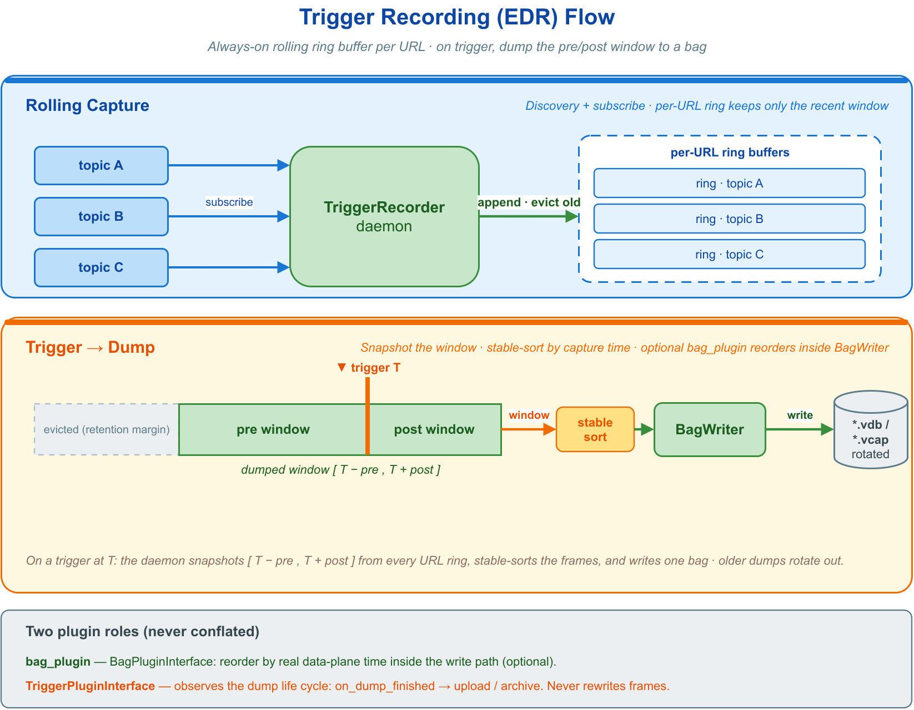

# ⌨️ 10. CLI 工具

VLink 在通信原语之外随库交付一套完整的命令行工具链（`vlink-*` 前缀），用于在不修改业务代码的前提下对运行中的系统进行发现、监控、录制、调试与性能评估。该层最轻量、可脚本化、零图形依赖，适合终端排障与 CI 对接。需要本地图形化预览图像、点云、目标检测，或经浏览器远程协作的可视化能力，见 [可视化工具](11-visualization.md)。

命令行工具与桌面、Web 可视化层共享同一套观测设施：启用了 `DiscoveryReporter` 的进程向观测面上报节点，代理层（ProxyAPI / `vlink-proxy`）再聚合 URL、序列化类型与统计信息；这与各后端自身的数据面发现不是同一机制。工具侧通常无需随 topic 后端改代码，但业务 URL 必须满足目标后端契约：`intra://` / `shm://` / `dds://` 等兼容地址可只换 scheme，SOME/IP 等专用寻址须重写完整 URL，并部署相应运行时。


---

## 🧭 10.1 工具链总览与选型

整条工具链按"观测目标 + 呈现形态"两维划分职责，互不重叠：命令行层负责文本与统计、可脚本化；桌面层负责本地图形化、强交互；Web 层负责跨平台/远程可视化与离线归档。

| 层次 | 工具 | 职责 |
| --- | --- | --- |
| 命令行 | `vlink-info` | 查看版本号、构建时间戳与编译选项 |
| 命令行 | `vlink-check` | 环境自检：网络/内核诊断、环境变量核对、通信冒烟测试 |
| 命令行 | `vlink-list` | 列出当前活跃的节点与话题 |
| 命令行 | `vlink-monitor` | 实时监控话题的频率、速率、丢包率与时延 |
| 命令行 | `vlink-bag` | 录制、回放与运维消息数据包 |
| 命令行 | `vlink-trigger` | 内存触发录制（EDR）：后台滚动缓冲，事件触发落盘触发点前后窗口 |
| 命令行 | `vlink-parse` | 从话题或 bag 提取字段，导出 CSV/JSON/图像/点云 |
| 命令行 | `vlink-eproto` / `vlink-efbs` | 订阅/发布 Protobuf / FlatBuffers 消息并在终端解析显示 |
| 命令行 | `vlink-bench` | 发布/订阅性能基准测试与报告 |
| 桌面 | `vlink-viewer` | 实时监控全部活跃 URL，预览相机图像、点云、目标检测等结构化数据 |
| 桌面 | `vlink-player` | 图形化回放 bag 文件，支持速率、进度、过滤与 URL 重映射 |
| 桌面 | `vlink-analyzer` | 从 bag 中提取字段，绘制时间序列波形并导出 |
| Web | `vlink-foxglove` | 将实时数据桥接至 Foxglove Studio（WebSocket） |
| Web | `vlink-rerun` | 将实时数据桥接至 Rerun Viewer（gRPC） |
| Web | `vlink-bag2mcap` / `vlink-bag2rrd` | 将 bag 离线转为 MCAP / RRD 可视化文件 |

桌面与 Web 工具的用法见 [可视化工具](11-visualization.md)；其公共数据来源 `vlink-proxy` 的控制面机制详见 [可观测性](12-observability.md)。

**层间选型判据**　以下为跨层（命令行 / 桌面 / Web）的选型依据；命令行层内部各工具的任务映射见 §10.2.2。

| 需求 | 选择 |
| --- | --- |
| 仅需话题列表、频率、原始字节，或需脚本/CI 对接 | 命令行（`vlink-list` / `vlink-monitor` / `vlink-parse`） |
| 需本地图形化预览图像、点云、目标检测，强交互 | 桌面 `vlink-viewer` 套件 |
| 需浏览器访问、远程协作、团队共享或 CI 集成 | Web `vlink-foxglove` |
| 需本机高性能三维渲染与多模态融合 | Web `vlink-rerun` |
| 需将历史 bag 转为通用可视化文件离线分发 | `vlink-bag2mcap` / `vlink-bag2rrd` |

---

## 🖥️ 10.2 命令行工具

全部命令行工具遵循一致的接口约定：均支持 `-h` / `--help` 与 `-v` / `--version`；除本地诊断类命令外，多数工具默认经服务发现感知远端节点，因此跨机使用要求组播/广播在链路上可达。是否将某工具编入由对应的 `ENABLE_CLI_*` 构建选项控制。

### 📦 10.2.1 安装与通用约定

编译安装后工具位于 `<install_prefix>/bin/`，将该目录加入 `PATH` 即可全局调用：

```bash
cmake -B build
cmake --build build
cmake --install build --prefix /usr/local
export PATH=/usr/local/bin:$PATH
```

通用约定：

- 默认安装短别名软链（`list`、`monitor`、`bag`、`eproto` 等价于对应 `vlink-*`）；构建时设 `-DENABLE_SYMLINKS=OFF` 仅安装全名，以规避与发行版命令冲突。
- 首次部署建议先执行 `vlink-check diag` 自检环境（见 §10.2.4）。

### 🗺️ 10.2.2 任务到工具的映射

工具按观测目标划分职责，下表给出从工程任务到工具的选用判据。

| 任务 | 工具 |
| --- | --- |
| 确认运行环境是否就绪 | `vlink-check diag` |
| 枚举当前节点与话题 | `vlink-list` |
| 量化话题频率与丢包 | `vlink-monitor` |
| 检视话题消息内容 | `vlink-eproto sub` / `vlink-efbs sub` |
| 录制与回放数据 | `vlink-bag record` / `vlink-bag play` |
| 长期运行仅保留关键事件前后片段 | `vlink-trigger daemon` / `vlink-trigger dump` |
| 导出字段供离线分析 | `vlink-parse` |
| 评估链路吞吐与时延 | `vlink-bench run` |

最高频的三条工作流：

```bash
vlink-list

vlink-monitor -l -i camera

vlink-eproto sub dds://sensor/imu -d /home/protos/
```

### ℹ️ 10.2.3 vlink-info：版本与编译选项

`vlink-info` 输出当前二进制的版本号、构建时间戳、Git 标签与提交 ID；附加 `-l` 时列出该二进制启用的全部编译选项。该信息用于确认现场部署的版本与功能集是否符合预期。

```bash
vlink-info

vlink-info -l
```

输出示例：

```
┌──────── VLink Informations ────────────────────────────────────────────────────
│ Version:                     2.1.0
│ Time stamp:                  2026-03-17 10:00:00
│ Git tag:                     v2.1.0
│ Git commit-id:               e78d342
└────────────────────────────────────────────────────────────────────────────────
```

### 🩺 10.2.4 vlink-check：环境自检

`vlink-check` 在部署或排障前确认环境是否满足通信前置条件，含三个子命令，分别面向系统诊断、配置核对与通信验证。

| 子命令 | 作用 |
| --- | --- |
| `vlink-check diag` | 逐项检查 IP/网卡/内核参数/文件系统/运行时进程，给出 PASSED / WARNING / FAILED |
| `vlink-check env` | 列出常用 `VLINK_*` 环境变量及当前取值（按编译进的传输模块裁剪） |
| `vlink-check test` | 执行通信冒烟测试，验证三种通信模型与各后端能否收发 |

`diag` 遍历一组诊断项（VLink 版本、可用 IP、组播路由、内核网络缓冲、文件描述符上限、`/dev/shm` 空间、时间同步、CPU/内存占用、相关工具是否在运行等），以彩色状态栏汇报，并将退出码置为失败项数量，全部通过返回 0，因而可直接用于脚本判定。

`VLINK_CYCLONEDDS_URI` 可包含 URI 或内联 XML；配置非空时诊断标为 WARNING，实际内容由 Cyclone DDS 启动时校验。

```bash
vlink-check diag

vlink-check diag -a -s

vlink-check diag -f dds
```

| 参数 | 说明 |
| --- | --- |
| `-a` / `--all` | 附加检查所有编译选项开关状态 |
| `-s` / `--summary` | 结束时打印 PASSED / WARNING / FAILED 统计 |
| `-f` / `--filter <substring>` | 仅执行标题包含指定子串的诊断项 |

`env` 列出常用环境变量子集（路径/插件、日志、bag/发现、各传输后端、TLS 等），已设置项以绿色、未设置项以红色标识，用于快速核对配置一致性；它仅覆盖常用子集，完整清单以 [集成与环境变量](13-integration.md) 为准。

已设置的 `VLINK_SSL_KEY_PASS` 仅显示 `<redacted>`，不输出密码内容。

```bash
vlink-check env

vlink-check env -b

vlink-check env -p VLINK_ZENOH_
```

`test` 先在 `intra://` 上对 Event / Method / Field 三种模型做最小自检，再对每个编译进的传输后端执行一次通信往返。缺少运行时前置条件的后端标 WARNING 跳过，不影响其它项；退出码等于失败项数量。

```bash
vlink-check test
```

### 📋 10.2.5 vlink-list：枚举活跃节点与话题

`vlink-list` 扫描网络上活跃的 VLink 进程，按进程分组以树状结构列出其注册的话题（Publisher / Subscriber / Server / Client / Setter / Getter）及序列化类型。它在启动后等待约 1 秒收集发现信息，随后输出并退出。发现机制详见 [可观测性](12-observability.md)。

```bash
vlink-list

vlink-list -n

vlink-list -m my_process
vlink-list -p 1234

vlink-list -c
echo "Process count: $?"
```

| 参数 | 说明 |
| --- | --- |
| `-n` / `--native` | 本地模式，仅发现本机节点 |
| `-m` / `--name <name>` | 按进程名过滤 |
| `-p` / `--pid <pid>` | 按进程 ID 过滤 |
| `-c` / `--check_process_count` | 仅以退出码返回进程数，不输出文本（用于脚本判定） |

输出示例：

```
camera_node (pid: 1001, host: myhost, ip: 192.168.1.10)
  Publisher:
    dds://camera/image       CameraFrame
    dds://camera/pointcloud  PointCloud

detection_node (pid: 1002, host: myhost, ip: 192.168.1.10)
  Subscriber:
    dds://camera/image       CameraFrame
  Publisher:
    dds://detection/result   pb.DetectResult
```

### 📊 10.2.6 vlink-monitor：实时通信监控

`vlink-monitor` 是终端交互式监控工具，持续显示网络中各话题的频率、速率、丢包率与时延，并可叠加 Sparkline 图表面板与进程面板。它解决"系统是否在按预期速率投递、是否存在丢包或时延异常"的观测问题。

两项核心交互能力：

- **按 `I` 弹出过滤框**：在屏幕中央弹出悬浮输入框，每输入一个字符即实时过滤话题列表，命中字符以加粗与下划线高亮；支持空格/逗号分隔多关键字、大小写不敏感子串匹配。命令行 `-i` / `--filter` 与之共用同一套过滤逻辑。
- **选中话题后按 `Enter` 跳转**：工具按服务发现推断的序列化类型自动启动 `vlink-eproto sub` 或 `vlink-efbs sub` 检视该话题内容；若话题属于字段模型，则自动以 Getter 接收。启动时附 `-b` / `--blob` 时，跳转后强制以十六进制显示。

```bash
vlink-monitor

vlink-monitor -x

vlink-monitor -lo

vlink-monitor -i camera

vlink-monitor --hostname vehicle

vlink-monitor -i debug -k

vlink-monitor -u dds://camera/image dds://lidar/points

vlink-monitor --plain > monitor_output.txt
```

| 参数 | 说明 |
| --- | --- |
| `-l` / `--detail` | 详情模式，显示频率/速率/丢包/时延列（热键 `L`） |
| `-o` / `--observe_all` | 为所有行订阅数据（配合 `-l`，热键 `O`） |
| `-t` / `--node_count` | 节点计数模式（热键 `T`） |
| `-e` / `--profiler` | 显示 profiler 面板（热键 `E`） |
| `-s` / `--ser` | 显示序列化类型（热键 `S`） |
| `-a` / `--active` | 仅显示活跃行（配合 `-l`，热键 `A`） |
| `-y` / `--pubsub` | 仅显示 pub/sub（热键 `Y`） |
| `-i` / `--filter <str>` | URL 关键字过滤（运行时可按 `I` 编辑） |
| `--hostname <str>` | 按进程 hostname 关键字过滤 URL；支持逗号或空格分隔多个关键字 |
| `-k` / `--black` | 黑名单模式，剔除命中的 URL |
| `-u` / `--urls <url...>` | 仅监控指定 URL |
| `-x` / `--preset` | 常用组合预设，等价 `-l -o -p -c` |
| `-p` / `--process` | 进程面板（热键 `P`） |
| `-c` / `--chart` | Sparkline 图表面板（热键 `C`） |
| `-n` / `--native` | 本地模式：仅发现本机节点，DDS 订阅绑定到 `VLINK_DDS_NATIVE_IP`（未设置时为 `127.0.0.1`） |
| `-b` / `--blob` | Enter 跳转时强制以十六进制显示 |
| `-g` / `--proto_args <str>` | Enter 跳转检视时追加的 eproto/efbs 参数 |
| `-d` / `--proto_dir <dir>` | Proto 目录（默认取环境变量 `VLINK_PROTO_DIR`） |
| `-f` / `--fbs_dir <dir>` | Flatbuffers 目录（默认取环境变量 `VLINK_FBS_DIR`） |
| `--dot` | 图表使用点状字符绘制 |
| `--rows <n>` | 最大行数，`0` 表示自动（默认 `0`） |
| `--columns <n>` | 最大列数，`0` 表示自动（默认 `0`） |
| `--chart_width <n>` | 图表宽度（默认 `30`，范围 10 - 100） |
| `--process_width <n>` | 进程列宽度（默认 `40`，范围 20 - 100） |
| `--plain` | 纯文本输出，禁用交互（用于重定向） |

`--hostname` 对一个 URL 的全部进程 hostname 做不区分大小写的子串匹配，任一进程命中即视为该 URL
命中。它始终执行正向过滤，不受 `--black` 影响；与 `--urls`、`--filter` 同时使用时，URL 还必须命中
hostname，原有两项仍按 `--black` 决定黑白名单语义。

常用热键：`q` / `Esc` 退出，`Space` 暂停/恢复，`I` 过滤框，`Enter` 跳转检视，`Z` 清除选中行，`L` / `O` / `T` / `E` / `S` / `A` / `Y` / `P` / `C` 切换各显示模式，方向键翻页与移动选中行。

行颜色语义：绿色表示持续有数据且统计稳定，黄色表示启动或过渡态，红色表示约 2 秒以上无新数据。

### 🎞️ 10.2.7 vlink-bag：录制与回放

`vlink-bag` 对话题进行录制与回放，并提供克隆、校验、重建索引、修复、打标签等运维子命令。录制/回放的 C++ API、文件格式（`.vdb` / `.vdbx` / `.vcap` / `.vcapx`）与整体架构详见 [录制与回放](09-recording.md)。


最高频的三条命令为 `record`、`play`、`info`：

```bash
vlink-bag record /tmp/test.vdb

vlink-bag record /tmp/test.vdb -u dds://camera/image dds://lidar/points -d 60 -p

vlink-bag play /tmp/test.vdb -r 2.0 -t 3

vlink-bag play /tmp/test.vdb -b 10 -e 60

vlink-bag info /tmp/test.vdb
```

`record` 常用参数（完整列表见 `--help`）：

| 参数 | 说明 |
| --- | --- |
| `path` | 输出文件路径（必填） |
| `-u` / `--urls <url...>` | 仅录制指定 URL（空为全部） |
| `-i` / `--filter <str>` / `-k` / `--black` | URL 关键字过滤 / 黑名单 |
| `-d` / `--duration <s>` | 录制时长（秒），≤0 不限制 |
| `-p` / `--compress` | 启用压缩 |
| `-f` / `--force` | 覆盖已有文件 |
| `-t` / `--tag <name>` | 录制标签名 |
| `-z` / `--split_by_size <GB>` / `-y` / `--split_by_time <s>` | 按大小/时间分割文件 |
| `--max_split_count <n>` | 分包文件保留上限；`0` 不限制，超限后删除最旧分包（仅 `.vdbx` / `.vcapx`） |
| `-n` / `--native` | 本地模式：仅发现本机节点，DDS 订阅绑定到 `VLINK_DDS_NATIVE_IP`（未设置时为 `127.0.0.1`） |

录制时 `Space` 暂停/恢复，`q` / `Esc` 停止。

`play` 常用参数：

| 参数 | 说明 |
| --- | --- |
| `path` | bag 文件路径（必填） |
| `-u` / `--urls <url...>` | 仅回放指定 URL |
| `-r` / `--rate <f>` | 回放速率（0.01~100） |
| `-t` / `--times <n>` | 回放次数，≤0 无限循环 |
| `-b` / `--begin_time <s>` / `-e` / `--end_time <s>` | 回放起止相对时间（秒） |
| `-m` / `--skip_blank` | 跳过空白段 |
| `-n` / `--native` | 将回放创建的 DDS 发布节点绑定到 `VLINK_DDS_NATIVE_IP`（未设置时为 `127.0.0.1`） |

回放时 `Space` 暂停/恢复，方向键前后跳转（`Left` / `Right` 1 秒、`Up` / `Down` 5 秒），暂停态下 `p` 单步前进一帧。

本地时间或 UTC 起止参数按输入时制换算，包含午夜 `00:00:00`；显式时钟结束时间必须晚于录制开始时间，未指定结束时间仍表示不限制。显示时制参数只影响显示，不改变数字 `-b` / `-e` 的相对秒数含义。

运维子命令：

| 子命令 | 作用 |
| --- | --- |
| `vlink-bag clone <src> <dst>` | 克隆/转换：支持格式转换、话题过滤、时间裁剪、压缩转换 |
| `vlink-bag merge <src...> -o <dst>` | 将至少两个包按原始绝对时间合并，支持混合格式与分包输入/输出 |
| `vlink-bag check <path>` | 校验文件完整性（0 正常，-1 异常） |
| `vlink-bag reindex <path>` | 重建时间索引 |
| `vlink-bag fix <path>` | 修复未完整写入的文件（如录制中途断电） |
| `vlink-bag tag <path> <name>` | 设置/修改 `.vdb`、`.vdbx`、`.vcapx` 的标签名；单个 `.vcap` 不支持 |

`clone` 会拒绝覆盖源入口、源分包及其已有的 SQLite WAL/SHM 文件，包括链接别名、目标旧分包清理和新分包命名造成的重叠；`--force` 不绕过此保护。按时间命名的分包发生重叠时，改用其他输出目录或关闭 `--split_name_by_time`。

`merge` 以最早输入包的开始时间为输出基准，将各帧的相对时间换算到该基准，保留原始绝对时间和消息载荷；同一时间戳按输入包顺序排列，同一包内保持原顺序，不去重。支持 `-t/--tag`、`-p/--compress`、`-f/--force` 和 `-q/--quiet`，输出格式由后缀决定；分包输出沿用默认的 1 GB 大小轮转。

各输入包的帧时间必须非递减；同名 URL 类型不一致、同名同类型 Schema 内容冲突、时间超出输出格式范围或读写失败时返回失败，运行中失败或取消可能留下部分输出。输出覆盖任一输入入口、分包或链接别名时始终拒绝；覆盖其他已有目标需要 `--force`。

```bash
vlink-bag clone /tmp/test.vdb /tmp/clipped.vdb -b 10 -e 60 -p

vlink-bag clone /tmp/capture.vcap /tmp/result.vdb

vlink-bag merge /tmp/a.vdb /tmp/b.vcap -o /tmp/merged.vdb -p

vlink-bag fix /tmp/broken.vdb

vlink-bag tag /tmp/test.vdb "highway_test_20260317"
```

### 🚨 10.2.8 vlink-trigger：内存触发录制

`vlink-trigger` 是"内存打点 / 触发录制"工具，实现行车记录仪式的事件数据记录（EDR）：守护进程常驻后台，经服务发现订阅总线上全部话题的原始字节，为每个 URL 维护一个滚动的内存环形缓冲，仅保留最近一段历史；收到触发时，把触发点前后窗口内的数据在内存中按采集时刻排序后落盘为 bag 文件，并对历史文件做轮转。其能力由 extension 库的 `vlink::TriggerRecorder` 引擎提供。若配置 `bag_plugin`，`vlink-trigger` CLI 宿主会加载对应的 `BagPluginInterface` 重排插件并经 `bind_bag_interface()` 注入引擎，落盘写入路径随之改为按 payload 内的真实**数据面时间**（data-plane time）滑窗重排——与在线 `BagWriter` 的重排机制一致（见 [录制与回放](09-recording.md)）。`TriggerRecorder` 本身不读取这个 CLI 配置，也不动态加载插件。

守护进程在 `vlink-trigger` 自身的编译单元中创建原始订阅器，因此正常情况下直接使用构建时链接的非 intra transport，不要求设置插件环境变量。只有需要使用未链接的已知共享模块时，才在进程首次初始化 URL 前（通常即启动前）把 `VLINK_URL_PLUGINS` 设为 `auto` 按需加载，或设为模块列表进行显式预加载；为空或设为 `none` 时关闭插件加载。模式值大小写不敏感且不能与列表混写。加载方式、搜索路径和限制见 [传输后端与 URL](04-transport.md) 与 [集成](13-integration.md)。`intra://` 仅限同一进程，独立守护进程无法录制其他进程的 intra 数据。



与 `vlink-bag record` 的区别在于落盘时机：`vlink-bag` 持续把消息写入磁盘，磁盘占用随时长线性增长；`vlink-trigger` 只在内存中滚动缓冲，仅在触发时落盘触发点前后的窗口，磁盘占用与触发次数相关而与运行时长无关。因此 `vlink-trigger` 适合需长期运行、只保留关键事件片段的场景（如量产车队的异常事件采集），`vlink-bag` 适合需完整留存全时段数据的调试与数据集采集。

工具含两个子命令：`daemon` 启动守护进程并持续缓冲，`dump` 向运行中的守护进程发起一次触发。二者经 JSON-over-RPC 通信——`daemon` 内部起一个 `Server<std::string, std::string>`，`dump` 作为客户端发送 JSON 触发请求（`std::string` 走 raw string 序列化，无需 protobuf 依赖）。控制面 URL 默认 `dds://trigger/method`，daemon 侧经配置 `method_url` 覆盖，客户端侧经 `-m` / `--method_url` 对应指定。

**内存与保留模型**　守护进程采用恒定保留策略：每个 URL 缓冲 `effective_pre + max_post_all + 2 * retention_guard` 时长的历史（`only_back` 的 `effective_pre` 为 0，其他 URL 为各自的 pre；`max_post_all` 为所有 URL 中最大的生效 post 窗口），使采集热路径无需判断"当前是否有触发在进行"。该全局最大值只决定环形缓冲的保留时长；单次 dump 在受理时筛选参与 URL，并按这些 URL 的最大有效 post 调度落盘，其中有效值为请求 post 与 URL 配置 post 的较小值。该值大于 0 时等待它加 `retention_guard`，为 0 或没有 URL 命中时立即调度。由此，单个 URL 配置过大的 post 会抬高所有 URL 的保留时长与内存占用，内存紧张时应约束 post；启用 `bag_plugin` 重排插件时，其滑窗会在落盘期间额外持有部分窗口副本，峰值内存可接近窗口大小的两倍。

**两类插件**　`vlink-trigger` 可同时使用两类互不混淆的插件：CLI 宿主按 `bag_plugin` 加载 `BagPluginInterface`，再经引擎 API `bind_bag_interface()` 绑定；该接口位于落盘写入路径内部，负责按数据面时间重排。而 `TriggerPluginInterface` 经 `bind_trigger_interface()` 绑定，只观察打点生命周期，用于 dump 完成后的上传 / 归档等后续行为，不改写帧。两类库的解析、搜索、版本校验和加载均属于 CLI 宿主职责，`TriggerRecorder` 只持有并调用已绑定的接口。`BagPluginInterface` 接口版本为 `2.0`，实现应使用 `VLINK_PLUGIN_DECLARE(Impl, 2, 0)`；`TriggerPluginInterface` 同为 `2.0`。

#### daemon 子命令

`vlink-trigger daemon` 使用内置默认配置启动守护进程，随后常驻缓冲直至收到终止信号；需要覆盖默认值时再通过 `-c` 读取 JSON 配置：

```bash
vlink-trigger daemon

vlink-trigger daemon -c /etc/vlink/trigger/trigger.json

vlink-trigger daemon -c /etc/vlink/trigger/trigger.json -n

vlink-trigger daemon -c /etc/vlink/trigger/trigger.json \
    --trigger_plugin edr-upload \
    --trigger_plugin_config '{"endpoint":"https://example.test/upload"}'
```

| 参数 | 说明 |
| --- | --- |
| `-c` / `--config <path>` | 可选配置文件路径（JSON）；省略时全部使用内置默认值 |
| `-n` / `--native` | 本地模式：本机发现，并将数据面订阅绑定到 `VLINK_DDS_NATIVE_IP`（未设置时为 `127.0.0.1`；不影响 `method_url` 控制面） |
| `--bag_plugin <name>` | 覆盖配置文件中的 `bag_plugin`；由 CLI 宿主加载并绑定，不传入 `TriggerRecorder::Config` |
| `--trigger_plugin <name>` | 覆盖配置文件中的 `trigger_plugin` |
| `--trigger_plugin_config <str>` | 覆盖配置文件中的 `trigger_plugin_config`；字符串内容由插件解释 |

daemon 在指定 `-c` 时先读取 JSON，再按字段应用命令行中**显式出现**的三个插件参数，最后应用 `--native`。未指定 `-c` 时从内置默认值开始应用命令行参数。三个插件字段相互独立：未指定的参数保留 JSON 值，显式传入空字符串则清空相应值。因此可以只从命令行替换插件配置而沿用 JSON 中的插件名，也可以用 `--trigger_plugin ''` 禁用 JSON 中配置的 trigger 插件。

配置文件字段如下（时间单位毫秒，容量单位 MB）：

| 字段 | 默认 | 说明 |
| --- | --- | --- |
| `method_url` | `dds://trigger/method` | 控制面 RPC 的服务 URL（scheme 决定后端，可换 `shm://` 等），客户端 `-m` 须与之一致 |
| `dump_dir` | `{tmp}/vlink-trigger` | 落盘目录，空则取系统临时目录下的 `vlink-trigger` |
| `allow_outside_dir` | `true` | 是否允许 RPC 的显式 `out_file` 位于 `dump_dir` 外；设为 `false` 时限制在 `dump_dir` 内。该开关不改变相对路径基准和后缀校验 |
| `file_type` | `vdb` | 落盘格式：`vdb`（SQLite 容器）/ `vcap`（MCAP 容器） |
| `default_pre_ms` | `15000` | 默认触发前窗口（毫秒） |
| `default_post_ms` | `0` | 默认触发后窗口（毫秒） |
| `default_max_packet_size` | `4` | 默认单包上限（MB），`0` 表示不限制，超限的包丢弃 |
| `default_max_size` | `0` | 默认每 URL 缓冲字节上限（MB），`0` 不限制 |
| `max_cache_size` | `2048` | 全局缓冲字节上限（MB），跨所有 URL 汇总；首次超限时输出警告，超限腾挪仅发生在正接收数据的 URL 自身环内，不会跨 URL 淘汰他人历史 |
| `retention_guard_ms` | `500` | 额外保留裕量（毫秒），吸收落盘定时抖动 |
| `max_dump_file_count` | `10` | 落盘文件保留上限；仅自动命名的落盘触发轮转，按后缀统计并清理 `dump_dir` 下最旧文件（显式 `out_file` 的落盘不触发轮转） |
| `enable_compress` | `false` | 落盘 bag 是否压缩 |
| `busy_skip_data` | `false` | 落盘进行中丢弃新到数据（会在环形缓冲留下时间空洞） |
| `destroy_on_offline` | `false` | URL 从发现中消失时销毁其订阅者；已缓冲数据仍供在飞落盘读取 |
| `overflow` | `drop` | 字节上限溢出策略：`cover`（淘汰最旧帧）/ `drop`（丢弃新帧） |
| `sleep_interval_mb` | `4` | 落盘流控：每推送该字节数（MB）后休眠一次，摊薄 dump 瞬时的 IO 与写入队列压力 |
| `sleep_time_ms` | `0` | 落盘流控：单次休眠时长（毫秒），`0` 关闭流控 |
| `discovery_filter` | `available` | 发现过滤：`available` / `native` / `none` |
| `whitelist` | `[]` | 非空时仅录制其中精确匹配的 URL |
| `blacklist` | `[]` | 其中精确匹配的 URL 永不录制 |
| `bag_plugin` | 空 | CLI 宿主加载并绑定的 `BagPluginInterface` 重排插件库名（不含前缀/后缀）；空则不绑定，按采集时刻顺序落盘 |
| `bag_plugin_dir` | 空 | CLI 宿主查找重排插件时使用的子目录名；设置后仅在各插件搜索路径的该子目录下查找，不属于 `TriggerRecorder::Config` |
| `trigger_plugin` | 空 | `TriggerPluginInterface` 生命周期插件库名（不含前缀/后缀，当前 ABI `2.0`），加载后经 `bind_trigger_interface()` 绑定，`on_dump_finished` 为上传/归档钩子；空则不加载，加载失败 daemon 拒绝启动 |
| `trigger_plugin_dir` | 空 | 生命周期插件子目录名；设置后仅在各插件搜索路径的该子目录下查找 |
| `trigger_plugin_config` | 空 | 原样传给 trigger 插件 `init()` 的不透明字符串，可由插件解释为 JSON、文件路径或其他格式；`init()` 返回 `false` 时 daemon 拒绝启动 |
| `url_overrides` | `{}` | 按 URL 覆盖窗口与限额，见下 |

所有 MB 容量字段必须是有限、非负且换算后不超过 `int64` 字节范围的数值；非法值会使 daemon 在启动时拒绝配置。

`url_overrides` 为每个 URL 独立配置窗口与限额，缺省字段回退到对应的全局默认：`pre_ms` / `post_ms`（触发前/后窗口）、`max_packet_size`（单包上限 MB）、`max_size`（该 URL 缓冲上限 MB）、`only_front`（仅录触发前）、`only_back`（仅录触发后）。

```json
{
    "dump_dir": "/data/edr",
    "allow_outside_dir": true,
    "file_type": "vdb",
    "default_pre_ms": 15000,
    "default_post_ms": 0,
    "default_max_packet_size": 4,
    "max_cache_size": 2048,
    "max_dump_file_count": 10,
    "enable_compress": false,
    "overflow": "drop",
    "sleep_interval_mb": 4,
    "sleep_time_ms": 2,
    "discovery_filter": "available",
    "whitelist": [],
    "blacklist": [],
    "bag_plugin": "",
    "bag_plugin_dir": "",
    "trigger_plugin": "",
    "trigger_plugin_dir": "",
    "trigger_plugin_config": "",
    "url_overrides": {
        "dds://camera/front": { "pre_ms": 60000, "post_ms": 5000, "max_packet_size": 8 },
        "dds://radar/points": { "pre_ms": 15000, "post_ms": 0 },
        "dds://control/brake": { "pre_ms": 30000, "post_ms": 10000, "only_back": true }
    }
}
```

上例中相机保留触发前 60 s、触发后 5 s，雷达仅保留触发前 15 s（`post_ms=0`），制动信号仅录触发后 10 s（`only_back`），三者窗口互不相同。默认按采集时刻落盘；若配置 `bag_plugin`，CLI 宿主会加载该插件并绑定给 recorder，由插件按 payload 内数据面时间重排。重排只改变帧的落盘顺序和 bag 时间轴，不改写 payload 内的 `time_meas`；具体排序与异常时间处理策略由插件实现决定。JSON 中的 `bag_plugin` / `bag_plugin_dir` 是 `vlink-trigger` 的宿主配置，不是引擎配置字段。

#### dump 子命令

`vlink-trigger dump` 向运行中的守护进程发起一次触发，可临时覆盖输出路径、原因、文件名与窗口，并按 URL 缩小本次落盘范围。显式输出路径默认可位于 daemon 的 `dump_dir` 外；将 `allow_outside_dir` 配置为 `false` 后，`..` 与符号链接均不能逃逸该目录。相对路径始终按 `dump_dir` 解析，且后缀必须与 daemon 的 `file_type` 匹配。请求接受后，dump 客户端和 daemon 都显示包含自动命名或防覆盖后缀的最终绝对路径：

```bash
vlink-trigger dump

vlink-trigger dump -r hard-brake -o /data/edr/case_001.vdb

vlink-trigger dump -r collision --pre 10000 --post 3000

vlink-trigger dump -u dds://camera/front dds://control/brake

vlink-trigger dump -u dds://camera/front dds://camera/rear -i front

vlink-trigger dump -i "camera radar" -k
```

| 参数 | 说明 |
| --- | --- |
| `-m` / `--method_url <url>` | 守护进程控制面 URL（默认 `dds://trigger/method`，须与 daemon 的 `method_url` 一致） |
| `-o` / `--out_file <path>` | 输出文件路径，空则在 `dump_dir` 下自动命名；非空时受 daemon 的目录与后缀策略校验 |
| `-r` / `--reason <str>` | 触发原因，写入 bag 标签供检索 |
| `-n` / `--name <str>` | 输出文件名提示，空则生成时间戳文件名 |
| `--pre <ms>` | 本次触发前窗口（毫秒），仅可缩小；`-1` 保持各 URL 配置值，其他负数或超出录制器安全范围的过大值会被拒绝 |
| `--post <ms>` | 本次触发后窗口（毫秒），仅可缩小；`-1` 保持各 URL 配置值，其他负数或超出录制器安全范围的过大值会被拒绝 |
| `-u` / `--urls <url...>` | 精确 URL 过滤；默认仅保留命中项，`-k` 时剔除命中项 |
| `-i` / `--filter <str>` | 在精确 URL 判断后执行不区分大小写的子串过滤；用逗号分隔，或用引号包住以空格分隔的多个子串 |
| `-k` / `--black` | 与 `vlink-monitor -k` 一致，同时把 `--urls` 和 `--filter` 切换为黑名单模式 |

未使用 `-k` 时，`--urls` 与 `--filter` 同时出现等价于先做精确白名单、再做关键字白名单，最终保留两者交集；使用 `-k` 时两层都按黑名单执行，最终剔除两者命中的并集。这一处理顺序、分词方式、大小写规则和反转语义与 `vlink-monitor` 一致。

控制面 `dump` 请求用独立的 `whitelist` 和 `blacklist` 数组传输精确 URL；字段省略或数组为空表示不启用对应名单，两者可单独设置，也可在同一次请求中同时设置，daemon 先应用白名单再应用黑名单。当前 CLI 参数保持不变：未使用 `-k` 时将 `-u` 写入 `whitelist`，使用 `-k` 时写入 `blacklist`；`filter_str` 的模式仍由 `black_mode` 表示。

本次触发的窗口只能相对配置缩小、不能放大：`--pre` / `--post` 大于某 URL 配置值时以配置值为准，因为环形缓冲仅按配置时长保留历史。触发请求为非阻塞——守护进程接受后异步完成"等待本次参与 URL 的最大有效 post 窗口 → 重排 → 写盘"，其间若再次触发则被拒绝（触发串行化）。daemon 日志覆盖收到请求、调度等待、开始写盘及成功或失败阶段；成功日志包含帧数、字节数和最终绝对路径。参与本次落盘的 URL 集合在触发受理瞬间筛选并冻结：此后新发现的话题不进入本次落盘，已在集合中的话题即使离线，其缓冲数据也保留到本次落盘完成。

#### 典型场景

**车队 EDR 常驻采集**　守护进程随系统启动常驻，业务侧在检测到碰撞、急刹、接管等异常时调用 `dump` 落盘事件前后窗口，长期运行仅积累关键片段：

```bash
vlink-trigger daemon -c /etc/vlink/trigger/trigger.json &

vlink-trigger dump -r takeover --post 8000
```

**与离线分析衔接**　落盘产物即标准 bag 文件，可直接交由 `vlink-bag`、`vlink-parse` 或图形化 `vlink-player` 处理：

```bash
vlink-trigger dump -r anomaly -o /data/edr/anomaly.vdb
vlink-bag info /data/edr/anomaly.vdb
vlink-parse dds://control/brake -t csv -c "value" -f /data/edr/anomaly.vdb -o /tmp/
```

### 📤 10.2.9 vlink-parse：字段提取与转储

`vlink-parse` 从实时话题或 bag 文件中提取指定字段，输出为 CSV、JSON、原始二进制、图像/视频或点云，并支持对离线 bag 做切片（`slice`）与扫描（`scan`）。它面向"将通信数据转为可离线分析的结构化产物"这一任务。

提取 Protobuf 字段需经 `-d` 或 `VLINK_PROTO_DIR` 指定 `.proto` 目录，FlatBuffers 经 `--fbs_dir` 或 `VLINK_FBS_DIR` 指定 `.fbs` 目录；零拷贝类型（CameraFrame、PointCloud、Tensor、OccupancyGrid 等）的内置字段无需额外配置，字段定义见 [零拷贝](06-zerocopy.md)。表达式功能需构建时启用 `ENABLE_EXPRTK=ON`。

基础参数：

| 参数 | 说明 |
| --- | --- |
| `url` | 目标话题 URL（parse/导出模式必填具体 URL，不可省；`slice` / `scan` 可省，默认 `*` 匹配全部话题） |
| `-t` / `--type <type>` | 输出类型：`console`（别名 `text`）/`csv`/`json`/`bin`/`jpg`（别名 `jpeg`）/`h264`/`h265`/`raw`/`pcd`/`slice`/`scan`（默认 `csv`） |
| `-c` / `--condition <fields>` | 提取字段，逗号/空格分隔（CSV/JSON 必填），如 `header.seq,pose.x` |
| `-f` / `--bag_file <path>` | 从 bag 提取（缺省则从实时通信） |
| `-b` / `--begin_time` / `-e` / `--end_time` | 时间范围（秒，仅对 `-f` 有效） |
| `-n` / `--count <n>` / `--hz <hz>` | 最大样本数 / 最大输出频率 |
| `--native` | 实时模式仅发现本机节点，DDS 订阅绑定到 `VLINK_DDS_NATIVE_IP`（未设置时为 `127.0.0.1`） |
| `-o` / `--out_dir` / `-m` / `--base_name` | 输出目录 / 文件基础名 |
| `-d` / `--proto_dir` / `--fbs_dir` | schema 目录 |
| `-x` / `--expression <expr>` | 表达式，可重复（配合 `-c`，需 exprtk） |
| `-u` / `--urls <url...>` | `slice` / `scan` 精确 URL 过滤 |
| `-i` / `--url_filter <str>` | `slice` / `scan` URL 关键字过滤，空格或逗号分隔且不区分大小写 |
| `-k` / `--black` | 与 `vlink-monitor -k` 一致，将两种 URL 过滤切换为黑名单模式 |

输出类型语义：`console` 在终端打印消息内容；`csv` / `json` 输出选定字段；`bin` 将每条消息的原始字节存为独立文件；`jpg` / `h264` / `h265` / `raw` 适用于 CameraFrame 或含 bytes 字段的消息；`pcd` 将零拷贝 PointCloud 每帧存为 PCD 文件。`slice` / `scan` 为离线 bag 的高级用法（按窗口/事件切片、按事件或质量扫描），参数较多，详见 `vlink-parse --help`。

离线导出在打开输出文件前检查其是否指向输入 bag、分包入口或成员，以及已有的 SQLite WAL/SHM 文件；软链接和硬链接指向这些输入时同样拒绝写入，避免截断源数据。指向其他普通输出文件的链接仍可使用。

所有带值的标量参数都必须显式提供值；空 URL、空字段列表以及空白的 `--event` / `--filter` / `--url_filter` 会直接报错。URL 的首尾空白在解析后统一移除；parse/导出模式必须指定具体 URL，`*` 只用于 `slice` / `scan`。`-n` 精确限制通过 URL 与限频门控的样本数，`--hz` 是严格的最大输出频率；限频间隔只在参数解析时换算，数据热路径使用整数微秒比较。

`slice` / `scan` 只接受已完整结束且包含消息的 bag，时间区间按毫秒解释为半开区间 `[begin, end)`；未指定结束时间时会覆盖最后一个不足整毫秒的消息。切片输出只支持 `.vdb` 或 `.vcap`，分片输入的 `.vdbx` / `.vcapx` 会映射到对应的单文件格式。URL 筛选包含 Event、Method 与 Field，实际帧再由 `--actions` 过滤（默认 `6=Subscribe`）；显式 URL 与 `-u` / `--urls`、`-i` / `--url_filter` 不可混用。未使用 `-k` 时，两种过滤同时出现取交集；使用 `-k` 时剔除任一过滤命中的 URL，与 `vlink-monitor` 的处理一致。单独使用 `-k` 不改变选集；黑名单中不存在于 bag 的 URL 会被忽略，白名单中的 URL 不存在时仍会报错。

未使用 bag 插件时，实际执行切片或扫描会完整读取输入并检查时间戳非递减，再按所选时间、话题和动作处理数据，避免逆序帧被静默丢弃。因此裁剪很短的时间区间也需要扫描整个输入；仅生成窗口计划的 `--dry_run` 不检查帧顺序。发现逆序时返回失败；切片可能已留下部分输出，扫描不会写出成功结果。使用 bag 插件时继续按所选输入范围读取，并要求参与处理的插件输出时间戳非递减。

内容过滤、事件表达式和切片 CSV 导出只支持零拷贝类型与 Protobuf；Protobuf 必须能从 `-d`、`--schema_config` 或 `VLINK_SCHEMA_PLUGIN` 找到目标消息的真实 descriptor。`--schema_plugin` 与 `VLINK_SCHEMA_PLUGIN` 均可使用插件 stem 或共享库直接路径，显式配置但加载失败会终止命令。Method、FlatBuffers、Raw 或未知 schema 参与这些字段操作时会在写文件前拒绝；这项预检验证解码能力，但不会假定每个 selector 都存在于异构 topic 的每一种消息中。不做 `--filter` / `--event` / `--export_csv` 时，单独的 `-c` 不会触发无用解码。`--force` 仍拒绝覆盖符号链接、输入 bag、分片成员及其已有的 SQLite WAL/SHM 文件，也不会覆盖本次命令读取的 `--segments` / `--schema_config` 文件。

字段路径写法：Protobuf 使用点路径（`header.seq`、`status.velocity.x`），repeated 字段使用完整的非负整数下标（如 `chunks[1].data`）；空路径分量、尾随字符、负数或用于非 repeated 字段的下标不会被宽松解释。八种零拷贝类型统一经 `MessageParser` 读取，根字段使用 `header.seq`、`width` 等点路径，集合使用 `data[N].field`、`shape[N].value` 或 `strides[N].value`。完整清单与边界规则见 [零拷贝](06-zerocopy.md)。整数在字段导出时保持原始 64 位值；只有送入 ExprTk 表达式、必须转换为 `double` 时，工具才会对超出精确表示范围的整数给出精度提示。

```bash
vlink-parse dds://sensor/imu -t csv -c "header.seq" -o /tmp/ -d /home/protos/

vlink-parse dds://vehicle/state -t csv -c "velocity.x" \
  -f /tmp/test.vdb -b 10 -e 60 -o /tmp/ -d /home/protos/

vlink-parse dds://test -t console -n 5

vlink-parse dds://camera/front -t jpg -c data -o /tmp/frames/ -d /home/protos/

vlink-parse dds://lidar -t pcd -f /tmp/bag.vdb -d /home/protos/

vlink-parse dds://test -c "pose.x,pose.y" \
  -x "sqrt(pose_x*pose_x+pose_y*pose_y)" -t csv --hz 10

vlink-parse -t slice -f /tmp/test.vdb -w 30 -o /tmp/slices

vlink-parse -t scan -f /tmp/test.vdb -c "brake" --event "brake>80" -d /home/protos/ -o /tmp/scan
```

### 🔍 10.2.10 vlink-eproto / vlink-efbs：消息调试

`vlink-eproto`（Protobuf）与 `vlink-efbs`（FlatBuffers）用于在终端检视与发布消息，解决"某话题实际承载的内容是什么"的问题。两者结构一致，均含 `sub`（订阅显示）、`pub`（发布）、`import`（持久化 schema 目录）三个子命令。下文以 `vlink-eproto` 为基准，`vlink-efbs` 的差异在末尾说明。

最常用的是 `sub <url>`：订阅并打印消息内容，序列化类型由服务发现自动推断。

```bash
vlink-eproto sub dds://sensor/imu -d /home/protos/

vlink-eproto sub dds://sensor/imu -d /home/protos/ -s pb.ImuData

vlink-eproto sub dds://vehicle/state -d /home/protos/ -s pb.VehicleState -g

vlink-eproto sub dds://sensor/imu -d /home/protos/ -s pb.ImuData -i angular_velocity

vlink-eproto sub dds://sensor/imu -d /home/protos/ -s pb.ImuData -j
```

`sub` 常用参数：

| 参数 | 说明 |
| --- | --- |
| `url` | 目标 URL（必填） |
| `-d` / `--proto_dir <dir>` | `.proto` 目录（默认读 `VLINK_PROTO_DIR`） |
| `-s` / `--ser_type <type>` | 显式指定消息名（指定后不等服务发现） |
| `-x` / `--encoding <type>` | 编码提示：`protobuf`/`flatbuffers`/`raw`/`blob`/`zerocopy`（`blob` 以十六进制显示） |
| `-i` / `--filter <str>` / `-k` / `--black` | 字段名过滤 / 黑名单 |
| `-j` / `--json` | 以 JSON 格式输出 |
| `-g` / `--getter` | 强制以 Getter 接收（字段模型） |
| `-n` / `--native` | 本地模式：仅发现本机节点，DDS 节点绑定到 `VLINK_DDS_NATIVE_IP`（未设置时为 `127.0.0.1`） |

未指定 `-s` 时，工具等待一轮服务发现自动推断类型，并在话题属于字段模型时自动切到 Getter 接收。标题行实时显示 URL、活动指示点与帧率，颜色策略与 `vlink-monitor` 一致。各类订阅内容按终端显示宽度主动换行；终端尺寸变化后会重新分页，暂停状态下也同步重排。交互热键：`q` / `Esc` 退出、`Space` 暂停、方向键翻页，以及 `E` / `R` / `T` / `Y` / `U` / `O` / `P` 切换枚举/数组/字符串/时间/十六进制/默认值/repeated 等显示选项。

`pub <url>` 用于发布消息，内容可经 `-c` 直接给出或 `-f` 从文件读取：

```bash
vlink-eproto pub shm://control/cmd -d /home/protos/ -s pb.ControlCmd \
  -c "speed:10.0 steering:0.5"

vlink-eproto pub shm://control/cmd -d /home/protos/ -s pb.ControlCmd -j \
  -c '{"speed":10.0,"steering":0.5}'

vlink-eproto pub dds://test/msg -d /home/protos/ -s pb.TestMsg \
  -f /tmp/test.prototxt -t 0 -l 500
```

`pub` 常用参数：`-s` 消息名（省略时经服务发现自动推断）、`-c` / `-f` 消息内容/文件（二者必择其一）、`-j` 按 JSON 解析、`-t` 发布次数（≤0 无限）、`-l` 发布间隔（毫秒，默认 100）。`-n` / `--native` 将 DDS 发布节点绑定到 `VLINK_DDS_NATIVE_IP`（未设置时为 `127.0.0.1`）。

`import <dir>` 将 schema 目录持久化，之后任意 shell 中无需再传 `-d` 或设环境变量：

```bash
vlink-eproto import /home/protos
vlink-eproto sub dds://sensor/imu -s pb.ImuData
```

**`vlink-efbs` 差异**：针对 FlatBuffers，schema 目录用 `-d` / `--fbs_dir`（或 `VLINK_FBS_DIR`），消息类型为 FlatBuffers table 名；`pub` 的内容/文件参数为 `-c` / `--fbstxt_content` 与 `-f` / `--fbstxt_file`，输入按 FlatBuffers JSON 语法解析，显示默认即为 JSON 风格，故不提供 `-j` 开关。其余 `sub` / `pub` / `import` 用法、热键与参数含义与 `vlink-eproto` 一致。

```bash
vlink-efbs sub dds://sensor/scan -d /home/fbs_schemas/ -s MyScan

vlink-efbs pub shm://control/cmd --fbs_dir /home/fbs_schemas/ -s CtrlCmd \
  -c '{ speed: 10.0, mode: 1 }'
```

### ⚡ 10.2.11 vlink-bench：性能基准

`vlink-bench` 围绕不同 URL、通信模式、拓扑、QoS、payload 与报文大小执行矩阵化的发布/订阅性能测试，输出吞吐与时延报告。核心子命令为 `run`（执行测试）与 `plot`（从已有结果重建报告）。

不带 `--preset` 直接执行 `vlink-bench run` 时，运行一套约 2 分钟完成的 showcase 默认矩阵：覆盖 `throughput` 与 `latency` 两个套件、当前编译可用的跨进程传输、`bytes` payload，默认输出 HTML 报告与终端交互表格。

```bash
vlink-bench run

vlink-bench run \
  -u shm://bench/custom \
  -q sensor \
  --size 64,256,1024 \
  --rate 1000,10000 \
  --report terminal

vlink-bench run --preset full --report html,csv,json -o /tmp/bench-full

vlink-bench run --preset quick --report json --no-pager -o /tmp/ci-bench

vlink-bench plot /tmp/bench-full.json --report html,terminal
```

`run` 常用参数：

| 参数 | 说明 |
| --- | --- |
| `-p` / `--preset` | 预设矩阵：`showcase`（默认）/ `quick` / `full` |
| `-u` / `--url` | URL 列表，可重复或逗号/空格分隔；省略时取当前可用的内建 URL |
| `-s` / `--suite` | 套件：`throughput` / `latency` / `topology` / `fanout` / `serialization` / `backpressure` |
| `-m` / `--mode` | 执行模式：`local-direct` / `local-loop` / `process` |
| `-t` / `--topology` | 拓扑：`1:1` / `1:n` / `n:1` / `n:n` |
| `-k` / `--payload` | 负载类型：`bytes` / `string` / `rawdata` |
| `-q` / `--qos` | QoS profile 列表 |
| `--size` / `--latency-size` | 吞吐 / 时延测试的 payload 大小列表（字节） |
| `-r` / `--rate` | 固定速率场景的速率列表（Hz） |
| `--report` | 输出目标：`html` / `json` / `csv` / `terminal` / `both`，可组合（默认 `html` + `terminal`） |
| `--no-pager` / `--silent` | 关闭交互分页 / 静默（适合 CI） |
| `-o` / `--output` | 输出文件前缀（不带扩展名） |

预设差异：`showcase` 与 `quick` 为保守默认（`throughput` + `latency`、`process` 模式、`1:1` 拓扑、`bytes` payload，分钟级耗时）；`full` 默认展开 `throughput` / `latency` / `topology` / `serialization` 四个套件、三种执行模式（`local-direct` / `local-loop` / `process`）、更大的 payload 阶梯与拓扑/QoS 扫描，适合正式报告与横向对比。`fanout` 与 `backpressure` 套件不在任何预设的默认集中，需经 `--suite fanout` / `--suite backpressure` 显式启用。

报告结构：HTML 报告以"结论—定位—细节"为序组织，顶部为推荐传输配置与综合评分，往下依次为测试概览、传输健康、按消息大小的延迟/吞吐对比、分项结果与完整明细表，并提供可缩放/拖拽/悬浮的趋势折线图；评分以延迟与吞吐为主、辅以资源占用与丢包等维度。终端视图（`--report terminal`）为可翻页/搜索/排序/导出的聚合表格，`q` / `Esc` 退出。

### 🔗 10.2.12 命令行工具组合工作流

各工具的观测目标互补，串联即可覆盖多数现场场景。组合时需注意：经服务发现的工具要求后端链路可达，跨机时其覆盖范围受传输后端选型约束，详见 [传输后端与 URL](04-transport.md)。

**故障定位：从环境到消息内容逐层下钻**

```bash
vlink-check diag
vlink-list
vlink-monitor -x
vlink-eproto sub dds://sensor/imu -d /home/protos/
```

在 `vlink-monitor` 中选中目标行按 `Enter`，即自动跳转至上述第四步，无需手动调用 `vlink-eproto` / `vlink-efbs`。

**采集分析：录制 → 检视 → 提字段 → 裁剪**

```bash
vlink-bag record /tmp/test.vdb -d 60 -p
vlink-bag info /tmp/test.vdb
vlink-parse dds://sensor/imu -t csv -c "linear_acceleration.x" \
  -f /tmp/test.vdb -o /tmp/analysis/ -d /home/protos/
vlink-bag clone /tmp/test.vdb /tmp/clipped.vcap -b 5 -e 55 -p
```

**自动化对接：以退出码与纯文本输出衔接 shell**

```bash
vlink-list -c
if [ $? -eq 0 ]; then
  echo "No active VLink processes"
fi

vlink-monitor --plain -l > /tmp/monitor_$(date +%s).log &
vlink-bag record /tmp/test.vdb -d 30
```

---

## 📚 相关文档

- [快速开始](01-started.md)：最小可运行示例与环境准备
- [传输后端与 URL](04-transport.md)：跨机工具的链路可达性与后端选型
- [零拷贝](06-zerocopy.md)：CameraFrame / PointCloud 等零拷贝类型字段定义
- [录制与回放](09-recording.md)：bag 文件格式与录制/回放 C++ API
- [可视化工具](11-visualization.md)：桌面 Viewer 套件与 Web 可视化（Foxglove / Rerun）
- [可观测性](12-observability.md)：服务发现与代理监控（`vlink-proxy`）
- [集成与环境变量](13-integration.md)：完整 `VLINK_*` 环境变量清单与 C API
