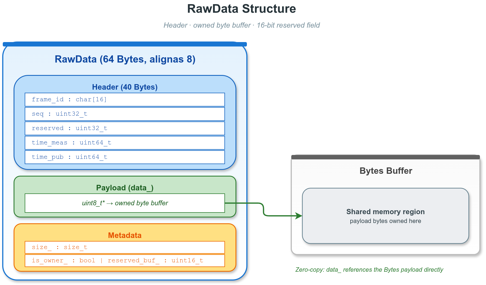
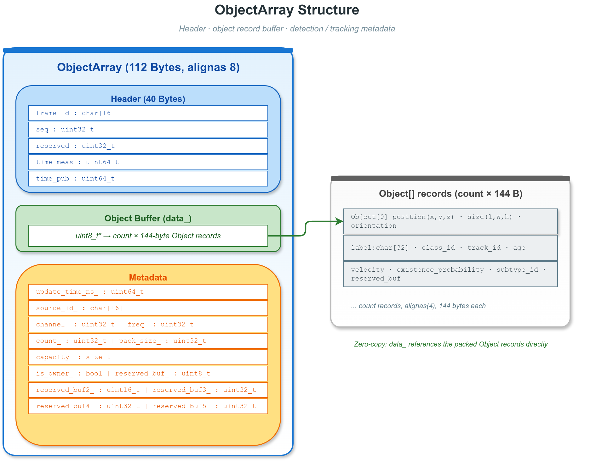
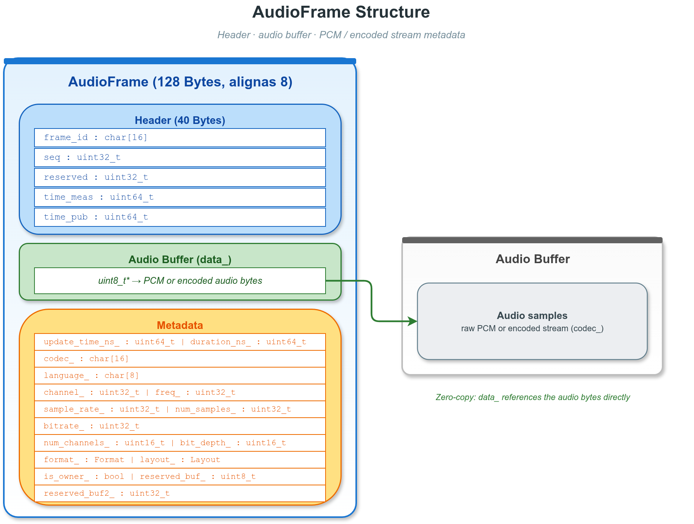

# 10. 零拷贝与数据容器

## 10.1 概述


VLink 的零拷贝能力分布在两个正交的层次：

1. **传输层零拷贝（loan）**：`shm://`（Iceoryx）和 `shm2://`（Iceoryx2）默认实现；
   `zenoh://` 在显式启用 SHM（`?shm=1` 或 `VLINK_ZENOH_SHM=1`）且编译期带
   `Z_FEATURE_SHARED_MEMORY` + `Z_FEATURE_UNSTABLE_API` 时也提供 loan 接口。
   Publisher 直接向共享内存池借出的缓冲区写数据，Subscriber 通过指针收到同一块内存。
   其他后端（`intra`、`dds`、`ddsc` 等）不支持 loan，`is_support_loan()` 返回 `false`。
2. **容器层零拷贝（zerocopy 结构体）**：`vlink::zerocopy` 命名空间下的负载容器
   （`RawData`、`CameraFrame`、`PointCloud`、`OccupancyGrid`、`Tensor`、`ObjectArray`、
   `AudioFrame`、`ProxyData`）支持"借用"语义——反序列化时内部指针直接指向 `Bytes` 缓冲区，
   不复制负载数据。`Header` 是 POD 元数据结构，不包含负载指针，也不提供借用反序列化语义。

两个层次可独立或组合使用：同一个 `CameraFrame` 可以通过 `shm://` 做双层零拷贝，
也可以通过 `dds://` 做单层（仅容器反序列化借用）。

> 相关文档：
> - 序列化类型与零拷贝的关系：[06-serialization.md](06-serialization.md)（`kStandardPtrType`、`kFlatPtrType`）
> - shm/shm2 的传输配置：[07-transport.md](07-transport.md)
> - `Bytes` 的 API：[11-base-library.md](11-base-library.md)

### 10.1.1 适用场景

| 场景                    | 推荐方案                                    |
| ----------------------- | ------------------------------------------- |
| 进程间相机帧传输        | `CameraFrame` + `shm://` 后端               |
| 进程间激光雷达点云传输  | `PointCloud` + `shm://` 后端                |
| 网络传输相机帧          | `CameraFrame` + `dds://` / `ddsc://` 后端   |
| 自定义二进制数据        | `RawData` + 任意后端                        |
| 2D 占据 / 代价地图      | `OccupancyGrid` + `shm://` / `dds://` 后端  |
| 神经网络张量输入输出    | `Tensor` + `shm://` / `dds://` 后端         |
| 3D 检测 / 跟踪目标列表  | `ObjectArray` + 任意后端                    |
| 音频帧（PCM / 编码）    | `AudioFrame` + 任意后端                     |
| 代理路由消息            | `ProxyData`（proxy 层内部使用）             |

---

## 10.2 Header 结构体


头文件：`include/vlink/zerocopy/header.h`

`Header` 是 40 字节 POD，嵌入在 `RawData`、`CameraFrame`、`PointCloud`、`OccupancyGrid`、
`Tensor`、`ObjectArray`、`AudioFrame` 中作为公有成员 `header`。`ProxyData` 不包含 `Header`
（它有自己的控制字段）。结构体声明为 `VLINK_EXPORT_AND_ALIGNED(8)`，64 位平台通过
`static_assert` 校验 `sizeof(Header) == 40`。

### 10.2.1 内存布局与字段

| 偏移 | 大小 | 字段       | 类型        | 说明                                               |
| ---- | ---- | ---------- | ----------- | -------------------------------------------------- |
|  0   | 16   | `frame_id` | `char[16]`  | 帧标识符字符串，默认 `"unknown"`                   |
| 16   |  4   | `seq`      | `uint32_t`  | 单调递增序列号，绕回 `UINT32_MAX`                  |
| 20   |  4   | `reserved` | `uint32_t`  | 保留，须置 0                                       |
| 24   |  8   | `time_meas`| `uint64_t`  | 采集时间戳（纳秒，自 epoch）                       |
| 32   |  8   | `time_pub` | `uint64_t`  | 发布时间戳（纳秒，自 epoch）                       |

### 10.2.2 双时间戳用途

- `time_pub - time_meas`：从传感器采集到发布出去的处理延迟。
- 订阅端接收时间 - `time_pub`：传输延迟。

```cpp
vlink::zerocopy::Header hdr;
hdr.seq = frame_counter++;
std::strncpy(hdr.frame_id, "cam_front", sizeof(hdr.frame_id) - 1);
hdr.time_meas = capture_timestamp_ns;
hdr.time_pub  = vlink::MessageLoop::get_current_nano_time();
```

---

## 10.3 RawData 类



头文件：`include/vlink/zerocopy/raw_data.h`

`RawData` 是最简单的零拷贝容器，封装非类型化字节缓冲区加一个 `Header` 和一个
16 位 `reserved_buf_`（由 `get_reserved()` 返回可变引用）。64 位平台
`sizeof(RawData) == 64`（已通过 `static_assert` 校验）。

### 10.3.1 三种内存所有权模式

| 模式         | 创建方式                              | `is_owner()` | 析构时行为   |
| ------------ | ------------------------------------- | ------------ | ------------ |
| 拥有         | `create(size)` / `deep_copy(...)`     | `true`       | 释放 `data_` |
| 借用外部指针 | `shallow_copy(ptr, size)`             | `false`      | 不释放       |
| 借用同类对象 | `shallow_copy(other)`                 | `false`      | 不释放       |
| 反序列化借用 | `operator<<(bytes)`                   | `false`      | 不释放       |

### 10.3.2 线缆格式

```
[ magic_begin (4) | version (4) | RawData 结构体 (64) | payload (N) | magic_end (4) ]
```

魔数 `0x98B7F11A` / `0x98B7F11F`。`check_valid(bytes)` 用于接收端验证。

### 10.3.3 核心方法

| 方法                              | 说明                                              |
| --------------------------------- | ------------------------------------------------- |
| `create(size)`                    | 分配 size 字节的拥有缓冲区                        |
| `shallow_copy(ptr, size)`         | 借用外部指针，不复制                              |
| `shallow_copy(other)`             | 借用另一个 RawData 的缓冲区                       |
| `deep_copy(ptr, size)`            | 深拷贝：分配并复制数据                            |
| `deep_copy(other)`                | 深拷贝另一个 RawData                              |
| `move_copy(other)`                | 转移所有权，other 变为空                          |
| `fill_data(ptr, size)`            | `deep_copy(ptr, size)` 的别名                     |
| `operator>>(bytes)`               | 序列化为 Bytes（含魔数+version+结构体+payload）    |
| `operator<<(bytes)`               | 零拷贝反序列化（data 指针指向 bytes 内部）        |
| `check_valid(bytes)`              | 静态方法：验证 Bytes 是否为有效 RawData 格式      |
| `get_serialized_size()`           | 返回序列化后的总字节数                            |
| `is_valid()`                      | data 非空且 size > 0 时返回 true                  |
| `is_owner()`                      | 是否拥有当前缓冲区                                |
| `data()`                          | 返回 payload 的只读指针                           |
| `size()`                          | 返回 payload 字节数                               |
| `get_reserved()`                  | 返回用户可用的 16 位预留字段引用                  |
| `clear()`                         | 释放拥有的缓冲区，归零所有字段                    |

### 10.3.4 使用示例

```cpp
#include <vlink/zerocopy/raw_data.h>
#include <vlink/base/bytes.h>

vlink::zerocopy::RawData rd;
rd.header.seq      = 1;
rd.header.time_pub = vlink::MessageLoop::get_current_nano_time();
rd.create(1024);
std::memcpy(const_cast<uint8_t*>(rd.data()), source_buffer, 1024);

vlink::Bytes wire;
rd >> wire;

vlink::zerocopy::RawData rd2;

if (rd2 << wire) {
    process(rd2.data(), rd2.size());
}

uint8_t extern_buf[512];
vlink::zerocopy::RawData rd3;
rd3.header.seq = 2;
rd3.shallow_copy(extern_buf, sizeof(extern_buf));
```

---

## 10.4 CameraFrame 类


头文件：`include/vlink/zerocopy/camera_frame.h`

`CameraFrame` 为图像帧传输设计，携带分辨率、格式、通道号、采集频率等元数据，
以及像素数据缓冲区。64 位平台 `sizeof(CameraFrame) == 80`（已通过 `static_assert` 校验）。
另带 32 位 `reserved_buf_` 字段，可通过 `get_reserved()` 获取可变引用，该字段在
`clear()` 和 `shallow_copy` / `deep_copy` / `move_copy` 中均被保留。所有权规则与 `RawData` 相同。

### 10.4.1 支持的像素格式

| 枚举值                | 数值 | 说明                                   |
| --------------------- | ---- | -------------------------------------- |
| `kFormatUnknown`      |  0   | 未知格式                               |
| `kFormatYuv420`       |  1   | 平面 YUV 4:2:0（I420）                 |
| `kFormatYuv422`       |  2   | 平面 YUV 4:2:2                         |
| `kFormatYuv444`       |  3   | 平面 YUV 4:4:4                         |
| `kFormatNv12`         |  4   | 半平面 YUV 4:2:0（Y + UV 交错）        |
| `kFormatNv21`         |  5   | 半平面 YUV 4:2:0（Y + VU 交错）        |
| `kFormatYuyv`         |  6   | 紧凑 YUYV 4:2:2                        |
| `kFormatYvyu`         |  7   | 紧凑 YVYU 4:2:2                        |
| `kFormatUyvy`         |  8   | 紧凑 UYVY 4:2:2                        |
| `kFormatVyuy`         |  9   | 紧凑 VYUY 4:2:2                        |
| `kFormatBgr888Packed` | 10   | 紧凑 24 位 BGR（3 字节/像素）          |
| `kFormatRgb888Packed` | 11   | 紧凑 24 位 RGB（3 字节/像素）          |
| `kFormatRgb888Planar` | 12   | 平面 24 位 RGB（独立 R、G、B 平面）    |
| `kFormatJpeg`         | 101  | JPEG 压缩                              |
| `kFormatH264`         | 102  | H.264 / AVC 压缩视频帧                 |
| `kFormatH265`         | 103  | H.265 / HEVC 压缩视频帧                |

### 10.4.2 视频流帧类型

| 枚举值          | 说明                     |
| --------------- | ------------------------ |
| `kStreamUnknown`| 未知帧类型               |
| `kStreamI`      | I 帧（关键帧，自包含）   |
| `kStreamP`      | P 帧（参考前帧的预测帧） |
| `kStreamB`      | B 帧（双向预测帧）       |

### 10.4.3 核心方法

| 方法/字段                    | 说明                                      |
| ---------------------------- | ----------------------------------------- |
| `header`                     | `Header` 结构体，包含序列号和时间戳       |
| `set_channel(ch)` / `channel()`    | 相机通道（传感器索引）              |
| `set_width(w)` / `width()`         | 图像宽度（像素）                    |
| `set_height(h)` / `height()`       | 图像高度（像素）                    |
| `set_freq(f)` / `freq()`           | 采集频率（Hz）                      |
| `set_format(f)` / `format()`       | 像素/编码格式                       |
| `set_stream(s)` / `stream()`       | 视频流帧类型（仅 H264/H265 有效）   |
| `create(size)`                     | 分配 size 字节的像素缓冲区          |
| `shallow_copy(ptr, size)`          | 借用外部像素指针                    |
| `deep_copy(ptr, size)`             | 深拷贝像素数据                      |
| `fill_data(ptr, size)`             | `deep_copy(ptr, size)` 的别名       |
| `shallow_copy(other)`              | 借用另一帧的缓冲区                  |
| `deep_copy(other)`                 | 深拷贝另一帧                        |
| `move_copy(other)`                 | 转移所有权                          |
| `operator>>(bytes)`                | 序列化为 Bytes                      |
| `operator<<(bytes)`                | 零拷贝反序列化                      |
| `check_valid(bytes)`               | 验证 Bytes 是否为有效 CameraFrame   |
| `get_serialized_size()`            | 返回序列化后总字节数                |
| `is_valid()`                       | data 非空且 size > 0                |
| `is_owner()`                       | 是否拥有像素缓冲区                  |
| `data()`                           | 只读像素数据指针                    |
| `size()`                           | 像素数据字节数                      |
| `get_reserved()`                   | 返回 32 位用户预留字段引用（在 clear()/copy/move 中被保留） |
| `clear()`                          | 释放缓冲区，归零 header/格式等字段（保留 `reserved_buf_`） |

### 10.4.4 各格式像素大小计算

NV12 (`width * height * 3 / 2`)：

```cpp
size_t nv12_size = width * height * 3 / 2;
```

RGB888 打包 (`width * height * 3`)：

```cpp
size_t rgb_size  = width * height * 3;
```

JPEG / H264 / H265 的大小由编码器决定，无固定公式。

### 10.4.5 线缆格式（Wire Format）

```
[ magic_begin (4) | version (4) | CameraFrame 结构体 (80) | 像素数据 (N) | magic_end (4) ]
```

---

## 10.5 PointCloud 类


头文件：`include/vlink/zerocopy/point_cloud.h`

`PointCloud` 带 schema 描述的点云容器。Schema 用两个 `uint64_t`
（`size_num`、`type_num`）以 nibble（4 位）方式紧凑编码每个字段的字节大小和类型，
再加一段逗号分隔的字段名（最长 152 字节，字段数 3~16）。内部嵌入的 `Protocol`
结构布局固定为 `size_num (8) | type_num (8) | names (152)`，共 168 字节。
64 位平台 `sizeof(PointCloud) == 256`（已通过 `static_assert` 校验）。

### 10.5.1 支持的字段类型

| 枚举值         | C++ 类型  | 字节数 |
| -------------- | --------- | ------ |
| `kUnknownType` | —         | —      |
| `kBoolType`    | `bool`    | 1      |
| `kInt8Type`    | `int8_t`  | 1      |
| `kUint8Type`   | `uint8_t` | 1      |
| `kInt16Type`   | `int16_t` | 2      |
| `kUint16Type`  | `uint16_t`| 2      |
| `kInt32Type`   | `int32_t` | 4      |
| `kUint32Type`  | `uint32_t`| 4      |
| `kInt64Type`   | `int64_t` | 8      |
| `kUint64Type`  | `uint64_t`| 8      |
| `kFloatType`   | `float`   | 4      |
| `kDoubleType`  | `double`  | 8      |

### 10.5.2 Schema 编码原理

`size_num` / `type_num` 都以 N 个字段从最高位向低位排列（首字段位于 `(N-1)*4` 位，
末字段位于第 0 位；N 仅占用低 `N*4` 位，高位为 0）：

```
size_num 的每个 nibble（4 位）编码一个字段的字节大小：
  0x4 = 4 字节（float/int32），0x8 = 8 字节（double/int64），等等
  例 [float, float, float, uint8] -> size_num = 0x4441

type_num 的每个 nibble 编码 Type 枚举值：
  0xA = kFloatType(10)，0xB = kDoubleType(11)，等等
  例 [float, float, float, uint8] -> type_num = 0xAAA3

名称字段存储逗号分隔字符串："x,y,z,intensity"（最长 152 字节含 NUL；保留尾零方便
get_protocol_name_str() 按 C 字符串读取）

物理布局：Protocol { size_num | type_num | names[152] }，共 168 字节，
内嵌在 PointCloud 结构内（总 256 字节）。
```

### 10.5.3 Key 和 KeyMap

```cpp
struct Key final {
    std::string name;
    uint8_t     type{kUnknownType};
    uint8_t     size{0};
};

using KeyMap  = std::unordered_map<std::string, uint16_t>;
using KeyList = std::vector<Key>;
```

### 10.5.4 辅助向量类型

单精度 3D 向量（12 字节，4 字节对齐）：

```cpp
struct Vector3f final {
    float x{0};
    float y{0};
    float z{0};
};
```

双精度 3D 向量（24 字节，8 字节对齐）：

```cpp
struct Vector3d final {
    double x{0};
    double y{0};
    double z{0};
};
```

`PointCloud` 同时提供 `float` 和 `double` 版本的辅助方法（`create_v3f` / `create_v3d`、`push_value_v3f` / `push_value_v3d`、`get_value_v3f` / `get_value_v3d`），根据精度需求选择。

### 10.5.5 核心方法

| 方法                                        | 说明                                         |
| ------------------------------------------- | -------------------------------------------- |
| `header`                                    | Header 结构体                                |
| `create<T...>(size, names, extent=0, vertical=false)` | 模板创建，自动推导 Schema（3~16 类型参数）；`extent>0` 时 XYZ 量化为 `int16`，`vertical=true` 时序列化按 SoA 列重排 |
| `create_v3f<ExtraT...>(size, names, extent=0, vertical=false)` | 创建 XYZ float + 可选附加字段的点云          |
| `create_v3d<ExtraT...>(size, names, extent=0, vertical=false)` | 创建 XYZ double + 可选附加字段的点云         |
| `downsample(level)`                         | 体素栅格降采样：仅对已量化（`extent>0`）的 owned 点云生效，按 `level`（`0~255`，`0` 为 no-op）将空间相近点折叠为每体素一个点，幸存点压实到缓冲区前部并缩减 `size()`，同时把 `level` 记录到 `downsample_` 标记（详见 10.5.6）|
| `get_extent()` / `get_vertical()` / `get_downsample()` | 读取当前压缩配置：量化值域上界 / 是否垂直排布 / 降采样级别标记，`0` / `false` 表示关闭 |
| `resize(size)`                              | 重置逻辑点数和写入游标（不释放缓冲区，不清除已有数据，保留 Schema） |
| `push_value_v3f(x, y, z, extras...)`        | 追加一个 v3f 格式的点                        |
| `push_value_v3d(x, y, z, extras...)`        | 追加一个 v3d 格式的点                        |
| `set_value(index, T... args)` / `set_value_v3f` / `set_value_v3d` | 覆写第 index 个点的字段（要求 `index_ == size_ * pack_size_`，通常先 `resize()`）|
| `get_value<T>(index, key_map, key)`         | 按字段名读取第 index 个点的某字段（`key_map` 为可变引用，`key` 需 NUL 结尾） |
| `get_value_v3f(index)`                      | 读取第 index 个点的 XYZ 坐标（返回 Vector3f）|
| `get_value_v3d(index)`                      | 读取第 index 个点的 XYZ 坐标（返回 Vector3d）|
| `fill_packed_data(src, _size)`              | 从外部 packed 缓冲区按行整体拷贝             |
| `get_key_map(key_list*=nullptr)`            | 返回 名称->字节偏移 的映射                   |
| `size()`                                    | 返回当前点数                                 |
| `pack_size()`                               | 返回单点字节大小                             |
| `get_reserved_size()`                       | 已分配点容量（owned 时返回 `capacity_/pack_size_`，借用时返回 0）|
| `get_internal_data()`                       | 只读点数据指针（`const uint8_t*`）           |
| `get_protocol_size_num()` / `get_protocol_type_num()` | 直接读出 `Protocol` 的 size_num / type_num 整数 |
| `get_protocol_size_str()` / `get_protocol_type_str()` / `get_protocol_name_str()` | 打印用字符串（字段大小、类型、名称） |
| `get_value_for_double_float(...)` / `get_value_for_print(...)` | 运行时按 `Type` 反射读取并转换为 double 或可读字符串 |
| `get_serialized_size()`                     | 序列化总字节数（magic + version + 结构体 + `size*pack_size` + magic）|
| `is_owner()`                                | 是否拥有数据缓冲区                           |
| `is_valid()`                                | 数据非空、`size()>0` 且 `pack_size()>0`     |
| `operator>>(bytes)`                         | 序列化为 Bytes                               |
| `operator<<(bytes)`                         | 零拷贝反序列化（`vertical=true` 时改为分配 owned 缓冲并反重排，见 10.5.6）|
| `check_valid(bytes)`                        | 验证 Bytes 格式                              |
| `shallow_copy(other)` / `deep_copy(other)`  | 借用/深拷贝                                  |
| `move_copy(other)`                          | 转移所有权                                   |
| `clear(force=false)`                        | 默认仅清零 `size_`/`index_`，`force=true` 则释放缓冲并清零全部字段 |

### 10.5.6 压缩存储（精度量化 + 垂直排布）

针对海量点云的存储与带宽压力，`PointCloud` 提供两个可选且独立的压缩维度，由 256
字节结构体偏移 242 处的 `uint16_t extent_`（偏移 232/236 为 `reserved_buf_` / `reserved_buf2_`）与偏移 246 处的
`bool vertical_` 驱动；两者默认分别为 `0` / `false`，即不压缩，此时容器行为与线缆字节和
未压缩点云完全一致。这两个选项只能在 `create()` / `create_v3f()` / `create_v3d()` 时指定。

**精度量化（`extent > 0`）**

`extent` 表示点云需要表示的**最大坐标绝对值（值域上界）**。XYZ 前三个坐标字段从
`float` / `double`（4 / 8 字节）改为定点 `int16`（2 字节）存储，在 `[-extent, +extent]`
区间通过 `vlink::Quantize::encode<int16_t>(extent, value)` 线性量化，并通过
`vlink::Quantize::decode<float/double>(extent, stored)` 还原。对该对称区间而言，
正常值等价于 `stored = round(value * 32767 / extent)`，还原为 `value = stored * extent / 32767`：

- 内嵌 Schema 被重写：XYZ 字段的类型 nibble 变为 `kInt16Type`、大小 nibble 变为 `2`，
  `pack_size()` 相应缩小（例如纯 XYZ 由 12 字节降到 6 字节），owned 缓冲区按新步长重分配。
- `get_value_v3f()` / `get_value_v3d()` 自动反量化为浮点；通用接口
  `get_value<T>()` / `get_key_map()` / `get_value_for_print()` 返回原始 `int16` 存储值
  （与 Schema 中 `kInt16Type` 自描述一致）。
- 量化分辨率为 `extent / 32767`（`extent` 越大范围越大、分辨率越粗）；任一 XYZ 坐标落在
  开区间 `(-extent, +extent)` 之外的点会被**丢弃**（`push_value_v3f` / `set_value_v3f` 及其
  `v3d` / `Vector` 重载返回 `false`），不再做饱和钳位。请选取恰好覆盖点云坐标幅度的 `extent`
  以获得最细分辨率。`extent` 为 `uint16_t`，取值 1~65535。
- `Quantize` 本身是通用基础库工具：若直接调用它处理越界输入，会按目标整数类型饱和；
  `PointCloud` 在调用前额外做 `xyz_in_extent()` 检查，因此点云写入路径选择丢弃越界点。
- 压缩 schema 在 `create()` 时生成；需要不同 `extent` 时重新 `create()` 点云。

**垂直排布（`vertical == true`）**

仅作用于序列化后的线缆 payload：`operator>>` 时把内存中交错排布（AoS，
`x y z x y z …`）整体重排为结构体数组（SoA，`x x … y y … z z …`，逐字段成列），更利于
下游熵编码器压缩；`operator<<` 时反向还原为内存中的交错布局。内存常驻布局始终是交错的，
因此 `get_value` / `set_value` / `get_key_map` 的寻址逻辑不受影响。

> 注意：当 `vertical == true` 时，`operator<<` 反序列化需要分配 owned 缓冲区并反重排，
> 因此不再是零拷贝借用；`vertical == false` 时保持原有的零拷贝借用路径。

**体素栅格降采样（`downsample(level)`）**

在已量化（`extent > 0`）的 owned 点云上，`downsample(level)` 把空间相近的点折叠为每个
体素保留一个：将每个点的量化 XYZ 映射到体素栅格，保留每个体素中首个出现的点，幸存点
压实到缓冲区前部并相应缩减 `size()`（容量与 Schema 不变）。体素边长随 `level` 线性缩放：
`v_q = round(level * 128 / 255)` 个量化步长（上限 128，即 `round(32767/255)`），坐标单位下的体素边长精确为
`v_q*extent/32767`。故 `level=255` 对应最粗边长 `128*extent/32767`（≈ `extent/256`，例如 `extent=500` 时约 1.95），
`level=1` 对应最细边长 `extent/32767`（例如 `extent=500` 时约 0.015）；`level=0` 为 no-op。

`downsample_` 是**生产者写入的标记**，不是自动维护的不变量，默认值为 `0`。
仅支持量化 owned 点云——`level=0` 记 `0` 并直接成功返回（no-op）；
`level>0` 且为合格量化 owned 点云时**成功路径**才把 `level` 写入标记；而 `extent_==0`、非 owned、
或 `pack_size_` 小于三个 int16 XYZ 的**失败路径**返回 `false` 且**保持 `downsample_` 不变**。
`clear()` 会把它重置为 `0`；后续 push/set/fill/resize 不会重新计算它。消费者应
将其视为“生产者声明的降采样级别”，而非已校验的属性。

```cpp
vlink::zerocopy::PointCloud pc;
pc.create_v3f<float>(100000, {"intensity"}, /*extent=*/10, /*vertical=*/true);

pc.push_value_v3f(1.234F, 5.678F, 9.012F, 0.5F);
// ... 填充其余点 ...

vlink::Bytes wire;
pc >> wire;                                            // 量化 + 垂直列重排后的紧凑 payload

vlink::zerocopy::PointCloud rx;
rx << wire;
auto v = rx.get_value_v3f(0);                          // 自动反量化回浮点 (≈1.234, 5.678, 9.012)
```

### 10.5.7 线缆格式（Wire Format）

```
[ magic_begin (4) | version (4) | PointCloud 结构体 (256) | 点数据 (size * pack_size) | magic_end (4) ]
```

`pack_size` 在开启精度量化后为压缩后的步长；`vertical == true` 时点数据区按 SoA 列排布，
总字节数仍为 `size * pack_size`。

---

## 10.6 OccupancyGrid 类


头文件：`include/vlink/zerocopy/occupancy_grid.h`

`OccupancyGrid` 是 2D 占据 / 代价地图容器，按行主序存储 `width × height` 个同质单元格，
每个单元格根据 `cell_type()` 占用 1 / 2 / 4 字节。64 位平台 `sizeof(OccupancyGrid) == 152`
（已通过 `static_assert` 校验）。结构体内嵌世界坐标→栅格的变换参数、数值范围、默认值、
占据 / 空闲阈值、地图 ID 等元数据，无需外部协议即可在不同进程 / 主机间互通。
容器尾部带 16 位和两个 32 位用户预留字段，按内存顺序可通过 `get_reserved()`（16 位）、
`get_reserved2()`（32 位）、`get_reserved3()`（32 位）访问。
这些预留字段在 `clear()`、`shallow_copy` / `deep_copy` / `move_copy` 中均被保留，
也会随二进制线缆格式序列化和反序列化。

### 10.6.1 适用场景

| 场景                            | 示例                                                    |
| ------------------------------- | ------------------------------------------------------- |
| ROS `nav_msgs/OccupancyGrid` 等价 | `kCellInt8`，`-1 / 0..100`，常用于全局地图 / 代价地图 |
| 多分辨率 / 高动态范围代价图     | `kCellUint8` 或 `kCellUint16`，灰度成本图               |
| 概率 / 对数几率 / SDF 地图       | `kCellFloat32`，浮点存储                                |
| 多层地图栈                       | 通过 `origin_z` 把不同高度的 2D 平面叠加在 3D 空间内     |

### 10.6.2 单元格类型（CellType）

| 枚举值          | 数值 | C++ 类型   | 字节数 | 典型用途                              |
| --------------- | ---- | ---------- | ------ | ------------------------------------- |
| `kCellUnknown`  | 0    | —          | 0      | 未初始化                              |
| `kCellInt8`     | 1    | `int8_t`   | 1      | ROS 风格 `-1 / 0..100` 占据值         |
| `kCellUint8`    | 2    | `uint8_t`  | 1      | 0..255 代价图 / 灰度图                 |
| `kCellUint16`   | 3    | `uint16_t` | 2      | 高分辨率代价图                         |
| `kCellFloat32`  | 4    | `float`    | 4      | 对数几率 / 概率 / 有符号距离场（SDF）  |

静态辅助 `OccupancyGrid::cell_size_of(type)` 可在编译外查表得到上述字节数。

### 10.6.3 坐标约定

`(origin_x, origin_y, origin_z)` 位于第 0 行 / 第 0 列单元格的左下角，地图绕该原点
旋转 `origin_yaw` 弧度（REP-103 约定）。任意单元格 `(col, row)` 的世界坐标可由
分辨率与 yaw 旋转推得。

### 10.6.4 核心方法

| 方法 / 字段                       | 说明                                                    |
| --------------------------------- | ------------------------------------------------------- |
| `header`                          | 嵌入的 `Header`（序列号 / 时间戳）                     |
| `set_width(w)` / `width()`        | 列数                                                    |
| `set_height(h)` / `height()`      | 行数                                                    |
| `set_resolution(r)` / `resolution()` | 米 / 单元格                                          |
| `set_origin_x/y/z/yaw(...)`       | 世界坐标系下的原点 / 旋转                              |
| `set_value_min/max(...)`          | 数值范围（可用于可视化归一化）                          |
| `set_default_value(v)`            | 未知 / 默认单元格的取值                                 |
| `set_occupied_threshold(t)` / `set_free_threshold(t)` | 占据 / 空闲判定阈值                |
| `set_cell_type(t)` / `cell_type()` / `cell_size()`    | 单元格类型与字节数                 |
| `set_valid_cell_count(n)` / `valid_cell_count()`      | 非默认单元格计数（生产者可选填）   |
| `set_map_id(sv)` / `map_id()`     | 16 字节地图标识（NUL 结尾）                            |
| `set_channel(c)` / `channel()`    | 传感器 / 生产者通道号                                   |
| `set_freq(f)` / `freq()`          | 发布频率（Hz）                                          |
| `set_update_time_ns(t)` / `update_time_ns()` | 地图状态时间戳（独立于 `header.time_pub`）   |
| `create(size)`                    | 分配 `size` 字节的拥有缓冲区（通常为 `width*height*cell_size()`） |
| `shallow_copy(ptr, size)` / `deep_copy(ptr, size)` / `fill_data(ptr, size)` | 借用 / 深拷贝 / 别名             |
| `shallow_copy(other)` / `deep_copy(other)` / `move_copy(other)` | 与同类对象的借用 / 深拷贝 / 转移所有权     |
| `operator>>(bytes)` / `operator<<(bytes)` / `check_valid(bytes)` | 序列化 / 零拷贝反序列化 / 格式校验        |
| `get_serialized_size()`           | 序列化总字节数（magic + version + 152 + W*H*cell_size + magic）  |
| `is_valid()` / `is_owner()`       | 缓冲区非空检查 / 所有权检查                              |
| `data()` / `size()`               | 单元格数据指针与字节数                                  |
| `get_reserved()`                  | 第一个用户预留字段引用（16 位 `reserved_buf_`）         |
| `get_reserved2()` / `get_reserved3()` | 第二 / 第三个用户预留字段引用（32 位 `reserved_buf2_` / `reserved_buf3_`） |
| `clear()`                         | 释放并归零（不含 `reserved_buf_` / `reserved_buf2_` / `reserved_buf3_`） |

### 10.6.5 线缆格式

```
[ magic_begin (4) | version (4) | OccupancyGrid 结构体 (152) | 单元格数据 (W*H*cell_size) | magic_end (4) ]
```

魔数 `0x98B7F17A` / `0x98B7F17F`。

### 10.6.6 使用示例

```cpp
#include <vlink/zerocopy/occupancy_grid.h>

vlink::zerocopy::OccupancyGrid og;
og.header.seq      = 1;
og.header.time_pub = vlink::MessageLoop::get_current_nano_time();
og.set_map_id("global");
og.set_width(400);
og.set_height(400);
og.set_resolution(0.05f);
og.set_origin_x(-10.0f);
og.set_origin_y(-10.0f);
og.set_origin_yaw(0.0f);
og.set_cell_type(vlink::zerocopy::OccupancyGrid::kCellInt8);
og.set_default_value(-1);
og.set_occupied_threshold(0.65f);
og.set_free_threshold(0.20f);

const size_t cells = static_cast<size_t>(og.width()) * og.height() * og.cell_size();
og.create(cells);
std::memset(const_cast<uint8_t*>(og.data()), 0, cells);

vlink::Bytes wire;
og >> wire;

vlink::zerocopy::OccupancyGrid og2;
og2 << wire;
```

### 10.6.7 注意事项

- 32 位架构在编译期发出告警，不在支持矩阵内。
- `operator<<` 之后，`data()` 指向 `Bytes` 内部缓冲；`Bytes` 必须比该 `OccupancyGrid`
  存活更久。
- `valid_cell_count()` 为生产者可选 hint；当为 0 时消费者应视为「未提供」，而不是
  「地图全空」。

---

## 10.7 Tensor 类


头文件：`include/vlink/zerocopy/tensor.h`

`Tensor` 是 N 维张量容器，专为神经网络输入 / 输出、感知特征图、语言模型隐藏态、
扩散模型潜变量等场景设计。结构体最多支持 8 维（`kMaxRank == 8`），同时存放形状
`shape` 和按元素的步长 `strides`，使非连续视图（如 NCHW 切片）能够无损往返。
64 位平台 `sizeof(Tensor) == 248`（已通过 `static_assert` 校验）。
容器尾部带 8 / 16 / 32 位用户预留字段，按内存顺序可通过 `get_reserved()`（8 位）、
`get_reserved2()`（16 位）、`get_reserved3()`（32 位）访问。
这些预留字段在 `clear()`、`shallow_copy` / `deep_copy` / `move_copy` 中均被保留，
也会随二进制线缆格式序列化和反序列化。

### 10.7.1 元素类型（DataType）

| 枚举值          | 数值 | C++ 类型      | 字节数 |
| --------------- | ---- | ------------- | ------ |
| `kDataUnknown`  | 0    | —             | 0      |
| `kBool`         | 1    | `bool`        | 1      |
| `kInt8`         | 2    | `int8_t`      | 1      |
| `kUint8`        | 3    | `uint8_t`     | 1      |
| `kInt16`        | 4    | `int16_t`     | 2      |
| `kUint16`       | 5    | `uint16_t`    | 2      |
| `kInt32`        | 6    | `int32_t`     | 4      |
| `kUint32`       | 7    | `uint32_t`    | 4      |
| `kInt64`        | 8    | `int64_t`     | 8      |
| `kUint64`       | 9    | `uint64_t`    | 8      |
| `kFloat16`      | 10   | half（自定义）| 2      |
| `kBfloat16`     | 11   | bfloat16      | 2      |
| `kFloat32`      | 12   | `float`       | 4      |
| `kFloat64`      | 13   | `double`      | 8      |

静态辅助 `Tensor::element_size_of(dtype)` 可查表得到上述字节数。
调用 `set_dtype(dtype)` 时会自动缓存 `element_size()`。

### 10.7.2 设备提示（Device）

| 枚举值        | 数值 | 说明                       |
| ------------- | ---- | -------------------------- |
| `kDeviceCpu`  | 0    | 主机 / CPU 内存            |
| `kDeviceGpu`  | 1    | 集成或独立 GPU 显存        |
| `kDeviceNpu`  | 2    | 神经处理单元（车规 NPU 等）|
| `kDeviceDsp`  | 3    | 数字信号处理器             |

### 10.7.3 形状与步长

`set_shape(shape, rank)` 会按行主序（最后一维变化最快）自动计算 `strides` 与
`num_elements`，并把 `batch_size` 缓存为 `shape[0]`。`rank` 会被截断到 `kMaxRank`。
若需手工设置非连续视图，可在此后调用 `set_stride_at(dim, value)` 单独覆写。

```cpp
uint32_t shape[] = {1, 3, 224, 224};
t.set_shape(shape, 4);
```

> **线缆数据自校验**：`operator<<` 从 `Bytes` 反序列化时会对两个字段做强制
> 一致性修正：
> - `rank` 被钳制到 `[0, kMaxRank]`，防止越界读 `shape_[]` / `strides_[]`；
> - `element_size` 总是从 `dtype` 重新派生，使 `num_elements * element_size`
>   始终与有效 dtype 匹配，规避生产端缺陷或恶意输入造成的状态不一致。
>
> 但 `shape` / `strides` / `num_elements` 不会再次校验，使用者仍需保证生产端
> 写入的语义正确。

### 10.7.4 核心方法

| 方法 / 字段                                            | 说明                                            |
| ------------------------------------------------------ | ----------------------------------------------- |
| `header`                                               | 嵌入的 `Header`                                  |
| `set_name(sv)` / `name()`                              | 张量名称（最长 31 字节）                        |
| `set_model_id(sv)` / `model_id()`                      | 来源模型标识（最长 31 字节）                    |
| `set_layout(sv)` / `layout()`                          | 维度布局标签（最长 15 字节，如 `"NCHW"`）       |
| `set_shape(shape, rank)` / `shape()` / `shape_at(d)`   | 形状向量（自动重新计算 `strides` 与 `num_elements`） |
| `set_shape_at(d, v)` / `set_stride_at(d, v)`           | 单维度覆写（不会重新计算 `num_elements`）       |
| `strides()` / `stride_at(d)`                           | 按元素的步长向量                                |
| `set_dtype(t)` / `dtype()` / `element_size()`          | 元素类型 + 缓存的元素字节数                     |
| `rank()`                                               | 实际维度数（1..`kMaxRank`）                     |
| `num_elements()`                                       | 累计元素数（形状各维度的乘积）                  |
| `set_device(d)` / `device()`                           | 数据所在设备提示                                |
| `set_batch_size(n)` / `batch_size()`                   | 缓存的批大小（默认取 `shape[0]`）               |
| `set_quant_scale(s)` / `quant_scale()`                 | INT8 量化 scale（未量化置 0）                   |
| `set_quant_zero_point(z)` / `quant_zero_point()`       | INT8 量化 zero point                            |
| `set_channel(c)` / `channel()` / `set_freq(f)` / `freq()` | 通道号 / 频率                                |
| `set_update_time_ns(t)` / `update_time_ns()`           | 张量状态时间戳                                  |
| `create(size)`                                         | 分配 `num_elements * element_size` 字节         |
| `shallow_copy(ptr, size)` / `deep_copy(ptr, size)` / `fill_data(ptr, size)` | 借用 / 深拷贝 / 别名         |
| `shallow_copy(other)` / `deep_copy(other)` / `move_copy(other)` | 与同类对象的借用 / 深拷贝 / 转移所有权 |
| `operator>>(bytes)` / `operator<<(bytes)` / `check_valid(bytes)` | 序列化 / 零拷贝反序列化 / 格式校验      |
| `get_serialized_size()`                                | 序列化总字节数（magic + version + 248 + N*element_size + magic） |
| `is_valid()` / `is_owner()`                            | 缓冲区非空检查 / 所有权检查                     |
| `data()` / `size()`                                    | 张量数据指针与字节数                             |
| `get_reserved()`                                       | 第一个用户预留字段引用（8 位 `reserved_buf_`）  |
| `get_reserved2()` / `get_reserved3()`                  | 第二 / 第三个用户预留字段引用（16 位 `reserved_buf2_` / 32 位 `reserved_buf3_`） |
| `clear()`                                              | 释放并归零（不含 `reserved_buf_` / `reserved_buf2_` / `reserved_buf3_`） |

### 10.7.5 线缆格式

```
[ magic_begin (4) | version (4) | Tensor 结构体 (248) | 元素数据 (num_elements * element_size) | magic_end (4) ]
```

魔数 `0x98B7F19A` / `0x98B7F19F`。

### 10.7.6 使用示例

```cpp
#include <vlink/zerocopy/tensor.h>

vlink::zerocopy::Tensor t;
t.header.seq      = 1;
t.header.time_pub = vlink::MessageLoop::get_current_nano_time();
t.set_name("image");
t.set_model_id("detector_v3");
t.set_layout("NCHW");
t.set_dtype(vlink::zerocopy::Tensor::kFloat32);
t.set_device(vlink::zerocopy::Tensor::kDeviceGpu);

uint32_t shape[] = {1, 3, 224, 224};
t.set_shape(shape, 4);

t.create(t.num_elements() * t.element_size());
std::memset(const_cast<uint8_t*>(t.data()), 0, t.size());

vlink::Bytes wire;
t >> wire;

vlink::zerocopy::Tensor t2;
t2 << wire;
```

### 10.7.7 注意事项

- 32 位架构在编译期发出告警。
- 量化张量请同时设置 `quant_scale` 与 `quant_zero_point`；浮点张量保持 0 即可。
- `set_shape_at` / `set_stride_at` 不会重算 `num_elements`，需要整体一致时请改用
  `set_shape`。
- `operator<<` 之后 `data()` 借用 `Bytes` 内部缓冲；`Bytes` 必须更长寿。

---

## 10.8 ObjectArray 类



头文件：`include/vlink/zerocopy/object_array.h`

`ObjectArray` 是 3D 目标检测 / 跟踪 / 融合结果的变长数组容器，每个 `Object` 记录
一个障碍物的姿态、尺寸、运动学、分类、跟踪 ID 与位置协方差。64 位平台容器
`sizeof(ObjectArray) == 112`，单个 `sizeof(Object) == 144`（均通过 `static_assert`
校验）。
容器尾部带 8 / 16 位及三个 32 位用户预留字段，按内存顺序可通过 `get_reserved()`（8 位）、
`get_reserved2()`（16 位）、`get_reserved3()`（32 位）、`get_reserved4()`（32 位）、
`get_reserved5()`（32 位）访问。这些预留字段在 `clear()`、
`shallow_copy` / `deep_copy` / `move_copy` 中均被保留，也会随二进制线缆格式
序列化和反序列化。

> **`Object` 采用 `alignas(4)`**：线缆 payload 起始偏移为
> `sizeof(magic_begin) + sizeof(version) + sizeof(ObjectArray) == 4 + 4 + 112 == 120`，相对
> `Bytes::data()` 的 8 字节对齐基址处于 `+0 mod 8`，即 8 字节边界。由于 `Object` 所有
> 字段最宽 4 字节（`uint32_t` / `float`），4 字节对齐已经充分，当前偏移更是天然满足；
> 即便日后调整前导字段使 payload 落在 `+4 mod 8`，`alignas(4)` 仍可保证 `objects(i)` 返回的
> 指针在严格对齐架构（ARM、AArch64）上解引用不会触发 SIGBUS。测试 `object_array_test.cc`
> 通过 `static_assert(alignof(Object) == 4)` 锁定这一不变量。

### 10.8.1 Object 结构（公共 POD，144 字节）

`Object` 字段全部公开（无尾下划线，风格与 `Header` / `Vector3f` 一致），可直接读写：

| 字段                       | 类型              | 单位 / 范围                                    |
| -------------------------- | ----------------- | ---------------------------------------------- |
| `label[32]`                | `char[32]`        | NUL 结尾的类别名（如 `"car"`、`"pedestrian"`） |
| `position[3]`              | `float[3]`        | 世界坐标系下中心位置（米）                     |
| `yaw`                      | `float`           | 偏航角（弧度，REP-103）                        |
| `size[3]`                  | `float[3]`        | 包围盒长 / 宽 / 高（米）                       |
| `yaw_rate`                 | `float`           | 偏航角速度（弧度 / 秒）                        |
| `velocity[3]`              | `float[3]`        | 线速度（米 / 秒）                              |
| `score`                    | `float`           | 检测置信度 ∈ [0, 1]                            |
| `acceleration[3]`          | `float[3]`        | 加速度（米 / 秒²）                              |
| `existence_probability`    | `float`           | 存在概率 ∈ [0, 1]                              |
| `position_covariance[6]`   | `float[6]`        | 上三角：xx, xy, xz, yy, yz, zz                 |
| `class_id`                 | `uint32_t`        | 类别数字标识                                    |
| `track_id`                 | `uint32_t`        | 跟踪 ID（0 表示未关联的纯检测）                 |
| `age`                      | `uint32_t`        | 跟踪存活帧数                                    |
| `num_observations`         | `uint32_t`        | 累计观测次数                                    |
| `motion_state`             | `MotionState`     | 运动状态                                        |
| `source_type`              | `SourceType`      | 来源传感器                                      |
| `subtype_id`               | `uint16_t`        | 细粒度子类型（如 sedan vs. SUV）                |
| `reserved_buf`             | `uint32_t`        | 保留位，置 0                                    |

### 10.8.2 MotionState

| 枚举值              | 数值 | 说明                          |
| ------------------- | ---- | ----------------------------- |
| `kMotionUnknown`    | 0    | 未知                           |
| `kMotionStationary` | 1    | 静止（固定障碍物）             |
| `kMotionMoving`     | 2    | 正在运动                       |
| `kMotionStopped`    | 3    | 临时停止（红灯前等）           |
| `kMotionParked`     | 4    | 长期停放车辆                   |

### 10.8.3 SourceType

| 枚举值              | 数值 | 说明                |
| ------------------- | ---- | ------------------- |
| `kSourceUnknown`    | 0    | 未知                 |
| `kSourceLidar`      | 1    | 纯 LiDAR 检测       |
| `kSourceCamera`     | 2    | 纯相机检测           |
| `kSourceRadar`      | 3    | 纯雷达检测           |
| `kSourceFusion`     | 4    | 多传感器融合         |
| `kSourceUltrasonic` | 5    | 超声波传感器         |

### 10.8.4 核心方法

| 方法 / 字段                              | 说明                                                |
| ---------------------------------------- | --------------------------------------------------- |
| `header`                                 | 嵌入的 `Header`                                      |
| `set_source_id(sv)` / `source_id()`      | 生产模块标识（最长 15 字节）                        |
| `set_channel(c)` / `channel()`           | 通道号                                               |
| `set_freq(f)` / `freq()`                 | 发布频率                                             |
| `set_update_time_ns(t)` / `update_time_ns()` | 状态时间戳                                       |
| `create(count)`                          | 预分配 `count` 个 Object 槽位，`count_` 置 0         |
| `push_value(obj)`                        | 追加一个 Object，超出容量返回 `false`               |
| `set_value(idx, obj)` / `get_value(idx, obj)` / `get_value(idx)` | 写 / 读 第 `idx` 个 Object   |
| `resize(count)`                          | 不重新分配，仅修改逻辑数量（不可超过容量）           |
| `count()` / `capacity()` / `pack_size()` | 当前 Object 数 / 字节容量 / 单 Object 字节大小       |
| `objects(idx=0)`                         | 只读 `Object*`（指向第 `idx` 项；越界返回 `nullptr`）|
| `data()`                                 | 只读裸缓冲区指针                                     |
| `shallow_copy(other)` / `deep_copy(other)` / `move_copy(other)` | 借用 / 深拷贝 / 转移所有权    |
| `operator>>(bytes)` / `operator<<(bytes)` / `check_valid(bytes)` | 序列化 / 零拷贝反序列化 / 格式校验 |
| `get_serialized_size()`                  | 序列化总字节数（magic + version + 112 + count*144 + magic）   |
| `is_valid()` / `is_owner()`              | 缓冲区非空检查 / 所有权检查                          |
| `get_reserved()`                         | 第一个用户预留字段引用（8 位 `reserved_buf_`）       |
| `get_reserved2()` / `get_reserved3()`    | 第二 / 第三个用户预留字段引用（16 位 `reserved_buf2_` / 32 位 `reserved_buf3_`） |
| `get_reserved4()` / `get_reserved5()`    | 第四 / 第五个用户预留字段引用（32 位 `reserved_buf4_` / `reserved_buf5_`） |
| `clear()`                                | 释放并归零（不含 `reserved_buf_` … `reserved_buf5_`） |

### 10.8.5 线缆格式

```
[ magic_begin (4) | version (4) | ObjectArray 结构体 (112) | Object[0..count) (count * 144) | magic_end (4) ]
```

魔数 `0x98B7F18A` / `0x98B7F18F`。

### 10.8.6 使用示例

```cpp
#include <vlink/zerocopy/object_array.h>

vlink::zerocopy::ObjectArray arr;
arr.header.seq      = 1;
arr.header.time_pub = vlink::MessageLoop::get_current_nano_time();
arr.set_source_id("fusion_v2");
arr.set_channel(0);

arr.create(256);

vlink::zerocopy::ObjectArray::Object obj;
std::strncpy(obj.label, "car", sizeof(obj.label) - 1);
obj.position[0] = 12.0f;
obj.position[1] = 0.3f;
obj.position[2] = 0.0f;
obj.size[0] = 4.5f;
obj.size[1] = 1.8f;
obj.size[2] = 1.6f;
obj.yaw         = 0.1f;
obj.velocity[0] = 8.5f;
obj.score       = 0.92f;
obj.class_id    = 1;
obj.track_id    = 42;
obj.motion_state = vlink::zerocopy::ObjectArray::kMotionMoving;
obj.source_type  = vlink::zerocopy::ObjectArray::kSourceFusion;
arr.push_value(obj);

vlink::Bytes wire;
arr >> wire;

vlink::zerocopy::ObjectArray arr2;
arr2 << wire;
for (uint32_t i = 0; i < arr2.count(); ++i) {
    const auto* o = arr2.objects(i);
}
```

### 10.8.7 注意事项

- 32 位架构在编译期发出告警。
- `push_value` 会在 `count_ >= capacity_/pack_size_` 时失败；超量需要在
  `create()` 时一次性预留足够。
- `Object` 是公开 POD，可直接赋值字段；与 `Header` / `Vector3f` 的访问风格一致。
- `operator<<` 后 `objects(i)` / `data()` 借用 `Bytes` 内部缓冲。

---

## 10.9 AudioFrame 类



头文件：`include/vlink/zerocopy/audio_frame.h`

`AudioFrame` 用于在 VLink 上传输一段音频帧（原始 PCM 或编码后的码流），适用于
麦克风采集、语音合成（TTS）输出、车机语音指令、车载娱乐音频流等场景。64 位平台
`sizeof(AudioFrame) == 128`（已通过 `static_assert` 校验）。
容器尾部带 8 位和 32 位用户预留字段，按内存顺序可通过 `get_reserved()`（8 位）、
`get_reserved2()`（32 位）访问。这些预留字段在
`clear()`、`shallow_copy` / `deep_copy` / `move_copy` 中均被保留，
也会随二进制线缆格式序列化和反序列化。

### 10.9.1 采样 / 编码格式（Format）

| 枚举值            | 数值 | 说明                                         |
| ----------------- | ---- | -------------------------------------------- |
| `kFormatUnknown`  | 0    | 未知 / 未初始化                              |
| `kFormatPcmS16`   | 1    | 有符号 16 位线性 PCM                          |
| `kFormatPcmS24`   | 2    | 有符号 24 位线性 PCM（每样本 3 字节打包）     |
| `kFormatPcmS32`   | 3    | 有符号 32 位线性 PCM                          |
| `kFormatPcmF32`   | 4    | IEEE-754 单精度浮点 PCM                       |
| `kFormatPcmU8`    | 5    | 无符号 8 位线性 PCM                           |
| `kFormatOpus`     | 100  | Opus 编码帧                                   |
| `kFormatAac`      | 101  | AAC 编码帧                                    |
| `kFormatMp3`      | 102  | MP3 编码帧                                    |
| `kFormatFlac`     | 103  | FLAC 编码帧                                   |

### 10.9.2 通道布局（Layout）

| 枚举值              | 数值 | 说明                                  |
| ------------------- | ---- | ------------------------------------- |
| `kLayoutUnknown`    | 0    | 未知                                  |
| `kLayoutInterleaved`| 1    | 跨通道交错（`L,R,L,R,...`）            |
| `kLayoutPlanar`     | 2    | 各通道独立平面存储                    |

### 10.9.3 核心方法

| 方法 / 字段                              | 说明                                                 |
| ---------------------------------------- | ---------------------------------------------------- |
| `header`                                 | 嵌入的 `Header`                                       |
| `set_sample_rate(r)` / `sample_rate()`   | 采样率（Hz）                                          |
| `set_num_samples(n)` / `num_samples()`   | 每通道样本数                                          |
| `set_num_channels(c)` / `num_channels()` | 通道数（1 = mono，2 = stereo，...）                   |
| `set_bit_depth(b)` / `bit_depth()`       | 每样本位深（16 / 24 / 32 等）                          |
| `set_bitrate(b)` / `bitrate()`           | 压缩码率（bps，未压缩可置 0）                          |
| `set_format(f)` / `format()`             | 采样 / 编码格式                                       |
| `set_layout(l)` / `layout()`             | 通道排布方式                                          |
| `set_codec(sv)` / `codec()`              | codec 名（最长 15 字节，如 `"PCM"`、`"OPUS"`）        |
| `set_language(sv)` / `language()`        | 语言标签（最长 7 字节，如 `"en"`、`"zh"`，供 STT 使用）|
| `set_duration_ns(t)` / `duration_ns()`   | 帧时长（纳秒）                                        |
| `set_channel(c)` / `channel()` / `set_freq(f)` / `freq()` | 通道号 / 发布频率                |
| `set_update_time_ns(t)` / `update_time_ns()` | 采集时间戳                                       |
| `create(size)`                           | 分配 `size` 字节的音频缓冲区                          |
| `shallow_copy(ptr, size)` / `deep_copy(ptr, size)` / `fill_data(ptr, size)` | 借用 / 深拷贝 / 别名      |
| `shallow_copy(other)` / `deep_copy(other)` / `move_copy(other)` | 与同类对象的借用 / 深拷贝 / 转移所有权 |
| `operator>>(bytes)` / `operator<<(bytes)` / `check_valid(bytes)` | 序列化 / 零拷贝反序列化 / 格式校验  |
| `get_serialized_size()`                  | 序列化总字节数（magic + version + 128 + N + magic）             |
| `is_valid()` / `is_owner()`              | 缓冲区非空检查 / 所有权检查                            |
| `data()` / `size()`                      | 音频数据指针与字节数                                  |
| `get_reserved()`                         | 第一个用户预留字段引用（8 位 `reserved_buf_`）         |
| `get_reserved2()`                        | 第二个用户预留字段引用（32 位 `reserved_buf2_`）       |
| `clear()`                                | 释放并归零（不含 `reserved_buf_` / `reserved_buf2_`）  |

### 10.9.4 缓冲区大小计算

交错 PCM S16：

```cpp
size_t pcm_s16_size = num_samples * num_channels * sizeof(int16_t);
```

交错 PCM F32：

```cpp
size_t pcm_f32_size = num_samples * num_channels * sizeof(float);
```

Opus / AAC / MP3 / FLAC 的大小由编码器决定，通常等于编码输出长度。

### 10.9.5 线缆格式

```
[ magic_begin (4) | version (4) | AudioFrame 结构体 (128) | 音频数据 (N) | magic_end (4) ]
```

魔数 `0x98B7F1AA` / `0x98B7F1AF`。

### 10.9.6 使用示例

```cpp
#include <vlink/zerocopy/audio_frame.h>

vlink::zerocopy::AudioFrame frame;
frame.header.seq      = 1;
frame.header.time_pub = vlink::MessageLoop::get_current_nano_time();
frame.set_channel(0);
frame.set_sample_rate(48000);
frame.set_num_channels(2);
frame.set_num_samples(960);
frame.set_bit_depth(16);
frame.set_format(vlink::zerocopy::AudioFrame::kFormatPcmS16);
frame.set_layout(vlink::zerocopy::AudioFrame::kLayoutInterleaved);
frame.set_codec("PCM");
frame.set_language("zh");
frame.set_duration_ns(20'000'000);

const size_t payload = frame.num_samples() * frame.num_channels() * sizeof(int16_t);
frame.create(payload);
std::memset(const_cast<uint8_t*>(frame.data()), 0, payload);

vlink::Bytes wire;
frame >> wire;

vlink::zerocopy::AudioFrame rx;
rx << wire;
```

### 10.9.7 注意事项

- 32 位架构在编译期发出告警。
- 压缩格式（Opus / AAC / MP3 / FLAC）时 `bit_depth` 与 `layout` 通常无意义，但仍可
  填入解码后的目标参数供消费者参考。
- `operator<<` 后 `data()` 借用 `Bytes` 内部缓冲。

---

## 10.10 ProxyData 类


头文件：`include/vlink/zerocopy/proxy_data.h`

`ProxyData` 是 VLink 代理层内部使用的路由信封，将序列化的消息负载与路由上下文
（URL、序列化类型、`schema` family、源主机名）和控制字段（控制 ID、模式、时间戳、序列号）打包
为单次内存分配。在 64 位平台上结构体固定为 **80 字节**。

### 10.10.1 内部布局

```
[尾部缓冲区] = [ raw 数据 | url 字符串 | ser_type 字符串 | hostname 字符串 ]
```

每个区域的位置和长度以 `uint32_t` 字段存储在结构体内，反序列化后通过
`std::string_view` 零拷贝访问，不额外分配。

### 10.10.2 核心方法

| 方法                                           | 说明                              |
| ---------------------------------------------- | --------------------------------- |
| `create(raw, url, ser, schema=0, hostname={})` | 一次性打包 payload 与全部路由字段（`schema` 为 `uint32_t`，对应 `SchemaType` 数值；`hostname` 默认为空字符串；无返回值，超过 `UINT32_MAX` 会清空对象，需用 `is_valid()` 校验） |
| `control_id()` / `set_control_id(id)`          | 代理控制标识符（`uint32_t`）       |
| `mode()` / `set_mode(mode)`                    | 代理操作模式（`uint32_t`）         |
| `timestamp()` / `set_timestamp(ts)`            | 消息时间戳（`int64_t`，微秒）      |
| `seq()` / `set_seq(seq)`                       | 消息序列号（`int64_t`）            |
| `schema()` / `set_schema(schema)`              | 粗粒度 schema family（`uint32_t`） |
| `raw()`                                        | 原始消息负载（浅拷贝 Bytes，借用尾缓冲区） |
| `url()`                                        | topic URL（string_view，借用尾缓冲区） |
| `ser()`                                        | 序列化类型（string_view，借用尾缓冲区） |
| `hostname()`                                   | 源主机名（string_view，借用尾缓冲区）  |
| `get_reserved()` / `get_reserved2()`           | 用户预留字段可变引用（8 位 `reserved_buf_` / 16 位 `reserved_buf2_`，随 copy/move 与线缆格式保留） |
| `shallow_copy(other)` / `deep_copy(other)` / `move_copy(other)` | 借用 / 深拷贝 / 转移所有权 |
| `clear()`                                      | 释放并归零                        |
| `size()` / `is_owner()`                        | 尾缓冲区总大小 / 是否拥有缓冲区   |
| `get_serialized_size()`                        | 序列化总字节数                    |
| `operator>>(bytes)` / `operator<<(bytes)`      | 序列化/零拷贝反序列化             |
| `check_valid(bytes)`                           | 格式验证                          |
| `is_valid()`                                   | 内部区域一致性检查（位置+大小连续，且 data 非空、总大小非零） |

> 注意：`ProxyData` 主要供 VLink 内部代理层使用，普通应用开发一般不需要直接操作此类。

---

## 10.11 与普通 Bytes 传输的区别

### 10.11.1 数据流对比

```
CameraFrame 传输（shm 后端 + loan）：
  像素数据 -> loan 缓冲区（共享内存）-> publish 指针 -> 订阅端回调直接访问
  -> 回调返回时自动 unloan

CameraFrame 传输（dds 后端）：
  像素数据 -> operator>> 序列化写入网络缓冲区 -> 网络 ->
  operator<< 借用 Bytes 内部指针 -> 用户回调
```

### 10.11.2 关键区别汇总

| 比较维度           | `Bytes` 传输                 | zerocopy 容器（CameraFrame / PointCloud / OccupancyGrid / Tensor / ObjectArray / AudioFrame 等） |
| ------------------ | ---------------------------- | --------------------------------------------------------------------------------------------- |
| 元数据             | 无                           | 宽/高/格式/时间戳/序列号 / 形状 / 通道数 / 类别 ...                                          |
| 反序列化内存拷贝   | 有（`Bytes` 深拷贝）         | 无（借用指针）                                                                                |
| shm 零拷贝支持     | 是                           | 是                                                                                            |
| 格式验证           | 无                           | 魔数校验                                                                                      |
| 跨语言互操作       | 需协议约定                   | 内置 Schema（`PointCloud` / `Tensor` 等）                                                     |
| 适用场景           | 通用，小消息                 | 传感器 / 模型 / 地图 / 检测 / 音频等领域专用大负载数据                                       |

---

## 10.12 shm/shm2/zenoh 后端的 loan 机制


### 10.12.1 loan 的前置条件

`Node::is_support_loan()` 在 `shm://`（Iceoryx）和 `shm2://`（Iceoryx2）下无条件返回 `true`；
`zenoh://` 仅当 SHM 显式启用（`?shm=1` / `zenoh.shm=1` / `VLINK_ZENOH_SHM=1`）、
构建带 `Z_FEATURE_SHARED_MEMORY` + `Z_FEATURE_UNSTABLE_API`、且 SHM provider 已就绪时返回 `true`，
此时 `loan(size)` 在 `size >= zenoh.shm_loan_threshold`（默认 `8K`）时走 Zenoh SHM，
否则回退到普通堆 `Bytes::create(size)`（仍可正常 publish，只是不享受零拷贝）。
其他后端（`intra`、`dds`、`ddsc`、`ddsr`、`ddst`、`someip`、`fdbus`、`qnx`、`mqtt`）的
`is_support_loan()` 始终返回 `false`，此时 `loan()` 返回空 `Bytes`。

### 10.12.2 发布端使用 loan

```cpp
vlink::Publisher<vlink::Bytes> pub("shm://camera/raw");
pub.wait_for_subscribers();

if (pub.is_support_loan()) {
    vlink::Bytes buf = pub.loan(1920 * 1080 * 3 / 2);

    if (!buf.empty()) {
        camera_driver_fill(buf.data(), buf.size());
        pub.publish(buf);
    }
}
```

若 `publish()` 未被调用，调用方必须显式 `pub.return_loan(buf)`，否则共享内存池会
耗尽。

### 10.12.3 手动 unloan（接收端）

默认情况下 `Subscriber` 回调返回后自动归还 loan。若要在回调外继续持有数据指针，
启用手动 unloan 模式：

```cpp
vlink::Subscriber<vlink::Bytes> sub("shm://camera/raw");
sub.set_manual_unloan(true);

sub.listen([&](const vlink::Bytes& msg) {
    process(msg);
    sub.return_loan(msg);
});
```

---

## 10.13 内存所有权与生命周期管理

### 10.13.1 所有权规则

所有 zerocopy 容器遵循统一所有权模型，通过 `is_owner()` 区分：

| 创建方式                 | `is_owner()`  | 析构时行为   |
| ------------------------ | ------------- | ------------ |
| `create(size)`           | `true`        | 释放 `data_` |
| `shallow_copy(ptr,size)` | `false`       | 不释放       |
| `shallow_copy(other)`    | `false`       | 不释放       |
| `deep_copy(...)`         | `true`        | 释放 `data_` |
| `move_copy(other)`       | 继承 other    | 取决于 other |
| `operator<<(bytes)`      | `false`       | 不释放       |

`shallow_copy(const T&)` 返回 `false` 仅当 `this == &target`（自拷贝）。
`shallow_copy(uint8_t*, size_t)` 返回 `false` 当 `data == nullptr`、
`size == 0` 或新指针与当前 `data_` 完全相同。

### 10.13.2 生命周期注意事项

**规则 1：借用模式下，源对象必须比容器生命周期更长**

错误示例（`bytes` 先于 `rd2` 析构，`rd2.data()` 成为悬空指针）：

```cpp
{
    vlink::Bytes bytes;
    vlink::zerocopy::RawData rd;
    rd.create(128);
    rd >> bytes;

    vlink::zerocopy::RawData rd2;
    rd2 << bytes;
}
```

正确做法（确保 `bytes` 生命周期包含 `rd2`）：

```cpp
vlink::Bytes bytes;
vlink::zerocopy::RawData rd2;
rd2 << bytes;
process(rd2);
```

**规则 2：移动后源对象不可使用**

```cpp
vlink::zerocopy::CameraFrame src;
src.create(1920 * 1080 * 3 / 2);

vlink::zerocopy::CameraFrame dst;
dst.move_copy(src);

assert(!src.is_valid());
assert(dst.is_valid());
```

**规则 3：浅拷贝（shallow_copy）会复制 Header**

`shallow_copy(other)` 只借用数据指针（不拷贝实际数据），**但会复制 Header 字段**（序列号、时间戳等元数据）。
数据指针指向源对象的缓冲区，因此源对象必须比浅拷贝对象存活更久。
若需要独立的数据缓冲区和 Header，使用 `deep_copy()` 后再修改。

**规则 4：回调内不要保存对 loan 缓冲区的引用**

```cpp
const uint8_t* dangerous_ptr = nullptr;

sub.listen([&](const vlink::Bytes& msg) {
    dangerous_ptr = msg.data();
    return;
});
```

---

## 10.14 完整使用示例

### 10.14.1 示例 1：相机帧传输（shm 后端零拷贝）

```cpp
#include <vlink/publisher.h>
#include <vlink/subscriber.h>
#include <vlink/zerocopy/camera_frame.h>
#include <vlink/extension/qos_profile.h>

#include <iostream>
#include <thread>
#include <chrono>
#include <cstring>

static void camera_publisher_thread() {
    vlink::Publisher<vlink::zerocopy::CameraFrame> pub("shm://camera/front");
    pub.wait_for_subscribers();

    uint32_t seq = 0;
    static constexpr uint32_t kW = 1920;
    static constexpr uint32_t kH = 1080;
    static constexpr size_t kFrameSize = kW * kH * 3 / 2;

    while (true) {
        vlink::zerocopy::CameraFrame frame;
        frame.header.seq       = seq++;
        frame.header.time_meas = vlink::MessageLoop::get_current_nano_time();
        frame.header.time_pub  = vlink::MessageLoop::get_current_nano_time();

        frame.set_channel(0);
        frame.set_width(kW);
        frame.set_height(kH);
        frame.set_freq(30);
        frame.set_format(vlink::zerocopy::CameraFrame::kFormatNv12);

        frame.create(kFrameSize);
        std::memset(const_cast<uint8_t*>(frame.data()), seq % 256, kFrameSize);

        pub.publish(frame);

        std::this_thread::sleep_for(std::chrono::milliseconds(33));
    }
}

static void camera_subscriber_thread() {
    vlink::Subscriber<vlink::zerocopy::CameraFrame> sub("shm://camera/front");

    sub.listen([](const vlink::zerocopy::CameraFrame& frame) {
        if (!frame.is_valid()) {
            return;
        }

        std::cout << "Frame seq=" << frame.header.seq
                  << " size=" << frame.width() << "x" << frame.height()
                  << " format=" << static_cast<int>(frame.format())
                  << " data_size=" << frame.size() << " bytes"
                  << std::endl;

        const uint8_t* y_plane  = frame.data();
        const uint8_t* uv_plane = frame.data() + frame.width() * frame.height();
    });

    std::this_thread::sleep_for(std::chrono::seconds(5));
}

int main() {
    std::thread pub_thread(camera_publisher_thread);
    std::thread sub_thread(camera_subscriber_thread);

    pub_thread.join();
    sub_thread.join();
    return 0;
}
```

### 10.14.2 示例 2：点云传输（float XYZ + intensity）

```cpp
#include <vlink/publisher.h>
#include <vlink/subscriber.h>
#include <vlink/zerocopy/point_cloud.h>
#include <vlink/extension/qos_profile.h>

#include <iostream>
#include <random>

void lidar_publisher() {
    vlink::Publisher<vlink::zerocopy::PointCloud> pub("shm://lidar/points");
    pub.wait_for_subscribers();

    std::mt19937 rng(42);
    std::uniform_real_distribution<float> dist(-50.0f, 50.0f);

    uint32_t seq = 0;

    while (true) {
        static constexpr int kPointCount = 100000;

        vlink::zerocopy::PointCloud pc;
        pc.header.seq      = seq++;
        pc.header.time_pub = vlink::MessageLoop::get_current_nano_time();

        pc.create_v3f<float>(kPointCount, {"intensity"});

        for (int i = 0; i < kPointCount; ++i) {
            float x = dist(rng);
            float y = dist(rng);
            float z = dist(rng) / 10.0f;
            float intensity = (std::abs(z) + 1.0f);

            pc.push_value_v3f(x, y, z, intensity);
        }

        std::cout << "Publishing " << pc.size() << " points, "
                  << pc.size() * pc.pack_size() << " bytes" << std::endl;

        pub.publish(pc);

        std::this_thread::sleep_for(std::chrono::milliseconds(100));
    }
}

void lidar_subscriber() {
    vlink::Subscriber<vlink::zerocopy::PointCloud> sub("shm://lidar/points");

    sub.listen([](const vlink::zerocopy::PointCloud& pc) {
        if (!pc.is_valid()) {
            return;
        }

        std::cout << "Received seq=" << pc.header.seq
                  << " points=" << pc.size()
                  << " pack_size=" << pc.pack_size() << " bytes/point"
                  << std::endl;

        auto key_map = pc.get_key_map();

        for (size_t i = 0; i < std::min<size_t>(5, pc.size()); ++i) {
            auto xyz = pc.get_value_v3f(i);
            float intensity = pc.get_value<float>(i, key_map, "intensity");

            std::cout << "  point[" << i << "]: "
                      << "x=" << xyz.x
                      << " y=" << xyz.y
                      << " z=" << xyz.z
                      << " intensity=" << intensity
                      << std::endl;
        }
    });

    std::this_thread::sleep_for(std::chrono::seconds(10));
}
```

### 10.14.3 示例 3：RawData 跨进程传输

```cpp
#include <vlink/publisher.h>
#include <vlink/subscriber.h>
#include <vlink/zerocopy/raw_data.h>

int main_publisher() {
    vlink::Publisher<vlink::zerocopy::RawData> pub("shm://custom/protocol");
    pub.wait_for_subscribers();

    struct MyProtocol {
        uint32_t cmd;
        uint32_t flags;
        float    payload[256];
    };

    vlink::zerocopy::RawData rd;
    rd.header.seq = 1;
    rd.header.time_pub = vlink::MessageLoop::get_current_nano_time();
    rd.create(sizeof(MyProtocol));

    auto* proto = reinterpret_cast<MyProtocol*>(const_cast<uint8_t*>(rd.data()));
    proto->cmd   = 0x1001;
    proto->flags = 0x0001;
    proto->payload[0] = 3.14f;

    pub.publish(rd);
    return 0;
}

int main_subscriber() {
    vlink::Subscriber<vlink::zerocopy::RawData> sub("shm://custom/protocol");

    sub.listen([](const vlink::zerocopy::RawData& rd) {
        if (!rd.is_valid()) {
            return;
        }

        struct MyProtocol {
            uint32_t cmd;
            uint32_t flags;
            float    payload[256];
        };

        if (rd.size() < sizeof(MyProtocol)) {
            return;
        }

        const auto* proto = reinterpret_cast<const MyProtocol*>(rd.data());
        std::cout << "cmd=0x" << std::hex << proto->cmd
                  << " payload[0]=" << proto->payload[0] << std::endl;
    });

    std::this_thread::sleep_for(std::chrono::seconds(5));
    return 0;
}
```

### 10.14.4 示例 4：序列化与反序列化（网络传输场景）

```cpp
#include <vlink/zerocopy/camera_frame.h>
#include <vlink/base/bytes.h>

int main() {
    vlink::zerocopy::CameraFrame tx_frame;
    tx_frame.set_width(640);
    tx_frame.set_height(480);
    tx_frame.set_format(vlink::zerocopy::CameraFrame::kFormatRgb888Packed);
    tx_frame.create(640 * 480 * 3);

    std::memset(const_cast<uint8_t*>(tx_frame.data()), 0xFF, tx_frame.size());

    vlink::Bytes wire;
    tx_frame >> wire;
    std::cout << "Serialized size: " << wire.size() << " bytes" << std::endl;

    if (vlink::zerocopy::CameraFrame::check_valid(wire)) {
        vlink::zerocopy::CameraFrame rx_frame;

        if (rx_frame << wire) {
            std::cout << "Received: " << rx_frame.width() << "x" << rx_frame.height()
                      << " format=" << static_cast<int>(rx_frame.format())
                      << " is_owner=" << rx_frame.is_owner()
                      << std::endl;

            process_frame(rx_frame);
        }
    }

    return 0;
}
```

### 10.14.5 示例 5：H.264 视频流传输

```cpp
#include <vlink/publisher.h>
#include <vlink/subscriber.h>
#include <vlink/zerocopy/camera_frame.h>

void h264_publisher(const uint8_t* nal_data, size_t nal_size, bool is_keyframe) {
    static vlink::Publisher<vlink::zerocopy::CameraFrame> pub("dds://video/h264");
    static bool initialized = false;

    if (!initialized) {
        pub.wait_for_subscribers();
        initialized = true;
    }

    vlink::zerocopy::CameraFrame frame;
    frame.header.time_pub = vlink::MessageLoop::get_current_nano_time();
    frame.set_width(1920);
    frame.set_height(1080);
    frame.set_format(vlink::zerocopy::CameraFrame::kFormatH264);
    frame.set_stream(is_keyframe
                     ? vlink::zerocopy::CameraFrame::kStreamI
                     : vlink::zerocopy::CameraFrame::kStreamP);

    frame.shallow_copy(const_cast<uint8_t*>(nal_data), nal_size);

    pub.publish(frame);
}

void setup_h264_subscriber() {
    static vlink::Subscriber<vlink::zerocopy::CameraFrame> sub("dds://video/h264");
    sub.listen([](const vlink::zerocopy::CameraFrame& frame) {
        if (frame.format() != vlink::zerocopy::CameraFrame::kFormatH264) {
            return;
        }

        bool is_keyframe = (frame.stream() == vlink::zerocopy::CameraFrame::kStreamI);
        decode_h264_nal(frame.data(), frame.size(), is_keyframe);
    });
}
```
