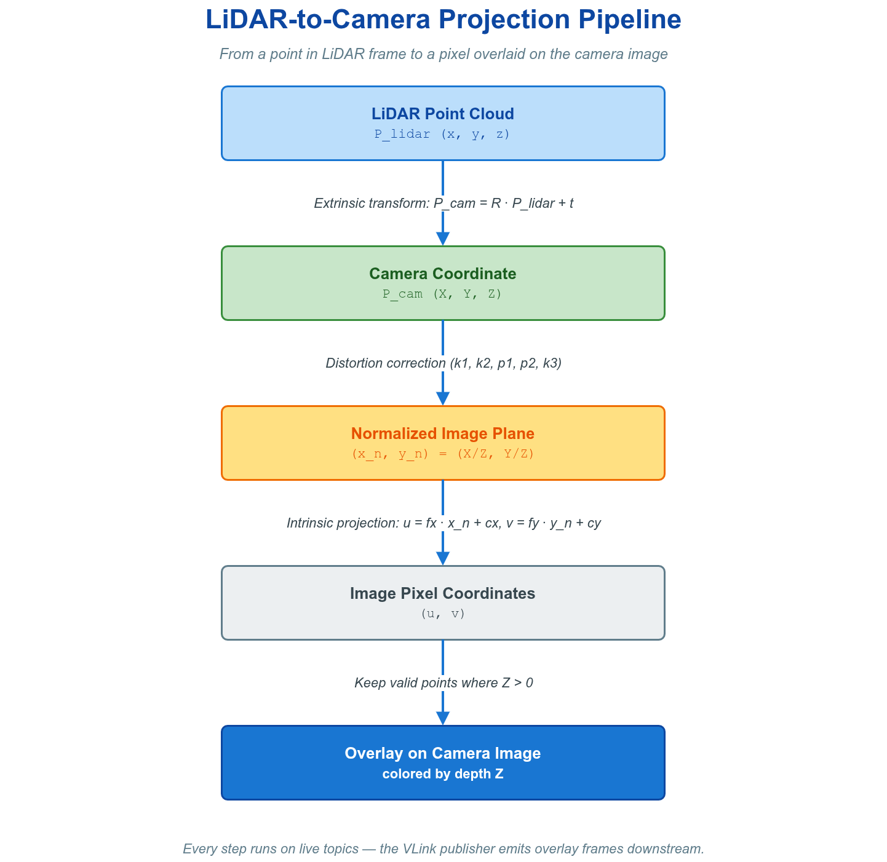
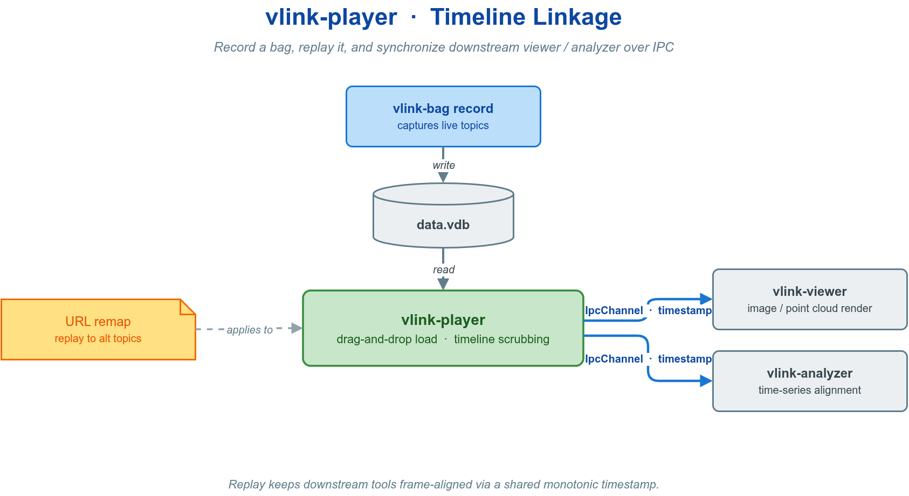

# 📉 11. 可视化（Viewer / WebViz）

当文本与统计不足以表达数据语义——需要观看相机图像、三维点云、目标检测或字段波形——时，VLink 在命令行工具之外提供两层图形化可视化能力：基于 Qt 的桌面 GUI 套件（图像、点云、目标检测等结构化数据的本地图形化呈现与时序分析），以及把实时数据桥接至 Foxglove Studio 与 Rerun 的 Web 可视化工具集（浏览器访问、远程协作、高性能三维渲染）。

两层与命令行工具共享同一套观测设施：启用了 `DiscoveryReporter` 的进程向观测面上报节点，代理层（ProxyAPI / `vlink-proxy`）再聚合 URL、序列化类型与统计信息；这与各后端自身的数据面发现不是同一机制。可视化工具侧通常无需随 topic 后端改代码，但业务 URL 必须满足目标后端契约，专用寻址后端不能只换 scheme。仅需查看话题列表、频率、原始字节，或需脚本/CI 对接时，命令行工具更轻量，见 [命令行工具](10-cli-tools.md)。


---

## 🖼️ 11.1 桌面 Viewer 套件

桌面套件由三个基于 Qt 的程序组成，均运行于 Linux / macOS / Windows，支持高 DPI 缩放，且均为对系统通信状态的只读或低频写入观测器，不参与数据通路本身。仅需查看话题列表、频率、原始字节时，命令行 `vlink-monitor` 更轻量（见 [命令行工具](10-cli-tools.md)）；浏览器端可视化见 §11.2。

| 程序 | 图标 | 定位与入口角色 |
| --- | :---: | --- |
| `vlink-viewer` |  | 监控入口：实时监控全部活跃 URL，左侧 URL 列表、右侧字段属性面板，按快捷键打开相机、3D 等专用窗口 |
| `vlink-player` |  | 回放入口：图形化回放 bag 文件，控制进度与速率，支持 URL 过滤与重映射 |
| `vlink-analyzer` |  | 分析入口：从 bag 中提取字段，将其随时间的变化绘制为时间序列折线图并导出 |

### 🏛️ 11.1.1 架构与数据来源

三个程序均不直接接入中间件传输层，而是经由代理层（ProxyAPI）连接本地或远端的 `vlink-proxy` 进程，由代理聚合整个系统的话题、序列化类型与统计信息后转交前端渲染。这一间接层带来两点性质：观测范围由代理的接入域决定；前端崩溃或退出不影响被观测系统的通信（后端透明性见本章导言）。

三个程序既可独立启动，也可相互联动：viewer 可作为入口拉起 player 与 analyzer；player 回放时，analyzer 的时间轴游标自动跟随播放位置。连接、握手、token 校验等控制面机制由代理层承担，详见 [代理监控与服务发现](12-observability.md)。

### 📥 11.1.2 安装与启动

Viewer 套件默认不编译，需在构建时显式开启，并依赖代理层 `ENABLE_PROXY`：

```cmake
option(ENABLE_VIEWER "Enable viewer" OFF)
```

三项增强能力各由独立 CMake 选项控制，默认值与关闭后的影响如下：

| 增强能力 | CMake 选项 | 默认 | 关闭后的影响 |
| --- | --- | :---: | --- |
| 视频解码（H.264 / H.265 / YUV 等） | `ENABLE_VIEWER_FFMPEG` | `ON` | 相机窗口仅保留 Qt 可直接解码的静态图像；不需要视频解码/FFmpeg 依赖时可显式 `-DENABLE_VIEWER_FFMPEG=OFF` |
| 3D 场景渲染（点云 / 目标检测等） | `ENABLE_VIEWER_OSG` | `ON` | 3D 窗口不可用 |
| 数学表达式求值 | `ENABLE_EXPRTK` | `ON` | 字段映射与曲线表达式停用 |

构建完成后三个程序安装至系统 `bin` 目录，可直接从命令行启动：

```bash
vlink-viewer     # 启动后先弹出连接设置对话框，再进入主窗口
vlink-player     # 可拖入 bag 文件，或由 viewer 的 Play(P) 拉起
vlink-analyzer   # 可由 viewer / player 作为子进程拉起
```

### 🚀 11.1.3 快速开始

实时监控的最小路径如下：

1. **启动数据源**：运行 `vlink-proxy`，或直接运行使用 VLink 的目标应用，由服务发现机制自动接入。
2. **启动 viewer**：执行 `vlink-viewer`，在连接设置中选择 **Controller** 模式，填入与中间件一致的 **Domain ID**，确认。
3. **选话题观测**：主窗口左侧 URL 列表列出全部活跃话题，点选某个 URL，右侧面板实时展示字段内容。

查看图像按 `S`（相机窗口），查看 3D 场景按 `Z`（点云、目标检测、车道线等）。

### 🪟 11.1.4 vlink-viewer 主窗口

**连接设置**　启动时弹出连接设置对话框，常用项如下：

| 参数 | 说明 |
| --- | --- |
| Run as Controller / Listener | 工作模式：Controller（控制器，同一 Domain ID 下唯一）或 Listener（只读监听） |
| Domain ID | 通信域 ID，须与中间件一致 |
| Security Key | 控制面安全密钥，须与代理端一致（启用安全时） |
| Native Mode | 将 Viewer 的 DDS 节点绑定到 `VLINK_DDS_NATIVE_IP`（未设置时为 `127.0.0.1`） |
| Reliable / Tcp / Direct Mode | 可靠传输 / 强制 TCP / 直连 |

**菜单加速键概览**　菜单项均带 `Alt+<字母>` 加速键（菜单文字中带下划线的字母），常用项如下：

| 键 | 功能 | 键 | 功能 |
| --- | --- | --- | --- |
| `S` | 相机帧预览 | `Z` | 3D 场景可视化（Point3D） |
| `J` | 原始字节查看（Raw） | `E` | 编辑字段值并发布 |
| `R` | 录制对话框 | `P` | 回放（拉起 player） |
| `K` | 启动分析器 | `D` | 切换本地 / 离线模式（Local） |
| `V` | 感知可视化（Perception） | `G` | 地图（Map） |
| `X` | 切换状态统计面板（Status Viewer） | `Y` | 切换 Proto/Fbs 目录面板（Proto Viewer） |
| `Q` | 退出 | `A` | 关于 |

> 其余菜单项：`N` 拓扑图、`M` 通信矩阵、`W` DB Browser、`F` Protobuf Decoder、`B` 反馈、`U` 帮助、`L` 下载。

**URL 列表与属性面板**

- **左侧 URL 列表**：列出全部发现的话题，显示序列化类型（proto / flatbuffers / bytes 等）及频率、速率、丢包率、延迟等统计；统计项可勾选切换显示。
- **右侧属性面板**：选中 URL 后以树状结构展示消息字段与值。勾选项控制是否展开数组（Array）、以十六进制显示字节（Hex）、将 timestamp 转为可读时间（Time）等。
- **加载 .proto 目录**：解析动态 Protobuf 消息时，用面板上的「选择」按钮指定 `.proto` 所在目录，再点「重载」生效，支持递归导入。

### 🎥 11.1.5 相机与 3D 可视化

**相机帧预览（S）**　按 `S` 打开相机窗口，预览图像话题。零拷贝 `CameraFrame` 会按 `format()` 自动选择直接渲染或解码路径；Protobuf、FlatBuffers 与原始字节入口的格式下拉框默认使用 `Auto`，可识别内嵌的序列化 `CameraFrame` 或 Qt 支持的静态图像。裸 YUV / 裸 RGB 等无头原始像素流需手动指定格式和尺寸；H.264、H.265、H.266、AV1、MPEG4 等编码视频流需手动指定格式，尺寸由解码器从码流解析。JPEG、PNG、WebP 等静态图像优先走 Qt 解码，Qt 失败且启用 FFmpeg 时会尝试解码 fallback；FFmpeg 还支持 MJPEG、YUV420/422/444、NV12、NV21、YUYV、YVYU、UYVY、BGR888、RGB888 等格式。通用 OpenCV/ROS 数值格式按首通道灰度预览；彩色图像应使用 `rgb8`、`bgr8`、`rgba8`、`bgra8` 等明确通道顺序的编码。支持多通道并排显示、暂停、硬件解码，并可联动 3D 投影视图将点云投影并叠加到图像。关闭 `ENABLE_VIEWER_FFMPEG` 时，零拷贝 `CameraFrame` 的直接渲染格式与 Qt 可解码的静态图像仍可显示，手动裸流和编码视频解码不可用。


相机窗口启用点云联动后，Viewer 使用外参、内参与可选畸变参数把当前 `Point3DDialog` 点集投影到图像坐标，并在本地相机视图上叠加有效点；该路径不产生或重新发布新的话题。



**3D 场景可视化（Z）**　按 `Z` 打开 3D 场景窗口，是自动驾驶场景可视化的核心。`Point3DRenderType` 共定义十四类渲染：

| 渲染类型（内部名） | 内容 |
| --- | --- |
| 点云（`point_cloud`） | 3D 散点，可按强度着色、按范围过滤 |
| 目标检测（`object_detection`） | 3D 边界框、速度向量、跟踪 ID、分类标签 |
| 车道线（`lane_line`） | 折线渲染，按索引自动着色 |
| 预测轨迹（`prediction`） | 含置信度与跟踪 ID 的预测路径 |
| 交通信号灯（`traffic_light`） | 位置、灯色状态、倒计时 |
| 停止线（`stop_line`） | 停止线折线 |
| 交通标志（`traffic_sign`） | 标志位置与类型 |
| 可行驶区域（`freespace`） | 多边形区域填充 |
| 占据栅格（`occupancy_grid`） | 栅格地图单元格着色 |
| 停车位（`parking_slot`） | 停车位多边形 |
| 自车轨迹（`ego_trajectory`） | 自车历史/规划轨迹 |
| 高精地图（`hdmap`） | 高精地图要素 |
| 相机视锥（`camera_frustum`） | 相机视场视锥体 |
| 协方差椭圆（`covariance_ellipse`） | 不确定性椭圆 |


数据来源有两类：VLink 零拷贝类型（`CameraFrame`、`PointCloud`、`ObjectArray` 等）可直接渲染；Protobuf / FlatBuffers 消息需在界面中配置字段映射后渲染。3D 渲染需开启 `ENABLE_VIEWER_OSG`。零拷贝数据类型详见 [零拷贝](06-zerocopy.md)。

**vmsgs 感知预设**　Viewer 随包提供 `perception/vmsgs_config.json`，覆盖常用 vmsgs 目标、雷达、车道边界、道路标线、轨迹、停车位、栅格与车辆 HUD。可通过 Perception 窗口中的配置选择按钮手动加载；成功选择后会保存该路径供后续使用。VDB 不一定内嵌动态 schema，因此回放 Protobuf vmsgs 前仍需在 Viewer 中选择 vmsgs 的 `schemas` 目录（或沿用已保存的 Proto 目录）；FlatBuffers topic 同理需要对应 FBS 目录。配置预设只定义渲染映射，不替代 schema 文件。

### ▶️ 11.1.6 vlink-player 回放

`vlink-player` 是 bag 文件的图形化回放工具，回放出的数据进入通信通路，可被 viewer 等下游观测器接收。



**基本操作**

| 操作 | 说明 |
| --- | --- |
| Open / Close File | 选择或拖入 bag 文件（`.vdb` / `.vdbx` / `.vcap` / `.vcapx`） |
| Play / Pause | 开始、恢复或暂停回放 |
| 进度条 | 拖动跳转，拖动时自动暂停，松开恢复 |
| 速率（Rate） | 调节回放倍率，默认 `1.0` |
| Loop | 循环回放 |
| Native | 将回放创建的 DDS 发布节点绑定到 `VLINK_DDS_NATIVE_IP`（未设置时为 `127.0.0.1`） |
| URL 过滤 | 过滤输入框 + Blacklist 勾选框，按关键字白/黑名单筛选 URL |
| Remap | URL 重映射 |
| Skip Blank | 跳过录制中的空白时间段 |
| Check Point | 跳转到指定时间点（输入目标时间，跳转回放位置） |
| Bag Information | 查看 bag 元信息 |
| 时间模式（Time） | 切换时间戳显示：相对（Real）/ 本地（Local）/ UTC |

**与其他程序联动**　工具栏可拉起 `vlink-viewer`（实时查看回放数据）或 `vlink-analyzer`（分析当前文件）。拉起 analyzer 后，player 的播放进度自动同步至 analyzer 的时间轴游标，无需额外配置。

录制 / 回放概念、文件格式、URL 过滤与重映射的命令行等价用法见 [命令行工具](10-cli-tools.md)；回放 C++ API（`BagReader`、URL 重映射）见 [录制与回放](09-recording.md)。

### 📈 11.1.7 vlink-analyzer 波形分析

`vlink-analyzer` 从 bag 文件中提取任意字段的历史数据，绘制时间序列折线图，并可导出图表。

**三种分析模式**

| 模式 | 分析对象 |
| --- | --- |
| 频率 | 消息发布频率随时间的变化 |
| 数值 | 某个字段的数值随时间的变化 |
| 自定义 | 用数学表达式对字段做运算后绘图（需 `ENABLE_EXPRTK`） |

**分析流程**

1. 选择 **bag 文件** 与对应的 **Proto / FlatBuffers 目录**（解析消息字段所需）。
2. 可选：**加载配置文件**（JSON），预定义待绘制曲线。
3. 点 **Generate** 开始解析并绘图，过程中点 **Interrupt** 中断。
4. 点 **Export** 将当前图表导出为 PNG 图片。

每条曲线由「数据来源 URL + 字段表达式 + 颜色」三要素确定。图表支持 Legend / Grid / Points / Timeline（时间线游标）的显示开关，以及缩放（Both/X/Y）、线型（Line Style：实线 / 虚线 / 脉冲 / 阶梯）、数值记数法（Notation Style：自动 / 浮点 / 科学计数 / 整数，含小数位数）等设置。键盘：`Space` 复位坐标轴缩放；数值/自定义模式下按住 `Ctrl`（或 `X`）临时切到 X 轴缩放、按住 `Shift`（或 `Y`）切到 Y 轴缩放。开启 Timeline 后，与 player 联动时时间线游标随播放位置自动移动。

### 🔄 11.1.8 典型工作流

实时系统监控的最小路径见 §11.1.3。以下为两条涉及多程序联动的工作流。

**bag 离线分析**

1. 用 `vlink-bag record` 或 viewer 录制（`R`）生成 bag 文件。
2. 启动 `vlink-player`，拖入文件。
3. 由工具栏拉起 `vlink-analyzer`，加载 Proto 目录，选字段，点 Generate。
4. 播放 player，analyzer 时间线随播放位置同步；完成后点 Export 导出 PNG 图表。

**离线数据库查看**

1. 在 `vlink-viewer` 中按 `D` 切换至离线模式。
2. 选择未压缩的 `.vdb` 文件（离线模式直接以 SQLite 打开数据库，仅支持 `.vdb`），从历史数据中浏览。
3. 选中 URL 查看字段值，按 `K` 进一步分析。

### ⚠️ 11.1.9 边界条件

- **Controller 单例**：同一 Domain ID 下 Controller 模式的 `vlink-viewer` 仅可启动一个实例，其余须以 Listener 模式接入（见 §11.1.4）。
- **Qt6 依赖**：以 Qt6 构建时须额外提供 `Qt6::OpenGLWidgets` 组件（构建脚本会自动 `find_package` 并链接），缺失时配置阶段即失败。
- **可选增强**：关闭 `ENABLE_VIEWER_FFMPEG` / `ENABLE_VIEWER_OSG` / `ENABLE_EXPRTK` 后分别降级相机、3D 与表达式能力，影响见 §11.1.2。

---

## 🌐 11.2 Web 可视化（WebViz）

WebViz 是 VLink 的可视化桥接工具集，解决"实时数据如何接入主流可视化平台"的问题。它发现代理桥可见的在线 URL，将 VLink 消息转换为目标平台可直接消费的 Schema，并推送至浏览器或桌面可视化器。其设计遵循桥接而非重写：业务侧照常发布消息，WebViz 仅消费发现结果（后端透明性见本章导言）。


WebViz 与桌面 Viewer（§11.1）共用代理数据来源，区别在呈现端：桌面套件以 VLink 自带的 Qt 渲染器本地呈现，WebViz 则把数据导向第三方平台（Foxglove Studio / Rerun），以换取浏览器访问、远程协作与各平台原生的高级可视化能力。

### 🧩 11.2.1 概念与机制

WebViz 支持两个可视化后端，并各自配套一个离线转换工具。后端之间相互独立，可同时运行。

| 后端 | 实时桥接程序 | 前端平台 | 推送协议 | 离线转换工具 | 离线文件 |
| --- | --- | --- | --- | --- | --- |
| Foxglove | `vlink-foxglove` | Foxglove Studio（浏览器/桌面） | WebSocket | `vlink-bag2mcap` | MCAP |
| Rerun | `vlink-rerun` | Rerun Viewer | gRPC | `vlink-bag2rrd` | RRD |

桥接过程由四个阶段构成：


1. VLink 应用经任意后端（`dds://`、`shm://`、`intra://`、`zenoh://` 等）发布消息。
2. WebViz 通过代理桥接收可见 URL 的发现信息；Foxglove 以 `kAuto` 随前端通道订阅按需控制数据转发，Rerun 则以 `kAutoAndObserveAll` 订阅每个发现的 URL，再由白名单与黑名单决定是否处理。
3. 转换层在发现 URL 时选择映射与源 Schema。显式字段映射和专用 `converter` 决定输出；原生 zerocopy 未指定字段时使用内置转换。其余类型可由转换插件处理，未命中时 Foxglove 按源 Schema 透传，Rerun 输出文本日志。ExprTk 表达式属于字段映射内部处理。
4. 经 WebSocket（Foxglove）或 gRPC（Rerun）推送至前端可视化器。

下图展开 `proxy_api` 部署下的发现、订阅、转换与前端数据链路；底部同时标出复用相同转换器的离线 MCAP / RRD 路径。若选择 `proxy_server` 模式，发现与订阅逻辑改为嵌入桥接进程。


转换实现由三个部分组成：`SchemaRegistry` 持有源 Schema，`MessageView` 统一读取 Protobuf、FlatBuffers、JSON 和 zerocopy 字段，两个后端 writer 分别构造 FlatBuffers 与 Rerun 组件。字段路径和表达式随配置解析，URL 到输出的路由随发现信息建立；同一条消息的多个映射共享一次源解析。实时服务与离线工具复用同一转换库，不再各自实现序列化分支。Schema 插件、转换插件、反向发布及 RPC 接口保持原契约；转换插件返回的动态 Schema 同步到实时通道与离线输出。

### 🚀 11.2.2 快速开始

**接入 Foxglove Studio**　启动桥接服务，默认监听 `8765` 端口：

```bash
vlink-foxglove
```

在 Foxglove Studio 中选择 Data Source → Foxglove WebSocket，填入 `ws://localhost:8765`。系统中全部在线 topic 将出现在左侧通道列表，拖入面板即可可视化。

边界条件：Foxglove 客户端须协商 `foxglove.websocket.v1` 子协议。Foxglove Studio 默认满足；自定义客户端须显式声明该子协议，否则握手失败。

**接入 Rerun Viewer**　默认 `spawn` 模式自动启动本地 Viewer 并连接：

```bash
vlink-rerun
```

启动后本地 Rerun Viewer 自动弹出，VLink 数据按实体路径实时呈现。

### ⚖️ 11.2.3 后端选型

两个后端可同时运行，按可视化需求选择。下表给出选型判据。

| 维度 | Foxglove Studio | Rerun Viewer |
| --- | --- | --- |
| 协议 / 前端 | WebSocket / 浏览器或桌面 | gRPC / Rerun Viewer |
| Schema 格式 | Foxglove FlatBuffer Schema | Rerun Archetype |
| 3D 渲染 | 3D 场景面板（SceneUpdate） | 原生 3D 空间视图 |
| 图像 | 图像面板 + 标注叠加 | 图像 + 分割 + 深度 |
| 地理空间 | 地图面板（LocationFix） | GeoPoints + 地图 |
| 时序图表 | Plot 面板 | Scalars / SeriesLine |
| 离线文件 | MCAP | RRD |
| 适用场景 | 远程调试、团队协作、CI 集成 | 本机开发、高性能 3D、多模态融合 |

### 🦊 11.2.4 vlink-foxglove 接口

```bash
vlink-foxglove [OPTIONS]
```

高频参数：

| 参数 | 说明 | 默认值 |
| --- | --- | --- |
| `-p`, `--port` | WebSocket 服务端口 | `8765` |
| `-a`, `--address` | 绑定地址 | `0.0.0.0` |
| `-c`, `--config` | JSON 配置文件路径，仅显式传入时加载 | 空 |
| `-i`, `--filter` | URL 过滤关键字，逗号或带引号空格分隔，大小写不敏感 | 空 |
| `-k`, `--black` | 将 `-i/--filter` 作为黑名单 | `false` |
| `--vlink_msgs` | 自定义消息映射文件，可多次指定，见 §11.2.7 | 空 |
| `--proto_dir` / `--fbs_dir` | Proto / FlatBuffers 定义目录，用于动态解析自定义消息 | 空 |
| `--send_time` | 向前端下发时间更新（时间戳同步） | `false` |
| `--allow_multiple` | 允许同一可执行程序多实例并存（默认单例，再次启动会被拒绝） | `false` |

接入相关的 `--proxy_*` 参数见 §11.2.6。常用命令：

```bash
vlink-foxglove                              # 默认端口启动
vlink-foxglove -p 9090                      # 指定端口
vlink-foxglove -i "camera lidar"            # 白名单：仅相机与激光 topic
vlink-foxglove -i "debug test" -k           # 黑名单：屏蔽调试 topic
vlink-foxglove -c foxglove_config.json --proto_dir ./protos
```

`vlink-foxglove` 另支持连接图（节点拓扑可视化，默认开启）、前端下发消息回写 VLink（`--foxglove_msgs`）、服务调用（`--rpc_msgs`）、参数面板（`--parameters_url`）与时间更新下发（`--send_time`，默认关闭，开启后将 VLink 时间戳同步至前端时间轴），经对应参数或 JSON 配置文件开启。

为防止慢速或异常客户端使待发送队列无界增长，每条 Foxglove 连接的排队数据设有 64 MiB 字节阈值和 4096 条消息阈值；达到任一阈值后按慢客户端关闭。阈值只约束已经排队的消息，空队列中的首条大消息仍可正常发送。

此外，自定义消息映射（见 §11.2.7）可指定两种零转换 converter，二者均以浅拷贝直接透传原始字节、不做反序列化，并按 `timestamp_field` 提取时间戳：`passthrough` 用于原样转发已是 Foxglove 兼容编码的消息；`send_time` 在透传的同时将该消息标记为时间源，配合 `--send_time` 驱动前端时间轴同步。

### 🟣 11.2.5 vlink-rerun 接口

```bash
vlink-rerun [OPTIONS]
```

`vlink-rerun` 提供四种运行模式，按部署形态选择：

| 模式（`-m`） | 行为 | 适用场景 |
| --- | --- | --- |
| `spawn`（默认） | 自动启动本地 Rerun Viewer 并连接 | 本机开发调试 |
| `connect` | 连接到已运行的 Rerun Viewer | Viewer 位于远程机器 |
| `serve` | 作为 gRPC 服务端等待 Viewer 主动连接 | 车端部署、远程查看 |
| `save` | 直接保存为 `.rrd` 文件，不启动 Viewer | 离线采集与后处理 |

高频参数：

| 参数 | 说明 | 默认值 |
| --- | --- | --- |
| `-m`, `--mode` | 运行模式 spawn / connect / serve / save | `spawn` |
| `-a`, `--address` | gRPC 地址（connect 模式） | `rerun+http://127.0.0.1:9876/proxy` |
| `--bind_ip` | 绑定 IP（serve 模式） | `0.0.0.0` |
| `-p`, `--port` | 端口（spawn / serve 模式） | `9876` |
| `--save_path` | 输出路径（save 模式，`.rrd`） | 空 |
| `-c`, `--config` | JSON 配置文件路径 | 空 |
| `-i` / `-k` | URL 过滤 / 黑名单，同 foxglove | 空 |
| `--vlink_msgs` | 自定义消息映射文件，可多次指定 | 空 |
| `--proto_dir` / `--fbs_dir` | Proto / FlatBuffers 定义目录 | 空 |
| `--allow_multiple` | 允许多实例并存（默认单例），同 foxglove | `false` |

`vlink-rerun` 另支持 `spawn` 模式的若干调参（`--spawn_memory_limit`、`--spawn_hide_welcome_screen` 等）与 `--recording_id`，按需查阅 `--help`。常用命令：

```bash
vlink-rerun                                                  # 自动启动本地 Viewer
vlink-rerun -m connect -a "rerun+http://192.168.1.100:9876/proxy"  # 连接远程 Viewer
vlink-rerun -m serve -p 9876                                 # 作为 gRPC 服务端
vlink-rerun -m save --save_path /tmp/recording.rrd          # 保存为 RRD 文件
vlink-rerun -i "camera lidar" --proto_dir ./protos          # 过滤并指定 Proto 目录
```

URL 到实体路径的映射规则：将 `://` 替换为 `/`，传输协议成为实体树顶级命名空间，例如 `dds://camera/front` 映射为 `dds/camera/front`。

### 🔌 11.2.6 接入模式

WebViz 经代理桥接接入 VLink 网络，`vlink-foxglove` 与 `vlink-rerun` 共享同一组 `--proxy_*` 参数。两种接入模式二选一。

| 模式（`--proxy_interface`） | 行为 | 适用场景 |
| --- | --- | --- |
| `proxy_api`（默认） | 作为客户端连接独立运行的 ProxyServer | 多机部署、复用统一代理控制面 |
| `proxy_server` | 进程内直接发现、订阅、发布 VLink topic，省一次中转 | 单机调试、车端本地可视化、更低时延 |

| 参数 | 说明 | 默认值 |
| --- | --- | --- |
| `--proxy_interface` | 接入模式：`proxy_api` 或 `proxy_server` | `proxy_api` |
| `--proxy_role` | 代理桥接角色：`controller` 或 `listener` | `controller` |
| `--proxy_domain_id` | WebViz 使用的 DDS 域 ID | `0` |
| `--proxy_dds_impl` | `proxy_api` 通道使用的 DDS 实现 | `dds` |
| `--proxy_bind_ip` | DDS socket 绑定 IP，空表示任意网卡 | 空 |
| `--proxy_peer_ip` | DDS 单播发现 peer IP | 空 |
| `--proxy_buf_size` | socket 发送 / 接收缓冲区大小（字节），`0` 使用默认值 | `0` |
| `--proxy_mtu_size` | DDS MTU 大小（字节），`0` 使用默认值 | `0` |
| `--proxy_native` | DDS 节点绑定到 `VLINK_DDS_NATIVE_IP`（未设置时为 `127.0.0.1`） | `false` |
| `--proxy_tcp` | DDS 通道使用 TCP 传输 | `false` |
| `--proxy_key` | `proxy_api` 模式的安全密钥，须与外部 ProxyServer 一致 | 空 |
| `--proxy_reliable` | `proxy_api` 数据通道使用可靠模式 | `false` |
| `--proxy_direct` | `proxy_api` 模式启用直接 SHM 数据通道 | `false` |
| `--proxy_no_match_version` | `proxy_api` 模式关闭版本匹配 | `false` |
| `--proxy_data_callback_mode` | 数据回调分发模式：`direct` 或 `queued` | `queued` |
| `--proxy_max_packet_size` | `proxy_server` 下转发的最大 payload（MiB），`0` 不限制 | `0` |
| `--proxy_use_iox` | `proxy_server` 模式启动内置 Iceoryx RouDi | `false` |
| `--proxy_iox_config` | `proxy_server` 模式 Iceoryx TOML 配置路径 | 空 |
| `--proxy_iox_strategy` | `proxy_server` 模式 Iceoryx 内存策略（1 mini / 2 低 / 3 中 / 4 高） | `3` |
| `--proxy_iox_monitoring` | `proxy_server` 模式 Iceoryx monitoring：`on` 或 `off` | `on` |

```bash
vlink-foxglove --proxy_interface proxy_api --proxy_key "my_secret_key"  # 连接独立 ProxyServer
vlink-rerun --proxy_interface proxy_server                              # 进程内直连，减少中转
```

约束：`proxy_server` 模式仅支持 `--proxy_role=controller`；`--proxy_reliable` / `--proxy_direct` 仅 `proxy_api` 模式有效；`--proxy_domain_id` 取值范围 `[0, 255]`；`--proxy_iox_strategy` 取值 `1`/`2`/`3`/`4`。

握手、token 校验、断线自愈与转发策略由代理层统一处理，WebViz 一侧仅需选模式、按需配密钥。代理机制见 [代理监控与服务发现](12-observability.md)。

### 🗂️ 11.2.7 自定义消息映射

实时 WebViz 和离线转换共用字段读取与编码实现。源消息可为 Protobuf、FlatBuffers、零拷贝消息或 `ser=json` 的 JSON。Foxglove 目标直接采用官方 FBS 字段，Rerun 目标直接采用所链接 SDK 的 Archetype 组件字段；两者共享映射语法，但目标结构不同，应分别配置。

```json
{
  "ser": "proto.NavSatFix",
  "schema": "foxglove.LocationFix",
  "encoding": "protobuf",
  "field_mappings": [
    {"source": "latitude", "target": "latitude"},
    {"source": "longitude", "target": "longitude"},
    {"source": "timestamp_us", "target": "timestamp", "time_unit": "us"}
  ]
}
```

通过 `--vlink_msgs ./my_gps.json` 加载，可重复指定多个文件。文件可包含一条映射或映射数组。无效表达式、未知目标类型、拼错的目标字段、重复目标字段会使配置校验失败，服务或离线转换在处理消息前退出。

| 顶层字段 | 说明 |
| --- | --- |
| `ser` | 必填，源序列化类型名 |
| `schema` / `archetype` | Foxglove 完整 Schema 名 / Rerun Archetype 名；使用 `converter` 时可省略 |
| `encoding` | 源编码：`protobuf`、`flatbuffer`、`zerocopy`、`json`；建议显式指定，Foxglove 默认 `flatbuffer`，Rerun 默认 `protobuf` |
| `field_mappings` | 字段绑定；省略时按官方目标字段结构读取源消息 |
| `timestamp_field` / `timestamp_unit` | 源消息时间戳路径与单位，单位为 `s`、`ms`、`us`、`ns`，默认 `us` |
| `converter` | 内置转换器，见 §11.2.8；不能同时配置字段绑定 |
| `url` | 可选 URL 字符串或数组；省略时按 `ser` 匹配 |
| `entity_path` | Rerun 输出实体路径；可让样式、静态标定和动态数据写入同一实体 |
| `static` | Rerun 字段映射是否写为静态数据，默认 `false`；静态数据不带时间轴 |

同一源消息可以输出多个目标。Rerun 多输出默认追加目标名作为子路径，也可逐条指定 `entity_path`；同一 Archetype 写到不同实体路径不会互相覆盖配置。相同选择优先级且目标、转换器和实体路径相同的映射存在歧义时，拒绝该路由。显式映射失败会返回失败，不回退为原始文本。

Rerun 的发布端撤流或桥接断连只更新发现状态，保留实体的最后数据与历史，不自动清空可能由多个源共享的实体。对象失效由业务消息在对应时间轴输出 `Clear` 或组件空数组；静态标定和样式不因发布端断连而撤销。

Rerun 连接恢复沿用同一个 RecordingStream 和 recording ID。SDK 切换连接不会重放已经发送的组件；接收端进程重启后，业务需要重新发布静态标定和样式，断连期间的数据也不保证补发。

| 字段绑定项 | 说明 |
| --- | --- |
| `target` | 官方目标字段路径，如 `pose.position.x`、`positions[][0]`；必填 |
| `source` | 当前源作用域下的字段路径，支持嵌套对象和多层数组下标 |
| `default_value` | 源字段缺失时使用的 JSON 常量，可为标量、对象或数组；显式零、空数组或 `null` 不触发默认值 |
| `expression` | exprtk 数值表达式；与 `source`、`default_value` 至少提供一项 |
| `time_unit` | Foxglove `Time` / `Duration` 的整数源单位，自动拆分 `sec` 和 `nsec`；与消息级 `timestamp_unit` 分开配置 |

数组通过 `[]` 逐元素绑定，`[0]` 等固定下标用于构造数组或覆盖指定元素。固定构造下标必须连续。映射整个对象或数组元素后，其子字段相对于该源对象读取；`_root` 引用原消息，`_value` 引用当前源元素，`_index` 是当前源数组下标。构造目标坐标数组不会改变 `_index`。表达式中的 `ranges._size` 读取数组长度，例如雷达极坐标可写成 `_value * cos(_root.angle_min + _index * _root.angle_increment)`。

对 FlatBuffers table 的直接绑定区分“未写入字段”和“已写入的零值”：未写入时使用绑定的 `default_value`；内联 struct 字段始终存在。表达式按反射语义读取普通 FBS 标量的 schema 默认值；可选标量缺失仍为缺失。整数直接映射保留 64 位精度；表达式采用 double，超出其精确整数范围会警告。

Rerun 包围盒将位置、半尺寸和四元数写到独立组件，例如：

```json
{
  "ser": "proto.Obstacles",
  "archetype": "Boxes3D",
  "encoding": "protobuf",
  "field_mappings": [
    {"source": "objects", "target": "centers"},
    {"source": "center.x", "target": "centers[][0]"},
    {"source": "center.y", "target": "centers[][1]"},
    {"source": "center.z", "target": "centers[][2]"},
    {"source": "objects", "target": "half_sizes"},
    {"expression": "width / 2", "target": "half_sizes[][0]"},
    {"expression": "length / 2", "target": "half_sizes[][1]"},
    {"expression": "height / 2", "target": "half_sizes[][2]"}
  ]
}
```

完整示例见 `webviz/foxglove/etc/vlink_msgs/` 与 `webviz/rerun/etc/vlink_msgs/`。Foxglove 障碍物示例将立方体写到固定 ID 的 `entities[0].cubes`，每条消息替换完整快照；空立方体数组清除旧方框。Rerun 空组件批次同样可清除旧值，亦支持只更新颜色、标签等组件，不要求每次重复发送几何数据。

**官方类型覆盖与数据表示**

Foxglove 以全部 51 个官方 FBS 定义生成反射 Schema：49 个根 table 均可映射，`Time`、`Duration` 是嵌套 struct。嵌套对象、所有标量、枚举、向量和可选字段都由同一编码器处理。`timestamp.sec` / `timestamp.nsec` 可以直接绑定，或用 `time_unit` 从整数时间戳生成。枚举字符串采用官方名称，如 Log 的 `INFO`。

Rerun 注册表在构建时从 SDK 声明生成，0.37.1 包含 51 个 Archetype、271 个组件字段，覆盖几何、图像、视频、Tensor、地图、曲线、状态、体素、高斯和录制属性。组件使用 SDK 的 Arrow 类型与描述符：向量为数组，矩阵为扁平列主序数组，结构体为对象，union 为单键对象，例如 Tensor 的 `data.buffer` 为 `{"F32":[1,2]}`。四元数顺序为 `[x,y,z,w]`。`RecordingInfo` 自动静态写入录制属性路径。

字节字段接受原生 bytes、JSON 整数数组或 `{"base64":"..."}`；多字节数值缓冲按目标数值类型的小端编码读取。RGB/RGBA 颜色数组可直接用于 Rerun `Color`，也可提供官方打包整数。Rerun `ViewCoordinates.xyz` 可写方向数组或 `RDF` 等三字符方向值。枚举字符串区分大小写，采用 SDK 名称。浮点映射保留源格式可表达的 NaN/Infinity，整数映射拒绝小数和溢出。

Rerun `send_time` 只为同一消息实际写入的普通 Archetype 数据行附加 `vlink_time` 时间轴，须与同一 `ser` 的 Archetype 映射配对；单独设置时间不会产生数据行。静态数据忽略时间轴。

Foxglove 的反向发布配置 `foxglove_msgs` 与服务配置 `rpc_msgs` 分别用于前端消息回写和 RPC。前端发布前须通过客户端 `advertise` 声明通道，客户端发布 ID 与服务端展示通道 ID 相互独立。

### ⚡ 11.2.8 内置零拷贝转换

VLink 零拷贝类型无需编写 `field_mappings`，转换层按下表选择默认输出；载荷须满足目标类型的格式要求。

| VLink 零拷贝类型 | Foxglove 目标 | Rerun 目标 | 可选 `converter` |
| --- | --- | --- | --- |
| `CameraFrame` | `foxglove.RawImage` / `foxglove.CompressedImage` / `foxglove.CompressedVideo` | `EncodedImage` / `Image` / `VideoStream` | `camera_frame` |
| `PointCloud` | `foxglove.PointCloud` | `Points3D` | `point_cloud` |
| `OccupancyGrid` | `foxglove.Grid` | `Image`（灰度） | `occupancy_grid` |
| `ObjectArray` | `foxglove.SceneUpdate` | `Boxes3D` | `object_array` |
| `Tensor` | `foxglove.Log`（JSON 元数据） | `Tensor` | `tensor` |
| `AudioFrame` | `foxglove.RawAudio` | `Tensor`（2D，sample × channel） | `audio_frame` |
| `RawData` | `foxglove.Log` | `Asset3D` | `raw_data` |

> 表中类型只要 `ser` 命中即自动转换，无需写 `converter`。两个后端均接受全部 7 个显式 `converter`，用于将具有对应原生二进制布局的自定义消息接到内置路径。

若需要对零拷贝字段进行单位换算、坐标变换或派生计算，可显式配置 `field_mappings` 并将 `encoding` 设为 `zerocopy`。选中的映射始终执行指定目标；空字段列表表示读取同名字段，不会改成原生输出。只有未选择映射时才自动使用上表中的内置路径；需要显式选择原生转换或为其设置时间戳时，使用表中的 `converter`。`converter` 与非空 `field_mappings` 不能同时声明。`ObjectArray.data`、`PointCloud.data`、`OccupancyGrid.data`、`Tensor.shape` / `strides` / `data` 均支持数组下标访问。

一对多映射逐项执行；任一输出失败均报告转换失败，已经产生的其他输出保留，不以默认文本替代失败目标。默认值只用于缺失字段；显式零值、空字符串、空数组和 `null` 不会被默认值覆盖。通用映射按官方目标字段组装姿态，Euler 角转四元数可使用表达式，参见包内障碍物示例。

通用字段映射使用 `vlink::zerocopy::MessageParser` 完成类型识别、边界检查和标量读取；性能敏感的 CameraFrame / PointCloud 专用快速路径直接调用对应容器 codec，不经过通用字段映射。字段映射中的 `int64` / `uint64` 值在进入表达式前保持整数类型，ExprTk 计算需要转成 `double` 且整数超出精确范围时会记录精度警告。

压缩视频 `CameraFrame` 必须按目标协议提供单帧样本：H.264 / H.265 使用 Annex B，AV1 使用 low-overhead bitstream，并且不能包含 B 帧。转换器会拒绝显式标记为 `kStreamB` 的帧，但不会为避免热路径开销而深度重解析码流。

VLink 三平面 YUV444 在 Rerun 路径中转换为 RGB；NV21 重排为 NV12，YVYU、UYVY、VYUY 重排为 YUY2，保留亮度和色度。与 SDK 布局一致的格式直接借用原始载荷。

`RawData` 不携带媒体类型，默认 `Asset3D` 依赖 SDK 识别载荷。OBJ 等无法仅凭字节识别的资产，应显式映射 `blob` 并提供 `media_type`，例如：

```json
{"ser":"RawData","encoding":"zerocopy","archetype":"Asset3D","field_mappings":[
  {"source":"data","target":"blob"},
  {"default_value":"model/obj","target":"media_type"}
]}
```

Foxglove 原生相机频道在第一帧到达后公布实际 Schema，避免先显示 `RawImage` 再发现载荷是压缩图像。运行中图像格式改变时，旧频道撤销并以新 ID 公布实际类型，客户端需要重新订阅。频道修改和通告按同一顺序执行，覆盖发现更新、断连与客户端初始频道列表。

零拷贝类型的定义见 [零拷贝](06-zerocopy.md)。

### 💾 11.2.9 离线转换

将录制的 Bag 文件离线转为可视化格式，无需启动实时桥接。


`vlink-bag2mcap` 将 Bag 转为 MCAP，可在 Foxglove Studio 直接打开：

```bash
vlink-bag2mcap recording.vdb -o recording.mcap

vlink-bag2mcap recording.vdb -o recording.mcap \
  --proto_dir ./protos \
  --vlink_msgs ./obstacle.json \
  --compression zstd
```

`vlink-bag2rrd` 将 Bag 转为 RRD，可在 Rerun Viewer 打开：

```bash
vlink-bag2rrd recording.vdb -o recording.rrd --proto_dir ./protos
```

两工具的公共参数：

| 参数 | 说明 | 默认值 |
| --- | --- | --- |
| `input` | 输入 Bag 文件（`.vdb` / `.vdbx` / `.vcap` / `.vcapx`） | 必填 |
| `-o`, `--output` | 输出文件路径，不能与输入指向同一文件（含软链接、硬链接） | 必填 |
| `--proto_dir` / `--fbs_dir` | Proto / FlatBuffers 定义目录 | 空 |
| `--vlink_msgs` | 自定义消息映射文件，可多次指定 | 空 |
| `--compression` | `none` / `zstd`，仅 `vlink-bag2mcap`；保留的 `lz4` 参数因 VLink 未启用 LZ4 而提示并写出无压缩文件 | `zstd` |

两工具均支持 `--schema_plugin` / `--convert_plugin` / `--convert_plugin_config` 插件参数（见 §11.2.10）。`vlink-bag2rrd` 另有 `--name`（Rerun 应用 ID，默认 `vlink-bag2rrd`）。

`vlink-bag2rrd` 另支持三个时间轴命名参数：`--sequence_timeline`（默认 `seq`，每 URL 递增序号）、`--time_timeline`（默认 `vlink_time`，回放相对时间轴，写入帧录制时间戳）、`--timestamp_timeline`（默认 `timestamp`，消息级时间戳轴），并可通过 `--disable_sequence_timeline` / `--disable_time_timeline` / `--disable_timestamp_timeline` 关闭对应时间轴。各时间轴按帧原始时间戳逐帧写入，不做整体归零。Bag 录制与 MCAP 格式见 [录制与回放](09-recording.md)。

### 🧪 11.2.10 进阶能力

数学表达式引擎　`field_mappings` 的 `expression` 字段支持 [exprtk](https://github.com/ArashPartow/exprtk) 表达式，在转换时完成单位换算、坐标变换等计算，可引用源消息任意数值字段（点分路径如 `velocity.x`，数组下标如 `ranges[0]`）。

| 类别 | 内容 |
| --- | --- |
| 算术 / 比较 / 逻辑 | `+ - * / % ^`、`== != < <= > >=`、`and or not` |
| 三角 / 数学 | `sin cos tan atan2`、`sqrt abs exp log clamp min max`、`if(cond, a, b)` |
| 常量 | `pi` `e` |

典型表达式：

| 用途 | 表达式 |
| --- | --- |
| 弧度转度数并限幅 | `clamp(-45.0, steering_angle_rad * 180.0 / pi, 45.0)` |
| 速度分量合成 | `sqrt(velocity.x^2 + velocity.y^2 + velocity.z^2)` |
| 条件取值 | `if(speed_mps > 0, 0.5 * 1500.0 * speed_mps^2, 0)` |

表达式引擎由 `ENABLE_EXPRTK=ON`（默认）启用；关闭后不含表达式的桥接和字段映射仍可使用，含 `expression` 的配置在启动时校验失败，不会将表达式结果替换为 `0`，也不会自动加载系统中已安装的表达式库。

插件扩展　当 JSON 映射不足以表达需求（复杂组装、动态 Schema、条件分支）时，WebViz 支持两类插件，两个后端共用：`SchemaPlugin` 运行期动态注册自定义 Schema；`ConvertPlugin` 以 C++ 实现自定义转换逻辑。经 `--schema_plugin` / `--convert_plugin` 加载共享库。插件接口与编写见 [C API、扩展与环境变量](13-integration.md)。

### 🛠️ 11.2.11 编译与环境变量

WebViz 默认关闭，需在构建时显式开启，且依赖 `ENABLE_PROXY=ON`：

```cmake
option(ENABLE_WEBVIZ "Enable webviz" OFF)                       # 总开关
option(ENABLE_WEBVIZ_FOXGLOVE "Enable Foxglove for webviz" ON)  # 默认开
option(ENABLE_WEBVIZ_RERUN "Enable Rerun for webviz" OFF)       # 需 vlink-rerun 时显式打开
```

```bash
cmake -B build -DENABLE_WEBVIZ=ON -DENABLE_WEBVIZ_RERUN=ON
cmake --build build -j8
cmake --install build
```

安装后可执行程序位于 `<prefix>/bin/`：`vlink-foxglove`、`vlink-rerun`、`vlink-bag2mcap`、`vlink-bag2rrd`；默认配置与映射示例位于 `<prefix>/etc/vlink/<工具名>/`。

主要依赖：

| 依赖 | 用途 | 适用 |
| --- | --- | --- |
| protobuf / flatbuffers | 消息动态解析 | 两者共用 |
| nlohmann/json | JSON 配置解析 | 两者共用 |
| exprtk | 数学表达式引擎 | 两者共用 |
| websocketpp + asio | WebSocket 服务端 | Foxglove |
| Python 3 | 构建时从 SDK 生成完整组件注册表 | Rerun |
| Arrow | 官方组件的数组编码，沿用 SDK 的 Arrow target | Rerun |
| rerun_sdk | Rerun C++ SDK | Rerun（`vlink-rerun` / `vlink-bag2rrd` 须本机可定位 `rerun_sdk`） |

VLink 的 CMake 基线保持为 3.15。CMake 3.15 下应提供已安装的 `rerun_sdk` 包或预先定义的 `rerun_sdk` target；官方 Rerun C++ SDK 源码包自身要求 CMake 3.16+，因此仅在使用源码包构建时需要更高版本。CMake 参数 `-DRERUN_SDK_DIR=...` 可指向安装前缀、CMake package 目录或官方源码包，缺省值取同名环境变量。Arrow 24 要求 C++20，该要求仅沿 Rerun 依赖链传播，VLink 核心与 Foxglove 保持 C++17。运行时 Viewer 应与 SDK 使用相同版本；当前验证版本为 [Rerun 0.37.1](https://github.com/rerun-io/rerun/releases/tag/0.37.1)。

Foxglove WebSocket 使用 `foxglove.websocket.v1`；二进制头按协议显式读写小端整数。内置 51 个 `.fbs` 已核对 [foxglove-sdk 的 Schema 源目录](https://github.com/foxglove/foxglove-sdk/tree/3e59568654f1245ebbc3be120c61ec02069ca703/schemas/flatbuffer)：截至 2026-09-05，与该提交逐字节一致，保留上游版权与定义，不重写生成协议。

常用环境变量（命令行参数优先级更高）：`VLINK_PROTO_DIR` / `VLINK_FBS_DIR`（对应 `--proto_dir` / `--fbs_dir`）、`VLINK_SCHEMA_PLUGIN` / `VLINK_CONVERT_PLUGIN`（对应 `--schema_plugin` / `--convert_plugin`）。完整环境变量清单见 [C API、扩展与环境变量](13-integration.md)。

---

## 📚 相关文档

- [概述](00-overview.md) —— VLink 总体架构与工具链定位
- [命令行工具](10-cli-tools.md) —— `vlink-*` 命令行工具集（发现、监控、录制、调试、基准）
- [录制与回放](09-recording.md) —— 录制 / 回放 C++ API、文件格式与 MCAP
- [零拷贝](06-zerocopy.md) —— 零拷贝类型与字段定义（可视化映射、3D 渲染字段路径）
- [代理监控与服务发现](12-observability.md) —— 代理通信层、握手与断线自愈、服务发现机制
- [C API、扩展与环境变量](13-integration.md) —— SchemaPlugin / ConvertPlugin 插件系统、完整环境变量清单
