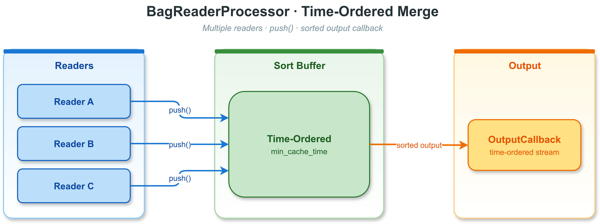

# 12. 录制与回放

VLink 提供完整的消息录制与回放功能，支持将通信消息持久化到文件，
并在离线状态下以任意速率重新播放。这一能力类似于 ROS 的 `rosbag`，
可用于调试、数据分析、仿真回灌等场景。

> **相关文档**：CLI 录制/回放工具 `vlink-bag` 的详细用法参见 [13-cli-tools.md](13-cli-tools.md#137-vlink-bag--数据录制与回放)；可视化回放器参见 [14-viewer.md](14-viewer.md#146-vlink-player--bag-文件回放播放器)；录制相关环境变量参见 [21-environment-vars.md](21-environment-vars.md#218-bag-录制环境变量)。

---

## 12.1 概念与架构


### 12.1.1 录制与回放完整流程


---

## 12.2 文件格式支持

| 格式 | 扩展名             | 后端实现                       | 压缩算法                |
| ---- | ------------------ | ------------------------------ | ----------------------- |
| VDB  | .vdb / .vdbx       | VDBWriter/Reader (SQLite) | LZAV（唯一实际算法）    |
| VCAP | .vcap / .vcapx     | VCAPWriter/Reader              | Zstandard（唯一实际算法）|

`BagWriter::create()` 和 `BagReader::create()` 按文件扩展名自动选择实现：
.vdb / .vdbx 走 SQLite，.vcap / .vcapx 走 MCAP，未知扩展名会创建失败。两种后端共用统一的 `BagWriter` /
`BagReader` 抽象接口和 `Config` 结构。

---

## 12.3 BagWriter — 录制接口

### 12.3.1 概述

`vlink::BagWriter` 继承自 `MessageLoop`，所有写入操作在内部循环线程上异步执行。
`push()` 方法线程安全、非阻塞，适合在通信回调中直接调用。

### 12.3.2 创建 Writer

自动选择格式（`.vdb`/`.vdbx` → SQLite，`.vcap`/`.vcapx` → MCAP）：

```cpp
#include <vlink/extension/bag_writer.h>

auto writer = vlink::BagWriter::create("/data/recording.vdb");
```

带配置创建：

| 参数 | 示例值 | 说明 |
| --- | --- | --- |
| `compress` | `kCompressAuto` | SQLite 后端：`kCompressAuto` 或 `kCompressLzav` → LZAV；MCAP 后端：`kCompressAuto` 或 `kCompressZstd` → Zstd |
| `split_by_size` | `1024LL * 1024 * 1024` | 每 1 GiB 分割 |
| `split_by_time` | `60LL * 1000` | 每 60 秒分割（毫秒） |
| `wal_mode` | `true` | SQLite WAL 模式 |
| `max_task_depth` | `50000` | 默认 20000 |

```cpp
vlink::BagWriter::Config config;
config.compress       = vlink::BagWriter::kCompressAuto;
config.split_by_size  = 1024LL * 1024 * 1024;
config.split_by_time  = 60LL * 1000;
config.wal_mode       = true;
config.tag_name       = "test_run_001";
config.max_task_depth = 50000;

auto writer = vlink::BagWriter::create("/data/recording.vdbx", config);

writer->async_run();
```

### 12.3.3 录制消息

录制一条消息（非阻塞，异步写入）。`push()` 签名为 `push(const vlink::Frame& frame, bool immediate = false)`：先填好 `vlink::Frame` 的字段（`timestamp`、`url`、`ser_type`、`schema_type`、`action_type`、`data`），再整帧推入。`frame.timestamp < 0`（如 `-1`）表示由 writer 自动分配时间戳；`immediate=true` 表示同步写入（绕过队列）。

```cpp
vlink::Bytes payload = serialize_my_msg(msg);

vlink::Frame frame;
frame.timestamp   = -1;   // -1：由 writer 自动分配时间戳
frame.url         = "dds://sensors/lidar";
frame.ser_type    = "demo.proto.PointCloud";
frame.schema_type = vlink::SchemaType::kProtobuf;
frame.action_type = vlink::ActionType::kPublish;
frame.data        = payload;
writer->push(frame);
```

使用自定义时间戳（微秒）：

```cpp
int64_t ts = get_my_timestamp_us();

vlink::Frame frame;
frame.timestamp   = ts;
frame.url         = "dds://sensors/camera";
frame.ser_type    = "raw";
frame.schema_type = vlink::SchemaType::kRaw;
frame.action_type = vlink::ActionType::kPublish;
frame.data        = frame_data;
writer->push(frame);
```

同步写入（绕过队列，阻塞直到写完）：

```cpp
vlink::Frame frame;
frame.timestamp   = -1;   // -1：由 writer 自动分配时间戳
frame.url         = "dds://debug";
frame.ser_type    = "raw";
frame.schema_type = vlink::SchemaType::kRaw;
frame.action_type = vlink::ActionType::kPublish;
frame.data        = debug_data;
writer->push(frame, /*immediate=*/true);
```

流式写入（`operator<<`）：`*writer << frame` 等价于 `push(frame, false)`（始终走异步路径），返回 writer 自身以支持链式；还可 `*writer << schema_data` 等价于 `push_schema(schema_data, false)`。需要同步写入时仍用 `push(frame, true)`。

`<<` 不返回 `push()` 的逐帧时间戳，但会把失败闩锁到流状态：`push()` 返回负值（如 URL 为空、绑定插件同步写失败）或 `push_schema()` 返回 `false` 时，`fail()` 置位、`explicit operator bool()` 变为 `false`；`clear()` 复位。普通 `push()` / `push_schema()` 不改变该状态，其调用方仍用返回值判断。

```cpp
vlink::SchemaData schema = build_schema();

vlink::Frame frame_a;
frame_a.url      = "dds://sensors/lidar";
frame_a.ser_type = "raw";
frame_a.data     = payload_a;

vlink::Frame frame_b = frame_a;
frame_b.data         = payload_b;

*writer << schema << frame_a << frame_b;   // 链式：先嵌入 schema，再写两帧

if (!*writer) {                            // push() 立即返回负值或 push_schema() 返回 false 才闩锁
    VLOG_W("streaming write failed");      // 注意：帧入队后后端 write() 的延迟失败不在此列
    writer->clear();                       // 复位后可继续观察后续写入
}
```

### 12.3.4 压缩类型

`CompressType` 枚举（`bag_writer.h`）：

| 枚举            | 值 |
| --------------- | -- |
| `kCompressNone` | 0  |
| `kCompressAuto` | 1  |
| `kCompressZstd` | 2  |
| `kCompressLz4`  | 3  |
| `kCompressLzav` | 4  |

**各后端的实际行为**（源码参见 `vdb_writer.cc:236`、`vcap_writer.cc:176`）：

| 后端                         | 启用压缩条件                         | 实际使用算法 | 其他枚举值 |
| ---------------------------- | ------------------------------------ | ------------ | ---------- |
| SQLite（.vdb / .vdbx）       | `kCompressAuto` 或 `kCompressLzav`    | **仅 LZAV**      | `kCompressZstd` / `kCompressLz4` / `kCompressNone` 一律不压缩 |
| MCAP（.vcap / .vcapx）       | `kCompressAuto` 或 `kCompressZstd`    | **仅 Zstandard** | `kCompressLz4` / `kCompressLzav` / `kCompressNone` 一律不压缩；若编译时未启用 `ENABLE_ZSTD` 也不压缩 |

**枚举名不代表后端实际支持**：文档里不要写"SQLite 支持 zstd/lz4"或"MCAP 支持 LZAV"。

**其他压缩相关参数**：
- `compress_start_size`（默认 128 字节）：小于此大小的 payload 不压缩。
- `compress_level`：SQLite 后端仅区分 `> 3`（LZAV 高压缩比模式）与 `<= 3`（普通模式）；
  MCAP 后端映射到 `mcap::CompressionLevel`（0=Default、1=Fastest、2=Fast、3=Default、4=Slow、5=Slowest）。
- `ignore_compress_urls`：SQLite writer 中集合内 URL 不压缩；MCAP writer 使用 chunk 级压缩配置，不读取该集合。

### 12.3.5 文件分割

按文件大小分割（每 1 GiB 新建一个文件）；按时间分割（`split_by_time` 单位为毫秒）；文件名附加时间戳（如 `20260318_120000.vdb`）：

```cpp
config.split_by_size = 1024LL * 1024 * 1024;
config.split_by_time = 5LL * 60 * 1000;
config.split_name_by_time = true;
```

注册分割事件回调。第二参数 `before`：`false` 表示新文件创建后触发，`true` 表示旧文件关闭前触发。

```cpp
writer->register_split_callback(
    [](int index, const std::string& filename) {
        VLOG_I("split #", index, " -> ", filename);
    },
    /*before=*/false);
```

SQLite 分割模式只对 `.vdbx` 入口启用；实际数据文件使用 `.vdb` 后缀。分割文件命名规则：
- 主文件：`recording.vdb`
- 分割 1：`recording.1.vdb`（若 `split_name_by_time=true`，使用时间戳文件名）
- 分割 2：`recording.2.vdb`

### 12.3.6 Schema 嵌入

懒加载 schema：当新 `ser_type` 首次写入时按需提供 schema。回调根据 `(ser_type, schema_type)` 返回对应的 schema descriptor。

```cpp
writer->register_schema_callback(
    [](const std::string& ser_type, vlink::SchemaType schema_type) -> vlink::SchemaData {
        return get_schema_for_type(ser_type, schema_type);
    });
```

已知 schema 字节时，推荐直接嵌入：

```cpp
vlink::SchemaData schema;
schema.name = "sensors.LidarPoint";
schema.encoding = "protobuf";
schema.schema_type = vlink::SchemaType::kProtobuf;
schema.data = proto_file_descriptor_bytes;
writer->push_schema(schema);
```

### 12.3.7 Config 参数完整说明

| 参数                    | 默认值       | 说明                               |
| ----------------------- | ------------ | ---------------------------------- |
| `tag_name`              | 空           | 录制标签，存储在文件头             |
| `compress`              | `kCompressNone` | 压缩算法                        |
| `wal_mode`              | `false`      | SQLite WAL 模式，提高崩溃恢复能力  |
| `enable_limit`          | `false`      | 启用行数/字节数上限                |
| `split_name_by_time`    | `false`      | 分割文件名附加时间戳               |
| `sync_mode`             | `false`      | 同步写盘（更安全但更慢）           |
| `optimize_on_exit`      | `false`      | 关闭时执行 VACUUM/优化             |
| `max_row_count`         | 50 亿        | 上限，仅当 `enable_limit=true` 时生效；超出后删除最旧数据并继续写入 |
| `max_bytes_size`        | 512 GiB      | 上限，仅当 `enable_limit=true` 时生效；超出后删除最旧数据并继续写入 |
| `split_by_size`         | 1 GiB        | 按大小分割阈值                     |
| `split_by_time`         | 0（禁用）    | 按时间分割（毫秒）                 |
| `cache_size`            | 4 MiB        | VDB 提交块 / MCAP chunk 大小       |
| `begin_time`            | 0            | 录制起始时间戳（毫秒），0 表示立即开始 |
| `compress_start_size`   | 128 bytes    | 小于此大小不压缩                   |
| `compress_level`        | 3            | 压缩级别（算法相关）               |
| `max_task_depth`        | 20000        | 最大排队写入任务数                 |
| `max_memory_size`       | 2 GiB        | 最大内存缓存大小                   |
| `start_timestamp`       | 0            | 覆盖 bag 起始时间戳（毫秒），0 使用系统时间 |
| `ignore_compress_urls`  | 空集合       | 这些 URL 的消息永不压缩            |

### 12.3.8 全局 Writer（环境变量激活）

```bash
# 必选：设置后首次调用 global_get() 会用默认 Config 自动 create() 并 async_run()
# 路径后缀必须是 .vdb/.vdbx/.vcap/.vcapx，否则全局 Writer 保持禁用
export VLINK_BAG_PATH=/data/auto_record.vdb

# 可选：当某个 Writer 的 Config::tag_name 为空时，写入的 tag_name 会回退到此值
# （未设置时默认为字符串 "Empty"）
export VLINK_BAG_TAG=my_session
```

未设置 `VLINK_BAG_PATH` 或后缀不支持时返回 `nullptr`：

```cpp
auto* gw = vlink::BagWriter::global_get();

if (gw) {
    vlink::Frame frame;
    frame.timestamp   = -1;   // -1：由 writer 自动分配时间戳
    frame.url         = "dds://my/topic";
    frame.ser_type    = "demo.proto.PointCloud";
    frame.schema_type = vlink::SchemaType::kProtobuf;
    frame.action_type = vlink::ActionType::kPublish;
    frame.data        = data;
    gw->push(frame);
}
```

全局 Writer 由进程级静态变量持有，析构时自动 flush。注意全局 Writer 的 Config
固定为默认值（不读取 `VLINK_BAG_TAG` 作为 `Config::tag_name`）；
`VLINK_BAG_TAG` 仅作为所有 Writer 在 `Config::tag_name` 为空时的兜底。

### 12.3.9 按路径取共享 Writer（filter_get）

按路径在全局表中获取/创建一个 Writer。若已存在则直接返回；不存在时会用默认 Config 创建并自动 `async_run()`，后缀不支持时返回 `nullptr`。最后一个引用释放时自动从全局表注销。

```cpp
auto writer = vlink::BagWriter::filter_get("/data/recording.vdb");

if (writer) {
    writer->push(...);
}
```

---

## 12.4 BagReader — 回放接口

### 12.4.1 概述

`vlink::BagReader` 继承自 `MessageLoop`，回放在内部循环线程上驱动。
可配置回放速率、时间范围、循环次数和 URL 过滤。

### 12.4.2 创建 Reader

自动选择格式（只读模式）、可读写模式（支持 `tag()` 等写操作）、尝试修复损坏的文件：

```cpp
#include <vlink/extension/bag_reader.h>

auto reader = vlink::BagReader::create("/data/recording.vdb");

auto rw_reader = vlink::BagReader::create("/data/recording.vdb",
                                          /*read_only=*/false);

auto fixed_reader = vlink::BagReader::create("/data/corrupt.vdb",
                                             /*read_only=*/true,
                                             /*try_to_fix=*/true);
```

### 12.4.3 读取 Bag 信息

打开后立即可读取文件元数据（无需启动回放）：

```cpp
const auto& info = reader->get_info();
VLOG_I("file: ", info.file_name);
VLOG_I("duration: ", info.total_duration / 1000, " seconds");
VLOG_I("messages: ", info.message_count);
VLOG_I("version: ", info.version);
VLOG_I("compression: ", info.compression_type);

for (const auto& meta : info.url_metas) {
    VLOG_I("  ", meta.url,
           " count=", meta.count,
           " freq=", meta.freq, " Hz",
           " size=", meta.size / 1024, " KB",
           " action=", static_cast<int>(meta.action_type),
           " ser=", meta.ser_type);
}
```

### 12.4.4 注册回调

消息输出回调（核心）。回调参数为整帧 `const vlink::Frame&`：`frame.timestamp` 为录制时的微秒时间戳，`frame.data` 为序列化 payload（有效期仅限回调内）。

```cpp
reader->register_output_callback(
    [](const vlink::Frame& frame) {
        VLOG_I("ts=", frame.timestamp, " url=", frame.url,
               " size=", frame.data.size());
    });
```

状态变化回调。枚举值：`kStopped=0`、`kPaused=1`、`kPlaying=2`。

```cpp
reader->register_status_callback([](vlink::BagReader::Status s) {
    const char* names[] = {"stopped", "paused", "playing"};
    VLOG_I("playback status: ", names[(int)s]);
});
```

就绪回调（文件解析完成、可以开始播放）：

```cpp
reader->register_ready_callback([] {
    VLOG_I("bag reader ready");
});
```

完成回调：

```cpp
reader->register_finish_callback([](bool interrupted) {
    VLOG_I("playback finished, interrupted=", interrupted);
});
```

### 12.4.5 启动回放

必须先启动循环线程，再配置回放参数：

| 参数 | 示例值 | 说明 |
| --- | --- | --- |
| `rate` | `1.0` | 实时速率 |
| `times` | `1` | 播放 1 次 |
| `begin_time` | `0` | 从头开始（毫秒，相对录制起点） |
| `end_time` | `0` | 播放到结尾（毫秒，相对录制起点；0 表示不限） |
| `skip_blank` | `true` | 跳过静默间隔 |
| `filter_urls` | `{...}` | 仅播放指定输出 URL（为空则播放全部） |

如果绑定了 `BagPluginInterface`，`filter_urls` 匹配 `convert_url_meta()` 后的回放 URL。

```cpp
reader->async_run();

vlink::BagReader::Config cfg;
cfg.rate        = 1.0;
cfg.times       = 1;
cfg.begin_time  = 0;
cfg.end_time    = 0;
cfg.skip_blank  = true;
cfg.filter_urls = {"dds://sensors/lidar", "dds://sensors/camera"};

reader->play(cfg);
```

### 12.4.6 回放控制

```cpp
reader->pause();
reader->resume();
reader->pause_to_next();
reader->jump(5 * 1000LL, /*rate=*/1.0, /*times=*/1,
             /*force_to_play=*/true);
reader->stop();
```

查询当前状态：

| 方法 | 说明 |
| --- | --- |
| `get_status()` | 返回当前回放状态枚举 |
| `get_timestamp()` | 当前消息时间戳（毫秒，相对于录制起点；注意 OutputCallback 给的时间戳是微秒） |
| `get_real_timestamp()` | 实际经过时间 |
| `is_jumping()` | 是否正在跳转中 |

```cpp
vlink::BagReader::Status status = reader->get_status();
int64_t current_ts   = reader->get_timestamp();
int64_t elapsed_real = reader->get_real_timestamp();
bool is_jumping      = reader->is_jumping();
```

### 12.4.7 速率控制示例

| 参数 | 示例值 | 说明 |
| --- | --- | --- |
| `rate` | `2.0` / `0.5` | 2x 加速 / 0.5x 慢速 |
| `force_delay` | `10` | 强制固定时间间隔（毫秒，忽略原始时间戳）；默认 -1 表示使用原始时间戳间隔 |
| `times` | `kInfinite` (`-1`) | 无限循环回放 |
| `auto_quit` | `true` | 播放完成后自动退出循环线程 |

```cpp
cfg.rate = 2.0;
cfg.force_delay = 10;
cfg.times = vlink::BagReader::kInfinite;
cfg.auto_quit = true;
```

### 12.4.8 时间范围过滤

只播放第 10 秒到第 30 秒的内容（`begin_time`/`end_time` 单位：毫秒，相对录制起点）：

```cpp
cfg.begin_time = 10 * 1000LL;
cfg.end_time   = 30 * 1000LL;
reader->play(cfg);
```

### 12.4.9 文件完整性与修复

所有操作异步执行（后台线程），返回 `std::future`：

| 方法 | 说明 |
| --- | --- |
| `check()` | 检查文件完整性 |
| `reindex()` | 重建索引（适用于索引损坏但数据完好的情况） |
| `fix(false)` | 修复损坏文件 |
| `fix(true)` | 完全重建（从头扫描数据） |

```cpp
auto check_future = reader->check();
bool ok = check_future.get();

auto reindex_future = reader->reindex();
bool reindexed = reindex_future.get();

auto fix_future = reader->fix(/*rebuild=*/false);
bool fixed = fix_future.get();

auto rebuild_future = reader->fix(/*rebuild=*/true);
bool rebuilt = rebuild_future.get();
```

### 12.4.10 Proto Schema 检测

获取 bag 中内嵌的所有 Protobuf Schema：

```cpp
auto schemas = reader->detect_schema();
for (const auto& s : schemas) {
    VLOG_I("schema: ", s.name);
}
```

获取特定 URL 的序列化类型（返回值例如 `"demo.proto.PointCloud"` 或 `"raw"`）：

```cpp
std::string ser = reader->get_ser_type("dds://sensors/lidar");
```

### 12.4.11 流式顺序读取（游标）

`BagReader` 提供一条**同步、拉取式**的顺序读游标，配合 `operator>>` 逐帧遍历。游标按录制顺序逐帧返回，**不带帧间延时、不依赖 `async_run()` / `play()`**（内部使用独立的后端语句 / 迭代器），适合离线批处理、转码、导出等场景；它与定时回放的 `play()` / `register_output_callback()` 互为独立路径。

游标只识别 `Config::filter_urls` 与 `Config::begin_time` / `Config::end_time` 时间窗，忽略 `rate`、`times`、`auto_*`、`skip_blank`；已绑定的 `BagPluginInterface` 的 URL 重映射与排除仍生效，但其 `on_read()` 拦截（仅回放路径）不会触发。

```cpp
auto reader = vlink::BagReader::create("/data/recording.vdb");

reader->open_cursor();          // 或 open_cursor(cfg) 应用 URL/时间窗过滤

vlink::Frame frame;
while (*reader >> frame) {       // 读到结尾或出错时退出
    // frame 已填好 ser_type / schema_type；frame.data 是浅拷贝视图，
    // 有效期仅到下一次 read_next() / operator>>，需要更久请自行复制。
    VLOG_I("ts=", frame.timestamp, " url=", frame.url, " size=", frame.data.size());
}

if (reader->fail()) {
    VLOG_W("cursor read error");
}
```

接口说明：

| 接口 | 说明 |
| --- | --- |
| `bool open_cursor(const Config& cfg)` | 定位/重置游标并应用过滤；返回是否就绪 |
| `bool open_cursor()` | 全量（不过滤）打开游标 |
| `bool read_next(vlink::Frame& out)` | 读下一帧；首次使用会按默认 `Config` 自动打开游标 |
| `BagReader& operator>>(vlink::Frame& out)` | `read_next()` 的流式别名，支持 `while (*reader >> frame)` |
| `bool eof()` / `bool fail()` | 是否到达结尾 / 上次操作是否失败 |
| `explicit operator bool()` | `!eof() && !fail()`，仍可读时为 `true` |

> 游标为单线程使用，不应与同一 reader 上正在进行的 `play()` 会话并发驱动。带过滤的窗口（`begin_time` / `end_time`，单位毫秒）会按帧的微秒时间戳裁剪。

---

## 12.5 VCAPWriter / VCAPReader — MCAP 格式

MCAP（Message Capture Archive Protocol）是面向时间序列消息的索引化二进制格式，
可被 Foxglove Studio 直接打开。VLink 的 MCAP 支持需要编译时启用 `ENABLE_ZSTD`
才能启用压缩。

### 12.5.1 VCAPWriter

显式使用 `VCAPWriter`；更常见的做法是直接调用 `BagWriter::create("/path.vcap")`。
`kCompressZstd` 在 MCAP 后端下实际启用 Zstd 压缩。

```cpp
#include <vlink/extension/vcap_writer.h>

vlink::BagWriter::Config config;
config.compress = vlink::BagWriter::kCompressZstd;

auto writer = std::make_shared<vlink::VCAPWriter>("/data/recording.vcap", config);
writer->async_run();

vlink::Frame frame;
frame.timestamp   = -1;   // -1：由 writer 自动分配时间戳
frame.url         = "dds://sensors/lidar";
frame.ser_type    = "demo.proto.PointCloud";
frame.schema_type = vlink::SchemaType::kProtobuf;
frame.action_type = vlink::ActionType::kPublish;
frame.data        = lidar_data;
writer->push(frame);
```

### 12.5.2 VCAPReader

```cpp
#include <vlink/extension/vcap_reader.h>

auto reader = std::make_shared<vlink::VCAPReader>("/data/recording.vcap");
reader->register_output_callback([](const vlink::Frame& frame) {
});
reader->async_run();

vlink::BagReader::Config cfg;
cfg.rate = 1.0;
reader->play(cfg);
```

MCAP 格式特点：
- 文件头包含 Schema 和 Channel 元数据，支持离线自省。
- 支持随机访问（索引化）。
- 可被 Foxglove Studio 直接打开可视化。
- 与 `.vdb` 共用同一个 `Config` 结构和 `play()` / `register_output_callback()` 接口；
  压缩算法固定为 Zstandard。

---

## 12.6 BagProcessor — 数据面时间滑窗重排（插件辅助工具）

### 12.6.1 功能概述

`vlink::BagProcessor` 是 `BagPluginInterface`（见 [19-extensions.md](19-extensions.md)）派生插件（读 / 写两侧通用）的**核心辅助工具**：把帧按其**真实数据面时间**做时间滑窗重排后，再经插件的 `do_callback()` 转发出去——写侧在落盘前重排，读侧在回放前重排。

涉及**两种时间**，二者可能不一致（乱序录制、异步 I/O、发送端批量、传输重排）：

- `Frame::timestamp`——帧向下游携带的规范录制 / 回放时间。
- **数据面时间**——藏在 payload header 里的真实事件时间，作为 `push()` 的**独立重排键**单独传入：`BagProcessor` 按它升序输出，而 `Frame::timestamp` 原样随帧带出。

它是**纯重排缓冲**：插件自己从 header 取出数据面时间（必要时反序列化）作为 `push()` 第一个参数；`BagProcessor` 不碰 payload、不涉及序列化层。压缩 / 解压、改 url / ser 等变换由插件在 `push()` 前或输出回调里自行完成。`Frame` 即全局统一的 `vlink::Frame`（见 [11-base-library.md](11-base-library.md)），按 `const Frame&` 传递。

典型使用场景：

- 写插件：录制前按数据面时间重排乱序到达的帧、并可顺带转码 / 改 url。
- 读插件：回放前按数据面时间重排、并可顺带解压。
- 多分片 / 多源 bag 的离线时序合并（把录制时间当作重排键推入即可）。

### 12.6.2 原理



内部维护一个基于 `std::deque` 的排序队列和一个独立的处理线程。
插件线程通过 `push(data_timestamp, frame)` 将帧送入队列，处理器在缓冲窗口
（`min_cache_time`，按 `data_timestamp` 跨度计）满足后，按 `data_timestamp` 顺序逐帧输出到 `OutputCallback`。

工作流程：

1. 插件在 `on_write()` / `on_read()` 里取出数据面时间，`push(data_timestamp, frame)`（线程安全）
2. 队列按 `data_timestamp` 有序插入
3. 处理线程检查队列首尾 `data_timestamp` 之差是否超过 `min_cache_time`
4. 满足条件后，按 `data_timestamp` 顺序立即依次输出；只做重排，不按原始消息间隔 sleep
5. 某一来源静默时，用真实墙钟（入队 steady 时间）兜底排空，保证流不卡住
6. 当缓存大小达到 `max_cache_size` 上限时，`push()` 会阻塞等待消费

### 12.6.3 Config 配置

```cpp
struct Config final {
    int64_t min_cache_time{500};
    int64_t max_cache_size{1024LL * 1024LL * 256};
};
```

| 参数              | 默认值    | 说明                                                     |
| ----------------- | --------- | -------------------------------------------------------- |
| `min_cache_time`  | 500 ms    | 队列首尾 `data_timestamp` 之差达到此值后才开始输出，吸收乱序 |
| `max_cache_size`  | 256 MiB   | 缓存字节上限，超过时 push() 阻塞等待消费                 |

`min_cache_time` 的选取建议：

- 设置过小（如 100 ms）可能导致乱序帧未完全排序就被输出
- 设置过大（如 5000 ms）会增加内存占用和输出延迟
- 通常 500 ms 可满足大多数场景

### 12.6.4 API 说明

帧类型是全局统一的 `vlink::Frame`（定义于 `impl/types.h`，单一 `timestamp`）：

```cpp
struct Frame final {
    int64_t timestamp{-1};         // 规范录制 / 回放时间（微秒；写侧 < 0 表示自动分配）
    std::string url;
    std::string ser_type;          // 写侧有效；读侧通常留空
    vlink::SchemaType schema_type{vlink::SchemaType::kUnknown};
    vlink::ActionType action_type{vlink::ActionType::kUnknownAction};
    vlink::Bytes data;
};
```

| 方法                                            | 说明                                                          |
| ----------------------------------------------- | ------------------------------------------------------------- |
| `BagProcessor(const Config& config = Config())` | 构造并启动内部处理线程                                        |
| `~BagProcessor()`                               | 析构，按数据面时间刷新剩余帧并停止处理线程                    |
| `register_output_callback(OutputCallback&& cb)` | 注册重排后的输出回调，仅支持一个                              |
| `push(int64_t data_timestamp, const Frame& frame)` | 按 `data_timestamp`（数据面时间，重排键）推入一帧，线程安全，可能阻塞 |

`OutputCallback` 即 `vlink::FrameCallback`：

```cpp
using OutputCallback = vlink::FrameCallback;   // MoveFunction<void(const vlink::Frame& frame)>
```

### 12.6.5 基本使用示例

流程：配置处理器（500 毫秒缓冲窗口，最大 256 MiB 内存缓存） → 注册输出回调（按时序接收排序后的消息） → 创建多个分割文件的 Reader → 将每个 Reader 的输出汇入 processor → 启动回放。processor 析构时会刷新剩余缓存。

```cpp
#include <vlink/extension/bag_reader.h>
#include <vlink/extension/bag_processor.h>
#include <vlink/base/logger.h>

int main() {
    vlink::Logger::init("processor-demo");

    vlink::BagProcessor::Config proc_cfg;
    proc_cfg.min_cache_time = 500;
    proc_cfg.max_cache_size = 256 * 1024 * 1024;

    vlink::BagProcessor processor(proc_cfg);

    processor.register_output_callback([](const vlink::Frame& f) {
        VLOG_I("[ordered] ts=", f.timestamp, " url=", f.url, " size=", f.data.size());
    });

    auto reader_a = vlink::BagReader::create("/data/recording_0.vdb");
    auto reader_b = vlink::BagReader::create("/data/recording_1.vdb");

    // 合并回放：reader 输出的时间即重排键。
    auto fan_in = [&](const vlink::Frame& frame) { processor.push(frame.timestamp, frame); };

    reader_a->register_output_callback(fan_in);
    reader_b->register_output_callback(fan_in);

    reader_a->async_run();
    reader_b->async_run();

    vlink::BagReader::Config cfg;
    cfg.rate = 1.0;
    cfg.auto_quit = true;

    reader_a->play(cfg);
    reader_b->play(cfg);

    reader_a->wait_for_quit();
    reader_b->wait_for_quit();

    return 0;
}
```

### 12.6.6 多传感器分割文件合并回放

假设录制时按 1 GiB 分割，产生了 3 个文件。为每个文件创建 Reader 并连接到 processor，回放到 VLink 通信网络，同时启动所有 Reader 后等待所有回放完成。

```cpp
#include <vlink/extension/bag_reader.h>
#include <vlink/extension/bag_processor.h>
#include <vlink/vlink.h>

int main() {
    vlink::Logger::init("merge-playback");

    std::vector<std::string> files = {
        "/data/drive_0.vdb",
        "/data/drive_1.vdb",
        "/data/drive_2.vdb"
    };

    vlink::BagProcessor processor;

    vlink::Publisher<vlink::Bytes> pub("dds://replay/merged");

    processor.register_output_callback([&](const vlink::Frame& f) { pub.publish(f.data); });

    std::vector<std::shared_ptr<vlink::BagReader>> readers;

    for (const auto& file : files) {
        auto reader = vlink::BagReader::create(file);

        reader->register_output_callback(
            [&](const vlink::Frame& frame) { processor.push(frame.timestamp, frame); });

        reader->async_run();
        readers.push_back(reader);
    }

    vlink::BagReader::Config cfg;
    cfg.rate = 1.0;

    for (auto& reader : readers) {
        reader->play(cfg);
    }

    for (auto& reader : readers) {
        reader->wait_for_quit();
    }

    return 0;
}
```

### 12.6.7 注意事项

- `push()` 是线程安全的，可从多个 Reader 的回调线程并发调用
- 当缓存达到 `max_cache_size` 上限时，`push()` 会阻塞直到消费线程释放空间
- 析构时会自动刷新队列中的剩余消息并停止处理线程
- 仅支持注册一个 `OutputCallback`，后续注册会替换前一个
- `OutputCallback` 在内部处理线程中调用，回调内不应执行长耗时操作

---

## 12.7 支持的序列化格式

| `ser_type` 字符串示例          | 序列化格式         | 说明                                |
| ------------------------------ | ------------------ | ----------------------------------- |
| `"demo.proto.PointCloud"`      | Protocol Buffers   | 具体消息类型名，`schema_type` 应为 `kProtobuf` |
| `"demo.fbs.CameraFrame"`       | FlatBuffers        | 具体表类型名，`schema_type` 应为 `kFlatbuffers` |
| `"cdr"`                        | CDR（DDS 格式）    | DDS 传输原生格式                    |
| `"raw"`                        | POD / 原始字节     | 无序列化，直接存储，`schema_type` 通常为 `kRaw` |
| `"string"`                     | std::string        | UTF-8 字符串，`schema_type` 通常为 `kRaw` |
| `"custom"`                     | 自定义             | 自定义负载；若无 protobuf/fbs 家族信息，`schema_type` 通常为 `kRaw` |

> 完整的序列化格式列表参见 [06-serialization.md](06-serialization.md)。

对 bag/proxy/viewer/webviz/monitor 这一整条运行时链路来说，`schema_type` 是显式路由信息。
只有确实拿不到 schema 家族时才应使用 `kUnknown`；对 `raw` / `text` / `json` / 自定义字节流，应该优先写入 `kRaw`。

录制时 `ser_type` 原样存入文件，回放时原样提供给 `OutputCallback`，
应用层根据此字段选择对应的反序列化方式。

---

## 12.8 与 VLink 通信 API 集成

在 VLink 节点内录制时，将 BagWriter 注入通信回调是最简洁的模式：

```cpp
#include <vlink/vlink.h>
#include <vlink/extension/bag_writer.h>

auto writer = vlink::BagWriter::create("/data/lidar.vdb");
writer->async_run();

vlink::Subscriber<LidarPoint> sub("dds://sensors/lidar");
sub.listen([&](const LidarPoint& msg) {
    vlink::Bytes bytes;
    vlink::Serializer::serialize(msg, bytes);

    vlink::Frame frame;
    frame.timestamp   = -1;   // -1：由 writer 自动分配时间戳
    frame.url         = "dds://sensors/lidar";
    frame.ser_type    = "demo.proto.PointCloud";
    frame.schema_type = vlink::SchemaType::kProtobuf;
    frame.action_type = vlink::ActionType::kPublish;
    frame.data        = bytes;
    writer->push(frame);
    process_lidar(msg);
});
```

回放时反向操作：

```cpp
auto reader = vlink::BagReader::create("/data/lidar.vdb");

vlink::Publisher<LidarPoint> pub("dds://sensors/lidar");

reader->register_output_callback(
    [&](const vlink::Frame& frame) {
        if (frame.url == "dds://sensors/lidar") {
            LidarPoint msg;

            if (vlink::Serializer::deserialize(frame.data, msg)) {
                pub.publish(msg);
            }
        }
    });

reader->async_run();

vlink::BagReader::Config cfg;
cfg.rate = 1.0;
reader->play(cfg);
```

---

## 12.9 与 CLI 工具 vlink-bag 的关联

`vlink-bag` 是命令行工具，底层用的正是本章讨论的 `BagWriter` / `BagReader` /
`VCAPWriter` / `VCAPReader` API。完整参数见
[13-cli-tools.md](13-cli-tools.md#137-vlink-bag--数据录制与回放)。

八个子命令：`record` / `play` / `info` / `clone` / `check` / `reindex` / `fix` / `tag`。

```bash
# 录制（录所有发现到的 URL）
vlink-bag record /data/recording.vdb

# 录制指定 URL
vlink-bag record /data/sensors.vdb -u dds://sensors/lidar dds://sensors/camera

# 带压缩录制（SQLite 下启用 LZAV，MCAP 下启用 Zstd）
vlink-bag record /data/recording.vdb -p

# 回放（默认实时速率）
vlink-bag play /data/recording.vdb

# 2x 加速回放
vlink-bag play /data/recording.vdb -r 2.0

# 其余子命令
vlink-bag info    /data/recording.vdb
vlink-bag check   /data/recording.vdb
vlink-bag reindex /data/recording.vdb
vlink-bag fix     /data/recording.vdb
vlink-bag clone   /data/recording.vdb /data/copy.vdb
vlink-bag tag     /data/recording.vdb new_tag_name
```

通过环境变量快速开启进程级录制（详见上节"全局 Writer"）：

```bash
export VLINK_BAG_PATH=/data/auto_record.vdb
./my_vlink_app
```

---

## 12.10 完整录制示例

配置 LZAV 压缩（SQLite 后端唯一实际启用的压缩算法），`compress_level > 3` 启用 LZAV 高压缩比模式，每 1 GiB 分割，WAL 模式。注册终止信号后进入录制循环，模拟传感器数据写入。

```cpp
#include <vlink/extension/bag_writer.h>
#include <vlink/base/logger.h>
#include <vlink/base/utils.h>

int main() {
    vlink::Logger::init("bag-demo");

    vlink::BagWriter::Config config;
    config.compress           = vlink::BagWriter::kCompressLzav;
    config.compress_level     = 5;
    config.split_by_size      = 1024LL * 1024 * 1024;
    config.split_name_by_time = true;
    config.wal_mode           = true;
    config.tag_name           = "field_test_2026";

    auto writer = vlink::BagWriter::create("/data/field_test.vdb", config);

    writer->register_split_callback(
        [](int idx, const std::string& fname) {
            VLOG_I("new split file: ", fname);
        }, false);

    writer->async_run();

    vlink::Utils::register_terminate_signal([&](int) {
        writer->quit();
    });

    int seq = 0;
    while (writer->is_running()) {
        vlink::Bytes data = vlink::Bytes::create(256);
        std::memset(data.data(), seq & 0xFF, 256);

        vlink::Frame frame;
        frame.timestamp   = -1;   // -1：由 writer 自动分配时间戳
        frame.url         = "intra://sensor/imu";
        frame.ser_type    = "raw";
        frame.schema_type = vlink::SchemaType::kRaw;
        frame.action_type = vlink::ActionType::kPublish;
        frame.data        = data;
        writer->push(frame);
        seq++;

        std::this_thread::sleep_for(std::chrono::milliseconds(10));
    }

    writer->wait_for_quit();
    VLOG_I("recording saved, splits=", writer->get_split_index());
    return 0;
}
```

## 12.11 完整回放示例

```cpp
#include <vlink/extension/bag_reader.h>
#include <vlink/base/logger.h>

int main(int argc, char* argv[]) {
    vlink::Logger::init("bag-play");

    if (argc < 2) {
        VLOG_F("usage: ", argv[0], " <bag_file>");
    }

    auto reader = vlink::BagReader::create(argv[1]);
    const auto& info = reader->get_info();

    VLOG_I("file: ", info.file_name);
    VLOG_I("duration: ", info.total_duration / 1000, " s");
    VLOG_I("messages: ", info.message_count);

    for (const auto& m : info.url_metas) {
        VLOG_I("  [", m.url, "] ",
               m.count, " msgs @ ",
               m.freq, " Hz, action=", static_cast<int>(m.action_type),
               ", ser=", m.ser_type);
    }

    reader->register_status_callback([](vlink::BagReader::Status s) {
        if (s == vlink::BagReader::kStopped) {
            VLOG_I("playback complete");
        }
    });

    reader->register_output_callback(
        [](const vlink::Frame& frame) {
            VLOG_D("ts=", frame.timestamp, " url=", frame.url,
                   " size=", frame.data.size());
        });

    reader->async_run();

    vlink::BagReader::Config cfg;
    cfg.rate      = 1.0;
    cfg.times     = 1;
    cfg.auto_quit = true;
    reader->play(cfg);

    reader->wait_for_quit();
    return 0;
}
```
