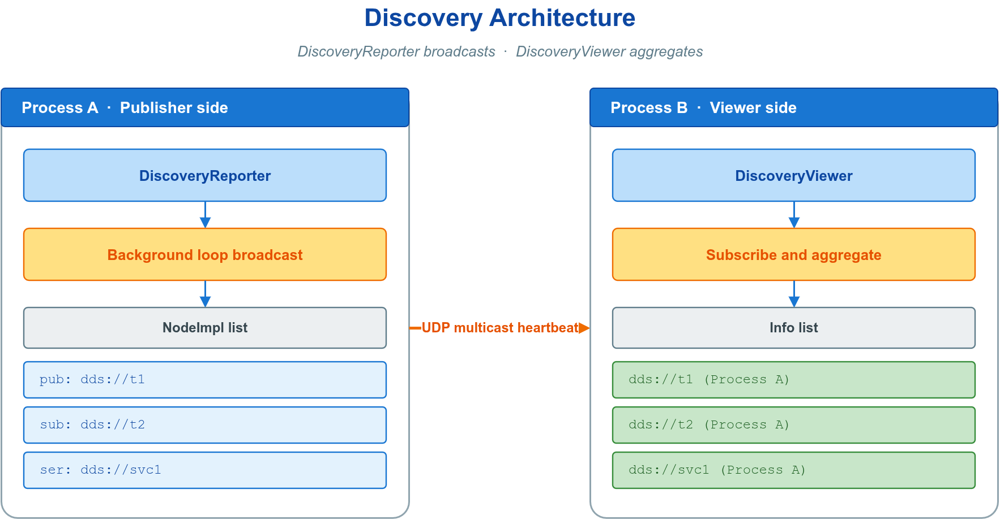
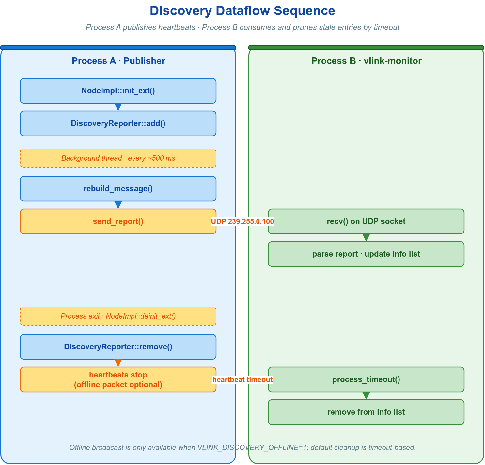
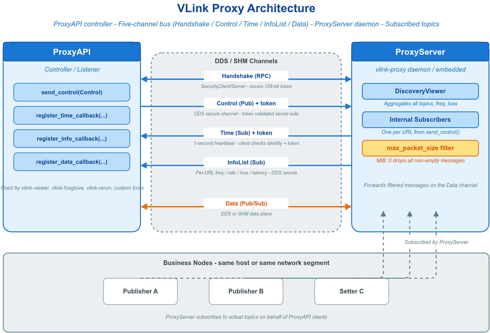
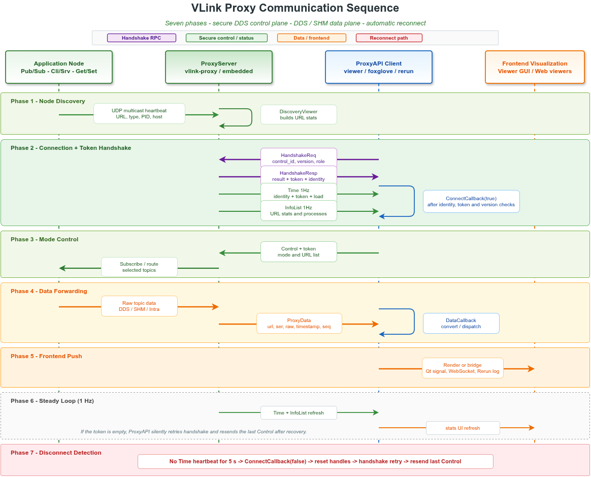

# 🧿 12. 服务发现与代理监控

观测一个运行中的分布式系统，需回答两个递进的问题：系统里**存在哪些端点**，以及这些端点上**正在流动什么数据**。VLink 用两层机制分别覆盖：服务发现（Discovery）自动感知全网拓扑，回答"有什么"；代理监控（Proxy）旁路聚合话题载荷与统计，回答"在传什么"，并能跨越网段边界搬运数据或反向注入。两者共享同一发现数据——Proxy 内部即运行一个发现视图来枚举待订阅话题，CLI 工具 `vlink-list` / `vlink-monitor` 亦建立在同一发现层之上。发现是基础，代理是其在跨网段、需要载荷数据时的延伸。



二者的能力边界如下，按需取用：

| 维度 | 🛰️ 服务发现 Discovery | 🔭 代理监控 Proxy |
| ---- | ---- | ---- |
| 回答的问题 | 系统中存在哪些端点（拓扑） | 端点上流动的数据与统计 |
| 数据内容 | URL、传输类型、角色、进程 | 话题统计 + 原始消息载荷 |
| 网段范围 | 同一发现网络（组播可达） | 可跨网段（单播 / 路由可达） |
| 方向 | 只读感知 | 观测 + 录制 + 注入 |
| 部署 | 内嵌库调用，零额外进程 | 需服务端（独立进程或嵌入业务进程） |
| 开销 | 周期组播，极低 | 订阅全部话题并转发，较高 |

---

## 🛰️ 12.1 服务发现：概念与机制

服务发现使任一进程自动感知系统中全部活跃的 VLink 端点：URL（话题地址）、传输类型、所属进程，以及实时的上线与下线。机制基于 UDP 组播——节点运行时自动注册，断线由超时自动剔除，全程无需中心注册表或人工配置。发现层是 `vlink-list`、`vlink-monitor` 与代理监控的统一数据来源。

进程内若存在 VLink 节点，运行时即周期性地以 UDP 组播将本进程的端点拓扑广播至发现网络。监听者解码这些报文并按 URL 聚合，便得到一张全局拓扑视图，回答四个问题：

- **传输类型**：当前活跃的 URL 及其 scheme（`dds://`、`shm://`、`intra://` 等）。
- **角色**：每个 URL 上承担的角色——发布者 / 订阅者 / 客户端 / 服务端 / 写端 / 读端。
- **进程归属**：承载该 URL 的进程标识——主机名、PID、进程名、IP，以及可选的 CPU 占用。
- **生命周期**：新节点周期广播即被纳入视图，停止广播超过心跳时限则被剔除。


两个边界条件需明确：

- 对端上报与超时剔除均由运行时自动完成，应用代码不参与心跳维护。
- 启用安全的节点，以及 `dds://` 配合 CDR 序列化的节点，默认不参与上报，不出现在发现视图中。

整条发现链路（节点上报 → 组播 → 监听者聚合 → 回调通知）的时序如下：



---

## 🚀 12.2 服务发现：快速开始

`DiscoveryViewer` 是发现机制的用户入口，继承自 `MessageLoop`。使用分为四步：构造时选定过滤模式、注册回调、`async_run()` 启动后台接收、按需读取快照。`async_run()` 是接收数据的前提，未启动则回调不会触发、快照为空。

```cpp
#include "vlink/extension/discovery_viewer.h"
#include <chrono>
#include <thread>

vlink::DiscoveryViewer viewer(vlink::DiscoveryViewer::kFilterAvailable);

viewer.register_callback([](const std::vector<vlink::DiscoveryViewer::Info>& list) {
  for (const auto& info : list) {
    VLOG_I("url=", info.url, " ser=", info.ser_type,
           " hosts=", info.process_list.size());
  }
});

viewer.async_run();

std::this_thread::sleep_for(std::chrono::seconds(1));
auto snapshot = viewer.get_info_list();
```

回调在 viewer 的 `MessageLoop` 线程上执行，入参列表仅在回调内有效；需在回调外使用时先复制一份。多处需要同一张拓扑视图时，在应用层共享同一个 `DiscoveryViewer` 实例（或经 `std::shared_ptr` 持有）即可，无需逐处构造。

---

## 🧩 12.3 服务发现：核心 API

下表列出 `DiscoveryViewer` 的高频接口。除回调外，亦可在任意时刻经 `get_info_list()` 主动拉取一份当前快照，二者基于同一份内部状态。

| 方法 | 语义 |
| ---- | ---- |
| `DiscoveryViewer(FilterType type = kFilterNone)` | 构造，指定过滤模式（见 12.4） |
| `void register_callback(Callback&&)` | 注册 `void(const std::vector<Info>&)` 回调，拓扑变化时触发；重复注册仅最后一次生效 |
| `bool async_run()` | 启动后台接收（继承自 `MessageLoop`），接收数据的前提 |
| `std::vector<Info> get_info_list()` | 拉取当前拓扑快照 |
| `std::string get_ser_type(const std::string& url) const` | 查询某 URL 当前的序列化类型名 |
| `SchemaType get_schema_type(const std::string& url) const` | 查询某 URL 的 schema 家族 |

静态工具方法用于将角色位掩码格式化为可读标签，以及查询发现网络地址：

| 静态方法 | 语义 |
| ---- | ---- |
| `convert_type_to_view(uint32_t type)` | 将角色位掩码格式化为可读标签 |
| `convert_type_to_view(uint32_t type, const std::vector<Process>&)` | 同上，并附带进程列表的完整标签 |
| `convert_type(std::string_view str)` | 将角色字符串（`"Pub"`、`"Sub"` 等）转回 `ImplType` 位 |
| `get_listen_address()` | 返回发现子系统使用的 UDP 组播/广播地址（默认 `239.255.0.100`） |

---

## 🔎 12.4 服务发现：过滤模式（FilterType）

构造时唯一需要决策的参数是过滤模式，它决定哪些广播被纳入快照。默认 `kFilterNone`。

| FilterType | 行为 | 适用场景 |
| ---- | ---- | ---- |
| `kFilterNone` | 保留全部发现到的端点 | 查看全网拓扑 |
| `kFilterAvailable` | 屏蔽来自其它主机的本地传输（`intra://`、`shm://`、`shm2://`）端点，本机端点全部保留 | 监控工具的常用选择 |
| `kFilterNative` | 仅保留与 viewer 同一主机名的端点 | 仅关心本机 |

判据：本地传输（`intra://`、`shm://`、`shm2://`）的端点仅在本机内可达，远端主机上报的此类端点对本机无实际意义。`kFilterAvailable` 据此剔除跨主机的本地传输噪声、同时保留本机全部端点，最适合通用监控；`kFilterNative` 则进一步排除一切非本机端点。

---

## 📦 12.5 服务发现：快照数据结构

回调入参与 `get_info_list()` 返回的均为 `Info` 列表。每个 `Info` 描述一个 URL 的聚合信息，并内含承载它的进程列表 `Process`。

| `Info` 字段 | 含义 |
| ---- | ---- |
| `url` | 完整 VLink URL，如 `"dds://camera_image"` |
| `type` | 该 URL 上全部角色的位掩码，经 `convert_type_to_view` 转为可读标签 |
| `ser_type` | 序列化类型名，如 `"demo.proto.PointCloud"`、`"standard"` |
| `schema_type` | 粗粒度 schema 家族：`kProtobuf` / `kFlatbuffers` / `kRaw` / `kZeroCopy` / `kUnknown` |
| `process_list` | 承载此 URL 的进程列表 |

| `Process` 字段 | 含义 |
| ---- | ---- |
| `type` | 该进程在此 URL 上承担角色的位掩码（Publisher / Subscriber / Server 等） |
| `host` | 主机名 |
| `pid` | 进程 ID |
| `name` | 进程名 |
| `ip` | 主机 IP 地址 |
| `profiler` | CPU 利用率百分比，`-1` 表示未启用（需 `VLINK_PROFILER_ENABLE=1`） |

`type` 是位掩码而非单一角色：同一 URL 可在同进程或跨进程上被多种角色同时使用（例如既有发布者又有订阅者），展示时统一经 `convert_type_to_view` 转换。

下例实时打印每个 URL 的角色与序列化类型，并逐进程输出 PID / 主机 / IP，在 Profiler 启用时附带 CPU 占用：

```cpp
#include "vlink/extension/discovery_viewer.h"
#include <chrono>
#include <iostream>
#include <thread>

int main() {
  vlink::DiscoveryViewer viewer(vlink::DiscoveryViewer::kFilterAvailable);

  viewer.register_callback([](const std::vector<vlink::DiscoveryViewer::Info>& list) {
    std::cout << "=== Topology (" << list.size() << " urls) ===" << std::endl;

    for (const auto& info : list) {
      std::cout << "[" << info.url << "] "
                << "role=" << vlink::DiscoveryViewer::convert_type_to_view(info.type)
                << " ser=" << info.ser_type << std::endl;

      for (const auto& proc : info.process_list) {
        std::cout << "  " << proc.name << " pid=" << proc.pid
                  << " host=" << proc.host << " ip=" << proc.ip;

        if (proc.profiler >= 0) {
          std::cout << " cpu=" << proc.profiler << "%";
        }

        std::cout << std::endl;
      }
    }
  });

  viewer.async_run();

  while (true) {
    std::this_thread::sleep_for(std::chrono::seconds(5));
  }

  return 0;
}
```

---

## 📶 12.6 服务发现：传输状态事件

发现层回答的是"系统中存在哪些端点"。若需进一步掌握单个端点底层传输的运行状态——匹配对端的出现与消失、截止时间错过、liveliness 变化——则使用节点的 `register_status_handler()`。

该机制仅 DDS 系列后端生效（`dds://`、`ddsc://`、`ddsr://`、`ddst://`）；其它后端调用将打印警告并被忽略。回调接收 `Status::BasePtr`，在回调内经 `status->get_type()` 分发、经 `status->as<...>()` 安全下转以读取详情字段。

写方（Publisher / Server / Setter）与读方（Subscriber / Client / Getter）的状态类型如下：

| 状态类型 | 侧 | 触发条件 | 关键字段 |
| ---- | ---- | ---- | ---- |
| `kPublicationMatched` | 写方 | 匹配的订阅者出现或消失 | `current_count`、`total_count` |
| `kSubscriptionMatched` | 读方 | 匹配的发布者出现或消失 | `current_count`、`total_count` |
| `kOfferedDeadlineMissed` / `kRequestedDeadlineMissed` | 写 / 读 | 未在截止时间内发出 / 收到数据 | `total_count`、`last_instance_handle` |
| `kLivelinessLost` | 写方 | liveliness 时限内未声明 | `total_count` |
| `kLivelinessChanged` | 读方 | 对端存活状态变化 | `alive_count`、`not_alive_count` |
| `kOfferedIncompatibleQos` / `kRequestedIncompatibleQos` | 写 / 读 | 发现 QoS 不兼容的对端 | `last_policy_id` |
| `kSampleRejected` / `kSampleLost` | 读方 | 样本因资源限制被拒 / 送达前丢失 | `total_count`（`kSampleRejected` 另有 `last_reason`） |

Deadline、Liveliness 等语义由 QoS 策略定义，配置方式见 [QoS 配置](05-qos.md)。代表性回调如下：

```cpp
auto sub = vlink::Subscriber<std::string>::create_shared("dds://my_topic");

sub->register_status_handler([](const vlink::Status::BasePtr& status) {
  switch (status->get_type()) {
    case vlink::Status::kSubscriptionMatched: {
      auto matched = status->as<vlink::Status::SubscriptionMatched>();
      VLOG_I("matched publishers: current=", matched->current_count);
      break;
    }

    case vlink::Status::kRequestedDeadlineMissed: {
      auto missed = status->as<vlink::Status::RequestedDeadlineMissed>();
      VLOG_W("deadline missed: count=", missed->total_count);
      break;
    }

    default: {
      VLOG_I("status: ", *status);
      break;
    }
  }
});
```

---

## 🛠️ 12.7 服务发现：CLI 入口与配置

发现机制是若干现成工具的底层数据源，多数场景无需自行编写监控程序。

| 入口 | 形态 | 用途 |
| ---- | ---- | ---- |
| `vlink-list` | 一次性查询 | 打印当前全网拓扑表格后退出 |
| `vlink-monitor` | 持续监控（类 `top`） | 实时刷新，支持按 URL 子串过滤（`-i`） |
| 应用内嵌 | 库调用 | 在应用内构造 `DiscoveryViewer`，无需单独进程 |
| 代理聚合 | 代理层 | 代理内部运行 viewer 聚合多进程拓扑，供远程监控 |

参数与输出示例见 [CLI 工具](10-cli-tools.md)；代理聚合见 12.8 起。

发现行为经环境变量调节（完整说明见 [集成与扩展](13-integration.md)）：

| 环境变量 | 作用 |
| ---- | ---- |
| `VLINK_DISCOVER_DISABLE=1` | 禁用本进程的发现上报 |
| `VLINK_DISCOVER_NATIVE=1` | 仅限本机发现（组播绑定 loopback） |
| `VLINK_PROFILER_ENABLE=1` | 启用 CPU Profiler，使 `Process::profiler` 有效 |

若需让单个节点不出现在发现视图，可在 `init()` 之前关闭其上报。这要求节点以延迟初始化方式构造：

```cpp
auto publisher = vlink::Publisher<std::string>::create_shared(
    "dds://internal_topic", vlink::InitType::kWithoutInit);
publisher->set_discovery_enabled(false);
publisher->init();
```

---

## 🔭 12.8 代理监控：概念与组件模型

Proxy 是 VLink 的旁路监控、录制与注入中间层。业务节点照常使用 `dds://`、`shm://` 等原生传输通信，Proxy 在不改动业务代码的前提下聚合全部话题的载荷与统计，并转发给监控、可视化、录制与回放工具。



VLink 原生传输要求通信双方在同一网段或 DDS 域内能直接发现彼此。当存在路由、防火墙或 VLAN 隔离，或需要在远端集中观测时，原生发现无法跨越边界。Proxy 在业务侧引入一个服务端，由它在本地订阅全部话题（待订阅话题来自 12.1 的发现视图），再通过一条受控链路把数据与统计转发到远端客户端。

体系由三个组件构成，按部署形态选用：

| 组件 | 形态 | 职责 |
| ---- | ---- | ---- |
| `vlink-proxy` | 独立守护进程 | 一条命令拉起服务端，部署最简，同机仅一个实例 |
| `ProxyServer` | C++ 服务端库 | 将服务端嵌入业务进程，省去独立进程 |
| `ProxyAPI` | C++ 客户端库 | 监控、可视化、录制、注入工具连接服务端的入口 |

链路划分为两个平面，职责与安全级别不同：

| 平面 | 承载内容 | 特性 |
| ---- | ---- | ---- |
| 控制面 | 握手、心跳、控制指令、话题统计 | 经 DDS 安全扩展加密；自动握手、协商会话凭据、断线自愈 |
| 数据面 | 转发与注入的原始消息载荷 | 可选 reliable / TCP / SHM 直连，客户端与服务端配置须一致 |

数据面搬运的是原始序列化字节（`Bytes`，回调内以浅拷贝视图交付）；当载荷本身为零拷贝容器序列化结果时，其布局细节见 [零拷贝](06-zerocopy.md)，普通使用无需关心。

---

## 🚀 12.9 代理监控：快速开始

监控端的最小流程为四步：填写 `Config`、注册回调、`async_run()` 启动事件循环、`send_control()` 选择工作模式。

```cpp
#include <vlink/external/proxy_api.h>
#include <vlink/base/logger.h>

int main() {
    vlink::ProxyAPI::Config cfg;
    cfg.role         = vlink::ProxyAPI::kController;  // 控制端可发控制与数据
    cfg.domain_id    = 0;                             // 须与服务端一致
    cfg.security_key = "my_secret_key";               // 须与服务端一致

    vlink::ProxyAPI api(cfg);

    api.register_connect_callback([&api](bool connected) {
        if (connected) {
            vlink::ProxyAPI::Control ctrl;
            ctrl.mode = vlink::ProxyAPI::kObserveAll;  // 观察域内全部话题
            api.send_control(ctrl);
        }
    });

    api.register_info_callback([](const std::vector<vlink::ProxyAPI::Info>& list) {
        for (const auto& info : list) {
            VLOG_I("url=", info.url, " freq=", info.freq, " rate=", info.rate,
                   " loss=", info.loss, " latency=", info.latency);
        }
    });

    api.register_data_callback([](const vlink::ProxyAPI::Data& data) {
        VLOG_I("url=", data.url, " size=", data.raw.size(), " seq=", data.seq);
    });

    api.async_run();        // 启动事件循环；连接、心跳、重连均在此线程
    api.wait_for_quit();
    return 0;
}
```

服务端在目标机上启动一行命令：

```bash
vlink-proxy -d 0 -k "my_secret_key"
```

连接建立后，客户端每秒收到一次话题统计（`InfoCallback`）；选择观察模式后还会收到原始数据（`DataCallback`）。链路中断约 5 秒触发 `ConnectCallback(false)`，框架在后台自动重连并重发上一次控制指令，无需用户干预。

完整的连接、心跳、控制与数据流转时序如下：



---

## 🧩 12.10 代理监控：ProxyAPI 核心 API

`ProxyAPI` 为客户端类。构造后调用 `async_run()`（后台线程）或 `run()`（当前线程）启动，`quit()` / `wait_for_quit()` 退出。`Config` 一经构造不可更改。

### 👤 12.10.1 角色与工作模式

角色在构造时由 `Config::role` 固定，决定客户端能否驱动服务端：

| 角色 | 权限 |
| ---- | ---- |
| `kController` | 可调用 `send_control()` / `send_data()`，驱动服务端 |
| `kListener` | 只读观察；`send_control()` / `send_data()` 立即返回 `false` |

工作模式由控制端通过 `Control::mode` 切换，决定服务端订阅哪些话题、是否转发数据、是否接受注入：

| 模式 | 用途 |
| ---- | ---- |
| `kObserveAll` | 观察域内全部话题：监控面板、Foxglove/Rerun 全量桥接 |
| `kObserveOne` | 仅观察 `url_meta_list` 指定的单个话题 |
| `kRecord` | 录制指定话题，配合落盘工具 |
| `kPlay` | 回放注入：经 `send_data()` 灌入数据，服务端转发到真实话题 |
| `kEdit` | 编辑注入：服务端转发控制端注入的数据 |
| `kAuto` / `kAutoAndObserveAll` | 观察 `url_meta_list` 指定话题并接受控制端注入；后者改为观察全部话题 |
| `kOffline` | 离线：服务端释放全部订阅 |

### 📞 12.10.2 回调注册

五个回调各注册一次，框架在对应事件触发时调用。回调入参（尤其 `Data::raw`）仅在回调内有效，需外带时先复制。

| 方法 | 触发时机 |
| ---- | ---- |
| `register_connect_callback(void(bool connected))` | 连接状态变化（首个心跳建立 / 断线约 5 秒） |
| `register_error_callback(void(Error error))` | 错误状态翻转时（见 12.10.5） |
| `register_time_callback(void(uint64_t sys_time, uint64_t boot_time))` | 每秒心跳，携带服务端系统时间与启动时长（微秒） |
| `register_info_callback(void(const std::vector<Info>&))` | 每秒一次的话题统计列表 |
| `register_data_callback(void(const Data&))` | 转发模式下每条数据 |

### 🎛️ 12.10.3 控制与注入

| 方法 | 语义 |
| ---- | ---- |
| `bool send_control(const Control& ctrl, bool async = true)` | 设置模式与关注话题，控制端专用。`async=true`（默认）投递到事件循环后即返回；`false` 同步发布并返回真实结果 |
| `bool send_data(const Data& data)` | 向数据通道注入一条消息（`kPlay` / `kEdit` 用），控制端专用 |

`send_control()` 被内部缓存，断线重连后自动重发。`send_data()` 返回 `false` 不一定是链路故障，也可能是对端暂无订阅者，或注入数据未填全 `ser` 与 `schema` 路由元数据。

### 📥 12.10.4 查询接口

连接与统计可随时主动查询：

| 方法 | 返回 |
| ---- | ---- |
| `bool is_connected()` | 是否已连接服务端 |
| `Error get_current_error()` | 当前错误码（`kNoError` 为正常） |
| `Mode get_current_mode()` | 最近一次请求的工作模式 |
| `int64_t get_latency()` | 数据通道延迟（纳秒；direct/SHM 模式返回 0） |
| `SampleLostInfo get_lost()` | 数据通道丢包统计 |
| `std::string get_proxy_version()` | 服务端上报的 VLink 版本字符串 |
| `std::string get_current_hostname()` | 已连服务端的主机名 |
| `double get_current_cpu_usage()` / `get_current_memory_usage()` | 服务端 CPU / 内存占用（0~100） |
| `static bool is_support_shm()` | 当前构建是否支持 SHM（用于决定 `direct`） |

两个静态辅助函数把心跳时间戳格式化为可读串：

```cpp
api.register_time_callback([](uint64_t sys_time, uint64_t boot_time) {
    VLOG_I("sys=", vlink::ProxyAPI::get_format_sys_time(sys_time),
           " boot=", vlink::ProxyAPI::get_format_boot_time(boot_time));
});
```

### ⚠️ 12.10.5 错误码

错误仅在状态翻转时通过 `ErrorCallback` 上报。除配置类错误外，多数可自愈：

| 错误码 | 触发条件 | 自动恢复 |
| ---- | ---- | ---- |
| `kNoError` | 连接正常 | — |
| `kControlError` | 控制标识与服务端不匹配 | — |
| `kReliableCompError` / `kTcpCompError` / `kDirectCompError` | 客户端与服务端的 `reliable` / `enable_tcp` / `direct` 设置不一致 | 否，需统一配置后重连 |
| `kMultiProxyError` | 同一域内检测到多个 ProxyServer，或服务端身份突变 | 部分，真实多服务端需移除多余实例 |
| `kVersionCompError` | 客户端与服务端 VLink 版本不一致 | 是，版本恢复后自动清错 |
| `kTokenError` | 控制面握手未通过 | 是，后台自动重握手直至成功 |

### 🗂️ 12.10.6 Info 与 Data 字段

`Info`（每条话题统计）常用字段：

| 字段 | 类型 | 说明 |
| ---- | ---- | ---- |
| `url` | `std::string` | 话题 URL，如 `"dds://sensor/lidar"` |
| `ser` | `std::string` | 序列化类型名，如 `"demo.proto.PointCloud"` |
| `schema` | `SchemaType` | 粗粒度 schema 家族（`kProtobuf` / `kFlatbuffers` 等） |
| `status` | `Status` | `kActive` / `kInActive` / `kPending` / `kInvalid` |
| `freq` / `rate` | `float` / `uint64_t` | 频率（条/秒）/ 吞吐（字节/秒），滑动平均 |
| `loss` / `latency` | `float` / `float` | 丢包率 [0,1] / 延迟（毫秒；`-1` 无样本，`-2` 无效） |
| `process_list` | `std::vector<Process>` | 收发该话题的进程列表（`type` 角色位掩码 / `host` / `pid` / `name` / `ip`） |

`Data`（每条转发或注入数据）字段：`url`、`ser`、`schema`、`raw`（`Bytes` 原始载荷）、`timestamp`（微秒）、`seq`（序号）。注入时 `ser` 与 `schema` 必须显式填全。

---

## ⚙️ 12.11 代理监控：ProxyAPI::Config

构造 `ProxyAPI` 时传入。控制面行为由前几项确定，数据面三项必须与服务端逐一对齐：

| 字段 | 默认 | 说明 |
| ---- | ---- | ---- |
| `role` | `kController` | 客户端角色（见 12.10.1） |
| `domain_id` | `0` | DDS 域 ID，须与服务端一致 |
| `security_key` | `""` | 控制面对称密钥；空串使用内置默认槽位，显式设置时须与服务端一致 |
| `reliable` / `enable_tcp` / `direct` | `false` | 数据通道选项，三者均须与服务端完全一致 |
| `match_version` | `true` | 是否校验 VLink 版本字符串一致 |

跨网段单播发现使用 `allow_ip`（本地绑定 IP）与 `peer_ip`（对端 IP），留空时走组播（部署示例见 12.16）。其余高级字段（`dds_impl` 等）保持默认即可。

---

## 💻 12.12 代理监控：vlink-proxy 命令行

`vlink-proxy` 是 `ProxyServer` 的独立可执行版本，在终端直接启动，同机仅一个实例。命令行参数与 `ProxyServer::Config` 一一对应：

| 选项 | 说明 |
| ---- | ---- |
| `-d, --domain_id INT` | DDS 域 ID（0~255，默认 0），须与客户端一致 |
| `-k, --key STRING` | 安全密钥（默认空），须与客户端一致 |
| `-r, --reliable` | 可靠 QoS（须与客户端一致） |
| `-t, --tcp` | TCP 传输（须与客户端一致） |
| `-g, --direct` | SHM 直连数据通道（须与客户端一致） |
| `-a, --async` | 在 MessageLoop 线程异步转发数据（默认内联转发） |
| `-x, --max_packet_size FLOAT` | 单条消息最大转发大小（MiB，默认 4.0） |
| `-b, --bind_ip` / `-p, --peer_ip` | 本地绑定 IP / 单播对端 IP（跨子网用） |
| `-s, --buf_size INT` / `-e, --mtu_size INT` | DDS 收发缓冲区 / MTU 字节数（默认 0 = 内置默认） |
| `-n, --native` | 限制 DDS 流量到 127.0.0.1（本机测试） |
| `-c, --iox_config PATH` | 指定 Iceoryx TOML 配置；提供此项即拉起内嵌 RouDi（direct/SHM 所需） |
| `-l, --iox_strategy INT` | Iceoryx 内存策略（1 低 / 2 中 / 3 高，默认 2） |
| `-m, --iox_monitoring on\|off` | Iceoryx 监控开关（默认 `on`） |
| `--dds_impl STRING` | DDS 实现选择（`dds` / `ddsc`） |
| `--runnable [NAME...]` | 加载 RunablePluginInterface 插件 |

> SHM 直连（`-g`）需 Iceoryx RouDi 在运行：可由 `-c` 让代理内嵌拉起，或外部预先启动 `iox-roudi`。

```bash
# 最简启动
vlink-proxy

# 指定域与密钥
vlink-proxy -d 1 -k "secure_key_2026"

# TCP + 可靠，绑定本机 IP，放行最大 8 MiB 包
vlink-proxy -r -t -b 192.168.1.100 -x 8.0
```

---

## 🧱 12.13 代理监控：ProxyServer 嵌入式用法

无需独立进程时，用 `ProxyServer` 库将服务端嵌入业务进程。每个进程仅一个实例，构造后调用 `async_run()` / `run()` 启动。`Config` 字段与 `vlink-proxy` 参数对应：`domain_id`、`security_key`、`reliable`、`enable_tcp`、`direct`、`native_mode`、`max_packet_size`、`bind_ip` / `peer_ip`。

```cpp
#include <vlink/external/proxy_server.h>
#include <vlink/base/utils.h>
#include <vlink/base/logger.h>

int main() {
    vlink::Logger::init("my-proxy");

    vlink::ProxyServer::Config cfg;
    cfg.domain_id       = 0;
    cfg.security_key    = "my_secret_key";
    cfg.max_packet_size = 4.0;  // MiB

    vlink::ProxyServer server(cfg);

    vlink::Utils::register_terminate_signal([&server](int) {
        server.quit(true);
    });

    server.run();
    return 0;
}
```

`ProxyServer` 析构同步阻塞，会等待全部 DDS 句柄清理后返回，须确保进程退出前调用。

---

## 🔒 12.14 代理监控：安全与版本兼容

控制面经 DDS 安全扩展加密，由 `security_key` 对称密钥保护，两端必须一致：

```cpp
cfg.security_key = "my_32_byte_secret_key_for_aes_auth";
```

`security_key` 留空时两端使用同一内置默认槽位，可正常通信；生产环境应显式设置自定义密钥。控制面自动完成安全握手与会话凭据协商，对业务代码透明，无需介入。

`match_version`（默认 `true`）在首次心跳时校验服务端与本端的 VLink 版本一致，不符触发 `kVersionCompError`。需跨版本连接（不推荐）时设 `match_version = false`。

---

## 🧮 12.15 代理监控：话题过滤

`Control` 支持在服务端按 URL 关键词或进程名过滤，减少订阅与转发量：

```cpp
vlink::ProxyAPI::Control ctrl;
ctrl.mode              = vlink::ProxyAPI::kObserveAll;
ctrl.filter_by_process = false;          // false 按 URL，true 按进程名
ctrl.filter_str        = "lidar camera"; // 空格/逗号分隔，不区分大小写，命中其一即通过
ctrl.filter_type       = 1;              // 见下文
api.send_control(ctrl);
```

`filter_type` 取值：`0` 全部；`1`/`2`/`3` 分别仅显示成对的 Pub+Sub / Server+Client / Setter+Getter 话题；`4`/`5`/`6` 分别显示 Event / Method / Field 类话题；`7`~`12` 分别仅显示单一角色。可用 `ProxyAPI::is_enable_filter()` 查询当前构建是否支持过滤。

---

## 🌐 12.16 代理监控：跨网段部署

典型场景：车载计算单元（EdgePC）运行业务节点与代理服务端，开发机（DevPC）远程监控与注入。两端以 `bind_ip` / `peer_ip` 做 DDS 单播发现，双方 IP 须可路由可达。跨 NAT 时可改用 `zenoh://` 并部署双方可达的 router/显式 endpoint，或另配网络穿透；VLink 不自动穿透 NAT。

EdgePC 在 12.13 的嵌入式服务端基础上补充绑定 IP：

```cpp
vlink::ProxyServer::Config cfg;
cfg.domain_id    = 1;
cfg.security_key = "key";
cfg.bind_ip      = "192.168.1.100";  // 本机 IP
cfg.peer_ip      = "192.168.2.50";   // DevPC IP
```

DevPC 复用 12.9 的最小客户端，补上 IP：

```cpp
vlink::ProxyAPI::Config cfg;
cfg.role         = vlink::ProxyAPI::kController;
cfg.domain_id    = 1;
cfg.security_key = "key";
cfg.allow_ip     = "192.168.2.50";   // 本机 IP
cfg.peer_ip      = "192.168.1.100";  // EdgePC IP
```

---

## ⏺️ 12.17 代理监控：录制与回放

**录制**：选 `kRecord` 模式，在 `DataCallback` 中立即将数据写入 bag（落盘容器用法见 [录制与回放](09-recording.md)）。`Data::raw` 仅在回调内有效，因此下例的 shallow view 只覆盖紧随其后的 `BagWriter::push()` 调用；`push()` 的异步分支会在返回前建立 owning `Bytes` 副本，同步分支则在调用内完成写入。若应用先把 `Frame` 排入自己的异步队列、稍后才调用 `push()`，必须在回调内改用 `deep_copy`。

```cpp
vlink::ProxyAPI::Control ctrl;
ctrl.mode = vlink::ProxyAPI::kRecord;
ctrl.url_meta_list = {
    {"dds://sensor/lidar", "demo.proto.PointCloud", vlink::SchemaType::kProtobuf, vlink::kSubscriber},
};
api.send_control(ctrl);

api.register_data_callback([&bag](const vlink::ProxyAPI::Data& data) {
    vlink::Frame frame;
    frame.timestamp   = data.timestamp;
    frame.url         = data.url;
    frame.ser_type    = data.ser;
    frame.schema_type = data.schema;
    frame.action_type = vlink::ActionType::kSubscribe;
    frame.data        = vlink::Bytes::shallow_copy(data.raw.data(), data.raw.size());
    bag.push(frame);
});
```

**回放**：选 `kPlay` 模式，`url_meta_list` 中 `type` 设为 `vlink::kPublisher`（服务端充当发布者），再以 `send_data()` 逐条注入：

```cpp
vlink::ProxyAPI::Control ctrl;
ctrl.mode = vlink::ProxyAPI::kPlay;
ctrl.url_meta_list = {
    {"dds://sensor/lidar", "demo.proto.PointCloud", vlink::SchemaType::kProtobuf, vlink::kPublisher},
};
api.send_control(ctrl);

vlink::ProxyAPI::Data data;
data.url       = "dds://sensor/lidar";
data.ser       = "demo.proto.PointCloud";
data.schema    = vlink::SchemaType::kProtobuf;
data.raw       = vlink::Bytes::shallow_copy(buf, size);
data.timestamp = elapsed_us;
data.seq       = seq_num;
api.send_data(data);
```

---

## 🔗 12.18 代理监控：CMake 集成

```cmake
find_package(vlink REQUIRED)

# 仅需客户端
target_link_libraries(my_monitor PRIVATE vlink::proxy_api)

# 需要嵌入式服务端
target_link_libraries(my_server PRIVATE vlink::proxy_server)
```

`vlink-proxy` 可执行文件通常直接使用系统安装版本，无需手动链接。

---

## 🩺 12.19 代理监控：边界条件与排错

错误码语义见 12.10.5；下表给出常见现象与处置：

| 现象 | 原因与处置 |
| ---- | ---- |
| 连接被拒，报 `kReliableCompError` 等 | `reliable` / `enable_tcp` / `direct` 客户端与服务端不一致，须逐项对齐后重连 |
| 报 `kMultiProxyError` | 同一 DDS 域内运行了多个 ProxyServer，须每域一个实例或为各实例分配独立 `domain_id` |
| `Data::raw` 外带后失效 | 不要单独保存 shallow view；可在回调内立即 `BagWriter::push()` 由 writer 同步消费或建立 owning 副本，其他外带路径须先 `Bytes::deep_copy` |
| `direct` 模式无数据 | SHM 直连需 Iceoryx RouDi 在运行，须先启动 `iox-roudi` 或由代理内嵌拉起 |
| 进程退出残留句柄 | `ProxyServer` 析构同步阻塞清理 DDS 句柄，须在进程退出前显式调用 |

---

## 📚 相关文档

- [QoS 配置](05-qos.md) —— Deadline / Liveliness 等 QoS 策略
- [零拷贝](06-zerocopy.md) —— 数据面零拷贝容器
- [录制与回放](09-recording.md) —— Bag 录制与回放
- [CLI 工具](10-cli-tools.md) —— `vlink-list` / `vlink-monitor` 命令行入口
- [桌面与 Web 可视化](11-visualization.md) —— Viewer / Player 及 Foxglove / Rerun 桥接
- [集成与扩展](13-integration.md) —— 发现与诊断环境变量
