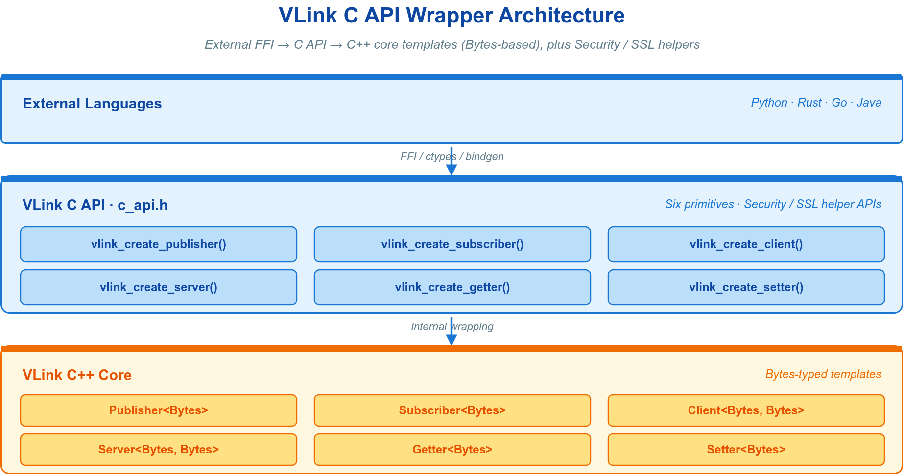
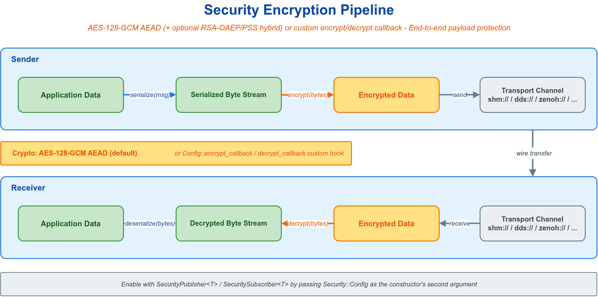
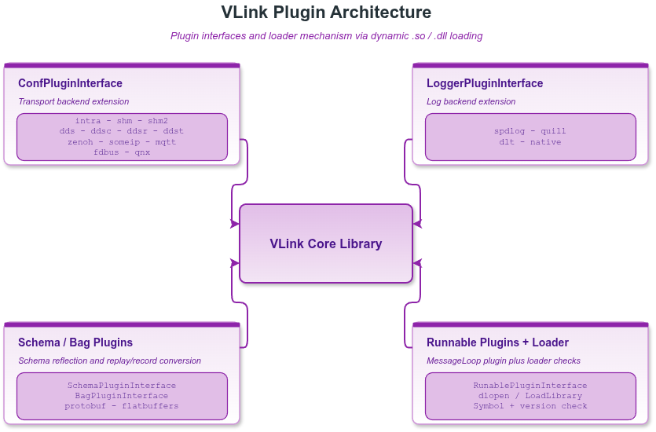
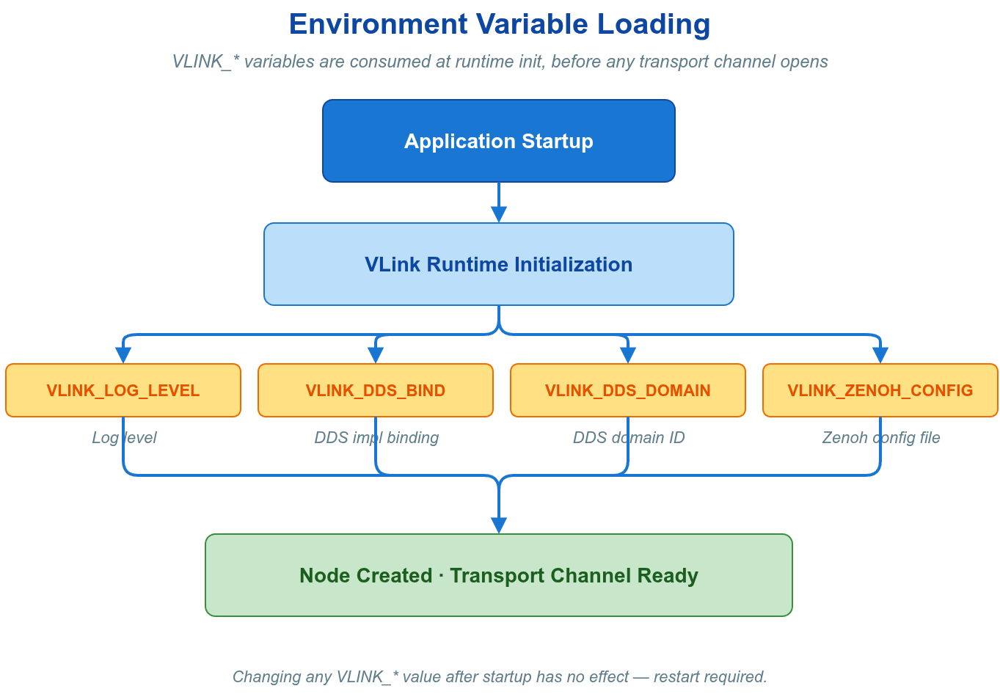

# 🪛 13. 集成与扩展

本章覆盖 VLink 在语言、框架、部署三处边界的对外接口。三者均在不改动业务通信代码的前提下把 VLink 接入更大的系统，并保持 URL 通信契约（见 [概述](00-overview.md)）的不变量：通信端点是 URL，承载是字节，行为可由配置外置。它们按"开发期编码 → 链接期装配 → 运行期注入"的时间顺序级联，构成从源码到现场的完整集成面。

| 集成面 | 章节 | 边界 | 作用 |
| --- | --- | --- | --- |
| **C API** | 13.1–13.8 | 语言 | 以稳定 C ABI 投影六原语数据面，使 C / Python / Go / Rust 等无法实例化 C++ 模板的语言接入 VLink |
| **扩展开发** | 13.9–13.17 | 框架 | 以稳定接口与插件机制开放扩展点：URL 重映射、动态类型、功能组件、子系统后端替换 |
| **环境变量** | 13.18–13.27 | 部署 | 通常提供全局缺省兜底；remap/bind 等部署变量可显式覆盖源码 URL |



---

## 🌐 C API：多语言集成

VLink C API 以稳定的 C ABI 暴露六个通信原语的数据面，适用于跨语言互操作、要求 ABI 跨版本稳定、或运行环境不具备 C++ 运行时的场景。它不替代 C++ API，而是其数据面的等价投影——URL 语义、通信模型语义、传输后端清单与 C++ 完全一致。

### 🧩 13.1 设计模型

C ABI 无法承载 C++ 模板与异常，因此 C API 对核心能力做了四点收敛。理解这四点即可解释后续全部接口的形态与约束。

| 机制 | 规则 | 工程含义 |
| --- | --- | --- |
| 统一载荷 | 所有消息以 `data + size` 字节缓冲区进出，对应 C++ 侧的 `vlink::Bytes` | 序列化/反序列化由调用方负责；C API 不感知消息结构 |
| 句柄模式 | 每个原语对应一个不透明句柄结构体，`create` 分配、`destroy` 释放，成对调用 | 句柄即资源所有权凭证；`native_handle` 外的字段为内部保留，禁止读写 |
| 统一返回码 | 所有报错函数返回 `vlink_ret_t`，仅 `0`（`VLINK_RET_NO_ERROR`）为成功 | 异常被转换为返回码；调用方必须逐次检查符号常量，不可把所有非负值视作成功 |
| 序列化声明 | 创建接口接收 `vlink_schema_info_t`，声明字节如何被解读 | 供发现、代理、录制、可视化识别话题类型；不参与编解码本身 |

**覆盖范围。** C API 覆盖六原语数据面（创建/销毁、发布/订阅、请求/响应、读写字段），并扩展支持消息级安全加密与传输层 TLS。它不覆盖 QoS、Bag 录制与服务发现，这些能力仍需 C++ API。`url` 参数格式（`<scheme>://<topic>`）与切换后端的语义同 C++：模型语义见 [通信模型](02-communication.md)，后端清单见 [传输后端与 URL](04-transport.md)。


### 🚀 13.2 快速开始

#### 13.2.1 构建集成

C API 由构建开关 `ENABLE_C_API` 控制，编译为独立库，导出链接别名 `vlink::c_api`：

```cmake
find_package(vlink REQUIRED)
target_link_libraries(my_c_app PRIVATE vlink::c_api)
```

头文件为纯 C 头（`extern "C"` 保护，C 与 C++ 均可包含）：

```c
#include <vlink/external/c_api.h>
```

#### 13.2.2 最小 Publisher 与 Subscriber

```c
#include <vlink/external/c_api.h>
#include <stdio.h>
#include <string.h>

static void on_message(const uint8_t* data, const size_t size, void* user_data) {
    (void)user_data;
    printf("recv: %.*s\n", (int)size, (const char*)data);
}

int main(void) {
    vlink_schema_info_t schema = {.ser = "bytes", .schema = VLINK_SCHEMA_RAW};

    vlink_subscriber_handle_t sub;
    vlink_create_subscriber("dds://example/hello", &schema, &sub, on_message, NULL);

    vlink_publisher_handle_t pub;
    vlink_create_publisher("dds://example/hello", &schema, &pub);

    vlink_wait_for_subscribers(pub, 5000);

    const char* msg = "hello vlink";
    vlink_publish(pub, (const uint8_t*)msg, strlen(msg));

    vlink_destroy_publisher(&pub);
    vlink_destroy_subscriber(&sub);
    return 0;
}
```

回调中的 `data` 仅在回调执行期间有效，需外带时必须在回调内拷贝。可运行示例见 `examples/c_api/c_pubsub`（演示 Event 模型的发布/订阅全流程）；RPC、Field、安全等其余原语的用法参照本章接口说明与 13.5–13.6，整体说明见 [快速开始](01-started.md)。

### 📦 13.3 核心类型

#### 13.3.1 返回码 `vlink_ret_t`

返回码将 C++ 侧的异常与状态转换为整数；调用方据其区分"可重试的状态"与"编程错误"。

| 返回码 | 值 | 含义与处理 |
| --- | --- | --- |
| `VLINK_RET_NO_ERROR` | 0 | 成功 |
| `VLINK_RET_UNEXPECTED_ERROR` | 1 | 条件尚未满足（如暂无订阅者）；稍后重试 |
| `VLINK_RET_INVALID_ERROR` | 2 | 空指针、参数非法或句柄无效；属调用方编程错误 |
| `VLINK_RET_MEMORY_ERROR` | 3 | 分配失败或输出缓冲区容量不足（见 `vlink_get`）；扩容后重试 |
| `VLINK_RET_RUNTIME_ERROR` | 4 | 运行期状态错误或构造异常（如在请求回调外调用 `vlink_reply`） |
| `VLINK_RET_TRANSFER_ERROR` | 5 | 收发失败（无对端、加解密失败）；待对端就绪后重试 |
| `VLINK_RET_UNKNOWN_ERROR` | -1 | 未分类内部错误；记录并上报 |

#### 13.3.2 句柄类型

六种句柄一一对应六个原语，均为不透明 POD 结构体。调用方仅通过 `create` / `destroy` 管理其生命周期，不得读写结构体内部字段。

| 句柄类型 | 对应原语 | 通信模型 |
| --- | --- | --- |
| `vlink_publisher_handle_t` | Publisher | Event 发布 |
| `vlink_subscriber_handle_t` | Subscriber | Event 订阅 |
| `vlink_server_handle_t` | Server | Method 服务端 |
| `vlink_client_handle_t` | Client | Method 客户端 |
| `vlink_setter_handle_t` | Setter | Field 写入 |
| `vlink_getter_handle_t` | Getter | Field 读取 |

#### 13.3.3 回调类型

回调执行上下文随后端与模式而异：intra `#direct` 可在发起 publish/invoke/set 的调用线程同步触发，其他模式通常由后端 delivery context 触发；注册检测回调时若状态已满足也可能同步触发。`data` 指针仅在回调期内有效。回调体应短小、非阻塞，并避免在其中调用可能形成重入或等待环的 VLink API（见 13.8.1）。

| 回调类型 | 签名 | 触发时机 |
| --- | --- | --- |
| `vlink_connect_callback_t` | `void (*)(bool is_connected, void* user_data)` | Publisher / Client 连接状态变化 |
| `vlink_msg_callback_t` | `void (*)(const uint8_t* data, size_t size, void* user_data)` | Subscriber 收到消息 / Getter 推送更新 |
| `vlink_req_callback_t` | `void (*)(const uint8_t* data, size_t size, void* user_data)` | Server 收到请求 |
| `vlink_resp_callback_t` | `void (*)(const uint8_t* data, size_t size, void* user_data)` | Client 收到响应 |

#### 13.3.4 序列化声明 `vlink_schema_info_t`

`vlink_schema_info_t` 在创建节点时声明该话题字节的序列化语义，供发现、代理、录制与可视化识别类型；它不参与编解码本身。

```c
typedef enum {
    VLINK_SCHEMA_UNKNOWN     = 0,
    VLINK_SCHEMA_RAW         = 1,
    VLINK_SCHEMA_ZEROCOPY    = 2,
    VLINK_SCHEMA_PROTOBUF    = 3,
    VLINK_SCHEMA_FLATBUFFERS = 4,
    VLINK_SCHEMA_CDR         = 5,
} vlink_schema_t;

typedef struct {
    const char*    ser;     /* 类型名 / 序列化标识，如 "demo.proto.PointCloud" */
    vlink_schema_t schema;  /* 粗粒度 schema 家族 */
} vlink_schema_info_t;
```

约束：

- `ser` 与 `schema` 须同时提供或同时省略；只填一侧返回 `VLINK_RET_INVALID_ERROR`。
- `schema_info == NULL`，或 `ser` 为空且 `schema == VLINK_SCHEMA_UNKNOWN`，等价于不显式声明。
- 始终引用枚举名而非裸整数。

序列化类型族与编解码机制见 [消息序列化](03-serialization.md)。

### 📇 13.4 高频接口概览

下列接口覆盖三种通信模型的数据面，是绝大多数集成所需的全部入口。带安全/TLS 的变体见 13.6。

#### 13.4.1 Event（Publisher / Subscriber）

| 函数 | 语义 |
| --- | --- |
| `vlink_create_publisher(url, schema, handle)` | 创建并初始化 Publisher |
| `vlink_destroy_publisher(handle)` | 销毁并释放资源 |
| `vlink_publish(handle, data, size)` | 发布消息；无订阅者返回 `TRANSFER_ERROR` |
| `vlink_publish_by_force(handle, data, size)` | 跳过订阅者在线检查并提交传输；迟到可见性仍取决于后端 durability/QoS |
| `vlink_wait_for_subscribers(handle, timeout_ms)` | 阻塞至有订阅者或超时 |
| `vlink_has_subscribers(handle)` | 非阻塞查询是否有订阅者 |
| `vlink_detect_subscribers(handle, cb, user_data)` | 注册连接状态变化回调 |
| `vlink_create_subscriber(url, schema, handle, msg_cb, user_data)` | 创建 Subscriber 并注册收消息回调；`msg_cb` 不可为 `NULL` |
| `vlink_destroy_subscriber(handle)` | 销毁并释放资源 |

#### 13.4.2 Method（Server / Client）

| 函数 | 语义 |
| --- | --- |
| `vlink_create_server(url, schema, handle, req_cb, user_data)` | 创建 Server 并注册请求回调 |
| `vlink_destroy_server(handle)` | 销毁并释放资源，含请求/响应协调状态 |
| `vlink_reply(handle, data, size)` | 在请求回调内提供响应；回调外调用返回 `RUNTIME_ERROR` |
| `vlink_create_client(url, schema, handle)` | 创建 Client |
| `vlink_destroy_client(handle)` | 销毁并释放资源 |
| `vlink_invoke(handle, data, size, resp_cb, user_data)` | 发请求并注册响应回调；不需响应时 `resp_cb` 传 `NULL` |
| `vlink_wait_for_server(handle, timeout_ms)` | 阻塞至 Server 可用或超时 |
| `vlink_has_server(handle)` | 非阻塞查询是否已连接 Server |
| `vlink_detect_server(handle, cb, user_data)` | 注册连接状态变化回调 |

#### 13.4.3 Field（Setter / Getter）

| 函数 | 语义 |
| --- | --- |
| `vlink_create_setter(url, schema, handle)` | 创建 Setter |
| `vlink_destroy_setter(handle)` | 销毁并释放资源 |
| `vlink_set(handle, data, size)` | 写入最新字段值并广播 |
| `vlink_create_getter(url, schema, handle, msg_cb, user_data)` | 创建 Getter；`msg_cb` 为 `NULL` 走轮询、非 `NULL` 走推送 |
| `vlink_destroy_getter(handle)` | 销毁并释放资源 |
| `vlink_get(handle, data, size)` | 轮询读取最新值至调用方缓冲区 |

### 🔧 13.5 关键用法与边界条件

#### 13.5.1 载荷生命周期

发送类函数（`vlink_publish` / `vlink_publish_by_force` / `vlink_invoke` / `vlink_set`）对 `data` 做浅拷贝：缓冲区只需在函数返回前有效，返回后即可复用或释放。回调入参 `data` 仅回调期内有效，需外带时在回调内拷贝至自有缓冲区，切勿保存裸指针。

#### 13.5.2 请求—响应协议

`vlink_reply` 必须在 `vlink_req_callback_t` 内调用。请求处理流程如下：

- 在请求回调内调用 `vlink_reply(handle, data, size)` 提供非空响应；回调返回后该响应被发往客户端。
- 不调用 `vlink_reply` 或传 `size == 0`，请求以空响应完成。
- 回调返回后再调用 `vlink_reply` 返回 `VLINK_RET_RUNTIME_ERROR`，因为已无进行中的请求。

惯例是将 Server 句柄自身作为 `user_data` 传入，便于在回调内取得句柄：

```c
static void on_request(const uint8_t* data, const size_t size, void* user_data) {
    vlink_server_handle_t* handle = (vlink_server_handle_t*)user_data;
    vlink_reply(handle, data, size);
}

vlink_schema_info_t schema = {.ser = "demo.raw.Echo", .schema = VLINK_SCHEMA_RAW};
vlink_server_handle_t server;
vlink_create_server("dds://echo", &schema, &server, on_request, &server);
```

#### 13.5.3 Getter 推送与轮询

创建 Getter 时 `msg_callback` 的取值决定工作模式：传非 `NULL` 走推送模式，每次值更新触发回调；传 `NULL` 走轮询模式，由调用方用 `vlink_get` 主动读取最新值。

#### 13.5.4 `vlink_get` 的缓冲区契约

`vlink_get` 的 `*size` 是双向参数：入参为缓冲区容量，出参为实际数据大小。容量不足时返回 `VLINK_RET_MEMORY_ERROR` 并把所需大小写回 `*size`（`data` 不被修改），调用方据此扩容重试；尚无可用值时返回 `VLINK_RET_TRANSFER_ERROR`。

```c
uint8_t buf[256];
size_t  size = sizeof(buf);
int ret = vlink_get(getter, buf, &size);

if (ret == VLINK_RET_MEMORY_ERROR) {
    uint8_t* big = malloc(size);
    vlink_get(getter, big, &size);
    free(big);
}
```

### 🔒 13.6 安全加密与传输层 TLS

C API 提供两层正交的加密能力：消息级 AEAD 加密（应用层，端到端）与传输层 TLS（信道级，逐跳）。二者相互独立，可单独或叠加使用。



#### 13.6.1 消息级加密

启用消息加密的节点必须用 `vlink_create_secure_*()` 系列创建——加密在节点初始化时一次性装配，没有运行期开关。配置经 `vlink_security_config_t` 传入，推荐先用 `vlink_security_config_init()` 取默认值（PBKDF2 迭代 200000，重放窗口置 4096 即启用重放保护），再按需覆盖字段：

```c
vlink_security_config_t cfg;
vlink_security_config_init(&cfg);
cfg.passphrase       = "correct horse battery staple";
cfg.pbkdf2_salt      = my_salt;
cfg.pbkdf2_salt_size = my_salt_size;

vlink_publisher_handle_t pub;
vlink_create_secure_publisher("dds://secure/topic", &schema, &pub, &cfg);
```

六个原语均有对应的 secure 创建函数，签名与普通版一致、末尾增加一个 `const vlink_security_config_t*`：

| 函数 | 适用 |
| --- | --- |
| `vlink_create_secure_publisher` / `vlink_create_secure_subscriber` | Event 加密收发 |
| `vlink_create_secure_server` / `vlink_create_secure_client` | Method 加密请求/响应 |
| `vlink_create_secure_setter` / `vlink_create_secure_getter` | Field 加密读写 |

`vlink_security_config_t` 支持三种密钥模式，由填入的字段决定：对称（`key` 或 `passphrase` + `pbkdf2_salt`）、RSA 混合（`public_key_pem` / `private_key_pem`）、自定义回调（`encrypt_callback` / `decrypt_callback`，二者同时安装时覆盖内置路径）。低频选项（AAD 绑定、重放窗口、RSA-PSS 签名密钥）置于 `advanced` 子结构。各算法语义与字段含义见 [安全加密](07-security.md)。

#### 13.6.2 独立加解密

不绑定节点、仅需直接加解密缓冲区时，使用独立 Security 句柄：

```c
vlink_security_handle_t sec = vlink_security_create(&cfg);

uint8_t* cipher = NULL;
size_t   cipher_size = 0;
vlink_security_encrypt(sec, plain, plain_size, &cipher, &cipher_size);
/* 使用 cipher */
vlink_security_free_buffer(cipher);

vlink_security_destroy(sec);
```

`vlink_security_decrypt` 用法对称。输出缓冲区由 C API 分配、由调用方经 `vlink_security_free_buffer` 释放；空输入返回 `VLINK_RET_INVALID_ERROR`；认证失败（密文被篡改、密钥错误、签名无效或重放）返回 `VLINK_RET_TRANSFER_ERROR`。

#### 13.6.3 传输层 TLS

需要信道级 TLS（当前支持 `mqtt://`、`dds://`、`ddsc://`、`ddsr://`、`zenoh://`；`someip://` 不消费 `ssl.*` 配置）时，用 `*_with_ssl_options` 系列创建。配置先经 `vlink_ssl_options_init()` 取默认值（`verify_peer` 默认为 1）：

```c
vlink_ssl_options_t opt;
vlink_ssl_options_init(&opt);
opt.ca_file   = "/etc/certs/ca.pem";
opt.cert_file = "/etc/certs/client.pem";
opt.key_file  = "/etc/certs/client-key.pem";

vlink_publisher_handle_t pub;
vlink_create_publisher_with_ssl_options("mqtt://sensor/data", &schema, &pub, &opt);
```

六个原语均有 `vlink_create_<role>_with_ssl_options`；同时需要消息加密与 TLS 时使用 `vlink_create_secure_<role>_with_ssl_options`。这些接口会把配置写入节点属性，只有支持 TLS 的后端会据此建立 TLS 通道。`vlink_ssl_options_t` 字段：`verify_peer`（非零校验对端证书）、`ca_file` / `cert_file` / `key_file` / `key_password`、`server_name`（SNI）、`ciphers`。TLS 必须在传输连接建立前装配，因此应通过上述创建函数注入；句柄级 `vlink_<role>_set_ssl_options` 针对已初始化句柄返回 `VLINK_RET_RUNTIME_ERROR`。

### 🔗 13.7 跨语言绑定

任何支持 C FFI 的语言均可调用 C API。下面给出三种语言的核心片段，要点是声明与 `vlink_schema_info_t`、句柄结构体匹配的 ABI 布局，并正确管理生命周期。

#### 13.7.1 Python

vlink 为 Python 提供两条路径，**首选原生绑定**：

- **原生 nanobind 绑定（首选）**：源码位于 `languages/python_api/`（`vlink_python.cc` + `vlink.py`），编译产出名为 `_vlink_nanobind` 的扩展模块，由 `vlink.py` 再导出（`from _vlink_nanobind import *`）。它是一等公民的面向对象 API，无需手写 ABI 声明，并自动管理生命周期。需在配置时开启构建开关 `ENABLE_PYTHON_API`（`CMakeLists.txt` 中默认 `OFF`），即 `cmake -DENABLE_PYTHON_API=ON ...`；该开关依赖系统已安装 `nanobind`。导出的主要类/接口如下，完整清单以 `languages/python_api/vlink.py` 的 `__all__` 为准：
  - 收发端点：`Publisher`、`Subscriber`、`Server`、`Client`、`Setter`、`Getter`、`FireForgetServer`、`FireForgetClient`；
  - 安全版端点：`Security`、`SecurityConfig`、`SecurityConfigAdvanced`、`SecurityPublisher`、`SecuritySubscriber`、`SecurityServer`、`SecurityClient`、`SecuritySetter`、`SecurityGetter`、`SecurityFireForgetServer`、`SecurityFireForgetClient`、`SslOptions`；
  - 录制/回放与发现：`BagWriter`、`BagReader`、`TriggerRecorder`、`DiscoveryViewer`；
  - QoS 与杂项：`Qos`、`QosProfile`、`UrlRemap`、`Logger`（含 `log_trace`/`log_debug`/`log_info`/`log_warn`/`log_error`/`log_fatal`）、`Status`；
  - 基础类型与工具：`Bytes`、`Frame`、`Uuid`、`Version`、`SchemaData`、`SampleLostInfo`、`ElapsedTimer`、`DeadlineTimer`、`Timer`、`WheelTimer`、`MessageLoop`、`MultiLoop`、`ThreadPool`、`SpinLock`、`CpuProfiler`、`CpuProfilerGuard`、`MemoryPool`、`Process`、`utils`、`helpers`、`quantize`；
  - 各类枚举：`ImplType`、`TransportType`、`InitType`、`SecurityType`、`ActionType`、`SchemaType`、`LogLevel`、`StatusType` 等。

  具体方法签名以源码 `languages/python_api/vlink_python.cc` 为准，示例可参考 `languages/python_api/examples/`。

- **ctypes-over-C-API（轻量替代）**：当不便编译原生绑定时，可直接用 `ctypes` 调用 C API 共享库，无需额外构建步骤，但需手写与 `vlink_schema_info_t`、句柄结构体匹配的 ABI 布局并自行管理生命周期：

```python
import ctypes

lib = ctypes.CDLL("libvlink-c_api.so")

class SchemaInfo(ctypes.Structure):
    _fields_ = [("ser", ctypes.c_char_p), ("schema", ctypes.c_int)]

class PublisherHandle(ctypes.Structure):
    _fields_ = [("native_handle", ctypes.c_void_p), ("reserved", ctypes.c_void_p * 8)]

lib.vlink_create_publisher.argtypes = [ctypes.c_char_p, ctypes.POINTER(SchemaInfo), ctypes.POINTER(PublisherHandle)]
lib.vlink_publish.argtypes = [PublisherHandle, ctypes.POINTER(ctypes.c_uint8), ctypes.c_size_t]

pub = PublisherHandle()
schema = SchemaInfo(b"bytes", 1)  # VLINK_SCHEMA_RAW
lib.vlink_create_publisher(b"dds://python/topic", ctypes.byref(schema), ctypes.byref(pub))

msg = b"hello from python"
buf = (ctypes.c_uint8 * len(msg)).from_buffer_copy(msg)
lib.vlink_publish(pub, buf, len(msg))
lib.vlink_destroy_publisher(ctypes.byref(pub))
```

#### 13.7.2 Go（cgo）

```go
package main

/*
#cgo LDFLAGS: -lvlink-c_api
#include <vlink/external/c_api.h>
#include <stdlib.h>
*/
import "C"
import "unsafe"

func main() {
    url := C.CString("dds://go/topic")
    ser := C.CString("bytes")
    defer C.free(unsafe.Pointer(url))
    defer C.free(unsafe.Pointer(ser))

    schema := C.vlink_schema_info_t{ser: ser, schema: C.VLINK_SCHEMA_RAW}
    var pub C.vlink_publisher_handle_t
    C.vlink_create_publisher(url, &schema, &pub)
    defer C.vlink_destroy_publisher(&pub)

    msg := []byte("hello from go")
    C.vlink_publish(pub, (*C.uint8_t)(unsafe.Pointer(&msg[0])), C.size_t(len(msg)))
}
```

#### 13.7.3 Rust（FFI）

```rust
use std::ffi::CString;
use std::os::raw::{c_char, c_int, c_void};

#[repr(C)]
struct SchemaInfo { ser: *const c_char, schema: c_int }
#[repr(C)]
struct PublisherHandle { native_handle: *mut c_void, reserved: [*mut c_void; 8] }

extern "C" {
    fn vlink_create_publisher(url: *const c_char, schema: *const SchemaInfo, handle: *mut PublisherHandle) -> c_int;
    fn vlink_publish(handle: PublisherHandle, data: *const u8, size: usize) -> c_int;
    fn vlink_destroy_publisher(handle: *mut PublisherHandle) -> c_int;
}

fn main() {
    let url = CString::new("dds://rust/topic").unwrap();
    let ser = CString::new("bytes").unwrap();
    let schema = SchemaInfo { ser: ser.as_ptr(), schema: 1 };  // VLINK_SCHEMA_RAW
    let mut pub_h = PublisherHandle { native_handle: std::ptr::null_mut(), reserved: [std::ptr::null_mut(); 8] };

    let msg = b"hello from rust";
    unsafe {
        vlink_create_publisher(url.as_ptr(), &schema, &mut pub_h);
        vlink_publish(pub_h, msg.as_ptr(), msg.len());
        vlink_destroy_publisher(&mut pub_h);
    }
}
```

### ⚖️ 13.8 约束与正确性

#### 13.8.1 线程安全

| 操作 | 线程安全性 |
| --- | --- |
| 同一句柄的 `create` / `destroy` | 不安全，不可并发 |
| 同一 Publisher 并发 `vlink_publish` | 安全 |
| 不同句柄之间并发操作 | 安全，各自独立 |
| `vlink_reply` 在请求回调外调用 | 返回 `VLINK_RET_RUNTIME_ERROR` |
| 回调内调用其它 VLink API | 视传输层而定，通常不安全；建议改用队列转发后处理 |

#### 13.8.2 内存与资源管理

- `create` 与 `destroy` 必须成对；遗漏 `destroy` 将泄漏内存与传输资源。
- `vlink_get` 的缓冲区由调用方分配并管理，`*size` 入参必须是真实容量。
- 独立加解密的输出缓冲区由 `vlink_security_free_buffer` 释放，不可用其它释放器。
- 载荷生命周期规则（发送类函数浅拷贝、回调入参仅回调期有效）见 13.5.1。

#### 13.8.3 Python 零拷贝动态解析

nanobind 模块提供 `ZeroCopyMessageParser`，用于按运行期序列化类型读取八种内置零拷贝消息。`parse(serialized_type, bytes)` 自动识别类型，`parse_type(type, bytes)` 可在类型已知时避免重复识别；解析成功后通过 `value(path)`、`value_at(collection, index, field)`、`collection_size()`、`fields()` 与 `element_fields()` 访问消息。字段不存在或下标越界时读取方法返回 `None`，不会越界访问。

```python
parser = vlink.ZeroCopyMessageParser()

if parser.parse("vlink::zerocopy::ObjectArray", wire):
    count = parser.collection_size("data")
    label = parser.value_at("data", 0, "label") if count else None
    track_id = parser.value_at("data", 0, "track_id") if count else None
```

Python 返回值保持字符串、字节与 64 位有符号/无符号整数类型，因此 `track_id` 等大整数不会先经过 `double` 而丢失精度。绑定会让输入 `Bytes` 至少与解析器同寿命，并在检测到输入指针或大小变化后拒绝继续读取；但解析器有效期间仍不得修改该 `Bytes` 的内容、大小、容量或底层存储。C++ 调用方也应遵守 [零拷贝生命周期约束](06-zerocopy.md#-611-生命周期约束)。

---

## 🧩 扩展开发：插件与自定义传输

VLink 在不修改框架本体的前提下，以稳定接口与插件机制向应用开放扩展点。本节先建立扩展机制的分类模型，再依使用频度给出接口与最小示例；框架内部使用的扩展接口仅作索引，指向对应专文。



### 🗂️ 13.9 扩展机制的分类与选型

VLink 的扩展点按调用主体分为两类，决定其在文档中的展开深度。

- **应用向扩展**：由应用代码直接构造与调用，解决配置注入、动态类型、功能组件解耦等日常工程问题。
- **框架内扩展**：由 VLink 运行时或特定工具链在内部加载，应用一般不直接构造，仅在实现自定义后端时按接口契约提供实现。

两类扩展在实现形态上又分为**值类型**（`UrlRemap`、`DynamicData`，直接实例化使用）与**插件接口**（继承抽象接口、编译为共享库、经 `Plugin` 动态加载）。

| 扩展 | 头文件 | 用途 | 类别 |
| --- | --- | --- | --- |
| `UrlRemap` | `extension/url_remap.h` | 运行时按 JSON 表重映射 URL，免重编切换后端 | 应用向·值类型 |
| `DynamicData` | `extension/dynamic_data.h` | 传输编译期未知类型的消息（类型擦除） | 应用向·值类型 |
| `Plugin` | `base/plugin.h` | 动态库加载器：类型安全加载、版本校验、生命周期管理 | 应用向·加载器 |
| `LoggerPluginInterface` | `base/logger_plugin_interface.h` | 将日志输出接入第三方框架 | 应用向·插件 |
| `RunablePluginInterface` | `extension/runnable_plugin_interface.h` | 携带自身事件循环的自包含可运行组件 | 应用向·插件 |
| `ConvertPluginInterface` | `extension/convert_plugin_interface.h` | Foxglove / Rerun 可视化消息转换 | 应用向·插件 |
| `SchemaPluginInterface` | `extension/schema_plugin_interface.h` | Protobuf / FlatBuffers schema 反射注册 | 进阶·插件 |
| `BagPluginInterface` | `extension/bag_plugin_interface.h` | 录制 / 回放时改写 URL 与帧 | 框架内·插件 |
| `TriggerPluginInterface` | `extension/trigger_plugin_interface.h` | 观察触发录制生命周期，dump 完成后上传 / 归档 | 框架内·插件 |
| `DiscoveryReporter` | `extension/discovery_reporter.h` | 节点上线 / 下线上报 | 框架内 |

实现插件接口涉及三个宏：`VLINK_PLUGIN_REGISTER(Iface)` 在接口与实现类内注入由类型名派生的插件 ID，`VLINK_PLUGIN_DECLARE(ImplType, major, minor)` 在实现 `.cc` 中导出构造 / 析构入口并声明版本，`VLINK_PLUGIN_EXPORT` 为共享库符号可见性修饰符。

`TriggerPluginInterface` 实现声明 ABI `2.0`，并通过 `init(config)` 接收宿主原样传入的配置字符串；字符串可由插件自行解释为 JSON、文件路径或其他格式。`vlink-trigger daemon` 在绑定插件和启动 recorder 前调用一次 `init()`，返回 `false` 时拒绝启动。

`BagPluginInterface` 接口版本为 `2.0`。读侧 `on_read()` 接收已填充有效序列化元数据的 `Frame`；每个顶层回放会话开始前调用 `on_reset()` 丢弃前一中断会话的缓存状态，只有自然完成的回放轮次及解绑时调用 `flush()` 排空尾帧。若 reader 在轮次边界排空前观察到 `stop()` / `jump()`，则跳过 `flush()`，由下一会话的 `on_reset()` 丢弃缓存。实现重排缓冲的插件通常分别转发到 `BagProcessor::reset()` / `flush()`，并使用当前头文件重新构建、声明 `VLINK_PLUGIN_DECLARE(Impl, 2, 0)`。

`TriggerRecorder` 对 bag 插件采用纯接口注入：它只接受宿主通过 `bind_bag_interface()` 绑定的 `shared_ptr<BagPluginInterface>`，不接收库名、搜索目录，也不调用 `Plugin::load()`。应用宿主可直接构造实现，或自行用 `Plugin` 完成库搜索、ABI 校验与实例创建后再绑定；`vlink-trigger daemon` 的 `bag_plugin` / `bag_plugin_dir` 正是 CLI 宿主层配置，不属于 `TriggerRecorder::Config`。

> QoS 与安全相关扩展见 [QoS 配置](05-qos.md)、[安全加密](07-security.md)；录制 / 回放扩展见 [录制与回放](09-recording.md)。

### 🔀 13.10 UrlRemap：URL 运行时重映射

URL 即通信契约（见 [概述](00-overview.md)），但契约值在源码中确定后，量产部署仍可能需要改变后端或 topic 名。`UrlRemap` 从 JSON 文件加载一张「原 URL → 目标 URL」映射表，在运行时替换节点使用的地址，使后端切换退化为修改配置文件而非重新编译。

#### 13.10.1 配置格式与匹配语义

配置为平坦 JSON 对象，键为原 URL 或其子串，值为目标 URL：

```json
{
    "intra://sensor/lidar": "dds://vehicle/lidar",
    "shm://camera/front":   "dds://camera/front",
    "dds://old/topic":      "ddsc://new/topic"
}
```

`convert()` 返回首条「键为输入 URL 子串」的规则对应的值；无匹配则原样返回输入。匹配按文件中的规则顺序进行，故较具体的规则应排在前面，避免被宽泛子串规则提前命中。

#### 13.10.2 接口

| 方法 | 语义 |
| --- | --- |
| `bool load(file_path)` | 加载 JSON；已加载状态下返回 `false`，需先 `unload` |
| `bool unload()` | 卸载并清空规则表 |
| `bool reload(file_path)` | 等价于 `unload()` 后 `load()` |
| `const std::string& convert(url)` | 转换 URL；无匹配返回原 URL |
| `bool is_valid()` | 是否已成功加载 |
| `void set_enable_log(enable)` | 启用 / 关闭每次转换的 INFO 日志 |
| `const std::string& get_error_string()` | 加载失败时的错误描述 |

#### 13.10.3 用法

```cpp
#include <vlink/extension/url_remap.h>

vlink::UrlRemap remap;
remap.set_enable_log(true);

if (!remap.load("/etc/vlink/remap.json")) {
    VLOG_E("failed to load remap: ", remap.get_error_string());
    return;
}

vlink::Publisher<vlink::Bytes> pub(remap.convert("intra://sensor/lidar"));
```

**边界条件**：`UrlRemap` 非线程安全，`load` / `unload` / `reload` / `convert` 须在同一线程调用，或由调用方加锁。`is_valid()` 为 `false` 时 `convert()` 返回原 URL，不抛异常。除显式构造 `UrlRemap` 外，同一映射表亦可经环境变量 `VLINK_URL_REMAP` 全局注入（见 13.20），无需改动任何代码。全局实例在进程首次使用 URL 时加载一次，不监听文件变化；修改映射文件后须重启进程。只有应用显式持有的 `UrlRemap` 才能由调用方同步后执行 `reload()`。

### 🎭 13.11 DynamicData：动态类型消息

事件 / 方法 / 字段三种模型的消息类型均为编译期模板参数，序列化策略据此推导（见 [消息序列化](03-serialization.md)）。当通道两端在编译期无法共享具体类型——例如网关按运行时配置转发任意 topic——需要一种类型擦除的载体。`DynamicData` 将任意 VLink 兼容消息连同类型名标签打包为字节缓冲，在编译期不感知类型的通道上传输，由接收端按类型名还原。它与 `Publisher<DynamicData>` / `Subscriber<DynamicData>` 配合使用。

#### 13.11.1 接口

| 方法 | 语义 |
| --- | --- |
| `DynamicData& load(type_name, value)` | 将消息连同类型名打包，返回自身以支持链式 `publish` |
| `T as<T>()` | 还原为具体类型 `T` 并返回 |
| `bool convert(T& out)` | 还原到出参，成功返回 `true` |
| `const std::string_view& get_type()` | 返回类型名标签 |
| `bool is_empty()` | 是否为空 |
| `operator>> / operator<<` | 与 `Bytes` 互转，用于自定义传输或落盘 |

**约束**：类型名标签连同结尾 NUL 须短于 20 字节（即名称至多 18 字符，前 20 字节为内联类型名区）；不可嵌套打包另一个 `DynamicData`，亦不支持 CDR 类型；违规用法在编译期被 `static_assert` 拦截。

#### 13.11.2 用法

```cpp
#include <vlink/extension/dynamic_data.h>
#include <vlink/vlink.h>

vlink::Publisher<vlink::DynamicData> pub("dds://dynamic/event");

MyProtoMsg msg;
msg.set_value(42);
pub.publish(vlink::DynamicData().load("MyProtoMsg", msg));

vlink::Subscriber<vlink::DynamicData> sub("dds://dynamic/event");
sub.listen([](const vlink::DynamicData& dd) {
    if (dd.get_type() == "MyProtoMsg") {
        auto received = dd.as<MyProtoMsg>();
    }
});
```

与 `Bytes` 互转，适用于自定义传输或持久化：

```cpp
vlink::Bytes wire;
vlink::DynamicData dd;
dd.load("SomeType", some_msg);
dd >> wire;

vlink::DynamicData decoded;
decoded << wire;
```

### 🔌 13.12 Plugin：动态库加载器

`Plugin` 封装跨平台动态库加载，提供类型安全的接口查找、版本校验与生命周期管理。它是所有插件接口（日志、可运行、转换等）的统一加载入口。

#### 13.12.1 接口

| 方法 | 语义 |
| --- | --- |
| `load<Iface>(lib_name, major, minor)` | 加载插件，返回接口 `shared_ptr`；失败返回 `nullptr` |
| `has_loaded<Iface>(lib_name)` | 查询是否已加载 |
| `unload<Iface>(lib_name)` | 卸载指定插件 |
| `clear()` | 卸载全部插件 |

版本校验规则：`major` 须与插件声明一致，插件声明的 `minor` 须不低于调用方要求，否则加载失败。返回的 `shared_ptr` 在最后一个引用释放时销毁插件实例；`Plugin` 注册表仍持有共享库跟踪项。需要卸载时先释放全部接口引用，再调用 `unload()`（或 `clear()`）；注册表项移除且所有引用释放后，共享库才最终解除映射。

#### 13.12.2 库名与搜索路径

`load()` 接受插件**基础名**，框架按平台补全前缀与后缀：

| 平台 | 前缀 | 后缀 | 示例（基础名 `my_plugin`） |
| --- | --- | --- | --- |
| Linux | `lib` | `.so` | `libmy_plugin.so` |
| macOS | `lib` | `.dylib` | `libmy_plugin.dylib` |
| Windows | 无 | `.dll` | `my_plugin.dll` |

默认搜索顺序：

- 环境变量 `VLINK_PLUGIN_DIR` 列出的目录（逗号或空格分隔，最高优先级）
- 当前工作目录
- 可执行文件所在目录及其 `../lib64`、`../lib`、`./lib64`、`./lib`
- 系统目录 `/lib64`、`/lib`

`load()` 的 `search_paths` 参数可替换默认搜索路径；`dir_name` 是追加在每个 search path 下的可选子目录，并不是独立或优先搜索的绝对目录。例如 `dir_name="plugins"` 会依次检查 `<search_path>/plugins/<library>`。`VLINK_PLUGIN_DIR` 的运行期定义见 13.20。

#### 13.12.3 用法

```cpp
vlink::Plugin plugin;

auto backend = plugin.load<vlink::LoggerPluginInterface>("my_logger", 1, 0);
if (backend) {
    backend->init("my_app");
}

backend.reset();
plugin.unload<vlink::LoggerPluginInterface>("my_logger");
```

### 🏗️ 13.13 插件实现的统一流程

各类插件接口的实现遵循同一模板，差异仅在于继承的接口与重写的虚函数：

1. 接口类内以 `VLINK_PLUGIN_REGISTER(Iface)` 注入插件 ID；
2. 实现类继承接口、实现全部纯虚函数，并同样写一次 `VLINK_PLUGIN_REGISTER`；
3. 实现 `.cc` 末尾以 `VLINK_PLUGIN_DECLARE(ImplType, major, minor)` 导出入口；
4. CMake 编译为 `SHARED` 库；
5. 宿主以 `Plugin::load<Iface>()` 加载。

以一个自定义监控插件为例。

**monitor_plugin.h（接口）**

```cpp
#pragma once
#include <vlink/base/plugin.h>
#include <string>

class MonitorPluginInterface {
    VLINK_PLUGIN_REGISTER(MonitorPluginInterface)
public:
    virtual ~MonitorPluginInterface() = default;

    virtual bool init(const std::string& config_path) = 0;
    virtual void report(const std::string& metric, double value) = 0;
    virtual void shutdown() = 0;
};
```

**prometheus_monitor.cc（实现与导出）**

```cpp
#include "monitor_plugin.h"

class PrometheusMonitor : public MonitorPluginInterface {
    VLINK_PLUGIN_REGISTER(MonitorPluginInterface)
public:
    bool init(const std::string& config_path) override { return true; }
    void report(const std::string& metric, double value) override {}
    void shutdown() override {}
};

VLINK_PLUGIN_DECLARE(PrometheusMonitor, 1, 0)
```

**CMakeLists.txt**

```cmake
add_library(prometheus_monitor SHARED prometheus_monitor.cc)
target_link_libraries(prometheus_monitor vlink::vlink prometheus-cpp::core)
```

**宿主加载**

```cpp
vlink::Plugin plugin;
auto monitor = plugin.load<MonitorPluginInterface>("prometheus_monitor", 1, 0);

if (!monitor) {
    VLOG_E("failed to load monitor plugin");
    return;
}

monitor->init("/etc/monitor.json");
monitor->report("cpu_usage", 0.35);
monitor->shutdown();
```

### 📝 13.14 LoggerPluginInterface：自定义日志后端

实现 `LoggerPluginInterface` 可将 VLink 文件通道转发至任意第三方框架（spdlog、log4cxx、自定义滚动日志等）。接口包含三个钩子。

| 方法 | 语义 |
| --- | --- |
| `bool init(app_name) noexcept` | 初始化后端 |
| `bool log(int level, str) noexcept` | 输出一条日志，`level` 为级别整数 |
| `void flush() noexcept` | 排空此前由 `log()` 接受的插件内部异步任务 |

`level` 与 `Logger::Level` 的对照：`0` Trace、`1` Debug、`2` Info、`3` Warn、`4` Error、`5` Fatal。

通过 `VLINK_LOG_PLUGIN` 加载时，插件的 `init()` 在 Logger 单例完成构造后执行并支持同线程 Logger
重入，因此可在其中创建 `Publisher` 等 VLink 通信节点。初始化期间其他线程不会等待，可继续向
控制台输出，但日志不会进入尚未就绪的插件。`log()` 可能被多个日志线程并发调用；其同线程调用链
产生的 VLink 日志仍按控制台配置处理，但不会再次进入同一插件。

```cpp
#include <vlink/base/logger_plugin_interface.h>
#include <spdlog/spdlog.h>
#include <spdlog/sinks/rotating_file_sink.h>

class SpdlogPlugin : public vlink::LoggerPluginInterface {
    VLINK_PLUGIN_REGISTER(vlink::LoggerPluginInterface)
public:
    bool init(std::string_view app_name) noexcept override {
        logger_ = spdlog::rotating_logger_mt(
            std::string(app_name),
            "/var/log/" + std::string(app_name) + ".log",
            1024 * 1024 * 10, 3);
        return true;
    }

    bool log(int level, std::string_view str) noexcept override {
        if (!logger_) {
            return false;
        }

        switch (level) {
        case 0: logger_->trace(str); break;
        case 1: logger_->debug(str); break;
        case 2: logger_->info(str); break;
        case 3: logger_->warn(str); break;
        case 4: logger_->error(str); break;
        case 5: logger_->critical(str); break;
        default: return false;
        }
        return true;
    }

    void flush() noexcept override {
        if (logger_) {
            logger_->flush();
        }
    }

private:
    std::shared_ptr<spdlog::logger> logger_;
};

VLINK_PLUGIN_DECLARE(SpdlogPlugin, 1, 0)
```

手工加载后可直接调用插件接口；要替换 Logger 文件通道，需在 Logger 首次使用前通过环境变量
`VLINK_LOG_PLUGIN` 注入。控制台通道仍独立按自身级别与回调处理（日志后端总览见
[基础库](08-base-library.md)，环境变量见 13.21）：

```cpp
vlink::Plugin plugin;
auto backend = plugin.load<vlink::LoggerPluginInterface>("spdlog_plugin", 1, 0);
if (backend) {
    backend->init("my_app");
    backend->flush();
}
```

### ⚙️ 13.15 RunablePluginInterface：可运行插件

`RunablePluginInterface`（类名拼写 `Runable` 为源码约定，单 n）继承自 `MessageLoop`，使插件携带自身事件循环线程，成为可独立持有订阅、定时器、状态机的自包含组件。实现需重写两个生命周期钩子。

| 方法 | 调用时机 |
| --- | --- |
| `on_init()` | `async_run()` 成功后调用，在此创建订阅、定时器等运行期资源 |
| `on_deinit()` | 卸载前调用，释放 `on_init()` 创建的全部资源 |

**实现**

```cpp
#include <vlink/extension/runnable_plugin_interface.h>
#include <vlink/vlink.h>

class MySensorPlugin : public vlink::RunablePluginInterface {
    VLINK_PLUGIN_REGISTER(vlink::RunablePluginInterface)
public:
    void on_init() override {
        sub_ = std::make_unique<vlink::Subscriber<vlink::Bytes>>("dds://sensor/lidar");
        sub_->listen([](const vlink::Bytes& data) {
            VLOG_I("received lidar data, size=", data.size());
        });
    }

    void on_deinit() override { sub_.reset(); }

private:
    std::unique_ptr<vlink::Subscriber<vlink::Bytes>> sub_;
};

VLINK_PLUGIN_DECLARE(MySensorPlugin, 1, 0)
```

**加载与运行**

```cpp
vlink::Plugin plugin;
auto instance = plugin.load<vlink::RunablePluginInterface>("my_sensor_plugin", 1, 0);

if (instance) {
    instance->async_run();
    instance->on_init();
    /* 应用运行 */
    instance->on_deinit();
    instance->quit();
    instance->wait_for_quit();
}
```

> Proxy 加载可运行插件的场景见 [可观测性](12-observability.md)。

### 🎨 13.16 ConvertPluginInterface：Foxglove / Rerun 桥接

`ConvertPluginInterface` 供 `vlink-foxglove` 与 `vlink-rerun` 桥接器使用，将 VLink 的序列化字节流转换为目标可视化后端能解析的格式。接口不依赖任何第三方库，便于外部独立实现。

| 目标 | payload 格式 | `type_name` 含义 |
| --- | --- | --- |
| `Target::kFoxglove` | FlatBuffer / Protobuf 二进制 | Foxglove schema 名 |
| `Target::kRerun` | UTF-8 JSON（描述 Rerun archetype） | Rerun archetype 名 |

核心虚函数：

| 方法 | 语义 |
| --- | --- |
| `init(config)` | 加载后调用，返回 `false` 则卸载 |
| `can_convert(ser_type, target)` | 是否处理某序列化类型与目标的组合 |
| `get_schema(ser_type, target, info)` | 注册通道时返回 schema 元数据 |
| `convert(ser_type, raw, target, payload)` | 将每条消息的 `raw` 转为目标格式 |

Rerun 目标的 JSON payload 约定（节选）：

```json
{ "positions": [[1.0,2.0,3.0]], "colors": [[255,0,0,255]], "radii": [0.1] }
```

```json
{ "media_type": "image/jpeg", "data_base64": "<base64>" }
```

**边界条件**：当 JSON 映射配置与本插件同时存在时优先使用插件；`can_convert` 返回 `false` 时回退至 JSON 映射管道，因此插件只需覆盖需自定义逻辑的类型。`convert()` 可能被多个回调线程并发调用，实现须自行保证线程安全。该插件可经环境变量 `VLINK_CONVERT_PLUGIN` 注入（见 13.20），可视化对接整体见 [数据可视化](11-visualization.md)。

### 🔬 13.17 SchemaPluginInterface：schema 反射注册

`SchemaPluginInterface` 为 bag、MCAP、WebViz 与命令行的动态解析流水线提供统一的 schema 注册能力，覆盖 Protobuf（`FileDescriptorSet` 与动态消息原型）与 FlatBuffers（BFBS 与运行时 `Parser`）。多数情况下继承现成的 `SchemaPluginBase`，仅需重写 `get_version_info()`：

```cpp
#include <vlink/extension/schema_plugin_base.h>

class MySchemaPlugin : public vlink::SchemaPluginBase {
public:
    vlink::SchemaPluginInterface::VersionInfo get_version_info() const override {
        return {"MySchemaPlugin", "1.0.0", __DATE__ " " __TIME__, "", ""};
    }
};

VLINK_PLUGIN_DECLARE(MySchemaPlugin, 1, 0)
```

Protobuf 的 generated descriptors 已随库链接，框架按类型名直接查找，无需手动注册。FlatBuffers 无全局描述符池，需将已编译进库的 BFBS 在类外静态注册一次：

```cpp
VLINK_REGISTER_FLATBUFFERS("my.pkg.MyMessage", MyMessageBinarySchema);
```

进程内通过 `SchemaPluginManager` 单例取用，路径来自 `get()` 参数或环境变量 `VLINK_SCHEMA_PLUGIN`（见 13.20）：

```cpp
auto& mgr = vlink::SchemaPluginManager::get("my_schema_plugin");

if (mgr.is_valid()) {
    auto iface = mgr.get_interface();
    auto schema = iface->search_schema("my_package.MyMessage", vlink::SchemaType::kProtobuf);
}
```

框架内扩展接口主要由 VLink 运行时或特定工具链宿主装配，应用代码一般不直接构造：`BagPluginInterface` 由宿主加载或创建后绑定到录制 / 回放组件，组件自身只依赖接口（详见 [录制与回放](09-recording.md)）；`DiscoveryReporter` 用于节点上线 / 下线上报，可经 `VLINK_DISCOVER_DISABLE`、`VLINK_DISCOVER_NATIVE` 控制（详见 [可观测性](12-observability.md)）；`ConfPluginInterface` 为已识别的传输后端提供外部 `Conf` 工厂，不能注册新的 URL scheme（详见 [传输后端与 URL](04-transport.md)）。

---

## 🌱 环境变量：运行时配置

VLink 专有环境变量统一以 `VLINK_` 前缀命名。对 domain/QoS/depth 等同一后端参数，它们通常作为 URL/Conf 缺省时的全局兜底；`VLINK_URL_REMAP`、`VLINK_DDS_BIND`、`VLINK_INTRA_BIND` 则是有意覆盖显式 URL 的部署级例外。本节界定这些优先级与作用域，并给出查看当前生效值的方法。

### 🪜 13.18 配置来源与优先级

domain/QoS/depth 等后端参数可由三处声明，遵循就近覆盖原则。优先级由高到低如下，高优先级来源存在时覆盖低优先级来源。

| 优先级 | 来源 | 作用域 | 示例 |
| --- | --- | --- | --- |
| 高 | URL 查询参数 | 单个节点 | `dds://speed?qos=sensor` |
| 中 | `Conf` 字段 | 单类后端 | `vlink::DdsConf("speed", /*domain=*/7)` |
| 低 | 环境变量 | 全局进程 | `VLINK_DDS_DOMAIN=7` |

由此确立两条使用原则：

- 切换后端的首选方式仍是修改 URL 前缀（`dds://` → `ddsc://`），其语义最显式、作用域最精确。
- 环境变量适用于不改动代码的全局重映射或参数兜底，例如将进程内所有 `dds://` 节点整体绑定到 CycloneDDS 实现。
- URL remap 与 DDS/intra bind 变量会在 URL 解析阶段主动覆盖源码中的 scheme/完整 URL，不遵循上表的“环境变量最低”规则；应只在部署层需要全局改写时启用。

### ⭐ 13.19 高频变量概览

下列变量覆盖最常见的部署调整需求，可作为快速入口。完整定义见后续分节。

| 变量 | 作用 |
| --- | --- |
| `VLINK_URL_PLUGINS` | `auto` 按需加载未链接的已知共享后端，`none` / 空值关闭插件加载，其他非空值为显式预加载列表（模式值大小写不敏感） |
| `VLINK_DDS_BIND` | 将所有 `dds://` 整体绑定到指定 DDS 实现（`ddsc`/`ddsr`） |
| `VLINK_INTRA_BIND` | 将所有 `intra://` 重定向到其他 scheme（`shm`/`dds` 等） |
| `VLINK_LOG_LEVEL` | 全局日志级别（`0`=TRACE … `6`=OFF，也接受对应英文名称） |
| `VLINK_DDS_IP` | 指定 DDS 单播 IP，多网卡主机通常必设 |

```bash
export VLINK_DDS_BIND=ddsc
export VLINK_LOG_LEVEL=3
./my_vlink_app
```

### 🧰 13.20 核心运行时

控制插件加载、资源路径与内存池行为，与具体传输后端无关。这些变量是扩展机制的运行期注入面：`VLINK_URL_PLUGINS` 以 `auto` / `none` / 显式模块列表三种互斥模式控制已知传输插件；`VLINK_PLUGIN_DIR` 影响 13.12 的搜索路径，`VLINK_CONVERT_PLUGIN` 注入 13.16 的转换插件、`VLINK_SCHEMA_PLUGIN` 注入 13.17 的 schema 插件，`VLINK_URL_REMAP` 等价于 13.10 的 `UrlRemap` 全局形式。

| 变量 | 类型 | 说明 |
| --- | --- | --- |
| `VLINK_URL_PLUGINS` | 模式或名称列表 | 完整值为 `auto`（大小写不敏感）时，未链接的已知 transport 在 URL 首次使用时尝试加载固定的 `vlink-<module>`；为空或完整值为 `none`（大小写不敏感）时关闭插件加载；其他非空值是逗号或空格分隔的显式预加载基础名列表（可省略 `vlink-`，不含路径、平台库前缀与 `.so` / `.dylib` / `.dll` 后缀）。三种模式互斥，设置在进程级插件管理器首次初始化时读取一次；仅适用于共享模块，不加载静态归档（Unix `.a` / Windows 静态 `.lib`）；分包的运行时组件即包含所需加载名称；已链接后端优先，未知 scheme 不支持 |
| `VLINK_SCHEMA_PLUGIN` | 路径或插件名 | Schema 插件共享库路径或基础名 |
| `VLINK_CONVERT_PLUGIN` | 路径或插件名 | 转换插件路径或基础名；WebViz 桥接及 `vlink-bag2mcap`/`vlink-bag2rrd` 在未传 `--convert_plugin` 时读取 |
| `VLINK_PROTO_DIR` | 目录路径 | `.proto` 搜索目录，亦可经 `vlink-eproto import <dir>` 持久化 |
| `VLINK_FBS_DIR` | 目录路径 | `.fbs` 搜索目录，亦可经 `vlink-efbs import <dir>` 持久化 |
| `VLINK_PLUGIN_DIR` | 目录列表 | 插件共享库搜索目录，逗号或空格分隔，插入默认路径之前 |
| `VLINK_TMP_DIR` | 目录路径 | 临时文件目录 |
| `VLINK_LOCK_DIR` | 目录路径 | 锁文件目录 |
| `VLINK_URL_REMAP` | 文件路径 | URL 重映射 JSON 文件，按子串匹配，对应 13.10 的 `UrlRemap` |
| `VLINK_INTRA_BIND` | 字符串 | 将所有 `intra://` 重定向到其他 scheme（`shm`、`dds` 等） |
| `VLINK_QOS_CONFIG` | 文件路径 | 全局 QoS 配置文件路径，URL `?qos=profile` 优先级更高，见 [QoS 配置](05-qos.md) |
| `VLINK_MEMORY_LEVEL` | 数字 | 内存池档位（`0`..`9`，默认 `3`）：`0` 为直通（每次直接向系统申请释放），`1`..`9` 选择内置金字塔，数值越大预留越多、常驻内存越多。仅在调用 `Bytes::init_memory_pool()` 构建全局内存池后生效 |
| `VLINK_MEMORY_PREALLOC` | `1`/`0` | `1` 时构建全局内存池时按各档 `blocks_per_chunk` 配额预分配满（尽力而为），消除热路径首次分配延迟；否则按需懒加载 |
| `VLINK_MEMORY_BATCH_SIZE` | 正整数 | 覆盖 `MemoryPool::get_default_config()` 的 `batch_size`（默认 `16`），限制空 free-list shard 一次从其他 shard 转移的节点数；仅影响默认/全局配置，显式传入的 `MemoryPool::Config` 不受影响；首次读取后固定 |

```bash
# 显式预加载
export VLINK_URL_PLUGINS="zenoh,ddsc"

# 或改用按需加载模式（与显式列表互斥）
# export VLINK_URL_PLUGINS=auto

# 或显式关闭插件加载
# export VLINK_URL_PLUGINS=none
export VLINK_PROTO_DIR=/opt/vlink/proto
export VLINK_FBS_DIR=/opt/vlink/fbs
```

### 📋 13.21 日志控制

内置日志系统 `vlink::Logger` 的级别、目录与轮转策略均可经环境变量调整。日志级别取值：`0`=TRACE、`1`=DEBUG、`2`=INFO、`3`=WARN、`4`=ERROR、`5`=FATAL、`6`=OFF；也可填写 `Trace`、`Debug`、`Info`、`Warn`、`Error`、`Fatal`、`Off`，并支持全大写或全小写。控制台与文件级别可分别覆盖全局级别。

| 变量 | 类型 | 说明 |
| --- | --- | --- |
| `VLINK_LOG_LEVEL` | 数字或英文名称 | 全局日志级别（`0`..`6` 或对应英文名称） |
| `VLINK_LOG_CONSOLE_LEVEL` | 数字或英文名称 | 控制台级别，覆盖全局 |
| `VLINK_LOG_FILE_LEVEL` | 数字或英文名称 | 文件与自定义日志插件级别，覆盖全局；`Off` 不加载插件 |
| `VLINK_LOG_DIR` | 目录路径 | 日志文件目录 |
| `VLINK_LOG_CONSOLE_UNORDER` | `1`/`0` | 非同步控制台输出，吞吐更高 |
| `VLINK_LOG_CONSOLE_FMT` | `1`/`0` | 启用扩展控制台格式 |
| `VLINK_LOG_ENABLE_UTC` | `1`/`0` | 使用 UTC 时间戳 |
| `VLINK_LOG_MAX_SIZE` | 数字 | 单文件最大字节数，超过后轮转（默认 10 MiB） |
| `VLINK_LOG_MAX_COUNT` | 数字 | 日志文件最大保留数量 |
| `VLINK_LOG_FLUSH_DELAY` | 数字 | 异步 Sink 刷新间隔，毫秒（默认 500）；后端细节见下文 |
| `VLINK_LOG_PLUGIN` | 插件名 | 首次使用 Logger 前设置的文件通道插件基础名；仅在文件级别低于 `Off` 时加载 |
| `VLINK_LOG_STORE_STRATEGY` | `1`/`0` | 启用备用文件存储策略 |
| `VLINK_LOG_OPEN_APPEND` | `1`/`0` | 启动时追加既有日志 |
| `VLINK_LOG_BLOCK_SYNC` | `1`/`0` | `1`：队列满时阻塞生产线程；`0`：非阻塞并允许丢日志（默认） |
| `VLINK_LOG_WRITE_DEPTH` | 数字 | spdlog：全局队列槽数（默认 8192 条）；Quill：每个生产线程的队列容量（默认 128 KiB，单位字节） |

三个异步参数在后端中的细节并不完全相同。spdlog 的
`VLINK_LOG_WRITE_DEPTH` 是全局定长记录队列的槽数；Quill 是每个日志
生产线程独立队列的字节容量，低于 8 KiB 时按 8 KiB 处理，底层会向上
取整为 2 的幂。该值不再充当 Quill 文件 Sink 的 `fwrite` 缓冲区大小。
`VLINK_LOG_BLOCK_SYNC=0` 时，spdlog 淘汰最旧记录，Quill 丢弃当前无法
入队的记录；设为 `1` 时两者都会等待队列腾出空间。

`VLINK_LOG_FLUSH_DELAY` 在 spdlog 中驱动周期 flush，Error 及以上另触发
flush；在 Quill 中是后台 Sink 的最小 flush 周期，繁忙时可能晚于该值，
文件 Sink 还会按同一最小间隔执行 `fsync`。设为 `0` 时，spdlog 每条
记录触发 flush，Quill 则在后台无待处理工作时 flush。

```bash
export VLINK_LOG_CONSOLE_LEVEL=4
export VLINK_LOG_FILE_LEVEL=0
export VLINK_LOG_DIR=/var/log/vlink
```

### 🔎 13.22 发现与诊断

| 变量 | 类型 | 默认 | 说明 |
| --- | --- | --- | --- |
| `VLINK_DISCOVER_DISABLE` | `1`/`0` | `0` | `=1` 关闭节点发现，减少 UDP 广播开销 |
| `VLINK_DISCOVER_NATIVE` | `1`/`0` | `0` | `=1` 仅发现本机节点，组播绑定到 `127.0.0.1` |
| `VLINK_PROFILER_ENABLE` | `1`/`0` | `0` | `=1` 启用内置 CPU 性能分析 |

### 🛰️ 13.23 DDS 传输

影响 `dds://`、`ddsc://`、`ddsr://` 后端，详见 [传输后端与 URL](04-transport.md)。各变量是否生效取决于当前实际启用的 DDS 实现。IP 与 peer 列表以逗号或空格分隔。

| 变量 | 类型 | 说明 |
| --- | --- | --- |
| `VLINK_DDS_DOMAIN` | 数字 | DDS Domain ID |
| `VLINK_DDS_IP` | IP 列表 | DDS 单播 IP，多网卡时通常必设 |
| `VLINK_DDS_IP_FILTER` | `1`/`0` | 仅使用当前可用地址 |
| `VLINK_DDS_MULTICAST_IP` | IP 列表 | DDS 组播 IP |
| `VLINK_DDS_PEER` | 字符串 | DDS 对等端配置 |
| `VLINK_DDS_BUF` | 数字 | DDS 缓冲区大小 |
| `VLINK_DDS_MTU` | 数字 | 传输层最大消息大小（MTU） |
| `VLINK_DDS_UDP` / `_TCP` / `_SHM` | 字符串 | 对应传输层配置 |
| `VLINK_DDS_LESS_MEMORY` | `1`/`0` | 低内存使用模式 |
| `VLINK_DDS_DEBUG` | `1`/`0` | 启用 DDS 调试日志 |
| `VLINK_DDS_BIND` | 字符串 | 将所有 `dds://` 整体重定向到某实现：`dds`（Fast-DDS）、`ddsf`（`dds` 的别名）、`ddsc`（CycloneDDS）、`ddsr`（RTI Connext） |
| `VLINK_DDS_EVENT_QOS` / `_METHOD_QOS` / `_FIELD_QOS` | 字符串 | 三种模型的默认 QoS 配置，URL `?qos=profile` 优先级更高，见 [QoS 配置](05-qos.md) |
| `VLINK_FASTDDS_QOS_FILE` | 文件路径 | Fast-DDS QoS XML 路径 |
| `VLINK_CYCLONEDDS_URI` | URI | CycloneDDS 配置 URI |

```bash
export VLINK_DDS_BIND=ddsc
export VLINK_DDS_IP="192.168.1.100,192.168.1.101"
```

### 🧠 13.24 共享内存传输（SHM / SHM2）

| 变量 | 类型 | 说明 |
| --- | --- | --- |
| `VLINK_SHM_DEBUG` | `1`/`0` | 启用 `shm://`（Iceoryx）调试日志 |
| `VLINK_SHM_DEPTH` | 数字 | `shm://` 缓冲深度 |
| `VLINK_SHM2_DEBUG` | `1`/`0` | 启用 `shm2://`（Iceoryx2）调试日志 |
| `VLINK_SHM2_DEPTH` | 数字 | `shm2://` 缓冲深度 |
| `VLINK_SHM2_CONFIG` | 文件路径 | Iceoryx2 配置文件路径 |
| `VLINK_SHM2_NOTIFY_EVERY` | 数字 | 每 N 条消息通知一次消费者（默认 `1`）；调大可批量唤醒、降低系统调用次数 |
| `VLINK_SHM2_LOAN_MIN` | 字节数 | `shm2://` 非 loaned `Bytes` 使用 loan/write/send 的最小 payload 大小（默认 `65536`） |

共享内存后端依赖共享内存守护进程，推荐经 `vlink-proxy -c` 内嵌启动，详见 [可观测性](12-observability.md)。

### 🚌 13.25 其他后端

#### 13.25.1 zenoh://

多值列表以逗号或空格分隔；`zenoh-pico` 下 `VLINK_ZENOH_LISTEN` 仅取首个端点。zenoh-c 的解析优先级为 JSON5 配置文件 < `VLINK_ZENOH_*` 环境变量 < `ZenohConf::set_global_property()` < URL/显式 `ZenohConf` < 节点 `set_property()`；未设置的环境变量不会覆盖配置文件已有值。

| 变量 | 类型 | 说明 |
| --- | --- | --- |
| `VLINK_ZENOH_CONFIG` | 文件路径 | Zenoh JSON5 配置文件（仅 zenoh-c） |
| `VLINK_ZENOH_DEBUG` | `1`/`0` | 启用 Zenoh runtime 调试日志（默认 `0`，仅 zenoh-c 构建生效） |
| `VLINK_ZENOH_DOMAIN` | 数字 | Zenoh Domain ID |
| `VLINK_ZENOH_MODE` | 字符串 | 运行模式；未设置时沿用后端配置（zenoh-c 默认 `peer`，pico 默认 `client`）；pico 仅支持 `peer`/`client` |
| `VLINK_ZENOH_IP` / `_PEER` / `_LISTEN` | 列表或字符串 | 连接 / 对等 / 监听端点 |
| `VLINK_ZENOH_MULTICAST` / `_MULTICAST_IF` / `_MULTICAST_TTL` | 地址 / 字符串 / 数字 | 组播地址 / 网卡 / TTL；pico 的 peer 组播需要网卡且不支持 TTL |
| `VLINK_ZENOH_GOSSIP` | `1`/`0` | Gossip 发现；未设置时沿用配置（仅 zenoh-c） |
| `VLINK_ZENOH_ALLOWED_LOCALITY` | 字符串 | 允许通信来源：`local`（仅会话内）/ `remote`（仅远端）/ 其它视作 `any`（默认 `any`），仅带 `Z_FEATURE_UNSTABLE_API` 的 zenoh-c |
| `VLINK_ZENOH_RX_BUF` / `_MAX_MSG` | 数字 | 接收缓冲 / 最大消息大小（仅 zenoh-c） |
| `VLINK_ZENOH_TX_QUEUE_DATA` / `_TX_QUEUE_RT` | 数字 | 数据 / 实时发送队列深度（仅 zenoh-c，1–16） |
| `VLINK_ZENOH_LOWLATENCY` / `_QOS` / `_COMPRESSION` | `1`/`0` | 低延迟 / QoS / 压缩开关（仅 zenoh-c） |
| `VLINK_ZENOH_TIMESTAMPS` | `1`/`0` | Zenoh 原生时间戳开关（zenoh-c / pico） |
| `VLINK_ZENOH_EVENT_QOS` / `_METHOD_QOS` / `_FIELD_QOS` | 字符串 | 三种模型默认 QoS 配置 |
| `VLINK_ZENOH_BATCH_ENABLED` / `_BATCH_TIME_LIMIT_MS` | 布尔 / 数字 | 批量发送开关与聚合时窗（仅 zenoh-c） |
| `VLINK_ZENOH_SHM` / `_SHM_MODE` / `_SHM_SIZE` / `_SHM_THRESHOLD` / `_SHM_LOAN_THRESHOLD` / `_SHM_BLOCKING` | 见说明 | Zenoh 共享内存：开关、初始化模式、池大小、自动提升阈值、loan 阈值、满池是否阻塞；需带 unstable SHM 的 zenoh-c |

同名节点属性使用 `zenoh.*` 键（如 `zenoh.mode`、`zenoh.peer`、`zenoh.listen`、`zenoh.qos`、`zenoh.batch_enabled`）；通用 `qos`、`depth` 属性会更新 endpoint 配置。节点属性须配合 `InitType::kWithoutInit` 在显式 `init()` 前设置。异步 Server reply 的已克隆 query 保留期限由 `zenoh.deferred_timeout_ms` 控制，默认 60000 毫秒；客户端有限调用超时更短时采用更短值，无限调用不设置回收期限。zenoh-pico 仅消费 mode、IP/peer/listen、multicast 及其编译特性可表达的子集；TLS 需 `Z_FEATURE_LINK_TLS=1`，SHM 不支持，其他不支持项会被忽略或给出警告。

```bash
export VLINK_ZENOH_CONFIG=/etc/vlink/zenoh.json5
export VLINK_ZENOH_PEER="tcp/192.168.1.100:7447"
export VLINK_ZENOH_SHM=1
```

#### 13.25.2 mqtt://

| 变量 | 默认值 | 说明 |
| --- | --- | --- |
| `VLINK_MQTT_BROKER` | `tcp://localhost:1883` | Broker 连接 URI |
| `VLINK_MQTT_CLIENT_ID` | `vlink_mqtt` | 客户端 ID 前缀 |
| `VLINK_MQTT_DOMAIN` | `0` | Domain ID |
| `VLINK_MQTT_QOS` | `1` | MQTT QoS 级别 |
| `VLINK_MQTT_KEEPALIVE` | `60` | 心跳保活间隔，秒 |

#### 13.25.3 someip://

| 变量 | 类型 | 说明 |
| --- | --- | --- |
| `VLINK_SOMEIP_CFG` | 文件路径 | SOME/IP（vsomeip）配置文件路径 |

#### 13.25.4 SSL / TLS

适用于启用 TLS 的连接，包括 `mqtt://`、`dds://`、`ddsc://`、`ddsr://`、`zenoh://`；与 13.6.3 的 `vlink_ssl_options_t` 一一对应，作为其全局兜底。

| 变量 | 类型 | 说明 |
| --- | --- | --- |
| `VLINK_SSL_VERIFY` | `1`/`0` | 是否验证服务器证书 |
| `VLINK_SSL_CA` | 文件路径 | CA 证书路径 |
| `VLINK_SSL_CERT` | 文件路径 | 客户端证书路径 |
| `VLINK_SSL_KEY` | 文件路径 | 客户端私钥路径 |
| `VLINK_SSL_KEY_PASS` | 字符串 | 私钥密码 |
| `VLINK_SSL_SNI` | 字符串 | TLS SNI 主机名 |
| `VLINK_SSL_CIPHERS` | 字符串 | 允许的密码套件列表 |

### 🧬 13.26 第三方与外部变量

底层 DDS、SOME/IP 等中间件仍尊重各自原生环境变量，VLink 不予拦截。常见者包括 `FASTDDS_DEFAULT_PROFILES_FILE`、`FASTDDS_BUILTIN_TRANSPORTS`、`FASTDDS_STATISTICS`、`CYCLONEDDS_URI`、`VSOMEIP_CONFIGURATION`、`VSOMEIP_APPLICATION_NAME`，以及 Iceoryx 的 `IOX_ROUDI_CONFIG`、`IOX_RUNTIME_PATH`、`IOX_LOG_LEVEL`。其语义与默认值以各上游中间件文档为准。

**Bag 录制**（API 见 [录制与回放](09-recording.md)）：`VLINK_BAG_PATH`（文件路径，设置后启用全局录制，按后缀选择写入器——`.vdb`/`.vdbx` 数据库或 `.vcap`/`.vcapx` MCAP，后缀不支持则不启用）、`VLINK_BAG_TAG`（录制会话标签名）。

**基准**　仅 `vlink-bench` 的 `process` 模式生效，用于覆盖子进程协调超时，单位毫秒：`VLINK_BENCH_READY_TIMEOUT_MS`（默认 30000）、`VLINK_BENCH_START_TIMEOUT_MS`（15000）、`VLINK_BENCH_MEASURE_BUFFER_MS`（10000）、`VLINK_BENCH_CLEANUP_TIMEOUT_MS`（3000）。

**交叉编译**　仅 CMake 配置阶段读取，对运行时无影响：`CROSS_COMPILE_PREFIX`、`CC`/`CXX`、`LINUX_INSTALL_PREFIX`、`SYSROOT`、`ANDROID_NDK`/`ANDROID_INSTALL_PREFIX`、`QNX_HOST`/`QNX_TARGET`/`QNX_INSTALL_PREFIX`、`OE_CMAKE_TOOLCHAIN_FILE`，以及代码生成器路径 `VLINK_DDSGEN_PROGRAM`/`VLINK_PROTOC_PROGRAM`/`VLINK_FLATC_PROGRAM`。

**示例自定义变量**　官方示例（helloworld、ping_pong 等）读取各自的 `METHOD_TRANSPORT`/`EVENT_TRANSPORT`/`METHOD_URL` 等变量选择后端。下图描述示例读取环境变量并在缺省时回退默认值的流程。完整清单与运行命令见 [快速开始](01-started.md)。



### 👁️ 13.27 设置与查看

环境变量可按部署形态在不同层级注入：

```bash
export VLINK_LOG_LEVEL=1 && ./my_app           # 当前 Shell 会话
VLINK_LOG_LEVEL=3 VLINK_DDS_BIND=ddsc ./my_app # 单次命令前缀
echo 'export VLINK_LOG_LEVEL=2' >> ~/.bashrc   # 持久写入 Shell 配置
docker run -e VLINK_LOG_LEVEL=1 -e VLINK_DDS_IP=192.168.1.100 my_image  # 容器
```

systemd Service 在 `[Service]` 段以 `Environment="VLINK_LOG_LEVEL=3"` 注入。

查看当前生效值使用 `vlink-check env`：

```bash
vlink-check env       # 列出内置清单中各变量的当前值
vlink-check env -b    # 仅显示已设置的变量
```

`vlink-check env` 的清单按编译时启用的模块裁剪显示，例如未启用 Zenoh 时不列 `VLINK_ZENOH_*`；未列出并不代表运行时不读取该变量。

---

## 📚 相关文档

- [通信模型](02-communication.md) —— 事件 / 方法 / 字段三种模型语义
- [消息序列化](03-serialization.md) —— 消息序列化类型族与机制
- [传输后端与 URL](04-transport.md) —— 传输后端、URL 与后端切换
- [QoS 配置](05-qos.md) —— QoS profile、可靠性与历史深度
- [安全加密](07-security.md) —— 安全加密算法与字段含义
- [基础库](08-base-library.md) —— base 库组件（含日志后端总览）
- [录制与回放](09-recording.md) —— 录制 / 回放与 Bag 插件
- [CLI 工具](10-cli-tools.md) —— 命令行工具与运行时诊断
- [数据可视化](11-visualization.md) —— Foxglove / Rerun 可视化对接
- [可观测性](12-observability.md) —— 代理层、插件加载与节点发现
- [快速开始](01-started.md) —— `examples/` 可运行示例与自定义变量
- [参考](14-reference.md) —— 环境变量与 API 速查全表
