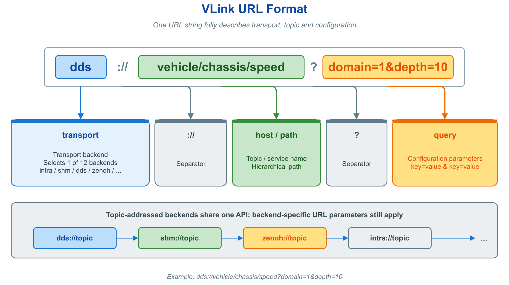
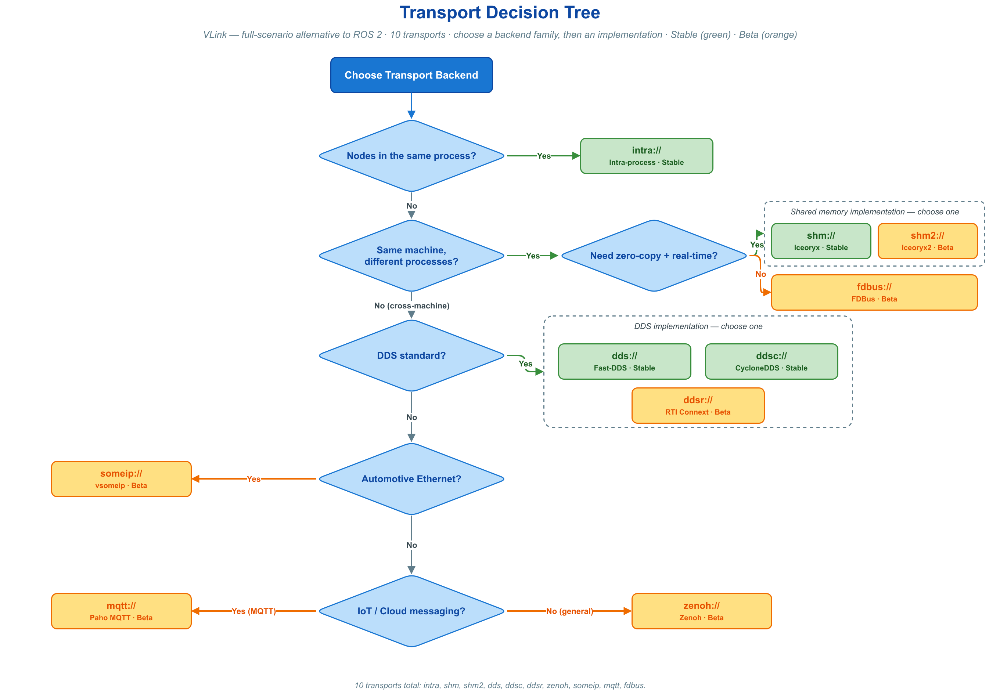
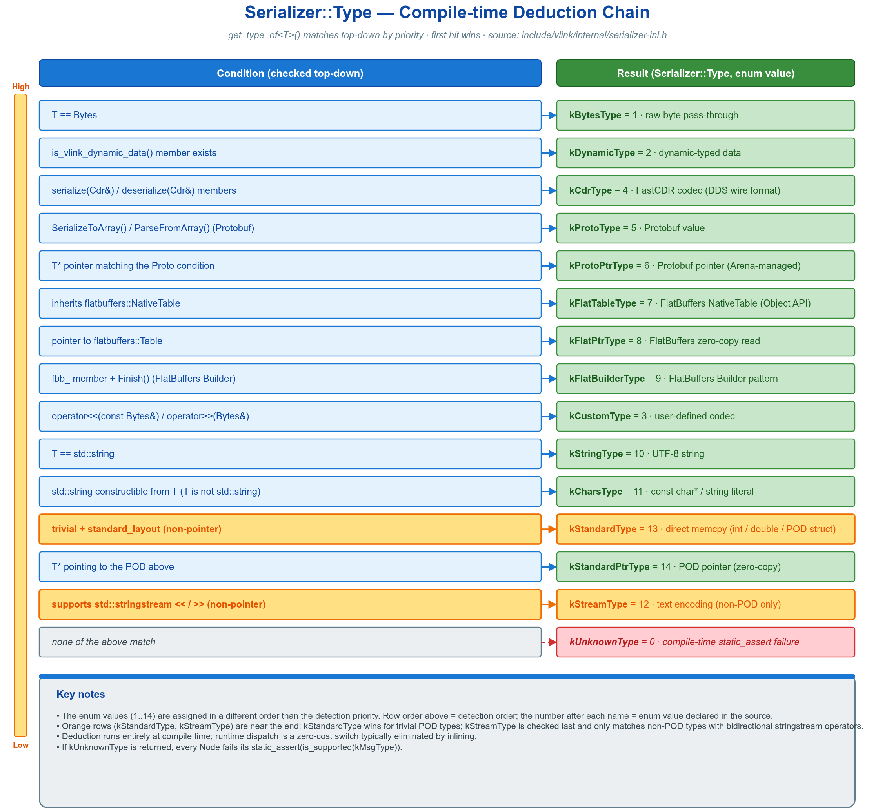
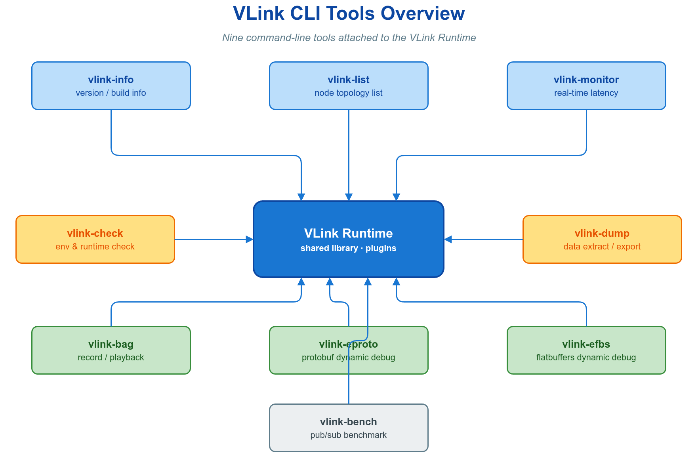
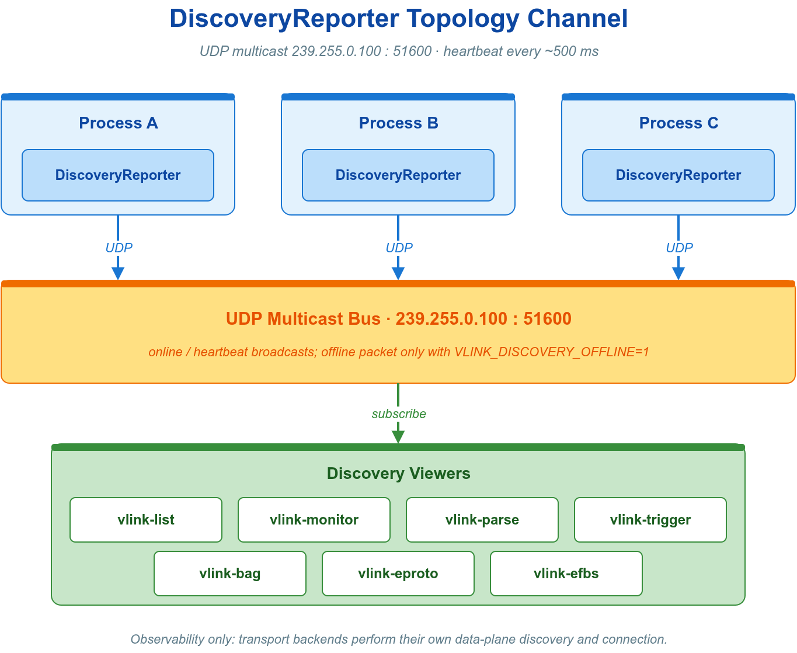
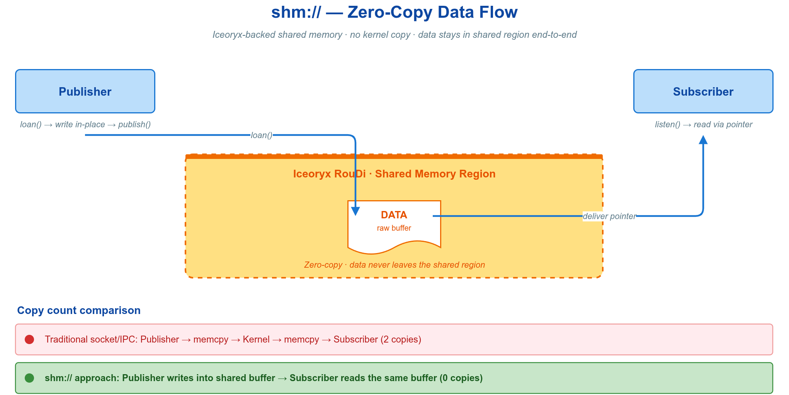

# 🆘 14. 速查与故障排查

本章是 VLink 的工程参考与排障手册，面向需在编码现场核对签名、或在运行现场定位异常的工程师。前半章（速查）给出 API、URL、QoS、CLI 与环境变量的单页索引；后半章（故障排查）按症状索引根因与处置。

二者共享同一组判据。VLink 的行为可归约为一条不变量：一次通信由“通信模型 + 后端可解析的 URL + 核心方法”确定，scheme 选择后端，地址和参数由该后端解释。绝大多数运行期故障来自两端解析后的 endpoint、Domain、安全/序列化配置不兼容，或目标后端依赖的网络、broker/router、共享内存运行时未就绪；DiscoveryReporter 多播则单独影响拓扑工具可见性。

完整语义与边界条件见各专题文档，本章只保留索引与判据。

---

## 🧱 14.1 编程骨架

三种通信模型对应六个核心原语。构造时以 URL 选定后端与端点，随后每个原语只需调用一个核心动作方法。

```cpp
#include <vlink/vlink.h>

// 事件模型:发布/订阅,单向多对多
vlink::Publisher<Imu> pub("dds://sensor/imu");
pub.publish(msg);
vlink::Subscriber<Imu> sub("dds://sensor/imu");
sub.listen([](const Imu& m) { process(m); });

// 方法模型:请求/响应
vlink::Server<Req, Resp> srv("dds://calc/add");
srv.listen([](const Req& q, Resp& r) { r.set_sum(q.left() + q.right()); });
vlink::Client<Req, Resp> cli("dds://calc/add");
auto resp = cli.invoke(req, std::chrono::seconds(3));

// 字段模型:最新值状态同步
vlink::Setter<Status> setter("shm://vehicle/status");
setter.set(status);
vlink::Getter<Status> getter("shm://vehicle/status");
getter.listen([](const Status& s) { use(s); });
```

---

## 📡 14.2 通信模型选型

模型首先由通信语义决定；迟到可见性等交付能力仍随后端与 QoS 而异。

| 模型 | 原语 | 语义 | 状态保留 | 适用 |
| --- | --- | --- | :-: | --- |
| 事件 Event | `Publisher` / `Subscriber` | 发布/订阅，单向多对多 | 无 | 传感器流、事件通知 |
| 方法 Method | `Client` / `Server` | 请求/响应，N 对 1 | 无 | RPC、命令下发取结果 |
| 字段 Field | `Setter` / `Getter` | 最新值同步；迟到获取随后端/QoS | Getter 缓存最近收到的值 | 状态/配置同步 |

判据：需要一对多广播且消费者不要求历史一致，用事件；需要返回值的请求/响应，用方法；只关心当前状态，用字段。若后加入者必须立即获得最新值，还须选择支持的后端/durability，并用 `wait_for_value()` 确认。完整语义见 [通信模型](02-communication.md)。

---

## 🧩 14.3 原语构造与核心 API

每个原语提供四种创建方式（两种构造 + 两个工厂），下以 `Publisher` 为例，其余五个同构：

```cpp
vlink::Publisher<T> pub(url_str);                                  // 构造,默认即初始化
vlink::Publisher<T> pub(url_str, vlink::InitType::kWithoutInit);   // 延迟初始化
auto up = vlink::Publisher<T>::create_unique(url_str);             // unique_ptr
auto sp = vlink::Publisher<T>::create_shared(url_str);             // shared_ptr
```

**事件模型 — Publisher / Subscriber**

| 端 | 方法 | 语义 |
| --- | --- | --- |
| Publisher | `bool publish(const T& msg, bool force = false)` | 序列化并发出一条消息；`force=false` 时无订阅者则跳过 |
| Publisher | `bool wait_for_subscribers(timeout)` | 阻塞至至少一个订阅者就绪 |
| Publisher | `bool has_subscribers() const` | 非阻塞查询是否有订阅者在线 |
| Publisher | `void detect_subscribers(ConnectCallback&&)` | 注册 `void(bool)` 回调，订阅者集合在空与非空间切换时触发（已有订阅者则注册时同步触发一次） |
| Subscriber | `bool listen(MsgCallback&&)` | 注册 `void(const T&)` 回调，每条消息触发一次 |

`listen()` 仅可调用一次。回调入参仅在回调执行期间有效，需带出作用域时必须先复制。

**方法模型 — Client / Server**

| 端 | 方法 | 语义 |
| --- | --- | --- |
| Client | `bool invoke(req, resp&, timeout)` | 同步调用，出参返回响应 |
| Client | `std::optional<Resp> invoke(req, timeout)` | 同步调用，超时返回 `nullopt` |
| Client | `bool invoke(req, RespCallback&&)` | 异步回调返回响应 |
| Client | `std::future<Resp> async_invoke(req)` | 异步调用，经 future 获取结果 |
| Client | `bool send(req)` | 单向调用，仅当 `Resp` 为空类型可用 |
| Client | `bool wait_for_connected(timeout)` / `bool is_connected()` | 等待 / 查询服务端就绪 |
| Client | `void detect_connected(ConnectCallback&&)` | 注册 `void(bool)` 回调，服务端就绪状态变化时触发（已发现服务端则注册时同步触发一次） |
| Server | `bool listen(void(const Req&, Resp&))` | 同步处理，填充 `resp` 后回复 |
| Server | `bool listen(void(const Req&))` | 单向处理，无回复 |
| Server | `bool listen_for_reply(cb)` + `bool reply(req_id, resp)` | 延迟异步回复 |

`listen()` 与 `listen_for_reply()` 互斥且各自仅可调用一次。

**字段模型 — Setter / Getter**

| 端 | 方法 | 语义 |
| --- | --- | --- |
| Setter | `void set(const V&)` | 写入最新值并广播；是否为晚加入 Getter 补送随后端/QoS |
| Getter | `std::optional<V> get() const` | 读取最新缓存值，首次写入前返回 `nullopt` |
| Getter | `bool wait_for_value(timeout)` | 阻塞至收到值，随后用 `get()` 读取 |
| Getter | `bool listen(MsgCallback&&)` | 每次更新触发 `void(const V&)` |
| Getter | `void set_change_reporting(bool)` | 置 `true` 后仅在值变化时触发回调 |

加密节点使用别名 `SecurityPublisher<T>` 等，等价于将原语末位安全模板参数置为 `SecurityType::kWithSecurity`，见 [§14.9](#-149-安全加密)。

---

## 🔁 14.4 节点公共方法

六个原语均派生自统一节点基类，共享下列生命周期与控制方法。

| 方法 | 语义 |
| --- | --- |
| `bool init()` / `bool deinit()` | 显式生命周期；构造默认 `kWithInit` 即自动 `init()` |
| `void interrupt()` | 中断阻塞中的 `wait_for_*` 调用 |
| `bool attach(MessageLoop*)` / `bool detach()` | 后端支持时将回调投递到指定 MessageLoop；intra/fdbus/someip 当前不支持 |
| `bool suspend()` / `bool resume()` / `bool is_suspend() const` | 暂停 / 恢复 / 查询收发 |
| `bool is_support_loan() const` | 当前后端是否支持零拷贝借贷 |
| `Bytes loan(int64_t size)` / `bool return_loan(const Bytes&)` | 借用 / 归还共享内存（见 [§14.10](#-1410-零拷贝)） |
| `const std::string& get_url() const` | URL 构造时返回原串；typed `Conf` 构造时为空 |
| `void set_safety_quit(bool)` | 销毁短于回调生命周期时启用，在回调与 `deinit()` 周围加锁防 use-after-free |
| `void set_ssl_options(const SslOptions&)` | TLS 配置，须在 `init()` 前设置；后端编译能力满足时适用 mqtt/dds/ddsc/ddsr/zenoh |

生命周期状态机与各方法的并发语义见 [通信模型](02-communication.md)。

---

## 🚌 14.5 传输后端与 URL

URL 语法：`<scheme>://[<host>[:<port>]]/<path>[?<query>][#<frag>]`。`scheme` 决定后端，`path` 决定端点，`query` 调节后端行为。



| 前缀 | 底层 | 范围 | 零拷贝 | 典型用途 | 状态 |
| --- | --- | :-: | :-: | --- | :-: |
| `intra://` | 进程内队列 | 同进程 | 是 | 进程内最低延迟 | 稳定 |
| `shm://` | Iceoryx | 同机跨进程 | 是 | 相机 / 点云 | 稳定 |
| `shm2://` | Iceoryx2 | 同机跨进程 | 是 | 下一代共享内存 | Beta |
| `dds://` | Fast-DDS | 跨机 | 否 | 多 ECU 协同 | 稳定 |
| `ddsc://` | CycloneDDS | 跨机 | 否 | 轻量跨机 | 稳定 |
| `ddsr://` | RTI Connext | 跨机 | 否 | 工业高可靠 | Beta |
| `zenoh://` | Zenoh | 跨机 / 云边 | 条件 | IoT 边缘 | Beta |
| `someip://` | vsomeip | 车载以太网 | 否 | ECU 服务化 | Beta |
| `mqtt://` | Paho MQTT | 跨机 / 云 | 否 | IoT 云端 | Beta |
| `fdbus://` | FDBus | 同机 | 否 | Android/Linux 混合 | Beta |

后端选型按部署拓扑与负载推进：同进程高频传递选 `intra://`；同机大负载选 `shm://`；跨机通用选 `dds://` 或轻量 `ddsc://`；车载服务化选 `someip://`；云边协同选 `zenoh://`；云端桥接选 `mqtt://`。



高频 query 参数：DDS 系支持 `domain` / `depth` / `qos`；`shm`/`shm2` 支持 `domain` / `depth`；`zenoh` 另有 `shm=<bool>`；`mqtt` 用 `qos=<0|1|2>`。`someip` 的 `service` / `instance` 写在主机/路径段（`someip://<service>/<instance>`，数值支持十进制/`0x` 十六进制/八进制），RPC 用 `?method=`、事件用 `?groups=&event=`、字段加 `?field=1`。完整参数与各后端能力见 [传输后端与 URL](04-transport.md)。

---

## 🎚️ 14.6 QoS 配置

节点没有运行时 `set_qos()`；QoS 可通过 URL 的 `?qos=<profile>` 引用命名 profile，也可在构造 typed `Conf` 时提供后端配置。预置 profile 按用途命名。

| Profile | 适用 |
| --- | --- |
| `event` | 离散控制事件 |
| `method` | RPC 请求/响应 |
| `field` | 最新值状态同步 |
| `sensor` | 高频传感器 |
| `command` / `alarm` / `log` | 控制指令 / 故障报警 / 日志流 |
| `parameter` / `service` / `clock` / `static` 等 | 配置 / 发现 / 时钟 / 地图，见 [QoS 配置](05-qos.md) |

```cpp
vlink::Publisher<Imu> pub("dds://sensor/imu?qos=sensor");

vlink::Qos qos = vlink::QosProfile::kSensor;
qos.history.depth = 50;
vlink::DdsConf::register_qos("my_sensor", qos);
vlink::Publisher<Imu> pub2("dds://sensor/imu?qos=my_sensor");
```

各 profile 的完整策略字段与默认值见 [QoS 配置](05-qos.md)。

---

## 🧬 14.7 消息序列化

序列化策略由消息类型在编译期推导，调用方无需手工选择或注册编解码器；不受支持的类型在编译期报错而非运行期失败。



开箱即用的类型族：POD 结构体（二进制直存，无编码转换但会内存复制）、Protobuf、FlatBuffers、DDS CDR（实现 `serialize/deserialize(Cdr&)`，生成含 encapsulation header 的字节负载）、`std::string`、仅用于发送的 `const char*` / `char[]`、`vlink::Bytes`，以及实现一对编解码运算符的自定义类型。接收文本必须使用 `std::string`；机制与自定义序列化见 [消息序列化](03-serialization.md)。

---

## 📝 14.8 日志宏

四种调用风格各覆盖六个级别（`_T`/`_D`/`_I`/`_W`/`_E`/`_F` 对应 Trace/Debug/Info/Warn/Error/Fatal）。

| 风格 | 示例 | 适用 |
| --- | --- | --- |
| 流式 `VLOG_X` | `VLOG_I("frame=", id, " lat=", ms, "ms");` | 默认；多变量、零分配 |
| 格式化 `MLOG_X` | `MLOG_W("t={} C", temp);` | fmt 风格占位 |
| printf 风格 `CLOG_X` | `CLOG_E("errno=%d", errno);` | 兼容既有 C 代码 |
| RAII 流 `SLOG_X` | `SLOG_D << "a=" << a;` | 链式 `<<` |

新代码默认优先 `VLOG_X`；多段嵌入值或复杂格式控制推荐 `CLOG_X`；
`MLOG_X` 只在相邻模块已采用 `{}` 占位格式时沿用。Info 只记录低频
正常状态，Warn 表示可恢复异常或降级，Error 表示当前操作失败，
Fatal 只用于无法安全继续的错误。

高频路径可用 `VLOG_{T,D,I,W,E}_EVERY_MS(interval_ms, ...)` 做线程安全的调用点级周期限频；Fatal 和其他日志宏族不提供该变体。

运行期由环境变量 `VLINK_LOG_LEVEL` 设定总级别，可填写 `0`..`6` 或对应英文名称（首字母大写、全大写、全小写）；`VLINK_LOG_CONSOLE_LEVEL` / `VLINK_LOG_FILE_LEVEL` 分别控制控制台与文件两个 sink，并接受相同取值。编译期将宏 `VLINK_LOG_LEVEL` 设为某级别后，更低级别的日志在 Release 下被整条消除。完整日志能力见 [基础库](08-base-library.md)。

---

## 🔒 14.9 安全加密

使用 `SecurityXxx<T>` 别名，通常在构造时传入 `Security::Config`；延迟初始化节点也可在 `init()` 前调用 `enable_security()`。初始化后安全配置不可替换，更换运行中端点的密钥须销毁并重建节点。

```cpp
vlink::Security::Config cfg;
cfg.key = "my-secret";
vlink::SecurityPublisher<Msg> pub("dds://topic", cfg);
```

| 配置字段 | 机制 |
| --- | --- |
| `key` | 对称密钥 |
| `passphrase` + `pbkdf2_salt` | 口令派生密钥（PBKDF2） |
| `public_key_pem` / `private_key_pem` | RSA 非对称封装 + AES 会话密钥 |
| `encrypt_callback` / `decrypt_callback` | 自定义算法，旁路内置管道 |

加密发生在序列化之后、传输之前，对上层透明。需 `ENABLE_SECURITY=ON`（默认开，依赖 OpenSSL）；`intra://` 与 `dds://` 的 CDR 载荷不参与逐消息加密管道。`mqtt://`、`dds://`、`ddsc://`、`zenoh://` 的通道可使用 TLS，经 `set_ssl_options()` 或 `VLINK_SSL_*` 环境变量配置。完整说明见 [安全加密](07-security.md)。

---

## ⚡ 14.10 零拷贝

支持借贷的后端（`shm`/`shm2`/带 SHM 的 `zenoh`）在共享内存中直接构造消息，避免序列化拷贝。发布端先借出缓冲、就地构造、再发布：

```cpp
vlink::Publisher<vlink::Bytes> pub("shm://image/raw");

if (pub.is_support_loan()) {
  vlink::Bytes buf = pub.loan(sizeof(vlink::zerocopy::CameraFrame));
  if (!buf.empty()) {
    auto* frame = new (buf.data()) vlink::zerocopy::CameraFrame(); // 就地构造,无额外拷贝
    fill_frame(frame);
    if (!pub.publish(buf)) {
      pub.return_loan(buf);                                       // 发布失败时显式归还
    }
  }
}
```

订阅端在回调返回后自动归还接收缓冲；需要在回调外继续持有数据时，应在回调内完成拷贝。

每次 `loan()` 须由一次 `publish()` 或一次 `return_loan()` 平衡；若 `publish()` 返回 `false`，调用方应显式归还——对已被后端消费的缓冲区 `return_loan()` 是无害空操作——否则内存池在持续负载下耗尽（见 [§14.19](#-1419-共享内存初始化失败或-loan-失败)）。预置零拷贝容器（命名空间 `vlink::zerocopy::`）：`RawData`、`CameraFrame`、`PointCloud`、`OccupancyGrid`、`Tensor`、`ObjectArray`、`AudioFrame`。容器结构与字段含义见 [零拷贝](06-zerocopy.md)。

---

## 🛠️ 14.11 命令行工具

所有工具支持 `-h`/`--help` 与 `-v`/`--version`；安装后另提供无前缀别名（`bag`/`bench` 等）。



| 工具 | 用途 | 顶层子命令 |
| --- | --- | --- |
| `vlink-info` | 版本 / 编译选项 | — |
| `vlink-check` | 系统诊断 | `diag` / `env` / `test` |
| `vlink-list` | 列出活跃节点 | — |
| `vlink-monitor` | 实时 TUI 监控 | — |
| `vlink-bag` | 录制 / 回放 / bag 管理 | `record` / `play` / `info` / `clone` / `check` / `reindex` / `fix` / `tag` |
| `vlink-trigger` | 内存触发录制（EDR）：滚动缓冲 + 触发落盘 | `daemon` / `dump` |
| `vlink-parse` | 从 URL / bag 抽取数据 | — |
| `vlink-eproto` | Protobuf 动态 pub/sub | `pub` / `sub` / `import` |
| `vlink-efbs` | FlatBuffers 动态 pub/sub | `pub` / `sub` / `import` |
| `vlink-bench` | 基准测试与报告 | `run` / `plot` / `pub` / `sub` |
| `vlink-proxy` | 远程监控守护进程（可内嵌 iox-roudi） | — |

各工具完整参数见 [命令行工具](10-cli-tools.md)；`vlink-proxy` 见 [可观测性](12-observability.md)。

---

## 🌐 14.12 高频环境变量

下表仅列最常用变量；含 DDS / Zenoh / MQTT / SHM 细项的全集见 [集成](13-integration.md)。

| 变量 | 作用 |
| --- | --- |
| `VLINK_LOG_LEVEL` | 日志总级别（`0=Trace` .. `5=Fatal`，`6=Off`；也接受对应英文名称） |
| `VLINK_LOG_DIR` | 日志输出目录 |
| `VLINK_DDS_IP` | DDS 发现对外通告的本机单播 IP 列表（多值以逗号或空格分隔） |
| `VLINK_DDS_PEER` | DDS 静态单播对端列表，绕开多播发现（多值以逗号或空格分隔，见 [§14.18](#-1418-跨机或容器不连通)） |
| `VLINK_DDS_DOMAIN` | DDS domain id |
| `VLINK_DISCOVER_DISABLE` | 置 `1` 关闭运行时发现上报 |
| `VLINK_DISCOVER_NATIVE` | 置 `1` 仅限本机发现 |
| `VLINK_PROTO_DIR` / `VLINK_FBS_DIR` | 动态 schema 目录（`vlink-eproto`/`-efbs`） |
| `VLINK_URL_PLUGINS` | 首次 URL 初始化前设置：完整值 `auto` 按需加载未链接的已知共享 transport，`none` / 空值关闭插件加载，其他非空值为显式预加载列表；模式值大小写不敏感 |
| `VLINK_BAG_PATH` | 进程级全局录制的 bag 文件路径（后缀须为 `.vdb`/`.vdbx`/`.vcap`/`.vcapx`），录制经过 Bytes 路径的普通六原语收发 action；限制见 [消息录制与回放](09-recording.md) |

如需逐节点而非进程级录制，可调用 API 层唯一录制钩子 `node.set_record_path(path)`：按相同后缀规则（`.vdb`/`.vdbx`/`.vcap`/`.vcapx`，不支持的后缀静默禁用）单独开启该节点的收发录制；`intra://` 不支持（触发 fatal 日志），`dds://` CDR 按完整封装字节录制。

---

## 📦 14.13 CMake 集成

```cmake
find_package(vlink REQUIRED COMPONENTS shm dds)
target_link_libraries(app PRIVATE vlink::vlink vlink::shm vlink::dds)

find_package(vlink REQUIRED COMPONENTS all)
target_link_libraries(app PRIVATE vlink::all)

vlink_generate_cpp(TARGET gen PROTO msg.proto)
target_link_libraries(app PRIVATE gen)
```

常用目标：`vlink::vlink`（核心）、`vlink::all`、`vlink::<module>`（intra/shm/dds 等）、`vlink::c_api`、`vlink::proxy_api`。

| 构建选项 | 默认 | 说明 |
| --- | :-: | --- |
| `BUILD_SHARED_LIBS` | ON | 动态库；OFF 时构建静态库 |
| `ENABLE_CXX_STD_20` | auto | 启用 C++20 特性 |
| `ENABLE_SECURITY` | ON | OpenSSL 加密 |
| `ENABLE_SQLITE` | ON | VDB bag 支持 |
| `ENABLE_ZSTD` | ON | bag Zstd 压缩 |
| `ENABLE_C_API` | ON | C ABI 库 |
| `ENABLE_PROXY` | ON | proxy / vlink-proxy |
| `ENABLE_VIEWER` / `ENABLE_WEBVIZ` | OFF | Qt GUI / Foxglove · Rerun 桥接 |

模块裁剪开关 `SKIP_*` 与完整选项表见 [快速开始](01-started.md)。

---

## 🧰 14.14 常用代码模式

**发布前等待订阅者就绪**

```cpp
pub.wait_for_subscribers(std::chrono::seconds(3));
pub.publish(msg);
```

**延迟初始化与显式 init**

```cpp
vlink::Publisher<T> pub("dds://topic", vlink::InitType::kWithoutInit);

if (!pub.init()) {
  return -1;
}
```

**方法模型的四种调用形态**

```cpp
Resp r;

if (cli.invoke(req, r, std::chrono::seconds(1))) {           // 同步出参
  use(r);
}

if (auto opt = cli.invoke(req, std::chrono::seconds(1))) {   // 同步 optional
  use(*opt);
}

cli.invoke(req, [](const Resp& r) { use(r); });              // 异步回调

auto f = cli.async_invoke(req);                              // future
use(f.get());
```

**字段模型等待首值后读取**

```cpp
if (getter.wait_for_value(std::chrono::seconds(2))) {
  use(*getter.get());
}
```

QoS 微调见 [§14.6](#-146-qos-配置)，零拷贝借贷见 [§14.10](#-1410-零拷贝)。跨线程安全退出用 `set_safety_quit(true)`。MessageLoop / Timer / ThreadPool 等基础库进阶用法见 [基础库](08-base-library.md)。

---

## 📁 14.15 示例目录

可运行示例与说明见 [快速开始](01-started.md)。

---

## 🩺 14.16 诊断流程

以下进入故障排查。VLink 的故障可归约为有限的几类根因：URL 端点不一致、运行环境配置缺失、传输后端未就绪、QoS 或负载特征不匹配。任何运行期异常均按下列顺序收敛根因——前两步获取一手证据，后两步建立系统拓扑视图。

```bash
# 1) 提升日志级别至最详细,取 C++ 层异常的 what() 文本
export VLINK_LOG_LEVEL=0
./your_app 2>&1 | head -50

# 2) 环境自检:IP、多播、内核参数、共享内存守护、磁盘等
vlink-check diag

# 3) 列出网络内活跃节点,判断两端是否互相发现(加 -n 仅查本机)
vlink-list

# 4) 查看本次构建编入的后端模块与启用特性
vlink-info -l
```

`vlink-check diag` 的自检项全集与告警阈值见 [命令行工具](10-cli-tools.md)。诊断时优先读取 `FAILED` 行的 `[DETAIL]` 列，其文本即根因描述。

| 工具 | 提供的证据 |
| --- | --- |
| `VLINK_LOG_LEVEL=0` | C++ 层异常 `what()`，多数错误的直接来源 |
| `vlink-check diag` | 运行环境（网络、内核、共享内存）的逐项体检结论 |
| `vlink-list` | 当前网络的节点与话题拓扑，判断发现是否成功（`-n` 仅列本机节点） |
| `vlink-info -l` | 本次构建的后端模块清单与特性开关 |

---

## 📭 14.17 收不到数据

现象为 `has_subscribers()` 恒为 `false`、订阅回调从不触发，或 `vlink-list` 两端互不可见。前两项属于数据面连接问题，最后一项属于 DiscoveryReporter 可观测性问题，二者应分开排查。

数据端点由后端解析 URL 后得到的地址及该后端相关参数确定，并非比较完整 URL 字符串。例如 SHM 会使用 address、event、domain 等字段，但忽略 `qos` 查询项。DDS、SHM、MQTT、Zenoh 等后端各自完成发现或连接；VLink 的拓扑上报多播不参与这些后端的数据匹配。

| 检查维度 | 判据与处置 |
| --- | --- |
| 后端与地址 | 两端须使用可互通的传输后端，并解析为相同 topic/service 地址；仅与该后端相关的查询参数才影响匹配 |
| Domain | 两端 `?domain=X` 或环境变量 `VLINK_DDS_DOMAIN` 须相同 |
| 安全模式 | 传输层可能已经匹配，但安全封装或密钥不一致会导致解密/校验失败，回调收不到有效消息（见 [安全加密](07-security.md)） |
| 序列化类型 | 两端消息类型须解析到同一序列化策略，Protobuf 与 FlatBuffers 不互通（见 [消息序列化](03-serialization.md)） |
| 后端发现 | DDS 检查其原生 discovery/peer 配置；SHM 检查 RouDi；MQTT 检查 broker；其他后端依其机制排查 |
| 拓扑可见性 | 仅当 `vlink-list` / Viewer 看不到节点时检查 VLink multicast（`239.255.0.100`）和 DiscoveryReporter 配置 |

DiscoveryReporter 基于 `239.255.0.100` 的 UDP 多播上报节点与端点元数据，供 `vlink-list`、Viewer 等工具观察拓扑。下图描述的是这条可观测性通道，不是各传输后端的数据面发现协议。



`vlink-list` 列不出任何节点时，可检查多播路由、`set_discovery_enabled(false)` 以及 DiscoveryReporter 是否被禁用。Linux 上可临时补一条出口路由验证：

```bash
sudo ip route add 239.255.0.100/32 dev eth0
```

排除链路本身的最小验证：以下两段代码的 URL 逐字相同，构成一条最短的收发回路。

```cpp
vlink::Publisher<MyMsg> pub("dds://vehicle/speed");
pub.wait_for_subscribers(std::chrono::milliseconds(500));
pub.publish(MyMsg{});
```

```cpp
vlink::Subscriber<MyMsg> sub("dds://vehicle/speed");
sub.listen([](const MyMsg& msg) { VLOG_I("received"); });
```

若该最小回路连通而业务代码不通，则回到上表逐项比对两端的 URL、Domain、安全模式与序列化类型。

---

## 🌍 14.18 跨机或容器不连通

现象为同机连通、跨机或容器内不连通。应先按实际传输后端检查数据面：DDS 的原生 discovery/静态 peer、Zenoh 路由、MQTT broker、SOME/IP 网络等。`239.255.0.100` 只影响 VLink 拓扑工具的跨机可见性，不会替代这些后端的发现或连接机制。

| 环节 | 确认方法与处置 |
| --- | --- |
| 防火墙 | 按后端放行实际数据与发现端口；若仅拓扑工具不可见，再检查 `239.255.0.100:51694` |
| 网卡多播标记 | `ip link show eth0 \| grep MULTICAST` 应含 `MULTICAST` |
| 容器网络 | `--net=host` 可用于区分 bridge/NAT 问题；需要的端口与多播取决于所用后端 |
| 容器共享内存 | `/dev/shm` 默认 64 MB，`shm://` 易失败，启动加 `--shm-size=2g` |
| 跨子网 / VPN / K8s | 按后端配置路由、broker/router 或静态单播 peer；不要用 VLink Reporter 多播代替数据面配置 |

DDS 原生发现受限时可配置静态单播 peer；跨 NAT 或复杂网络时也可根据部署条件选择具备路由能力的后端。若数据已通但 `vlink-list` 不可见，则只需修复 Reporter 多播或改为本机观察。

```bash
# 方案 A:使用可达 zenohd/router，并为节点配置对应的完整 Zenoh URL
zenoh://vehicle/speed
```

```bash
# 方案 B:DDS 静态单播对端,绕开多播;多个对端以逗号或空格分隔
export VLINK_DDS_PEER=10.0.0.1,10.0.0.2
```

统一 API 允许在不改业务处理逻辑的情况下更换节点 URL，这也是有效的故障隔离手段。地址模型兼容的 topic 后端通常只需替换 scheme；SOME/IP、MQTT、FDBUS 等后端仍须提供各自合法的完整地址和查询参数。

| 验证场景 | 切换至 | 隔离意义 |
| --- | --- | --- |
| 同进程内收发 | `intra://` | 纯内存通路，排除全部网络因素 |
| 同机跨进程 | `shm://` | 共享内存通路，绕开 UDP 与多播 |
| 跨机局域网 | `dds://` / `ddsc://` | 标准 RTPS，多播自动发现 |
| 跨子网 / NAT / VPN | `zenoh://` | 通过可达 zenohd/router 或显式 connect/listen endpoint 建立路由 |

后端选型与差异见 [传输后端与 URL](04-transport.md)，环境变量全集见 [集成](13-integration.md)。

---

## 🧯 14.19 共享内存初始化失败或 loan 失败

现象为 `shm://` 端点构造失败、`loan()` 返回空或报 `Failed to loan buffer`。机制根因有二：共享内存守护进程未运行，或借出的缓冲未归还致内存池耗尽。



首选处置是启动 `vlink-proxy -c`：它在自身进程内内嵌共享内存守护并预分配适配 VLink 载荷的内存池，无需额外配置。

```bash
vlink-proxy -c                   # 默认内存策略
vlink-proxy -c -l 3              # 点云等大消息场景,使用最大档内存池
ls /dev/shm | grep iox           # 验证共享内存段是否存在
```

`vlink-proxy` 同时承担远程拓扑监控，单进程即提供共享内存守护与监控两项能力。跨机排障时据此判断故障位于控制面还是数据面，详见 [可观测性](12-observability.md)。

`loan()` 失败的第二类根因是借出未归还：每次 `loan()` 须由一次成功进入后端的 `publish()` 或一次显式 `return_loan()` 平衡。若 `publish()` 因无订阅者等条件在提交前返回 `false`，调用方仍须显式归还，否则内存池在持续负载下会耗尽。订阅端接收缓冲由框架在回调返回后自动归还，生命周期规则见 [§14.10](#-1410-零拷贝)。

边界条件：`shm://` / `shm2://` 的 address 或 `event` 超过 80 字符上限会构造失败，须缩短或以哈希替代；`shm://` 与 `shm2://` 是相互独立的共享内存域，两端须使用同一前缀；Android 构建会跳过 `shm://`，应改用 `dds://` 或 `intra://`。macOS/QNX 可构建 Iceoryx SHM，但仍须提供 RouDi 运行时。

---

## 💥 14.20 构造抛异常或链接失败

构造 `Publisher`、`Client`、`Setter` 等节点时抛 `vlink::Exception::RuntimeError`。先以 `VLINK_LOG_LEVEL=0` 取异常 `what()`，再按文本对照下表。多数根因为 URL 语法错误或目标后端未编入本次构建。

| 异常文本 | 含义与处置 |
| --- | --- |
| `The URL transport prefix cannot be empty.` | URL 缺少 `xxx://` 前缀 |
| `Invalid character found in the URL transport prefix.` | scheme 含非法字符 |
| `A path is required on a hierarchical URL, even an empty path.` | URL 缺少 path 部分 |
| `Bad key in the query string!` | `?` 之后的查询参数名拼写错误 |
| `Unsupported plugin module, libname: ...` | 该 scheme 对应后端未编入本次构建，或插件库未找到 |

最后一条对应后端模块缺失：以 `vlink-info -l` 查看 `Modules:` 行是否含目标后端；项目的 `find_package(vlink REQUIRED COMPONENTS ...)` 须列出所需模块。

链接期出现 `undefined reference to vlink::...` 时，根因通常是漏链核心库——模块库依赖核心库，核心库须始终在列。

```cmake
target_link_libraries(app PRIVATE vlink::vlink vlink::shm vlink::dds)
```

构建期依赖缺失（`iceoryx`、`fastdds` 等未找到）见 [快速开始](01-started.md)；可经 `conan install . --build=missing` 拉齐依赖。

---

## 📈 14.21 性能抖动、丢样本与 CPU 偏高

现象为延迟 P99 显著高于 P50、偶发丢消息或 CPU 占用异常。机制根因集中于回调阻塞热路径、QoS 历史深度不足以吸收突发流量、调试日志开销，以及大消息未走零拷贝。

| 根因 | 处置 |
| --- | --- |
| 回调内执行重操作 | `listen` 回调内的文件 IO、加锁、堆分配、序列化均阻塞热路径，应转交 `ThreadPool` |
| QoS 历史深度过小 | 突发流量下 `KeepLast(1)` 易丢样本，传感器流改用更深历史或 `?qos=sensor`（见 [§14.6](#-146-qos-配置)） |
| 调试日志开销 | 生产环境置 `VLINK_LOG_LEVEL=3`（Warn 及以上），避免 Trace/Debug |
| 大消息序列化拷贝 | 经 `loan()` 走零拷贝，规避序列化层 `memcpy`（见 [§14.10](#-1410-零拷贝)） |

定位丢样本须在订阅端开启延迟与丢失统计，框架将给出端到端延迟与已丢样本数。统计本身有开销，仅在调试期开启。

```cpp
sub.set_latency_and_lost_enabled(true);
auto stats = sub.get_lost();
VLOG_I("latency=", sub.get_latency(), " ns, lost=", stats.lost, "/", stats.total);
```

批量基准对比用 `vlink-bench run --preset quick`（报告含 `CPU%` 列）；逐端点 CPU 经 `Node::get_cpu_usage()` 读取，需设环境变量 `VLINK_PROFILER_ENABLE`。多数场景无需逐字段配置 QoS，按流量类型在 URL 引用预定义 profile（见 [§14.6](#-146-qos-配置)）即为最常见的有效处置。

---

## 🔧 14.22 排障常用 API 参考

下列接口在排障中使用频度最高，签名以 `publisher.h`、`subscriber.h`、`node.h` 为准。

| 接口 | 语义 |
| --- | --- |
| `pub.has_subscribers()` | 非阻塞查询是否存在订阅者，发送前的首要检查 |
| `pub.wait_for_subscribers(timeout)` | 阻塞至至少一个订阅者就绪，规避发送早于订阅 |
| `sub.set_latency_and_lost_enabled(true)` | 开启订阅端延迟与丢样本统计，仅调试期使用 |
| `sub.get_latency()` | 读取端到端延迟（纳秒） |
| `sub.get_lost()` | 读取 `SampleLostInfo`，含 `.lost` 与 `.total` |
| `InitType::kWithoutInit` + `init()` | 延迟初始化，将异常从构造期移至可控的 `init()` |
| `interrupt()` | 中断 `wait_for_*` 等阻塞等待，配合优雅退出 |

延迟初始化将"构造即抛异常"转为可在外层捕获并重试的两段式，适用于后端就绪时机不确定的场景。

```cpp
vlink::Publisher<MyMsg> pub("dds://vehicle/speed", vlink::InitType::kWithoutInit);
if (!pub.init()) {
  VLOG_W("init failed, will retry later");
}
```

---

## 🗂️ 14.23 Bag、C API 与安全的排障入口

下列主题各有专章，此处仅给出排障切入点与关键边界条件。

- **Bag 损坏或无法打开**：先 `vlink-bag check file.vdb`；结构损坏用 `vlink-bag reindex`，数据损坏用 `vlink-bag fix`（`-y` 进入重建模式）。录制进程须经 `SIGINT`/`SIGTERM` 优雅退出，不可 `kill -9`。`.vcap` 即 MCAP，可由 Foxglove 直接打开；读写 `.vdb` 须在构建时启用 `ENABLE_SQLITE`。详见 [录制与回放](09-recording.md)。
- **C API 返回码**：`VLINK_RET_RUNTIME_ERROR` 表示底层构造或初始化抛异常（以 `VLINK_LOG_LEVEL=0` 取 `what()`）；`VLINK_RET_MEMORY_ERROR` 表示调用方缓冲过小，此时 `vlink_get()` 会把所需字节数写回 `*size`，据此扩容后重试（`data` 不可为 `NULL`）；`VLINK_RET_TRANSFER_ERROR` 表示发布、监听或调用失败（发布端常因无订阅者）。每个 `vlink_create_*` 须配对 `vlink_destroy_*`。详见 [集成](13-integration.md)。
- **安全模式**：两端密钥与配置须完全一致，不一致时连接建立但解密失败（GCM 校验失败返回 `false`）。CDR 类型不支持 VLink 消息级加密，因为安全封装后的字节不再是合法的原生 CDR 负载；需加密时改用 Protobuf、FlatBuffers 或 Bytes，或改用 DDS 自身的 RTPS-Security。详见 [安全加密](07-security.md)。

---

## 🔎 14.24 错误文本反查

将日志中的错误文本在此反查处置要点，细节归类见对应小节。

| 错误文本 | 处置 |
| --- | --- |
| `The URL transport prefix cannot be empty.` | URL 缺少 `xxx://` 前缀，见 §14.20 |
| `Bad key in the query string!` | URL `?` 之后参数名拼写错误，见 §14.20 |
| `Unsupported plugin module, libname: ...` | scheme 对应后端未编入或插件缺失，见 §14.20 |
| `Cdr type does not support security.` | CDR 与加密不兼容，改用 Protobuf/FlatBuffers 或 DDS-Security，见 §14.23 |
| `Topic ... has no CDR type name.` | CDR 节点未提供 DDS 类型名；为 Bytes 节点调用 `set_ser_type(type, SchemaType::kCdr)`，或使用可自动推导类型名的 IDL/ROS 2 消息 |
| `DDS raw/CDR mode and CDR type name cannot be changed while initialised` | 先调用 `deinit()`，修改序列化元数据后再调用 `init()` |
| `Failed to loan buffer, size: ...` | 共享内存池不足或借出未归还，见 §14.19 |
| `Shm roudi is not supported.` | 确认 `vlink-proxy -c` 已启动，业务进程不应自行启动 RouDi，见 §14.19 |
| `ShmConf: Input string length is too long.` | 共享内存 runtime name 超过 80 字符，缩短后重试，见 §14.19 |
| `Database version is incompatible.` / `Mcap version is incompatible.` | Bag 与读取端版本错位，升级读取端，见 §14.23 |
| `Must set proto dir [-d], ...` | 动态 proto 未设 schema 目录，以 `-d` 指定或设 `VLINK_PROTO_DIR` |
| `Plugin: Version mismatch: ...` | 插件主版本须与 VLink 一致，重新编译插件对齐版本 |
| `VLINK_RET_RUNTIME_ERROR` / `_MEMORY_ERROR` / `_TRANSFER_ERROR` | C API 返回码，见 §14.23 |

各后端与各 CLI 工具的完整错误目录分别见 [传输后端与 URL](04-transport.md) 与 [命令行工具](10-cli-tools.md)，插件加载相关见 [集成](13-integration.md)。

---

## 📨 14.25 提交问题前的信息收集

经上述流程仍无法定位时，按下列清单收集信息并提交至项目 issue（标签 `triage`）。

1. `vlink-info -l` 完整输出与 `vlink-check diag` 全文；
2. 一段开启 `VLINK_LOG_LEVEL=0` 的运行日志；
3. 可复现问题的最小收发双端程序及其使用的 URL。

---

## 📚 相关文档

- 概述 [00-overview](00-overview.md) · 快速开始 [01-started](01-started.md)
- 通信模型 [02-communication](02-communication.md) · 序列化 [03-serialization](03-serialization.md)
- 传输后端与 URL [04-transport](04-transport.md) · QoS 配置 [05-qos](05-qos.md)
- 零拷贝 [06-zerocopy](06-zerocopy.md) · 安全加密 [07-security](07-security.md)
- 基础库 [08-base-library](08-base-library.md) · 录制与回放 [09-recording](09-recording.md)
- 命令行工具 [10-cli-tools](10-cli-tools.md) · 可视化 [11-visualization](11-visualization.md)
- 可观测性 [12-observability](12-observability.md) · 集成 [13-integration](13-integration.md)
- 贡献规范 [15-contributing](15-contributing.md) · 回根目录 [README.md](../README.md)
