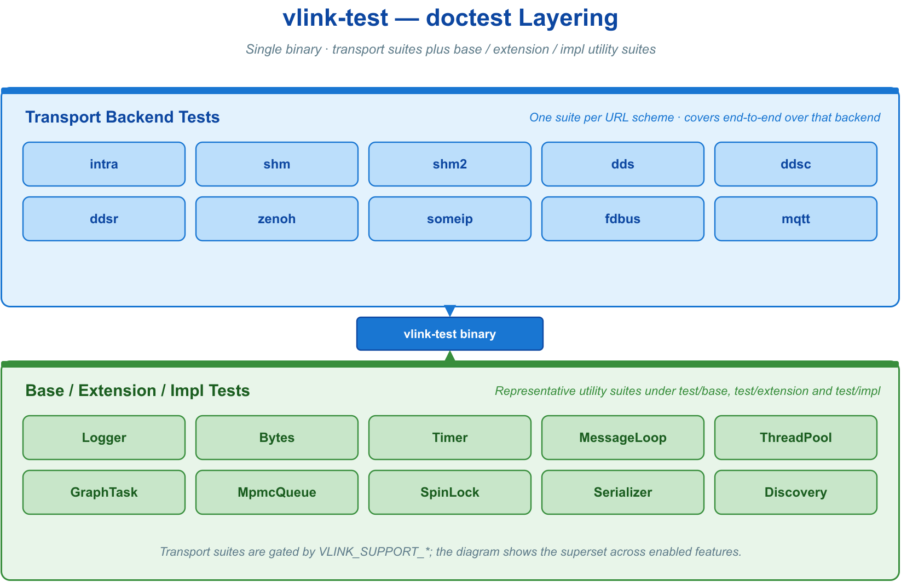
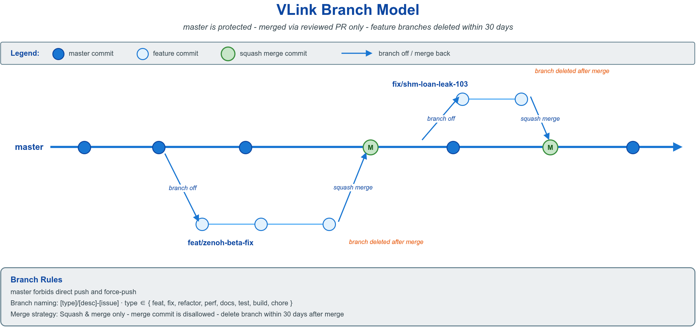

# 🫶 15. 测试与贡献规范

本章面向 VLink 贡献者，覆盖从"验证一段通信代码是否正确"到"将其合入主仓库"的完整工程链路。测试与贡献合并为一章，是因为二者构成同一条质量约束的两端：仓库只接收经过验证的代码，"经过验证"的标准由前半部分的测试机制定义，"如何提交"的标准由后半部分的工程规范定义。一条 PR 的可合并性，取决于其测试是否覆盖正常、边界与异常路径，以及其分支、提交、代码风格与文档同步是否合规——前者保证改动正确，后者保证改动可评审、可回溯、可长期维护。

全章按贡献者的实际工作顺序组织：先建立测试体系（[§15.1](#-151-测试体系的概念与机制)–[§15.7](#-157-覆盖率)），使每一处改动都能在单进程内被端到端验证；再给出贡献规范（[§15.8](#-158-提交流程概览)–[§15.19](#-1519-评审发布与禁止事项)），约定分支、提交、PR、代码风格与文档同步。两部分的衔接点是测试要求（[§15.15](#-1515-测试要求)），它把测试能力固化为 PR 的硬性门槛。



VLink 的用法与 API 详见 [概述](00-overview.md) 与 [通信模型](02-communication.md)，本章不复述；构建开关（`ENABLE_TEST`、ASAN、覆盖率工具链）见 [快速开始](01-started.md)。

---

## 🧪 15.1 测试体系的概念与机制

VLink 的测试体系建立在一个关键性质之上：`intra://` 后端在单进程内提供完整的发布订阅、请求响应与状态同步语义，无需任何守护进程或网络配置。因此一对通信原语的往返验证可在普通单元测试进程内完成，并因 URL 契约而平滑迁移到跨进程、跨机后端。

通信代码的测试难点在于其异步性与跨端点性：消息的发送方与接收方解耦，回调在独立线程触发，端点的就绪存在时序窗口。直接"发送后立即断言收到"会引入与机器负载相关的不稳定结果。

VLink 提供两类机制消除时序不确定性：

| 机制 | 接口 | 作用 |
| --- | --- | --- |
| 就绪等待 | `wait_for_subscribers` / `wait_for_connected` / `wait_for_value` | 阻塞至对端连接或首个值到达，返回 `bool` 表示是否在超时内就绪 |
| 后端隔离 | `intra://` 前缀 | 进程内传输，端点发现为同步操作，无网络抖动 |

测试的标准结构因此固定为三步：**建立端点 → `wait_for_*` 确认就绪 → 发送并断言**。回调中对计数或捕获状态的读写跨线程发生，须用 `std::atomic` 或互斥保护。此结构贯穿 [§15.3](#-153-三种通信模型的端到端测试) 的全部用例，其稳定性依据汇总于 [§15.6](#-156-并发测试的稳定性约束)。

测试框架采用 [doctest](https://github.com/doctest/doctest)，以头文件形式引入，无需链接额外动态库。

| 断言 | 语义 |
| --- | --- |
| `CHECK(expr)` | 失败时记录并继续执行当前用例 |
| `REQUIRE(expr)` | 失败时中止当前用例 |
| `CHECK_THROWS_AS(expr, T)` | 断言 `expr` 抛出类型为 `T` 的异常 |
| `SUBCASE("name")` | 在同一 `TEST_CASE` 内定义独立执行的子场景 |

```cpp
#include <doctest/doctest.h>

TEST_CASE("module-feature") {
  CHECK(1 + 1 == 2);
}
```

---

## 📁 15.2 目录结构

测试按传输后端与功能域分文件组织，每个文件以 `TEST_SUITE("<后端>-<方面>")` 分组，方面取 `init` / `pubsub` / `method` / `field` / `qos` / `security` / `error` / `status` 等，可由 `--test-suite=` 过滤（`test/CMakeLists.txt` 编译期为测试目标定义 `DOCTEST_CONFIG_USE_STD_HEADERS`，并扫描每个源文件的 `TEST_SUITE(...)` 名，按 suite 名拆成多个 `ctest` 用例）。每个传输后端单独一个文件，无依赖时由 `modules/<name>/` 是否构建决定是否纳入。

```
test/
├── main.cc            # doctest 入口（DOCTEST_CONFIG_IMPLEMENT）
├── common_test.h      # 公共头：vlink include、std 头与 wait_until 辅助
├── intra_test.cc      # intra:// 进程内
├── shm_test.cc        # shm:// 共享内存
├── shm2_test.cc       # shm2://
├── dds_test.cc        # dds://（FastDDS）
├── ddsc_test.cc / ddsr_test.cc                  # ddsc:// / ddsr://
├── zenoh_test.cc      # zenoh://
├── someip_test.cc / mqtt_test.cc / fdbus_test.cc
├── serializer_test.cc # 序列化（suite 前缀 ser-）
├── base/              # 基础库：logger/bytes/timer/message_loop 等
├── extension/         # bag/discovery/qos/security 等扩展
├── impl/              # 内部实现（url/conf/各 *Impl）
├── modules/           # 各后端 *Conf 单元测试
├── zerocopy/          # CameraFrame/PointCloud 等零拷贝容器
└── idl/               # 测试用 .proto / .fbs / .idl
```

---

## 🔁 15.3 三种通信模型的端到端测试

以下用例均使用 `intra://`，可直接编译运行，均遵循 [§15.1](#-151-测试体系的概念与机制) 给出的三步结构。

### 📨 15.3.1 事件模型（Publisher / Subscriber）

`publish` 返回 `bool` 指示是否成功投递。订阅回调在传输线程触发，计数器须为 `std::atomic`；发送后保留时间余量供回调完成。

```cpp
#include <atomic>
#include <chrono>
#include <thread>

#include <doctest/doctest.h>
#include <vlink/vlink.h>

TEST_SUITE("intra-pubsub") {
  TEST_CASE("pub-sub round-trip") {
    std::atomic<int> count{0};

    vlink::Publisher<std::string> pub("intra://greeting");
    vlink::Subscriber<std::string> sub("intra://greeting");

    sub.listen([&count](const std::string& msg) {
      if (msg == "hello") {
        ++count;
      }
    });

    CHECK(pub.wait_for_subscribers(std::chrono::milliseconds(500)));
    CHECK(pub.publish("hello"));

    std::this_thread::sleep_for(std::chrono::milliseconds(100));
    CHECK(count.load() == 1);
  }
}
```

> `listen` 的回调入参仅在回调内有效，需外带时先复制；每个订阅者只能调用一次 `listen`。

### 📞 15.3.2 方法模型（Client / Server）

同步 `invoke(req, resp, timeout)` 在超时内回填出参并返回 `true`；`async_invoke` 返回 `std::future`，用 `wait_for` 设置兜底超时以避免在故障下永久阻塞。

```cpp
TEST_SUITE("intra-method") {
  TEST_CASE("invoke returns response") {
    vlink::Server<int, int> srv("intra://square");
    srv.listen([](const int& req, int& resp) { resp = req * req; });

    vlink::Client<int, int> cli("intra://square");
    CHECK(cli.wait_for_connected(std::chrono::milliseconds(500)));

    int resp = 0;
    CHECK(cli.invoke(7, resp, std::chrono::milliseconds(1000)));
    CHECK(resp == 49);
  }

  TEST_CASE("async_invoke avoids blocking") {
    vlink::Server<int, int> srv("intra://inc");
    srv.listen([](const int& req, int& resp) { resp = req + 1; });

    vlink::Client<int, int> cli("intra://inc");
    REQUIRE(cli.wait_for_connected(std::chrono::milliseconds(500)));

    std::future<int> fut = cli.async_invoke(41);
    REQUIRE(fut.wait_for(std::chrono::seconds(5)) == std::future_status::ready);
    CHECK(fut.get() == 42);
  }
}
```

> 当服务端不返回响应（`Server<Req>`）时，客户端以 `cli.send(req)` 发起单向调用。

### 🗃️ 15.3.3 字段模型（Setter / Getter）

字段模型保留最新值。`set` 写入后，`wait_for_value` 阻塞至首个值到达，`get` 返回 `std::optional`，首次写入前为 `std::nullopt`。

```cpp
TEST_SUITE("intra-field") {
  TEST_CASE("getter reads latest value") {
    vlink::Setter<int> setter("intra://speed");
    vlink::Getter<int> getter("intra://speed");

    setter.set(120);

    CHECK(getter.wait_for_value(std::chrono::milliseconds(500)));
    CHECK(getter.get().value() == 120);
  }
}
```

---

## 🔀 15.4 跨后端与带 QoS 复测

由于业务代码不感知后端，将上述任一用例的 `intra://` 前缀替换为 `shm://`、`dds://` 或 `zenoh://`，即可在目标传输上重复验证，源码无需改动。跨进程后端的端点发现涉及网络或共享内存初始化，耗时高于进程内传输，相应 `wait_for_*` 超时应放宽至 500ms–2000ms（依据见 [§15.6](#-156-并发测试的稳定性约束)）。

在 URL 后追加 `?qos=<档名>` 即可附带 QoS 策略复测可靠性、历史深度与持久化行为。常用预置档为 `event` / `method` / `field` / `sensor` / `command` / `static`（完整档名以 `QosProfile::get_available_qos_map()` 为准，另含 `alarm` / `clock` / `log` / `parameter` / `service` 等）。

```cpp
vlink::Publisher<std::string> pub("dds://greeting?qos=sensor");
vlink::Subscriber<std::string> sub("dds://greeting?qos=sensor");
```

QoS 档语义与自定义见 [QoS 配置](05-qos.md)；传输后端选型见 [传输后端与 URL](04-transport.md)。

---

## ⚙️ 15.5 编译与运行

测试目标为 `vlink-test`，由 `ctest` 统一调度。

```bash
cmake -B build -DCMAKE_BUILD_TYPE=Release -DENABLE_TEST=ON
cmake --build build --target vlink-test -j
ctest --test-dir build --output-on-failure
```

按 suite 或 case 过滤，其余 flag 见 doctest 官方文档：

```bash
./build/output/bin/vlink-test --test-suite="dds-*"    # 指定后端
./build/output/bin/vlink-test --test-case="*round*"   # 按用例名
./build/output/bin/vlink-test -tse="someip-*"         # 排除某 suite
```

> SOME/IP 测试依赖外部守护进程；在其缺失的环境中以 `-tse="someip-*"` 排除，避免用例挂起。

---

## 🧵 15.6 并发测试的稳定性约束

异步通信测试的不稳定来源于跨线程数据访问与时序假设。遵循以下约束可消除与机器负载相关的偶发失败。

| 约束 | 依据 |
| --- | --- |
| 跨线程计数与状态使用 `std::atomic` 或互斥保护 | 回调在传输线程触发，与断言线程并发访问 |
| 发送前以 `wait_for_*` 确认对端就绪 | 端点发现存在时序窗口，盲发可能丢失首条消息 |
| 发送后保留回调余量（进程内 ≥50ms，跨进程 500–2000ms） | 回调投递为异步，断言早于回调将误判 |
| `async_invoke` 的 `future` 设置 `wait_for` 超时 | 防止对端故障时永久阻塞测试进程 |

注意此处"保留回调余量"指验证型示例的简化写法；提交到仓库的正式用例须以事件同步替代固定延时，见 [§15.15](#-1515-测试要求)。

---

## 📊 15.7 覆盖率

仓库内置 `coverage` 目标，封装 gcov/lcov 数据采集与 HTML 报告生成。

```bash
cmake -B build -DCMAKE_BUILD_TYPE=Debug -DENABLE_TEST=ON -DENABLE_TEST_COVERAGE=ON
ctest --test-dir build --output-on-failure
cmake --build build --target coverage -j
```

覆盖率工具链与编译标志见 [快速开始](01-started.md)。

---

## 🚦 15.8 提交流程概览

以下转入贡献规范。配套设施已落地：统一格式与检查脚本（`tools/format.sh`、`tools/check.sh`）、`.github/PULL_REQUEST_TEMPLATE.md`、以及 `.github/workflows/` 下齐备的 CI 流水线（`ci-lint.yml`、`ci-test.yml`、`ci-coverage.yml`、`release*.yml` 等）。请以本章描述的规范为自检基准。



一次 PR 的最小路径如下；各步骤的约束在后续各节展开。

```bash
# 1. 从最新 master 起一个规范命名的功能分支
git fetch origin master
git checkout -b feat/add-websocket-transport-42 origin/master

# 2. 修改代码，仅格式化本次改动的文件
clang-format -i path/to/your_file.cc

# 3. 以 Conventional Commits 格式提交（type(scope): subject）
git commit -m "feat(module-websocket): add websocket transport backend"

# 4. 推送到自己的分支并发起 PR（PR 标题取最重要那条 commit 的 subject）
git push -u origin feat/add-websocket-transport-42
```

发起 PR 前对照 [§15.9 提交前核对清单](#-159-提交前核对清单)逐项确认；PR 描述按 [§15.12.2 模板](#-15122-pr-描述模板)填写。

---

## ✅ 15.9 提交前核对清单

本清单是本章贡献规范唯一权威核对项，其余各节为其展开。未通过的 PR 将被关闭并要求整改。

**代码**

- [ ] 新建 C/C++ 源文件顶部有完整 Apache 2.0 license header（[§15.13.4](#-15134-license-header)）
- [ ] `clang-format`、`clang-tidy`、`cpplint`、`cmake-format`、`actionlint` 五道关均通过、零告警（[§15.14](#-1514-静态检查clang-format--clang-tidy)）；仅本地跑 `clang-format`/`clang-tidy` 不足以通过 CI
- [ ] 新增公共头文件有 Doxygen 注释（至少 `@brief` + `@param` + `@return`）
- [ ] 不残留 `TODO`/`FIXME`/`XXX`/占位文本；确需保留写成 `// TODO(user, YYYY-MM-DD): what`
- [ ] 代码注释一律英文（中文仅允许出现在 `.md`/`.txt` 文档资产中）

**构建**

- [ ] `cmake -B build -DCMAKE_BUILD_TYPE=Debug -DENABLE_TEST=ON -DENABLE_TEST_WARN=ON` 通过（`ENABLE_TEST_WARN` 给 `vlink` 库目标加 `PUBLIC` 的 `-Wall -Wpedantic -Wextra -Werror`，并经依赖传播到测试目标；需同时开 `ENABLE_TEST` 才会编译测试）
- [ ] `cmake --build build -j` 全量通过；改动 module/CLI 的，对应 `ENABLE_*` 开关在 ON/OFF 两种状态下均通过
- [ ] 不提交 `build/` 目录与任何二进制产物

**测试**

- [ ] 新功能至少 1 条正常 + 1 条边界/异常用例；修复 bug 必带能复现该 bug 的回归测试
- [ ] `ctest --test-dir build --output-on-failure` 全部通过（[§15.15](#-1515-测试要求)）

**文档**

- [ ] 改动计数类事实 / CLI 选项 / env 变量 / 示例，按 [§15.16](#-1516-文档同步规则)同步全部相关位置
- [ ] 涉及的 `doc/images/*.drawio` 文字过期时，同步更新 `.drawio` 源并重新导出同名 `.png`

**兼容性**

- [ ] 公共头文件签名有改动 → 在 PR 描述列出破坏性变更清单（[§15.17](#-1517-api--abi-兼容性与-semver)）
- [ ] 新增 CMake 导出目标（`vlink::xxx`）→ 同步 [快速开始](01-started.md) 的目标列表

**提交**

- [ ] Commit 与 PR 标题符合 [§15.11](#-1511-分支与-commit-规范) / [§15.12](#-1512-pr-规范)

---

## 🧰 15.10 开发环境与工具版本

| 组件 | 最低版本 | 约束来源 |
|---|---|---|
| CMake | 3.15 | Conan 2 要求 |
| C++ 编译器 | GCC 9 / Clang 10 / MSVC 2019 / Apple Clang 12 | 必须支持 C++17 |
| clang-format / clang-tidy | 14+ | 低版本对 `.clang-format` 选项兼容性不一致 |
| Git | 2.25 | worktree / sparse-checkout |
| drawio (CLI) | 24.x | headless 导出 PNG（[§15.19.1](#-15191-示意图drawio贡献规则)）|

一次性准备（构建细节见 [快速开始](01-started.md)）：

```bash
clang-format --version          # 确认 >= 14
cmake -B build -DCMAKE_BUILD_TYPE=Debug -DENABLE_TEST=ON
cmake --build build -j
ctest --test-dir build --output-on-failure
```

约束项：不以 IDE"格式化整个文件"的结果提交（仅格式化改动行）；不提交 `.idea/`/`.vscode/` 等个人配置；不提交 `.log`/`.so`/`.exe`/`.a`/`.pdb` 等产物。drawio 导出的 `.png` 是文档资产，是唯一被纳入版本控制的二进制例外。

---

## 🌿 15.11 分支与 Commit 规范

### 🌱 15.11.1 分支模型与命名

VLink 采用 master + 功能分支模型：`master` 为保护分支，禁止直推与 force-push；功能分支从 `master` 起，合并后 30 天内删除；发布分支 `release/vX.Y.Z` 打完 tag 即删。

分支名格式 `type/summary-issue?`：全小写、连字符分词、`summary` ≤ 50 字符、尽量附 issue 号。

| 类型 | 用途 | 示例 |
|---|---|---|
| `feat/` | 新功能 / 新 API / 新 module | `feat/add-websocket-transport-42` |
| `fix/` | bug 修复 | `fix/shm-loan-leak-103` |
| `refactor/` | 不改功能的重构 | `refactor/split-proxy-server` |
| `perf/` | 性能优化 | `perf/intra-queue-lockfree-77` |
| `docs/` | 仅文档 / drawio | `docs/fix-cli-count-88` |
| `test/` `build/` `chore/` | 测试 / 构建系统 / 杂项 | `build/add-qnx-toolchain` |

禁止 `tmp/`、`test-1/`、人名前缀等不规范命名。

### 📝 15.11.2 Commit 格式（Conventional Commits）

```
type(scope): subject

body (optional)

footer (optional)
```

- **type**：`feat` `fix` `refactor` `perf` `docs` `test` `build` `ci` `chore` `style` `revert`
- **scope**（可选）：如 `core` `base` `extension` `proxy` `viewer` `webviz` `cli-NAME` `module-NAME` `examples` `docs` `cmake`；跨多 scope 可省略或用 `*`
- **subject**：英文祈使句、小写开头、不以句号结尾、≤ 72 字符；禁止 `update`/`various fixes`/`misc` 等无信息量措辞
- **body**（subject 未表达完整时）：说明改动动机、做法与影响面，每行 ≤ 72 字符
- **footer**：破坏性变更写 `BREAKING CHANGE: <描述 + 迁移提示>`；关联 issue 写 `Closes: #123` / `Refs: #98`

合规示例：

```
feat(module-mqtt): add TLS mutual-auth support via SslOptions

Public-cloud IoT brokers need mTLS for compliance. Wires the existing
SslOptions struct through the Paho MQTT C API on publish/subscribe paths.

Refs: #207
```

```
docs: fix CLI count drift across README and doc/00-overview

vlink-bench was missed in several docs. Synced README (EN+ZH),
overview, reference and the cli-tools-overview drawio + PNG.
```

不合规示例：`wip` / `update` / `fix bug` / `改了下代码` / `Merge branch 'master' into ...`（PR 内不应有 merge commit，用 rebase 替代）。

---

## 🔃 15.12 PR 规范

### 🏷️ 15.12.1 PR 标题

PR 标题取本次最重要那条 commit 的 subject，遵循相同规则（含 type/scope、小写开头、≤ 72 字符）：

```
feat(module-zenoh): expose keyexpr cache size via URL query
fix(viewer): resolve Qt6 OpenGLWidgets missing on ARM macOS
```

### 📄 15.12.2 PR 描述模板

仓库已提供 `.github/PULL_REQUEST_TEMPLATE.md`，发起 PR 时会自动套用；其结构与下述模板一致：

```markdown
## 背景（Why）
问题 / 动机 / 上下文；有 issue 写 `Closes #123`。

## 改动（What）
- 主要改动（≤ 5 条）；为何不选备选方案；哪些属破坏性变更。

## 影响面
- CMake 目标 / 公共头文件 / env 变量 / URL query / 连带的示例与测试。

## 验证（How）
- 本地构建 + 单测命令与结果；端到端手工步骤（如有）。

## ✅ Checklist
照 §15.9 逐项标注完成 / 未完成。
```

### 📐 15.12.3 大小、评审与合并

- **PR 大小**：理想 diff < 400 行（不含测试与自动生成代码）；> 1000 行通常要求拆分；同一 PR 不混合新功能、不相关格式化与不相关 rename。
- **评审响应**：作者 48 小时内回应首轮评审；评论后 3 个工作日无响应可被标记 `stale`。以追加 commit 推进评审，不以 force-push 覆盖历史。
- **合并策略**：默认 `Squash and merge`（合成 1 条 commit）；多个逻辑独立且各自有单测覆盖的 commit 可由维护者 `Rebase and merge`；禁止 `Create a merge commit`。

---

## 🎨 15.13 代码风格

### ✒️ 15.13.1 C++ 风格要点

基线为 Google C++ Style Guide 与项目 `.clang-format`（`BasedOnStyle: Google`、`ColumnLimit: 120`）：

- **缩进** 2 空格，**行宽** 120 硬上限。
- **命名**：文件 `snake_case.{h,cc}`、类 `PascalCase`、函数/方法 `snake_case()`、成员 `snake_case_`、常量 `kPascalCase`、宏 `SCREAMING_SNAKE_CASE`、命名空间 `snake_case`、模板类型形参 `PascalCase` 加 `T` 后缀（`MsgT`、`SecT`）。
- **头文件守卫** 统一 `#pragma once`。
- **include 顺序**：本文件对应头 → C 系统头 → C++ 标准库 → 第三方库 → 项目头，组间空行。
- **禁用**：头文件中 `using namespace`、裸 `new`/`delete`、C 风格强制转换、`NULL`（用 `nullptr`）。

### 🌐 15.13.2 注释语言

所有代码注释必须为英文，覆盖 `//`、`/* */`、Doxygen，以及 `CMakeLists.txt`/shell/python 脚本注释与临时 `TODO`。中文仅允许出现在 `doc/**/*.md`、`README.md`、`CHANGELOG.md`、`examples/**/README.md` 等文档资产中。当前 CI 没有独立的中文注释扫描器，该约束由提交者和评审者检查；普通 `NOLINT` 标记不会豁免此项目约定，确需保留中文术语时应在 PR 中说明。

```cpp
/** @brief Serialise @p msg into a raw byte buffer. */
vlink::Bytes serialize(const MsgT& msg);
// TODO(zhangsan, 2026-05-01): fix the loan-path leak.
```

### 📖 15.13.3 Doxygen 注释

公共头文件（`include/vlink/**`）的导出类、函数与枚举均需 Doxygen 注释，使用 `@brief`/`@tparam`/`@param[in,out]`/`@return`/`@note`/`@see` 等标记；代码块用 `@code{.cpp} ... @endcode`。不写"参数 a：第一个参数"这类零信息量内容。

```cpp
/**
 * @brief One-line summary (under 80 chars).
 * @param[in]  url  Target URL, e.g. "shm://sensor/imu".
 * @param[out] out  Filled on success.
 * @return  @c true on success; @c false if URL is malformed.
 */
```

### 🪪 15.13.4 License header

所有新建 C/C++ 源文件以完整的 22 行 Apache 2.0 header（含 ASCII logo）开头，可从任意现有 VLink 源文件复制；`YEAR` 填创建年份。CMake / shell / python 文件以相应注释风格转写同一段 license 文本。

```cpp
/*
 * Copyright (C) YEAR by Thun Lu. All rights reserved.
 * Author: <Your Name> <your.email@example.com>
 * Repo:   https://github.com/thun-res/vlink
 *  _    __   __      _           __
 * | |  / /  / /     (_) ____    / /__
 * | | / /  / /     / / / __ \  / //_/
 * | |/ /  / /___  / / / / / / / ,<
 * |___/  /_____/ /_/ /_/ /_/ /_/|_|
 *
 * Licensed under the Apache License, Version 2.0 (the "License");
 * you may not use this file except in compliance with the License.
 * You may obtain a copy of the License at
 *
 *     http://www.apache.org/licenses/LICENSE-2.0
 *
 * Unless required by applicable law or agreed to in writing, software
 * distributed under the License is distributed on an "AS IS" BASIS,
 * WITHOUT WARRANTIES OR CONDITIONS OF ANY KIND, either express or implied.
 * See the License for the specific language governing permissions and
 * limitations under the License.
 */
```

---

## 🔍 15.14 静态检查（clang-format / clang-tidy）

每个 PR 必须无条件通过五道静态检查关：除 `clang-format`、`clang-tidy` 外，CI（见 `.github/scripts/ci-lint.sh`）还强制 `cpplint`（`tools/check.sh`，`--counting=detailed --linelength=120`）、`cmake-format`（`tools/format.sh`，依仓库根 `.cmake-format`）与 `actionlint`（校验 `.github/workflows/*.yml`）。项目 `.clang-tidy` 设定 `WarningsAsErrors: '*'`，任何新增告警都会导致 CI 失败、PR 无法合并——这是硬门槛而非倾向。注意：仅在本地跑 `clang-format`/`clang-tidy` 并不足以通过 CI，还需保证上述其余三关干净。

推送前在本地执行下列增量便捷命令（仅扫描本次改动，覆盖最常踩的 `clang-format`/`clang-tidy` 两关）；其余 `cpplint`/`cmake-format`/`actionlint` 可直接跑对应工具或 `tools/format.sh`、`tools/check.sh` 验证。注意本地命令与 CI 范围不同：CI 的格式化是全树扫描（`tools/format.sh` 对整个仓库 `find` 全部文件，非 diff 增量），clang-tidy 经 `.github/scripts/ci-tidy.sh` 以 `-DCMAKE_CXX_CLANG_TIDY` 整目标构建（非逐改动文件 `-p`）：

```bash
# 1) 格式化本次改动的文件
git diff --name-only --diff-filter=ACMR origin/master...HEAD \
  | grep -E '\.(cc|cpp|cxx|h|hpp)$' | xargs -r clang-format -i

# 2) clang-tidy 扫描本次改动（需要 compile_commands.json）
cmake -B build-tidy -DCMAKE_BUILD_TYPE=Debug -DCMAKE_EXPORT_COMPILE_COMMANDS=ON
git diff --name-only --diff-filter=ACMR origin/master...HEAD \
  | grep -E '\.(cc|cpp|cxx)$' | xargs -r -n1 clang-tidy -p build-tidy
```

具体何种写法触发 tidy 告警属 clang-tidy 通用知识，以仓库根 `.clang-tidy` 配置为准，本章不展开。确需抑制单行时用 `// NOLINTNEXTLINE(具体-check-名): reason`：必须指定 check 名、必须附原因，禁止裸 `NOLINT`，评审会严查滥用。在本地先跑干净再推送，可避免因 lint 问题被打回而消耗评审轮次。

---

## 🎯 15.15 测试要求

PR 门槛为两条硬规则；测试框架细节（doctest、断言宏、`TEST_CASE`/`SUBCASE` 结构、命名约定）见本章前半部分（[§15.1](#-151-测试体系的概念与机制) 至 [§15.3](#-153-三种通信模型的端到端测试)），此处不重复。

- **新功能必带测试**：至少 1 条正常路径 + 1 条边界/异常路径；公共 API 须覆盖正向与异常路径。
- **修复 bug 必带回归测试**：先写一条能复现该 bug 的失败用例，再由修复使其转绿。

禁用的测试写法：

- 禁止 `sleep_for(...)` 等固定延时，改用事件同步（`wait_for` / `condition_variable` / `std::future`）。
- 禁止测试依赖互联网（下载资源、调用远程 API）。
- 禁止并发用例共用同一 DDS domain / SHM 段，改用随机化的 domain ID / topic 前缀隔离。

---

## 📚 15.16 文档同步规则

### 🔢 15.16.1 计数类事实的传播链

部分计数型事实横跨多个文档，修改时必须一次性改全，违例 PR 将被拒。

| 事实 | 必须同步的位置 |
|---|---|
| CLI 工具数量 | 根 README（中文 + `README.en.md`）/ [白皮书](00-whitepaper.md) / [概述](00-overview.md) / [快速开始](01-started.md) `ENABLE_CLI_*` 列表 / [CLI 工具](10-cli-tools.md) / [速查参考](14-reference.md) / `cli-tools-overview.drawio`、`overview-architecture.drawio`、`foreword-*.drawio` + PNG / `.github/wiki/`（`index.html` + `i18n.js` 三语）/ `CHANGELOG.md` |
| transport 模块数量 | 同上 + [传输后端与 URL](04-transport.md) |
| 序列化类型数量 | [消息序列化](03-serialization.md) / 根 README / [速查参考](14-reference.md) |
| QoS 预设数量 | [QoS 配置](05-qos.md) / [速查参考](14-reference.md) / `CHANGELOG.md` |
| base 库组件数量 | [基础库](08-base-library.md) 表格 / 概述相应表 |
| 示例数量 / 类别 | [快速开始](01-started.md) / 各 `examples/CATEGORY/README.md` |
| 环境变量 | [集成](13-integration.md) / [速查参考](14-reference.md) |
| CMake 选项 | 根 README / [快速开始](01-started.md) / 概述 |

计数本身易过期，以源码与专题 doc 为准，不在多处转抄数字。

### 🔗 15.16.2 其它同步规则

- 改动 CLI 任一子命令 / 顶层选项 → 同步更新 `cli/TOOL/etc/completions/vlink-TOOL.bash` 与 `.zsh` 两份补全脚本，二者子命令集合必须一致。
- 改动 env 变量 → 同步 [集成](13-integration.md)。
- 公共 API 的调用方式写在 Doxygen 注释中，其语义、动机与使用模式写在 `doc/`；不将 Doxygen 内容大段复制进教程 doc（存在过期风险），教程中引一个示例并链接到头文件即可。
- 跨 doc 引用一律用相对路径 + markdown 锚点（如 [通信模型总览](02-communication.md#-21-模型总览与选型)），禁止绝对 URL / GitHub 直链 / 项目根绝对路径。

---

## 🧩 15.17 API / ABI 兼容性与 SemVer

VLink 遵循 [Semantic Versioning 2.0](https://semver.org)：**MAJOR** 可含破坏性改动（须在 CHANGELOG 明列）；**MINOR** 只增不改、向后兼容；**PATCH** 只修 bug，不改 API/ABI。

| 破坏性变更（走 MAJOR） | 兼容变更（可走 MINOR） |
|---|---|
| 删除或 rename 任何 `include/vlink/**` 公共符号 | 新增 public symbol |
| 改现有公共函数/方法签名（入参 / 返回值 / 默认值） | 新增 enum 值（放末尾，不动已有值） |
| 改已有 enum 值 / struct 字段顺序或类型（破 ABI） | 新增 struct 字段（放末尾） |
| 改 URL scheme 或 query 参数名 | 新增 URL query 参数 |
| 改 CLI 子命令 / 顶层 flag 名 | 新增 CLI 子命令 |
| 改 CMake 导出目标名 / C API 返回码 / env 变量名 | 新增 CMake 选项（默认值对存量构建无影响） |

弃用但暂不删除的 API 用 `[[deprecated("use new_api() since v2.5.0")]]` 标注，至少保留至下一个 MAJOR 版本方可删除。

---

## 🛡️ 15.18 跨平台 / 性能 / 安全要点

### 🖥️ 15.18.1 跨平台

- 系统头用 `<>`；条件编译集中声明，不散落进函数体；路径分隔符只用 `/`。
- 线程优先 `std::thread`/`std::atomic`/`std::mutex`；时间一律 `std::chrono`，禁止混用 `time()`/`GetSystemTime()`。
- 整数用 cstdint 定长类型（`int32_t`/`uint8_t`），不用 `int`/`long`（Windows 与 Linux 宽度不一致）。
- QNX 不用 Linux 专有 `epoll`/`signalfd`/`eventfd`；Android 不链接 glibc-only 符号、不用 `pthread_cancel`；二者在 CMake 中以 `target_compile_definitions` 区分。

### ⚡ 15.18.2 性能

- 改动任一快路径（publish / invoke / listen 回调链）须以 `vlink-bench` quick 预设对比基线，并在 PR 中附对比；下降 > 5% 须说明原因或回滚。
- 不得在回调执行线程（包括 intra direct 的调用线程与后端 delivery thread）阻塞超过 1ms，重负载交给 `ThreadPool`；热路径日志用低优先级的 `VLOG_T`/`VLOG_D`，运行期按日志级别过滤，低于阈值时几近零开销。
- 不允许无上界容器（`vector` 未 `reserve()`、任意深度递归、无 TTL 的 cache）；全局状态须为进程级单例，或提供显式销毁接口。

### 🔒 15.18.3 安全

- 绝不将密钥 / 证书 / token / passphrase 提交到仓库；测试用密钥放 `test/fixtures/` 并明确标注 "TEST ONLY" 的自签证书。
- 所有公共 API 在入口校验输入（非空、边界、类型合法）；外部来源（URL / env / 文件 / 网络）字符串须有长度上限；反序列化前校验 size / CRC / 头。
- 加密只用项目内置的 `vlink::Security` 或业务回调，禁止自行实现 AES/RSA 或散落调用 OpenSSL 低层 API。
- 改动 `src/extension/security.cc`、处理加密 payload 的模块、密钥/证书/签名逻辑或认证握手流程的 PR，必须打 `security-review` 标签走安全评审。

### 🧱 15.18.4 新增构件检查项（Transport / CLI / Example / Plugin）

新增 VLink 专属构件时的通用要求；目录结构与计数位置以各专题 doc 为准（[传输后端与 URL](04-transport.md) / [CLI 工具](10-cli-tools.md) / [快速开始](01-started.md) / [集成](13-integration.md)）。

**新增 Transport**（例如 `ros2://`）

- [ ] 在 `modules/NAME/` 下仿照 `modules/mqtt/` 结构实现六原语（Publisher/Subscriber/Client/Server/Setter/Getter）工厂；URL 解析非法时抛 `Exception::RuntimeError`
- [ ] `modules/NAME/CMakeLists.txt` 定义 `SKIP_NAME` 选项与 `VLINK_SUPPORT_NAME` 宏，缺依赖时 `return()` 而非 `FATAL_ERROR`；新增 CMake target `vlink::NAME`
- [ ] 测试覆盖 Pub/Sub、Client/Server、Setter/Getter 三组双向；新增 `examples/url_guide/url_NAME/` 示例 + README
- [ ] 同步 README ×2 / [传输后端与 URL](04-transport.md) / [速查参考](14-reference.md) / `transport-decision-tree.drawio` + PNG / CHANGELOG

**新增 CLI 工具**

- [ ] `cli/TOOLNAME/` 目录含 `TOOL.cc` + `CMakeLists.txt`；根 CMake 加 `option(ENABLE_CLI_TOOLNAME)` + `add_subdirectory`
- [ ] 工具名统一 `vlink-TOOLNAME`；支持 `-h/--help` 与 `-v/--version`；提供 `.bash` + `.zsh` 补全脚本
- [ ] 同步 README ×2 / [CLI 工具](10-cli-tools.md) / [速查参考](14-reference.md) / `cli-tools-overview.drawio` + PNG；文档中至少一个完整调用示例

**新增 Example**

- [ ] `examples/CATEGORY/NAME/` 含 `CMakeLists.txt`（`target_link_libraries(... PRIVATE vlink::...)`）+ `README.md`（目标 / 用到的 API / 运行方式 / 预期输出）
- [ ] 单文件 ≤ 300 行；更新上级 `add_subdirectory` 与 [快速开始](01-started.md) 计数

**新增 Plugin 接口**

- [ ] `include/vlink/extension/NAME_plugin_interface.h` 定义抽象基类：业务纯虚函数 + 虚析构（仿 `bag_plugin_interface.h` / `trigger_plugin_interface.h`；版本由 `VLINK_PLUGIN_DECLARE` 的 major/minor 版本门承担，虚表 ABI 变更时必须提升 major），经 `vlink::Plugin` 框架按 ABI 契约加载
- [ ] 提供参考实现 `examples/plugin/plugin_NAME/`；更新 [集成](13-integration.md) 的插件类型说明

---

## 🚀 15.19 评审、发布与禁止事项

### 🖼️ 15.19.1 示意图（drawio）贡献规则

- **成对提交**：源 `doc/images/TOPIC.drawio` 与导出 `doc/images/TOPIC.png` 必须同名成对；仅改 PNG 不改 drawio 的 PR 将被拒。PNG 统一使用白色不透明背景，导出命令 `drawio --export --format png --scale 2 --output TOPIC.png TOPIC.drawio`（不要加透明选项 `-t`；headless 遇沙箱报错时加 `--no-sandbox`）。
- **配色按文档 Part 统一**（drawio 默认字体 Helvetica/Arial，字号 ≥ 11pt）：

  | Part | 主题 | 配色（填充 / 描边） |
  |---|---|---|
  | I 入门 | 浅绿 | `#d5e8d4` / `#82b366` |
  | II 通信模型 | 浅蓝 | `#dae8fc` / `#6c8ebf` |
  | III 基础库 | 浅黄 | `#fff2cc` / `#d6b656` |
  | IV 工具链 | 浅紫 | `#e1d5e7` / `#9673a6` |
  | V 高级/参考 | 浅红 | `#f8cecc` / `#b85450` |
  | 辅助/参考 | 浅灰 | `#f5f5f5` / `#666666` |

- 每张图至少被引用它的 doc 提及一次（标题或 `images/NAME.png`）；改代码若影响图面信息（数量、枚举、流程）须同步改源并重生 PNG；无引用的孤儿 drawio 会被周期清理。

### 👀 15.19.2 Code Review 清单

从评审者视角逐项核对：

- **是否该做**：解决的是真实问题吗（有 issue / 设计讨论）？有无更小的改法？时机是否合适（feature freeze / release 前禁止大改）？
- **设计**：新 API 面是否最小、无不必要公共符号暴露？命名是否符合 [§15.13.1](#-15131-c-风格要点)？是否避免了不必要的抽象 / 继承 / 模板元编程？异常路径是否被正确处理（不是 catch 后吞掉）？
- **正确性**：是否存在多线程数据竞争？生命周期是否正确（循环引用、loan 未释放）？是否存在整数溢出 / 未处理的失败 IO？跨平台假设（sizeof / 对齐 / 字节序 / 有符号移位）是否成立？
- **可读性**：命名是否表意（非 `x`/`tmp`/`data2`）？注释是否解释"为什么"而非"是什么"？函数 ≤ 80 行、嵌套 ≤ 4 层？
- **测试与文档**：正常 / 边界 / 异常路径是否均覆盖？Doxygen 是否完整、相关 doc 与 drawio 是否同步？

所有项通过后维护者 "Approve"；有疑虑用 "Request changes" 并明确列出阻塞项。

### 📦 15.19.3 发布流程

仅维护者操作，贡献者了解即可。版本号按 [§15.17](#-1517-api--abi-兼容性与-semver) 的 SemVer 选取（MAJOR/MINOR/PATCH）。

1. 开 `release/vX.Y.Z` 分支，更新 `version.txt`，将 `CHANGELOG.md` 的 `Unreleased` 段整理为正式版本段
2. 跑完整 CI（所有平台、所有模块），合并回 `master`
3. 在 master 打 annotated tag：`git tag -a vX.Y.Z -m "Release vX.Y.Z"` 并 `git push origin vX.Y.Z`
4. 触发 release workflow（构建二进制、发布到 conan），删 `release/` 分支

紧急 patch：从最后一个 tag 起 `hotfix/vX.Y.Z+1` 分支，只收 fix 类 commit，打 tag 后 cherry-pick 回 `master`。

### 🚫 15.19.4 禁止事项

以下行为直接拒绝：

1. 在 `master` 上直接 push 或 force-push
2. 绕过 CI / clang-tidy 检查合并 PR（即便是维护者；`WarningsAsErrors: '*'` 是硬门槛）
3. 在公共 API 改已有 enum 值或函数签名而不走 MAJOR 升级
4. commit 写 `WIP`/`fix`/`update` 等无信息量内容
5. 把密钥 / token / 证书 / passphrase 提交到仓库
6. 在 PR 中夹带不相关的大段格式化 / rename；删除他人代码而不在描述说明
7. commit 中包含构建产物（`build/`、`.so`、`.exe`、`.a`）
8. 在 `.h` 中用 `using namespace`，或在头文件放函数定义（template/constexpr/inline 除外）
9. 在热路径用 `std::regex` / `std::stringstream` / `boost::format`
10. 在 C/C++/CMake/shell/python 源码中写中文注释（`.md`/`.txt` 文档不受此限）

---

## 🧷 15.20 Git 常用片段

```bash
# 从最新 master 起功能分支
git fetch origin master
git checkout -b feat/my-feature origin/master

# 被要求整改后压缩 commit（用 with-lease 而非裸 --force）
git rebase -i origin/master
git push --force-with-lease

# 回滚某文件到 master 版本
git checkout origin/master -- path/to/file.cc
```

---

## 🔗 相关文档

- [01-started](01-started.md) — 构建开关、ASAN、覆盖率工具链、`ENABLE_TEST`
- [02-communication](02-communication.md) — 事件 / 方法 / 字段三种通信模型详解
- [04-transport](04-transport.md) — 传输后端与 URL
- [05-qos](05-qos.md) — QoS 预置档与可靠性配置
- [10-cli-tools](10-cli-tools.md) — CLI 工具（性能对比用 `vlink-bench` quick 预设；`vlink-test` 为测试可执行文件，经 `ctest` 调度，不属 CLI 工具）
- [14-reference](14-reference.md) — 速查参考与故障排查
- [00-overview](00-overview.md) — 框架定位与能力索引
- [../LICENSE](../LICENSE) · [../CHANGELOG.md](../CHANGELOG.md) · [../README.md](../README.md)

---

> 规则有歧义或缺失场景，提 issue 标签 `governance`，由维护者更新本章。本文件本身也遵循 PR 规范。
