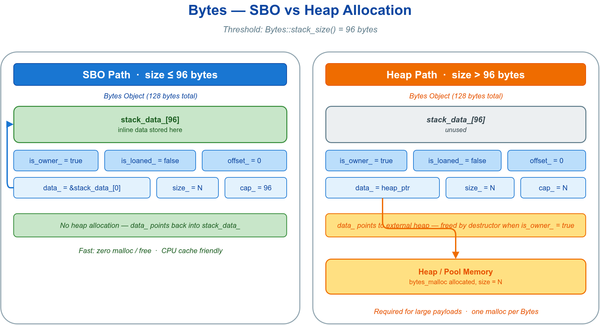

# 📦 bytes_basic —— `vlink::Bytes` 字节载体的创建、读写与容量管理

`Bytes` 是 vlink 通信热路径上的统一字节载体：Publisher/Subscriber 回调、Bag 记录、proxy 监控、安全模块密文都以它为单位。小载荷自动栈上存放、零分配，超出后自动转堆，API 一致。本示例演示最常用的创建、读写、迭代与容量调整。



## 🧩 核心 API

| API | 用途 |
|-----|------|
| `Bytes::create(size, offset=0)` | 申请一段拥有式缓冲（内容未初始化）|
| `Bytes::from_string(str)` | 从字符串深拷贝构造 |
| `Bytes(vec)` / `Bytes{a,b,c}` | 从 `vector<uint8_t>` / 初始化列表深拷贝构造 |
| `data()` / `size()` | 载荷指针与逻辑长度 |
| `operator[]` / `begin()`/`end()` | 按下标访问 / range-for 迭代 |
| `resize(n)` | 改变逻辑长度（必要时自动扩容）|
| `reserve(n)` / `shrink_to(n)` | 预留容量 / 仅缩减逻辑长度 |
| `clear()` / `empty()` | 释放置空 / 空判断 |
| `to_string()` | 拷贝为 `std::string` |
| `operator==` | 按内容比较 |

## 🚀 最小可运行示例

```cpp
#include <vlink/base/bytes.h>

// 申请缓冲并按下标写入
auto buf = vlink::Bytes::create(64);
for (size_t i = 0; i < buf.size(); ++i) {
  buf[i] = static_cast<uint8_t>(i);
}

// 从字符串构造，再读回
auto hello = vlink::Bytes::from_string("Hello, VLink Bytes!");
std::string s = hello.to_string();

// 容量调整（仅对拥有式缓冲有效）
buf.reserve(200);     // 预留容量，size 不变
buf.resize(150);      // 改变逻辑长度
buf.shrink_to(50);    // 缩减逻辑长度

// 内容比较
auto a = vlink::Bytes::from_string("test");
auto b = vlink::Bytes::from_string("test");
bool same = (a == b);   // true
```

`create(size, offset)` 的 `offset` 用于在载荷前预留一段前缀，方便传输层原地拼写协议头；普通业务读写 `data()` 即可。

## 🎯 何时用

- 需要把任意二进制载荷塞进消息：Publisher/Client/Setter 的泛型参数用 `Bytes`，框架按类型自动选择编解码。
- 需要压缩、Base64、CRC、十六进制等工具：见 `doc/08-base-library.md`。
- 需要在零拷贝传输中借出/归还外部内存：见 `doc/06-zerocopy.md`。

## 🔗 参考

- `include/vlink/base/bytes.h` —— `Bytes` 公共头
- `doc/06-zerocopy.md` —— 零拷贝与所有权设计说明
- `../../README.md` —— 示例总览与阅读顺序
