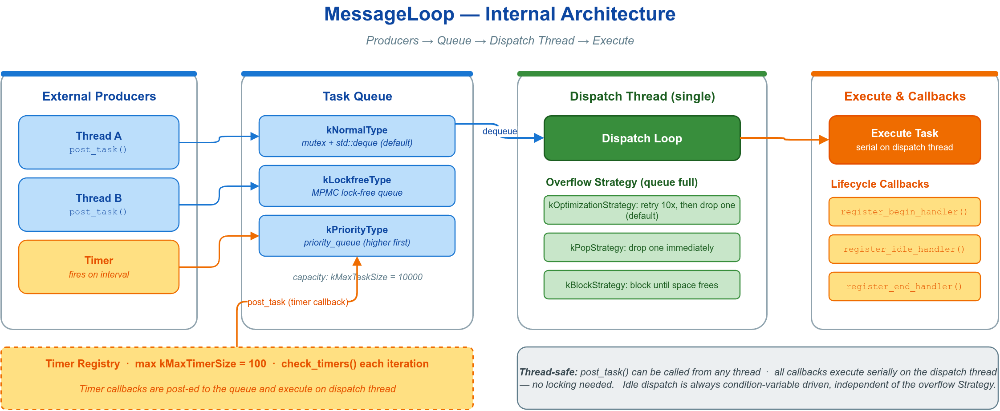

# 🔄 message_loop_basic — `MessageLoop` 入门

`vlink::MessageLoop` 是 vlink 应用层的中央事件循环：**Publisher / Subscriber / Client / Server / Setter / Getter / Timer 的所有回调都跑在某个 MessageLoop 上**。把多个原语 `attach` 到同一个 loop，它们的回调天然串行执行，业务无需自己加锁。



## 🧩 核心 API

| 方法 | 用途 |
|------|------|
| `async_run()` | 在后台线程启动 loop，立即返回（最常用） |
| `run()` | 当前线程驱动 loop，阻塞到 quit |
| `post_task(cb)` | 把任务投递到 loop 线程执行（任意线程可调，串行 FIFO） |
| `wait_for_idle()` | 阻塞等队列清空 |
| `spin_once(block)` | 手动处理一批任务，用于嵌入外部事件循环 |
| `quit()` / `wait_for_quit()` | 请求退出 / 等 loop 真正退出 |
| `register_begin_handler` / `register_end_handler` / `register_idle_handler` | loop 线程启动 / 退出前 / 每次空闲时各调一次 |
| `is_running()` | 当前是否在运行 |

## 🚀 最小示例

```cpp
vlink::MessageLoop loop;
loop.set_name("basic_loop");
loop.async_run();                                  // 后台线程驱动，立即返回

for (int i = 0; i < 5; ++i) {
  loop.post_task([i]() { MLOG_I("task {}", i); });  // 任意线程投递，loop 线程串行执行
}

loop.wait_for_idle();                              // 等 5 个任务全部跑完
loop.quit();
loop.wait_for_quit();                              // 干净退出
```

`async_run()` 在后台线程跑、`run()` 让当前线程变成 loop 线程（此时 `quit()` 必须从别的线程调）。生命周期 hook 用来做线程初始化（设 CPU 亲和性、注册信号、绑定 logger context），`register_idle_handler` 每次队列清空都触发，回调务必短小。

```cpp
loop.register_begin_handler([]() { VLOG_I("thread started"); });

while (running) {       // 嵌入 Qt / ROS / 游戏引擎主循环时
  loop.spin_once(false);  // false=非阻塞，处理已入队任务后立即返回
}
```

## 🎯 何时用 / 换哪个

- **应用层事件分发主循环**、把传输回调搬到固定业务线程避免数据竞争：用 MessageLoop（首选）。
- **CPU 密集型并行计算**：用 `ThreadPool`，见 `doc/08-base-library.md`。
- **定时任务**：Timer 必须挂在 MessageLoop 上，见 `../timer/`。

## 🔗 参考

- `../timer/` — Timer 必须挂在 MessageLoop 上
- `doc/08-base-library.md` — base 基础库总览与并发模型（含 ThreadPool 的取舍）
- `include/vlink/base/message_loop.h` — 完整接口
