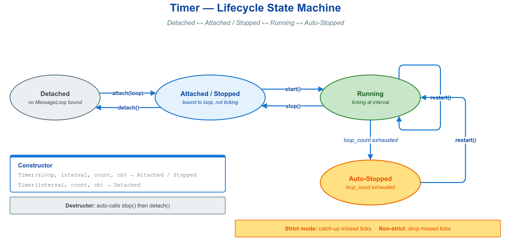

# ⏱️ timer —— `vlink::Timer` 事件驱动定时器：周期 / 单次 / 动态调整

`vlink::Timer` 把周期或单次回调挂到一个 `MessageLoop` 上，回调跑在 loop 线程、与其它 loop 任务串行。用于心跳、轮询、采样 tick、N 秒后延迟执行等。



## 🧩 核心 API

| API | 用途 |
|-----|------|
| `Timer(loop, interval_ms, loop_count, cb)` | 构造并绑定到 loop |
| `Timer(interval_ms, loop_count)` | 构造但不绑定，稍后 `attach` |
| `start()` / `stop()` / `restart()` | 启动 / 停止 / 重新启动 |
| `attach(loop)` / `detach()` | 绑定 / 解绑 loop（`detach` 前需先 `stop`） |
| `set_interval(ms)` | 改周期；运行中会立即重算调度并唤醒 loop |
| `set_loop_count(n)` | 改触发次数；运行中会立即更新剩余次数并唤醒 loop |
| `set_callback(cb)` | 改回调 |
| `is_active()` / `get_interval()` | 是否在跑 / 当前周期 |
| `Timer::call_once(loop, delay_ms, cb)` | 单次延迟触发，无需持有对象（静态） |
| `Timer::kInfinite` | `loop_count` 取 -1 表示无限循环 |

## 🚀 最小示例

```cpp
vlink::MessageLoop loop;
loop.async_run();

// 周期触发：100ms 一次，无限循环
vlink::Timer timer(&loop, 100, vlink::Timer::kInfinite, [] { MLOG_I("tick"); });
timer.start();
std::this_thread::sleep_for(550ms);
timer.stop();

// 单次触发：100ms 后执行一次，不需持有 Timer
vlink::Timer::call_once(&loop, 100, [] { VLOG_I("call_once fired"); });

// 动态调速：先慢后快
timer.set_interval(50);
timer.set_loop_count(6);
timer.restart();  // 等价 stop + start，沿用最新配置
```

跨 loop 迁移：用 `Timer(interval, loop_count)` 构造，再 `attach(&loop_a)` → `stop()` → `detach()` → `attach(&loop_b)`，回调随之跑到新 loop 线程。

## 🎯 何时用 / 换哪个

- 周期 / 延迟 / 有限次回调，且回调需跑在某个 loop 上 → `Timer`。
- 只测一段代码耗时 → `ElapsedTimer`；只判断是否到绝对截止 → `DeadlineTimer`（见 `doc/08-base-library.md`）。
- 回调里别做阻塞操作，否则会推迟同一 loop 上后续的 Timer 与 Subscriber 回调。

## 🔗 参考

- `../message_loop_basic/` — 驱动 Timer 的 MessageLoop
- `../README.md` — base 示例总览与阅读顺序
- `doc/08-base-library.md` — base 库（含 ElapsedTimer / DeadlineTimer 等定时器组件）
- `include/vlink/base/timer.h` — Timer 完整接口
