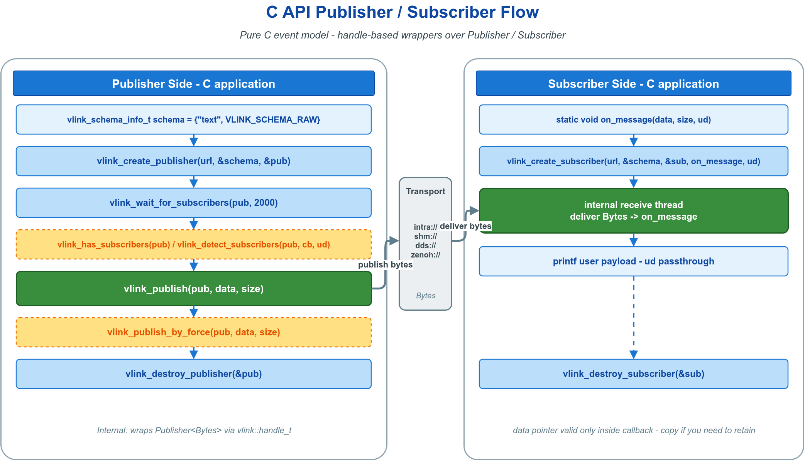

# 📡 c_pubsub — 纯 C 实现的事件发布/订阅

用纯 C 完成一对 `Publisher` / `Subscriber` 的创建、匹配、发布与销毁，是 `vlink/external/c_api.h` 最简单的入口。无需 C++ 编译器即可接入 VLink，适用于嵌入式 C 工程与 Rust/Go/Zig FFI。URL 使用 `intra://` 进程内传输免守护进程；切换 `dds://` / `shm://` / `someip://` 只改前缀，代码不变。



## 🔑 核心 API

| API | 用途 |
|-----|------|
| `vlink_create_subscriber(url, schema, &h, cb, user)` | 创建订阅端并注册回调 |
| `vlink_create_publisher(url, schema, &h)` | 创建发布端 |
| `vlink_publish(h, data, size)` | 异步广播；无订阅者时返回错误码 |
| `vlink_wait_for_subscribers(h, ms)` | 阻塞等待首个订阅者匹配 |
| `vlink_destroy_publisher` / `vlink_destroy_subscriber(&h)` | 释放句柄 |

低频接口：`vlink_publish_by_force`（无订阅者也发）、`vlink_has_subscribers`、`vlink_detect_subscribers`（上下线事件）。

回调入参 `data/size` 仅在回调内有效，异步处理需 `memcpy` 复制。

## 🧩 最小示例

```c
static void on_message(const uint8_t* data, size_t size, void* user) {
  printf("recv %zu bytes: %.*s\n", size, (int)size, (const char*)data);
}

const vlink_schema_info_t schema = {"text", VLINK_SCHEMA_RAW};  /* 原始字节流 */

vlink_subscriber_handle_t sub;
vlink_create_subscriber("intra://c_api/pubsub", &schema, &sub, on_message, NULL);

vlink_publisher_handle_t pub;
vlink_create_publisher("intra://c_api/pubsub", &schema, &pub);
vlink_wait_for_subscribers(pub, 2000);

vlink_publish(pub, (const uint8_t*)"hello", 5);

vlink_destroy_publisher(&pub);
vlink_destroy_subscriber(&sub);
```

先建 Subscriber 再建 Publisher，可避免丢失最初几条消息。链接时 `target_link_libraries(... vlink::c_api)`。

## 🧭 模型选择

1-to-N 单向广播、无需应答时使用本示例（Event）。需请求/应答（Method）、最新状态同步（Field）或加密传输的 C 接口，见 `doc/13-integration.md`（C API 参考手册）。

## 📚 参考

- `include/vlink/external/c_api.h` — 唯一头文件，签名与返回码均见此
- `doc/13-integration.md` — C API 参考手册
