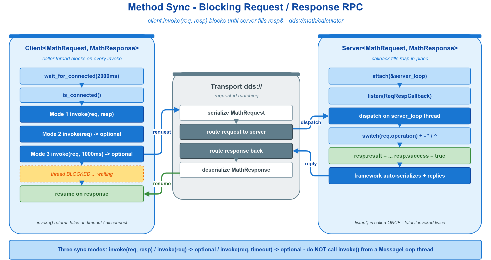

# 🔁 method_sync —— Method 模型同步调用

Method（请求 / 响应）模型最常用的形态：客户端 `Client::invoke()` 发出请求并阻塞等待响应，服务端 `Server::listen()` 注册回调原地填充响应。适用于需要拿到回执才能继续的远程计算、查询、命令下发。



## 🧩 核心 API

| API | 语义 |
|-----|------|
| `vlink::Server<Req, Resp>(url)` | 创建服务端 |
| `Server::listen(cb)` | 注册回调 `cb(const Req&, Resp&)`，原地填充 `resp`，返回即响应 |
| `vlink::Client<Req, Resp>(url)` | 创建客户端 |
| `Client::wait_for_connected(timeout)` | 阻塞等待服务端就绪 |
| `Client::is_connected()` | 非阻塞查询连接状态 |
| `Client::invoke(req, resp&, timeout=)` | 同步调用，返回 `bool`（`false` = 超时 / 失败） |
| `Client::invoke(req, timeout=)` | 同步调用，返回 `std::optional<Resp>`（`nullopt` = 超时 / 失败） |

## 🚀 最小示例

```cpp
vlink::MessageLoop loop;
loop.async_run();

vlink::Server<MathRequest, MathResponse> server("dds://math/calculator");
server.attach(&loop);
server.listen([](const MathRequest& req, MathResponse& resp) {
  resp.result = req.x + req.y;
  resp.success = true;
});

vlink::Client<MathRequest, MathResponse> client("dds://math/calculator");
client.wait_for_connected(2000ms);

MathRequest req{10.0, 3.0, 0};
if (auto resp = client.invoke(req); resp.has_value()) {
  VLOG_I("10 + 3 = ", resp->result);
}
```

`invoke()` 另有输出引用重载 `invoke(req, resp&)`（返回 `bool`）与自定义超时形态 `invoke(req, 1000ms)`，本质是同一 API 的重载。须区分两类失败：业务结果失败（如除零）在 `resp.success` 字段中表达，此时 `invoke()` 仍返回有值；仅超时 / 断连这类 RPC 失败返回 `nullopt`。

## 🔀 模型选择

| 需求 | 选用 |
|------|------|
| 客户端需要回执、可阻塞等待 | 本示例（同步 `invoke`） |
| 不需要回执的单向通知 | `Server<Req>` + `Client::send()`，见 `doc/02-communication.md` |
| 1 对多发布 / 订阅 | `../../quickstart/hello_pubsub/` |
| 同步最新状态而非一次性应答 | `../../quickstart/hello_field/` |

换后端仅替换 URL 前缀：`dds://` → `shm://` / `intra://` / `zenoh://` 等。

## 🔗 参考

- `../../quickstart/hello_rpc/` —— 最短的 RPC 示例。
- `include/vlink/client.h`、`server.h` —— Client / Server 完整接口。
- 顶层 `doc/02-communication.md` —— Method 模型规范（含异步调用与延迟应答）。
- 顶层 `examples/README.md` —— 全部示例索引。
