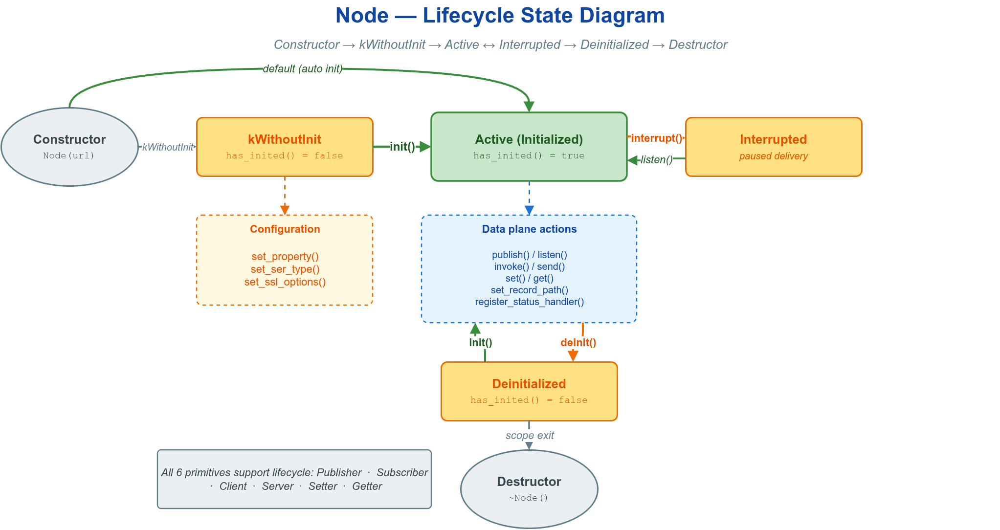

# ♻️ lifecycle — 节点生命周期：延迟初始化、init/deinit、interrupt

vlink 六种原语（Publisher / Subscriber / Server / Client / Setter / Getter）默认在构造时即创建底层 transport。当需要在创建 transport 前配置 QoS / property 时，使用 `kWithoutInit` 延迟初始化，配置完成后再调用 `init()`。



## 🎯 适用场景

- 在创建 transport 前调用 `set_property` 配置 QoS / SchemaType。
- 先将节点交由某模块持有，稍后再启动；或在测试 / 仿真中动态启停节点。
- 简单场景使用默认构造即可，无需关注延迟初始化。

## ⚙️ 初始化模式

| 模式 | 构造 | 行为 |
|------|------|------|
| 立即（默认） | `Publisher<T>("url")` | 构造时即创建 transport，`has_inited() == true` |
| 延迟 | `Publisher<T>("url", InitType::kWithoutInit)` | 暂不创建，等待 `init()` |

## 🔑 核心 API

| API | 用途 |
|-----|------|
| `InitType::kWithInit / kWithoutInit` | 构造时是否自动 init |
| `init()` | 创建底层 transport，返回是否成功；幂等 |
| `deinit()` | 释放 transport，此后 publish/listen 返回 false；可再次 init |
| `interrupt()` | 立即唤醒所有 `wait_for_*` 阻塞，不停止回调、不释放 transport |
| `has_inited()` | 查询是否已 init |

## 🚀 最小示例

```cpp
// 延迟初始化：先配置 QoS，再 init
vlink::Publisher<std::string> pub("dds://topic", vlink::InitType::kWithoutInit);
pub.set_property("qos.reliability.kind", "1");
pub.set_property("qos.history.depth", "10");
pub.init();                              // 按上述配置创建 transport
pub.publish("hello");

pub.deinit();                            // has_inited() -> false，publish 返回 false
pub.init();                              // 可重新启用

// interrupt：在另一线程唤醒阻塞中的 wait_for_*
std::thread waker([&pub] { std::this_thread::sleep_for(50ms); pub.interrupt(); });
pub.wait_for_subscribers(1000ms);        // 因 interrupt 提前返回 false
waker.join();
```

推荐流程（六种原语通用）：`construct(kWithoutInit) -> set_property -> init -> 使用 -> deinit`。

## ⚠️ 注意事项

- `init` 之后修改 property 多数不生效：大部分 property 在 init 期被 transport 读取。
- `interrupt` 仅唤醒等待，要真正停用须 `deinit`。

## 🔗 相关文档

| 主题 | 位置 |
|------|------|
| 节点生命周期完整章节 | 顶层 `doc/02-communication.md` |
| MessageLoop | [`../../base/message_loop_basic/`](../../base/message_loop_basic/) |
| QoS 字段对照 | [`../../qos/qos_basics/`](../../qos/qos_basics/) |
| Node 基类接口 | `include/vlink/node.h` |
