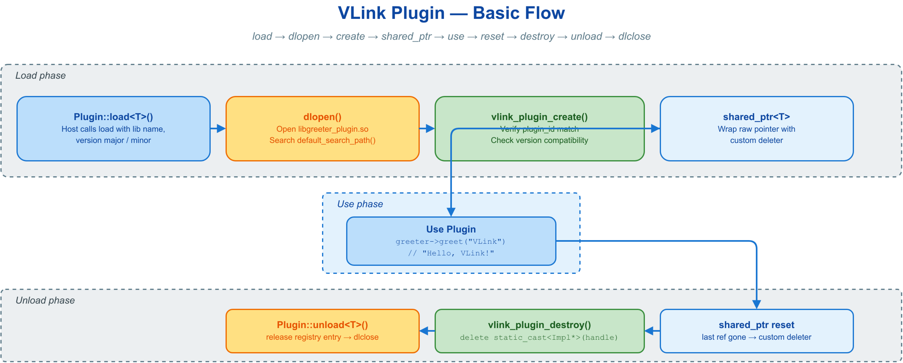

# 🧩 plugin_basic — vlink 插件系统：定义接口、编译为 .so、运行时加载调用

用 `vlink::Plugin` 把抽象接口的实现编译成共享库（`.so`/`.dll`），在主程序按名字 + 版本动态加载并通过基类指针调用。适用于"核心 + 多个独立 `.so` 插件分团队维护、运行时按需加载、第三方扩展"等场景；若静态编进同一可执行文件，直接 link 即可，无需插件。



三方文件：`greeter_interface.h`（host 与 plugin 共享的接口）、`greeter_plugin.cc`（实现，编为 `libgreeter_plugin.so`）、`plugin_basic.cc`（host：加载并调用）。

## 🔧 核心 API

| API | 用途 |
|-----|------|
| `VLINK_PLUGIN_REGISTER(Interface)` | 接口类与实现类都要写，参数都是**接口名**；为接口生成稳定 plugin id |
| `VLINK_PLUGIN_REGISTER_BY_ID(Interface, "id")` | 同上，但用固定字符串当 id（接口名变更也不影响兼容） |
| `VLINK_PLUGIN_DECLARE(Impl, major, minor)` | 实现 .cc 里写一次，导出工厂符号 + 版本号 |
| `Plugin::load<T>(name, major, minor)` | 加载 `lib<name>.so` 并返回 `shared_ptr<T>`；不匹配返回 `nullptr` |
| `Plugin::default_search_path()` | 返回加载器的默认搜索目录列表 |

## 🚀 最小可运行示例

接口（共享头）——至少一个纯虚函数 + 虚析构 + `VLINK_PLUGIN_REGISTER`；实现里 `VLINK_PLUGIN_REGISTER` 仍传**接口名**，并 `VLINK_PLUGIN_DECLARE` 一次：

```cpp
// greeter_interface.h（host 与 plugin 共享）
class GreeterInterface {
  VLINK_PLUGIN_REGISTER(GreeterInterface)
 public:
  virtual ~GreeterInterface() = default;
  virtual std::string greet(const std::string& name) = 0;
};

// greeter_plugin.cc（编为 libgreeter_plugin.so）
class GreeterImpl : public GreeterInterface {
  VLINK_PLUGIN_REGISTER(GreeterInterface)
 public:
  std::string greet(const std::string& name) override { return "Hello, " + name + "!"; }
};

VLINK_PLUGIN_DECLARE(GreeterImpl, 1, 0)   // 1, 0 = major, minor
```

Host——加载后**务必判空**，再通过基类指针调用。`shared_ptr` 析构时销毁插件实例；共享库仍由 `Plugin` 注册表跟踪，需要显式 `unload()`：

```cpp
// plugin_basic.cc
vlink::Plugin plugin;
auto greeter = plugin.load<GreeterInterface>("greeter_plugin", 1, 0);

if (!greeter) {
  VLOG_E("failed to load greeter_plugin");
  return 1;
}

VLOG_I(greeter->greet("VLink"));   // 输出: Hello, VLink!
greeter.reset();
plugin.unload<GreeterInterface>("greeter_plugin");
```

## 📂 搜索路径

`load` 的签名为 `load<T>(name, major, minor, dir_name = "", search_paths = default_search_path())`。第 4 参 `dir_name` 是追加在每个 search path 下的**相对子目录**，第 5 参 `search_paths` 是有序根目录列表：

```cpp
plugin.load<T>("name", 1, 0);                            // 默认搜索路径
plugin.load<T>("name", 1, 0, "plugins");                 // 依次查 <默认路径>/plugins/
plugin.load<T>("name", 1, 0, "", {"/dir1", "/dir2"});    // 用自定义目录列表替换默认搜索路径
```

默认路径含当前目录、可执行文件所在目录及相邻 lib 目录、系统库目录；环境变量 `VLINK_PLUGIN_DIR`（逗号或空格分隔）可把目录插到队首。

## 🔀 何时换用其它插件类型

- 插件本身需要自带后台线程 / 生命周期回调 → 使用 `RunablePluginInterface`（`on_init` / `on_deinit`），见 `doc/13-integration.md`。
- 为录制系统提供 schema 反射扩展 → 使用 schema 插件，见 `doc/13-integration.md`。

## 📚 参考

- `doc/13-integration.md` — 插件系统完整章节（含 RunablePlugin 与 schema 插件）
- `../README.md` — plugin 类目索引
- `examples/README.md` — 全部示例索引
- `include/vlink/base/plugin.h` — `Plugin` 接口定义
