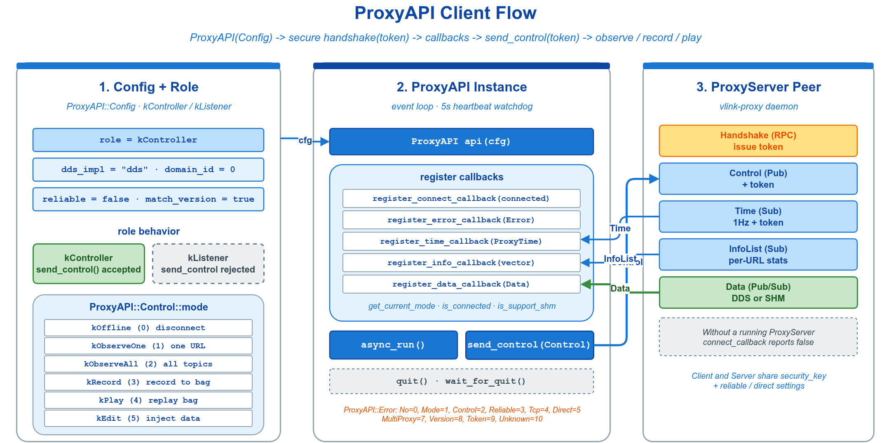

# 🛰️ proxy_api_basic — ProxyAPI 客户端：观察 / 录制 / 注入

`vlink::ProxyAPI` 是 Proxy 监控子系统的**客户端**：连接另一进程的 `ProxyServer`，远程列出网络上的 topic、订阅数据、录制或注入消息。属进阶能力——同进程内查看消息直接订阅即可，仅在需要跨进程 / 跨机器观察时使用。



## 🧩 核心 API

| API | 用途 |
|-----|------|
| `ProxyAPI(const Config&)` | 构造客户端并启动握手 |
| `async_run()` | 启动内部事件线程，回调开始触发 |
| `register_connect_callback(cb)` | 连接态变化 `void(bool)` |
| `register_info_callback(cb)` | 每秒一次的 topic 列表 `void(const std::vector<Info>&)` |
| `register_data_callback(cb)` | 转发的原始数据 `void(const Data&)` |
| `register_error_callback(cb)` | 错误码变化 `void(Error)` |
| `send_control(ctrl, async=true)` | Controller 专用，切换模式（如 `kObserveAll`） |
| `send_data(data)` | Controller 专用，注入数据 |
| `quit()` / `wait_for_quit()` | 停机 |

| 枚举 | 取值 | 语义 |
|------|------|------|
| `Role` | `kController` | 可发送 control / data |
| | `kListener` | 只读；发送直接返回 false |
| `Mode` | `kObserveAll` | 观察全部 topic |
| | `kRecord` | 录制 |
| | `kPlay` | 回放注入 |
| `Error` | `kTokenError` | 握手被拒（多见于 Server 未启动） |
| | `kVersionCompError` | 两端 VLink 版本不一致 |

## 🚀 最小可运行片段

```cpp
vlink::ProxyAPI::Config cfg;
cfg.role = vlink::ProxyAPI::kController;
cfg.dds_impl = "dds";   // dds / ddsc / ddsr ...
cfg.domain_id = 0;      // 须与 ProxyServer 一致

vlink::ProxyAPI api(cfg);
api.register_connect_callback([](bool up) { VLOG_I("connection: ", up ? "up" : "down"); });
api.register_info_callback([](const std::vector<vlink::ProxyAPI::Info>& list) { VLOG_I("topics=", list.size()); });
api.register_data_callback([](const vlink::ProxyAPI::Data& d) { VLOG_I("data: ", d.url, " size=", d.raw.size()); });
api.async_run();

vlink::ProxyAPI::Control ctrl;
ctrl.mode = vlink::ProxyAPI::kObserveAll;
api.send_control(ctrl);             // Controller 切到观察全部 topic

vlink::ProxyAPI::Data data;         // 注入一条消息（Play / Edit 模式）
data.url = "intra://debug/inject";
data.ser = "demo.Proto.Hello";
data.schema = vlink::SchemaType::kProtobuf;
data.raw = vlink::Bytes::from_string("hello");
api.send_data(data);

api.quit();
api.wait_for_quit();
```

回调均运行于 ProxyAPI 内部线程，**不要在回调中阻塞**；重活另起线程处理。运行前须在另一进程启动 `ProxyServer`，否则握手失败、`is_connected()` 持续返回 false 并触发 `kTokenError`。

## 🧭 角色选择

| 场景 | 角色 | 说明 |
|------|------|------|
| 远程调试 / 监控工具、录制回放控制 | `kController` | 可主动 `send_control` / `send_data` |
| 被动旁观数据 | `kListener` | 无需 token，开销更小 |
| 同进程内查看消息 | —— | 不用 Proxy，直接 `Subscriber<T>` 订阅 |

## 📚 参考

- `include/vlink/external/proxy_api.h` —— ProxyAPI 接口定义。
- `include/vlink/external/proxy_server.h` —— 配套的 ProxyServer 接口。
- 顶层 `doc/12-observability.md` —— Proxy 子系统专文（含 Server 端部署）。
