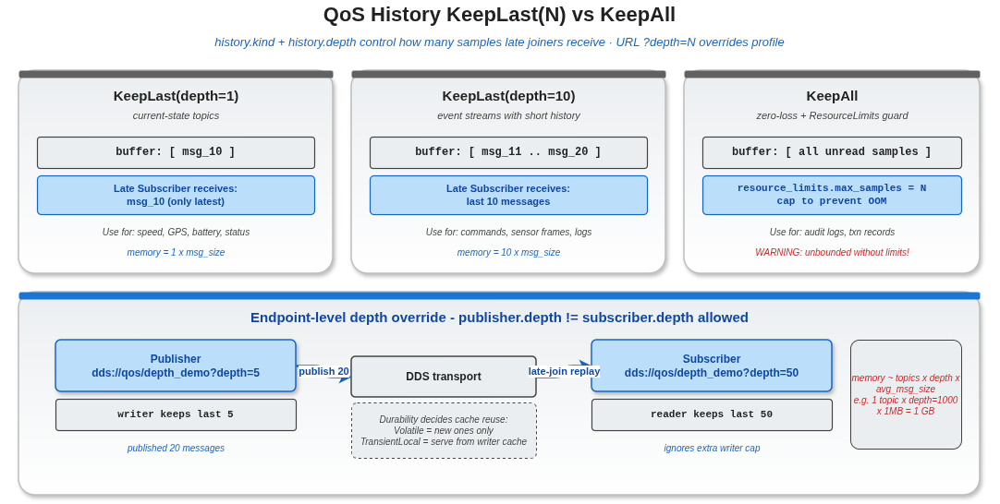

# qos — Quality of Service 配置教程

本目录覆盖 vlink QoS 系统的三个核心方面：自定义 Qos 结构、调节队列容量、使用内置预设。QoS 主要在 DDS 家族后端（FastDDS / CycloneDDS / RTI Connext / TravoDDS）与 Zenoh 上生效；`shm://`、`intra://`、`someip://`、`mqtt://`、`fdbus://`、`qnx://` 等后端忽略 vlink Qos（它们有各自的可靠性机制）。

## 子示例索引

| 示例 | 主题 | 关键 API |
|------|------|---------|
| `qos_basics/` | Qos 结构、`DdsConf::register_qos`、`?qos=name` 引用 | `vlink::Qos`、`DdsConf::register_qos` |
| `qos_history_depth/` | `History` 与 `depth` 对内存与晚加入语义的影响 | `Qos::history`、`Qos::resource_limits`、URL `?depth=` |
| `qos_profiles/` | 内置 `QosProfile::*` 预设 + JSON 扩展 | `QosProfile::kSensor` 等、`get_available_qos_map`、`VLINK_QOS_CONFIG` |

## 推荐阅读顺序

1. **`qos_basics/`** —— 必看。理解 Qos 结构的全部子策略（Reliability / History / Durability / PublishMode / Deadline / Lifespan / ResourceLimits），注册流程，URL 引用语法。
2. **`qos_history_depth/`** —— 深入 history & depth 这两个最常调的字段；学会按 topic 类别选 depth、用 ResourceLimits 防 OOM。
3. **`qos_profiles/`** —— 16 个内置预设的字段对照；"基线 + 微调"模式；JSON profile 注入。

## 共同前置知识

- `../url_guide/url_basics/` —— URL 结构，特别是 query 参数中 `?qos=...` / `?depth=...` 的语法。
- `../communication/` —— 三种通信模型的基本用法，QoS 是这些原语的可调参数。
- DDS 的可靠性 / 历史 / 持久化等概念（顶层 `doc/08-qos.md` 提供 vlink 与 DDS 的对应关系）。

## 几个常见组合

| 组合 | 用途 |
|------|------|
| `BestEffort + KeepLast(10) + Volatile + Async` | 传感器流（kSensor） |
| `Reliable + KeepLast(5) + Volatile + Sync` | 离散控制事件（kEvent） |
| `Reliable + KeepLast(1) + TransientLocal + Sync` | 字段同步（kField） |
| `Reliable + KeepAll + Volatile + Sync` | RPC 调用（kMethod） |
| `Reliable + KeepLast(200) + Volatile + Sync` | 高吞吐可靠（kBest） |
| `Reliable + KeepAll + TransientLocal + Sync` | 安全报警（kAlarm） |
| `Reliable + KeepLast(500) + Volatile + Sync` + heartbeat 500ms | 大消息（kLarge） |

## 配图

三张图分别来自 `qos_basics`、`qos_history_depth`、`qos_profiles` 子目录，对应各示例的核心机制示意。

## 参考

- 顶层 `doc/08-qos.md` —— QoS 完整规范，含 vlink Qos 字段与 DDS QoS 的对应关系
- 顶层 `doc/21-environment-vars.md` —— `VLINK_QOS_CONFIG` 等环境变量
- `vlink/include/vlink/extension/qos.h` —— Qos 结构定义
- `vlink/include/vlink/extension/qos_profile.h` —— 内置预设
- `vlink/include/vlink/modules/dds_conf.h` / `ddsc_conf.h` / `zenoh_conf.h` —— 各后端注册接口
