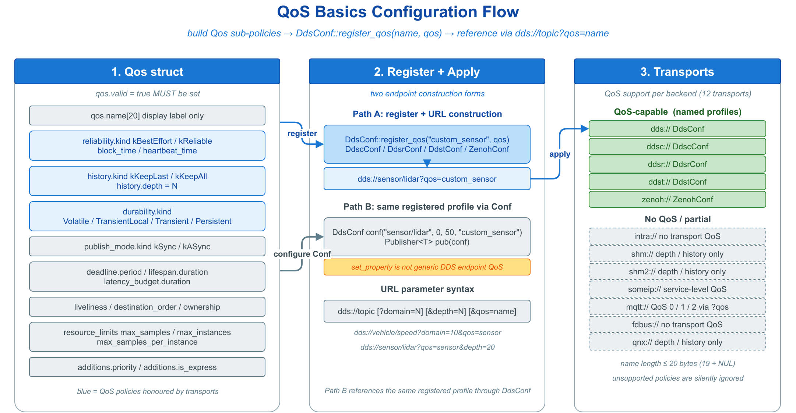

# 🔒 QoS 配置教程

本目录讲解 vlink QoS（Quality of Service）系统：自定义 `vlink::Qos` 策略、注册命名 profile、在 URL 中按名引用。QoS 主要在 DDS 家族后端（`dds://` / `ddsc://` / `ddsr://` / `ddst://`）与 `zenoh://` 上生效；`intra://`、`shm://`、`someip://`、`mqtt://`、`fdbus://`、`qnx://` 等后端忽略 vlink Qos，它们各自具备独立的可靠性机制。

## 📂 子示例索引

| 示例 | 主题 | 关键 API |
|------|------|---------|
| `qos_basics/` | Qos 结构、`DdsConf::register_qos`、URL `?qos=name` 引用 | `vlink::Qos`、`DdsConf::register_qos` |

> `History` / `depth` 对内存占用与晚加入语义的影响（含 `Qos::resource_limits`、URL `?depth=`），以及内置 `QosProfile::*` 预设，均整合进顶层 `doc/05-qos.md`，本目录不再单列子示例。

## 🧩 概念模型

`vlink::Qos` 聚合若干正交子策略，按机制划分如下：

| 子策略 | 取值 | 语义 |
|--------|------|------|
| `reliability` | `kBestEffort` / `kReliable` | 是否对丢失样本重传 |
| `history` | `kKeepLast(depth)` / `kKeepAll` | 缓存最近 depth 条或全部 |
| `durability` | `kVolatile` / `kTransientLocal` | 是否向晚加入订阅者补送历史样本 |
| `publish_mode` | `kSync` / `kASync` | 发布是否阻塞至样本下发 |
| `deadline` / `lifespan` / `resource_limits` | 时长 / 容量上限 | 时序约束与内存上限 |

默认构造的 `Qos` 为 `valid=false`，注册时被忽略；须先置 `valid=true` 方才生效。

## 🧭 常见组合

| 组合 | 用途 |
|------|------|
| `BestEffort + KeepLast(浅) + Volatile + ASync` | 传感器高频流（吞吐优先，可丢帧） |
| `Reliable + KeepLast(5) + Volatile + Sync` | 离散控制事件 |
| `Reliable + KeepLast(1) + TransientLocal + Sync` | 字段状态同步 |
| `Reliable + KeepAll + Volatile + Sync` | RPC 调用 |
| `Reliable + KeepAll + TransientLocal + Sync` | 启用重传的报警，并补送晚加入者 |

## 🖼️ 配图

## 🔗 共同前置

- `../url_guide/url_basics/` —— URL 结构，特别是 query 参数中 `?qos=...` / `?depth=...` 的语法。
- `../communication/` —— 三种通信模型的基本用法，QoS 是这些原语的可调参数。

## 📚 参考

- 顶层 `doc/05-qos.md` —— QoS 完整规范，含 vlink Qos 字段与 DDS QoS 的对应关系，及内置 `QosProfile::*` 预设
- 顶层 `doc/13-integration.md` —— `VLINK_QOS_CONFIG` 等环境变量
- `include/vlink/extension/qos.h` —— `Qos` 结构定义
- `include/vlink/extension/qos_profile.h` —— 内置预设
- `include/vlink/modules/dds_conf.h` / `ddsc_conf.h` / `zenoh_conf.h` —— 各后端注册接口
