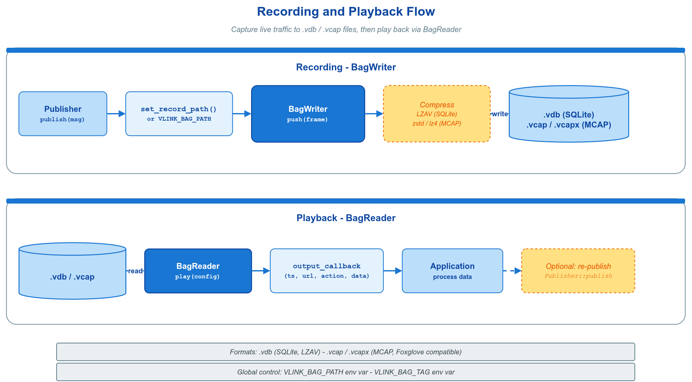

# 📼 record_basic — `set_record_path()` 与 `VLINK_BAG_PATH`

在任意通信原语上调用 `set_record_path("/tmp/x.vdb")`，流经该节点的所有消息将自动写入 bag 文件；或设置环境变量 `VLINK_BAG_PATH`，在不改动业务逻辑的前提下录制全进程流量。



## 🧩 核心 API

| API | 签名 | 用途 |
|-----|------|------|
| `set_record_path` | `void set_record_path(const std::string& path)` | 节点级录制；空串关闭。六个原语（Publisher / Subscriber / Server / Client / Setter / Getter）通用 |
| `BagWriter::global_get` | `static BagWriter* global_get()` | 取全局 writer（由 `VLINK_BAG_PATH` 创建），非空即表示全进程正在录制 |
| 环境变量 `VLINK_BAG_PATH` | path | 启动时自动建立全局 BagWriter |
| 环境变量 `VLINK_BAG_TAG` | string | 为 bag 写入 tag，便于事后过滤与关联实验编号 |

> 文件扩展名决定格式：`.vdb` 为 VLink 原生格式，`.vcap` 为 Foxglove 兼容 MCAP。

## 🚀 节点级录制

```cpp
vlink::Publisher<vlink::Bytes> pub("dds://record_basic/event");
pub.set_record_path("/tmp/record_basic_pub.vdb");

vlink::Subscriber<vlink::Bytes> sub("dds://record_basic/event");
sub.set_record_path("/tmp/record_basic_sub.vdb");  // 收发各录一份
sub.listen([](const vlink::Bytes& msg) { VLOG_I("recv: ", msg.size()); });

pub.wait_for_subscribers();
pub.publish(vlink::Bytes::from_string("hello"));
```

Server/Client、Setter/Getter 同理；多个节点指向同一 path 时汇入同一 bag，按 URL 区分。

## 🌐 全局录制

```bash
# 不改一行代码，录下整个进程的流量：
VLINK_BAG_PATH=/tmp/global.vdb VLINK_BAG_TAG=session_001 ./example_record_basic
```

```cpp
if (auto* writer = vlink::BagWriter::global_get(); writer != nullptr) {
  VLOG_I("global recording active");  // VLINK_BAG_PATH 已生效
}
```

## 🧭 何时用

| 需求 | 方案 |
|------|------|
| 录制业务输入输出，用于回归测试与问题复现 | 本示例的 `set_record_path()` / `VLINK_BAG_PATH` |
| 主动 push 自定义 Frame、读取过滤或多 bag 合并 | `BagWriter` / `BagReader` / `BagProcessor`，见 `doc/09-recording.md` |
| 实时监控而非落盘 | ProxyAPI，见 `../../proxy/` |

## 📚 参考

- 顶层 `doc/09-recording.md` — 录制系统完整章节，含 `BagWriter` / `BagReader` 直接读写与回放过滤 API
- 顶层 `doc/13-integration.md` — `VLINK_BAG_PATH` / `VLINK_BAG_TAG` 环境变量
- `../../proxy/proxy_api_basic/` — 实时监控通信流量
