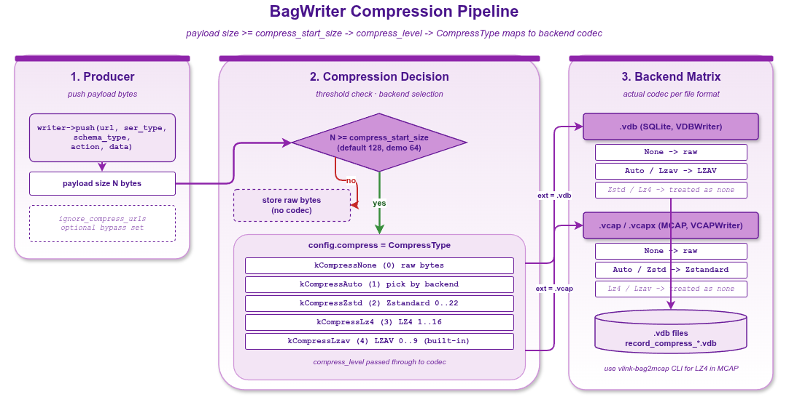

# record_compression — Bag 压缩算法对比：None / Zstd / LZ4 / LZAV

本示例在 `.vdb`（SQLite）后端下对比四种压缩模式的吞吐与压缩率。重点：SQLite 后端**内部**只支持 LZAV；`kCompressZstd` / `kCompressLz4` 在 vdb 上被忽略（视为不压缩）。真正的 Zstd / LZ4 需要走 MCAP（`.vcap` / `.vcapx`）后端。

读完本示例你能掌握：

- 四种 CompressType 在 vdb / vcap 后端上的实际行为。
- 怎么按业务负载选压缩算法。
- `compress_level` / `compress_start_size` 调优。
- 压缩对吞吐和文件大小的影响数量级。

## 背景与适用场景

录制系统的压缩取舍：

- **不压缩**：写入最快、文件最大、回放最快。
- **LZAV**：压缩率中等、CPU 开销极低、vlink 自带（无外部依赖）。
- **LZ4**：压缩率中等、CPU 开销低、行业标准（需 vlink 启用 LZ4）。
- **Zstd**：压缩率最高、CPU 开销可调（level 1-22）、MCAP 标准。

vlink 在 vdb 后端选择把 Zstd/LZ4 静默退化为"不压缩"是为了避免运行时报错；要真正用这些算法请选 `.vcap` / `.vcapx`。

## 核心 API

| API | 签名/字段 | 说明 |
|-----|---------|------|
| `BagWriter::Config::compress` | `CompressType` | 压缩算法 |
| `BagWriter::Config::compress_level` | `int` | 算法特定（Zstd 1-22、LZ4 1-12 等） |
| `BagWriter::Config::compress_start_size` | `size_t` | 小于此 size 的 chunk 不压缩 |
| `CompressType` | enum | `kCompressNone` / `kCompressAuto` / `kCompressZstd` / `kCompressLz4` / `kCompressLzav` |

## CompressType 行为对照表

| 枚举 | 值 | `.vdb` 实际行为 | `.vcap` 实际行为 |
|------|-----|----------------|----------------|
| `kCompressNone` | 0 | 不压缩 | 不压缩 |
| `kCompressAuto` | 1 | LZAV | Zstd（取决于实现） |
| `kCompressZstd` | 2 | 忽略（按不压缩处理） | Zstd |
| `kCompressLz4`  | 3 | 忽略 | LZ4 |
| `kCompressLzav` | 4 | LZAV | LZAV |

## 代码导读

### 1. 准备测试数据

```cpp
constexpr int kCount = 500;
constexpr size_t kSize = 4096;
std::vector<vlink::Bytes> payloads;
payloads.reserve(kCount);
for (int i = 0; i < kCount; ++i) {
  // 高度可压缩的图案
  std::string text(kSize, static_cast<char>('A' + (i % 26)));
  payloads.push_back(vlink::Bytes::from_string(text));
}
```

### 2. 跑四种压缩

```cpp
auto benchmark = [&](const char* name, vlink::CompressType type, const std::string& path) {
  vlink::BagWriter::Config cfg;
  cfg.compress = type;
  cfg.compress_start_size = 64;       // 64 字节以下不压缩

  auto writer = vlink::BagWriter::create(path, cfg);
  vlink::ElapsedTimer timer;
  timer.start();
  for (int i = 0; i < kCount; ++i) {
    vlink::Frame frame;
    frame.timestamp = -1;
    frame.url = "intra://compress/test";
    frame.ser_type = vlink::Serializer::kStringType;
    frame.schema_type = vlink::SchemaType::kRaw;
    frame.action_type = vlink::ActionType::kPublish;
    frame.data = payloads[i];
    writer->push(frame);
  }
  writer.reset();   // flush
  int64_t elapsed = timer.get();

  size_t file_size = std::filesystem::file_size(path);
  MLOG_I("{}: {}ms file_size={} bytes", name, elapsed, file_size);
};

benchmark("None", vlink::CompressType::kCompressNone, "/tmp/comp_none.vdb");
benchmark("Zstd", vlink::CompressType::kCompressZstd, "/tmp/comp_zstd.vdb");
benchmark("LZ4",  vlink::CompressType::kCompressLz4,  "/tmp/comp_lz4.vdb");
benchmark("LZAV", vlink::CompressType::kCompressLzav, "/tmp/comp_lzav.vdb");
```

### 3. 选型指引

代码末尾打印一段建议：

- 高频小消息（< 1KB）：`kCompressNone`，压缩反而拖慢。
- 大消息（> 64KB）+ 高度可压缩（文本、JSON、Proto）：`kCompressZstd`（MCAP 后端）。
- 嵌入式 / 极低 CPU 预算：`kCompressLzav`。
- 不确定：`kCompressAuto`，vlink 自选。

## 运行

```bash
./build/output/bin/example_record_compression
```

预期输出（节选）：

```
None: 12ms file_size=2148000 bytes
Zstd: 13ms file_size=2148000 bytes    (vdb 忽略，等同 None)
LZ4:  12ms file_size=2148000 bytes    (vdb 忽略)
LZAV: 25ms file_size=180000 bytes     (~12x 压缩率)
```

可压缩数据下 LZAV 通常 5-15x 压缩率，CPU 开销约 2x 不压缩。

## 常见陷阱

1. **以为 vdb 支持 Zstd**：不支持，被静默忽略。要 Zstd 走 `.vcap` 后端。
2. **压缩小消息**：小数据压缩开销 > 收益；设 `compress_start_size = 1024` 跳过小消息。
3. **compress_level 取值范围错**：Zstd 1-22、LZ4 1-12、LZAV 没 level；越界按算法默认。
4. **回放性能**：压缩文件回放时要解压，CPU 占用高；高 rate 回放可能成为瓶颈。
5. **跨版本兼容**：vlink 升级时压缩格式向后兼容；老文件能用新 vlink 读。

## 设计要点

- LZAV 是 vlink 自带轻量压缩；嵌入式友好。
- Zstd 在 MCAP 是标准；compress_level=3 是工业默认。
- 压缩在写入路径上做（写线程 + 后台 flush）；不阻塞业务线程。
- `compress_start_size` 让小 message 直通，避免压缩头开销。

## 配图



图中展示消息从 push → chunk 缓存 → 压缩 → 写入磁盘的完整管线。

## 参考

- `../record_bag/` — 通用读写 API
- `../record_mcap/` — MCAP / Zstd 实现
- `vlink/include/vlink/extension/bag_writer.h` — BagWriter::Config 完整字段
- 顶层 `doc/12-bag-recording.md` — 录制章节
