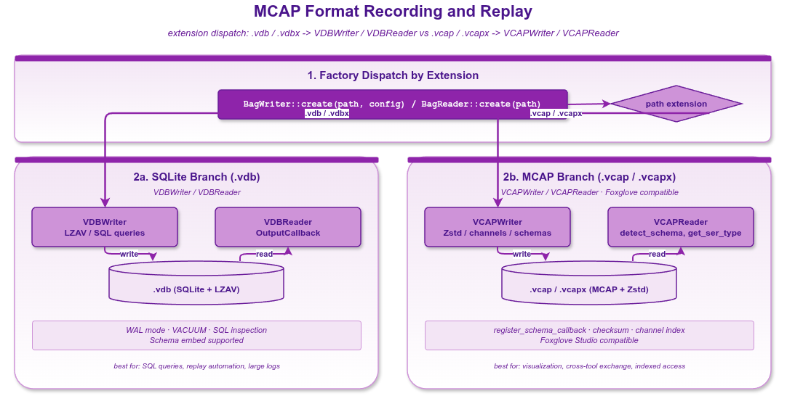

# record_mcap — MCAP 格式录制：`.vcap` / `.vcapx`

vlink 支持 MCAP（`.vcap` / `.vcapx`）作为 bag 文件格式，与 Foxglove Studio、ROS 2 MCAP 工具链完全兼容。MCAP 是一种自描述、可索引、模块化的二进制日志格式，适合做跨工具链分析、机器学习数据集、长期归档。

本示例演示：

- 通过 `BagWriter::create("xxx.vcap")` 工厂自动识别 MCAP 格式。
- 显式构造 `vlink::VCAPWriter` 配置 Zstd 压缩、tag。
- `.vcapx` 分片模式 + split 回调。
- `BagReader::create("xxx.vcap")` 与显式 `VCAPReader` 两种读取方式。
- `detect_schema()` 列出嵌入的 schema。

读完本示例你能掌握：

- 何时选 MCAP 而非 vdb。
- VCAPWriter / VCAPReader 与 BagWriter / BagReader 的关系。
- MCAP 分片（`.vcapx`）的工程意义。

## 背景与适用场景

何时选 MCAP：

- 数据要用 Foxglove Studio 可视化。
- 数据要与 ROS 2 工具链（rosbag2）互操作。
- 需要嵌入式 schema 自描述（Protobuf、FlatBuffers、ROS msg）。
- 长期归档、跨团队协作。

何时选 vdb（SQLite）：

- vlink 内部读写性能更高（SQLite 索引）。
- 需要复杂查询（按 URL、时间范围、tag 过滤）。
- 不需要与外部工具链互通。

MCAP 文件内部由 chunk + index + footer 组成；自带 schema 与 channel 元数据，可以独立解析。

## 核心 API

| API | 签名 | 说明 |
|-----|------|------|
| `BagWriter::create` | `static std::shared_ptr<BagWriter> create(const std::string& path, const Config& = {})` | 工厂；扩展名为 `.vcap` / `.vcapx` 时返回 VCAPWriter |
| `vlink::VCAPWriter` | `VCAPWriter(const std::string& path, const Config&)` | 显式构造 |
| `vlink::VCAPReader` | `VCAPReader(const std::string& path)` | 显式 reader |
| `VCAPReader::get_ser_type` | `std::string get_ser_type(const std::string& url) const` | 按 URL 查序列化类型 |
| `Config::compress` | enum | `kCompressNone` / `kCompressZstd` / `kCompressLz4` |
| `Config::split_by_size` / `split_name_by_time` | size_t / bool | `.vcapx` 分片模式 |
| `BagReader::detect_schema` | `std::vector<SchemaData> detect_schema() const` | 列出嵌入 schema |
| `BagWriter::register_split_callback` | `void` | 分片切换回调 |

## 代码导读

### 1. 自动识别 MCAP

```cpp
auto writer = vlink::BagWriter::create("/tmp/auto.vcap");
// 内部按扩展名识别为 VCAPWriter

vlink::Frame frame;
frame.timestamp   = -1;   // -1：由 writer 自动分配时间戳
frame.url         = "intra://topic";
frame.ser_type    = vlink::Serializer::kStringType;
frame.schema_type = vlink::SchemaType::kRaw;
frame.action_type = vlink::ActionType::kPublish;
frame.data        = vlink::Bytes::from_string("hello");
writer->push(frame);
```

### 2. 显式 VCAPWriter + Zstd

```cpp
vlink::BagWriter::Config cfg;
cfg.compress = vlink::CompressType::kCompressZstd;
cfg.tag_name = "experiment_2025";

auto writer = std::make_shared<vlink::VCAPWriter>("/tmp/mcap_explicit.vcap", cfg);
for (int i = 0; i < 100; ++i) {
  writer->push(/* ... */);
}
```

Zstd 在 MCAP 内是标准压缩；压缩率约 3-5x，CPU 开销小。

### 3. .vcapx 分片

```cpp
vlink::BagWriter::Config cfg;
cfg.split_by_size = 10 * 1024 * 1024;     // 每 10MB 切分
cfg.split_name_by_time = true;             // 文件名带时间戳
auto writer = std::make_shared<vlink::VCAPWriter>("/tmp/big_data.vcapx", cfg);

writer->register_split_callback([](const std::string& new_path, bool before_open) {
  if (before_open) {
    VLOG_I("about to open new file: ", new_path);
  } else {
    VLOG_I("opened: ", new_path);
  }
}, /*before_open=*/true);

// 写大量数据自动触发分片
```

`.vcapx` 扩展名是 vlink 的 MCAP 分片格式：底层多个 `.vcap` 文件 + manifest，整体当一个 bag 用。

### 4. 读 MCAP

```cpp
auto reader = vlink::BagReader::create("/tmp/auto.vcap");
auto info = reader->get_info();
MLOG_I("total messages: {}", info.total_messages);

reader->register_output_callback([](const vlink::Frame& frame) {
  VLOG_I("got msg url=", frame.url, " size=", frame.data.size());
});
reader->play({});
```

VCAPReader 派生自 BagReader；BagReader 的所有 API（`play` / `seek` / `Config`）都可用。

### 5. 显式 VCAPReader + 查 schema

```cpp
auto reader = std::make_shared<vlink::VCAPReader>("/tmp/mcap_explicit.vcap");
auto schemas = reader->detect_schema();
for (const auto& s : schemas) {
  VLOG_I("schema: ", s.type_name, " ser=", static_cast<int>(s.ser_type));
}

auto ser = reader->get_ser_type("intra://topic");
VLOG_I("topic ser type: ", static_cast<int>(ser));
```

## 运行

```bash
./build/output/bin/example_record_mcap
```

预期产物：

```
/tmp/auto.vcap
/tmp/mcap_explicit.vcap
/tmp/big_data.vcapx/        (目录)
  big_data.vcapx-00000.vcap
  big_data.vcapx-00001.vcap
  ...
```

可以用 Foxglove Studio 直接打开 `.vcap` 文件查看消息流。

## 常见陷阱

1. **`.vcap` vs `.vcapx`**：单文件 vs 分片。分片更适合大数据集，但管理稍复杂。
2. **Zstd 压缩不支持 random seek**：seek 时要从最近的 chunk 开始解压；高频 seek 性能可能下降。
3. **schema 没注册**：vlink 把消息按字节存进 MCAP，但要让 Foxglove 解析必须注册 schema（Protobuf / FlatBuffers）。
4. **split_callback 跑在写线程**：长任务会阻塞写入；保持轻。
5. **跨进程同时写 `.vcap`**：MCAP 不是 SQLite，单写多读语义；并发写会破坏文件。

## 设计要点

- VCAPWriter 内部用 MCAP C++ 库（vlink 自带）写入；遵循 MCAP 1.0 规范。
- Zstd 是 MCAP 标准压缩；vlink 同时支持 LZ4 / LZAV，但 MCAP 工具兼容性按 Zstd 最稳。
- `.vcapx` 分片利用 manifest 文件维护子文件列表；读时按时序自动跳转。

## 配图



图中展示 MCAP 文件内部结构：header → chunks → index → footer。

## 参考

- `../record_basic/` — 节点级简单录制
- `../record_bag/` — 通用 vdb API
- `../record_compression/` — 压缩对比
- MCAP 官方规范 https://mcap.dev/
- Foxglove Studio https://foxglove.dev/
- `vlink/include/vlink/extension/vcap_writer.h` / `vcap_reader.h` — VCAP 接口
- 顶层 `doc/12-bag-recording.md` — 录制系统章节
