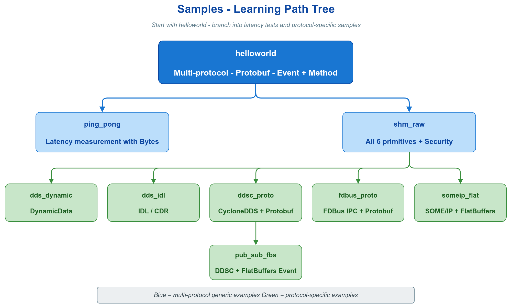

# 📦 samples —— 面向具体传输协议的端到端示例

`samples/` 下每个子目录针对一个或多个具体传输后端提供完整可运行工程。默认 vlink 构建（`ENABLE_EXAMPLES=ON` 且不带 `ENABLE_EXAMPLES_ALL`）仅编译这一组，因为这里的示例代表可直接部署的最小工程。

## 📑 样例索引

| 示例 | 传输 | 序列化 | 通信模型 | 说明 |
|------|------|--------|----------|------|
| [helloworld](helloworld/) | 多后端可切换（dds / ddsc / shm / someip / fdbus） | Protobuf | Method + Event | API 覆盖最广，环境变量切换后端，推荐入口 |
| [ping_pong](ping_pong/) | 多后端可切换 | Bytes（raw） | Event（双向） | 跨进程 Round-trip 延迟测量 |
| [shm_raw](shm_raw/) | `shm://` | Bytes | Method + Event + Field + Security | 单进程内全部六原语 + 加密 |
| [someip_flat](someip_flat/) | `someip://` | FlatBuffers | Method + Event + Field | AUTOSAR Adaptive / 车载以太网场景 |
| [ddsc_proto](ddsc_proto/) | `ddsc://` | Protobuf | Method + Event | CycloneDDS + Protobuf 单进程演示 |
| [dds_dynamic](dds_dynamic/) | `dds://` | DynamicData | Method + Event | 同一话题上传输异构类型消息 |
| [fdbus_proto](fdbus_proto/) | `fdbus://` | Protobuf | Method + Event + Field | FDBus 三模型，`?event=` 区分话题 |
| [pub_sub_fbs](pub_sub_fbs/) | `ddsc://` | FlatBuffers | Event | 发布端 `UserT` / 订阅端零拷贝 `User*` |
| [dds_idl](dds_idl/) | `dds://` | CDR | Method + Event | FastDDS 原生 IDL 类型互操作（默认禁用） |

> ⚠️ `dds_idl` 默认不构建：`CMakeLists.txt` 中 `# add_subdirectory(dds_idl)` 处于注释状态，因为需本地安装 FastDDS 与 `fastddsgen` 工具链。启用步骤见 [dds_idl/README.md](dds_idl/README.md)。

## 🧩 共享 helper

`common_transport.h` 提供 `Common::get_transport_url(env_var, transport_env, topic, someip_url="")`：根据环境变量返回对应传输的 URL，统一处理多种传输的 URL 形式。

`helloworld/helloworld_common.h` 与 `ping_pong/ping_pong_common.h` 是它的薄封装，分别暴露 `get_method_url` / `get_event_url` 与 `get_ping_url` / `get_pong_url`。

## ⚙️ 环境变量

`helloworld` 与 `ping_pong` 通过环境变量切换传输后端，用同一份代码验证不同传输：

| 示例 | 变量 | 取值 | 默认 |
|------|------|------|------|
| helloworld | `METHOD_TRANSPORT` / `EVENT_TRANSPORT` | `dds` / `ddsc` / `shm` / `someip` / `fdbus` | `dds` |
| helloworld | `METHOD_URL` / `EVENT_URL` | 完整 URL | 未设（覆盖 TRANSPORT） |
| ping_pong | `PING_TRANSPORT` / `PONG_TRANSPORT` | 同上 | `dds` |
| ping_pong | `PING_URL` / `PONG_URL` | 完整 URL | 未设 |

## 🚌 各后端前置守护进程

| 后端 | 守护进程 |
|------|----------|
| `dds://` / `ddsc://` | 无 |
| `shm://` | `iox-roudi`（Iceoryx RouDi） |
| `someip://` | 无守护进程；需安装 OpenSOMEIP 并正确配置 IP/端口 |
| `fdbus://` | `name_server` |
| `mqtt://` | MQTT broker（如 Mosquitto） |

## 🛠️ 构建

```bash
cd /work/vlink
cmake -DCMAKE_BUILD_TYPE=Release -DENABLE_EXAMPLES=ON -B build -S .
cmake --build build -j$(nproc)
ls build/output/bin/sample_*
```

缺少依赖的 sample 自动跳过（CMakeLists 用 `find_package` + `return()` 守卫），不会导致全量构建失败。

## 📖 推荐阅读顺序

1. `helloworld/` —— API 覆盖最广，可切换多种后端，建议优先阅读。
2. `ping_pong/` —— Bytes 原始数据 + Round-trip 延迟测量。
3. `shm_raw/` —— shm 后端 + Security + 六种通信原语全集。
4. `someip_flat/` —— SOME/IP + FlatBuffers 车载场景。
5. 其余样例（`ddsc_proto` / `dds_dynamic` / `fdbus_proto` / `pub_sub_fbs` / `dds_idl`）按所用传输后端与序列化方式按需查阅。

## 🖼️ 配图



图中展示各 sample 在传输 / 序列化 / 通信模型三个维度上的覆盖关系。

## 🔗 参考

- 顶层 `examples/README.md` —— 示例总览
- 快速开始：[doc/01-started.md](../../doc/01-started.md)
- 传输后端与 URL：[doc/04-transport.md](../../doc/04-transport.md)
- `include/vlink/modules/` —— 各传输模块头文件
