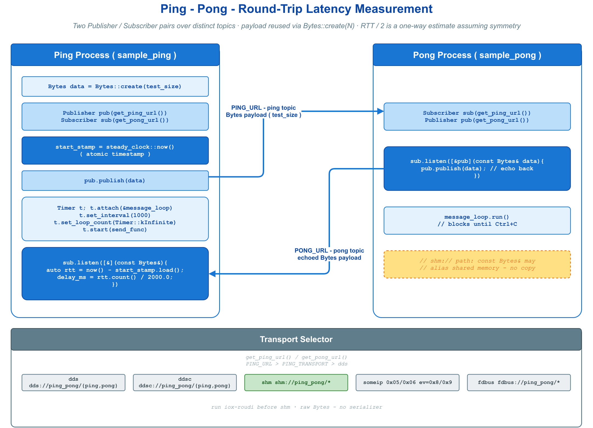

# 🏓 ping_pong —— 跨进程 Round-trip 延迟测量

经典 ping / pong：Ping 端发包并记录时间戳，收到 echo 时计算 RTT；Pong 端原样回送。采用原始 `Bytes`（无序列化开销）使延迟数字最纯净，并可通过环境变量切换后端对比延迟。



## 🧩 核心 API

| API | 用途 |
|-----|------|
| `Publisher<Bytes>` / `Subscriber<Bytes>` | 一对单向 Bytes 通道（ping、pong 各一对） |
| `pub.publish(data)` | 发送原始字节；普通 `Bytes` 在 SHM 后端会复制进 transport loan |
| `sub.listen(cb)` | 注册收包回调（回调入参仅回调内有效） |
| `Bytes::create(n)` | 预分配定长缓冲，复用以排除分配抖动 |
| `Timer` + `MessageLoop` | 定时重发；`run()` 驻留、`quit()` 退出 |

## ⚡ 最小用法

Ping 端（发送 + 测量）：

```cpp
vlink::Publisher<vlink::Bytes> pub(Common::get_ping_url());
vlink::Subscriber<vlink::Bytes> sub(Common::get_pong_url());

std::atomic<std::chrono::steady_clock::time_point> start = std::chrono::steady_clock::now();

sub.listen([&start](const vlink::Bytes&) {
  auto us = std::chrono::duration_cast<std::chrono::microseconds>(
                std::chrono::steady_clock::now() - start.load()).count();
  CLOG_D("Delay(ms) = %.3lf.", us / 2000.0);  // RTT / 2 单向估计（假设路径对称）
});

vlink::Bytes data = vlink::Bytes::create(test_size);  // 预分配一次，循环复用
// Timer 每 1000ms：start = now(); pub.publish(data);
```

Pong 端只需一行 echo：

```cpp
sub.listen([&pub](const vlink::Bytes& data) { pub.publish(data); });  // 原样回送
```

`steady_clock` 单调，不受 NTP 跳变影响；`std::atomic<time_point>` 用于 Timer 线程写、回调线程读的安全交接。

## 🚀 运行与切换后端

```bash
./build/output/bin/sample_pong &     # 先启动 pong
./build/output/bin/sample_ping 4096  # payload 字节数，默认 1024
```

| 环境变量 | 取值 |
|----------|------|
| `PING_TRANSPORT` / `PONG_TRANSPORT` | `dds` / `ddsc` / `shm` / `someip` / `fdbus` |
| `PING_URL` / `PONG_URL` | 完整 URL（覆盖 TRANSPORT） |

`shm://` 运行依赖 `iox-roudi`。本例通过 `Bytes::create()` 创建普通缓冲区，SHM 发布时仍会复制到 transport loan；若要验证零拷贝路径，应改用 `loan()` 并按发布结果归还所有权。多数 topic 型后端可替换 scheme，SOME/IP 等专用后端还需要符合其地址格式。

## 🧭 模型选择

| 场景 | 模型 |
|------|------|
| 测延迟、要最低开销、无需序列化 | 本示例（Event + 原始 `Bytes`） |
| 要请求 / 应答语义（自动配对、超时） | Method 模型 `Client` / `Server`，见 `../helloworld/` |

## 🔗 参考

- `../helloworld/` —— Method + Event 综合示例
- `../shm_raw/` —— Bytes + Security 在 shm 上
- 顶层 [`examples/README.md`](../../README.md) —— 示例总览
