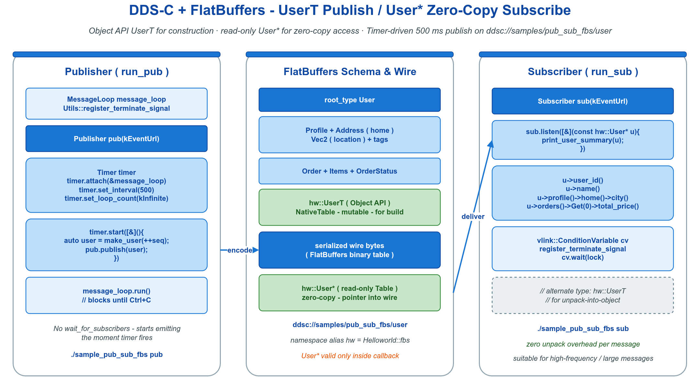

# 🪶 pub_sub_fbs —— CycloneDDS + FlatBuffers Pub/Sub

事件模型样例，展示 VLink 处理 FlatBuffers 的标准模式：发布端用 Object API（`UserT`），订阅端用零拷贝指针（`User*`）。

- `UserT`（NativeTable / Object API）：可读可写的值类型；发布端填充字段后传给 `publish`，框架自动序列化。
- `User*`（只读 table 指针）：直接指向 wire 缓冲，零拷贝读取，仅在回调内有效。



## 🧩 核心 API

```cpp
// 订阅端：零拷贝指针
vlink::Subscriber<hw::User*> sub("ddsc://samples/pub_sub_fbs/user");
sub.listen([](const hw::User* user) {
  VLOG_I(user->user_id());                       // 指针仅回调内有效
});

// 发布端：Object API（NativeTable）
vlink::Publisher<hw::UserT> pub("ddsc://samples/pub_sub_fbs/user");
hw::UserT u;
u.user_id = 1;
u.nickname = "alice";
pub.publish(u);                                  // 框架自动序列化
```

`hw` 是 `Helloworld` 命名空间的别名（生成代码采用 `helloworld.fbs` 的 namespace）。

## 📊 类型对照

| 类型 | 形式 | 用途 |
|------|------|------|
| `hw::UserT` | NativeTable / Object API | 填充 / 修改要发送的值 |
| `hw::User*` | 只读 table 指针 | 零拷贝订阅读取（仅回调内有效） |

## 🔍 行为要点

1. FlatBuffers 被框架自动识别，无需手动设置序列化类型。
2. 发布端立即开始发送，FlatBuffers 路径下 CycloneDDS 提供的语义已满足，无需 `wait_for_subscribers`。
3. 序列号 `seq` 使 `user_id` / `nickname` / `order` 等字段逐周期变化，订阅端看到的是消息流而非固定包。
4. `User*` 指针仅回调内有效；需长期保留时复制到 `UserT`。

## 📦 文件

```
pub_sub_fbs/
  pub_sub_fbs.cc         # main，角色由 argv[1] 选择
  fbs/helloworld.fbs     # User / Profile / Order / Item / Vec2 schema
```

## 🚀 运行

```bash
./build/output/bin/sample_pub_sub_fbs sub   # 终端 1
./build/output/bin/sample_pub_sub_fbs pub   # 终端 2，每 500ms 发布一条
```

## 🧭 FlatBuffers 与 Protobuf 选型

| 维度 | FlatBuffers | Protobuf |
|------|-------------|----------|
| 解析速度 | 零拷贝，无 parse | 需 parse |
| 编码速度 | 中等 | 中等 |
| 文件大小 | 较小 | 较小 |
| 跨语言支持 | 多语言 | 多语言 |
| 工具链生态 | 较少 | 庞大 |
| schema 演进 | 优秀 | 优秀 |
| 大对象（视频、图） | 优秀（零拷贝读） | 一般 |

VLink 两者均支持，按工程偏好择一。

## ⚠️ 常见陷阱

1. `User*` 指针逸出作用域使用：UAF；需 deepcopy 到 `UserT` 或在回调内处理完即丢。
2. 发布端误用 `User*`：发布端必须用 NativeTable `UserT`。
3. schema 不一致：`.fbs` 改动后未重新生成，新旧字段不兼容。
4. 未启用 CycloneDDS：编译缺 `vlink::ddsc` 组件；可将 URL 改为 `dds://` 走 FastDDS。
5. 大消息分片：DDS 默认 MTU 限制；大对象需调 `fragment_size` 或改用 shm。

## 🧪 扩展练习

- 将 `ddsc://` 换为 `dds://`，对比两种 DDS 后端。
- 将订阅端改为 `Subscriber<hw::UserT>`，观察 unpacked-object 形式（拷贝出独立对象，性能略低）。
- 给 schema 增加 Order 字段，观察生成代码与用法差异。

## 🔧 依赖

- `vlink::ddsc`（CycloneDDS 后端）、FlatBuffers
- `vlink_generate_cpp(FBS ${FBS_SRCS})` CMake helper：调用 `flatc` 生成 `helloworld.fbs.hpp`

## 🔗 参考

- `../helloworld/` —— Protobuf 对照
- `../someip_flat/` —— FlatBuffers + SOME/IP 后端
- 序列化机制：[doc/03-serialization.md](../../../doc/03-serialization.md)
- FlatBuffers 官方文档：https://flatbuffers.dev/
