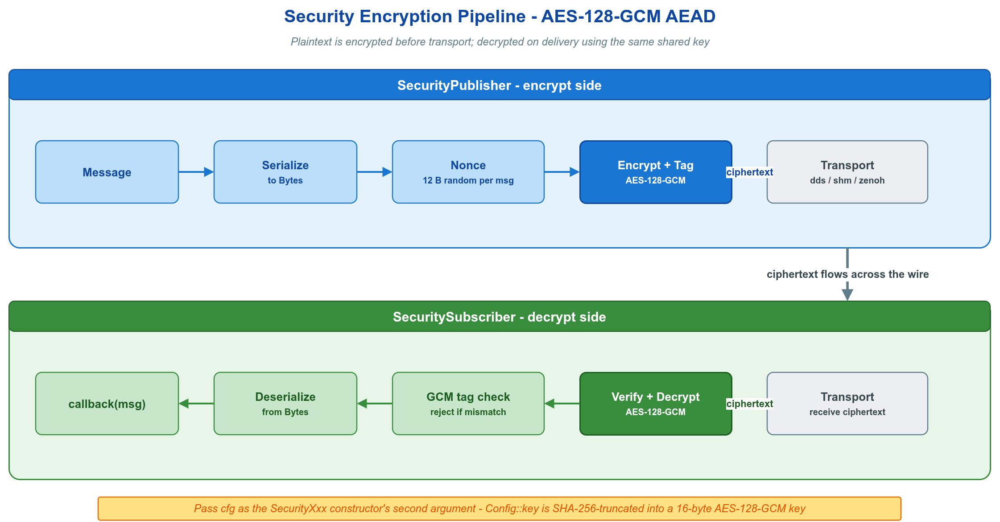

# 🔒 security_basic — 内置 AES-128-GCM 端到端加密

`SecurityPublisher` / `SecuritySubscriber` 透明加解密消息：构造时附加一个 `Security::Config`，`publish()` / `listen()` 背后自动完成 AEAD 认证加密。两端配置一致才能解出明文，否则订阅回调静默不触发（fail-closed）。



## 🧩 核心 API

| API | 用途 |
|-----|------|
| `vlink::SecurityPublisher<T>(url, cfg)` | 加密版 `Publisher<T>` |
| `vlink::SecuritySubscriber<T>(url, cfg)` | 解密版 `Subscriber<T>` |
| `Security::Config::key` | 对称密钥种子（两端相同即可） |
| `Security::Config::passphrase` + `pbkdf2_salt` + `pbkdf2_iterations` | 口令派生密钥（PBKDF2） |

## 🚀 最小示例

```cpp
// 对称密钥：两端共享同一种子
vlink::Security::Config cfg;
cfg.key = "my-secret-key-16";

vlink::SecuritySubscriber<std::string> sub("dds://security_basic/raw_key", cfg);
sub.listen([](const std::string& msg) { VLOG_I("Received: ", msg); });

vlink::SecurityPublisher<std::string> pub("dds://security_basic/raw_key", cfg);
pub.wait_for_subscribers();
pub.publish("Hello with AES-128-GCM!");
```

口令派生只需把 `key` 换成口令三件套（两端的口令、盐、迭代次数必须一致）：

```cpp
cfg.passphrase = "correct horse battery staple";
cfg.pbkdf2_salt = vlink::Bytes::from_string("vlink-example-salt-v1");
cfg.pbkdf2_iterations = 200000U;
```

## 🎯 适用场景

跨进程 / 多语言 / 需逐条消息完整性的场景适用本扩展；单进程 `intra://` 无需加密。需要非对称密钥分发或自定义算法时，改用 `Config::public_key_pem` + `private_key_pem`（RSA-OAEP）或 `encrypt_callback` + `decrypt_callback`（自定义 / HSM）。

## 📚 参考

- `include/vlink/extension/security.h` — `Security` 与 `Security::Config`
- `doc/07-security.md` — 加密章节完整说明
- `examples/README.md` — 全部示例索引
