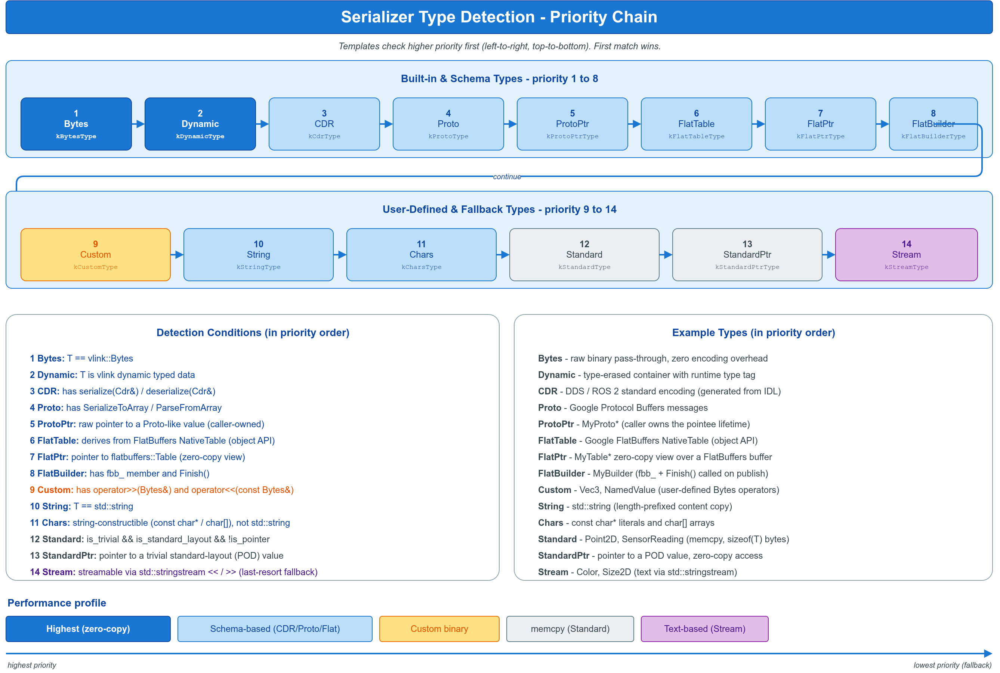

# 🧩 serialization — 自动序列化派发

VLink 的通信原语 `Publisher<T>` / `Subscriber<T>` / `Client<Req,Resp>` / `Server<Req,Resp>` / `Setter<T>` / `Getter<T>` 均为模板类，模板参数 `T` 在编译期决定序列化策略。应用层只需提供消息类型，框架自动选择编解码路径，无需编写任何序列化代码。本类目以最小示例呈现这一编译期类型派发机制。

## 📁 子示例索引

| 示例 | 主题 | 关键 API |
|------|------|---------|
| [`basic_types/`](basic_types/) | `Bytes`、`std::string`、POD 结构三种无需代码生成的基础路径 | `Publisher<T>`、`Subscriber<T>`、`Bytes` |

## ⚙️ 序列化路径对照

下表汇总框架支持的序列化路径及其工程权衡，便于按场景选型。`basic_types/` 覆盖前三类；Protobuf、FlatBuffers、CDR 等需要外部工具链的路径见各样例。

| 路径 | 编码开销 | 跨语言 | 适用场景 | 示例 |
|------|---------|--------|---------|------|
| `Bytes` | 零 | 不直接（自定义协议） | 自定义二进制协议、性能极致路径 | [`basic_types/`](basic_types/) |
| `std::string` | 直接复制 payload | 强（UTF-8 文本） | JSON、命令、日志 | [`basic_types/`](basic_types/) |
| POD struct | 零（含 padding） | 弱（ABI 依赖） | 同机同 ABI、高性能 | [`basic_types/`](basic_types/) |
| Protobuf | 中等 | 强 | 跨语言、向后兼容 | [`../samples/helloworld/`](../samples/helloworld/) |
| FlatBuffers | 低 | 强 | 大对象、零拷贝读取 | [`../samples/someip_flat/`](../samples/someip_flat/) |
| CDR | 中等 | 强（DDS 标配） | DDS 互通 | 见 `doc/03-serialization.md` |

## 🖼️ 配图

上图位于 `basic_types/images/`，给出框架在编译期由消息类型链式选定序列化路径的判定流程，建议结合 `basic_types/README.md` 一起阅读。

## 📚 相关文档

- [`../quickstart/`](../quickstart/) — VLink 三种通信原语的基础用法。
- [`../base/bytes_basic/`](../base/bytes_basic/) — `vlink::Bytes` 的完整 API；自定义编码几乎一定会用到。
- 顶层 `doc/03-serialization.md` — 序列化机制全景与类型支持。
- [`../samples/helloworld/`](../samples/helloworld/) — Protobuf 序列化端到端样例。
- [`../samples/someip_flat/`](../samples/someip_flat/) — FlatBuffers 序列化端到端样例。
