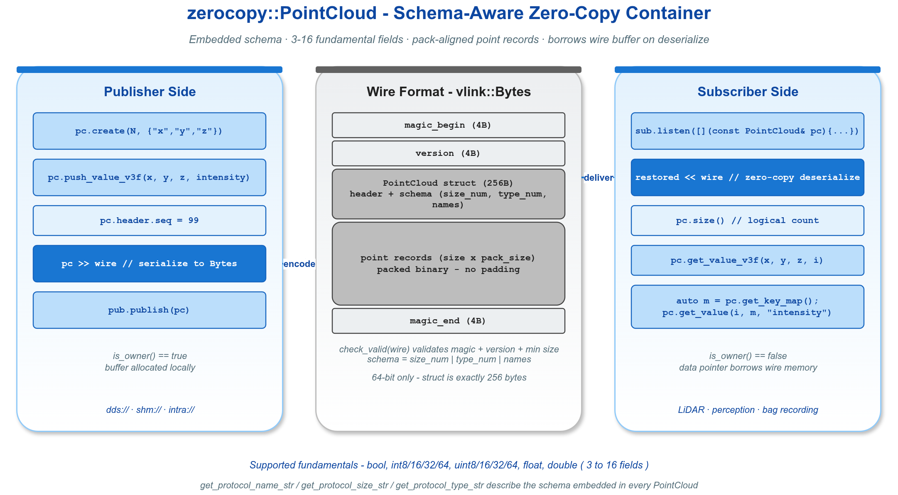

# zerocopy_point_cloud — LiDAR 风格变长 schema 点云容器

`vlink::zerocopy::PointCloud` 是 vlink 内置的点云零拷贝容器，支持**变长 schema**：每个 point 的字段由模板参数定义（如 `<float, float, float>` 表示 XYZ，`<float, float, float, uint8_t>` 表示 XYZ + intensity）。容器在固定大小的 header 里嵌入字段类型列表，wire 格式自描述。

读完本示例你能掌握：

- `create<T...>` 与 `create_v3f` 两种模板构造方式。
- 按字段 push / set / get 的 API。
- schema 自描述格式（protocol type/size 字符串、key_map 字典）。
- 序列化 round-trip 行为（is_owner 翻转）。
- 可选压缩存储：`create` 的 `extent` / `vertical` 参数启用值域量化（XYZ→int16）与垂直 SoA 排布。

## 背景与适用场景

适用：

- 多种 LiDAR 数据格式（XYZ、XYZI、XYZIRGB、自定义传感器）。
- 需要 schema 自描述、跨语言互通的点云通信。
- 高频大数据点云的 SHM 零拷贝传递。

不适合：

- 单一固定 schema 的项目（用普通 struct + Bytes 更简单）。
- 极高密度（百万点 @ 30Hz）必须用 SHM 后端，不要走 dds 序列化。

PointCloud 的字段 schema 编码进容器 header 的 256 字节里：通过 enum 标记每个字段的类型（Float / Double / Uint8 / …）和 name 字符串。接收端按 schema 自描述就能解析任意点云格式。

## 核心 API

| API | 签名 | 说明 |
|-----|------|------|
| `PointCloud::create` | `template <typename... T> bool create(size_t max_points, const std::vector<std::string>& names = {}, uint16_t extent = 0, bool vertical = false)` | 自定义 schema（可选压缩/垂直排布） |
| `PointCloud::create_v3f` | `template <typename... Extra> bool create_v3f(size_t max_points, const std::vector<std::string>& extras = {}, uint16_t extent = 0, bool vertical = false)` | XYZ float32 + 额外字段 |
| `PointCloud::create_v3d` | 同上（XYZ 为 float64） | XYZ float64 + 额外字段 |
| `push_value<T...>` | `bool push_value(T... args)` | 追加一个点 |
| `push_value_v3f` | `bool push_value_v3f(float x, float y, float z, Extra... args)` | XYZ + extra |
| `set_value_v3f` | `bool set_value_v3f(size_t idx, float x, float y, float z, Extra... args)` | 覆盖指定索引 |
| `get_value_v3f` | `Vector3f get_value_v3f(size_t idx) const` | 读 XYZ（量化时自动反量化） |
| `get_value<T>` | `T get_value(size_t idx, KeyMap& key_map, std::string_view name) const` | 按字段名读 |
| `get_key_map` | `key_map_t get_key_map() const` | 字段名→索引字典 |
| `get_protocol_name_str` | `std::string` | 字段名 schema |
| `get_protocol_type_str` | `std::string` | 字段类型 schema |
| `size` / `capacity` / `resize` | const / mut | 当前 / 最大点数 |
| `downsample` | `bool (uint8_t level)` | 体素栅格降采样（仅量化 owned 点云，level 0~255，0 为 no-op；折叠近邻点并缩减 size） |
| `get_extent` / `get_vertical` / `get_downsample` | `uint16_t` / `bool` / `uint8_t` const | 读取当前压缩配置（0 / false 表示关闭） |
| `operator>>` / `operator<<` | const / mut | 与 Bytes 互转 |
| `is_owner` | `bool` | 是否拥有底层内存 |

## 代码导读

### 1. 自定义 XYZ schema

```cpp
vlink::zerocopy::PointCloud cloud;
cloud.create<float, float, float>(/*max_points=*/100, {"x", "y", "z"});

cloud.push_value<float, float, float>(1.0F, 2.0F, 3.0F);
cloud.push_value<float, float, float>(4.0F, 5.0F, 6.0F);

VLOG_I("size=", cloud.size(), " capacity=", cloud.capacity());

auto [x, y, z] = cloud.get_value_v3f(0);
VLOG_I("point[0]: ", x, ",", y, ",", z);
```

### 2. XYZ + intensity

```cpp
cloud.create_v3f<float>(/*max_points=*/256, {"intensity"});
cloud.push_value_v3f(1.0F, 2.0F, 3.0F, /*intensity=*/0.5F);
cloud.push_value_v3f(4.0F, 5.0F, 6.0F, 0.8F);

auto [x, y, z, i] = cloud.get_value_v3f(0);
```

### 3. schema 自描述

```cpp
VLOG_I("protocol_name: ", cloud.get_protocol_name_str());   // "x,y,z,intensity"
VLOG_I("protocol_type: ", cloud.get_protocol_type_str());   // "f32,f32,f32,f32"

auto key_map = cloud.get_key_map();   // {"x":0, "y":1, "z":2, "intensity":3}
float i_value = cloud.get_value<float>(0, key_map, "intensity");
```

### 4. 序列化 round-trip

```cpp
vlink::Bytes wire;
cloud >> wire;

vlink::zerocopy::PointCloud restored;
restored << wire;
VLOG_I("restored size=", restored.size(), " owner=", restored.is_owner());
// is_owner == false: data borrows from wire
```

### 5. resize + 覆盖

```cpp
cloud.resize(10);
cloud.set_value_v3f(5, 99.0F, 88.0F, 77.0F, 0.9F);
```

### 6. pub/sub 跨进程

```cpp
vlink::Publisher<vlink::zerocopy::PointCloud> pub("dds://lidar/scan");
vlink::Subscriber<vlink::zerocopy::PointCloud> sub("dds://lidar/scan");
sub.listen([](const vlink::zerocopy::PointCloud& pc) {
  VLOG_I("got cloud size=", pc.size(), " protocol=", pc.get_protocol_name_str());
});
```

实际生产中用 `shm://` 后端才能享受零拷贝；本示例用 `dds://` 是为了脱离 RouDi 也能跑通。

### 7. double 精度版本

```cpp
vlink::zerocopy::PointCloud big;
big.create_v3d<double>(100, {"weight"});
big.push_value_v3d(1.0, 2.0, 3.0, 0.5);
auto [x, y, z, w] = big.get_value_v3d(0);
```

### 8. 压缩存储（值域量化 + 垂直排布）

`create(..., extent, vertical)` 用精度换存储/带宽，两个维度互相独立、默认
`0` / `false` 表示关闭：

- `extent > 0`：`extent` 是点云的**最大坐标绝对值（值域上界）**。XYZ 由 `float` 改为定点
  `int16` 存储，使用 `vlink::Quantize::encode<int16_t>(extent, value)` 在
  `[-extent, +extent]` 线性量化（正常范围内等价于 `stored = round(v * 32767 / extent)`），
  `pack_size` 缩小（纯 XYZ 由 12 字节降到 6 字节）。`get_value_v3f/v3d` 自动反量化，通用
  `get_value<T>` 返回原始 `int16`。分辨率为 `extent / 32767`；任一 XYZ 坐标落在开区间
  `(-extent, +extent)` 之外的点会被**丢弃**（push/set 返回 `false`），不再做饱和钳位。
- `vertical = true`：仅序列化时把 payload 整体重排为 SoA 列存储（`xx..x yy..y zz..z`），更利于
  下游压缩；`operator<<` 反序列化时还原为内存交错布局（此时不再是零拷贝借用）。

```cpp
vlink::zerocopy::PointCloud cloud;
cloud.create_v3f<float>(1000, {"intensity"}, /*extent=*/10, /*vertical=*/true);
VLOG_I("pack_size=", cloud.pack_size());                 // 10 = 3*2 + 1*4

cloud.push_value_v3f(1.234F, 5.678F, 9.012F, 0.5F);

vlink::Bytes wire;
cloud >> wire;

vlink::zerocopy::PointCloud rx;
rx << wire;
auto v = rx.get_value_v3f(0);                            // 自动反量化回 ≈(1.234, 5.678, 9.012)
```

## 运行

```bash
./build/output/bin/example_zerocopy_point_cloud
```

预期输出（节选）：

```
=== XYZ schema ===
size=2 capacity=100
point[0]: 1,2,3
=== XYZ + intensity ===
intensity[0]=0.5
=== schema description ===
protocol_name: x,y,z,intensity
protocol_type: f32,f32,f32,f32
=== round-trip ===
restored size=2 owner=0
=== resize + set ===
ok
=== pub/sub ===
got cloud size=N protocol=x,y,z,intensity
=== v3d ===
double point: 1, 2, 3, 0.5
=== create extent + vertical ===
pack_size=10
restored point[0]: 1.234, 5.678, 9.012 extent=10 vertical=1
```

## 常见陷阱

1. **超过 max_points**：push_value 行为按实现可能拒绝或扩容；先 capacity() 检查。
2. **schema 不匹配的反序列化**：接收方 PointCloud 接收任意 schema；调用方按 key_map 拿字段才安全。
3. **字段名重复 / 超长**：name 字符串嵌入 header 总空间有限；保持简短（≤ 8 字符）。
4. **get_value_v3f 在 XYZ 之外的 schema**：只取前三字段；按模板参数推断的字段数量。
5. **resize 不扩容**：只能缩到 ≤ size；要扩容需要新 create。

## 设计要点

- header 内 schema 类型用 enum (`kFloat / kDouble / kUint8 / ...`) 紧凑编码；wire 格式自描述。
- push_value 按 schema 列字段顺序写入，避免对齐 padding。
- `is_owner == false` 在零拷贝路径下是常态；不要试图重新分配 / move。

## 配图



图中展示 PointCloud 的 256 字节 header（含 schema 描述）+ payload 区域的整体布局。

## 参考

- `../zerocopy_basic/` — loan + RawData 基础
- `../zerocopy_camera_frame/` — 摄像头帧
- `vlink/include/vlink/zerocopy/point_cloud.h` — PointCloud 接口
- 顶层 `doc/10-zerocopy.md` — 零拷贝机制
